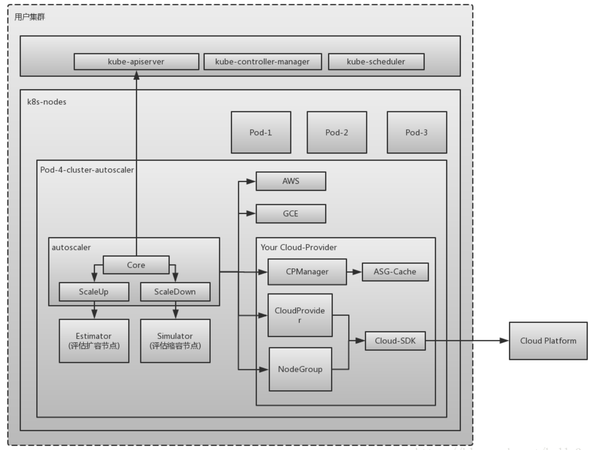
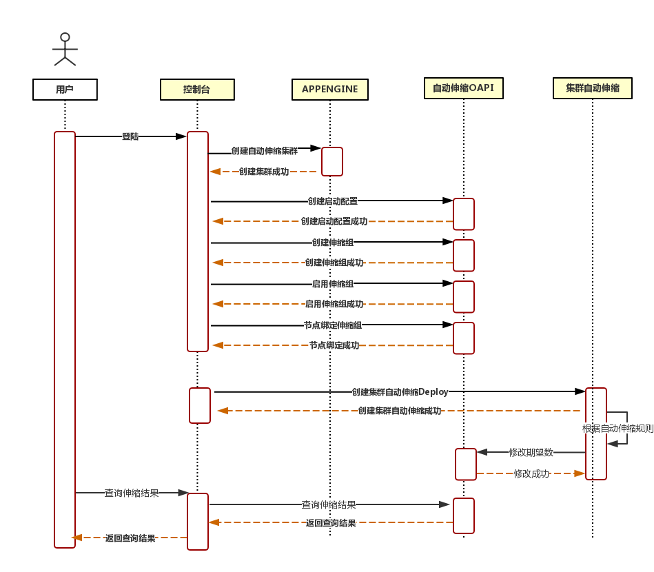

# 背景

Kubernetes服务简化了K8S集群的创建、升级和手动扩缩容。然而使用Kubernetes集群经常问到的一个问题是，我应该保持多大的节点规模来满足应用需求呢？ Autoscaler的出现解决了这个问题，它可以自动的根据部署的应用所请求的资源量来动态的伸缩集群

# 名词解释

 cluster-autoscaler (简称CA)是用来弹性伸缩kubernetes集群的。我们在使用kubernetes集群经常问到的一个问题是，我应该保持多大的节点规模来满足应用需求呢？ cluster-autoscaler的出现解决了这个问题，它可以自动的根据部署的应用所请求的资源量来动态的伸缩集群。

 <!-- more -->

# 架构

>- Autoscaler：核心模块，负责整体扩缩容功能
>- Estimator：负责评估计算扩容节点
>- Simulator：负责模拟调度，计算缩容节点
>- CA Cloud-Provider：与云交互进行节点的增删操作。社区目前仅支持AWS和GCE，其他云厂商需要自己实现CloudProvider和NodeGroup相关接口。

## CA的架构如下图所示：



## 设计思路

实现流程设计



>1. 用户登陆创建自动伸缩集群
>2. 创建kubernetes集群成功后，调用伸缩组的OpenAPI，创建启动配置
>3. 创建自动伸缩组
>4. 启用自动伸缩组
>5. 集群节点绑定伸缩组
>6. 创建集群自动伸缩的Deployment（CA）
>7. CA根据Pending Pod数伸缩节点

## 实现

实现CloudProvider和NodeGroup相关接口

```go
type CloudProvider interface {
   // Name returns name of the cloud provider.
   Name() string
 
   // NodeGroups returns all node groups configured for this cloud provider.
   NodeGroups() []NodeGroup
 
   // NodeGroupForNode returns the node group for the given node, nil if the node
   // should not be processed by cluster autoscaler, or non-nil error if such
   // occurred. Must be implemented.
   NodeGroupForNode(*apiv1.Node) (NodeGroup, error)
 
   // Pricing returns pricing model for this cloud provider or error if not available.
   // Implementation optional.
   Pricing() (PricingModel, errors.AutoscalerError)
 
   // GetAvailableMachineTypes get all machine types that can be requested from the cloud provider.
   // Implementation optional.
   GetAvailableMachineTypes() ([]string, error)
 
   // NewNodeGroup builds a theoretical node group based on the node definition provided. The node group is not automatically
   // created on the cloud provider side. The node group is not returned by NodeGroups() until it is created.
   // Implementation optional.
   NewNodeGroup(machineType string, labels map[string]string, systemLabels map[string]string,
      taints []apiv1.Taint, extraResources map[string]resource.Quantity) (NodeGroup, error)
 
   // GetResourceLimiter returns struct containing limits (max, min) for resources (cores, memory etc.).
   GetResourceLimiter() (*ResourceLimiter, error)
 
   // Cleanup cleans up open resources before the cloud provider is destroyed, i.e. go routines etc.
   Cleanup() error
 
   // Refresh is called before every main loop and can be used to dynamically update cloud provider state.
   // In particular the list of node groups returned by NodeGroups can change as a result of CloudProvider.Refresh().
   Refresh() error
}
```

```go
type NodeGroup interface {
   // MaxSize returns maximum size of the node group.
   MaxSize() int
 
   // MinSize returns minimum size of the node group.
   MinSize() int
 
   // TargetSize returns the current target size of the node group. It is possible that the
   // number of nodes in Kubernetes is different at the moment but should be equal
   // to Size() once everything stabilizes (new nodes finish startup and registration or
   // removed nodes are deleted completely). Implementation required.
   TargetSize() (int, error)
 
   // IncreaseSize increases the size of the node group. To delete a node you need
   // to explicitly name it and use DeleteNode. This function should wait until
   // node group size is updated. Implementation required.
   IncreaseSize(delta int) error
 
   // DeleteNodes deletes nodes from this node group. Error is returned either on
   // failure or if the given node doesn't belong to this node group. This function
   // should wait until node group size is updated. Implementation required.
   DeleteNodes([]*apiv1.Node) error
 
   // DecreaseTargetSize decreases the target size of the node group. This function
   // doesn't permit to delete any existing node and can be used only to reduce the
   // request for new nodes that have not been yet fulfilled. Delta should be negative.
   // It is assumed that cloud provider will not delete the existing nodes when there
   // is an option to just decrease the target. Implementation required.
   DecreaseTargetSize(delta int) error
 
   // Id returns an unique identifier of the node group.
   Id() string
 
   // Debug returns a string containing all information regarding this node group.
   Debug() string
 
   // Nodes returns a list of all nodes that belong to this node group.
   Nodes() ([]string, error)
 
   // TemplateNodeInfo returns a schedulercache.NodeInfo structure of an empty
   // (as if just started) node. This will be used in scale-up simulations to
   // predict what would a new node look like if a node group was expanded. The returned
   // NodeInfo is expected to have a fully populated Node object, with all of the labels,
   // capacity and allocatable information as well as all pods that are started on
   // the node by default, using manifest (most likely only kube-proxy). Implementation optional.
   TemplateNodeInfo() (*schedulercache.NodeInfo, error)
 
   // Exist checks if the node group really exists on the cloud provider side. Allows to tell the
   // theoretical node group from the real one. Implementation required.
   Exist() bool
 
   // Create creates the node group on the cloud provider side. Implementation optional.
   Create() error
 
   // Delete deletes the node group on the cloud provider side.
   // This will be executed only for autoprovisioned node groups, once their size drops to 0.
   // Implementation optional.
   Delete() error
 
   // Autoprovisioned returns true if the node group is autoprovisioned. An autoprovisioned group
   // was created by CA and can be deleted when scaled to 0.
   Autoprovisioned() bool
}
```

## CA功能接口

### 创建CA

```yaml
apiVersion: extensions/v1beta1
kind: Deployment
metadata:
  name: cluster-autoscaler
  namespace: kube-system
  labels:
    app: cluster-autoscaler
spec:
  replicas: 1
  selector:
    matchLabels:
      app: cluster-autoscaler
  template:
    metadata:
      labels:
        app: cluster-autoscaler
    spec:
      serviceAccountName: admin
      containers:
        - image: hub.kce.ksyun.com/ksyun/cluster-autoscaler:v1.1.0
          name: cluster-autoscaler
          resources:
            requests:
              cpu: 100m
              memory: 300Mi
          command:
            - ./cluster-autoscaler
            - --v=4
            - --stderrthreshold=info
            - --cloud-provider=alicloud
            - --skip-nodes-with-local-storage=false
            - --nodes=${MIN}:${MAX}:${AUTO_SCALER_GROUP}
            - --nodes=${MIN2}:${MAX2}:${AUTO_SCALER_GROUP2}
```

参数 `${MIN}: ${MAX}: ${AUTO_SCALER_GROUP}`

>- MIN: 伸缩组节点最小值
>- MAX: 伸缩组节点最大值
>- AUTO_SCALER_GROUP: 伸缩组ID

### 修改CA

```yaml
apiVersion: extensions/v1beta1
kind: Deployment
metadata:
  name: cluster-autoscaler
  namespace: kube-system
  labels:
    app: cluster-autoscaler
spec:
  replicas: 1
  selector:
    matchLabels:
      app: cluster-autoscaler
  template:
    metadata:
      labels:
        app: cluster-autoscaler
    spec:
      serviceAccountName: admin
      containers:
        - image: hub.kce.ksyun.com/ksyun/cluster-autoscaler:v1.1.0
          name: cluster-autoscaler
          resources:
            requests:
              cpu: 100m
              memory: 300Mi
          command:
            - ./cluster-autoscaler
            - --v=4
            - --stderrthreshold=info
            - --cloud-provider=alicloud
            - --skip-nodes-with-local-storage=false
            - --nodes=1:100:${AUTO_SCALER_GROUP}
            - --nodes=1:3:${AUTO_SCALER_GROUP2}
```

参数：`${MIN}:${MAX}:${AUTO_SCALER_GROUP}`

>- MIN: 伸缩组节点最小值
>- MAX: 伸缩组节点最大值
>- AUTO_SCALER_GROUP: 伸缩组ID

### 删除CA

```yaml
apiVersion: extensions/v1beta1
kind: Deployment
metadata:
  name: cluster-autoscaler
  namespace: kube-system
  labels:
    app: cluster-autoscaler
spec:
  replicas: 1
  selector:
    matchLabels:
      app: cluster-autoscaler
  template:
    metadata:
      labels:
        app: cluster-autoscaler
    spec:
      serviceAccountName: admin
      containers:
        - image: hub.kce.ksyun.com/ksyun/cluster-autoscaler:v1.1.0
          name: cluster-autoscaler
          resources:
            requests:
              cpu: 100m
              memory: 300Mi
          command:
            - ./cluster-autoscaler
            - --v=4
            - --stderrthreshold=info
            - --cloud-provider=alicloud
            - --skip-nodes-with-local-storage=false
```