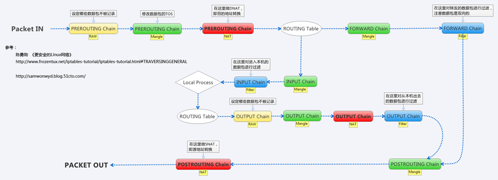

# CNI 架构源码解析

## kubelet cni 源码解析

```bash
# kubelet 使用cni 参数设置
--cni-bin-dir=/opt/cni/bin
--cni-conf-dir=/etc/cni/net.d
```

<!-- more -->

## /opt/cni/bin 目录中插件

>- bridge  
>- cnitool
>- dhcp
>- flannel  
>- host-local
>- ipvlan
>- loopback
>- macvlan
>- noop
>- portmap
>- ptp
>- tuning
>- vlan

## cni 配置文件解析 10-flannel.conflist

```json
{
    "cniVersion": "0.3.1",
    "name": "cni0",
    "plugins": [
        {
            "delegate": {
                "forceAddress": true,
                "isDefaultGateway": true
            },
            "type": "flannel"
        },
        {
            "capabilities": {
                "portMappings": true
            },
            "type": "portmap"
        }
    ]
}
```

```go
// kubernetes/pkg/kubelet/dockershim/network/cni/cni.go
func (plugin *cniNetworkPlugin) addToNetwork(network *cniNetwork, podName string, podNamespace string, podSandboxID kubecontainer.ContainerID, podNetnsPath string, annotations map[string]string) (cnitypes.Result, error) {
	rt, err := plugin.buildCNIRuntimeConf(podName, podNamespace, podSandboxID, podNetnsPath, annotations)
	if err != nil {
		glog.Errorf("Error adding network when building cni runtime conf: %v", err)
		return nil, err
	}

	netConf, cniNet := network.NetworkConfig, network.CNIConfig
    glog.V(4).Infof("About to add CNI network %v (type=%v)", netConf.Name, netConf.Plugins[0].Network.Type)
    // 调用cni 架构接口AddNetworkList
	res, err := cniNet.AddNetworkList(netConf, rt)
	if err != nil {
		glog.Errorf("Error adding network: %v", err)
		return nil, err
	}

	return res, nil
}

func (plugin *cniNetworkPlugin) deleteFromNetwork(network *cniNetwork, podName string, podNamespace string, podSandboxID kubecontainer.ContainerID, podNetnsPath string, annotations map[string]string) error {
	rt, err := plugin.buildCNIRuntimeConf(podName, podNamespace, podSandboxID, podNetnsPath, annotations)
	if err != nil {
		glog.Errorf("Error deleting network when building cni runtime conf: %v", err)
		return err
	}

	netConf, cniNet := network.NetworkConfig, network.CNIConfig
    glog.V(4).Infof("About to del CNI network %v (type=%v)", netConf.Name, netConf.Plugins[0].Network.Type)
    // 调用cni 架构接口 DelNetworkList
	err = cniNet.DelNetworkList(netConf, rt)
	// The pod may not get deleted successfully at the first time.
	// Ignore "no such file or directory" error in case the network has already been deleted in previous attempts.
	if err != nil && !strings.Contains(err.Error(), "no such file or directory") {
		glog.Errorf("Error deleting network: %v", err)
		return err
	}
	return nil
}
```

## containernetworking/cni 源码解析

```go
// github.com/containernetworking/cni/libcni/api.go
type CNI interface {
	AddNetworkList(net *NetworkConfigList, rt *RuntimeConf) (types.Result, error)
	DelNetworkList(net *NetworkConfigList, rt *RuntimeConf) error

	AddNetwork(net *NetworkConfig, rt *RuntimeConf) (types.Result, error)
	DelNetwork(net *NetworkConfig, rt *RuntimeConf) error
}

```

```json
{
    "cniVersion": "0.3.1",
    "name": "cni0",
    "plugins": [
        {
            "delegate": {
                "forceAddress": true,
                "isDefaultGateway": true
            },
            "type": "flannel"
        },
        {
            "capabilities": {
                "portMappings": true
            },
            "type": "portmap"
        }
    ]
}
```

```go
// AddNetworkList executes a sequence of plugins with the ADD command
func (c *CNIConfig) AddNetworkList(list *NetworkConfigList, rt *RuntimeConf) (types.Result, error) {
	var prevResult types.Result
	for _, net := range list.Plugins {
		pluginPath, err := invoke.FindInPath(net.Network.Type, c.Path)
		if err != nil {
			return nil, err
		}

		newConf, err := buildOneConfig(list, net, prevResult, rt)
		if err != nil {
			return nil, err
		}

		prevResult, err = invoke.ExecPluginWithResult(pluginPath, newConf.Bytes, c.args("ADD", rt))
		if err != nil {
			return nil, err
		}
	}

	return prevResult, nil
}
```

>1. AddNetworkList 从上至下调用10-flannel.conflist 中plugins 中type 字段的命令
>2. AddNetworkList 调用 /opt/cni/bin/flannel 命令
>3. AddNetworkList 调用 /opt/cni/bin/portmap 命令

```go
// DelNetworkList executes a sequence of plugins with the DEL command
func (c *CNIConfig) DelNetworkList(list *NetworkConfigList, rt *RuntimeConf) error {
	for i := len(list.Plugins) - 1; i >= 0; i-- {
		net := list.Plugins[i]

		pluginPath, err := invoke.FindInPath(net.Network.Type, c.Path)
		if err != nil {
			return err
		}

		newConf, err := buildOneConfig(list, net, nil, rt)
		if err != nil {
			return err
		}

		if err := invoke.ExecPluginWithoutResult(pluginPath, newConf.Bytes, c.args("DEL", rt)); err != nil {
			return err
		}
	}

	return nil
}
```

>1. DelNetworkList 从下至上调用10-flannel.conflist 中plugins 中type 字段的命令
>2. DelNetworkList 调用 /opt/cni/bin/portmap 命令
>3. DelNetworkList 调用 /opt/cni/bin/flannel 命令

## /opt/cni/bin/flannel 命令 源码解析

```go
// github.com/containernetworking/cni/plugins/plugins/meta/flannel/flannel.go
func main() {
	skel.PluginMain(cmdAdd, cmdDel, version.All)
}
```

>1. flannel 命令接受ADD, DEL， VERSION 命令行参数
>2. cni 插件接口只需实现ADD， DEL, VERSION 三方法即可

/opt/cni/bin/flanel 命令所支持配置文件字段如下：

```bash
# /run/flannel/subnet.env 文件为flanneld 服务启动时候生成
cat /run/flannel/subnet.env
FLANNEL_NETWORK=172.28.0.0/14
FLANNEL_SUBNET=172.28.2.1/24
FLANNEL_MTU=1500
FLANNEL_IPMASQ=true
```

```json
   {
        "delegate": {
            "cniVersion": "3.0.1",
            "type": "bridge",
            "ipMasq": true,
            "mtu": 1472,
            "forceAddress": true,
            "isDefaultGateway": true,
            "ipam": {
                "type": "host-local",
                "subnet": "172.28.2.1/24",
                "routes": [{"Dst": "172.28.0.0/14", "Gw": ""}]
            }
        },
        "cniVersion": "3.0.1",
        "name": "mycni0",
        "type": "flannel",
        "capabilities": {},
        "ipam": {
            "type": "host-local",
          },
        "subnetFile": "/run/flannel/subnet.env",
        "dataDir": "/var/lib/cni/flannel",
        "dns": {
            "nameservers": [],
            "domain": "",
            "search": [],
            "options": []
            }
    }
```

add 命令源码解析

```go
// NetConf describes a network.
type NetConf struct {
	CNIVersion string `json:"cniVersion,omitempty"`

	Name         string          `json:"name,omitempty"`
	Type         string          `json:"type,omitempty"`
	Capabilities map[string]bool `json:"capabilities,omitempty"`
	IPAM         IPAM            `json:"ipam,omitempty"`
	DNS          DNS             `json:"dns"`

	RawPrevResult map[string]interface{} `json:"prevResult,omitempty"`
	PrevResult    Result                 `json:"-"`
}

type NetConf struct {
	types.NetConf

	SubnetFile string                 `json:"subnetFile"`
	DataDir    string                 `json:"dataDir"`
	Delegate   map[string]interface{} `json:"delegate"`
}

func cmdAdd(args *skel.CmdArgs) error {
	n, err := loadFlannelNetConf(args.StdinData)
	if err != nil {
		return err
	}

	fenv, err := loadFlannelSubnetEnv(n.SubnetFile)
	if err != nil {
		return err
	}

	if n.Delegate == nil {
		n.Delegate = make(map[string]interface{})
	} else {
		if hasKey(n.Delegate, "type") && !isString(n.Delegate["type"]) {
			return fmt.Errorf("'delegate' dictionary, if present, must have (string) 'type' field")
		}
		if hasKey(n.Delegate, "name") {
			return fmt.Errorf("'delegate' dictionary must not have 'name' field, it'll be set by flannel")
		}
		if hasKey(n.Delegate, "ipam") {
			return fmt.Errorf("'delegate' dictionary must not have 'ipam' field, it'll be set by flannel")
		}
	}

	n.Delegate["name"] = n.Name

	if !hasKey(n.Delegate, "type") {
		n.Delegate["type"] = "bridge"
	}

	if !hasKey(n.Delegate, "ipMasq") {
		// if flannel is not doing ipmasq, we should
		ipmasq := !*fenv.ipmasq
		n.Delegate["ipMasq"] = ipmasq
	}

	if !hasKey(n.Delegate, "mtu") {
		mtu := fenv.mtu
		n.Delegate["mtu"] = mtu
	}

	if n.Delegate["type"].(string) == "bridge" {
		if !hasKey(n.Delegate, "isGateway") {
			n.Delegate["isGateway"] = true
		}
	}
	if n.CNIVersion != "" {
		n.Delegate["cniVersion"] = n.CNIVersion
	}

	n.Delegate["ipam"] = map[string]interface{}{
		"type":   "host-local",
		"subnet": fenv.sn.String(),
		"routes": []types.Route{
			types.Route{
				Dst: *fenv.nw,
			},
		},
	}

	return delegateAdd(args.ContainerID, n.DataDir, n.Delegate)
}


func delegateAdd(cid, dataDir string, netconf map[string]interface{}) error {
	netconfBytes, err := json.Marshal(netconf)
	if err != nil {
		return fmt.Errorf("error serializing delegate netconf: %v", err)
	}

	// save the rendered netconf for cmdDel
	if err = saveScratchNetConf(cid, dataDir, netconfBytes); err != nil {
		return err
	}

	result, err := invoke.DelegateAdd(netconf["type"].(string), netconfBytes)
	if err != nil {
		return err
	}

	return result.Print()
}

```

**代码解释**

>1. 保存配置文件中的 delegate 字段信息到 /var/lib/cni/flannel/<容器id>

```bash
cat 577ed940b4972515b0270636b82c8b0d8151043d93b0c14cf98edfd01ef0da8b  | python -m json.tool
{
    "cniVersion": "0.3.1",
    "forceAddress": true,
    "ipMasq": false,
    "ipam": {
        "routes": [
            {
                "dst": "172.28.0.0/14"
            }
        ],
        "subnet": "172.28.2.0/24",
        "type": "host-local"
    },
    "isDefaultGateway": true,
    "isGateway": true,
    "mtu": 1500,
    "name": "cni0",
    "type": "bridge"
}
```

>2. 调用 /opt/cni/bin/bridge 命令

```go
type NetConf struct {
	types.NetConf
	BrName       string `json:"bridge"` //网桥名
	IsGW         bool   `json:"isGateway"`  //是否将网桥配置为网关
	IsDefaultGW  bool   `json:"isDefaultGateway"`  // IsGw
	ForceAddress bool   `json:"forceAddress"` //如果网桥已存在且已配置了其他IP，通过此参数决定是否将其他ip除去
	IPMasq       bool   `json:"ipMasq"` //如果true，配置私有网段到外部网段的masquerade规则
	MTU          int    `json:"mtu"` // 设置网桥，veth 对 mtu
	HairpinMode  bool   `json:"hairpinMode"` // 如果true， 设置veth对网卡为发卡模式
	PromiscMode  bool   `json:"promiscMode"` // 如果true, 设置网桥为混杂模式
}
```

>- 注意：hairpin mode 介绍http://chenchun.github.io/network/2017/10/09/hairpin

```go
func cmdAdd(args *skel.CmdArgs) error {
	var success bool = false

	n, cniVersion, err := loadNetConf(args.StdinData)
	if err != nil {
		return err
	}

	isLayer3 := n.IPAM.Type != ""

	if n.IsDefaultGW {
		n.IsGW = true
	}

	if n.HairpinMode && n.PromiscMode {
		return fmt.Errorf("cannot set hairpin mode and promiscous mode at the same time.")
	}

	br, brInterface, err := setupBridge(n)
	if err != nil {
		return err
	}

	netns, err := ns.GetNS(args.Netns)
	if err != nil {
		return fmt.Errorf("failed to open netns %q: %v", args.Netns, err)
	}
	defer netns.Close()

	hostInterface, containerInterface, err := setupVeth(netns, br, args.IfName, n.MTU, n.HairpinMode)
	if err != nil {
		return err
	}

	// Assume L2 interface only
	result := &current.Result{CNIVersion: cniVersion, Interfaces: []*current.Interface{brInterface, hostInterface, containerInterface}}

	if isLayer3 {
		// run the IPAM plugin and get back the config to apply
		r, err := ipam.ExecAdd(n.IPAM.Type, args.StdinData)
		if err != nil {
			return err
		}

		// release IP in case of failure
		defer func() {
			if !success {
				os.Setenv("CNI_COMMAND", "DEL")
				ipam.ExecDel(n.IPAM.Type, args.StdinData)
				os.Setenv("CNI_COMMAND", "ADD")
			}
		}()

		// Convert whatever the IPAM result was into the current Result type
		ipamResult, err := current.NewResultFromResult(r)
		if err != nil {
			return err
		}

		result.IPs = ipamResult.IPs
		result.Routes = ipamResult.Routes

		if len(result.IPs) == 0 {
			return errors.New("IPAM plugin returned missing IP config")
		}

		// Gather gateway information for each IP family
		gwsV4, gwsV6, err := calcGateways(result, n)
		if err != nil {
			return err
		}

		// Configure the container hardware address and IP address(es)
		if err := netns.Do(func(_ ns.NetNS) error {
			contVeth, err := net.InterfaceByName(args.IfName)
			if err != nil {
				return err
			}

			// Disable IPv6 DAD just in case hairpin mode is enabled on the
			// bridge. Hairpin mode causes echos of neighbor solicitation
			// packets, which causes DAD failures.
			for _, ipc := range result.IPs {
				if ipc.Version == "6" && (n.HairpinMode || n.PromiscMode) {
					if err := disableIPV6DAD(args.IfName); err != nil {
						return err
					}
					break
				}
			}

			// Add the IP to the interface
			if err := ipam.ConfigureIface(args.IfName, result); err != nil {
				return err
			}

			// Send a gratuitous arp
			for _, ipc := range result.IPs {
				if ipc.Version == "4" {
					_ = arping.GratuitousArpOverIface(ipc.Address.IP, *contVeth)
				}
			}
			return nil
		}); err != nil {
			return err
		}

		if n.IsGW {
			var firstV4Addr net.IP
			// Set the IP address(es) on the bridge and enable forwarding
			for _, gws := range []*gwInfo{gwsV4, gwsV6} {
				for _, gw := range gws.gws {
					if gw.IP.To4() != nil && firstV4Addr == nil {
						firstV4Addr = gw.IP
					}

					err = ensureBridgeAddr(br, gws.family, &gw, n.ForceAddress)
					if err != nil {
						return fmt.Errorf("failed to set bridge addr: %v", err)
					}
				}

				if gws.gws != nil {
					if err = enableIPForward(gws.family); err != nil {
						return fmt.Errorf("failed to enable forwarding: %v", err)
					}
				}
			}
		}

		if n.IPMasq {
			chain := utils.FormatChainName(n.Name, args.ContainerID)
			comment := utils.FormatComment(n.Name, args.ContainerID)
			for _, ipc := range result.IPs {
				if err = ip.SetupIPMasq(ip.Network(&ipc.Address), chain, comment); err != nil {
					return err
				}
			}
		}
	}

	// Refetch the bridge since its MAC address may change when the first
	// veth is added or after its IP address is set
	br, err = bridgeByName(n.BrName)
	if err != nil {
		return err
	}
	brInterface.Mac = br.Attrs().HardwareAddr.String()

	result.DNS = n.DNS

	// Return an error requested by testcases, if any
	if debugPostIPAMError != nil {
		return debugPostIPAMError
	}

	success = true

	return types.PrintResult(result, cniVersion)
}
```

ADD命令：

>- 执行ADD命令时，brdige组件创建一个指定名字的网桥，如果网桥已经存在，就使用已有的网桥；
>- 创建vethpair，将node端的veth设备连接到网桥上；
>- 从ipam获取一个给容器使用的ip数据，并根据返回的数据计算出容器对应的网关；
>- 进入容器网络名字空间，修改容器中网卡名和网卡ip，以及配置路由，并进行arp广播（注>- 意我们只为vethpair的容器端配置ip，node端是没有ip的）；
>- 如果IsGW=true，将网桥配置为网关，具体方法是：将第三步计算得到的网关IP配置到网桥上同时根据需要将网桥上其他ip删除。最后开启网桥的ip_forward内核参数；
>- 如果IPMasq=true，使用iptables增加容器私有网网段到外部网段的masquerade规则，这样容器内部访问外部网络时会进行snat，在很多情况下配置了这条路由后容器内部才能访问外网。（这里代码中会做exist检查，防止生成重复的iptables规则）；
>- 配置结束，整理当前网桥的信息，并返回给调用者。

DEL命令：

>- 根据命令执行的参数，确认要删除的容器ip，调用ipam的del命令，将IP还回IP pool;
>- 进入容器的网络名字空间，根据容器IP将对应的网卡删除；
>- 如果IPMasq=true，在node上删除创建网络时配置的几条iptables规则。

>3. 调用 /opt/cni/bin/host-local 命令

```go
type Range struct {
	RangeStart net.IP      `json:"rangeStart,omitempty"` // The first ip, inclusive
	RangeEnd   net.IP      `json:"rangeEnd,omitempty"`   // The last ip, inclusive
	Subnet     types.IPNet `json:"subnet"`
	Gateway    net.IP      `json:"gateway,omitempty"`
}

type IPAMConfig struct {
    *Range
    Name       string
    Type       string         `json:"type"`
    Routes     []*types.Route `json:"routes"`//交付的ip对应的路由
    DataDir    string         `json:"dataDir"`//本地ip池的数据库目录
    ResolvConf string         `json:"resolvConf"`//交付的ip对应的dns
    Ranges     []RangeSet     `json:"ranges"`//交付的ip所属的网段，网关信息
    IPArgs     []net.IP       `json:"-"` // Requested IPs from CNI_ARGS and args
}
```

```json
#配置文件范例：
{
    "cniVersion": "0.3.1",
    "name": "cni0",
    "type": "bridge",
    "master": "foo0",
    "ipam": {
        "type": "host-local",
        "resolvConf": "/home/here.resolv",
        "dataDir": "/home/cni/network",
        "ranges": [
            [
                {
                    "subnet": "10.1.2.0/24",
                    "rangeStart": "10.1.2.9",
                    "rangeEnd": "10.1.2.20",
                    "gateway": "10.1.2.30"
                },
                {
                    "subnet": "10.1.4.0/24"
                }
            ],
            [{
                "subnet": "11.1.2.0/24",
                "rangeStart": "11.1.2.9",
                "rangeEnd": "11.1.2.20",
                "gateway": "11.1.2.30"
            }]
        ]
    }
}

```

>- host-local组件通过在配置文件中指定的subnet进行网络划分。
>- host-local在本地通过指定目录（默认为/var/lib/cni/networks）记录当前的ip pool数据。
>- host-local将IP分配并告知调用者时，还可以告知dns、路由等配置信息。这些信息通过配置文件和对应的resolv文件记录。

>4. 调用 /opt/cni/bin/portmap 命令

iptalbes 流量顺序执行图链接


```go
// NetConf describes a network.
type NetConf struct {
	CNIVersion string `json:"cniVersion,omitempty"`

	Name         string          `json:"name,omitempty"`
	Type         string          `json:"type,omitempty"`
	Capabilities map[string]bool `json:"capabilities,omitempty"`
	IPAM         IPAM            `json:"ipam,omitempty"`
	DNS          DNS             `json:"dns"`

	RawPrevResult map[string]interface{} `json:"prevResult,omitempty"`
	PrevResult    Result                 `json:"-"`
}

// PortMapEntry corresponds to a single entry in the port_mappings argument,
// see CONVENTIONS.md
type PortMapEntry struct {
	HostPort      int    `json:"hostPort"`
	ContainerPort int    `json:"containerPort"`
	Protocol      string `json:"protocol"`
	HostIP        string `json:"hostIP,omitempty"`
}

type PortMapConf struct {
	types.NetConf
	SNAT                 *bool     `json:"snat,omitempty"` //开启SNAT
	ConditionsV4         *[]string `json:"conditionsV4"`
	ConditionsV6         *[]string `json:"conditionsV6"`
	MarkMasqBit          *int      `json:"markMasqBit"`
	ExternalSetMarkChain *string   `json:"externalSetMarkChain"`
	RuntimeConfig        struct {
		PortMaps []PortMapEntry `json:"portMappings,omitempty"`
	} `json:"runtimeConfig,omitempty"`
	RawPrevResult map[string]interface{} `json:"prevResult,omitempty"`
	PrevResult    *current.Result        `json:"-"`

	// These are fields parsed out of the config or the environment;
	// included here for convenience
	ContainerID string `json:"-"`
	ContIPv4    net.IP `json:"-"`
	ContIPv6    net.IP `json:"-"`
}

// The default mark bit to signal that masquerading is required
// Kubernetes uses 14 and 15, Calico uses 20-31.
const DefaultMarkBit = 13
```

```json
portmap 配置参数设置
{
	"capabilities": {"portMappings": true},
	"type": "portmap"
}
```

>- 用于在node上配置iptables规则，进行SNAT,DNAT和端口转发。
>- portmap组件通常在main组件执行完毕后执行，因为它的执行参数仰赖之前的组件提供。
>- capabilities 中的 portMappings 参数设置true 则会开启ports 中信息增加DNAT, SNAT

根据pod 中ports 段 配置iptables 规则链

```bash
spec:
  containers:
  - args:
    - --api
    - --kubernetes
    - --logLevel=INFO
    image: hub-cn-shanghai-2.kce.ksyun.com/ksyun/traefik:latest
    imagePullPolicy: Always
    name: traefik-ingress-lb
    ports:
    - containerPort: 80
      hostPort: 80
      name: http
      protocol: TCP
    - containerPort: 8080
      hostPort: 8080
      name: admin
      protocol: TCP

```

添加容器网络操作

```bash
# 生成 CNI-HOSTPORT-DNAT 链路存在于NAT表中
Chain PREROUTING (policy ACCEPT 0 packets, 0 bytes)
 pkts bytes target     prot opt in     out     source               destination
56243 3305K CNI-HOSTPORT-DNAT  all  --  *      *       0.0.0.0/0            0.0.0.0/0            ADDRTYPE match dst-type LOCAL  // 匹配访问访问本地地址的流量如 127.0.0.1 eth0的ip地址

Chain CNI-HOSTPORT-DNAT (2 references) # 根据pod 对应yaml 文件中的 ports段内容 生成对应每一个pod 的规则
 pkts bytes target     prot opt in     out     source               destination
 302K   18M CNI-DN-d1d39c44eab8f1c7243ad  all  --  *      *       0.0.0.0/0            0.0.0.0/0            /* dnat name: "cni0" id: "937fa5c4970443a92e469485ac1c8d557fa41e703ca05326ed725a825bbbbae0" */

 ### 新版portmap 命令
 # 302K   18M CNI-DN-d1d39c44eab8f1c7243ad  all  --  *      *       0.0.0.0/0            0.0.0.0/0            /* dnat name: "cni0" id: "937fa5c4970443a92e469485ac1c8d557fa41e703ca05326ed725a825bbbbae0" */ multiport dports 80,8080


Chain CNI-DN-d1d39c44eab8f1c7243ad (1 references)
 pkts bytes target     prot opt in     out     source               destination
    2   120 DNAT       tcp  --  *      *       0.0.0.0/0            0.0.0.0/0            tcp dpt:80 to:172.28.2.5:80
    1    60 DNAT       tcp  --  *      *       0.0.0.0/0            0.0.0.0/0            tcp dpt:8080 to:172.28.2.5:8080


# 生成 CNI-HOSTPORT-SNAT 链路存在于NAT表中
Chain POSTROUTING (policy ACCEPT 0 packets, 0 bytes)
 pkts bytes target     prot opt in     out     source               destination
    0     0 CNI-HOSTPORT-SNAT  all  --  *      *       127.0.0.1           !127.0.0.1

Chain CNI-HOSTPORT-SNAT (1 references)
 pkts bytes target     prot opt in     out     source               destination
    0     0 CNI-SN-0c252d022e0443e29bc25  all  --  *      *       0.0.0.0/0            0.0.0.0/0            /* snat name: "cni0" id: "c82fadf4fb3eb9f4ed9ba25778e928292dd9550cf6cd9edc99f7a6f14ccacde1" */

Chain CNI-SN-0c252d022e0443e29bc25 (1 references)
 pkts bytes target     prot opt in     out     source               destination
    0     0 MASQUERADE  tcp  --  *      *       127.0.0.1            172.28.2.6           tcp dpt:80
    0     0 MASQUERADE  tcp  --  *      *       127.0.0.1            172.28.2.6           tcp dpt:8080

```

添加容器网络操作

```bash
删除 CNI-SN-0c252d022e0443e29bc25, CNI-DN-d1d39c44eab8f1c7243ad 链表
清空 CNI-HOSTPORT-SNAT, CNI-HOSTPORT-DNAT 链中特定容器

```