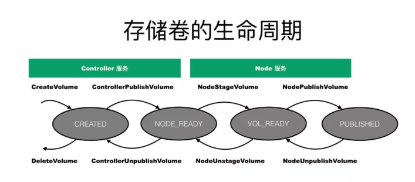
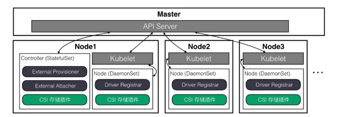

# 什么是CSI

Container Storage Interface是面向容器编排系统的存储接口规范，定义了容器编排系统和各种存储之间如何交互。

CSI并不是kubernetes专有的技术或者规范，整个容器社区（包括Mesos、Docker、Kubernetes等）都在推进和定义该规范。理论上，一个遵从CSI规范的实现，能够运行在所有的容器编排系统上。

<!-- more -->

# kubernetes存储插件的发展

Kubernetes 里的存储插件可以分为 In-tree 和 Out-of-tree 这两大类。

In-tree 存储插件的代码是在 Kubernetes 核心代码库里，跟随 Kubernetes 打包发布，从维护性上来说并不是很好维护。

Out-of-tree 存储插件的代码独立于 Kubernetes，也可以独立构建发布，比较易于维护。kubernetes社区推荐开发和使用 Out-of-tree 存储插件。

Out-of-tree 存储插件现在分为 FlexVolume 和 CSI 两大类。

FlexVolume 插件是 Kubernetes1.2 开始支持的，以二进制可执行文件的方式运行在节点的指定路径上，一个名为flexvolume的in-tree插件会在需要时和FlexVolume插件交互。

kubernetes从1.9版本引入CSI，1.13版本变为GA状态。CSI 插件部署起来比较简单，支持容器化部署，功能比较强大，除了存储卷管理功能外，还有快照管理功能。CSI 的存储标准方案在持续快速发展中，功能还在不断扩展。
`

# 概述

CSI插件主要有2个独立的组件：

>- Node Plugin（节点插件）：对主机上的存储卷进行相应的操作。假设一个kubernetes集群有3个计算节点，那么这3个计算节点上都需要部署Node Plugin。
>- Controller Plugin（控制插件）：从存储服务端角度对存储卷进行管理和操作。可以运行在集群中的任何节点上（甚至是master节点）。 但只能有一个副本在运行。
>- 另外还有一个Identify组件，用来获取插件的信息，检查插件的状态。

# 接口规范

## Indentity接口

>- GetPluginInfo：返回插件的名字和版本
>- GetPluginCapabilities：返回插件的功能点，是否支持存储卷创建、删除等功能，是否支持存储卷挂载的功能
>- Probe：返回插件的健康状态（是否在运行中）

## Controller接口

>- CreateVolume：创建一个存储卷（如EBS盘）
>- DeleteVolume：删除一个已创建的存储卷（如EBS盘）
>- ControllerPublishVolume：将一个已创建的存储卷，挂载（attach）到指定的节点上
>- ControllerUnpublishVolume：从指定节点上，卸载（detach）指定的存储卷
>- ValidateVolumeCapabilities：返回存储卷的功能点，如是否支持挂载到多个节点上，是否支持多个节点同时读写
>- ListVolumes：返回所有存储卷的列表
>- GetCapacity：返回存储资源池的可用空间大小
>- ControllerGetCapabilities：返回controller插件的功能点，如是否支持GetCapacity接口，是否支持snapshot功能等

## Node接口

>- NodeStageVolume：如果存储卷没有格式化，首先要格式化。然后把存储卷mount到一个临时的目录（这个目录通常是节点上的一个全局目录）。再通过NodePublishVolume将存储卷mount到pod的目录中。mount过程分为2步，原因是为了支持多个pod共享同一个volume（如NFS）。
>- NodeUnstageVolume：NodeStageVolume的逆操作，将一个存储卷从临时目录umount掉
>- NodePublishVolume：将存储卷从临时目录mount到目标目录（pod目录）
>- NodeUnpublishVolume：将存储卷从pod目录umount掉
>- NodeGetId：返回插件运行的节点的ID
>- NodeGetCapabilities：返回Node插件的功能点，如是否支持stage/unstage功能

# 存储卷的生命周期

当用户向kubernetes发起创建存储卷的请求时，kubernetes会调用 Controller 插件的 CreateVolume 接口，发起创建存储卷的请求。 CreateVolume 接口会调用云平台 API，创建一个块设备并将设备的信息返回给kubernetes。此时存储卷处于CREATED状态。

之后存储卷要被用户的应用所使用，kubernetes会调度容器到某台主机上，并调用 CSI 插件的 ControllerPublishVolume 接口，将存储卷挂载至这台主机上。 ControllerPublishVolume 会调用云平台 API 实现相关操作。当主机上能够看到这个块设备以后，这个状态处于Node Ready状态。

接下来，kubernetes会调用 CSI 插件的 NodeStageVolume 接口对存储卷进行分区格式化操作。完成之后状态称之为 Volume Ready 状态。

最后，kubernetes调用NodePublishVolume将存储卷mount到容器的指定目录下，完成之后进入Published状态。

存储卷的卸载，是上述过程的逆过程，不再赘述。

# 部署架构图

推荐使用statefulset部署controller plugin，使用daemonset部署Node plugin
