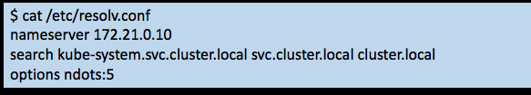
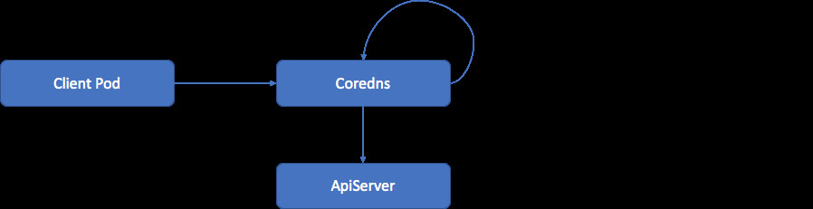
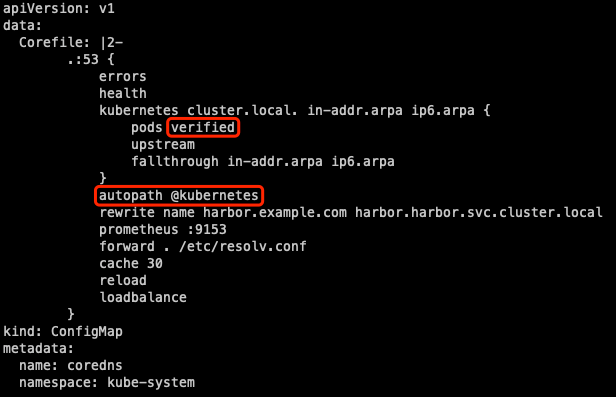

# Kubernetes Coredns 性能优化

四个方面优化：

>1. coredns 功能
>2. dns 本地缓存
>3. client和server 之间网络
>4. 服务自动扩容



Kubernetes Pod 解析 DNS 域名会 search 很多次，例如上图 Pod 中 DNS 配置，当它请求 ksyun.com，会依次解析:

>1. ksyun.com.kube-system.svc.cluster.local -> NXDOMAIN
>2. ksyun.com.svc.cluster.local -> NXDOMAIN
>3. ksyun.com.cluster.local -> NXDOMAIN
>4. ksyun.com -> 1.1.1.1

Coredns 是中心化部署在某一个节点上的，Pod 访问 Coredns 解析经过链路过长，又是 UDP 协议，导致失败率高。

<!-- more -->

## 使用 AutoPath 大幅降低 Pod DNS 的查询量
由客户端 Search 变成服务端 Search：


当 Pod 请求 Coredns 时解析域名：

>1. Coredns 会通过源 IP 地址查询到 Pod 的信息
>2. 然后根据 Pod 的 Namespace 信息，匹配到它真正想访问的是哪个服务直接返回
>3. 客户端请求从 4 个直接减少到 1 个，降低了 75% 的 Coredns 请求，从而让失败率降低

### 开启 AutoPath 功能

启用 CoreDNS 的 autopath 插件可以避免每次域名解析经过多次请求才能解析到，原理是 CoreDNS 智能识别拼接过 search 的 DNS 解析，直接响应 CNAME 并附上相应的 ClusterIP，一步到位，可以极大减少集群内 DNS 请求数量。

启用方法是修改 CoreDNS 配置:

```sh
kubectl -n kube-system edit configmap coredns
```


>1. 加上 autopath @kubernetes。
>2. 默认的 pods insecure 改成 pods verified。

***需要注意的是，启用 autopath 后，由于 coredns 需要 watch 所有的 pod，会增加 coredns 的内存消耗，根据情况适当调节 coredns 的 memory request 和 limit。***

## 启用NodeLocal DNSCache 功能


>1. 拦截 Pod 的 DNS 查询的请求
>2. 将外部域名分流，外部域名请求不再请求中心 Coredns
>3. 中间链路使用更稳定的 TCP 解析
>4. 节点级别缓存 DNS 解析结果，较少请求中信 Coredns

### 部署 node-local-dns 插件

NodeLocal DNSCache 通过在集群节点上作为 DaemonSet 运行 dns 缓存代理来提高集群 DNS 性能。在今天的架构中，ClusterFirst DNS 模式下的 Pod 会访问 kube-dns serviceIP 以进行 DNS 查询。这通过 kube-proxy 添加的 iptables 规则转换为 kube-dns/CoreDNS 端点。使用这种新架构，Pods 将接触到运行在同一节点上的 dns 缓存代理，从而避免 iptables DNAT 规则和连接跟踪。本地缓存代理将查询 kube-dns 服务以查找集群主机名（默认为 cluster.local 后缀）的缓存未命中。

开启方法[点击](https://www.flftuu.com/2021/03/01/NodeLocal-DNSCache-%E5%90%AF%E7%94%A8/)

## 开启感知服务路由功能

coredns服务可以指定将流量优先路由到与客户端位于同一节点上或位于同一AZ中的端点，以实现最低延迟。

开启方法[点击](https://www.flftuu.com/2021/02/08/k8s%E6%8B%93%E6%89%91%E6%84%9F%E7%9F%A5%E6%9C%8D%E5%8A%A1%E8%B7%AF%E7%94%B1/#more)

## 使用 DNSAutoscaler

DNSAutoscaler 是 DNS 自动水平伸缩组件，可通过一个 deployment 获取集群的节点数和核数，根据预设的伸缩策略，自动水平伸缩 DNS 的副本数。

开启方法[点击](https://www.flftuu.com/2021/03/12/%E8%87%AA%E5%8A%A8%E6%89%A9%E7%BC%A9%E9%9B%86%E7%BE%A4-DNS-%E6%9C%8D%E5%8A%A1/)