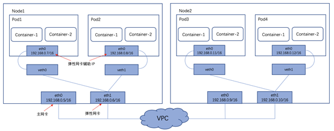
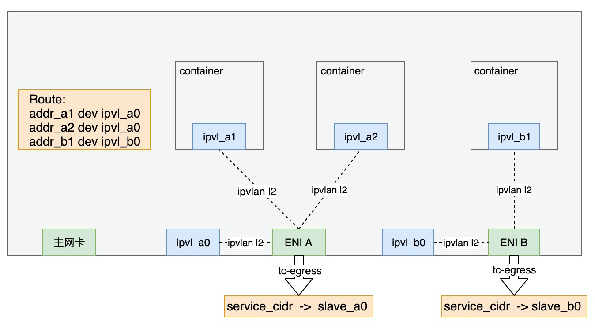

# 背景
Eni多IP方案是由 VPC 功能负责路由，打通容器网络的连通性，可实现 Pod 和 Node 的控制面和数据面完全在同一网络层面，该模式下的 Pod 能够复用VPC 所有产品特性。

VPC-CNI（多IP共享） 模式和VPC-CNI（独占）模式下，集群内 Pod 与 Node 的 IP 均来自同一 VPC。区别是，独占模式指的是pod独享一块弹性网卡，而多IP共享模式指的是多个pod共享一块弹性网卡，将弹性网卡的辅助ip分配给pod，通过这种方式，增加单个Node上可以创建的pod数量。

注：但由于弹性网卡辅助 IP 数量的限制，单个 Node 上可以创建的 Pod 数量仍然会受到限制，但综合pod数量和性能的考虑，目前该方案已属较优。

ENI多IP方案支持的最大Pod数=（云主机支持的ENI数-1）×单个ENI支持的私有IP个数
<!-- more -->

# 优势
>1. 少了一层网桥，网络转发性能更高，大约提升10%，适用于对网络时延要求较高的场景。
>2. 支持 Pod 固定 IP，适用于依赖容器固定 IP 的场景。例如，传统架构迁移到容器平台及针对 IP 做安全策略限制。
>3. 支持 LB 直通 Pod。

# 实现方案
基于ENI多IP构建容器网络一般有bridge, 策略路由, macvlan, ipvlan、trunkport等多种方案，如下图。

而因VPC往往会检测进入报文的源mac，使得bridge, macvlan无法很好的适配ENI多IP。策略路由通过了三层网络联调，不存在mac的问题，但性能下降较多。ipvlan可以较好的解决mac的问题，性能也不错，但在适配k8s的service网络却在不少问题（详见：IPvlan方案设计）。通过对多家云厂商的调研，基本选择的是：策略路由、ipvlan或者trunkport（见下一节）。

下表对策略路由、ipvlan、trunkport三种方案做个对比：

# 友商调研

## 百度云-（策略路由方式）

上图是vpc-cni模式下，集群网络拓扑图

## 腾讯云（策略路由方式）

## 华为云（trunkport方式）

云原生网络2.0是华为云自研的新一代容器网络模型，深度整合了[华为云虚拟私有云VPC](https://support.huaweicloud.com/usermanual-cce/cce_01_0284.html)的原生弹性网卡（Elastic Network Interface，简称ENI）能力，采用VPC网段分配容器地址，支持ELB直通容器，享有高性能。

裸金属节点使用了弹性网卡ENI的能力，ECS节点使用了Trunkport的能力。
说明如下：

节点内Pod间通信：直接通过VPC的弹性网卡/弹性辅助网卡进行流量转发。
跨节点Pod间通信：直接通过VPC的弹性网卡/弹性辅助网卡进行流量转发。

## 阿里云（策略路由/ipvlan/trunkport）

阿里云支持三种方案：
>1. 策略路由
>2. Ipvlan
>3. trunkport（处于灰度阶段）

下面是ipvlan的网络拓扑图。每块弹性网卡额外增加一个位于host namespace的port用于和主命名空间的kube-proxy通信。

