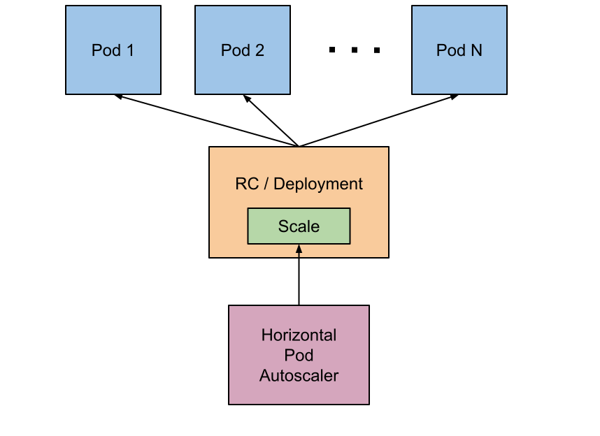

## HPA 概念

 HPA(Horizontal Pod Autoscaling)是kubernetes中自动水平扩展模块，基于用户设定和获取到的指标(CPU,Memory,自定义metrics)，对Pod进行伸缩，不是直接操作pod，而是通过scaler client修改Replicas副本数来实现Pod实例数的增减。HPA Controller属于Controller Manager的一个controller。HPA的操作对象是RC、RS或Deployment对应的Pod根据观察到的CPU等实际使用量与用户的期望值进行比对，做出是否需要增减实例数量的决策
<!-- more -->



HPA 通过调用 Kubernetes中的 aggregated API 来获取 metrics 数据， 目前Kubernetes中定义了三种获取监控metrics的API：

>1. metrics.k8s.io ：用于HPA中 Resource 类型数据来源，由 metrics-server 服务提供 pod 的CPU使用率和内存使用量监控指标
>2. custom.metrics.k8s.io ：用于HPA中 object/pods 类型的数据来源，需要自己实现是配置（custom metrics adapters) 如：Prometheus Adapter - Microsoft Azure Adapter - Google Stackdriver
>3. external.metrics.k8s.io ：用于HPA中 external 类型的数据源，需要云厂商或者平台自己实现适配器 如：Google Stackdriver

## HPA版本及YAML格式

目前Kubernetes HorizontalPodAutoscaler 有3个版本：

>1. v1: 仅支持CPU指标
>2. v2beta1:支持CPU和Memory和自定义指标(Pods、Objects)
>3. v2beta2: 支持外部接口定义指标(External)

### V1 版本

```yaml
apiVersion: autoscaling/v1
kind: HorizontalPodAutoscaler
metadata:
  name: php-apache
  namespace: default
spec
  scaleTargetRef:
    apiVersion: apps/v1
    kind: Deployment
    name: php-apache
  minReplicas: 1
  maxReplicas: 10
  targetCPUUtilizationPercentage: 50
```

### V2beta1 版本

```yaml
kind: HorizontalPodAutoscaler
apiVersion: autoscaling/v2beta1
metadata:
  name: example-hpa
spec:
  scaleTargetRef:
    apiVersion: apps/v1
    kind: Deployment
    name: example-app
  minReplicas: 2
  maxReplicas: 10
  metrics:
  - type: Resource
    resource:
      name: cpu
      targetAverageUtilization: 50
  - type: Resource
    resource:
      name: memory
      targetAverageUtilization: 50
  - type: Pods
    pods:
      metricName: receive_bytes_total
      targetAverageValue: 100
  - type: Object
    object:
      target:
        kind: endpoints
        name: example-app
      metricName: request_total
      targetValue: 500m
```

### v2beta2 版本

```yaml
apiVersion: autoscaling/v2beta2
kind: HorizontalPodAutoscaler
metadata:
  name: hpa-test
  namespace: dev
  annotations:metric-config.external.prometheus-query.prometheus/autoregister_queue_latency: autoregister_queue_latency{endpoint="https",instance="192.168.99.101:8443",job="apiserver",namespace="default",quantile="0.99",service="kubernetes"}   
spec:
  scaleTargetRef:
    apiVersion: extensions/v1beta1
    kind: Deployment
    name: test
  minReplicas: 1
  maxReplicas: 10
  Metrics:
  - type: External
    external:
      metric:
        name: prometheus-query
        selector:
          matchLabels:
            query-name: autoregister_queue_latency
      target:
        type: AverageValue
        averageValue: 1
```