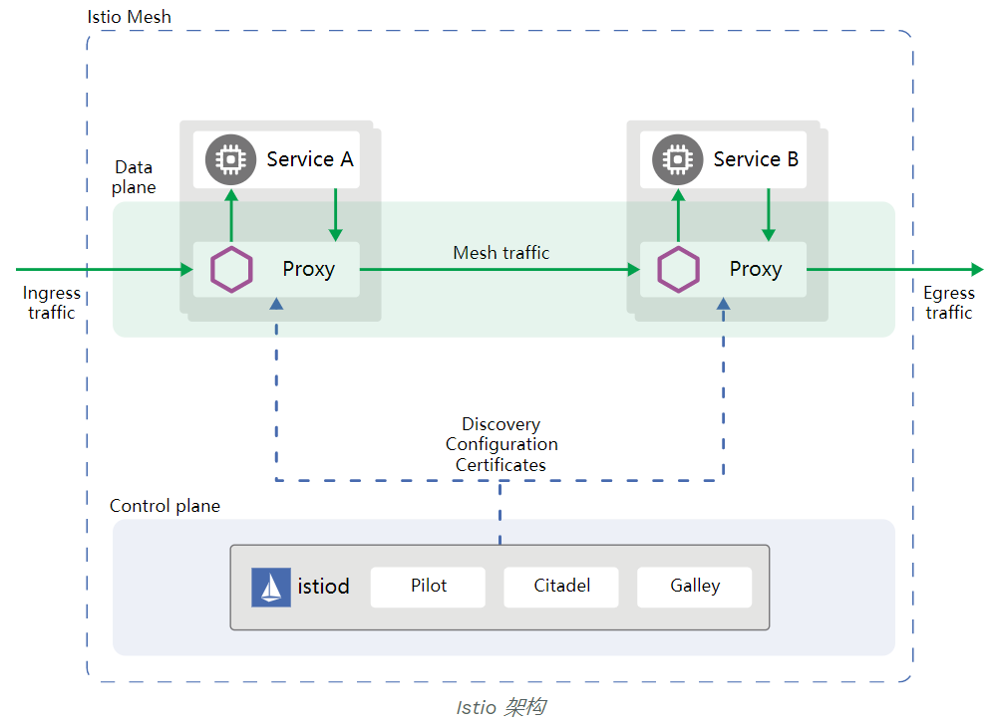
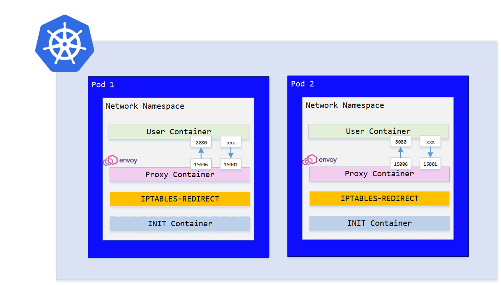

## Istio介绍

### 架构



Istio 服务网格从逻辑上分为数据平面和控制平面：

- 数据平面：有代理（Envoy）组成，以sidecar方式部署在用户业务pod中，共享pod的网络命名空间，通过iptables redirect的方式将原本进入用户容器的流量转发Envoy 代理；Envoy代理负责控制服务间网络通信
- 控制平面：按需制定流量规则，并下发给代理来实现对流量的控制

<!-- more -->

#### Envoy


Envoy 是专为大型现代 SOA（面向服务架构）架构设计的 L7 代理，负责协调服务网格中所有服务的入站和出站流量

在Istio系统中，Envoy为数据面组件被部署为服务的sidecar，为服务增加了很多内置特性：

- 动态服务发现
- 负载均衡
- TLS 终端
- HTTP/2 与 gRPC 代理
- 熔断器
- 健康检查
- 基于百分比流量分割的分阶段发布
- 故障注入
- 丰富的指标

#### Pilot


Pilot 组件对服务发现机制进行抽象并分离出抽象模型（Abstract model），通过adapter的方式实现对不同平台（例如：kubernetes，spring eureka，CloudFoundry等）的服务发现功能

同时 Pilot 将服务发现获取到的信息（例如：服务的名称，域名，IP，Endpints等）进行整合处理，通过Envoy API将信息下发给 Envoy，即为Envoy实现服务发现和流量管理提供服务元数据

#### Mixer


Mixer 负责控制策略及采集监控数据，Mixer适配器支持多种后端服务类型如日志服务，配额服务，认证服务，监控服务等；（在Istio 1.5 版本已废弃）

#### Citadel

Citadel 通过内置的身份和证书管理，可以支持强大的服务到服务以及最终用户的身份验证。您可以使用 Citadel 来升级服务网格中的未加密流量

#### Galley
Galley 是 Istio 的配置验证、提取、处理和分发组件。它负责将其余的 Istio 组件与从底层平台（例如 Kubernetes）获取用户配置的细节隔离开来

***备注: 在Istio1.5 版本中对Istio架构进行重建，控制平面将使用新的部署模式Istiod，将原有的各个组件整合在一起负责处理配置、证书分发、sidecar 注入等各种功能 参考链接***

### 概念


#### VirtualService
服务访问路由控制,对满足特定匹配条件的请求进行控制,包括

指定路由目标服务
请求重写
请求重试：提高服务可用性，当请求失败时，Istio默认会重试两次请求
请求超时：默认HTTP超时时间为15秒，Istio支持在不修改代码的情况下，根据实际需要来配置不同服务的请求超时时间
故障注入: 用于验证Istio的故障恢复策略，可在应用层测试多种异常如：http错误码，请求延迟，请求中断等



Istio使用的端口[地址](https://istio.io/latest/zh/docs/ops/deployment/requirements/)

```bash
Chain PREROUTING (policy ACCEPT 120K packets, 7172K bytes
 pkts bytes target     prot opt in     out     source               destination        
 120K 7173K ISTIO_INBOUND  tcp  --  *      *       0.0.0.0/0            0.0.0.0/0                          # Inbound - Step 1: 将所有进入到Pod的流量转发至ISTIO_INBOUND链处理  
 
Chain INPUT (policy ACCEPT 120K packets, 7173K bytes)
 pkts bytes target     prot opt in     out     source               destination        
 
Chain OUTPUT (policy ACCEPT 122K packets, 11M bytes)
 pkts bytes target     prot opt in     out     source               destination        
12320  739K ISTIO_OUTPUT  tcp  --  *      *       0.0.0.0/0            0.0.0.0/0                           # Outbound - Step 1: 全部出向流量转发至ISTIO_OUTPUT链处理
 
Chain POSTROUTING (policy ACCEPT 122K packets, 11M bytes)
 pkts bytes target     prot opt in     out     source               destination        
 
Chain ISTIO_INBOUND (1 references)
 pkts bytes target     prot opt in     out     source               destination        
    0     0 RETURN     tcp  --  *      *       0.0.0.0/0            0.0.0.0/0            tcp dpt:22         # Inbound - Step 2： TCP 协议请求且请求端口为22/15090/15021/15020的请求停止执行当前链中的后续Rules，并执行下一个链，其余入向流量
    2   120 RETURN     tcp  --  *      *       0.0.0.0/0            0.0.0.0/0            tcp dpt:15090      # Mixer代理       
 120K 7172K RETURN     tcp  --  *      *       0.0.0.0/0            0.0.0.0/0            tcp dpt:15021      # Envoy健康检查
    0     0 RETURN     tcp  --  *      *       0.0.0.0/0            0.0.0.0/0            tcp dpt:15020      # Inbound - Step 3：其余非22/15090/15021/15020端口请求流量转发至ISTIO_IN_REDIRECT链处理
    8   480 ISTIO_IN_REDIRECT  tcp  --  *      *       0.0.0.0/0            0.0.0.0/0          
 
Chain ISTIO_IN_REDIRECT (3 references)
 pkts bytes target     prot opt in     out     source               destination        
    8   480 REDIRECT   tcp  --  *      *       0.0.0.0/0            0.0.0.0/0            redir ports 15006  # Inbound - Step 4： 将流量转发至15006（Envoy Inbound端口）
 
Chain ISTIO_OUTPUT (1 references)                                                                                        # Outbound - Step 2： lo 网卡流量不做处理
 pkts bytes target     prot opt in     out     source               destination                       
    0     0 RETURN     all  --  *      lo      127.0.0.6            0.0.0.0/0          
    0     0 ISTIO_IN_REDIRECT  all  --  *      lo      0.0.0.0/0           !127.0.0.1            owner UID match 1337    # UID-1337 为 istio-proxy , 将所有istio-proxy产生并且目的地址不是127.0.0.1的流量交给 ISTIO_IN_REDIRECT 链处理
    0     0 RETURN     all  --  *      lo      0.0.0.0/0            0.0.0.0/0            ! owner UID match 1337
12320  739K RETURN     all  --  *      *       0.0.0.0/0            0.0.0.0/0            owner UID match 1337            # Outbound - Step 3： 全部istio-proxy产生的流量均不做处理
    0     0 ISTIO_IN_REDIRECT  all  --  *      lo      0.0.0.0/0           !127.0.0.1            owner GID match 1337
    0     0 RETURN     all  --  *      lo      0.0.0.0/0            0.0.0.0/0            ! owner GID match 1337
    0     0 RETURN     all  --  *      *       0.0.0.0/0            0.0.0.0/0            owner GID match 1337
    0     0 RETURN     all  --  *      *       0.0.0.0/0            127.0.0.1          
    0     0 ISTIO_REDIRECT  all  --  *      *       0.0.0.0/0            0.0.0.0/0                                       # 将全部非istio-proxy出向流量转发到 Envoy Outbound 端口 15001 （istio-proxy出向已经有上面的规则RETURN处理）
 
Chain ISTIO_REDIRECT (1 references)
 pkts bytes target     prot opt in     out     source               destination        
    0     0 REDIRECT   tcp  --  *      *       0.0.0.0/0            0.0.0.0/0            redir ports 15001
```

#### DestinationRule

- 负载均衡策略，支持轮询，最小连接数等负载策略，可根据服务版本子集单独配置负载策略
- 熔断控制，当节点的请求并发数据或者请求失败次数超过阈值后，则流量不再发往异常的节点
- 设置服务版本子集，根据服务deploy中的version标签定义服务版本子集

#### Gateway
- 使用Gateway来设置网格中入站和出站流量开放方式如：域名，端口，入站协议等信息
- Istio中提供了两个预先配置好的网关 istio-ingressgateway 和 istio-egreesagteway 分别控制入站和出站的网络流量

#### ServiceEntry
- 使用ServiceEntry来添加一个入口到 Istio 内部维护的服务注册中心，添加了服务入口后，Envoy代理可以向服务发送流量，就好像它是网格内部的服务一样
- 默认当网格内的服务访问网格外的服务的流量是不受istio控制的，如果希望使用istio的特性控制访问网格外的服务的流量，那么就需要使用ServiceEntry将这个外部服务注册到服务网格中

