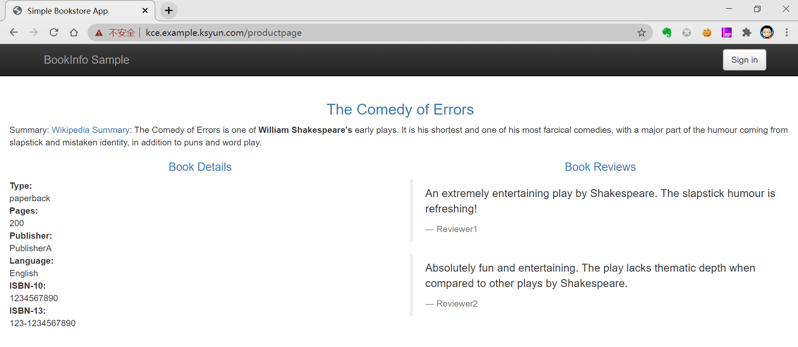
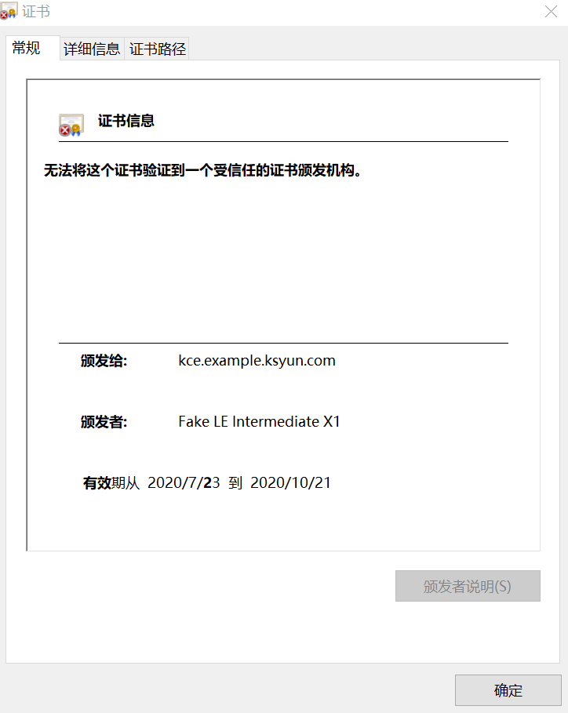
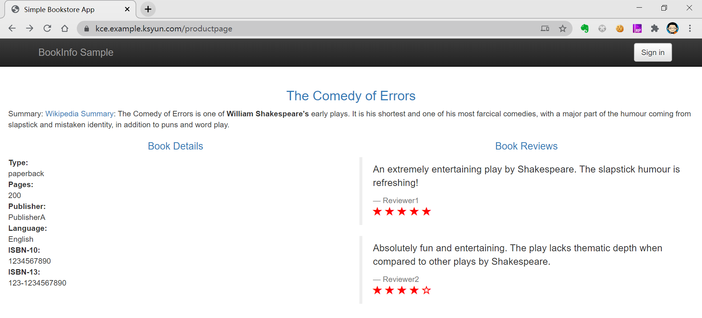
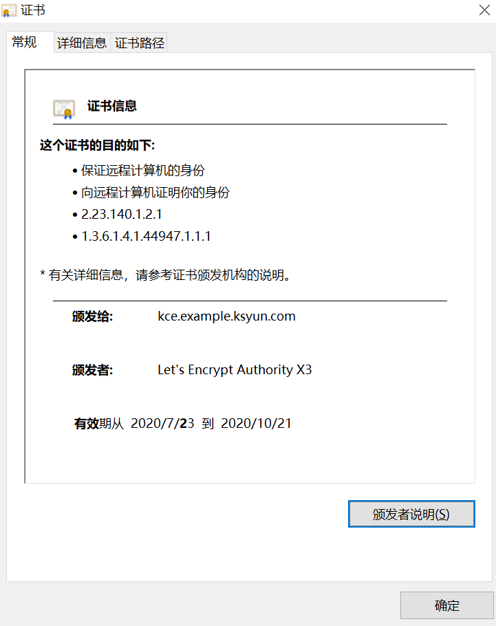

<!-- more -->

## cert-manager 是什么

cert-manager 是一个云原生证书管理开源项目，用于在 Kubernetes 集群中提供 HTTPS 证书并自动续期，支持 Let’s Encrypt, HashiCorp Vault 这些免费证书的签发。在Kubernetes集群中，我们可以通过 Kubernetes Ingress 和 Let’s Encrypt 实现外部服务的自动化 HTTPS


在cert-manager架构中主要包含两部分:Issuer和Certificates，其中Issuer表示证书颁发者，Issuser支持多种类型的证书例如：SelfSigned（自签名证书），CA证书，ACME，External，Vault，Venafi等，Issuer 的主要功能就是实现不同类型证书协议及规范，根据Certificates声明信息自动生成所需证书；Certificates代表生成证书的请求，其中包含了生成证书所需要的元数据信息（例如：CN， Domain 等）和指定证书生成后保存的Secret名称；

## cert-manager 安装

cert-manager 支持使用YAML manifests 和 Helm V2 两种方式

### 使用 YAML manifests 安装

```bash
# Kubernetes 1.15+
$ kubectl apply --validate=false -f https://github.com/jetstack/cert-manager/releases/download/v0.15.2/cert-manager.yaml
 
# Kubernetes <1.15
$ kubectl apply --validate=false -f https://github.com/jetstack/cert-manager/releases/download/v0.15.2/cert-manager-legacy.yaml
```

### 使用 Helm V2 安装

### 安装 Helm v2.16.1
在Kubernetes集群内任意节点上执行如下命令，安装helm client
```bash
# 下载Helm二进制文件
$ wget https://get.helm.sh/helm-v2.16.1-linux-amd64.tar.gz
 
# 解压缩helm-v2.16.1-linux-amd64.tar.gz
$ tar zxvf helm-v2.16.1-linux-amd64.tar.gz
 
# 将Helm 二进制文件拷贝至 /usr/local/bin目录下
$ mv ~/linux-amd64/helm /usr/local/bin
```

安装Helm 服务端组件Tiller 

```bash
# 创建 ServiceAccount
$ kubectl create serviceaccount tiller --namespace=kube-system
 
# 赋予tiller admin权限
$ kubectl create clusterrolebinding tiller-admin --serviceaccount=kube-system:tiller --clusterrole=cluster-admin
 
# 使用 tiller ServiceAccount 部署安装 Tiller
$ helm init --service-account=tiller --tiller-image=hub.docker.com/docker/tiller:v2.16.1 --skip-refresh
 
# 查看tiller-deploy是否创建成功
$ kubectl get deploy tiller-deploy -n kube-system
```

使用Helm V2 安装cert-manager

```bash
# 创建命名空间cert-manager
$ kubectl create namespace cert-manager
 
# 添加cert-manager源
$ helm repo add jetstack https://charts.jetstack.io
$ helm repo update
 
# 安装cert-manager及cert-manager相关CRD
$ helm install \
  --name cert-manager \
  --namespace cert-manager \
  --version v0.15.1 \
  jetstack/cert-manager \
  --set installCRDs=true
```

### 验证安装

```bash
$ kubectl get pods --namespace cert-manager
NAME                                       READY   STATUS    RESTARTS   AGE
cert-manager-6cbf88485b-7dlpr              1/1     Running   0          7h11m
cert-manager-cainjector-6db47bfc85-nfh47   1/1     Running   0          7h11m
cert-manager-webhook-d4895985b-92xf9       1/1     Running   0          7h11m
```

## 自动生成ACME证书

### ACME 协议规范及cert-manager 工作流

>1. ACME客户端（cert-manager）创建 issuer 实例
>2. issuer 会向ACME服务端（Letsencrypt）发起注册请求
>3. Letsencrypt在收到注册请求后，会生成token
>4. issuer将token信息保存在创建issuer时指定的secret中
>5. 创建Certificate，表示向issuer申请生成证书
>6. cert-manager会创建acme-http-solver实例及服务并提供公网访问（http://$<DomainName>/.well-known/acme-challenge/$<TOKEN>）
>7. Letsencrypt服务器请求http://$<DomainName>/.well-known/acme-challenge/$<TOKEN> 验证您对证书中域名的控制权
>8. 验证通过后，Letsencrypt将生成证书
>9. issuer在收到证书后，将证书保存到创建Certificate时指定的secret中

### Helm v2 安装 ingress-nignx 

```bash

# 添加stable国内源
$ helm repo add stable https://kubernetes.oss-cn-hangzhou.aliyuncs.com/charts
 
# 更新源
$ helm repo update
 
# 安装nginx-ingress
$ helm install stable/nginx-ingress --namespace ingress-nginx --name nginx-ingress
 
# 验证安装
$ kubectl get po -n ingress-nginx | grep nginx-ingress
nginx-ingress-controller-5b67454869-8r4lc       1/1     Running   0          172m
nginx-ingress-default-backend-878d64884-2c9cf   1/1     Running   0          172m
 
# 备注：卸载 nginx-ingress
$ helm del nginx-ingress --purge
```
nginx-ingress-controller报错信息：User "system:serviceaccount:kube-system:default" cannot get resource "services" in API group "" in the namespace "kube-system"
```bash
#解决办法：
kubectl apply -f ingress-nginx-role.yaml
```

### 创建Issuer和Certificate

```yaml
apiVersion: cert-manager.io/v1alpha2
kind: Issuer
metadata:
  name: letsencrypt-staging
spec:
  acme:
    # The ACME server URL
    server: https://acme-staging-v02.api.letsencrypt.org/directory
    # Email address used for ACME registration
    email: perfect.minch@gmail.com
    # Name of a secret used to store the ACME account private key
    privateKeySecretRef:
      name: letsencrypt-staging
    # Enable the HTTP-01 challenge provider
    solvers:
    # An empty 'selector' means that this solver matches all domains
    - selector: {}
      http01:
        ingress:
          class: nginx  # 声明使用 ingress-nginx 提供dns有效性验证服务入口
```

```yaml

apiVersion: cert-manager.io/v1alpha2
kind: Certificate
metadata:
  name: example-docker-com
spec:
  secretName: example-docker-com-tls   # 指定证书的保存secret名称
  issuerRef:
    name: letsencrypt-staging        
  commonName: example.docker.com   # 指定issuer来生成证书
  dnsNames:
  - example.docker.com             #  example.docker.com 域名必须是真实有效的域名  Let’s Encrypt 服务端会验证该域名
```
***注意：确保提供对外访问的ingress-controller IP地址与证书中域名解析的IP地址一致，这样才可以向Let's Encrypt服务端证明你对证书中域名的控制权***

```bash
# 获取 nginx-ingress-controller 的外网IP地址
$ INGRESS_EXTERNAL_IP=$(kubectl get svc -n ingress-nginx nginx-ingress-controller -o jsonpath='{.status.loadBalancer.ingress[0].ip}')
# 将 example.docker.com域名 解析地址改为$INGRESS_EXTERNAL_IP
```
cert-manager 自动创建ingress，svc ，deploy 等资源用于ACME服务端（Let’s Encrypt）验证你是否拥有证书中的域名的控制权，验证成功后生成证书
```yaml
$ kubectl get ingress
NAME                        HOSTS                   ADDRESS   PORTS   AGE
cm-acme-http-solver-lgft8   example.docker.com             80      5m59s
 
$ kubectl get ingress cm-acme-http-solver-lgft8  -o yaml
apiVersion: extensions/v1beta1
kind: Ingress
metadata:
  annotations:
    kubernetes.io/ingress.class: nginx
    nginx.ingress.kubernetes.io/whitelist-source-range: 0.0.0.0/0,::/0
  creationTimestamp: "2020-07-23T01:49:46Z"
  generateName: cm-acme-http-solver-
  generation: 1
  labels:
    acme.cert-manager.io/http-domain: "1489635363"
    acme.cert-manager.io/http-token: "622267818"
    acme.cert-manager.io/http01-solver: "true"
  name: cm-acme-http-solver-lgft8
  namespace: default
  ownerReferences:
  - apiVersion: acme.cert-manager.io/v1alpha2
    blockOwnerDeletion: true
    controller: true
    kind: Challenge
    name: example-docker-com-3873679234-4046869399-1656898242
    uid: e0fa8d0b-6825-41be-80fb-d26d01065afb
  resourceVersion: "8201"
  selfLink: /apis/extensions/v1beta1/namespaces/default/ingresses/cm-acme-http-solver-lgft8
  uid: c9ce4b9e-f593-406e-86e2-f6943e70d7e9
spec:
  rules:
  - host: example.docker.com
    http:
      paths:
      - backend:
          serviceName: cm-acme-http-solver-snsvt
          servicePort: 8089
        path: /.well-known/acme-challenge/T7pQ-fYcI2HNa6TTQvH9bX-14XX0hRSy7PqTa9mtAEw
status:
  loadBalancer:
    ingress:
    - {}
 
$ kubectl get svc | grep cm-acme-http-solver
cm-acme-http-solver-snsvt   NodePort    10.254.64.27     <none>        8089:32110/TCP   9m18s
 
 
$ kubectl describe cert example-docker-com
Events:
  Type    Reason        Age    From          Message
  ----    ------        ----   ----          -------
  Normal  GeneratedKey  15m    cert-manager  Generated a new private key
  Normal  Requested     15m    cert-manager  Created new CertificateRequest resource "example-docker-com-3873679234"
  Normal  Issued        5m18s  cert-manager  Certificate issued successfully
```

最新生产的证书将保存在 secret/example-docker-com-tls  

```yaml
$ kubectl get secret example-docker-com-tls -oyaml
apiVersion: v1
data:
  ca.crt: ""
  tls.crt: LS0tLS1CRUdJTiBDRVJUSUZJQ0FURS0tLS0tCk1JSUZSRENDQkN5Z0F3SUJBZ0lUQVBwR0U2R200TFlwR1UyRDNydkEvb2FxSkRBTkJna3Foa2lHOXcwQkFRc0YKQURBaU1TQXdIZ1lEVlFRRERCZEdZV3RsSUV4RklFbHVkR1Z5YldWa2FXRjBaU0JZTVRBZUZ3MHlNREEzTWpNdwpNVEF3TWpGYUZ3MHlNREV3TWpFd01UQXdNakZhTUNBeEhqQWNCZ05WQkFNVEZXdGpaUzVsZUdGdGNHeGxMbXR6CmVYVnVMbU52YlRDQ0FTSXdEUVlKS29aSWh2Y05BUUVCQlFBRGdnRVBBRENDQVFvQ2dnRUJBTHR2YmZONldJbm0KMGg3aGhUVGp0Y1kyaHZ6Z1QvTkR6bGFiNnJWYjArclJuQzAxTVcyc24vYnd1WlVIZUJ1Nlo4RENYM1JMTFlyagpGTXZkVGJOdUxFdzlOMXkrNkRkTXJPalR6VEoxbER5OGF5eTlkbTFIUy9VUWVnWXljM3pKK1kyekNLdFFhQ2dKCkhRN0FKQ3VlNWN6bGhmWVFKM3BjTXhsZzZLdGpNZTc5UnAwL01FVVJUMmxlY3FmYXhMdHlLb0tjTVR3b3l3RmMKRmkrbU50NnlONjhJcUJGK1dHajRnNmdwNWI1QWxyZzV3VlVEalpmM2dvUFNVZGZzc0V3UCtNMHRqTXg2QTYwMgpicFJSUGhPdldWRllub1VlaTBBc2hHYlNRUlRDZjRDVzYrL1FWQ3hzVEp4KzhQSGxIQlM2ZndEN01lRk9uUk9IClhOelduVlV3dDhVQ0F3RUFBYU9DQW5Nd2dnSnZNQTRHQTFVZER3RUIvd1FFQXdJRm9EQWRCZ05WSFNVRUZqQVUKQmdnckJnRUZCUWNEQVFZSUt3WUJCUVVIQXdJd0RBWURWUjBUQVFIL0JBSXdBREFkQmdOVkhRNEVGZ1FVdG9aegpwcWV1K0c1V2FNVGoyTDR5eFpmMHlLQXdId1lEVlIwakJCZ3dGb0FVd013RFJybFlJTXhjY25EejRTN0xJS2IxCmFEb3dkd1lJS3dZQkJRVUhBUUVFYXpCcE1ESUdDQ3NHQVFVRkJ6QUJoaVpvZEhSd09pOHZiMk56Y0M1emRHY3QKYVc1MExYZ3hMbXhsZEhObGJtTnllWEIwTG05eVp6QXpCZ2dyQmdFRkJRY3dBb1luYUhSMGNEb3ZMMk5sY25RdQpjM1JuTFdsdWRDMTRNUzVzWlhSelpXNWpjbmx3ZEM1dmNtY3ZNQ0FHQTFVZEVRUVpNQmVDRld0alpTNWxlR0Z0CmNHeGxMbXR6ZVhWdUxtTnZiVEJNQmdOVkhTQUVSVEJETUFnR0JtZUJEQUVDQVRBM0Jnc3JCZ0VFQVlMZkV3RUIKQVRBb01DWUdDQ3NHQVFVRkJ3SUJGaHBvZEhSd09pOHZZM0J6TG14bGRITmxibU55ZVhCMExtOXlaekNDQVFVRwpDaXNHQVFRQjFua0NCQUlFZ2ZZRWdmTUE4UUIyQUxETWcrV2wrWDFycjN3SnpDaEpCSWNxeCtpTEV5eGpVTGZHCi9TYmhiR3gzQUFBQmMzbG1hZ2dBQUFRREFFY3dSUUloQU95U2hSVWdQQ1UyVDZ6Myt2YUs3eWdERS9EV2Y5akwKblN0d0JMb1VhaHlaQWlCWE1UNHNwSS9mR01ZZmhtM1lUbkc5SE5walV5bWd2b3gyY05FT3RSU1ltUUIzQU1ZLwpJaGpEZlZhbXFnYTFsdHFPVTlUWEZXMGVtNnlPUk5JZ0xlWk5hZG5jQUFBQmMzbG1iZllBQUFRREFFZ3dSZ0loCkFNOC84Zlc5UlBiZkMyMEN0M0JGb0pPcFBTbUR1RmlLVlNoRHZhV1pBKzZsQWlFQTRPT0owcmU2LzFlU3FHTmEKbFZKcFM4TEpmT3V6NjlqY25LcWp0V1lvdEFRd0RRWUpLb1pJaHZjTkFRRUxCUUFEZ2dFQkFHdy9kRDNGMk5XagozUEd3cHl5bkpGS1lQUDZUSWk5Zk1MeE40YlZVdzZWQ3VyMHZvMy9vRk4rdFlraUFMSHR6dDNXYU80YXd0VXgrCnNzVnRrRTNET3F3YkV3TEFLWXd3d1RBYVhPTmxlNmtOMGM3VVVQQjg3QythWUpSdTFpRjNWSnJWYjltVStkMWQKRzB0TkFtTytCRVV2ODl0VFVyVXdOaW5SSnoxc2ZaTmJOVmlYUDdjTXNCb2FNQUJSRlN1a3FwSmdKYitLSmswNApyRFR2anhpbXVZN29aSU1Td3UvUkpyR2QwWnJzeTNpa2xxcGRwZVlPTGIyK05ZL0pjZHc2dkhzOEJvbzBWaGVtCnRaWEx6cGdWV2JLVTdDV1pBbHBFYWZUYzRiZzB1U01ES1J6RktBc1liN3FneW4vdFpKM05JNUJkUU5ScGtEZ2MKbXlVN2hXVWdjMkk9Ci0tLS0tRU5EIENFUlRJRklDQVRFLS0tLS0KLS0tLS1CRUdJTiBDRVJUSUZJQ0FURS0tLS0tCk1JSUVxekNDQXBPZ0F3SUJBZ0lSQUl2aEtnNVpSTzA4VkdReDhKZGhUK1V3RFFZSktvWklodmNOQVFFTEJRQXcKR2pFWU1CWUdBMVVFQXd3UFJtRnJaU0JNUlNCU2IyOTBJRmd4TUI0WERURTJNRFV5TXpJeU1EYzFPVm9YRFRNMgpNRFV5TXpJeU1EYzFPVm93SWpFZ01CNEdBMVVFQXd3WFJtRnJaU0JNUlNCSmJuUmxjbTFsWkdsaGRHVWdXREV3CmdnRWlNQTBHQ1NxR1NJYjNEUUVCQVFVQUE0SUJEd0F3Z2dFS0FvSUJBUUR0V0t5U0RuN3JXWmM1Z2dqejNaQjAKOGpPNHh0aTN1eklOZkQ1c1E3TGo3aHpldFVUK3dRb2IraVhTWmtobnZ4K0l2ZGJYRjUveXQ4YVdQcFVLblB5bQpvTHhzWWlJNWdRQkx4TkR6SWVjME9JYWZsV3FBcjI5bTdKOCtOTnRBcEVOOG5aRm5mM2JoZWhaVzdBeG1TMW0wClpuU3NkSHcwRncrYmdpeFBnMk1ROWs5b2VmRmVxYSs3S3FkbHo1YmJyVVlWMnZvbHhoREZ0bkk0TWg4QmlXQ04KeERIMUhpenErR0tDY0hzaW5EWld1ckNxZGVyL2FmSkJuUXMrU0JTTDZNVkFwSHQrZDM1empCRDkyZk8ySmU1NgpkaE1mekNnT0tYZUozNDBXaFczVGpEMXpxTFpYZWFDeVVOUm5mT21XWlY4bkVodEhPRmJVQ1U3ci9La2pNWk85CkFnTUJBQUdqZ2VNd2dlQXdEZ1lEVlIwUEFRSC9CQVFEQWdHR01CSUdBMVVkRXdFQi93UUlNQVlCQWY4Q0FRQXcKSFFZRFZSME9CQllFRk1ETUEwYTVXQ0RNWEhKdzgrRXV5eUNtOVdnNk1Ib0dDQ3NHQVFVRkJ3RUJCRzR3YkRBMApCZ2dyQmdFRkJRY3dBWVlvYUhSMGNEb3ZMMjlqYzNBdWMzUm5MWEp2YjNRdGVERXViR1YwYzJWdVkzSjVjSFF1CmIzSm5MekEwQmdnckJnRUZCUWN3QW9Zb2FIUjBjRG92TDJObGNuUXVjM1JuTFhKdmIzUXRlREV1YkdWMGMyVnUKWTNKNWNIUXViM0puTHpBZkJnTlZIU01FR0RBV2dCVEJKblNraWtTZzV2b2dLTmhjSTVwRmlCaDU0REFOQmdrcQpoa2lHOXcwQkFRc0ZBQU9DQWdFQUJZU3U0SWwrZkkwTVlVNDJPVG1FaisxSHFRNUR2eUFleUNBNnNHdVpkd2pGClVHZVZPdjNObkx5Zm9mdVVPakViWTVpckZDRHRudiswY2t1a1VaTjlsejRRMllqV0dVcFc0VFR1M2llVHNhQzkKQUZ2Q1NnTkhKeVdTVnRXdkI1WER4c3Fhd2wxS3pIenp3cjEzMmJGMnJ0R3RhelNxVnFLOUUwN3NHSE1DZit6cApEUVZEVlZHdHFaUEh3WDNLcVV0ZWZFNjIxYjhSSTZWQ2w0b0QzME9sZjhwanV6RzRKS0JGUkZjbHpMUmpvL2g3Cklra2ZqWjh3RGE3ZmFPalZYeDZuK2VVUTI5Y0lNQ3pyOC9yTldIUzlwWUdHUUtKaVkyeG1WQzloMTJIOTlYeWYKeldFOXZiNXpLUDNNVkc2bmVYMWhTZG83UEVBYjlmcVJoSGtxVnNxVXZKbElSbXZYdlZLVHdOQ1AzZUNqUkNDSQpQVEF2alYrNG5pNzg2aVh3d0ZZTno4bDNQbVBMQ3lRWFdHb2huSjhpQm0rNW5rN08yeW5hUFZXMFUyVytwdDJ3ClNWdXZkRE01ekd2MmY5bHROV1VpWVpISjFtbU85N2pTWS82WWZkT1VINjZpUnRRdERrSEJSZGtOQnNNYkQrRW0KMlRnQmxkdEhOU0pCZkIzcG05RmJsZ09jSjBGU1djVURXSjd2TzArTlRYbGdyUm9mUlQ2cFZ5d3p4Vm82ZE5EMApXellsVFdlVVZzTzQweEpxaGdVUVJFUjlZTE9MeEowTzZDOGkweEZ4QU1LT3RTZG9kTUIzUkl3dDdSRlEwdXl0Cm41WjVNcWtZaGxNSTNKMXRQUlRwMW5FdDlmeUdzcEJPTzA1Z2kxNDhRYXNwKzNOK3N2cUtvbW9RZ2xOb0F4VT0KLS0tLS1FTkQgQ0VSVElGSUNBVEUtLS0tLQo=
  tls.key: LS0tLS1CRUdJTiBSU0EgUFJJVkFURSBLRVktLS0tLQpNSUlFcEFJQkFBS0NBUUVBdTI5dDgzcFlpZWJTSHVHRk5PTzF4amFHL09CUDgwUE9WcHZxdFZ2VDZ0R2NMVFV4CmJheWY5dkM1bFFkNEc3cG53TUpmZEVzdGl1TVV5OTFOczI0c1REMDNYTDdvTjB5czZOUE5NbldVUEx4ckxMMTIKYlVkTDlSQjZCakp6Zk1uNWpiTUlxMUJvS0FrZERzQWtLNTdsek9XRjloQW5lbHd6R1dEb3EyTXg3djFHblQ4dwpSUkZQYVY1eXA5ckV1M0lxZ3B3eFBDakxBVndXTDZZMjNySTNyd2lvRVg1WWFQaURxQ25sdmtDV3VEbkJWUU9OCmwvZUNnOUpSMSt5d1RBLzR6UzJNekhvRHJUWnVsRkUrRTY5WlVWaWVoUjZMUUN5RVp0SkJGTUovZ0picjc5QlUKTEd4TW5IN3c4ZVVjRkxwL0FQc3g0VTZkRTRkYzNOYWRWVEMzeFFJREFRQUJBb0lCQUFjWjhxMTkzaXJqWHVTaQpvTHhmUUR6UlJnNEFwYWJPMDl0K0xzZE9RbG9zTk9HVm1WalJhSUlmbnJoaHZ4QTE0TVp4MXRIK0l5eVc2K3ZKClo2ODdwbHdCR2I3ZTBNZC9sVEdCRE00em5Ea3MzbGFrbXY4SzYzck9kQUVXR2tBSkd2WmVhUjZzZmpXK0dxYTcKYXVOb01zYXZqNExDRyt6TDMzZS9yekVISWhZdTI4cFhZQlNkQkxwaEJ5dFZkZ2ROVWJ4M3BqbnE0N1lYMXAySgpnWGkrMFhldVhFM0tZTDZoTmtFcW1SNTkxaktnRFdncEx4Wjd4SDUra0tCUkZmUGNDckFtUkU4N3RGMW8vU3p6ClJMQmZqeExLTWhKT1RST283d0pSNlB3cEFxTjR2V0Z1ZTdyUGM5S3d3TFBsM1I1OWc2bmduN0tQbDhvMVhHT3AKVWw4U25ZRUNnWUVBMVdZZ2xYVjBQQnpocEFjdXNIbWZlMHRFQmJjRE1BVXAyeVIrVXBUNFBiNEJWQ3B1UEEvQgovT3NOV1FBTDg4czJHUnY1NE8xbWhrVTU0djhFRUFLa2lnL1BFZlhydHZhUFBlN20xZkJLenJaVGtKL2Q0c1VXCmhGK1BTSTNFaXRDTjM2a2l1S3FOOURXZmhiRjRWd1htZjdQZTNzSmRsTm92eVBRZVpKSG1NaUVDZ1lFQTROcHEKSW1QYzNCbEZmUW1RYVNJOCtrdTMrNFVJS0NIZjRnZFVId2ViMlU5aVE3TThZNWN1WkswbFl4UzJSRHMrQWsrbwp1OXMrdG9WcmQrNnhWZzlGYjFhdlhlc1NUM3hDNmxaaytzanlrWlNaaUwyRkxrOWV1SE0zZnNIM1lNcCtTZ1FXCndRRjlLS2E4YlZtRjdMY2dlMzlrODZGVm4yUUNxZmhydDZPK1dTVUNnWUFkUU5yR29rdEUwbEM4UTUvSzRXRlQKYllYdG9xRDFQRC80b3BBT2tnMVZxVzVWTTF2WkwrL1AxQWtJWWxGQkltSlFIdDJxVCtEMkZ4ZFFYdFVYdk1VQgppQmxDeFF1REVWbWhpOVpwRFgrenhwcStBS3hTSWVKc1V3MDVUUFhjY2FxQk5wWmo2ajE3ZEw1aGZXcVp3MTFOCnRFS2hGdFB0Uzl1eEdJWHlFMjRUQVFLQmdRRFVVQ2hMVkxRazk0L1Bvd3BDMjF0c2s3YWp2bGVYWFhVQy9oeUcKT0M4R29KaU9pRjJMUkNOQVdPV21pdFlYMDBDWCtoTy9YaVAzUUQvYnZQeWg0RVdWL2VvVTZuUWRyWjJabS80NQpkeWprSWNaZmdXU1I5OHZlcXB4S0NtakZjaTZSUVE4akszNjh0Y1BTRk9nS1BsaGpoRVVVYnRCa2NwQzVZYUtFCmdnNm9LUUtCZ1FEUG9WY0s0TCtQcDVuQ1ppVmREbFFZVGh4V1UwZHczWnpQNk8yUkJFUzluY3U0WjJ3L2U1SG0KZ05memE2SHNuWWtCSmFGNmFDdWowV2dMS20vQXRGYWdWdGRQbDNjUEp0V1BhSEZuWnZSZmxlaTFqQytUakFJeQpCTE1vVjNPL3JOUWcrak5uN25SNG9Wc0NsMUorWmVhYzB4dWtsQW5heUw2MmRLbEYxWk8rbEE9PQotLS0tLUVORCBSU0EgUFJJVkFURSBLRVktLS0tLQo=
kind: Secret
metadata:
  annotations:
    cert-manager.io/alt-names: example.docker.com
    cert-manager.io/certificate-name: example-docker-com
    cert-manager.io/common-name: example.docker.com
    cert-manager.io/ip-sans: ""
    cert-manager.io/issuer-kind: Issuer
    cert-manager.io/issuer-name: letsencrypt-staging
    cert-manager.io/uri-sans: ""
  creationTimestamp: "2020-07-23T01:49:43Z"
  name: example-docker-com-tls
  namespace: default
  resourceVersion: "10202"
  selfLink: /api/v1/namespaces/default/secrets/example-docker-com-tls
  uid: 3679816a-7963-4214-af1b-2b0569f99318
type: kubernetes.io/tls
```

## Istio 集成 cert-manager
Istio集成cert-manager证书管理工具主要包括两个方面：

>1. 使用 istio gateway 和virtualservice 提供 http-01 公网访问入口 http://$<DomainName>/.well-known/acme-challenge/$<TOKEN>
>2. 在 istio-system 命名空间下配置创建issuer和certificate，这样生成的证书会自动保存到 istio-system 命名空间下的 secret中供 istio gateway 配置使用；

## 示例：bookinfo TLS 使用 cert-manager 证书

使用 istio 官方提供的bookinfo服务示例

```bash
$ kubectl apply -f bookinfo/platform/kube/bookinfo.yaml
$ kubectl apply -f bookinfo/networking/bookinfo-gateway.yaml
$ kubectl apply -f bookinfo/networking/destination-rule-all.yaml
$ kubectl apply -f bookinfo/networking/certmanager-gateway.yaml      # 在 istio中创建certmanager-gateway 和 virtualservice 用于提供 acme-http-solver 服务公网访问入口
```
使用 istio gateway 和virtualservice 提供 http-01 公网访问入口

```yaml
apiVersion: networking.istio.io/v1alpha3
kind: Gateway
metadata:
  name: cert-manager-gateway
  namespace: istio-system
spec:
  selector:
    istio: ingressgateway
  servers:
  - port:
      number: 80
      name: http
      protocol: HTTP
    hosts:
    - "*"
---
apiVersion: networking.istio.io/v1alpha3
kind: VirtualService
metadata:
  name: cert-manager
  namespace: istio-system
spec:
  hosts:
  - "*"
  gateways:
  - cert-manager-gateway
  http:
  - match:
    - uri:
        prefix: /.well-known/acme-challenge/
    route:
    - destination:
        host: cert-manager-resolver
        port:
          number: 8089
```

在创建 Issuer时，solvers.http01.ingress.class指定为 istio 

```yaml
apiVersion: cert-manager.io/v1alpha2
kind: Issuer
metadata:
  name: letsencrypt-staging
  namespace: istio-system
spec:
  acme:
    # The ACME server URL
    server: https://acme-staging-v02.api.letsencrypt.org/directory
    # Email address used for ACME registration
    email: perfect.minch@gmail.com
    # Name of a secret used to store the ACME account private key
    privateKeySecretRef:
      name: letsencrypt-staging
    # Enable the HTTP-01 challenge provider
    solvers:
    # An empty 'selector' means that this solver matches all domains
    - selector: {}
      http01:
        ingress:
          class: istio                     # 使用 istio 提供acme-http-solver 服务公网访问入口
```

```yaml
apiVersion: cert-manager.io/v1alpha2
kind: Certificate
metadata:
  name: example-docker-com
  namespace: istio-system
spec:
  secretName: example-docker-com-tls
  issuerRef:
    name: letsencrypt-staging
  commonName: example.docker.com
  dnsNames:
  - example.docker.com
```

配置istio gateway 指定 cert-manager 生成的证书 ，并配置gateway端口，协议，TLS等内容

```yaml
...
spec:
  selector:
    istio: ingressgateway
  servers:
  - hosts:
    - '*'
    port:
      name: https
      number: 443
      protocol: HTTPS
    tls:
      credentialName: example-docker-com-tls
      mode: SIMPLE
```

浏览器访问 bookinfo服务，已开启HTTPS功能



目前在浏览器中使用HTTPS方式访问bookinfo仍然有"不安全"提示，原因是这个证书是一个不受信任的证书；



证书不受信任的原因是因为我们在测试调试时，使用的issuer配置的ACME Server是  https://acme-staging-v02.api.letsencrypt.org/directory 用于调试使用且不限制请求次数的服务,该服务不会真正下发有效的证书

重新创建一个 Issuer，将ACME server 指向 https://acme-v02.api.letsencrypt.org/directory 即可生成安全有效的证书，并修改bookinfo-gateway  credentialName 值，使用新生成的证书 secret即可

```yaml
apiVersion: cert-manager.io/v1alpha2
kind: Issuer
metadata:
  name: letsencrypt-prod
  namespace: istio-system
spec:
  acme:
    # The ACME server URL
    server: https://acme-v02.api.letsencrypt.org/directory    # letsencrypt 正式服务，提供有效的安全证书
    # Email address used for ACME registration
    email: perfect.minch@gmail.com
    # Name of a secret used to store the ACME account private key
    privateKeySecretRef:
      name: letsencrypt-prod
    # Enable the HTTP-01 challenge provider
    solvers:
    # An empty 'selector' means that this solver matches all domains
    - selector: {}
      http01:
        ingress:
          class: istio
```

使用新生成的有效证书，再次打开 bookinfo 页面，可以看到浏览器显示该网站已经是安全状态了



