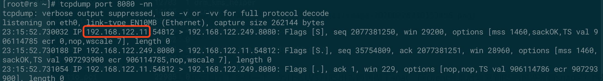

最近在看kube-proxy ipvs的源码，发现用了很多年的LVS而且NAT模式居多的我尽然不知道原来LVS可以利用Iptables实现SNAT模式。很长时间以来一直以为LVS的NAT模式只支持DNAT，真是印证了“纸上得来终觉浅，绝知此事要躬行”，还是要多读源码。

惯用思路，先实践验证后分细原理。
<!-- more -->

先搭建一套普通的LVS NAT模式环境。

## 环境

|角色	|IP|
|---|---|
|LVS|192.168.122.11、10.0.5.63(模拟公网)、10.0.0.254(VIP)|
|RealServer |192.168.122.249|
|Client |10.0.5.119|


LVS有两块网卡，分别模拟公网和内网。

## 配置NAT模式

### RealServer
在192.168.122.249上起一个简单web程序充当RealServer
```sh
[root@rs ~]# python -m SimpleHTTPServer 8080
Serving HTTP on 0.0.0.0 port 8080 ...
```
默认网关指向LVS的内网IP: 192.168.122.11
```sh
[root@rs ~]# ip route show
default via 192.168.122.11 dev eth0  proto static  metric 100
192.168.122.0/24 dev eth0  proto kernel  scope link  src 192.168.122.249  metric 100
```

### lVS
##### 开启转发
```sh
echo 1 > /proc/sys/net/ipv4/conf/all/forwarding
```
##### 创建VS
```sh
ipvsadm -A -t 10.0.0.254:80 -s rr
```
##### 添加RS
```sh
ipvsadm -a -t 10.0.0.254:80 -r 192.168.122.249:8080 -m -w 1
```
##### 绑定VIP
```sh
ip addr add 10.0.0.254/24 dev eth1
```
```sh
[root@lvs ~]# ipvsadm -ln
IP Virtual Server version 1.2.1 (size=4096)
Prot LocalAddress:Port Scheduler Flags
  -> RemoteAddress:Port           Forward Weight ActiveConn InActConn
TCP  10.0.0.254:80 rr
  -> 192.168.122.249:8080         Masq    1      0          0
```

##### 验证
在客户端上curl一下VIP，验证一下能否访问到RS上的服务。

OK，没有问题。

## 抓包分析NAT模式

都知道NAT模式只会修改目的IP,即VIP->RIP，并不会修改源IP，即CIP->DIP(lvs本机ip)，我们来用tcpdump抓包验证一下是不是这样。

在RS上使用tcpdump port 8080 -nn开启抓包


从抓包的结果来看LVS NAT模式只修改了目的ip，没有修改源ip。

另外，我们再猜想一下RS这会能不能访问外网。先推理一下，虽然gw已经指向了LVS，但是由于LVS只做DNAT，以及iptables也没有做相关SNAT的配置，所以RS当然是不能访问外网的，来验证一下。


结果当然是不能的。

## 结合iptables做SNAT

iptables 要做snat肯定是在nat表的POSTROUTING链上做，所以我们先粗暴的来一条iptables -t nat -A POSTROUTING -j MASQUERADE看看会发生什么。

```sh
[root@lvs ~]# iptables -nL -t nat
Chain PREROUTING (policy ACCEPT)
target     prot opt source               destination

Chain INPUT (policy ACCEPT)
target     prot opt source               destination

Chain OUTPUT (policy ACCEPT)
target     prot opt source               destination

Chain POSTROUTING (policy ACCEPT)
target     prot opt source               destination
MASQUERADE  all  --  0.0.0.0/0            0.0.0.0/0
```

赶紧看看服务还能不能用，瑟瑟发抖。

curl 10.0.0.254，正常，还好没发生血案。

抓包看看有没有SNAT。


然并卵，源ip还是客户端的ip。

再看看RS这会能不能出公网。


可以了，意外的收获。

之前的认知也就止步于此。

反省一下其实应该再往下多想一下：为什么LVS对RS出去的包做了snat，而client进来后转发到RS的包没有做snat呢？

其实是需要启用内核一个参数，net.ipv4.vs.conntrack=1 是我在读kube-proxy ipvs源码时发现的。

我们来启用下：
```sh
echo 1 > /proc/sys/net/ipv4/vs/conntrack
```
再来抓包看一下


发现snat已经生效了，客户端的IP已经修改成了LVS内网IP，即：CIP --> DIP。

## 原理分析

net.ipv4.vs.conntrack=1的作用是什么，为什么启用了它以后就iptables就能snat？

关于net.ipv4.vs.conntrack参数网上的资料比较少，还是得查手册，https://www.kernel.org/doc/Documentation/networking/ipvs-sysctl.txt

```sh
conntrack - BOOLEAN
	0 - disabled (default)
	not 0 - enabled

	If set, maintain connection tracking entries for
	connections handled by IPVS.

	This should be enabled if connections handled by IPVS are to be
	also handled by stateful firewall rules. That is, iptables rules
	that make use of connection tracking.  It is a performance
	optimisation to disable this setting otherwise.

	Connections handled by the IPVS FTP application module
	will have connection tracking entries regardless of this setting.

	Only available when IPVS is compiled with CONFIG_IP_VS_NFCT enabled.
```

再看下模块帮助，https://github.com/torvalds/linux/blob/master/net/netfilter/ipvs/Kconfig

```sh
config	IP_VS_NFCT
	bool "Netfilter connection tracking"
	depends on NF_CONNTRACK
	---help---
	  The Netfilter connection tracking support allows the IPVS
	  connection state to be exported to the Netfilter framework
	  for filtering purposes.
```

意思比较直白了，就是让Netfilter的状态管理功能也能应用于IPVS模块，反过来也就是说默认nf_conntract没法作用于ipvs，好像是费话哈，接下来我们就来分析下为什么不能。

还是一样的思路，先实践再慢慢推理。

抄家伙，在lvs机器上yum install -y conntrack-tools

正式开始:

>1. echo 0 > /proc/sys/net/ipv4/vs/conntrack,先禁用ipvs nfct的功能。
>2. iptables -t nat -F 清空nat表的规则。
>3. conntrack -F清除一下nf_conntrack表
>4. 在客户机上curl 10.0.0.254
>5. 查看lvs的conntrack表


这时连接信息不会记录到conntrack表

>1. echo 1 > /proc/sys/net/ipv4/vs/conntrack,启用ipvs nfct看下会不会记录
>2. 再次查看lvs的conntrack表


源IP已经被替换成lvs的内网IP了。


下面我们来分析下为什么会出现上边的结果，分析下ipvs nfct的实现原理。

LVS（Linux Virtual Server）能实现负载均衡主要依靠内核IPVS (IP Virtual Server)模块，而IPVS是基于内核Netfilter实现。IPVS利用了Netfilter的Hook机制，主要在三个Hook点放置了钩子函数，分别是：NF_INET_LOCAL_IN、NF_INET_LOCAL_OUT和NF_INET_FORWARD，源码如下：
```c
static struct nf_hook_ops ip_vs_ops[] __read_mostly = {
	/* After packet filtering, change source only for VS/NAT */
	// @xnile RIP->DIP修改为VIP->DIP,用于本机请求VIP后的回包
	{
		.hook		= ip_vs_reply4,
		.owner		= THIS_MODULE,
		.pf		= NFPROTO_IPV4,
		.hooknum	= NF_INET_LOCAL_IN,
		.priority	= NF_IP_PRI_NAT_SRC - 2,
	},
	/* After packet filtering, forward packet through VS/DR, VS/TUN,
	 * or VS/NAT(change destination), so that filtering rules can be
	 * applied to IPVS. */
	// @xnile CIP->VIP修改为CIP->RIP
	{
		.hook		= ip_vs_remote_request4,
		.owner		= THIS_MODULE,
		.pf		= NFPROTO_IPV4,
		.hooknum	= NF_INET_LOCAL_IN,
		.priority	= NF_IP_PRI_NAT_SRC - 1,
	},
	/* Before ip_vs_in, change source only for VS/NAT */
	// @xnile  NF_INET_LOCAL_OUT 本机应用层发出去的包
	// @xnile  DIP->DIP 修改为DIR->VIP
	{
		.hook		= ip_vs_local_reply4,
		.owner		= THIS_MODULE,
		.pf		= NFPROTO_IPV4,
		.hooknum	= NF_INET_LOCAL_OUT,
		.priority	= NF_IP_PRI_NAT_DST + 1,
	},
	/* After mangle, schedule and forward local requests */
	// @xnile  NF_INET_LOCAL_OUT 本机应用层发出去的包
	// @xnile DIP->VIP修改为DIP->RIP
	{
		.hook		= ip_vs_local_request4,
		.owner		= THIS_MODULE,
		.pf		= NFPROTO_IPV4,
		.hooknum	= NF_INET_LOCAL_OUT,
		.priority	= NF_IP_PRI_NAT_DST + 2,
	},
	/* After packet filtering (but before ip_vs_out_icmp), catch icmp
	 * destined for 0.0.0.0/0, which is for incoming IPVS connections */
	{
		.hook		= ip_vs_forward_icmp,
		.owner		= THIS_MODULE,
		.pf		= NFPROTO_IPV4,
		.hooknum	= NF_INET_FORWARD,
		.priority	= 99,
	},
	/* After packet filtering, change source only for VS/NAT */
	//@xnile RIP->CIP to src为VIP
	{
		.hook		= ip_vs_reply4,
		.owner		= THIS_MODULE,
		.pf		= NFPROTO_IPV4,
		.hooknum	= NF_INET_FORWARD,
		.priority	= 100,
	},
#ifdef CONFIG_IP_VS_IPV6
//... 省略ipv6部分
#endif
};
```

注意留意一下上边hook的优先级，我们再看下iptables nat勾子函数的定义

```c
static struct nf_hook_ops nf_nat_ipv4_ops[] __read_mostly = {
	/* Before packet filtering, change destination */
	// @xnile  iptables -t nat -A REROUTING
	{
		.hook		= nf_nat_ipv4_in,
		.owner		= THIS_MODULE,
		.pf		= NFPROTO_IPV4,
		.hooknum	= NF_INET_PRE_ROUTING,
		.priority	= NF_IP_PRI_NAT_DST,
	},
	/* After packet filtering, change source */
	// @xnile iptables -t nat -A POSTROUTING
	{
		.hook		= nf_nat_ipv4_out,
		.owner		= THIS_MODULE,
		.pf		= NFPROTO_IPV4,
		.hooknum	= NF_INET_POST_ROUTING,
		.priority	= NF_IP_PRI_NAT_SRC,
	},
	/* Before packet filtering, change destination */
	// @xnile iptables -t nat -A OUTPUT
	// @xnile DNAT 本机出去的包
	{
		.hook		= nf_nat_ipv4_local_fn,
		.owner		= THIS_MODULE,
		.pf		= NFPROTO_IPV4,
		.hooknum	= NF_INET_LOCAL_OUT,
		.priority	= NF_IP_PRI_NAT_DST,
	},
	/* After packet filtering, change source */
	// @xnile SNAT 
	{
		.hook		= nf_nat_ipv4_fn,
		.owner		= THIS_MODULE,
		.pf		= NFPROTO_IPV4,
		.hooknum	= NF_INET_LOCAL_IN,
		.priority	= NF_IP_PRI_NAT_SRC,
	},
};
```

借用一张Netfilter钩子函数与钩子点位置关系图看起来会更直观一些。


## 背景知识：

1. NAT构建于nf_conntrack之上，当数据包进入nf_conntrack后，会建立一个tuple以及相应的replay tuple，而应答的数据包，会直接查找与之匹配的repaly tuple
```sh
tuple[ORIGINAL]={10.0.5.119-->10.0.0.254,TCP}
tuple[REPLY]={10.0.0.254-->10.0.5.119,TCP}
如果要做SNAT就修改replay tuple中的目的地址，如果要做DNAT就修改replay tuple中的源地址。
```

2. 另外，nf_conntrack有一个confirm的逻辑，就是上图中最上边绿色的部分，只有当数据流的头包离开协议栈的时候才会被confirm，被confirm过的conntrack才会加入到conntrack哈希表。

困为LVS钩子函数的优先级要高于confirm，数据流会首先导向到lvs的钩子函数中处理，然而钩子函数处理后会返回NF_STOLEN，也就是数据流不会再往下走了，当然也就不会执行confirm逻辑，因此conntrack表中就不会有对应的tuple和replay tuple，SNAT当然也就不起作用。

LVS数据流

```sh
ip_vs_nat_xmit->ip_vs_nat_send_or_cont->ip_vs_update_conntrack

ip_vs_conn_new->ip_vs_bind_xmit
```

## 新问题
Q: 如果telnet目标机器上一个未监听的端口，在目标机器上用conntrack -L为什么看不到这个链接的状态？此包是在哪个阶段被丢弃的。

猜测只有回复ACK后才会更新状态。

假如这条链接能记录到conntrack表里，又应该给它个什么状态呢，三次握手之外的新状态？

因为没有去分析源码，所以只是推测，以后有时间再去研究下。

## 总结
虽然LVS结合iptables也可以实现类似FULLNAT的效果，但也并非完美，除了性能问题外还有一个严重的问题：RealServer无法获取客户端的IP，正因为如此才有了LVS FULLNAT这样项目的存在。

参考
http://ja.ssi.bg/nfct/HOWTO.txt

https://netfilter.org/documentation/HOWTO/netfilter-hacking-HOWTO.txt

https://www.kernel.org/doc/Documentation/networking/ipvs-sysctl.txt

https://stackoverflow.com/questions/19342950/what-is-the-difference-between-nf-drop-and-nf-stolen-in-netfilter-hooks

http://staff.ustc.edu.cn/~james/linux/conntrack.html

https://www.cnblogs.com/jinrize/archive/2009/11/09/1599067.html

https://blog.csdn.net/sinat_20184565/article/details/101271253

http://www.linuxtcpipstack.com/705.html

https://www.kernel.org/doc/Documentation/networking/nf_conntrack-sysctl.txt

https://blog.csdn.net/sahusoft/article/details/4029890

http://www.austintek.com/LVS/LVS-HOWTO/HOWTO/LVS-HOWTO.fwmark.html

http://abcdxyzk.github.io/blog/2018/06/12/kernel-nf_socket/

https://www.codeleading.com/article/53531803272/

https://www.cnblogs.com/wanpengcoder/p/11755741.html

http://cxd2014.github.io/2017/09/29/linux-nat/

https://opengers.github.io/openstack/openstack-base-netfilter-framework-overview/

https://www.frozentux.net/iptables-tutorial/iptables-tutorial.html

https://blog.csdn.net/sahusoft/article/details/4029890

https://blog.csdn.net/dog250/article/details/5846448

https://www.cnblogs.com/codestack/p/10850669.html

https://arthurchiao.github.io/blog/deep-dive-into-iptables-and-netfilter-arch-zh/

https://blog.csdn.net/dog250/article/details/9732185

http://zh.linuxvirtualserver.org/node/2245

http://zh.linuxvirtualserver.org/node/2910