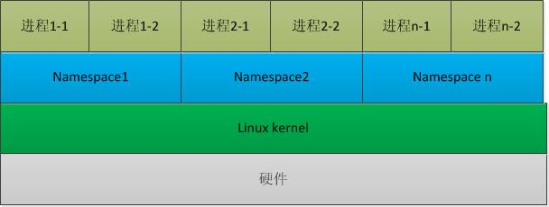

# Linux内核namespace机制

Linux Namespaces机制提供一种资源隔离方案。PID,IPC,Network等系统资源不再是全局性的，而是属于某个特定的Namespace。每个namespace下的资源对于其他namespace下的资源都是透明，不可见的。因此在操作系统层面上看，就会出现多个相同pid的进程。系统中可以同时存在两个进程号为0,1,2的进程，由于属于不同的namespace，所以它们之间并不冲突。而在用户层面上只能看到属于用户自己namespace下的资源，例如使用ps命令只能列出自己namespace下的进程。这样每个namespace看上去就像一个单独的Linux系统。

<!-- more -->

