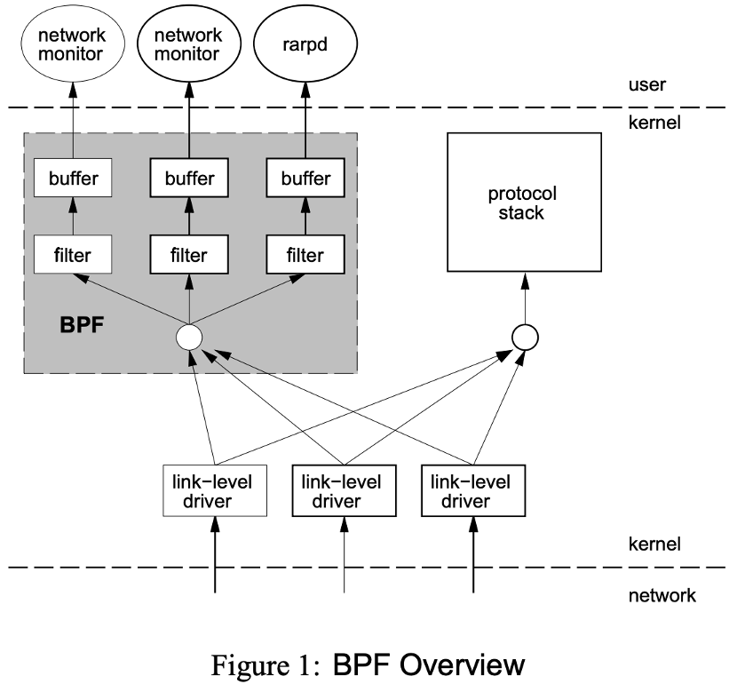
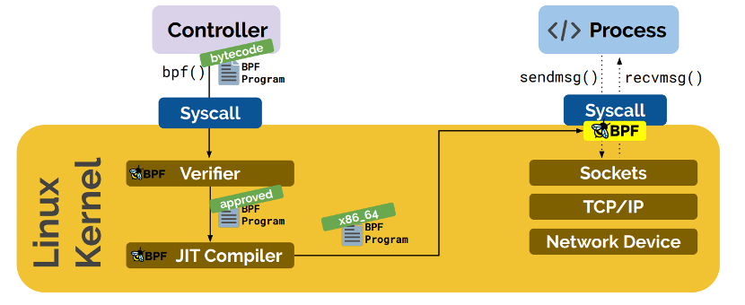
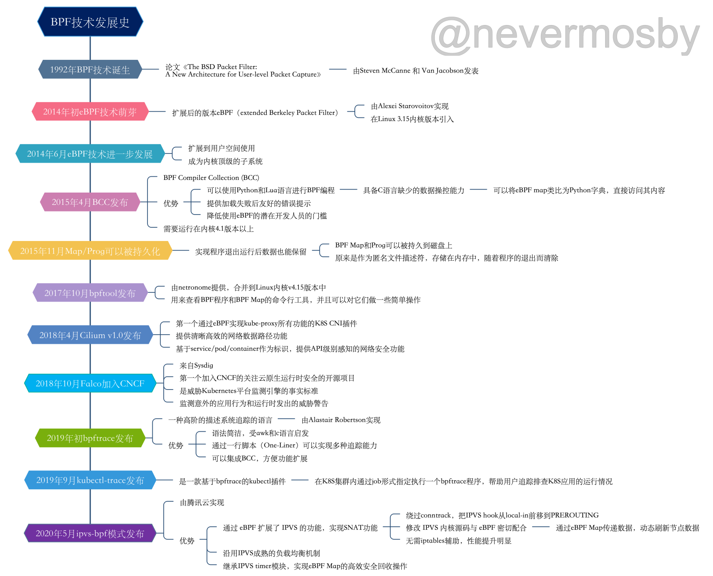
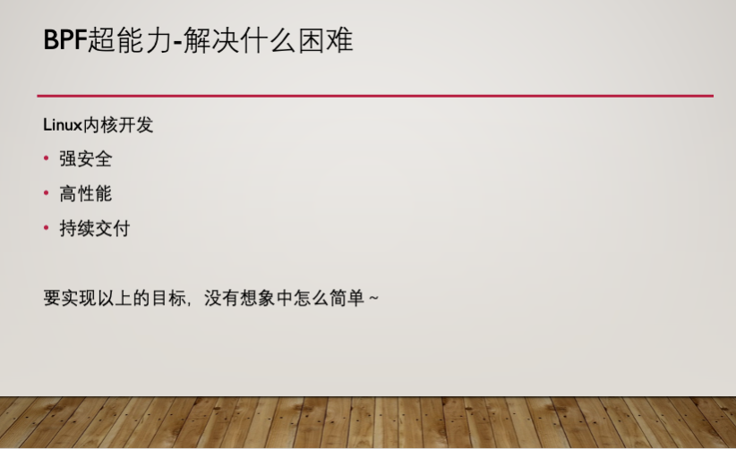

# 简介

BPF全称是「Berkeley Packet Filter」，翻译过来是「伯克利包过滤器」，顾名思义，它是在伯克利大学诞生的，1992年Steven McCanne 和 Van Jacobson 写了一篇[《The BSD Packet Filter: A New Architecture for User-level Packet Capture》论文](http://www.tcpdump.org/papers/bpf-usenix93.pdf) ，第一次提出了BPF技术，在文中，作者描述了他们如何在 Unix 内核实现网络数据包过滤，这种新的技术比当时最先进的数据包过滤技术快 20 倍。

<!-- more -->

下图为BPF概览，来自上面的论文：

BPF 在数据包过滤上引入了两大革新：

>1. 一个新的虚拟机 (VM) 设计，可以有效地工作在基于寄存器结构的 CPU 之上；
>2. 应用程序使用缓存只复制与过滤数据包相关的数据，不会复制数据包的所有信息，最大程度地减少BPF 处理的数据，提高处理效率；

我们熟悉的tcpdump就是基于BPF技术，成为了站在神器肩膀上的「神器」。

发展到现在名称升级为eBPF：「extended Berkeley Packet Filter」。它演进成为了一套通用执行引擎，提供可基于系统或程序事件高效安全执行特定代码的通用能力，通用能力的使用者不再局限于内核开发者。其使用场景不再仅仅是网络分析，可以基于eBPF开发性能分析、系统追踪、网络优化等多种类型的工具和平台。

eBPF 由执行字节码指令、存储对象和辅助函数组成。下图是eBPF工作原理演示：

eBPF字节码指令在内核执行前必须通过 BPF 验证器的验证，同时在启用 BPF JIT 模式的内核中，会直接将字节码指令转成内核可执行的本地指令运行，具有很高的执行效率。

原来的 BPF 就被称为cBPF（classic BPF），目前已基本废弃。当前Linux 内核只运行 eBPF，内核会将cBPF 透明转换成 eBPF 再执行。下文提到的BPF字样没有特别说明的话，是泛指cBPF和eBPF。

BPF技术发展史
从1992年发布以来，BPF技术快速发展，除了技术本身得到了升级，基于它的工具和平台也如雨后春笋一般层出不穷，下面是我整理的BPF技术发展史，里面罗列几个重要的eBPF发展里程碑和基于eBPF技术的工具和平台的诞生事件，其中包括BCC、Cilium、Falco、bpftrace、kubectl-trace，还有最近非常热门的腾讯云独创的IPVS-BPF模式：

BPF的超能力是什么
那么对于Linux内核开发来说，BPF究竟有哪些超能力，吸引了这么多的开发者纷纷「入局」？

在了解BPF的超能之前，我们先来看下当前Linux内核由哪些困难。

传统的Linux内核开发需要实现以下3个目标：

>1. 强安全，即不能允许不可信的代码运行在内核中，这是头等重要的事情
>2. 高性能，作为承载千百万服务的操作系统内核，如果没有高性能的保障，互联网蓬勃发展将收到严重影响
>3. 持续交付，在越来越多应用进入到云原生时代的今天，持续交付这个命题，一点都不陌生，而在内核开发领域，这点也至关重要，每次功能的升级，都需要你重新安装新的系统，大多数人都不会买账。我们希望做到跟Chrome浏览器升级一样，用户都不会注意到升级完成了（除非有一些视觉上的变化），实现真正的无缝升级。

然而想要实现上面的目标，没有想象中那么简单。

我们来看进行Linux内核开发的一般解决方案以及它们的缺陷。
