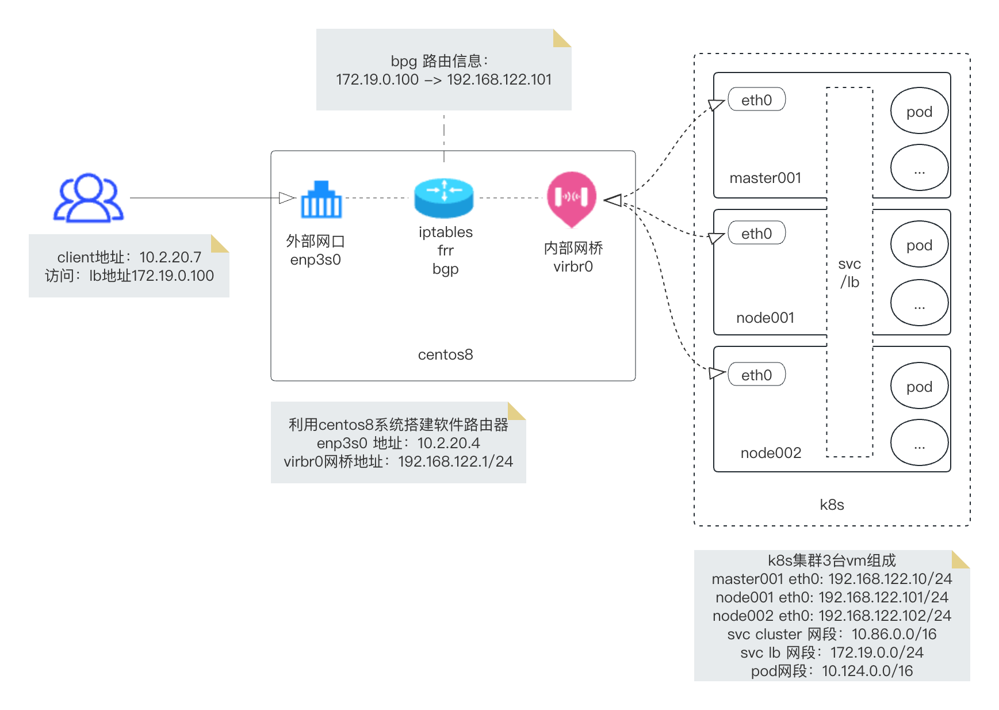
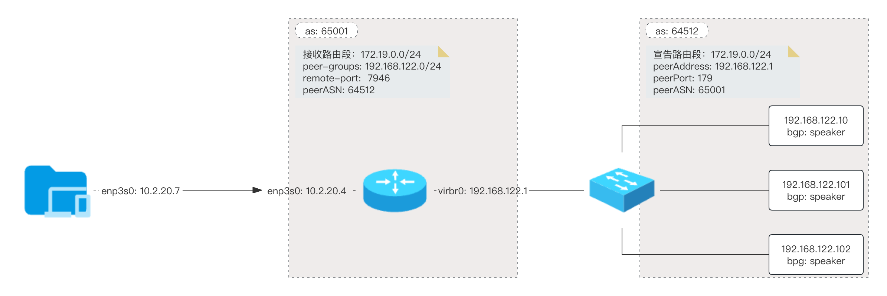
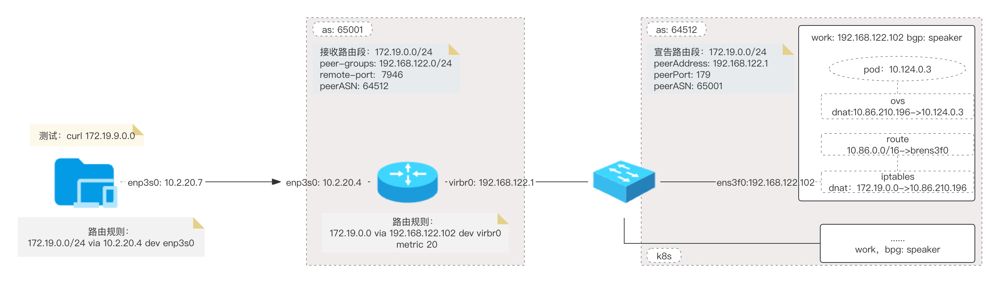

# LB服务和BGP路由器测试

# 安装 k8s lb 控制器

[《k8s lb服务metallb(bgp模式)介绍》](https://flftuu.com/2023/06/08/k8s-lb服务metallb-bgp模式-介绍/#more)

# 配置 Linux 软路由器

<!-- more -->

网络架构图：

### 配置路由 bgp 功能

BGP 是一种外部网关协议 （EGP），用于在不同自治系统 （AS） 中的路由器之间交换路由信息。BGP 路由信息包括到每个目标的完整路由。BGP 使用路由信息来维护网络可访问性信息数据库，该数据库与其他 BGP 系统交换。BGP 使用网络可访问性信息来构建 AS 连接图，使 BGP 能够在 AS 级别移除路由环路并实施策略决策。

bgp as 网络架构图 例子：

##### 方法 1：gobgpd

利用 gobgpd 搭建，GoBGP 是一种开源边界网关协议 (BGP) 实现，从头开始为现代环境设计，并以现代编程语言 Go 编程语言实现。

一些开源软件工具包，例如 frr/zerba 也能实现，简单介绍下另一个开源路由软件：gobgp，基于go开发的一款工具，性能自然是杠杠的了。此外，该工具仅支持BGP，并不像zerba那样，支持ospf，rip，bgp等其他路由协议。

参考文档：[https://github.com/osrg/gobgp/blob/master/docs/sources/zebra.md](https://github.com/osrg/gobgp/blob/master/docs/sources/zebra.md)

**1， 配置 bgp server**

    mkdir gobgp
    cat <<EOF >gobgp/gobgp.conf
    [global.config]
      as = 65001
      port = 179
      router-id = "192.168.122.1"
    
    [[peer-groups]]
      [peer-groups.config]
        peer-group-name = "example"
        peer-as = 64512
      [[peer-groups.afi-safis]]
        [peer-groups.afi-safis.config]
          afi-safi-name = "ipv4-unicast"
      [[peer-groups.afi-safis]]
        [peer-groups.afi-safis.config]
          afi-safi-name = "ipv4-flowspec"
      [peer-groups.transport]
        [peer-groups.transport.config]
          remote-port = 7946
    
    [[dynamic-neighbors]]
      [dynamic-neighbors.config]
        prefix = "192.168.122.0/24"
        peer-group = "example"
    
    [zebra.config]
      enabled = true
      url = "unix:/var/run/frr/zserv.api"
      redistribute-route-type-list = ["connect"]
      version = 6
    EOF

**2，启动 bgp server**

    docker run --privileged -it -d --network=host --rm --name gobgp -v $PWD/gobgp:/etc/gobgp:rw flftuu/frr:v8.1.0
    
    # 启动gobgpd 服务
    docker exec -it gobgp gobgpd -f /etc/gobgp/gobgp.conf  -l debug --sdnotify

**3，查看 bgp 信息**

    # 查看配置信息
    [root@yusur-55 ~]# docker exec -it gobgp gobgp  global
    AS:        65001
    Router-ID: 192.168.122.1
    Listening Port: 179, Addresses: 0.0.0.0, ::
    
    # 查看所有neighbor信息
    [root@yusur-55 ~]# docker exec -it gobgp gobgp  neighbor 
    Peer               AS  Up/Down State       |#Received  Accepted
    192.168.122.102 64512 00:01:47 Establ      |        2         2
    
    # 查看neighbor 是否宣告了路由信息
    [root@yusur-55 ~]# docker exec -it gobgp gobgp  neighbor  192.168.122.102 adj-in
       ID  Network              Next Hop             AS_PATH              Age        Attrs
       0   172.19.0.0/32        192.168.122.102      64512                00:02:45   [{Origin: i}]
       0   172.19.0.100/32      192.168.122.102      64512                00:02:45   [{Origin: i}]
    
    # 查看是否有bgp路由信息
    [root@yusur-55 ~]# docker exec -it gobgp gobgp global rib
       Network              Next Hop             AS_PATH              Age        Attrs
    *> 10.2.20.0/23         0.0.0.0                                   00:04:37   [{Origin: i} {Med: 0}]
    *> 10.244.0.0/24        0.0.0.0                                   00:04:37   [{Origin: i} {Med: 0}]
    *> 10.244.0.0/32        0.0.0.0                                   00:04:37   [{Origin: i} {Med: 0}]
    *> 172.19.0.0/32        192.168.122.102      64512                00:04:30   [{Origin: i} {Med: 0}]
    *> 172.19.0.100/32      192.168.122.102      64512                00:04:30   [{Origin: i} {Med: 0}]
    *> 192.168.100.0/24     0.0.0.0                                   00:04:37   [{Origin: i} {Med: 0}]
    *> 192.168.122.0/24     0.0.0.0                                   00:04:37   [{Origin: i} {Med: 0}]
    *> 192.168.200.0/24     0.0.0.0                                   00:04:37   [{Origin: i} {Med: 0}]
    
    
    # 查看bgp 路由是否已经同步到linux 内核路由中
    [root@yusur-55 ~]# ip route list proto bgp
    172.19.0.0 via 192.168.122.102 dev virbr0 metric 20 
    172.19.0.100 via 192.168.122.102 dev virbr0 metric 20 

**3，附件**

详细开发文档

[《gobgp 本地调试介绍》](https://flftuu.com/2023/06/08/gobgp-本地调试/#more)

##### 方法 2：frr

使用 frr 工具包搭建，FRRouting (FRR) 是适用于 Linux 和 Unix 平台的免费开源 Internet 路由协议套件。它实现了 BGP、OSPF、RIP、IS-IS、PIM、LDP、BFD、Babel、PBR、OpenFabric 和 VRRP，并支持 EIGRP 和 NHRP。

FRR 与本地 Linux/Unix IP 网络堆栈的无缝集成使其成为适用于各种用例的通用路由堆栈，包括将主机/VM/容器连接到网络、广告网络服务、LAN 交换和路由、Internet 访问路由器、和互联网对等。

参考文档：[https://frrouting.org/](https://frrouting.org/)

**系统架构:**

**传统的路由软件是作为一个进程程序，提供所有的路由协议功能**。FRR采取了不同的方法。**FRR是一组守护程序**，它们共同构建路由表。**每个主要协议都在自己的守护进程中实现**，这些守护进程与**中间守护进程（zebra）**通信，后者**负责协调路由决策并与数据平面通信**。体系结构图：

    +----+  +----+  +-----+  +----+  +----+  +----+  +-----+
    |bgpd|  |ripd|  |ospfd|  |ldpd|  |pbrd|  |pimd|  |.....|
    +----+  +----+  +-----+  +----+  +----+  +----+  +-----+
         |       |        |       |       |       |        |
    +----v-------v--------v-------v-------v-------v--------v
    |                                                      |
    |                         Zebra                        |
    |                                                      |
    +------------------------------------------------------+
           |                    |                   |
           |                    |                   |
    +------v------+   +---------v--------+   +------v------+
    |             |   |                  |   |             |
    | *NIX Kernel |   | Remote dataplane |   | ........... |
    |             |   |                  |   |             |
    +-------------+   +------------------+   +-------------+

**1，配置 frr 服务**

    mkdir frr
    touch frr/vtysh.conf
    cat <<EOF >frr/daemons
    bgpd=yes
    EOF

**2，启动 frr 服务**

    docker run  --privileged  -it -d --network=host --rm --name frr8  -v  $PWD/frr:/etc/frr:rw flftuu/frr:v8.1.0

**3，vtysh 方式配置 bgp**

    # 进入vtysh 中
    vtysh
    # 查看当前配置
    show running-config
    # 进行配置模式
    config t
    
    # bgp配置
    router bgp 65001
    bgp router-id 192.168.122.1
    neighbor 192.168.122.101 remote-as 64512
    neighbor 192.168.122.102 remote-as 64512
    no bgp ebgp-requires-policy
    address-family ipv4 unicast
    exit-address-family
    
    debug bgp keepalives
    debug bgp neighbor-events
    debug bgp nht
    debug bgp updates in
    debug bgp updates out
    debug bgp zebra
    debug zebra nht
    debug zebra rib
    
    
    # 退出config-router 模式
    exit
    # 退出config模式
    exit

或者写如配置文件中，重启frr8 容器

    cat <<EOF >frr/bgpd.conf
    router bgp 65001
    bgp router-id 192.168.122.1
    neighbor 192.168.122.101 remote-as 64512
    neighbor 192.168.122.102 remote-as 64512
    no bgp ebgp-requires-policy
    address-family ipv4 unicast
    exit-address-family
    
    debug bgp keepalives
    debug bgp neighbor-events
    debug bgp nht
    debug bgp updates in
    debug bgp updates out
    debug bgp zebra
    debug zebra nht
    debug zebra rib
    EOF
    
    # 重启frr8容器
    docker rm -f frr8
    docker run  --privileged  -it -d --network=host --rm --name frr8  -v  $PWD/frr:/etc/frr:rw flftuu/frr:v8.1.0

**4，查看 bgp 信息**

    # 进入vtysh
    docker exec -it frr8 vtysh 
    yusur-55# show ip bgp
    BGP table version is 2, local router ID is 192.168.122.1, vrf id 0
    Default local pref 100, local AS 65001
    Status codes:  s suppressed, d damped, h history, * valid, > best, = multipath,
                   i internal, r RIB-failure, S Stale, R Removed
    Nexthop codes: @NNN nexthops vrf id, < announce-nh-self
    Origin codes:  i - IGP, e - EGP, ? - incomplete
    RPKI validation codes: V valid, I invalid, N Not found
    
       Network          Next Hop            Metric LocPrf Weight Path
    *> 172.19.0.0/32    192.168.122.102                        0 64512 i
    *> 172.19.0.100/32  192.168.122.102                        0 64512 i
    
    # 查看 summary 信息
    yusur-55# show ip bgp summary
    
    IPv4 Unicast Summary (VRF default):
    BGP router identifier 192.168.122.1, local AS number 65001 vrf-id 0
    BGP table version 2
    RIB entries 3, using 552 bytes of memory
    Peers 1, using 716 KiB of memory
    
    Neighbor        V         AS   MsgRcvd   MsgSent   TblVer  InQ OutQ  Up/Down State/PfxRcd   PfxSnt Desc
    192.168.122.102 4      64512         9         8        0    0    0 00:02:42            2        2 N/A
    
    Total number of neighbors 1
    
    
    # 查看bgp route 信息
    yusur-55# show ip route
    Codes: K - kernel route, C - connected, S - static, R - RIP,
           O - OSPF, I - IS-IS, B - BGP, E - EIGRP, N - NHRP,
           T - Table, v - VNC, V - VNC-Direct, A - Babel, F - PBR,
           f - OpenFabric,
           > - selected route, * - FIB route, q - queued, r - rejected, b - backup
           t - trapped, o - offload failure
    
    K>* 0.0.0.0/0 [0/100] via 10.2.20.1, enp3s0, 00:05:23
    C>* 10.2.20.0/23 is directly connected, enp3s0, 00:05:23
    C>* 10.244.0.0/24 is directly connected, cni0, 00:05:23
    C>* 10.244.0.0/32 is directly connected, flannel.1, 00:05:23
    B>* 172.19.0.0/32 [20/0] via 192.168.122.102, virbr0, weight 1, 00:03:49
    B>* 172.19.0.100/32 [20/0] via 192.168.122.102, virbr0, weight 1, 00:03:49
    C>* 192.168.100.0/24 is directly connected, virbr1, 00:05:23
    C>* 192.168.122.0/24 is directly connected, virbr0, 00:05:23
    C>* 192.168.200.0/24 is directly connected, virbr2, 00:05:23
    
    
    # 查看bgp 路由是否已经同步到linux 内核路由中
    [root@yusur-55 ~]# ip route list proto bgp
    172.19.0.0 via 192.168.122.102 dev virbr0 metric 20 
    172.19.0.100 via 192.168.122.102 dev virbr0 metric 20 

**5，附件**

    show ip bgp [x.x.x.x](longer)
    show ip bgp summary
    show ip route [x.x.x.x](longer)
    show ip bgp neighbor [x.x.x.x]
    show ip bgp neighbor 192.168.122.1 advertised-routes
    show ip bgp neighbor x.x.x.x received-routes
     
    debug bgp all
    debug bgp flowspec
    clear bgp * (soft in/soft out)

### 配置路由转发功能

要将CentOS配置为路由器，您需要执行以下步骤：

**配置网络接口：**

首先，确保您有至少两个网络接口，一个用于连接到互联网（外部接口），另一个用于连接到本地网络（内部接口）。

您可以使用\`ifconfig\`或\`ip addr\`命令来查看可用的网络接口。假设您的外部接口是enp3s0，内部接口是virbr0。

##### 2. 启用IP转发

打开\`/etc/sysctl.conf\`文件并查找以下行：

    #net.ipv4.ip_forward=1
    
    #将其取消注释，或者如果没有该行，则添加以下行：
    net.ipv4.ip_forward=1
    
    #保存文件并运行以下命令使更改生效：
    sysctl -p

##### 3. 配置网络地址转换（NAT）

使用以下命令配置iptables规则，以实现网络地址转换（NAT）：

    # 前提清空现有iptables 规则
    iptables -t nat -I POSTROUTING 1 -o enp3s0 -j MASQUERADE
    
    iptables -I FORWARD 1 -i enp3s0 -o virbr0 -m state --state RELATED,ESTABLISHED -j ACCEPT
    
    iptables -I FORWARD 1 -i virbr0 -o enp3s0 -j ACCEPT

这些规则将允许转发从内部接口（virbr0）到外部接口（enp3s0）的流量，并自动处理源地址转换。

##### 4. 查看路由规则

    # 该规则由 frr 利用bgp协议 自动学习k8s中配置svc 的lb ip地址
    #route add -host 172.19.0.100/32 gw 192.168.122.101
    
    # 查看bgp路由是否写入linux 内核路由中
    [root@yusur-55 ~]# ip route list proto bgp
    172.19.0.0 via 192.168.122.102 dev virbr0 metric 20 
    172.19.0.100 via 192.168.122.102 dev virbr0 metric 20

### 流量测试

##### 手动 配置 gw 为10.2.20.4

    # 添加172.19.0.0/24 的默认网关地址(为centos的enp3s0地址)
    route add -net 172.19.0.0/24 gw 10.2.20.4
    
    # 或者在本机开启frr bgp 功能从10.2.20.4 路由器学习bgp路由

##### 在客户端访问 curl 172.19.0.100 地址

    [root@yusur-25 ~]# curl 172.19.0.100
    <!DOCTYPE html>
    <html>
    <head>
    <title>Welcome to nginx!</title>
    
    </head>
    <body>
    <h1>Welcome to nginx!</h1>
    
If you see this page, the nginx web server is successfully installed and
    working. Further configuration is required.

    
    
For online documentation and support please refer to
    <a href="http://nginx.org/">nginx.org</a>. 
    Commercial support is available at
    <a href="http://nginx.com/">nginx.com</a>.

    
    
<em>Thank you for using nginx.</em>

    </body>
    </html>
    
    
    [root@yusur-25 ~]# curl 172.19.0.0
    <!DOCTYPE html>
    <html>
    <head>
    <title>Welcome to nginx!</title>
    
    </head>
    <body>
    <h1>Welcome to nginx!</h1>
    
If you see this page, the nginx web server is successfully installed and
    working. Further configuration is required.

    
    
For online documentation and support please refer to
    <a href="http://nginx.org/">nginx.org</a>. 
    Commercial support is available at
    <a href="http://nginx.com/">nginx.com</a>.

    
    
<em>Thank you for using nginx.</em>

    </body>
    </html>

##### 查看 curl 转发流程

###### iptables dnat 信息

    root@work002:~# iptables -vn -t nat -L  OVN-KUBE-EXTERNALIP
    Chain OVN-KUBE-EXTERNALIP (2 references)
     pkts bytes target     prot opt in     out     source               destination         
        8   480 DNAT       tcp  --  *      *       0.0.0.0/0            172.19.0.0           tcp dpt:80 to:10.86.210.196:80
    
    # pkts 包的数量发生变化

###### 本机路由匹配

    root@work002:~# ip route  | grep 10.86.0.0/16
    10.86.0.0/16 via 169.254.169.4 dev brens3f0 mtu 1400 
    # 根据dst 转发到 ovs网桥

###### ovs 转发流表

    root@work002:~# ovs-appctl dpctl/dump-flows -m | grep 10.86.210.196
    ufid:0bd14815-d0f3-44b4-8c31-7624e3d19ff1, recirc_id(0x13d),dp_hash(0/0),skb_priority(0/0),in_port(brens3f0),skb_mark(0/0),ct_state(0x21/0x25),ct_zone(0/0),ct_mark(0/0),ct_label(0/0),eth(src=00:00:00:00:00:00/00:00:00:00:00:00,dst=00:00:00:00:00:00/00:00:00:00:00:00),eth_type(0x0800),ipv4(src=0.0.0.0/0.0.0.0,dst=10.86.210.196,proto=6,tos=0/0,ttl=0/0,frag=no),tcp(src=0/0,dst=80),tcp_flags(0/0), packets:0, bytes:0, used:never, dp:ovs, actions:hash(l4(0)),recirc(0x13e)
    ufid:f745e2c4-b92f-4072-ad11-980114e3b9b3, recirc_id(0x13c),dp_hash(0/0),skb_priority(0/0),in_port(brens3f0),skb_mark(0/0),ct_state(0x21/0x23),ct_zone(0/0),ct_mark(0/0x2),ct_label(0/0),eth(src=52:54:00:e0:72:df,dst=0a:58:a9:fe:a9:04),eth_type(0x0800),ipv4(src=128.0.0.0/192.0.0.0,dst=10.86.210.196,proto=0/0,tos=0/0,ttl=62,frag=no), packets:0, bytes:0, used:never, dp:ovs, actions:set(eth(dst=52:54:00:e0:72:df)),ct(zone=8,nat),recirc(0x13d)
    ufid:aefc60dd-20ac-4f29-94b7-548a5ad8ffb9, recirc_id(0x13c),dp_hash(0/0),skb_priority(0/0),in_port(brens3f0),skb_mark(0/0),ct_state(0x22/0x23),ct_zone(0/0),ct_mark(0/0x2),ct_label(0/0),eth(src=52:54:00:e0:72:df,dst=0a:58:a9:fe:a9:04),eth_type(0x0800),ipv4(src=128.0.0.0/192.0.0.0,dst=10.86.210.196,proto=0/0,tos=0/0,ttl=62,frag=no), packets:3, bytes:198, used:2.332s, flags:F., dp:ovs, actions:set(eth(dst=52:54:00:e0:72:df)),ct(zone=8,nat),recirc(0x13d)

###### pod 里抓包

    # pod里面抓包
    root@work002:~# kubectl exec -it nginx1-ovn -- tcpdump port 80 -nnvv
    tcpdump: listening on eth0, link-type EN10MB (Ethernet), snapshot length 262144 bytes
    09:20:21.653960 IP (tos 0x0, ttl 60, id 22325, offset 0, flags [DF], proto TCP (6), length 60)
        100.64.0.4.60608 > 10.124.0.3.80: Flags [S], cksum 0x90f3 (correct), seq 2453724959, win 29200, options [mss 1460,sackOK,TS val 292120159 ecr 0,nop,wscale 7], length 0
