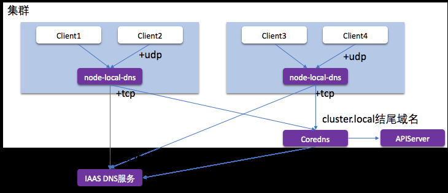

## 简介

NodeLocal DNSCache 通过在集群节点上作为 DaemonSet 运行 dns 缓存代理来提高集群 DNS 性能。在今天的架构中，ClusterFirst DNS 模式下的 Pod 会访问 kube-dns serviceIP 以进行 DNS 查询。这通过 kube-proxy 添加的 iptables 规则转换为 kube-dns/CoreDNS 端点。使用这种新架构，Pods 将接触到运行在同一节点上的 dns 缓存代理，从而避免 iptables DNAT 规则和连接跟踪。本地缓存代理将查询 kube-dns 服务以查找集群主机名（默认为 cluster.local 后缀）的缓存未命中。



>1. 拦截 Pod 的 DNS 查询的请求
>2. 将外部域名分流，外部域名请求不再请求中心 Coredns
>3. 中间链路使用更稳定的 TCP 解析
>4. 节点级别缓存 DNS 解析结果，较少请求中信 Coredns

<!-- more -->
### 部署 node-local-dns 插件

ipvs模式：
```sh
# 参考如下yaml文件
cat <<EOF | kubectl apply -f -
# Copyright 2018 The Kubernetes Authors.
#
# Licensed under the Apache License, Version 2.0 (the "License");
# you may not use this file except in compliance with the License.
# You may obtain a copy of the License at
#
#     http://www.apache.org/licenses/LICENSE-2.0
#
# Unless required by applicable law or agreed to in writing, software
# distributed under the License is distributed on an "AS IS" BASIS,
# WITHOUT WARRANTIES OR CONDITIONS OF ANY KIND, either express or implied.
# See the License for the specific language governing permissions and
# limitations under the License.
#

apiVersion: v1
kind: ServiceAccount
metadata:
  name: node-local-dns
  namespace: kube-system
  labels:
    kubernetes.io/cluster-service: "true"
    addonmanager.kubernetes.io/mode: Reconcile
---
apiVersion: v1
kind: Service
metadata:
  name: kube-dns-upstream
  namespace: kube-system
  labels:
    k8s-app: kube-dns
    kubernetes.io/cluster-service: "true"
    addonmanager.kubernetes.io/mode: Reconcile
    kubernetes.io/name: "KubeDNSUpstream"
spec:
  ports:
  - name: dns
    port: 53
    protocol: UDP
    targetPort: 53
  - name: dns-tcp
    port: 53
    protocol: TCP
    targetPort: 53
  selector:
    k8s-app: coredns
---
apiVersion: v1
kind: ConfigMap
metadata:
  name: node-local-dns
  namespace: kube-system
  labels:
    addonmanager.kubernetes.io/mode: Reconcile
data:
  Corefile: |
    cluster.local:53 {
        errors
        cache {
                success 9984 30
                denial 9984 5
        }
        reload
        loop
        bind 169.254.20.10
        forward . 10.254.0.10 {
                force_tcp
        }
        prometheus :9253
        health 169.254.20.10:9380
        }
    in-addr.arpa:53 {
        errors
        cache 30
        reload
        loop
        bind 169.254.20.10
        forward . 10.254.0.10 {
                force_tcp
        }
        prometheus :9253
        }
    ip6.arpa:53 {
        errors
        cache 30
        reload
        loop
        bind 169.254.20.10
        forward . 10.254.0.10 {
                force_tcp
        }
        prometheus :9253
        }
    .:53 {
        errors
        cache 30
        reload
        loop
        bind 169.254.20.10
        forward . __PILLAR__UPSTREAM__SERVERS__
        prometheus :9253
        }
---
apiVersion: apps/v1
kind: DaemonSet
metadata:
  name: node-local-dns
  namespace: kube-system
  labels:
    k8s-app: node-local-dns
    kubernetes.io/cluster-service: "true"
    addonmanager.kubernetes.io/mode: Reconcile
spec:
  updateStrategy:
    rollingUpdate:
      maxUnavailable: 10%
  selector:
    matchLabels:
      k8s-app: node-local-dns
  template:
    metadata:
      labels:
        k8s-app: node-local-dns
      annotations:
        prometheus.io/port: "9253"
        prometheus.io/scrape: "true"
    spec:
      priorityClassName: system-node-critical
      serviceAccountName: node-local-dns
      hostNetwork: true
      dnsPolicy: Default  # Don't use cluster DNS.
      tolerations:
      - key: "CriticalAddonsOnly"
        operator: "Exists"
      - effect: "NoExecute"
        operator: "Exists"
      - effect: "NoSchedule"
        operator: "Exists"
      containers:
      - name: node-cache
        image: hub.kce.ksyun.com/ksyun/k8s-dns-node-cache:1.17.0
        resources:
          requests:
            cpu: 25m
            memory: 5Mi
        args: [ "-localip", "169.254.20.10", "-conf", "/etc/Corefile", "-upstreamsvc", "kube-dns-upstream", "-health-port", "9380"]
        securityContext:
          privileged: true
        ports:
        - containerPort: 53
          name: dns
          protocol: UDP
        - containerPort: 53
          name: dns-tcp
          protocol: TCP
        - containerPort: 9253
          name: metrics
          protocol: TCP
        livenessProbe:
          httpGet:
            host: 169.254.20.10
            path: /health
            port: 9380
          initialDelaySeconds: 60
          timeoutSeconds: 5
        volumeMounts:
        - mountPath: /run/xtables.lock
          name: xtables-lock
          readOnly: false
        - name: config-volume
          mountPath: /etc/coredns
        - name: kube-dns-config
          mountPath: /etc/kube-dns
      volumes:
      - name: xtables-lock
        hostPath:
          path: /run/xtables.lock
          type: FileOrCreate
      - name: kube-dns-config
        configMap:
          name: kube-dns
          optional: true
      - name: config-volume
        configMap:
          name: node-local-dns
          items:
            - key: Corefile
              path: Corefile.base
---
# A headless service is a service with a service IP but instead of load-balancing it will return the IPs of our associated Pods.
# We use this to expose metrics to Prometheus.
apiVersion: v1
kind: Service
metadata:
  annotations:
    prometheus.io/port: "9253"
    prometheus.io/scrape: "true"
  labels:
    k8s-app: node-local-dns
  name: node-local-dns
  namespace: kube-system
spec:
  clusterIP: None
  ports:
    - name: metrics
      port: 9253
      targetPort: 9253
  selector:
    k8s-app: node-local-dns
EOF

# sed -i  -e 's/__PILLAR__CLUSTER__DNS__/10.254.0.10/g' -e 's/__PILLAR__LOCAL__DNS__/169.254.20.10/g' -e 's/[ |,]__PILLAR__DNS__SERVER__//g' -e 's/__PILLAR__DNS__DOMAIN__/cluster.local/g' nodelocaldns.yaml 
```

或者下载yaml
```sh
wget -c https://raw.githubusercontent.com/kubernetes/kubernetes/master/cluster/addons/dns/nodelocaldns/nodelocaldns.yaml
```

该资源清单文件中包含几个变量，其中：

>1. __PILLAR__DNS__SERVER__ ：表示 kube-dns 这个 Service 的 ClusterIP，可以通过命令 kubectl get svc -n kube-system -l k8s-app=kube-dns -o jsonpath='{$.items[*].spec.clusterIP}' 获取
>2. __PILLAR__LOCAL__DNS__：表示 DNSCache 本地的 IP，默认为 169.254.20.10
>3. __PILLAR__DNS__DOMAIN__：表示集群域，默认就是 cluster.local
>4. __PILLAR__CLUSTER__DNS__: 表示集群内查询的上游服务器
>5. __PILLAR__UPSTREAM__SERVERS__: 表示为外部查询的上游服务器

如果kube-proxy在 iptables 模式下运行, 则运行以下命令创建

```sh
sed 's/k8s.gcr.io/hub.kce.ksyun.com/g
  s/__PILLAR__DNS__SERVER__/10.96.0.10/g
  s/__PILLAR__LOCAL__DNS__/169.254.20.10/g
  s/__PILLAR__DNS__DOMAIN__/cluster.local/g' nodelocaldns.yaml | kubectl apply -f -
```

>1. __PILLAR__CLUSTER__DNS__ 和__PILLAR__UPSTREAM__SERVERS__ 由node-cache应用配置。

如果kube-proxy在 ipvs 模式下运行, 则运行以下命令创建

```sh
sed 's/k8s.gcr.io/k8sgcr.lework.workers.dev/g
  s/__PILLAR__CLUSTER__DNS__/10.96.0.10/g
  s/__PILLAR__LOCAL__DNS__/169.254.20.10/g
  s/[ |,]__PILLAR__DNS__SERVER__//g
  s/__PILLAR__DNS__DOMAIN__/cluster.local/g' nodelocaldns.yaml | kubectl apply -f -
```
>1. __PILLAR__UPSTREAM__SERVERS__ 由node-cache应用配置。

创建完成后，就能看到每个节点上都运行了一个pod

```sh
# kubectl -n kube-system get pods -l k8s-app=node-local-dns -o wide
NAME                   READY   STATUS    RESTARTS   AGE    IP               NODE               NOMINATED NODE   READINESS GATES
node-local-dns-9bzx9   1/1     Running   0          116m   192.168.77.132   k8s-master-node3   <none>           <none>
node-local-dns-9w7mk   1/1     Running   0          116m   192.168.77.133   k8s-worker-node1   <none>           <none>
node-local-dns-ljvtt   1/1     Running   0          116m   192.168.77.131   k8s-master-node2   <none>           <none>
node-local-dns-vsg6q   1/1     Running   0          116m   192.168.77.130   k8s-master-node1   <none>           <none>
node-local-dns-wbw84   1/1     Running   0          116m   192.168.77.134   k8s-worker-node2   <none>           <none>

```
***需要注意的是这里使用 DaemonSet 部署 node-local-dns 使用了 hostNetwork=true，会占用宿主机的 8080 端口，所以需要保证该端口未被占用。*** 

查看其中一个节点pod的日志
```sh
# kubectl -n kube-system logs node-local-dns-9bzx9   
2020/11/10 01:59:23 [INFO] Starting node-cache image: 1.15.16
2020/11/10 01:59:23 [INFO] Using Corefile /etc/Corefile
2020/11/10 01:59:23 [INFO] Updated Corefile with 0 custom stubdomains and upstream servers /etc/resolv.conf
2020/11/10 01:59:23 [INFO] Using config file:
cluster.local:53 {
    errors
    cache {
            success 9984 30
            denial 9984 5
    }
    reload
    loop
    bind 169.254.20.10
    forward . 10.96.0.10 {
            force_tcp
    }
    prometheus :9253
    health 169.254.20.10:8080
    }
in-addr.arpa:53 {
    errors
    cache 30
    reload
    loop
    bind 169.254.20.10
    forward . 10.96.0.10 {
            force_tcp
    }
    prometheus :9253
    }
ip6.arpa:53 {
    errors
    cache 30
    reload
    loop
    bind 169.254.20.10
    forward . 10.96.0.10 {
            force_tcp
    }
    prometheus :9253
    }
.:53 {
    errors
    cache 30
    reload
    loop
    bind 169.254.20.10
    forward . /etc/resolv.conf
    prometheus :9253
    }
2020/11/10 01:59:23 [INFO] Updated Corefile with 0 custom stubdomains and upstream servers /etc/resolv.conf
2020/11/10 01:59:23 [INFO] Using config file:
cluster.local:53 {
    errors
    cache {
            success 9984 30
            denial 9984 5
    }
    reload
    loop
    bind 169.254.20.10
    forward . 10.96.0.10 {
            force_tcp
    }
    prometheus :9253
    health 169.254.20.10:8080
    }
in-addr.arpa:53 {
    errors
    cache 30
    reload
    loop
    bind 169.254.20.10
    forward . 10.96.0.10 {
            force_tcp
    }
    prometheus :9253
    }
ip6.arpa:53 {
    errors
    cache 30
    reload
    loop
    bind 169.254.20.10
    forward . 10.96.0.10 {
            force_tcp
    }
    prometheus :9253
    }
.:53 {
    errors
    cache 30
    reload
    loop
    bind 169.254.20.10
    forward . /etc/resolv.conf
    prometheus :9253
    }
cluster.local.:53 on 169.254.20.10
in-addr.arpa.:53 on 169.254.20.10
ip6.arpa.:53 on 169.254.20.10
.:53 on 169.254.20.10
[INFO] plugin/reload: Running configuration MD5 = e43ea5ef65cd4ee85f56a7f18086f3dd
CoreDNS-1.6.7
linux/amd64, go1.11.13, 
2020/11/10 01:59:23 [INFO] Added interface - nodelocaldns
[INFO] Added back nodelocaldns rule - {raw PREROUTING [-p tcp -d 169.254.20.10 --dport 53 -j NOTRACK]}
[INFO] Added back nodelocaldns rule - {raw PREROUTING [-p udp -d 169.254.20.10 --dport 53 -j NOTRACK]}
[INFO] Added back nodelocaldns rule - {filter INPUT [-p udp -d 169.254.20.10 --dport 53 -j ACCEPT]}
[INFO] Added back nodelocaldns rule - {raw OUTPUT [-p tcp -s 169.254.20.10 --sport 53 -j NOTRACK]}
[INFO] Added back nodelocaldns rule - {raw OUTPUT [-p udp -s 169.254.20.10 --sport 53 -j NOTRACK]}
[INFO] Added back nodelocaldns rule - {filter OUTPUT [-p tcp -s 169.254.20.10 --sport 53 -j ACCEPT]}
[INFO] Added back nodelocaldns rule - {filter OUTPUT [-p udp -s 169.254.20.10 --sport 53 -j ACCEPT]}
[INFO] Added back nodelocaldns rule - {raw OUTPUT [-p tcp -d 169.254.20.10 --dport 53 -j NOTRACK]}
[INFO] Added back nodelocaldns rule - {raw OUTPUT [-p udp -d 169.254.20.10 --dport 53 -j NOTRACK]}
[INFO] Added back nodelocaldns rule - {raw OUTPUT [-p tcp -d 169.254.20.10 --dport 8080 -j NOTRACK]}
[INFO] Added back nodelocaldns rule - {raw OUTPUT [-p tcp -s 169.254.20.10 --sport 8080 -j NOTRACK]}
```

可以看到其使用的配置，和iptables 规则。

在节点上，我们可以看到node-cache创建的接口

```sh
# ip link show nodelocaldns
11: nodelocaldns: <BROADCAST,NOARP> mtu 1500 qdisc noop state DOWN mode DEFAULT group default 
    link/ether 9e:7c:86:1b:18:92 brd ff:ff:ff:ff:ff:ff
# ip addr show nodelocaldns
11: nodelocaldns: <BROADCAST,NOARP> mtu 1500 qdisc noop state DOWN group default 
    link/ether 9e:7c:86:1b:18:92 brd ff:ff:ff:ff:ff:ff
    inet 169.254.20.10/32 brd 169.254.20.10 scope global nodelocaldns
       valid_lft forever preferred_lft forever
# ifconfig nodelocaldns
nodelocaldns: flags=130<BROADCAST,NOARP>  mtu 1500
        inet 169.254.20.10  netmask 255.255.255.255  broadcast 169.254.20.10
        ether 9e:7c:86:1b:18:92  txqueuelen 0  (Ethernet)
        RX packets 0  bytes 0 (0.0 B)
        RX errors 0  dropped 0  overruns 0  frame 0
        TX packets 0  bytes 0 (0.0 B)
        TX errors 0  dropped 0 overruns 0  carrier 0  collisions 0
```
在节点上，通过iptables-save命令可以看到10.96.0.10/ 169.254.20.10IP相关的规则

```sh
# iptables-save 
*raw
-A PREROUTING -d 169.254.20.10/32 -p udp -m udp --dport 53 -j NOTRACK
-A PREROUTING -d 169.254.20.10/32 -p tcp -m tcp --dport 53 -j NOTRACK
-A OUTPUT -s 169.254.20.10/32 -p tcp -m tcp --sport 8080 -j NOTRACK
-A OUTPUT -d 169.254.20.10/32 -p tcp -m tcp --dport 8080 -j NOTRACK
-A OUTPUT -d 169.254.20.10/32 -p udp -m udp --dport 53 -j NOTRACK
-A OUTPUT -d 169.254.20.10/32 -p tcp -m tcp --dport 53 -j NOTRACK
-A OUTPUT -s 169.254.20.10/32 -p udp -m udp --sport 53 -j NOTRACK
-A OUTPUT -s 169.254.20.10/32 -p tcp -m tcp --sport 53 -j NOTRACK

*filter
-A INPUT -d 169.254.20.10/32 -p udp -m udp --dport 53 -j ACCEPT
-A INPUT -d 169.254.20.10/32 -p tcp -m tcp --dport 53 -j ACCEPT
-A OUTPUT -s 169.254.20.10/32 -p udp -m udp --sport 53 -j ACCEPT
-A OUTPUT -s 169.254.20.10/32 -p tcp -m tcp --sport 53 -j ACCEPT
```
节点本地DNS会在所有 kube-proxy 规则之前添加这些规则，以便首先对其进行评估。-j NOTRACK 使发送到本地或 kube-dns IP地址的TCP和UDP数据包被conntrack取消跟踪。这就是节点本地DNS缓存避免conntrack错误并接管数据包以发送到 kube-dns IP的方式。

我们如何将DNS流量发送到 kube-dns ？ 我们无法使用它的IP，因为流量会因网络更改而流向Node Local DNS pod本身。 。node-local-dns解决此问题的方法是为现有的 kube-dns 部署添加新服务。服务的配置如下:
```sh
# kubectl -n kube-system describe svc kube-dns-upstream    
Name:              kube-dns-upstream
Namespace:         kube-system
Labels:            addonmanager.kubernetes.io/mode=Reconcile
                   k8s-app=kube-dns
                   kubernetes.io/cluster-service=true
                   kubernetes.io/name=KubeDNSUpstream
Annotations:       <none>
Selector:          k8s-app=kube-dns
Type:              ClusterIP
IP:                10.96.134.149
Port:              dns  53/UDP
TargetPort:        53/UDP
Endpoints:         10.244.2.2:53,10.244.3.9:53
Port:              dns-tcp  53/TCP
TargetPort:        53/TCP
Endpoints:         10.244.2.2:53,10.244.3.9:53
Session Affinity:  None
Events:            <none>
```

此服务将创建一个新的Cluster IP，该Cluster IP,可用于联系kube-dns pod并跳过节点本地DNS iptables规则。 __PILLAR__CLUSTER__DNS是一个特殊的模板变量，Node Local DNS将使用该模板变量进行模板化。 这是通过解析KUBE_DNS_UPSTREAM_SERVICE_HOST环境变量来完成的，如果启用enableServiceLinks（默认为启用），则在pod启动时会生成该环境变量。 请记住，如果重新创建服务，则必须重新启动节点 node-local-dns。

```sh
# kubectl -n kube-system exec node-local-dns-9bzx9  -- env | grep KUBE_DNS_UPSTREAM_SERVICE_HOST
# KUBE_DNS_UPSTREAM_SERVICE_HOST=10.96.134.149
```
在CoreDNS配置中，我们还具有 .:53区域，该区域用于处理非Kubernetes内运行的服务的解析请求的情况。 我们缓存请求并转发到__PILLAR__UPSTREAM__SERVERS上游DNS服务器。 节点本地DNS从kube-dns configmap查找__PILLAR__UPSTREAM__SERVERS值。 本次部署没有设置，因此默认为/etc/resolv.conf。 请注意，节点本地DNS使用dnsPolicy:Default，这使/etc/resolv.conf与节点上的相同。

### 使用dns cache

使用node-local-dns的解析有两种设置：配置Pod 的 dnsconfig ；配置 kubelet的 cluster-dns。

#### 配置Pod 的 dnsconfig

使用此方法，仅针对某个pod设置，不影响其他组件。

```yaml
apiVersion: v1
kind: Pod
spec:
  dnsPolicy: None
  dnsConfig:
    nameservers: 
      - 169.254.20.10
    searches: 
      - default.svc.cluster.local
      - svc.cluster.local
      - cluster.local
    options:
      - name: ndots
        value: "2"
```
#### 配置 kubelet 的 cluster-dns
使用此方法，生效的对象则是kubelet所管理的所有pod，需要重启 kubelet 。

```yaml
# sed -i 's/10.96.0.10/169.254.20.10/g' /var/lib/kubelet/config.yaml
# systemctl restart kubelet
```

***修改kubelet 参数并不能作用于已经存在的pod***

### 验证 dns cache 功能
我们此次使用 配置Pod 的 dnsconfig 的方式来测试

1. 创建测试pod
```sh
 # cat <<EOF | kubectl apply -f -
 apiVersion: v1
 kind: Pod
 metadata:
   name: test-node-local-dns
 spec:
   containers:
   - name: local-dns
     image: busybox:glibc
     command: ["/bin/sh", "-c", "sleep 60m"]
   dnsPolicy: "None"
   dnsConfig:
     nameservers: 
       - 169.254.20.10
     searches: 
       - default.svc.cluster.local
       - svc.cluster.local
       - cluster.local
     options:
       - name: ndots
         value: "2" 
 EOF
```
***注意： busybox 的 新版本 uclibc 中的nslookup 有问题，请使用 glibc***

2. 待 pod 启动后，查看 /etc/resolv.conf
```sh
# kubectl exec test-node-local-dns -- cat /etc/resolv.conf      
nameserver 169.254.20.10
search default.svc.cluster.local svc.cluster.local cluster.local
options ndots:2
```

3. 在 pod 的节点上，监听 53 端口
```sh
我这里是 k8s-worker-node2 节点，可以通过kubectl get pods test-node-local-dns -o jsonpath='{$.spec.nodeName}' 获取

# yum install tcpdump -y
# tcpdump -i any src host 169.254.20.10 and port 53 -vv
tcpdump: listening on any, link-type LINUX_SLL (Linux cooked), capture size 262144 bytes
```

4. 在 pod 中查询 外部域名 A 记录
```sh
# kubectl exec test-node-local-dns -- nslookup www.baidu.com
Server:         169.254.20.10
Address:        169.254.20.10:53
   
Non-authoritative answer:
www.baidu.com   canonical name = www.a.shifen.com
   
Non-authoritative answer:
www.baidu.com   canonical name = www.a.shifen.com
Name:   www.a.shifen.com
Address: 180.101.49.12
Name:   www.a.shifen.com
Address: 180.101.49.11
```

5. 在 pod 的节点上，观察 tcpdump 接收到的信息
```sh
 k8s-worker-node2.domain > 10.244.4.24.38514: [bad udp cksum 0xcd77 -> 0x112f!] 41730 q: AAAA? www.baidu.com. 1/0/0 www.baidu.com. CNAME www.a.shifen.com. (74)
11:18:03.164521 IP (tos 0x0, ttl 64, id 33106, offset 0, flags [DF], proto UDP (17), length 102)
    k8s-worker-node2.domain > 10.244.4.24.38514: [bad udp cksum 0xcd77 -> 0x112f!] 41730 q: AAAA? www.baidu.com. 1/0/0 www.baidu.com. CNAME www.a.shifen.com. (74)
11:18:03.164646 IP (tos 0x0, ttl 64, id 33107, offset 0, flags [DF], proto UDP (17), length 166)
    k8s-worker-node2.domain > 10.244.4.24.38514: [bad udp cksum 0xcdb7 -> 0x60ed!] 33472 q: A? www.baidu.com. 3/0/0 www.baidu.com. CNAME www.a.shifen.com., www.a.shifen.com. A 180.101.49.12, www.a.shifen.com. A 180.101.49.11 (138)
11:18:03.164649 IP (tos 0x0, ttl 64, id 33107, offset 0, flags [DF], proto UDP (17), length 166)
    k8s-worker-node2.domain > 10.244.4.24.38514: [bad udp cksum 0xcdb7 -> 0x60ed!] 33472 q: A? www.baidu.com. 3/0/0 www.baidu.com. CNAME www.a.shifen.com., www.a.shifen.com. A 180.101.49.12, www.a.shifen.com. A 180.101.49.11 (138)
```
到这里就说明NodeLocal DNSCache 组件部署成功了，但是域名解析我们还是要多测试测试。

6. 测试 service 域名解析

```sh
# kubectl exec test-node-local-dns -- nslookup -type=a kubernetes
Server:         169.254.20.10
Address:        169.254.20.10:53
   
** server can't find kubernetes.cluster.local: NXDOMAIN
   
** server can't find kubernetes.svc.cluster.local: NXDOMAIN
   
Name:   kubernetes.default.svc.cluster.local
Address: 10.96.0.1
   
command terminated with exit code 1
```

因为使用了相对域名，使用搜索域，进行了所有域的查询操作。

```sh
# fqdn
# kubectl exec test-node-local-dns -- nslookup -type=a kubernetes.
Server:         169.254.20.10
Address:        169.254.20.10:53
   
** server can't find kubernetes.: SERVFAIL
   
command terminated with exit code 1
# dot 2
[root@k8s-master-node1 ~]# kubectl exec test-node-local-dns -- nslookup -type=a  kubernetes.default
Server:         169.254.20.10
Address:        169.254.20.10:53
   
** server can't find kubernetes.default: NXDOMAIN
   
command terminated with exit code 1
# domain
[root@k8s-master-node1 ~]# kubectl exec test-node-local-dns -- nslookup -type=a  kubernetes.default.svc.cluster.local
Server:         169.254.20.10
Address:        169.254.20.10:53
   
Name:   kubernetes.default.svc.cluster.local
Address: 10.96.0.1

```
>1. 使用fqdn时，只会查询一次。
>2. 域名中的.数目等于或大于设置的值时，也会只查询一次。

7. ExternalName Service 解析

ExternalName Service 是 Service 的一个特例，没有选择器，可以用于给外部服务取一个内部别名。

创建 ExternalName Service
```sh
 # cat <<EOF | kubectl apply -f -
 apiVersion: v1
 kind: Service
 metadata:
   name: baidu
   namespace: default
 spec:
   type: ExternalName
   externalName: www.baidu.com
 EOF
    
 # kubectl describe svc baidu
 Name:              baidu
 Namespace:         default
 Labels:            <none>
 Annotations:       <none>
 Selector:          <none>
 Type:              ExternalName
 IP:                
 External Name:     www.baidu.com
 Session Affinity:  None
 Events:            <none>

```
测试解析内部服务

```sh
 # kubectl exec test-node-local-dns -- nslookup baidu
 Server:         169.254.20.10
 Address:        169.254.20.10:53
    
 ** server can't find baidu.cluster.local: NXDOMAIN
    
 baidu.default.svc.cluster.local canonical name = www.baidu.com
 www.baidu.com   canonical name = www.a.shifen.com
 Name:   www.a.shifen.com
 Address: 180.101.49.12
 Name:   www.a.shifen.com
 Address: 180.101.49.11
    
 baidu.default.svc.cluster.local canonical name = www.baidu.com
 www.baidu.com   canonical name = www.a.shifen.com
    
 ** server can't find baidu.svc.cluster.local: NXDOMAIN
    
 ** server can't find baidu.svc.cluster.local: NXDOMAIN
    
 ** server can't find baidu.cluster.local: NXDOMAIN
    
 command terminated with exit code 1

```
baidu.default.svc.cluster.local 将会被映射到 www.baidu.com , 这是通过 DNS 的 CNAME 记录实现的。

### 压测 dns cache
使用 [dnsperf](https://github.com/DNS-OARC/dnsperf) 项目进行 dns 查询压力测试

##### 创建pod
```sh
 cat <<EOF | kubectl apply -f -
 apiVersion: v1
 kind: Pod
 metadata:
   name: perf-node-dns
 spec:
   containers:
   - name: perf-node-dns
     image: guessi/dnsperf:alpine
     command: ["/bin/sh", "-c", "sleep 60m"]
   dnsPolicy: "None"
 EOF
```
##### 测试coredns的性能
***coredns 在集群中默认是2个节点***
```sh
# kubectl exec -ti perf-node-dns -- sh
cat <<EOF >records.txt
baidu.com A
www.baidu.com A
mail.baidu.com A
github.com A
www.yahoo.com A
www.microsoft.com A
www.aliyun.com A
developer.aliyun.com A
kubernetes.io A
kubernetes A
kubernetes.default.svc.cluster.local A
coredns.kube-system.svc.cluster.local A
EOF

# dnsperf -l 60 -s 10.254.0.10 -Q 100000 -d records.txt
Statistics:

  Queries sent:         4040981
  Queries completed:    4040879 (100.00%)
  Queries lost:         102 (0.00%)

  Response codes:       NOERROR 3704137 (91.67%), NXDOMAIN 336742 (8.33%)
  Average packet size:  request 35, response 271
  Run time (s):         60.000507
  Queries per second:   67347.414248

  Average Latency (s):  0.001192 (min 0.000104, max 0.695019)
  Latency StdDev (s):   0.003233
```
dnsperf 参数

>1. -l 60 : 测试 60s
>2. -s 10.96.0.10 : dns 服务器
>3. -Q 100000: 最高qps
>4. -d records.txt: 查询的列表

在 Statistics 区域中，我们可以看到发送查询4040981，查询完成度100%，qps 为 67347.414248。

##### 测试使用NodeLocal DNSCache

```sh
# dnsperf -l 60 -s 169.254.20.10 -Q 100000 -d  records.txt
DNS Performance Testing Tool
Version 2.2.1
   
[Status] Command line: dnsperf -l 60 -s 169.254.20.10 -Q 100000 -d records.txt   
Statistics:

  Queries sent:         4344630
  Queries completed:    4344630 (100.00%)
  Queries lost:         0 (0.00%)

  Response codes:       NOERROR 3982578 (91.67%), NXDOMAIN 362052 (8.33%)
  Average packet size:  request 35, response 304
  Run time (s):         60.001422
  Queries per second:   72408.783912

  Average Latency (s):  0.001284 (min 0.000021, max 1.411830)
  Latency StdDev (s):   0.005089
```
在 Statistics 区域中，我们可以看到发送查询4344630，查询完成度100%，qps 为 72408.783912。 其性能比使用coredns提升了7.5% 左右。

##### coredns 有压力情况下
```sh
# dnsperf -l 60 -s 10.254.0.10 -Q 100000 -d records.txt
Statistics:

  Queries sent:         2249863
  Queries completed:    2249826 (100.00%)
  Queries lost:         37 (0.00%)

  Response codes:       NOERROR 2062341 (91.67%), NXDOMAIN 187485 (8.33%)
  Average packet size:  request 35, response 255
  Run time (s):         60.001268
  Queries per second:   37496.307578

  Average Latency (s):  0.002539 (min 0.000101, max 0.531920)
  Latency StdDev (s):   0.002912

/ # dnsperf -l 60 -s 169.254.20.10 -Q 100000 -d  records.txt
DNS Performance Testing Tool
Version 2.2.1

[Status] Command line: dnsperf -l 60 -s 169.254.20.10 -Q 100000 -d records.txt
[Status] Sending queries (to 169.254.20.10)
[Status] Started at: Tue Sep 28 09:22:31 2021
[Status] Stopping after 60.000000 seconds
[Status] Testing complete (time limit)

Statistics:

  Queries sent:         4253217
  Queries completed:    4253217 (100.00%)
  Queries lost:         0 (0.00%)

  Response codes:       NOERROR 3898783 (91.67%), NXDOMAIN 354434 (8.33%)
  Average packet size:  request 35, response 294
  Run time (s):         60.000111
  Queries per second:   70886.818859

  Average Latency (s):  0.001303 (min 0.000022, max 0.608748)
  Latency StdDev (s):   0.001356
```

在 Statistics 区域中，查询完成度100%，qps 为 70886.818859。 其性能比使用coredns提升了89% 左右。