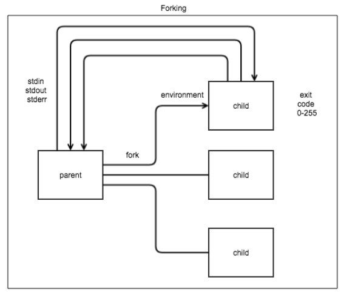
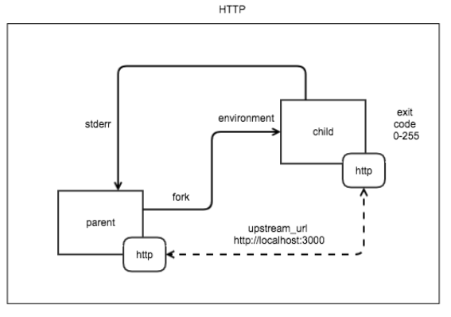

## 简介
Watchdog是一个golang编写的轻量化web服务器，watchdog在制作镜像时需要作为entrypoint启动并监听请求，并将请求内容通过stdin传递给用户函数，将函数执行的结果stdout作为请求响应返回给调用者

<!-- more -->

## Classic-Watchdog

### 工作模式

在Classic-Watchdog中，仅支持一种工作模式；该工作模式下，

>1. 将用户编写的函数（要求符合openfaas函数框架规范）打包编译成二进制文件（可接收stdin作为输入，并将执行结果输出到stdout/stderr）
>2. 在制作镜像时，将watchdog作为CMD或者ENTRYPOINT使用；其中watchdog启动时会默认监听指定端口
>3. 函数pod部署运行后，当接收到API-Gateway发送来的请求时，将会fork（go协程）执行（os.exec.Command）二进制命令并将http请求body和header中的内容作为命令的参数传入；
>4. 二进制命令执行完成后，watchdog将stdout/stderr封装成http响应返回给客户端

## of-watchdog

of-watchdog在classic-watchdog基础上加入了HTTP代理，内存复用，请求快速响应等特性，of-watchdog不是用于替换classic-watchdog，而且提供有以上特性需求场景下一个新的选择; classic-watchdog比较类似于CGI，而of-watchdog则更类似于FastCGI；[参考链接](https://www.jianshu.com/p/c4dc22699a42)

### 设计目标

>1. 函数预加载
>2. 缓存管理
>3. 连接池管理
>4. 支持超大流量函数响应
>5. 支持多种工作模式
>6. 支持自定义response

### 工作模式

|工作模式|功能|
|-------|----|
|afterburn|for performance tuning|
|http	|for routing requests over HTTP|
|serializing	|reads all the response and buffers before returning|
|static	|for serving static content|
|streaming|streams the values live to the caller as they are printed by the process|