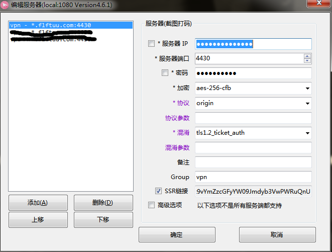
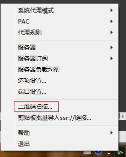

# ShadowsocksR 客户端相关的安装和部署方法

## 下载客户端

- Windows 用户： [ShadowsocksR-4.6.1-win.7z](https://kiwivm.64clouds.com/dist/ShadowsocksR-4.6.1-win.7z)
- Android 用户： [Shadowsocks-Android](https://play.google.com/store/apps/details?id=com.github.shadowsocks)
- Ios  用户: [Shadowsocks-iOS](https://itunes.apple.com/us/app/shadowsocks/id665729974?ls=1&mt=8)

<!-- more -->

## 客户端配置如下

| key  | value  |
| ----- | -----: |
| Server IP: |  45.78.29.78 |
| Server Port: | 4430 |
| Password: | xxxxxxxxxx |
| Encryption:   | aes-256-cfb |
| Protocol: | origin |
| Obfs: | tls1.2_ticket_auth |

## 图解示意

## 扫描二维码添加配置

###### 下载二维码并在桌面上打开

###### 右键点击软件"二维码扫描"

