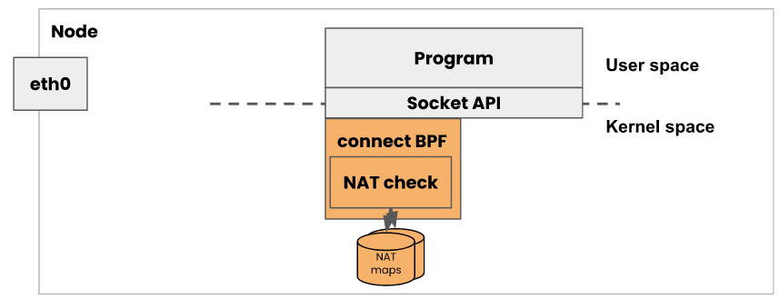

## 前言
calico团队在3.13版本引入了eBPF，这个新的dataplane与传统的linux dataplane有哪些区别呢？

- 它可以扩展到更高的吞吐量。
- 每个GBit使用更少的CPU。
- 它具有对Kubernetes服务的本机支持（无需kube-proxy），该支持：
    - 减少服务数据包的第一个数据包延迟。
    - 一直保留到外部主机的外部客户端源IP地址。
    - 支持DSR（直接服务器返回），以实现更高效的服务路由。
    - 与kube-proxy相比，使用更少的CPU来保持数据平面同步。

<!-- more -->

此外，社区对新dataplane进行了性能测试，在短连接延时、服务访问时间、cpu使用率等方面，性能都有明显提升，详见：https://www.pianshen.com/article/28912006312/

本文主要目的是通过分析calico源码，弄明白eBPF是如何被引入到calico中的。
calico引入了多个eBPF hook点，本文重点分析connect_time_loadbalancer，即上面讲到的第一条支持：“减少服务数据包的第一个数据包延迟”

相关的工作是在calico的felix项目中实现的

## 工作流程

入口处：felix/dataplane/linux/int_dataplane.go 的NewIntDataplaneDriver()函数，进行dataplane的初始化

首先会判断是否开启了BPF，如果是开启状态，则进行以下操作：

1）注册 map manager，该manager的作用是负责管理ebpf的map（map用于userspace和kernel之间进行数据的共享）

2）注册endpoint manager，该manager的作用是负责各种ep的管理，包括host、workload等

3）创建各种map，比如nat的frontendMap、backendMap、routeMap、conntrackMap等

4）开启kube-proxy，注意此kube-proxy并非kubernetes的kube-proxy，而是proxy的一个封装，负责和kubernetes通信，维护各种map中的信息

5）若BPFConnTimeEnabled开启，则安装connect_time_loadbalancer，即加载相关的eBPF程序

6）启动dataplane（这部分暂不涉及connect_time_loadbalancer，本文暂不分析）

下面我们重点看第5）步代码是如何实现的

## 代码分析（加载eBPF程序）

入口 bpf/nat/connecttime.go的InstallConnectTimeLoadBalancer()函数

```go
func InstallConnectTimeLoadBalancer(frontendMap, backendMap, rtMap bpf.Map, cgroupv2 string, logLevel string) error {
    bpfMount, err := bpf.MaybeMountBPFfs()      //挂载bpf路径，默认的挂载路径是：/sys/fs/bpf
    if err != nil {
        log.WithError(err).Error("Failed to mount bpffs, unable to do connect-time load balancing")
        return err
    }

    cgroupPath, err := ensureCgroupPath(cgroupv2)     //配置cgoupv2，位于/run/calico/cgroupv2/
    if err != nil {
        return errors.Wrap(err, "failed to set-up cgroupv2")
    }

    repin := false                                //检查相关map
    if pm, ok := frontendMap.(*bpf.PinnedMap); ok {
        repin = pm.RepinningEnabled()
    }

    sendrecvMap := SendRecvMsgMap(&bpf.MapContext{
        RepinningEnabled: repin,
    })

    err = sendrecvMap.EnsureExists()
    if err != nil {
        return errors.WithMessage(err, "failed to create sendrecv BPF Map")
    }
    maps := []bpf.Map{frontendMap, backendMap, rtMap, sendrecvMap}
    err = installProgram("connect", "4", bpfMount, cgroupPath,logLevel, maps...)      //  安装calico_connect_v4 bpf程序
    if err != nil {
        return err
    }

    err = installProgram("sendmsg", "4", bpfMount, cgroupPath, logLevel, maps...)      //安装calico_sendmsg_v4 bpf程序
    if err != nil {
        return err
    }
 
    err = installProgram("recvmsg", "4", bpfMount, cgroupPath, logLevel, maps...)       //安装calico_recvmsg_v4 bpf程序
    if err != nil {
        return err
    }

    err = installProgram("sendmsg", "6", bpfMount, cgroupPath, logLevel)             //安装calico_sendmsg_v6 bpf程序
    if err != nil {
        return err
    }

    err = installProgram("recvmsg", "6", bpfMount, cgroupPath, logLevel, sendrecvMap)      // 安装calico_recvmsg_v4 bpf程序
    if err != nil {
        return err
    }
    return nil
}
```

进入installProgram（）函数，看如何加载程序

```go
func installProgram(name, ipver, bpfMount, cgroupPath, logLevel string, maps ...bpf.Map) error {
 
    progPinDir := path.Join(bpfMount, "calico_connect4")
    _ = os.RemoveAll(progPinDir)
 
    var filename string
                                                                                    //获取bpf程序所在的位置
    if ipver == "6" {
        filename = path.Join(bpf.ObjectDir, ProgFileName(logLevel, 6))
    } else {
        filename = path.Join(bpf.ObjectDir, ProgFileName(logLevel, 4))
    }
    args := []string{"prog", "loadall", filename, progPinDir, "type", "cgroup/" + name + ipver}
    for _, m := range maps {
        args = append(args, "map", "name", m.GetName(), "pinned", m.Path())
    }
 
    cmd := exec.Command("bpftool", args...)                                    //使用bpftool加载ebpf程序
    log.WithField("args", cmd.Args).Info("About to run bpftool")
    progName := "calico_" + name + "_v" + ipver
    out, err := cmd.CombinedOutput()
    if err != nil {
        err = errors.Wrapf(err, "failed to load program %s", progName)
        goto out
    }
 
   //使用bpftool将ebpf程序attach到相应的挂载点。此处的挂载点是socket hook，由于关cgroup关联，因此对于calico这个cgroup下的所有程序，执行socket api时都会经过这个bpf程序
    cmd = exec.Command("bpftool", "cgroup", "attach", cgroupPath,        
        name+ipver, "pinned", path.Join(progPinDir, progName))
    log.WithField("args", cmd.Args).Info("About to run bpftool")
    out, err = cmd.CombinedOutput()
    if err != nil {
        err = errors.Wrapf(err, "failed to attach program %s", progName)
        goto out
    }
 
out:
    if err != nil {
        log.WithError(err).WithField("output", string(out)).Error("Failed install cgroup program.")
    }
 
    return nil
}
```

下图是加载attach bpf程序后，用户进程调用socket api时的路径。在建立connect、recvms、sendmsg时都会经过这个程序进行处理。而这个ebpf程序所做的工作就是：判断是否要访问的是k8s service，如果是的话，直接将请求转发到后端的pod上，这样就不在需要做nat了，节省了所有的nat开销。即实现了：“减少服务数据包的第一个数据包延迟”


接下来看看bpf程序是如何实现的，共实现三个section bpf-gpl/connect_balancer.c
```c
__attribute__((section("calico_connect_v4")))            //section 1：在建立connection时，做nat转发，将请求转发至后端的pod
int cali_ctlb_v4(struct bpf_sock_addr *ctx)
{
    CALI_DEBUG("calico_connect_v4\n");
 
    /* do not process anything non-TCP or non-UDP, but do not block it, will be
     * dealt with somewhere else.
     */
    if (ctx->type != SOCK_STREAM && ctx->type != SOCK_DGRAM) {
        CALI_INFO("unexpected sock type %d\n", ctx->type);
        goto out;
    }
 
    uint8_t ip_proto;
    switch (ctx->type) {
    case SOCK_STREAM:
        CALI_DEBUG("SOCK_STREAM -> assuming TCP\n");
        ip_proto = IPPROTO_TCP;
        break;
    case SOCK_DGRAM:
        CALI_DEBUG("SOCK_DGRAM -> assuming UDP\n");
        ip_proto = IPPROTO_UDP;
        break;
    default:
        CALI_DEBUG("Unknown socket type: %d\n", (int)ctx->type);
        goto out;
    }
 
    do_nat_common(ctx, ip_proto);
 
out:
    return 1;
}
 
__attribute__((section("calico_sendmsg_v4")))          //section2 ： sendmsg只处理udp相关的发包操作，tcp忽略，因为tcp为面向连接的传输
int cali_ctlb_sendmsg_v4(struct bpf_sock_addr *ctx)
{
    CALI_DEBUG("sendmsg_v4 %x:%d\n",
            be32_to_host(ctx->user_ip4), be32_to_host(ctx->user_port)>>16);
 
    if (ctx->type != SOCK_DGRAM) {
        CALI_INFO("unexpected sock type %d\n", ctx->type);
        goto out;
    }
 
    do_nat_common(ctx, IPPROTO_UDP);
 
out:
    return 1;
}
 
__attribute__((section("calico_recvmsg_v4")))         // section3： recvmsg也只处理udp相关的收包操作，tcp忽略。因为tcp为面向连接的传输
int cali_ctlb_recvmsg_v4(struct bpf_sock_addr *ctx)
{
    CALI_DEBUG("recvmsg_v4 %x:%d\n", be32_to_host(ctx->user_ip4), ctx_port_to_host(ctx->user_port));
 
    if (ctx->type != SOCK_DGRAM) {
        CALI_INFO("unexpected sock type %d\n", ctx->type);
        goto out;
    }
 
    uint64_t cookie = bpf_get_socket_cookie(ctx);
    CALI_DEBUG("Lookup: ip=%x port=%d(BE) cookie=%x",ctx->user_ip4, ctx->user_port, cookie);
    struct sendrecv4_key key = {
        .ip = ctx->user_ip4,
        .port   = ctx->user_port,
        .cookie = cookie,
    };
 
    struct sendrecv4_val *revnat = cali_v4_srmsg_lookup_elem(&key);
 
    if (revnat == NULL) {
        CALI_DEBUG("revnat miss for %x:%d\n",
                be32_to_host(ctx->user_ip4), ctx_port_to_host(ctx->user_port));
        /* we are past policy and the packet was allowed. Either the
         * mapping does not exist anymore and if the app cares, it
         * should check the addresses. It is more likely a packet sent
         * to server from outside and no mapping is expected.
         */
        goto out;
    }
 
    ctx->user_ip4 = revnat->ip;
    ctx->user_port = revnat->port;
    CALI_DEBUG("recvmsg_v4 rev nat to %x:%d\n",
            be32_to_host(ctx->user_ip4), ctx_port_to_host(ctx->user_port));
 
out:
    return 1;
}
```

实际的nat操作是do_nat_common()来做的

```c
static CALI_BPF_INLINE void do_nat_common(struct bpf_sock_addr *ctx, uint8_t proto)
{
    /* We do not know what the source address is yet, we only know that it
     * is the localhost, so we might just use 0.0.0.0. That would not
     * conflict with traffic from elsewhere.
     *
     * XXX it means that all workloads that use the cgroup hook have the
     * XXX same affinity, which (a) is sub-optimal and (b) leaks info between
     * XXX workloads.
     */
    nat_lookup_result res = NAT_LOOKUP_ALLOW;
    uint16_t dport_he = (uint16_t)(be32_to_host(ctx->user_port)>>16);
    struct calico_nat_dest *nat_dest;
    nat_dest = calico_v4_nat_lookup(0, ctx->user_ip4, proto, dport_he, &res);        //从map中查找k8s service相关的信息
    if (!nat_dest) {
        CALI_INFO("NAT miss.\n");
        goto out;
    }
 
    uint32_t dport_be = host_to_ctx_port(nat_dest->port);
 
     
    ctx->user_ip4 = nat_dest->addr;            //修改socket地址的目的地址为后端pod
    ctx->user_port = dport_be;
 
out:
    return;
}
```