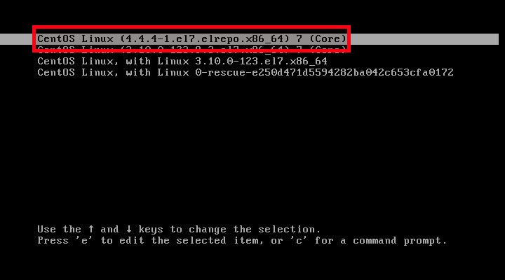
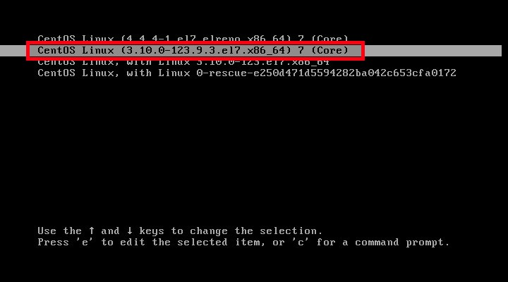

## Install Linux Kernel 4.4.5 LTS in CentOS 7

I tested this tutorial on CentOS 7 64 bit edition. Although, these steps should work on RHEL 7.

Note: Since this kernel is just released, the latest kernel haven’t pushed into the ELRepo yet. It stills shows the 4.4.4 version. I think the latest kernel will be pushed to the repository in few hours.

To install the latest kernel, add ELRepo repository.

Add ELRepo GPG key:
<!-- more -->

```bash
# rpm --import https://www.elrepo.org/RPM-GPG-KEY-elrepo.org
```

Then, add ELRepo in CentOS 7 / RHEL 7 / Scientific Linux 7 using command:

```bash
# rpm -Uvh http://www.elrepo.org/elrepo-release-7.0-2.el7.elrepo.noarch.rpm
```

Enable ELRepo fastest mirror using by installing the following package:

```bash
# yum install yum-plugin-fastestmirror
```

We have added the ELRepo. Now, it is time to install Linux kernel 4.4.1 LTS.

```bash
# uname -r
# yum --enablerepo=elrepo-kernel install kernel-ml
```

After installing the Kernel, Reboot your system and select the latest Kernel from the Grub boot menu.



Check the Kernel version using command:

```bash 
# uname -r
```

Sample output:
```bash
4.4.4-1.el7.elrepo.x86_64
```

Congratulation! Your CentOS 7 system is currently running on Kernel 4.4.4.

Have any problems after installing Linux Kernel 4.4.x? No worries, reboot your system. Select your previously working Kernel from the Boot menu.



Then, remove the newly installed Kernel using command:

```bash
# yum remove kernel-ml
```

## 修改启动顺序

首先查看当前系统有几个内核
```bash
$ cat /boot/grub2/grub.cfg |grep menuentry 
if [ x"${feature_menuentry_id}" = xy ]; then
  menuentry_id_option="--id"
  menuentry_id_option=""
export menuentry_id_option
menuentry 'CentOS Linux (3.10.0-327.22.2.el7.x86_64) 7 (Core)' --class centos --class gnu-linux --class gnu --class os --unrestricted $menuentry_id_option 'gnulinux-3.10.0-327.el7.x86_64-advanced-80b9b662-0a1d-4e84-b07b-c1bf19e72d97' {
menuentry 'CentOS Linux (3.10.0-327.el7.x86_64) 7 (Core)' --class centos --class gnu-linux --class gnu --class os --unrestricted $menuentry_id_option 'gnulinux-3.10.0-327.el7.x86_64-advanced-80b9b662-0a1d-4e84-b07b-c1bf19e72d97' {
menuentry 'CentOS Linux (0-rescue-7d26c16f128042a684ea474c9e2c240f) 7 (Core)' --class centos --class gnu-linux --class gnu --class os --unrestricted $menuentry_id_option 'gnulinux-0-rescue-7d26c16f128042a684ea474c9e2c240f-advanced-80b9b662-0a1d-4e84-b07b-c1bf19e72d97' {
```

设置默认的启动内核。比如我们选择上边中的CentOS Linux (3.10.0-327.el7.x86_64) 7 (Core)这个内核为默认启动
```bash
[root@ ~]# grub2-set-default "CentOS Linux (3.10.0-327.el7.x86_64) 7 (Core)" ; 配置默认内核
```

验证是否修改成功：
```bash
[root@21yunwei ~]# grub2-editenv list
saved_entry=CentOS Linux (3.10.0-327.el7.x86_64) 7 (Core)
```

重启机器观察。
重启成功以后查看下机器的内核是不是该内核：
```bash
[root@21yunwei  ~]# uname -r
4.4.4-1.el7.elrepo.x86_64
```