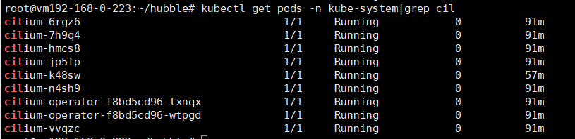
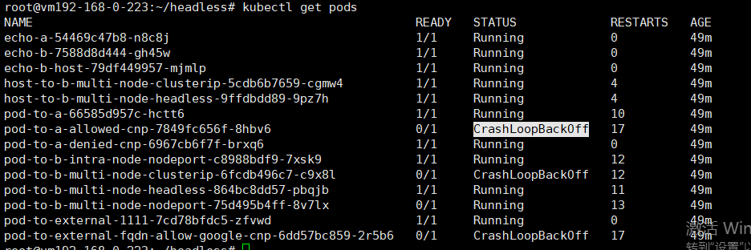
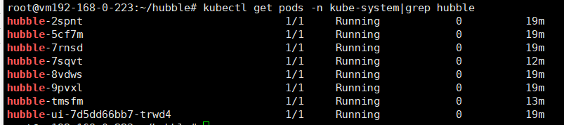
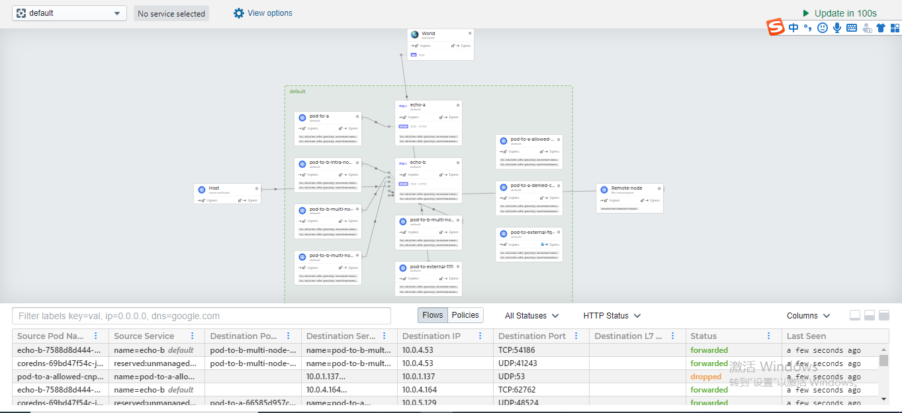

## 环境描述

- cilium  1.8.2（latest版本）
- Kubernetes  1.17
- Linux kernel   4.18
- Helm  3
- Kubernetes in CNI mode
- 在所有 worker node 上挂载 BPF 文件系统

<!-- more -->

## 安装helm3

在k8s集群的其中一个node上执行以下操作：
```bash
# wget https://get.helm.sh/helm-v3.1.2-linux-amd64.tar.gz
# tar -zxvf helm-v3.1.2-linux-amd64.tar.gz
# mv linux-amd64/helm /usr/local/bin/
```

## 挂载 BPF 文件系统

在所有 k8s node 上挂载 bpf 文件系统，执行以下操作
```bash
# mount bpffs /sys/fs/bpf -t bpf
```

## 安装Cilium
```bash 
# kubectl create -f https://raw.githubusercontent.com/cilium/cilium/HEAD/install/kubernetes/quick-install.yaml
```


## 安装测试用例

此用例将会部署一系列的 deployment，它们会使用多种路径来相互访问，连接路径包括带或者不带服务负载均衡和各种网络策略的组合
```bash
# 部署的 podName 表示连接方式，readiness/liveness 探针则可指示连接是否成功
 # kubectl apply -f https://raw.githubusercontent.com/cilium/cilium/HEAD/examples/kubernetes/connectivity-check/connectivity-check.yaml -n app-service
```


## 安装hubble（单独）

```bash
# git clone https://github.com/cilium/hubble.git
# 切换分支(v0.6以及以上版本都已经嵌入到cilium中) 
# git checkout v0.5
# cd hubble/install/kubernetes
# helm install hubble ./hubble \
    --namespace kube-system \
    --set metrics.enabled="{dns,drop,tcp,flow,port-distribution,icmp,http}" \
    --set ui.enabled=true
```
查看安装情况


接下来就可以访问hubble的ui了，我采用的是nodeport+公网负载均衡器的方式


## 遇到问题

>1. 刚开始使用的helm部署方式，hubble嵌入到cilium的helm中。但是部署失败，hubble-ui上flow数据显示不出来。后改用单独部署hubble这种方式
>2. 部署连接测试用例，个别pod的状态时而running时而CrashLoopBackOff。但是不影响hubble的使用。原因是我们的coredns不稳定，在解析svc名称时，有时成功，有时失败