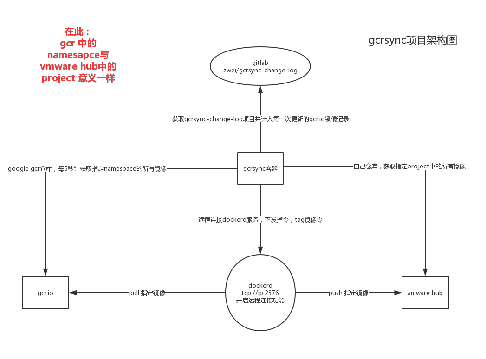

<amp-auto-ads type="adsense" data-ad-client="ca-pub-5216394795966395"></amp-auto-ads>
# Registry mirror原理

Docker Hub的镜像数据分为两部分：index数据和registry数据。前者保存了镜像的一些元数据信息，数据量很小；后者保存了镜像的实际数据，数据量比较大。平时我们使用docker pull命令拉取一个镜像时的过程是：先去index获取镜像的一些元数据，然后再去registry获取镜像数据。

<!-- more -->

所谓registry mirror就是搭建一个registry，然后将docker hub的registry数据缓存到自己本地的registry。整个过程是：当我们使用docker pull去拉镜像的时候，会先从我们本地的registry mirror去获取镜像数据，如果不存在，registry mirror会先从docker hub的registry拉取数据进行缓存，再传给我们。而且整个过程是流式的，registry mirror并不会等全部缓存完再给我们传，而且边缓存边给客户端传。

对于缓存，我们都知道一致性非常重要。registry mirror与docker官方保持一致的方法是：registry mirror只是缓存了docker hub的registry数据，并不缓存index数据。所以我们pull镜像的时候会先连docker hub的index获取镜像的元数据，如果我们registry mirror里面有该镜像的缓存，且数据与从index处获取到的元数据一致，则从registry mirror拉取；如果我们的registry mirror有该镜像的缓存，但数据与index处获取的元数据不一致，或者根本就没有该镜像的缓存，则先从docker hub的registry缓存或者更新数据。

# registry mirror部署

>1. 从官方拉取registry的镜像， [dockerhub官网](https://hub.docker.com/_/registry?tab=tags)
>2. 获取registry的默认配置：[官方配置文件](https://docs.docker.com/registry/configuration/)

```bash
docker run -it --rm --entrypoint cat registry:2.7.1  /etc/docker/registry/config.yml > config.yml

# 文件的内容大概是下面这样：
version: 0.1
log:
  fields:
    service: registry
storage:
  cache:
    blobdescriptor: inmemory
  filesystem:
    rootdirectory: /var/lib/registry
http:
  addr: :5000
  headers:
    X-Content-Type-Options: [nosniff]
health:
  storagedriver:
    enabled: true
    interval: 10s
    threshold: 3

# 我们在最后面加上如下配置：
proxy:
  remoteurl: https://registry-1.docker.io
  username: [username]
  password: [password]

# username和password是可选的，如果配置了的话，那registry mirror除了可以缓存所有的公共镜像外，也可以访问这个用户所有的私有镜像。
```

>3. 启动registry容器：

```bash
docker run  --restart=always -p 5000:5000 --name v2-mirror -v /data:/var/lib/registry -v  $PWD/config.yml:/etc/registry/config.yml registry:2.5.0 /etc/registry/config.yml

# 当我们看到如下日志输出的时候就说明已经启动成功了：
time="2016-12-19T14:22:35Z" level=warning msg="No HTTP secret provided - generated random secret. This may cause problems with uploads if multiple registries are behind a load-balancer. To provide a shared secret, fill in http.secret in the configuration file or set the REGISTRY_HTTP_SECRET environment variable." go.version=go1.6.3 instance.id=da5468c4-1ee1-4df2-95cf-1336127c87bb version=v2.5.0
time="2016-12-19T14:22:35Z" level=info msg="redis not configured" go.version=go1.6.3 instance.id=da5468c4-1ee1-4df2-95cf-1336127c87bb version=v2.5.0
time="2016-12-19T14:22:35Z" level=info msg="Starting upload purge in 39m0s" go.version=go1.6.3 instance.id=da5468c4-1ee1-4df2-95cf-1336127c87bb version=v2.5.0
time="2016-12-19T14:22:35Z" level=info msg="using inmemory blob descriptor cache" go.version=go1.6.3 instance.id=da5468c4-1ee1-4df2-95cf-1336127c87bb version=v2.5.0
time="2016-12-19T14:22:35Z" level=info msg="Starting cached object TTL expiration scheduler..." go.version=go1.6.3 instance.id=da5468c4-1ee1-4df2-95cf-1336127c87bb version=v2.5.0
time="2016-12-19T14:22:35Z" level=info msg="Registry configured as a proxy cache to https://registry-1.docker.io" go.version=go1.6.3 instance.id=da5468c4-1ee1-4df2-95cf-1336127c87bb version=v2.5.0
time="2016-12-19T14:22:35Z" level=info msg="listening on [::]:5000" go.version=go1.6.3 instance.id=da5468c4-1ee1-4df2-95cf-1336127c87bb version=v2.5.0

# 至此，registrymirror就算部署完了。我们也可以用curl验证一下服务是否启动OK：
curl -I http://registrycache.example.com:5000/v2/
HTTP/1.1 200 OK
Content-Length: 2
Content-Type: application/json; charset=utf-8
Docker-Distribution-Api-Version: registry/2.0
Date: Thu, 17 Sep 2015 21:42:02 GMT
```

# registry mirror使用

要使用registry mirror，我们需要配置一下自己的docker daemon。

>1. 对于Mac：在docker的客户端的Preferences——>Advanced——>Registry mirrors里面添加你的地址，然后重启。
>2. 对于Ubuntu 14.04：在/etc/default/docker文件中添加DOCKER_OPTS="$DOCKER_OPTS --registry-mirror=http://registrycache.example.com:5000”，然后重启docker（services docker restart）。
>3. 对于Centos7：/etc/docker/daemon.json 中的registry-mirrors

```json
{
  "registry-mirrors": [
    "http://mirror.kce.sdns.ksyun.com"
  ],
  "disable-legacy-registry": false,
  "graph": "/home/docker",
  "insecure-registries": [
    "mirror.kce.sdns.ksyun.com"
  ]
}
```

然后我们pull一个本地不存在的镜像，这时去查看registry mirror服务器的data目录下面已经有了数据。执行如下命令也可以看到效果：

```bash
curl https://mycache.example.com:5000/v2/library/busybox/tags/list
```

需要说明的是缓存的镜像的有效期默认是一周（168hour），而且如果registry被配置成mirror模式，这个时间是不能通过maintenance部分来改变的：

```yaml
  maintenance:
    uploadpurging:
      enabled: true
      age: 168h
      interval: 24h
      dryrun: false
    readonly:
      enabled: false
```

我研究了好久发现怎么改都不能生效，最后发现mirror模式下这个时间竟然在registry的代码里面写死了：

```go
// todo(richardscothern): from cache control header or config
const repositoryTTL = time.Duration(24 * 7 * time.Hour)
```

当然如果你想你的registry mirror是https的话，在config.yml的http部分增加tls配置即可：

```yaml
   http:
      addr: :5000
      headers:
        X-Content-Type-Options: [nosniff]
      tls:
        certificate: /etc/registry/domain.crt
        key: /etc/registry/domain.key
```

# gcr.io镜像缓存

## dockerd 开启远程连接功能

远程连接docker daemon，Docker Remote API

- docker 版本： Docker version 18.09.5, build e8ff056
- 操作系统： centos7.5
  
```bash
# 编辑启动文件
vim /usr/lib/systemd/system/docker.service

#加入 -H tcp://0.0.0.0:2376 
ExecStart=/usr/bin/dockerd -H fd:// -H tcp://0.0.0.0:2376 --containerd=/run/containerd/containerd.sock

systemctl  daemon-reload 
systemctl start  docker.service
```

注：同样这里也是不安全的。

### 线上环境，安全环境

这里介绍，通过自签名证书安全认证构建HTTPS encypted socket。docker推荐2376作为安全端口。当然我们可以随意设置端口，哈哈。

证书的生成： 详细信息，移步官网：Protect the Docker daemon socket。其原理是通过指定tlsverify标志并将Docker的tlscacert标志指向受信任的CA证书来启用TLS。在守护进程模式下，它只允许来自由该CA签名的证书认证的客户端的连接。 在客户端模式下，它将只连接到具有由该CA签名的证书的服务器。


首先，生成CA公钥和私钥：

```bash
$ openssl genrsa -aes256 -out ca-key.pem 4096       # 生成CA私钥
Generating RSA private key, 4096 bit long modulus
............................................................................................................................................................................................++
........++
e is 65537 (0x10001)
Enter pass phrase for ca-key.pem:
Verifying - Enter pass phrase for ca-key.pem:

$ openssl req -new -x509 -days 365 -key ca-key.pem -sha256 -out ca.pem     #生成CA公钥，也就是证书
Enter pass phrase for ca-key.pem:
You are about to be asked to enter information that will be incorporated
into your certificate request.
What you are about to enter is what is called a Distinguished Name or a DN.
There are quite a few fields but you can leave some blank
For some fields there will be a default value,
If you enter '.', the field will be left blank.
-----
Country Name (2 letter code) [AU]:
State or Province Name (full name) [Some-State]:Queensland
Locality Name (eg, city) []:Brisbane
Organization Name (eg, company) [Internet Widgits Pty Ltd]:Docker Inc
Organizational Unit Name (eg, section) []:Sales
Common Name (e.g. server FQDN or YOUR name) []:$HOST
Email Address []:Sven@home.org.au
```

现在我们有了CA，就可以创建服务器私钥和证书请求文件了，请确保Common Name (i.e., server FQDN or YOUR name)匹配你将要连接的docker主机。

注意，使用你docker宿主机的DNS name替换下面的$HOST

```bash
$ openssl genrsa -out server-key.pem 4096       # 生成服务器私钥
Generating RSA private key, 4096 bit long modulus
.....................................................................++
.................................................................................................++
e is 65537 (0x10001)
$ openssl req -subj "/CN=$HOST" -sha256 -new -key server-key.pem -out server.csr  # 用私钥生成证书请求文件

```

现在，我们可以用CA来签署证书了。这里我们可以填写IP地址或则DNS name，如，我们需要允许10.10.10.20和127.0.0.1连接：

```bash
$ echo subjectAltName = IP:10.10.10.20,IP:127.0.0.1 > extfile.cnf

# 将Docker守护程序密钥的扩展使用属性设置为仅用于服务器身份验证：
$ echo extendedKeyUsage = serverAuth >> extfile.cnf


$ openssl x509 -req -days 365 -sha256 -in server.csr -CA ca.pem -CAkey ca-key.pem \
  -CAcreateserial -out server-cert.pem -extfile extfile.cnf
Signature ok
subject=/CN=your.host.com
Getting CA Private Key
Enter pass phrase for ca-key.pem:
```

客户端证书：

```bash
$ openssl genrsa -out key.pem 4096      # 客户端私钥
Generating RSA private key, 4096 bit long modulus
.........................................................++
................++
e is 65537 (0x10001)
$ openssl req -subj '/CN=client' -new -key key.pem -out client.csr      # 客户端证书请求文件
```

用CA为客户端签署证书文件：

```bash
# 要使密钥适配客户端身份验证，请创建扩展配置文件：
$ echo extendedKeyUsage = clientAuth >> extfile.cnf

$ openssl x509 -req -days 365 -sha256 -in client.csr -CA ca.pem -CAkey ca-key.pem \
  -CAcreateserial -out cert.pem -extfile extfile.cnf
Signature ok
subject=/CN=client
Getting CA Private Key
Enter pass phrase for ca-key.pem:
```

删除证书请求文件：

```bash
rm -v client.csr server.csr
```

默认的私钥权限太开放了，为了更加的安全，我们需要更改证书的权限，删除写入权限，限制阅读权限（只有你能查看）：

```bash
chmod -v 0400 ca-key.pem key.pem server-key.pem
```

证书文件删除其写入权限：

```bash
chmod -v 0444 ca.pem server-cert.pem cert.pem
```

证书的部署：

```bash
# daemon.json
$ sudo vi /etc/docker/daemon.json
{
    "tlsverify": true,
    "tlscert": "/etc/docker/server-cert.pem",
    "tlskey": "/etc/docker/server-key.pem",
    "tlscacert": "/etc/docker/ca.pem",
    "registry-mirrors": [
        ],
    "insecure-registries": [
        ]
}

```

警告：这些证书的保存非常重要，关系着你的服务器的安全，请妥善保管。

### 客户端连接

普通连接：

```bash
$ docker -H tcp://127.0.0.1:2375 ps
CONTAINER ID        IMAGE               COMMAND                  CREATED             STATUS              PORTS                      NAMES
3ed7b8f338ad        mongo:3.2           "/entrypoint.sh mo..."   11 days ago         Up 3 hours          0.0.0.0:27017->27017/tcp   eidb
```

TLS连接：

```bash

$ docker --tlsverify --tlscacert=~/docker/ca.pem \
  --tlscert=~/docker/cert.pem \
  --tlskey=~/docker/key.pem \
  -H=192.168.99.100:2376 version
  
Client:
 Version:      1.13.0-rc1
 API version:  1.25
 Go version:   go1.7.3
 Git commit:   75fd88b
 Built:        Fri Nov 11 22:32:34 2016
 OS/Arch:      darwin/amd64

Server:
 Version:             1.13.0-rc1
 API version:         1.25
 Minimum API version: 1.12
 Go version:          go1.7.3
 Git commit:          75fd88b
 Built:               Fri Nov 11 22:32:34 2016
 OS/Arch:             linux/amd64
 Experimental:        false

 # curl 连接测试
$ curl https://192.168.99.100:2376/images/json \
  --cert ~/.docker/cert.pem \
  --key ~/.docker/key.pem \
  --cacert ~/.docker/ca.pem
```

为了不每次都指定证书，我们可以指定默认连接：

```bash
$ mkdir -pv ~/.docker
$ cp -v ~/{ca,cert,key}.pem ~/.docker
$ export DOCKER_HOST=tcp://192.168.99.100:2376 DOCKER_TLS_VERIFY=1     # 这里只是临时指定，永久请写入*profile里面

$ docker ps
CONTAINER ID        IMAGE               COMMAND                  CREATED             STATUS              PORTS                      NAMES
3ed7b8f338ad        mongo:3.2           "/entrypoint.sh mo..."   11 days ago         Up 3 hours          0.0.0.0:27017->27017/tcp   eidb
```

当然也可以指定证书文件路径：

```bash
export DOCKER_CERT_PATH="/etc/docker"
```

## gcrsync 项目架构介绍



## gcrsync 使用方法

```bash
docker run --rm -d  --name google-containers -v $PWD/etc/:/usr/local/etc/ -v /etc/docker/:/etc/docker/ flftuu/gcrsync:v0.0.1 monitor --sync --namespace google-containers
```

**参数注解**

- -v $PWD/etc/:/usr/local/etc/ 挂载当前目录etc目录
  -  etc 目录下必须包括:
  -  docker.json 文件 存储gcr镜像的hub服务 可支持（docker hub， vmware， registerv2)
  -  gcr.json gcr.io 仓库配置信息 可以设置本地代理proxy
  -  git.json git 项目配置信息

- -v /etc/docker/:/etc/docker/ 挂载docker client 配置目录
  -  docker 目录必须包括：
  -  ca.pem ，cert.pem， key.pem 文件

- monitor 开启监控功能
- --sync 开启同步功能
- --namespace 指定gcr中的要同步的namespace 默认为google-containers

## 配置文件模板

docker.json

```json
{
  "docker_api_version": "1.39",
  "docker_host": "tcp://10.0.0.14:2376",
  "docker_tls_verify": "true",
  "docker_cert_path": "/etc/docker",
  "backend": {
    "type": "vmware",
    "addr": "https://gcr.flftuu.com",
    "user": "用户名",
    "password": "密码",
    "insecure": true
  }
}
```

git.json

```json
{
  "github_token": "zwei:pass",
  "github_repo": "zwei/gcrsync-change-log.git",
  "git_email": "zwei@flftuu.com",
  "git_user": "zwei",
  "git_addr": "http://gitlab.com/",
  "commit_msg": "GcrSync Auto Synchronized."
}
```

gcr.json

```json
{
    "proxy": "", //开启本地代理 http://127.0.0.1:1080
    "http_timeout": 30
}
```

### ca.pem ，cert.pem， key.pem 文件

根据dockerd 服务开启远程功能时候使用的证书而定