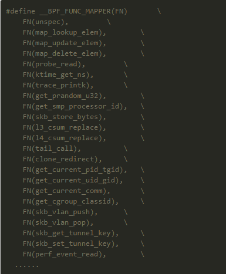

## eBPF是什么？

BPF（Berkeley Packet Filter） 提供了强大的网络包过滤规则，可以确定应该检查哪些流量、忽略哪些流量等，而内核近几年发展的 Extended BPF, eBPF 实际上将应用范围，处理效率进行了更新。通过一个内核内置的字节码虚拟机，完成数据包过滤、调用栈跟踪、耗时统计、热点分析等等高级功能。

<!-- more -->

eBPF是将原先的BPF发展成一个指令集更复杂、应用范围更广的“内核虚拟机”。eBPF支持在用户态将C语言编写的一小段“内核代码”注入到内核中运行，注入时要先用llvm编译得到使用BPF指令集的elf文件，然后从elf文件中解析出可以注入内核的部分，最后用bpf_load_program方法完成注入。 用户态程序和注入到内核中的程序通过共用一个位于内核中map实现通信。

为了防止注入的代码导致内核崩溃，eBPF会对注入的代码进行严格检查，拒绝不合格的代码的注入。

注入程序bpf_load_program()加入了更复杂的verifier 机制，在运行注入程序之前，先进行一系列的安全检查，最大限度的保证系统的安全。具体来说，verifier机制会对注入的程序做两轮检查：

>- 首轮检查(First pass，实现于check_cfg())可以被认为是一次深度优先搜索，主要目的是对注入代码进行一次 DAG(Directed Acyclic Graph，有向无环图)检测，以保证其中没有循环存在，除此之外，一旦在代码中发现以下特征，verifier 也会拒绝注入：

>1. 代码长度超过上限；
>2. 存在可能会跳出 eBPF 代码范围的 JMP，这主要是为了防止恶意代码故意让程序跑飞；
>3. 存在永远无法运行(unreachable)的 eBPF 指令，例如位于 exit 之后的指令；

>- 次轮检查(Second pass，实现于do_check())较之于首轮则要细致很多：在本轮检测中注入代码的所有逻辑分支从头到尾都会被完全跑上一遍，所有指令的参数（寄存器）、访问的内存、调用的函数都会被仔细的捋一遍，任何的错误都会导致注入程序失败。


上图为eBPF的工作流程图。在整个编程实现中，有以下三个比较重要的部分：

>1. Map types： 多种类型的存储，程序间共享，用户态内核态共享
>2. Program Types：不同类型的 bpf 程序完成不同的事，不同的类型具有不同的功能，有点像模版的概念。
>3. helper functions: 与内核数据交互，这里可以看到目前的：http://man7.org/linux/man-pages/man7/bpf-helpers.7.html。

接下来，对这三个部分进行详细描述。

## 核心概念

### Map types

Map types 是 ebpf 中主要的数据存储类型，目前随着内核的发展已经有 20 多种的类型，通用型的，针对 CPU，socket，cgroup 等。很多 map 类型都有一些特殊的使用方式。BPF 程序可以通过 helper function 读写 map，用户态程序也可以通过 bpf(…)系统调用读写 map，因此可以通过 map 来达到 BPF 程序之间，BPF 程序与用户态程序之间的数据交互与控制。具体的类型定义可以看这个文件中定义： include/uapi/linux/bpf.h

```c
enum bpf_map_type {
	BPF_MAP_TYPE_UNSPEC,
	BPF_MAP_TYPE_HASH,
	BPF_MAP_TYPE_ARRAY,
	BPF_MAP_TYPE_PROG_ARRAY,
	BPF_MAP_TYPE_PERF_EVENT_ARRAY,
	BPF_MAP_TYPE_PERCPU_HASH,
	BPF_MAP_TYPE_PERCPU_ARRAY,
	BPF_MAP_TYPE_STACK_TRACE,
	BPF_MAP_TYPE_CGROUP_ARRAY,
	BPF_MAP_TYPE_LRU_HASH,
	BPF_MAP_TYPE_LRU_PERCPU_HASH,
	BPF_MAP_TYPE_LPM_TRIE,
	BPF_MAP_TYPE_ARRAY_OF_MAPS,
	BPF_MAP_TYPE_HASH_OF_MAPS,
	BPF_MAP_TYPE_DEVMAP,
	BPF_MAP_TYPE_SOCKMAP,
	BPF_MAP_TYPE_CPUMAP,
	BPF_MAP_TYPE_XSKMAP,
	BPF_MAP_TYPE_SOCKHASH,
	BPF_MAP_TYPE_CGROUP_STORAGE,
	BPF_MAP_TYPE_REUSEPORT_SOCKARRAY,
	BPF_MAP_TYPE_PERCPU_CGROUP_STORAGE,
	BPF_MAP_TYPE_QUEUE,
	BPF_MAP_TYPE_STACK,
	BPF_MAP_TYPE_SK_STORAGE,
	BPF_MAP_TYPE_DEVMAP_HASH,
	BPF_MAP_TYPE_STRUCT_OPS,
};
```
### Program Types

每个BPF程序都属于某个特定的程序类型，目前内核支持20+不同类型的BPF程序类型，可以大致分为网络，跟踪，安全等几大类，BPF程序的输入参数也根据类型有所不同。 具体的定义可以看这个文件中定义： include/uapi/linux/bpf.h

```c
enum bpf_prog_type {
	BPF_PROG_TYPE_UNSPEC,
	BPF_PROG_TYPE_SOCKET_FILTER,
	BPF_PROG_TYPE_KPROBE,
	BPF_PROG_TYPE_SCHED_CLS,
	BPF_PROG_TYPE_SCHED_ACT,
	BPF_PROG_TYPE_TRACEPOINT,
	BPF_PROG_TYPE_XDP,
	BPF_PROG_TYPE_PERF_EVENT,
	BPF_PROG_TYPE_CGROUP_SKB,
	BPF_PROG_TYPE_CGROUP_SOCK,
	BPF_PROG_TYPE_LWT_IN,
	BPF_PROG_TYPE_LWT_OUT,
	BPF_PROG_TYPE_LWT_XMIT,
	BPF_PROG_TYPE_SOCK_OPS,
	BPF_PROG_TYPE_SK_SKB,
	BPF_PROG_TYPE_CGROUP_DEVICE,
	BPF_PROG_TYPE_SK_MSG,
	BPF_PROG_TYPE_RAW_TRACEPOINT,
	BPF_PROG_TYPE_CGROUP_SOCK_ADDR,
	BPF_PROG_TYPE_LWT_SEG6LOCAL,
	BPF_PROG_TYPE_LIRC_MODE2,
	BPF_PROG_TYPE_SK_REUSEPORT,
	BPF_PROG_TYPE_FLOW_DISSECTOR,
	BPF_PROG_TYPE_CGROUP_SYSCTL,
	BPF_PROG_TYPE_RAW_TRACEPOINT_WRITABLE,
	BPF_PROG_TYPE_CGROUP_SOCKOPT,
	BPF_PROG_TYPE_TRACING,
	BPF_PROG_TYPE_STRUCT_OPS,
	BPF_PROG_TYPE_EXT,
};
```

### helper functions

具体的定义可以看这个文件中定义： include/uapi/linux/bpf.h，在文件的几乎最下面，可以检索 FN( 这个关键字来搜索。不同的内核版本支持的也是不一样的。从函数看出来主要是就是协助处理用户空间和内核空间的交互。比如从内核获取数据（PID，GID，时间，处理器ID等），操作内核的对象。


## 支持功能

>- 追踪Tracing: kprobe/uprobe/tracepoint
>- 安全Security: seccomp
>- 网络Net: bpfilter, tc, sockmap, XDP

可以从这张图上看看不同版本的内核和其支持的功能
