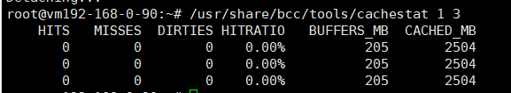
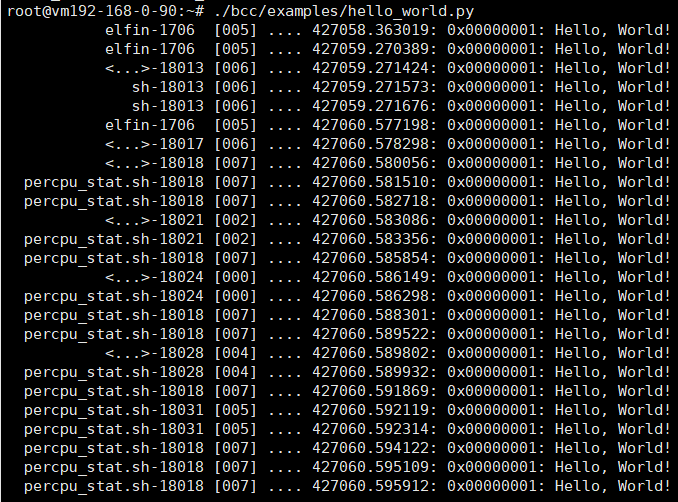
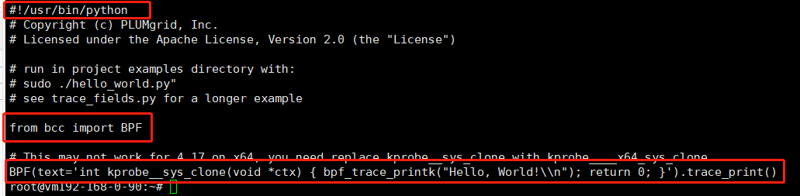
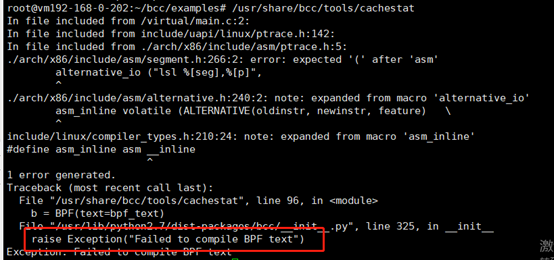
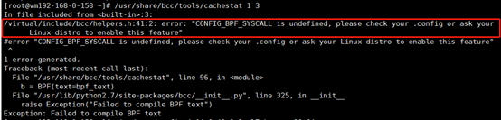
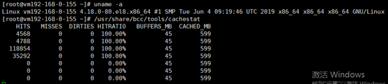

# BCC开发框架部署

## 安装部署

操作系统版本：ubuntu18.04 64位;
内核版本：Linux vm192-168-0-90 4.15.0-29-generic #31-Ubuntu SMP Tue Jul 17 15:39:52 UTC 2018 x86_64 x86_64 x86_64 GNU/Linux;
<!-- more -->

### 安装build工具

```go
# For Bionic (18.04 LTS)
apt-get -y install bison build-essential cmake flex git libedit-dev  libllvm6.0 llvm-6.0-dev libclang-6.0-dev python zlib1g-dev libelf-dev
```

### 安装bcc

```go
apt-key adv --keyserver keyserver.ubuntu.com --recv-keys 4052245BD4284CDD
echo "deb https://repo.iovisor.org/apt/$(lsb_release -cs) $(lsb_release -cs) main" | sudo tee /etc/apt/sources.list.d/iovisor.list
apt-get update
apt-get install bcc-tools libbcc-examples linux-headers-$(uname -r)
apt-get install bpfcc-tools python-bpfcc libbpfcc
```

### 测试自带工具


### helloworld示例
```bash
# git clone https://github.com/iovisor/bcc
```
```bash
# ./bcc/examples/hello_world.y
```


```bash
# 查看hello_world.py的工作内容
```

首先这是个python程序，它很简单，只是做了一件事情。就是在系统调用函数sys_probe处插入了一个探针，每当该函数被调用时，就打印“Hello，World”！

## 踩坑记录

### 内核升级至5.4
内核版本越高，对ebpf的支持越完善，因此将内核版本从4.15升级到了5.4。但是安装bcc工具完成后，自带的测试脚本无法执行，报以下错误：


ubuntu和centos，都报以上错误。

### centos7.5-内核4.14

测试centos7.5，内核版本4.14，也不行，即使修改了内核配置，仍报以下错误：



### centos8-内核4.18

centos8，内核版本为4.18，也无需升级内核。安装完 bcc和bcc-tools，直接就能使用了

```bash
# yum install bcc bcc-tools
```
bcc自带的测试工具运行也是ok的。


但是自己开发ebpf程序，编译的时候，需要用到libbcc库和头文件。Iovisior社区并没有实现针对centos8版本的rpm包

 尝试安装针对el7的libbcc软件包，安装不上。