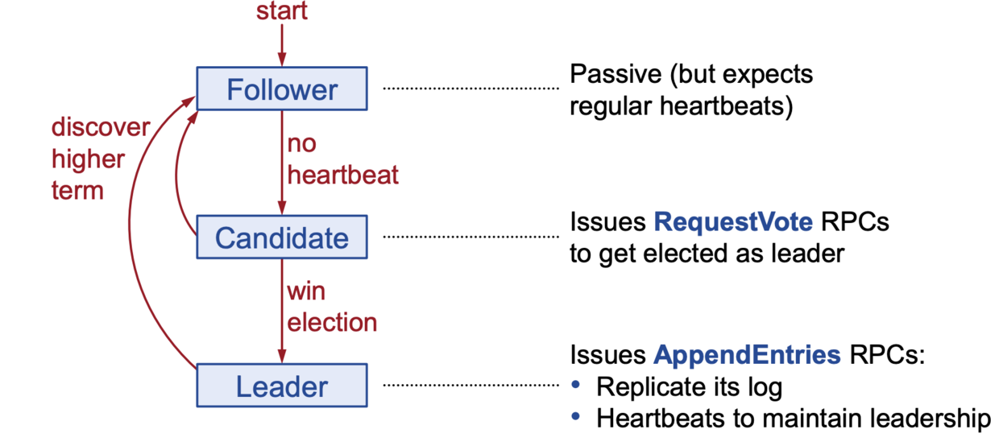
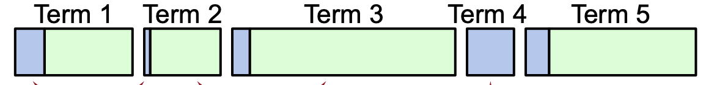
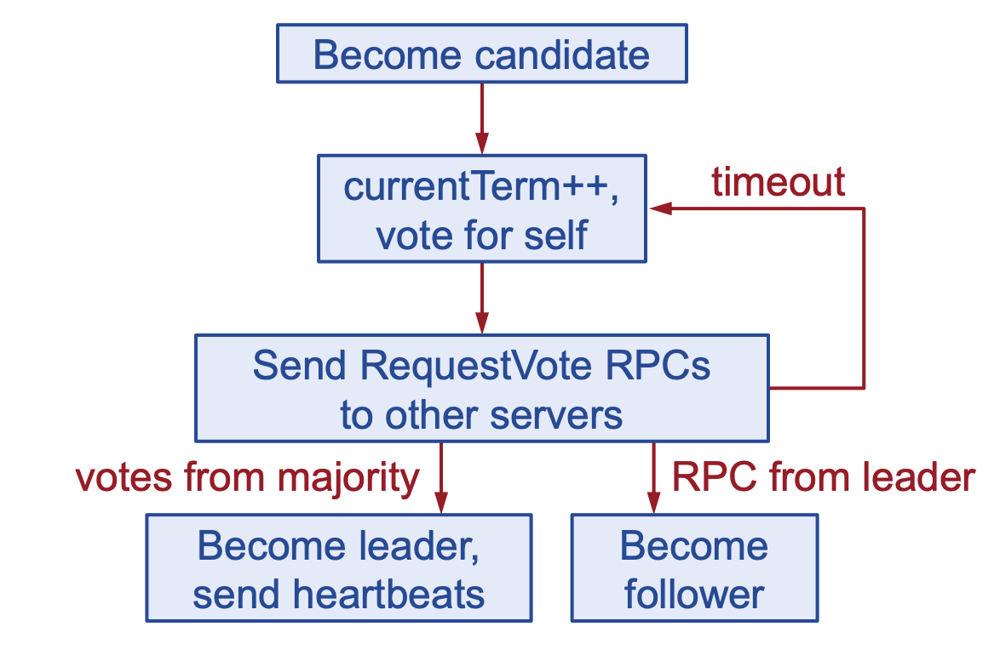
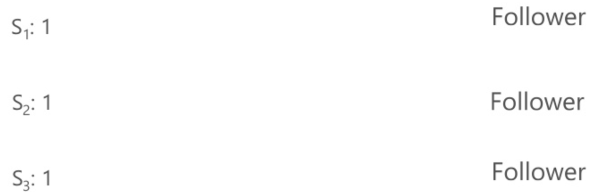
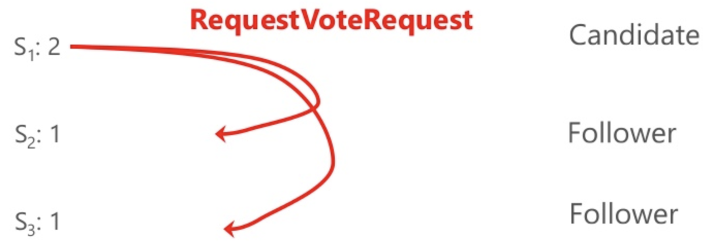
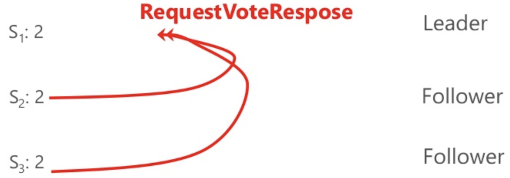
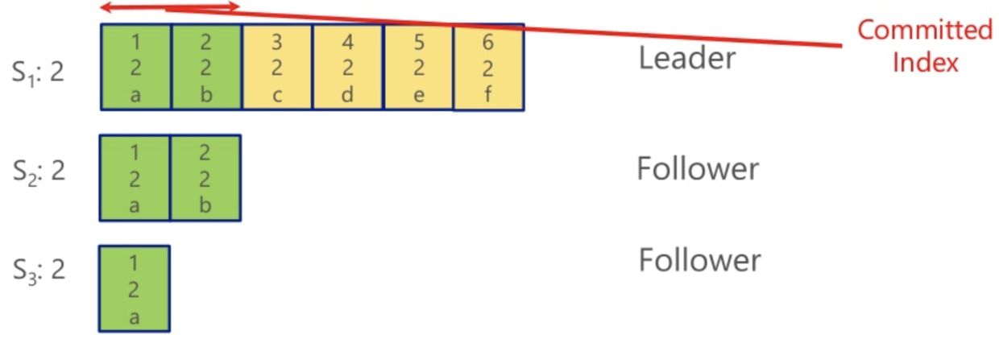

# etcd raft选举机制

etcd 是一个分布式的k/V存储系统。核心使用了RAFT分布式一致性协议。一致性这个概念，它是指多个服务器在状态达成一致，但是在一个分布式系统中，因为各种意外可能，有的服务器可能会崩溃或变得不可靠，它就不能和其他服务器达成一致状态。这样就需要一种Consensus协议，一致性协议是为了确保容错性，也就是即使系统中有一两个服务器当机，也不会影响其处理过程。

为了以容错方式达成一致，我们不可能要求所有服务器100%都达成一致状态，只要超过半数的大多数服务器达成一致就可以了，假设有N台服务器，N/2 +1 就超过半数，代表大多数了。

## raft协议核心要点：

- Leader选举（Leader Election）
- 日志同步 （Log Replication）
  - leader收到client的更新请求后，会讲更新的内容同步给所有follower。
- 集群状态的正确性 （Safety）
  - 保证日志的一致性
- 保证选举的正确性

<!-- more -->

## 服务器状态：

- leader 处理所有客户端交互，日志复制等，一个任期只有一个。
- follower 完全被动的选民，是只读的。
- candidate 候选人，可以被选举为新领导。

状态之间的转换图：

## 任期（terms）

如上图，蓝色代表 Election 模式，绿色代表 Operation 模式

- 在每个任期内最多一个leader
- 有些可能没有leader
- 每一个服务会维护当前的任期值
  - 每一个rpc请求中都会携带term值
  - 如果一个peer实例拥有老的term值，则更新为最新的term值并状态变为follower
- 一旦一个服务选举为leader，就会进入 operation 模式

## Leader选举

etcd服务启动后，会进入 follower 状态，leader 心跳超时后会进入选举状态。
选举总体流程图如下：

**选举流程分解**

- 初始状态都是Follower
  

- S1 超时, 变为Candidate，开始选举, 发起投票请求
  

- S1 变为Leader
  - S2 和 S3 同意投票给S1
   

- Leader S1开始接受客户端写请求
  - Leader接受到客户端写请求后，会将数据更新写入到log中
  - 如果S2和S3收到客户端写请求，会将请求转发到Leader S1
  - Leader会异步的将更新的log同步到Follower S2和S3
  - 超过多数的Follower将数据成功同步到log后，Leader会将该条数据更新为Committed状态，Committed index会随着增长。
 

**选举的正确性**

- 在每一任期内，最多允许一个服务被选举为leader
  - 在一个任期内，一个服务只能投一票
  - 只有获得大多数投票才能作为leader
- 如果有多个candidate，最终一定会有一个被选举为leader
  - 如果多个candidate同时发起了选举，导致都没有获得大多数选票时，每一个candidate会随机等待一段时间后重新发起新一轮投票（一般是随机等待150-300ms）

**日志的一致性**

- 客户端写入数据到 leader：
  - leader 将数据写入到 log
  - leader将更新的数据广播到所有的followers
  - 多数follower成功写入log后，leader会将该数据提交到状态机
    - leader 把数据提交后，返回给client结果
    - 在下一个心跳中，leader 通知follower更新已经提交的数据
- Crashed/slow followers ？
  - leader会一直重试同步数据到follower，直到成功