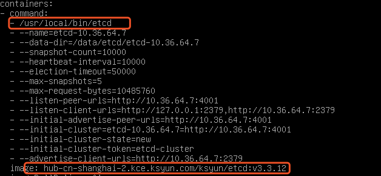
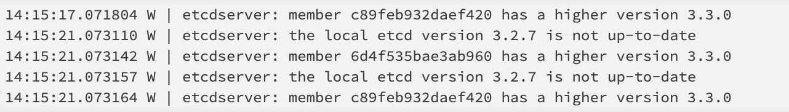

# 将etcd从3.2升级到3.3

在一般情况下，从etcd 3.2升级到3.3可以是零停机，滚动升级：

>- 一个接一个，停止etcd v3.2进程并用etcd v3.3进程替换它们（一个升级之后，等待集群状态正常之后再升级下一个）
>- 运行所有v3.3进程后，群集可以使用v3.3中的新功能

<!-- more -->

## 具体操作：

>1. 登陆到master01，master02，master03，将/etc/kubernetes/manifests/中的etcd.yaml复制到临时目录，注意：一定做好etcd.yaml的备份
>2. 首先修改master01，修改临时目录下etcd.yaml，直接修改版本号，以及启动命令

>3. 将修改完的etcd.yaml复制到/etc/kubernetes/manifests/，执行kubectl get po -n kube-system|grep etcd查看etcd的状态，等待etcd的三个节点都正常之后，用etcdctl查看集群状态 etcdctl member list
>4. 三个etcd的member都正常之后，查看etcd日志，显示升级成功。

>5. 依次在master02，master03上执行相同的操作以及操作检查。