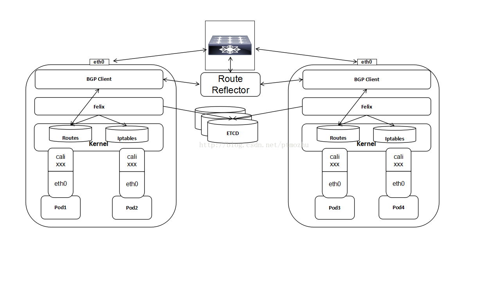
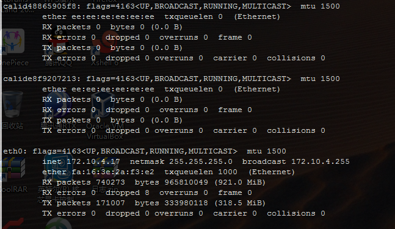
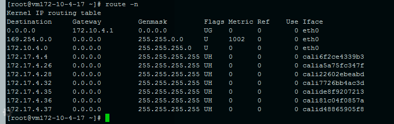
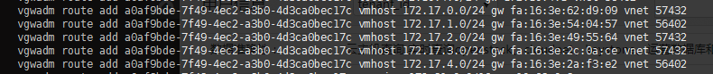

# k8s 集群网络方案介绍

## flanneld 功能介绍

### 背景介绍

>- Flannel是CoreOS团队针对Kubernetes设计的一个网络规划服务，简单来说，它的功能是让集群中的不同节点主机创建的Docker容器都具有全集群唯一的虚拟IP地址。

<!-- more -->

## 工作原理

>- Flannel实质上是一种“覆盖网络(overlay network)”，也就是将TCP数据包装在另一种网络包里面进行路由转发和通信，目前已经支持UDP、VxLAN、AWS VPC和GCE路由等数据转发方式。
>- 默认的节点间数据通信方式是UDP转发，在Flannel的GitHub页面有如下的一张原理图：

>- 数据从源容器中发出后，经由所在主机的docker0虚拟网卡转发到flannel0虚拟网卡，这是个P2P的虚拟网卡，flanneld服务监听在网卡的另外一端。
>- Flannel通过Etcd服务维护了一张节点间的路由表。
>- 源主机的flanneld服务将原本的数据内容UDP封装后根据自己的路由表投递给目的节点的flanneld服务，数据到达以后被解包，然后直接进入目的节点的flannel0虚拟网卡，然后被转发到目的主机的docker0虚拟网卡，最后就像本机容器通信一下的有docker0路由到达目标容器。

## ksc-vpc 功能

### ksc-vpc 背景

>- flanneld 默认使用的udp 进行封装后在每个节点之间进行通信
>- 是否udp封装通信，必须有封包和解包工作，这样会影响网络的性能
>- 为提高网络性能，我们引进ksc-vpc 功能来代替upd的方式进行节点之间的通信

### ksc-vpc 原理

>- ksc-vpc 使用公司网络产品 "主机路由"
>- 主机路由介绍 [公司官方文档](https://docs.ksyun.com/documents/68)
>- flanneld 使用ksc-vpc 原理图:

## calico 介绍

>- Calico是一个纯三层的数据中心网络方案，而且方便集成OpenStack这种 IaaS云架构，能够提供高效可控的VM、容器、裸机之间的通信。

### calico 架构图

>- 如图， Calico的核心组件包括：Felix、etcd、BIRD、BIRD。
>- Felix，即Calicoagent，跑在kubernetes的node节点上，主要负责配置路由及ACLs等信息来确保endpoint的连通状态；
>- etcd，分布式键值存储，主要负责网络元数据一致性，确保Calico网络状态的准确性，可以与kubernetes共用；
>- BGPClient(BIRD), 主要负责把 Felix写入 kernel的路由信息分发到当前 Calico网络，确保 workload间的通信的有效性；
>- BGPRoute Reflector(BIRD), 大规模部署时使用，摒弃所有节点互联的mesh模式，通过一个或者多个 BGPRoute Reflector 来完成集中式的路由分发；
>- 通过将整个互联网的可扩展 IP网络原则压缩到数据中心级别，Calico在每一个计算节点利用 Linuxkernel 实现了一个高效的 vRouter来负责数据转发，而每个vRouter通过 BGP协议负责把自己上运行的 workload的路由信息向整个Calico网络内传播，小规模部署可以直接互联，大规模下可通过指定的BGProute reflector 来完成。这样保证最终所有的workload之间的数据流量都是通过 IP包的方式完成互联的。
>- 此外，Calico基于iptables还提供了丰富而灵活的网络Policy，保证通过各个节点上的ACLs来提供Workload的多租户隔离、安全组以及其他可达性限制等功能。

## canal-flanneld 介绍

>- canal-flanneld:  flanneld 和calico 中的 felix 组件结合而成
>- flanneld 在其中负责 所有 node 中pod 之间的通信
>- calico(felix) 在其中负责集群网络中的资源隔离策略

### pod 网络信息

>- pod 网卡信息

>- vm 路由信息

> - vpc 路由信息

