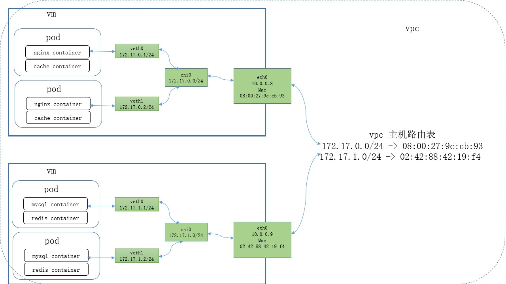
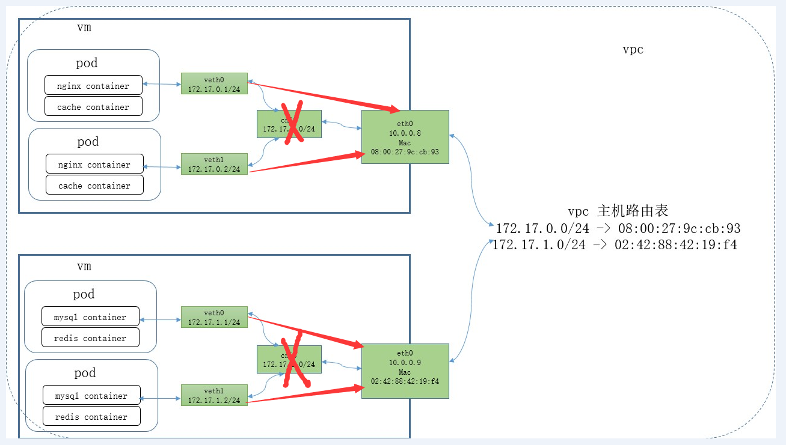

# flannel cni组件 优化

## flannel 使用主机路由 网络架构优化

ksyun-vpc 原有网络模型

<!-- more-->

ksyun-vpc 优化活网络模型

优化方向说明：

>- 原有网络方式是在没有个节点上多有生成一个cni0 的网桥， 让后创建一个pod 并把pod 的veth对加入到cni0网桥，然后在从cni0 中（走默认路由）在转到eth0网卡
>- 去掉cni0 网桥， 创建pod 时候不添加到cni0网桥中
>- 需要修改模块 flanneld-cni 插件 仿照caclio-cni 去实现
>- flanneld-cni 和 caclio-cni 源码可上github 官网找到