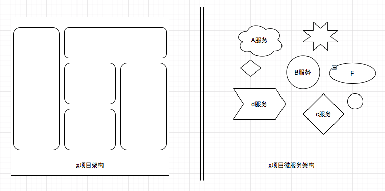
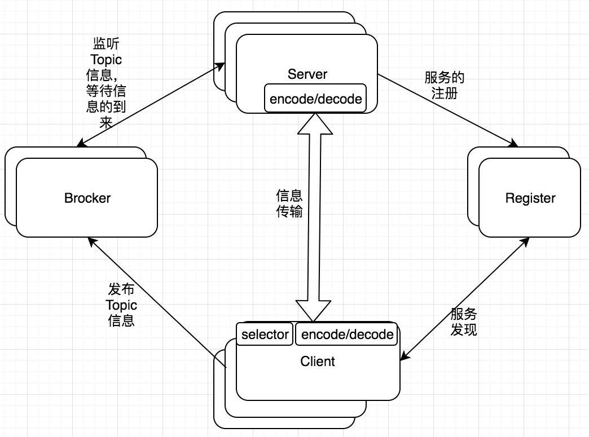
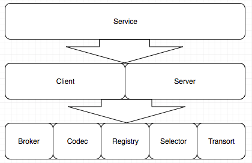
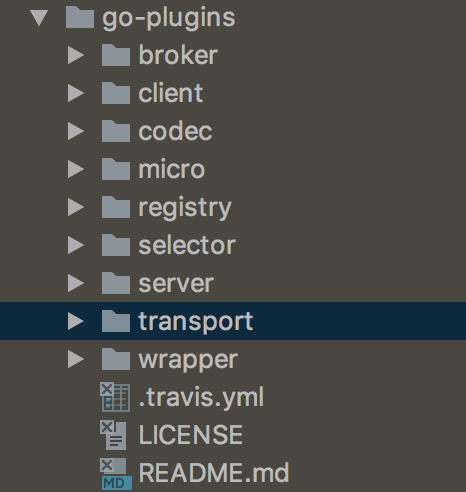

<amp-auto-ads type="adsense" data-ad-client="ca-pub-5216394795966395"></amp-auto-ads>

# 微服务架构

微服务化项目除了稳定性比较关心的几个问题：

>1. 服务间数据传输的效率和安全性。
>2. 服务的动态扩充，也就是服务的注册和发现，服务集群化。
>3. 微服务功能的可订制化，因为并不是所有的功能都会很符合你的需求，难免需要根据自己的需要二次开发一些功能。

<!-- more -->

go-micro是go语言下的一个很好的rpc微服务框架，功能很完善：

>1. 服务间传输格式为protobuf，效率上没的说，非常的快，也很安全。
>2. go-micro的服务注册和发现是多种多样的。我个人比较喜欢etcdv3的服务服务发现和注册。
>3. 主要的功能都有相应的接口，只要实现相应的接口，就可以根据自己的需要订制插件。

# 通信流程

go-micro的通信流程大至如下

>1. Server监听客户端的调用，和Brocker推送过来的信息进行处理。并且Server端需要向Register注册自己的存在或消亡，这样Client才能知道自己的状态。
>2. Register服务的注册的发现。
>3. Client端从Register中得到Server的信息，然后每次调用都根据算法选择一个的Server进行通信，当然通信是要经过编码/解码，选择传输协议等一系列过程的。
>4. Brocker 信息队列进行信息的接收和发布。

go-micro之所以可以高度订制和他的框架结构是分不开的，go-micro由8个关键的interface组成，每一个interface都可以根据自己的需求重新实现，这8个主要的inteface也构成了go-micro的框架结构。

这些接口go-micir都有他自己默认的实现方式，还有一个go-plugins是对这些接口实现的可替换项。你也可以根据需求实现自己的插件。

<ins class="adsbygoogle"
     style="display:block; text-align:center;"
     data-ad-layout="in-article"
     data-ad-format="fluid"
     data-ad-client="ca-pub-5740135781067616"
     data-ad-slot="5076307255"></ins>

