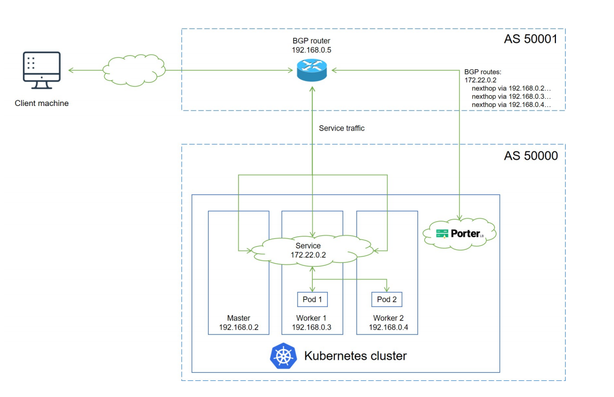
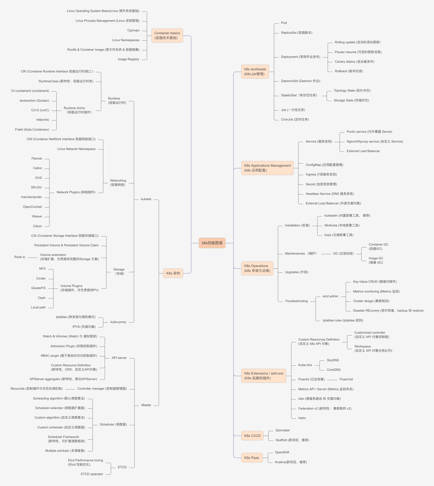

## 概要目的

本文主要提供本地开发调试 BGP 程序的一个技巧，同时学习 BGP 协议，以及 go 包 gobgp <https://github.com/osrg/gobgp>

学习 BGP 协议必要性：K8s 容器网络目前我们使用 Cilium/Calico，都是使用 BGP 来宣告路由，使得 pod/service cidr 在 K8s 之外可达。所以，想要了解容器网络，有必要了解 BGP。

<!-- more -->

## BGP 基本概念

BGP <https://datatracker.ietf.org/doc/html/rfc4271 是一个建立在 TCP 上的边界网关协议，可以用来动态学习路由。>

在 K8s Cilium/Calico 网络插件生态里，主要使用 BGP 协议宣告 pod/service 路由给交换机，使得 pod/service ip 可以在 K8s 之外访问。

比如，下图是把目的地址为 service ip 的路由宣告给交换机，可以见青云的 Porter 项目 https://github.com/kubesphere/openelb/blob/master/doc/bgp-mode.md

该项目比较简单，通过 k8s 这一层获取 service ip，和定制选择几个 Node IP 作为下一跳Next Hop，构造成一个路由，宣告给交换机。当然，也可以直接把 service cidr 宣告给交换机而不是一个个 service ip:

porter 项目和 metallbhttps://github.com/metallb/metallb项目基本一致，主要区别在porter 使用强大的 gobgp 库来实现 bgphttps://github.com/osrg/gobgp，且通过 K8s CRD 来配置，而 metallb 自己实现的一个简陋版本的 BGP 实现。两者都自己实现了 IPAM。对比可以参考：<https://github.com/kubesphere/openelb/blob/master/doc/zh/compared\_with\_metallb.md，>

感觉porter 更友好点，不过做的事情几乎一样。

pod cidr 也是通过 BGP 协议宣告给交换机，目前我们 K8s 集群的 Cilium/Calico 使用 bird 程序(C语言写的) 来宣告每一个 pod cidr subnet 给交换机，本机 Node IP 作为下一跳。比如 pod cidr 为 10.20.30.40/19，集群有两个node 100.100.100.100、200.200.200.200 ，并且切分成两个 pod cidr

subnet10.20.30.40/20、10.20.30.41/20，则两个 node 上的 bird 分别会把类似如下路由宣告给交换机：

    10.20.30.40/20 via 100.100.100.100
    10.20.30.41/20 via 200.200.200.200

流量到了交换机那一侧，如果 pod ip 在10.20.30.40/20 子网内，则下一跳去100.100.100.100 node；如果 pod ip 在10.20.30.41/20 子网内，则下一跳去200.200.200.200 node。

## 调试 BGP 程序

需要本地开发一个 BGP 程序，比如类似 porter/metallb 那样的项目，但是没有真实的交换机/路由器，那就不太方便本地开发调试了，可以使用 gobgp <https://github.com/osrg/gobgp包来在本地运行作为 route server(类似交换机那一侧)。而且，建议使用强大的gobgp BGP 包，go 语言写的。>

或者也可以使用 bird，C 语言写的。不过程序需要集成 gobgp 包，也建议 gobgp。

先安装下 gobgpd 和 gobgp 两个 bin 文件，gobgp 是客户端：

    wget -c https://github.com/osrg/gobgp/releases/download/v3.15.0/gobgp_3.15.0_linux_amd64.tar.gz
    
    tar -xf -C /usr/local/bin gobgp_3.15.0_linux_amd64.tar.gz

然后本地运行 route-server，可以参考<https://github.com/osrg/gobgp/blob/master/docs/sources/route-server.md，配置文档 route-server-conf>.

conf 如下：

    [global.config]
     as = 64512
     router-id = "1.1.1.1"
     port = 1790
     local-address-list = ["127.0.0.1"]
    [[neighbors]]
     [neighbors.config]
     neighbor-address = "127.0.0.1"
     peer-as = 65001
     [neighbors.transport.config]
     remote-port = 1791
     passive-mode = true
     [neighbors.route-server.config]
     route-server-client = true

本地运行服务

    gobgpd -f ./route-server-conf.conf -l debug --api-hosts ":50052" --pprof-disable

这时，以上 route server 就相当于交换机那一侧，等待 node 这一侧宣告路由过去。然后就是编写一个 bgp 程序，并使用 gobgp 包。一个简单的代码如

下所示，当然在可以加上k8s那一侧控制平面获取 pod/service cidr 等逻辑，类似 porter/metallb 项目。

测试代码里，本地这一侧会宣告一个路由: 目标地址 10.20.30.0/24 下一跳 30.30.30.30

    package bgp
    
    import (
     "context"
     "github.com/golang/protobuf/ptypes"
     api "github.com/osrg/gobgp/api"
     gobgp "github.com/osrg/gobgp/pkg/server"
     "google.golang.org/protobuf/types/known/anypb"
     "testing"
    )
    
    // gobgpd -f ./route-server-conf.conf -l debug --api-hosts ":50052" --pprof-disable
    // gobgpd -f ./route-client-conf.conf -l debug --api-hosts ":50053" --pprof-disable
    // nodegobgp -p 50053 -d global rib add -a ipv4 100.0.0.0/24 nexthop 20.20.20.20
    // gobgp -p 50052 -d neighbor 127.0.0.1 adj-in
    // gobgp -p 50052 -d global rib add -a ipv4 200.0.0.0/24 nexthop 20.20.20.20
    // nodegobgp -p 50053 -d neighbor 127.0.0.1 adj-in
    func TestRouteServer(test *testing.T) {
     log.SetLevel(log.DebugLevel)
     ch := make(chan struct{})
    
     // bgp1
     s := gobgp.NewBgpServer(gobgp.GrpcListenAddress(":50053"))
     go s.Serve()
     _ = s.StartBgp(context.Background(), &api.StartBgpRequest{
      Global: &api.Global{
       As:         65001,     // AS Number, NetOPS API AS Number
       RouterId:   "2.2.2.2", // IP
       ListenPort: 1791,
      },
     })
     defer s.StopBgp(context.Background(), &api.StopBgpRequest{})
    
     // route-server() bgp-server
     p1 := &api.Peer{
      Conf: &api.PeerConf{
       NeighborAddress: "127.0.0.1",
       PeerAs:          64512,
      },
      Transport: &api.Transport{
       RemotePort: 1790,
      },
     }
     _ = s.AddPeer(context.Background(), &api.AddPeerRequest{Peer: p1})
    
     nlri, _ := ptypes.MarshalAny(&api.IPAddressPrefix{
      Prefix:    "10.20.30.0",
      PrefixLen: 24,
     })
     a1, _ := ptypes.MarshalAny(&api.OriginAttribute{
      Origin: 0,
     })
     a2, _ := ptypes.MarshalAny(&api.NextHopAttribute{
      NextHop: "30.30.30.30",
     })
     attrs := []*anypb.Any{a1, a2}
     s.AddPath(context.TODO(), &api.AddPathRequest{
      Path: &api.Path{
       Family: &api.Family{Afi: api.Family_AFI_IP, Safi: api.Family_SAFI_UNICAST},
       Nlri:   nlri,
       Pattrs: attrs,
      },
     })
    
     <-ch
    }

## k8s 技能树

