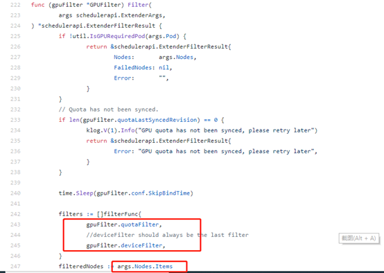
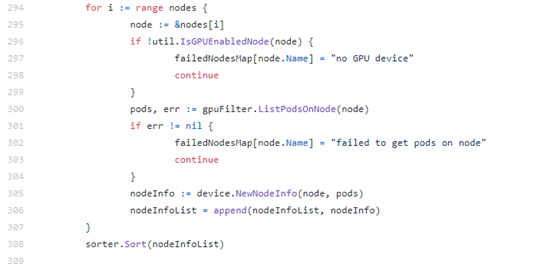
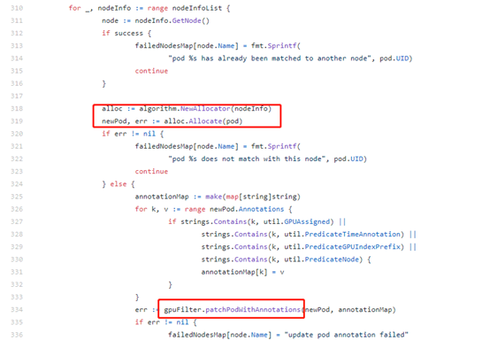
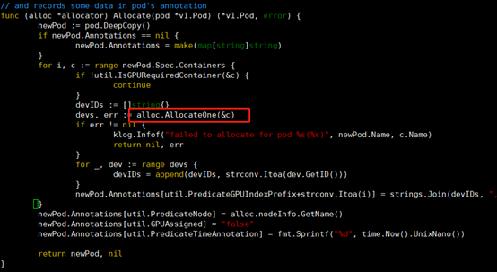
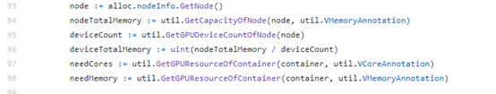
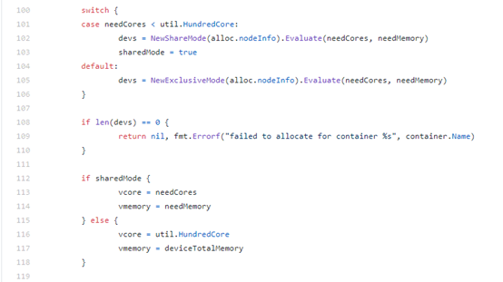
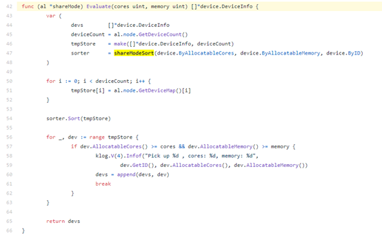
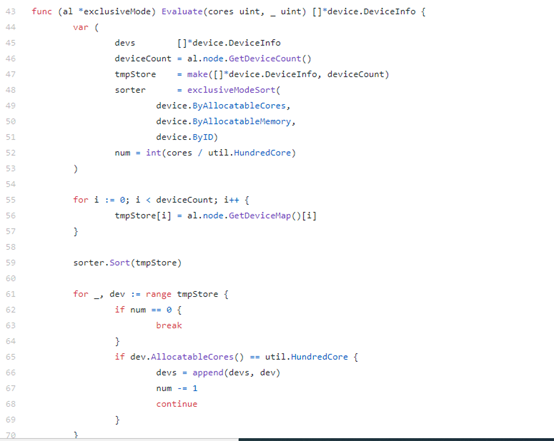
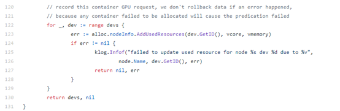

## 简介

Gpu-admission提供调度扩展器，基于default-scheduler预选出来的节点，进行筛选。

因此我们首先找到入口函数，即pkg/predicate/gpu_predicate.go下的Filter函数。

pkg/predicate/gpu_predicate.go  用于预选出适合的gpu节点（只有一个，因此不需要优选）和device，并写入到pod的注解中。

<!-- more -->


支持两个过滤器，quota和device。以deviceFilter为例

首先对默认调度穿过来的node列表进行排序。根据每个节点上的pod信息，重新构建node信息。然后按照可使用资源由少到多进行排序。



接下来调用algorithm的Allocate函数为container分配gpu设备。最终将分配的node和gpu信息写入pod的annoatation中。



我们重点分析Allocate()函数，进入Pkg/algorithm/allocate.go

```go
func (alloc *allocator) Allocate(pod *v1.Pod) (*v1.Pod, error) {
```


Allocate函数遍历pod的所有container，逐个分配device，实际的分配工作是有AllocateOne函数完成，返回选择后的device列表。

我们进一步深入到AllocateOne函数中

```go
// AllocateOne tries to allocate GPU devices for given container

func (alloc *allocator) AllocateOne(container *v1.Container) ([]*device.DeviceInfo, error) {
//尝试分配需要gpu资源的container

//获取该node的总共内存，device的个数等
```



如果needCores小于100，则共享模式为true。

共享模式下，调用pkg/algorithm/share.go的Evaluate函数，按照每块device可用的core数由少到多的顺序进行排序，选出满足core和memory的那个device卡



若needcores为100的整数倍，则为非共享模式。该模式下，调用pkg/algorithm/exclusive.go下的Evaluate()函数为container分配gpu卡。

同样先对本node上的所有gpu按照core的可用个数由少到多进行排序。然后逐个过滤各块卡。如果是块空卡（即没有应用在使用它），则加入到devs列表中。直到找到n（needcores/100）块空卡.。如果没有找到n块，则失败。



如果是非共享模式，记录vcore为100，vmemory为deviceTotalMemory

最后更新本node上的gpu设备已使用资源信息。



## 其他：

pkg/device/deviceInfo.go：
```go
记录gpu设备的id、totalMemory、usedMemory、usedCore。并提供以下三个函数

AddUsedResources // 更新设备的已使用core和memory记录；

AllocatableCore() // 获取设备的剩余core

AllocatableMemory() //获取设备的剩余memory
```

```go
pkg/device/nodeInfo.go：

用于构建node信息（每次调度的时候都会调用）。遍历节点上的所有pod和每个pod中的container，获取已经分配出去core和memory信息。

初始化每个device的totalMemory是所有内存的平均值，因此gpu-admission假设的前提是node上所有gpu设备的内存是一样大的。
```
