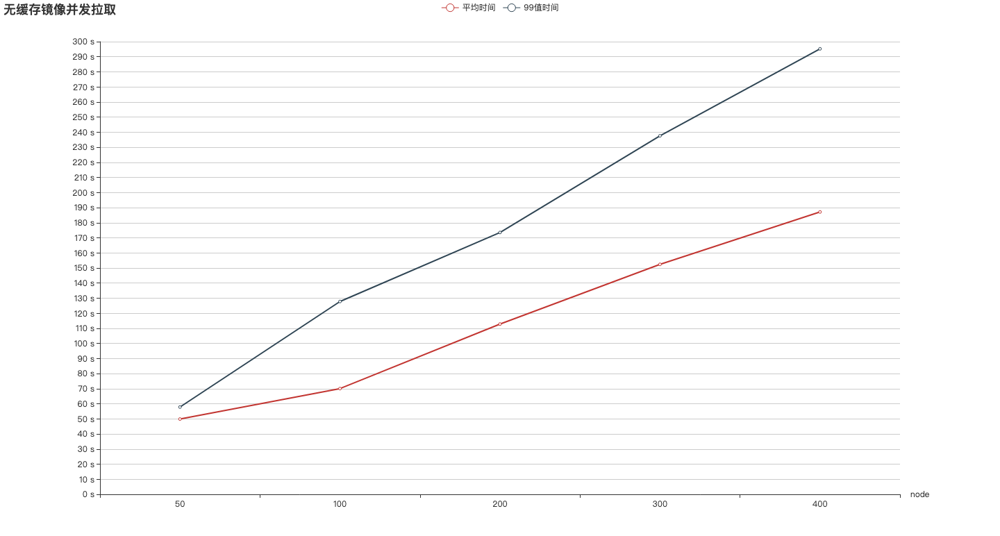
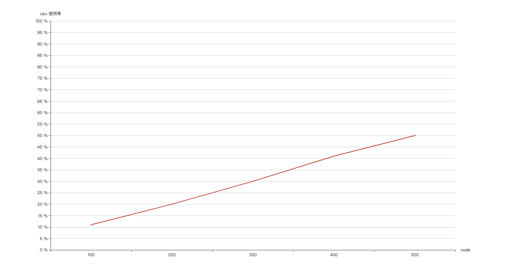

<amp-auto-ads type="adsense" data-ad-client="ca-pub-5216394795966395"></amp-auto-ads>

## 测试环境

测试机型：

harbor机型：I2 IO优化型， 4C8G
测试镜像大小： 1.7G
测试工具：[harbor perftest](https://github.com/seamounts/perftest)

<!-- more -->

测试集群：

    准备k8s集群，通过 k8s node 节点拉取harbor镜像,

准备测试镜像：

```sh
docker pull garima0079/bigimage
docker tag garima0079/bigimage {harbor LB地址}/bigimage
docker push {harbor LB地址}/bigimage
```

测试工具准备:

```sh
git clone git@github.com:seamounts/perftest.git -d $GOPATH/src
cd $GOPATH/src/perftest
go build
```

准备测试集群node docker daemon 配置:

批量更新 k8s node docker daemon，将 harbor lb地址加入到 insecure-registries 列表

```sh
$GOPATH/src/perftest/cmd/harbor/script/prepare.sh
```

清除镜像缓存:

批量清除 k8s node 节点镜像缓存

```sh
$GOPATH/src/perftest/cmd/harbor/script/clear-image-cache.sh {harbor LB地址}/bigimage
```

## 测试指标

镜像无缓存并发拉取大镜像的平均耗时，99值耗时

harbor 实例数和拉取时间的关系

harbor 支持的最大并发


## 无缓存拉取大镜像测试

### 2 HA harbor测试

测试环境：
harbor 2个实例，主机I2 IO优化型，4C8G，内网LB，内网KS3

测试数据：
执行：  $GOPATH/src//perftest harbor pullimage --image 10.21.1.4/hsxue/bigimage --kubeconfig /root/.kube/config, 在集群所有节点并发拉取镜像。

50 node 并发拉取测试

```sh
Summary:
  Total:    73.3745 secs.
  Slowest:  73.3734 secs.
  Fastest:  0.8629 secs.
  Average:  49.8971 secs.
 
Response time histogram:
  0.8629 [1]    |∎
  8.1140 [0]    |
  15.3650 [0]   |
  22.6161 [0]   |
  29.8671 [0]   |
  37.1182 [0]   |
  44.3692 [0]   |
  51.6203 [31]  |∎∎∎∎∎∎∎∎∎∎∎∎∎∎∎∎∎∎∎∎∎∎∎∎∎∎∎∎∎∎∎∎∎∎∎∎∎∎∎∎
  58.8713 [17]  |∎∎∎∎∎∎∎∎∎∎∎∎∎∎∎∎∎∎∎∎∎
  66.1224 [0]   |
  73.3734 [1]   |∎
 
Latency distribution:
  99% in 57.8476 secs.
```

100 node 并发拉取测试

```sh
Summary:
  Total:    127.8106 secs.
  Slowest:  127.8100 secs.
  Fastest:  46.4622 secs.
  Average:  70.0965 secs.
 
Response time histogram:
  46.4622 [1]   |∎∎
  54.5969 [18]  |∎∎∎∎∎∎∎∎∎∎∎∎∎∎∎∎∎∎∎∎∎∎∎∎∎∎∎∎∎∎∎∎∎∎∎∎∎
  62.7317 [18]  |∎∎∎∎∎∎∎∎∎∎∎∎∎∎∎∎∎∎∎∎∎∎∎∎∎∎∎∎∎∎∎∎∎∎∎∎∎
  70.8665 [19]  |∎∎∎∎∎∎∎∎∎∎∎∎∎∎∎∎∎∎∎∎∎∎∎∎∎∎∎∎∎∎∎∎∎∎∎∎∎∎∎∎
  79.0013 [17]  |∎∎∎∎∎∎∎∎∎∎∎∎∎∎∎∎∎∎∎∎∎∎∎∎∎∎∎∎∎∎∎∎∎∎∎
  87.1361 [12]  |∎∎∎∎∎∎∎∎∎∎∎∎∎∎∎∎∎∎∎∎∎∎∎∎∎
  95.2709 [8]   |∎∎∎∎∎∎∎∎∎∎∎∎∎∎∎∎
  103.4056 [2]  |∎∎∎∎
  111.5404 [3]  |∎∎∎∎∎∎
  119.6752 [1]  |∎∎
  127.8100 [1]  |∎∎
 
Latency distribution:
  99% in 127.8100 secs.
```

200 node 并发拉取测试

```sh
Summary:
  Total:    180.1791 secs.
  Slowest:  180.1777 secs.
  Fastest:  53.9234 secs.
  Average:  112.8468 secs.
 
Response time histogram:
  53.9234 [1]   |∎
  66.5489 [10]  |∎∎∎∎∎∎∎∎∎∎∎∎
  79.1743 [16]  |∎∎∎∎∎∎∎∎∎∎∎∎∎∎∎∎∎∎∎∎
  91.7997 [28]  |∎∎∎∎∎∎∎∎∎∎∎∎∎∎∎∎∎∎∎∎∎∎∎∎∎∎∎∎∎∎∎∎∎∎∎
  104.4252 [30] |∎∎∎∎∎∎∎∎∎∎∎∎∎∎∎∎∎∎∎∎∎∎∎∎∎∎∎∎∎∎∎∎∎∎∎∎∎
  117.0506 [32] |∎∎∎∎∎∎∎∎∎∎∎∎∎∎∎∎∎∎∎∎∎∎∎∎∎∎∎∎∎∎∎∎∎∎∎∎∎∎∎∎
  129.6760 [23] |∎∎∎∎∎∎∎∎∎∎∎∎∎∎∎∎∎∎∎∎∎∎∎∎∎∎∎∎
  142.3015 [21] |∎∎∎∎∎∎∎∎∎∎∎∎∎∎∎∎∎∎∎∎∎∎∎∎∎∎
  154.9269 [20] |∎∎∎∎∎∎∎∎∎∎∎∎∎∎∎∎∎∎∎∎∎∎∎∎∎
  167.5523 [15] |∎∎∎∎∎∎∎∎∎∎∎∎∎∎∎∎∎∎
  180.1777 [4]  |∎∎∎∎∎
 
Latency distribution:
  99% in 173.5462 secs.
```

300 node 并发拉取测试

```sh
Summary:
  Total:    246.9771 secs.
  Slowest:  246.9760 secs.
  Fastest:  53.7463 secs.
  Average:  152.4312 secs.
 
Response time histogram:
  53.7463 [1]   |
  73.0693 [10]  |∎∎∎∎∎∎∎∎
  92.3923 [22]  |∎∎∎∎∎∎∎∎∎∎∎∎∎∎∎∎∎
  111.7152 [37] |∎∎∎∎∎∎∎∎∎∎∎∎∎∎∎∎∎∎∎∎∎∎∎∎∎∎∎∎∎
  131.0382 [34] |∎∎∎∎∎∎∎∎∎∎∎∎∎∎∎∎∎∎∎∎∎∎∎∎∎∎∎
  150.3612 [34] |∎∎∎∎∎∎∎∎∎∎∎∎∎∎∎∎∎∎∎∎∎∎∎∎∎∎∎
  169.6841 [50] |∎∎∎∎∎∎∎∎∎∎∎∎∎∎∎∎∎∎∎∎∎∎∎∎∎∎∎∎∎∎∎∎∎∎∎∎∎∎∎∎
  189.0071 [34] |∎∎∎∎∎∎∎∎∎∎∎∎∎∎∎∎∎∎∎∎∎∎∎∎∎∎∎
  208.3301 [42] |∎∎∎∎∎∎∎∎∎∎∎∎∎∎∎∎∎∎∎∎∎∎∎∎∎∎∎∎∎∎∎∎∎
  227.6530 [21] |∎∎∎∎∎∎∎∎∎∎∎∎∎∎∎∎
  246.9760 [15] |∎∎∎∎∎∎∎∎∎∎∎∎
 
Latency distribution:
  99% in 237.6006 secs.
```

400 node 并发拉取测试

```sh
Summary:
  Total:    297.7355 secs.
  Slowest:  297.7326 secs.
  Fastest:  60.6159 secs.
  Average:  187.1423 secs.
 
Response time histogram:
  60.6159 [1]   |
  84.3275 [7]   |∎∎∎∎∎
  108.0392 [37] |∎∎∎∎∎∎∎∎∎∎∎∎∎∎∎∎∎∎∎∎∎∎∎∎∎∎∎
  131.7509 [41] |∎∎∎∎∎∎∎∎∎∎∎∎∎∎∎∎∎∎∎∎∎∎∎∎∎∎∎∎∎∎
  155.4626 [40] |∎∎∎∎∎∎∎∎∎∎∎∎∎∎∎∎∎∎∎∎∎∎∎∎∎∎∎∎∎
  179.1742 [53] |∎∎∎∎∎∎∎∎∎∎∎∎∎∎∎∎∎∎∎∎∎∎∎∎∎∎∎∎∎∎∎∎∎∎∎∎∎∎∎
  202.8859 [54] |∎∎∎∎∎∎∎∎∎∎∎∎∎∎∎∎∎∎∎∎∎∎∎∎∎∎∎∎∎∎∎∎∎∎∎∎∎∎∎∎
  226.5976 [53] |∎∎∎∎∎∎∎∎∎∎∎∎∎∎∎∎∎∎∎∎∎∎∎∎∎∎∎∎∎∎∎∎∎∎∎∎∎∎∎
  250.3092 [45] |∎∎∎∎∎∎∎∎∎∎∎∎∎∎∎∎∎∎∎∎∎∎∎∎∎∎∎∎∎∎∎∎∎
  274.0209 [36] |∎∎∎∎∎∎∎∎∎∎∎∎∎∎∎∎∎∎∎∎∎∎∎∎∎∎
  297.7326 [31] |∎∎∎∎∎∎∎∎∎∎∎∎∎∎∎∎∎∎∎∎∎∎
 
Latency distribution:
  99% in 295.2425 secs.
```

### 4 HA harbor测试

测试环境：
harbor 4个实例，主机I2 IO优化型，4C8G，内网LB，内网KS3

测试数据：
执行：  $GOPATH/src//perftest harbor pullimage --image 10.21.1.4/hsxue/bigimage --kubeconfig /root/.kube/config, 在集群所有节点并发拉取镜像。

50 node 并发拉取测试

```sh
Summary:
  Total:    68.5314 secs.
  Slowest:  68.5308 secs.
  Fastest:  41.2531 secs.
  Average:  45.7705 secs.
 
Response time histogram:
  41.2531 [1]   |∎
  43.9809 [27]  |∎∎∎∎∎∎∎∎∎∎∎∎∎∎∎∎∎∎∎∎∎∎∎∎∎∎∎∎∎∎∎∎∎∎∎∎∎∎∎∎
  46.7086 [11]  |∎∎∎∎∎∎∎∎∎∎∎∎∎∎∎∎
  49.4364 [4]   |∎∎∎∎∎
  52.1642 [2]   |∎∎
  54.8919 [1]   |∎
  57.6197 [1]   |∎
  60.3475 [0]   |
  63.0752 [0]   |
  65.8030 [1]   |∎
  68.5308 [1]   |∎
 
Latency distribution:
  99% in 64.3012 secs.
```

100 node 并发拉取测试

```sh
Summary:
  Total:    115.8375 secs.
  Slowest:  115.8369 secs.
  Fastest:  46.4803 secs.
  Average:  70.5216 secs.
 
Response time histogram:
  46.4803 [1]   |∎∎
  53.4160 [20]  |∎∎∎∎∎∎∎∎∎∎∎∎∎∎∎∎∎∎∎∎∎∎∎∎∎∎∎∎∎∎∎∎∎∎∎∎∎∎∎∎
  60.3516 [12]  |∎∎∎∎∎∎∎∎∎∎∎∎∎∎∎∎∎∎∎∎∎∎∎∎
  67.2873 [12]  |∎∎∎∎∎∎∎∎∎∎∎∎∎∎∎∎∎∎∎∎∎∎∎∎
  74.2229 [15]  |∎∎∎∎∎∎∎∎∎∎∎∎∎∎∎∎∎∎∎∎∎∎∎∎∎∎∎∎∎∎
  81.1586 [11]  |∎∎∎∎∎∎∎∎∎∎∎∎∎∎∎∎∎∎∎∎∎∎
  88.0943 [11]  |∎∎∎∎∎∎∎∎∎∎∎∎∎∎∎∎∎∎∎∎∎∎
  95.0299 [8]   |∎∎∎∎∎∎∎∎∎∎∎∎∎∎∎∎
  101.9656 [7]  |∎∎∎∎∎∎∎∎∎∎∎∎∎∎
  108.9012 [0]  |
  115.8369 [3]  |∎∎∎∎∎∎
 
Latency distribution:
  99% in 115.8369 secs.
```

300 node 并发拉取测试

```

Summary:
  Total:    240.1224 secs.
  Slowest:  240.1149 secs.
  Fastest:  53.0441 secs.
  Average:  138.6291 secs.
 
Response time histogram:
  53.0441 [1]   |
  71.7512 [15]  |∎∎∎∎∎∎∎∎∎∎
  90.4583 [27]  |∎∎∎∎∎∎∎∎∎∎∎∎∎∎∎∎∎∎∎
  109.1654 [40] |∎∎∎∎∎∎∎∎∎∎∎∎∎∎∎∎∎∎∎∎∎∎∎∎∎∎∎∎∎
  127.8724 [55] |∎∎∎∎∎∎∎∎∎∎∎∎∎∎∎∎∎∎∎∎∎∎∎∎∎∎∎∎∎∎∎∎∎∎∎∎∎∎∎∎
  146.5795 [38] |∎∎∎∎∎∎∎∎∎∎∎∎∎∎∎∎∎∎∎∎∎∎∎∎∎∎∎
  165.2866 [32] |∎∎∎∎∎∎∎∎∎∎∎∎∎∎∎∎∎∎∎∎∎∎∎
  183.9937 [41] |∎∎∎∎∎∎∎∎∎∎∎∎∎∎∎∎∎∎∎∎∎∎∎∎∎∎∎∎∎
  202.7008 [27] |∎∎∎∎∎∎∎∎∎∎∎∎∎∎∎∎∎∎∎
  221.4078 [18] |∎∎∎∎∎∎∎∎∎∎∎∎∎
  240.1149 [6]  |∎∎∎∎
 
Latency distribution:
  99% in 237.0826 secs.
```

## harbor 性能总结

### 2 HA harbor 性能

2.1 并发拉取镜像数和拉取延迟关系



拉取 1.7G 大镜像所需要的时间和并发拉取node的数量基本成线性正比的关系，并发度每增加100，拉取时间就相应增加一分钟。

2.2 并发拉取镜像数和cpu 使用率关系



并发拉取量每增加 100，cpu 使用率就增加 10%，当并发达到 500 时，cpu使用率为50%左右 。可知当拉取镜像的并发数达到500以上时，对 harbor 的压力会比较大。

推荐增加harbor 实例个数来缓解压力。

### 2 HA harbor 和 4HA harbpr 拉取镜像平均时间对比

||50 nodes|100 nodes|300 nodes|
|---|---|---|---|
|2HA harbor	|49.8971 s|70.0965 s|152.4312 s|
|4HA harbor	|45.7705 s|70.5216 s|138.6291 s|

增加 harbor 实例个数，拉取镜像所花费时间没有明显的的减少。时间增加应该和后端存储的性能和网络带宽有关。
