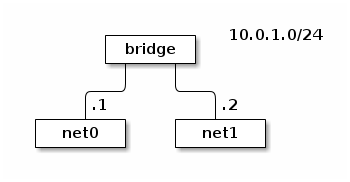

<amp-auto-ads type="adsense" data-ad-client="ca-pub-5216394795966395"></amp-auto-ads>

# 实现宿主机网卡添加到Docker容器

1. 添加弹性网卡到宿主机
2. 准备虚拟化网络环境。这里不需要新建的netns（ip netns add netfoo1），而是直接在/var/run/netns下创建软连接，指向运行中的docker容器的netns。

<!-- more -->

```bash
mkdir -p /var/run/netns
NS_PID=$(docker inspect -f '{{.State.Pid}}' ${CONTAINER_NAME})
ln -s /proc/${NS_PID}/ns/net /var/run/netns/${NS_PID}
```

3. 添加虚拟网卡。这里不需要新建veth pair（ip link add vethfoo1 type veth peer name vethfoo2），而是直接将宿主机上附加的第二块虚拟网卡eth1改名为d-eth0，添加到前面的虚拟网络环境中（/var/run/netns/下的${NS_PID}）。

```bash
ip link set dev eth1 name eth1@eni netns ${NS_PID}
```

1. 最后，启用虚拟网络环境中新添加的虚拟网卡，并重新设置好添加到容器前的IP和网关。

```bash
ip netns exec ${NS_PID} ip link set dev eth1@eni up
ip netns exec ${NS_PID} ip addr add ${CONTAINER_IP}/24 dev eth1@eni
ip netns exec ${NS_PID} route add -net 0.0.0.0/0 gw ${CONTAINER_GATEWAY}

### 或者
ip netns exec ${NS_PID} dhclient eth1@eni
```

## namespace

namespace是一个独立的网络协议栈，通过namespace，可以将网络设备分隔开，设置独立的路由规则、防火墙规则等。

一个设备只能属于一个namespace。

```bash
man ip-netns
```

可以通过ip netns [NAMESPACE] [CMD...] 在指定的namespace中操作，例如：

//查看名为AAA的ns中的网络设备

```bash
ip netns AAA ip link
```

## 基本操作

创建ns1:

```bash
ip netns add ns1
```

查看ns1中的设备:

```bash
ip netns exec ns1 ip link
1: lo: <LOOPBACK> mtu 65536 qdisc noop state DOWN mode DEFAULT qlen 1
    link/loopback 00:00:00:00:00:00 brd 00:00:00:00:00:00
```

将网卡eth1添加到ns1中:

```bash
$ip link set eth1 netns ns1
```

```bash
$ip netns exec ns1 ip link
1: lo: <LOOPBACK> mtu 65536 qdisc noop state DOWN mode DEFAULT qlen 1
    link/loopback 00:00:00:00:00:00 brd 00:00:00:00:00:00
3: eth1: <BROADCAST,MULTICAST> mtu 1500 qdisc noop state DOWN mode DEFAULT qlen 1000
    link/ether 08:00:27:b3:6c:38 brd ff:ff:ff:ff:ff:ff
```

将网卡eth1重新添加到默认的ns中:

```bash
ip netns exec ns1 ip link set eth1 netns 1
```

注意必须在ns1中设置，最后一个1表示，进程1所在的namespace。

删除netns：

```bash
ip netns delete ns1
```

[linux网络虚拟化][3]中给出了一个利用veth连接两个namespace的例子。

## 利用veth连接两个namespace

```bash

ip netns add net0
ip netns add net1
ip link add type veth

ip link set veth0 netns net0
ip link set veth1 netns net1

ip netns exec net0 ip link set veth0 up
ip netns exec net0 ip address add 10.0.1.1/24 dev veth0

ip netns exec net1 ip link set veth1 up
ip netns exec net1 ip address add 10.0.1.2/24 dev veth1

ip netns exec net1 ping 10.0.1.1
PING 10.0.1.1 (10.0.1.1) 56(84) bytes of data.
64 bytes from 10.0.1.1: icmp_seq=1 ttl=64 time=0.036 ms
64 bytes from 10.0.1.1: icmp_seq=2 ttl=64 time=0.066 ms
```

## 两个namespace连接到bridge



创建三个ns，并利用veth连接:

```bash
ip netns add net0
ip netns add net1
ip netns add bridge
ip link add type veth
ip link set dev veth0 name net0-bridge netns net0       //重新命名
ip link set dev veth1 name bridge-net0 netns bridge
ip link add type veth
ip link set dev veth0 name net1-bridge netns net1
ip link set dev veth1 name bridge-net1 netns bridge
```

配置bridge，将另外两个ns的对端veth设备接入bridge:

```bash
ip netns exec bridge brctl addbr br
ip netns exec bridge ip link set dev br up
ip netns exec bridge ip link set dev bridge-net0 up
ip netns exec bridge ip link set dev bridge-net1 up
ip netns exec bridge brctl addif br bridge-net0
ip netns exec bridge brctl addif br bridge-net1
```

配置两个ns中的veth设备:

```bash
ip netns exec net0 ip link set dev net0-bridge up
ip netns exec net0 ip address add 10.0.1.1/24 dev net0-bridge

ip netns exec net1 ip link set dev net1-bridge up
ip netns exec net1 ip address add 10.0.1.2/24 dev net1-bridge
```

## 配置lldpd检查线路链接情况

随着虚拟网络环境增加，环境中网卡数量也在不断增加，经常会忘记环境中哪些网卡连接到哪里，通过 lldp [2] 协议，我们可以清楚看到每个网卡连接到了哪些环境中的哪个网卡。

github 上有一个 lldp 在 linux 下的开源实现 [3]，通过在每个环境中起一个 lldp daemon，我们就可以实时查看每个网卡的连接情况

Bridge 上 lldp 的数据

```bash
$ lldpcli show neighbors

LLDP neighbors:

Interface:    bridge-net0, via: LLDP, RID: 2, Time: 0 day, 00:06:53
  Chassis:
    ChassisID:    mac 82:be:2a:ec:70:69
    SysName:      localhost
    SysDescr:     net0
    Capability:   Bridge, off
    Capability:   Router, off
    Capability:   Wlan, off
  Port:
    PortID:       mac 82:be:2a:ec:70:69
    PortDescr:    net0-bridge

Interface:    bridge-net1, via: LLDP, RID: 1, Time: 0 day, 00:06:53
  Chassis:
    ChassisID:    mac b2:34:28:b1:be:49
    SysName:      localhost
    SysDescr:     net1
    Capability:   Bridge, off
    Capability:   Router, off
    Capability:   Wlan, off
  Port:
    PortID:       mac b2:34:28:b1:be:49
    PortDescr:    net1-bridge
```