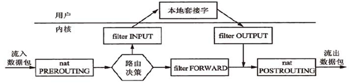
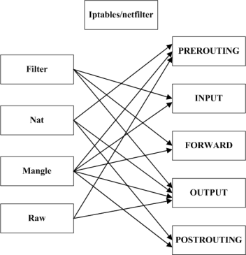
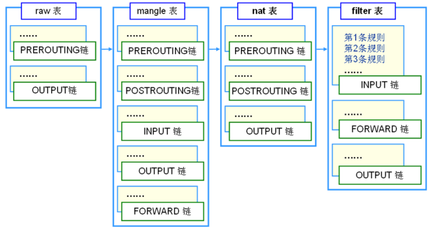
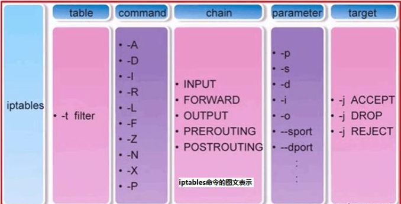
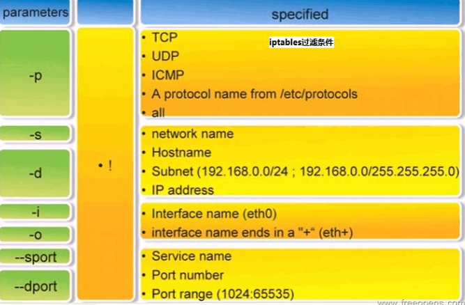
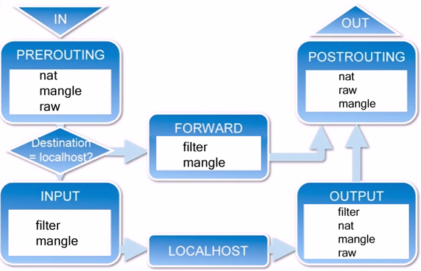
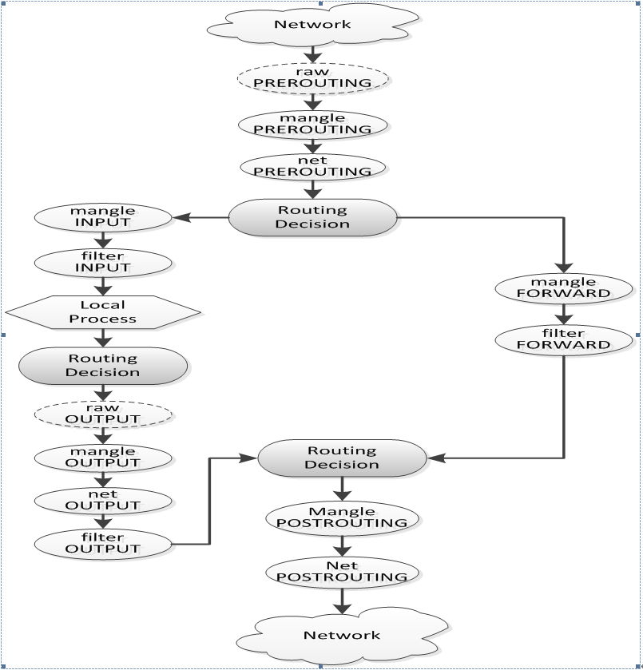

# iptables简介

netfilter/iptables IP 信息包过滤系统是一种功能强大的工具，可用于添加、编辑和除去规则，这些规则是在做信息包过滤决定时，防火墙所遵循和组成的规则。这些规则存储在专用的信息包过滤表中，而这些表集成在 Linux 内核中。在信息包过滤表中，规则被分组放在我们所谓的链（chain）中。

<!-- more -->

虽然 netfilter/iptables IP 信息包过滤系统被称为单个实体，但它实际上由两个组件 netfilter 和 iptables 组成。

netfilter 组件也称为内核空间（kernelspace），是内核的一部分，由一些信息包过滤表组成，这些表包含内核用来控制信息包过滤处理的规则集。

iptables 组件是一种工具，也称为用户空间（userspace），它使插入、修改和除去信息包过滤表中的规则变得容易。

iptables包含4个表，5个链。其中表是按照对数据包的操作区分的，链是按照不同的Hook点来区分的，表和链实际上是netfilter的两个维度。

4个表:filter,nat,mangle,raw，默认表是filter（没有指定表的时候就是filter表）。表的处理优先级：raw>mangle>nat>filter。

filter：一般的过滤功能

nat:用于nat功能（端口映射，地址映射等）

mangle:用于对特定数据包的修改

raw:有限级最高，设置raw时一般是为了不再让iptables做数据包的链接跟踪处理，提高性能

5个链：PREROUTING,INPUT,FORWARD,OUTPUT,POSTROUTING。

PREROUTING:数据包进入路由表之前

INPUT:通过路由表后目的地为本机

FORWARDING:通过路由表后，目的地不为本机

OUTPUT:由本机产生，向外转发

POSTROUTIONG:发送到网卡接口之前。如下图：


iptables中表和链的对应关系如下：



## 例子介绍

```sh
KUBE-NODE-PORT  all  --  *      *       0.0.0.0/0            0.0.0.0/0            ADDRTYPE match dst-type LOCAL
```

```sh
iptables -m addrtype -h
Address type match options:
 [!] --src-type type[,...]      Match source address type
 [!] --dst-type type[,...]      Match destination address type
     --limit-iface-in           Match only on the packet's incoming device
     --limit-iface-out          Match only on the packet's outgoing device

Valid types:           
                                UNSPEC
                                UNICAST
                                LOCAL
                                BROADCAST
                                ANYCAST
                                MULTICAST
                                BLACKHOLE
                                UNREACHABLE
                                PROHIBIT
                                THROW
                                NAT
                                XRESOLVE

```

网络地址类型介绍：
```sh
Route types:

      unicast - the route entry describes real paths to the destinations covered by the route prefix.

      unreachable  - these destinations are unreachable.  Packets are discarded and the ICMP message host unreachable is generated.
               The local senders get an EHOSTUNREACH error.

      blackhole - these destinations are unreachable.  Packets are discarded silently.  The local senders get an EINVAL error.

      prohibit - these destinations are unreachable.  Packets are discarded and the  ICMP  message  communication  administratively
               prohibited is generated.  The local senders get an EACCES error.

      local - the destinations are assigned to this host.  The packets are looped back and delivered locally.

      broadcast - the destinations are broadcast addresses.  The packets are sent as link broadcasts.

      throw  - a special control route used together with policy rules. If such a route is selected, lookup in this table is termi‐
               nated pretending that no route was found.  Without policy routing it is equivalent to the absence of the route in the routing
               table.   The  packets  are  dropped  and the ICMP message net unreachable is generated.  The local senders get an ENETUNREACH
               error.

      nat - a special NAT route.  Destinations covered by the prefix are considered to  be  dummy  (or  external)  addresses  which
               require  translation  to  real  (or  internal)  ones  before forwarding.  The addresses to translate to are selected with the
               attribute Warning: Route NAT is no longer supported in Linux 2.6.

               via.

      anycast - not implemented the destinations are anycast addresses assigned to this host.  They are mainly equivalent to  local
               with one difference: such addresses are invalid when used as the source address of any packet.

      multicast - a special type used for multicast routing.  It is not present in normal routing tables.
```

# iptables规则链执行顺序

iptables 是采用规则堆栈的方式来进行过滤，当一个封包进入网卡，会先检查 Prerouting，然后检查目的 IP 判断是否需要转送出去，接着就会跳到 INPUT 或 Forward 进行过滤，如果封包需转送处理则检查 Postrouting，如果是来自本机封包，则检查 OUTPUT 以及 Postrouting。过程中如果符合某条规则将会进行处理，处理动作除了 ACCEPT、REJECT、DROP、REDIRECT 和 MASQUERADE 以外，还多出 LOG、ULOG、DNAT、SNAT、MIRROR、QUEUE、RETURN、TOS、TTL、MARK 等，其中某些处理动作不会中断过滤程序，某些处理动作则会中断同一规则炼的过滤，并依照前述流程继续进行下一个规则炼的过滤（注意：这一点与 ipchains 不同），一直到堆栈中的规则检查完毕为止。透过这种机制所带来的好处是，我们可以进行复杂、多重的封包过滤，简单的说，iptables 可以进行纵横交错式的过滤（tables）而非炼状过滤（chains）。

>1. ACCEPT 将封包放行，进行完此处理动作后，将不再比对其它规则，直接跳往下一个规则炼（nat:postrouting）。 

>2. REJECT 拦阻该封包，并传送封包通知对方，可以传送的封包有几个选择：ICMP port-unreachable、ICMP echo-reply 或是 tcp-reset（这个封包会要求对方关闭联机），进行完此处理动作后，将不再比对其它规则，直接 中断过滤程序。 范例如下：
iptables -A FORWARD -p TCP --dport 22 -j REJECT --reject-with tcp-reset 

>3. DROP 丢弃封包不予处理，进行完此处理动作后，将不再比对其它规则，直接中断过滤程序。 

>4. REDIRECT 将封包重新导向到另一个端口（PNAT），进行完此处理动作后，将 会继续比对其它规则。 这个功能可以用来实作通透式 porxy 或用来保护 web 服务器。例如：iptables -t nat -A PREROUTING -p tcp --dport 80 -j REDIRECT --to-ports 8080 

>5. MASQUERADE 改写封包来源 IP 为防火墙 NIC IP，可以指定 port 对应的范围，进行完此处理动作后，直接跳往下一个规则炼（mangle:postrouting）。这个功能与 SNAT 略有不同，当进行 IP 伪装时，不需指定要伪装成哪个 IP，IP 会从网卡直接读取，当使用拨接连线时，IP 通常是由 ISP 公司的 DHCP 服务器指派的，这个时候 MASQUERADE 特别有用。范例如下：　 
　iptables -t nat -A POSTROUTING -p TCP -j MASQUERADE --to-ports 1024-31000

>6. LOG 将封包相关讯息纪录在 /var/log 中，详细位置请查阅 /etc/syslog.conf 组态档，进行完此处理动作后，将会继续比对其它规则。例如： 
　　iptables -A INPUT -p tcp -j LOG --log-prefix "INPUT packets"

>7. SNAT 改写封包来源 IP 为某特定 IP 或 IP 范围，可以指定 port 对应的范围，进行完此处理动作后，将直接跳往下一个规则炼（mangle:postrouting）。范例如下： 
　　iptables -t nat -A POSTROUTING -p tcp-o eth0 -j SNAT --to-source 194.236.50.155-194.236.50.160:1024-32000

>8. DNAT 改写封包目的地 IP 为某特定 IP 或 IP 范围，可以指定 port 对应的范围，进行完此处理动作后，将会直接跳往下一个规则炼（filter:input 或 filter:forward）。范例如下： 
　　iptables -t nat -A PREROUTING -p tcp -d 15.45.23.67 --dport 80 -j DNAT --to-destination 192.168.1.1-192.168.1.10:80-100

>9. MIRROR 镜射封包，也就是将来源 IP 与目的地 IP 对调后，将封包送回，进行完此处理动作后，将会中断过滤程序。 

>10. QUEUE 中断过滤程序，将封包放入队列，交给其它程序处理。透过自行开发的处理程序，可以进行其它应用，例如：计算联机费用.......等。 

>11. RETURN 结束在目前规则炼中的过滤程序，返回主规则炼继续过滤，如果把自订规则炼看成是一个子程序，那么这个动作，就相当于提早结束子程序并返回到主程序中。 

>12. MARK 将封包标上某个代号，以便提供作为后续过滤的条件判断依据，进行完此处理动作后，将会继续比对其它规则。范例如下： 
　　iptables -t mangle -A PREROUTING -p tcp --dport 22 -j MARK --set-mark 2

# 小结
iptables执行规则时，是从从规则表中从上至下顺序执行的，如果没遇到匹配的规则，就一条一条往下执行，如果遇到匹配的规则后，那么就执行本规则，执行后根据本规则的动作(accept, reject, log等)，决定下一步执行的情况，后续执行一般有三种情况。
1。一种是继续执行当前规则队列内的下一条规则。比如执行过Filter队列内的LOG后，还会执行Filter队列内的下一条规则。
2。一种是中止当前规则队列的执行，转到下一条规则队列。比如从执行过accept后就中断Filter队列内其它规则，跳到nat队列规则去执行
3。一种是中止所有规则队列的执行。

# Iptables 规则用法小结

iptables是组成Linux平台下的包过滤防火墙，与大多数的Linux软件一样，这个包过滤防火墙是免费的，它可以代替昂贵的商业防火墙解决方案，完成封包过滤、封包重定向和网络地址转换(NAT)等功能。在日常Linux运维工作中，经常会设置iptables防火墙规则，用来加固服务安全。以下对iptables的规则使用做了总结性梳理：


## iptables首先需要了解的：
### 规则概念

规则（rules）其实就是网络管理员预定义的条件，规则一般的定义为“如果数据包头符合这样的条件，就这样处理这个数据包”。规则存储在内核空间的信息 包过滤表中，这些规则分别指定了源地址、目的地址、传输协议（如TCP、UDP、ICMP）和服务类型（如HTTP、FTP和SMTP）等。
当数据包与规则匹配时，iptables就根据规则所定义的方法来处理这些数据包，如放行(accept),拒绝(reject)和丢弃(drop)等。配置防火墙的主要工作是添加,修改和删除等规则。
其中：
匹配（match）：符合指定的条件，比如指定的 IP 地址和端口。
丢弃（drop）：当一个包到达时，简单地丢弃，不做其它任何处理。
接受（accept）：和丢弃相反，接受这个包，让这个包通过。
拒绝（reject）：和丢弃相似，但它还会向发送这个包的源主机发送错误消息。这个错误消息可以指定，也可以自动产生。
目标（target）：指定的动作，说明如何处理一个包，比如：丢弃，接受，或拒绝。
跳转（jump）：和目标类似，不过它指定的不是一个具体的动作，而是另一个链，表示要跳转到那个链上。
规则（rule）：一个或多个匹配及其对应的目标。

### iptables和netfilter的关系：
Iptables和netfilter的关系是一个很容易让人搞不清的问题。很多的知道iptables却不知道 netfilter。其实iptables只是Linux防火墙的管理工具而已，位于/sbin/iptables。真正实现防火墙功能的是 netfilter，它是Linux内核中实现包过滤的内部结构。

### iptables的规则表和链

表（tables）：提供特定的功能，iptables内置了4个表，即filter表、nat表、mangle表和raw表，分别用于实现包过滤，网络地址转换、包重构(修改)和数据跟踪处理。
链（chains）：是数据包传播的路径，每一条链其实就是众多规则中的一个检查清单，每一条链中可以有一 条或数条规则。当一个数据包到达一个链时，iptables就会从链中第一条规则开始检查，看该数据包是否满足规则所定义的条件。如果满足，系统就会根据 该条规则所定义的方法处理该数据包；否则iptables将继续检查下一条规则，如果该数据包不符合链中任一条规则，iptables就会根据该链预先定 义的默认策略来处理数据包。

Iptables采用“表”和“链”的分层结构，在Linux中现在是四张表五个链。下面罗列一下这四张表和五个链（注意一定要明白这些表和链的关系及作用）。


### 规则表：

1）filter表——三个链：INPUT、FORWARD、OUTPUT
作用：过滤数据包 内核模块：iptables_filter.
2）Nat表——三个链：PREROUTING、POSTROUTING、OUTPUT
作用：用于网络地址转换（IP、端口） 内核模块：iptable_nat
3）Mangle表——五个链：PREROUTING、POSTROUTING、INPUT、OUTPUT、FORWARD
作用：修改数据包的服务类型、TTL、并且可以配置路由实现QOS内核模块：iptable_mangle(别看这个表这么麻烦，咱们设置策略时几乎都不会用到它)
4）Raw表——两个链：OUTPUT、PREROUTING
作用：决定数据包是否被状态跟踪机制处理 内核模块：iptable_raw

### 规则链：
   1）INPUT——进来的数据包应用此规则链中的策略
   2）OUTPUT——外出的数据包应用此规则链中的策略
   3）FORWARD——转发数据包时应用此规则链中的策略
   4）PREROUTING——对数据包作路由选择前应用此链中的规则
（记住！所有的数据包进来的时侯都先由这个链处理）
   5）POSTROUTING——对数据包作路由选择后应用此链中的规则
（所有的数据包出来的时侯都先由这个链处理）

管理和设置iptables规则：




### iptables传输数据包的过程



   1）当一个数据包进入网卡时，它首先进入PREROUTING链，内核根据数据包目的IP判断是否需要转送出去。
   2）如果数据包就是进入本机的，它就会沿着图向下移动，到达INPUT链。数据包到了INPUT链后，任何进程都会收到它。本机上运行的程序可以发送数据包，这些数据包会经过OUTPUT链，然后到达POSTROUTING链输出。
   3）如果数据包是要转发出去的，且内核允许转发，数据包就会如图所示向右移动，经过FORWARD链，然后到达POSTROUTING链输出。

如果还是不清楚数据包经过iptables的基本流程，再看下面更具体的流程图：



从图中可将iptables数据包报文的处理过程分为三种类型：
1）目的为本机的报文
报文以本机为目的地址时，其经过iptables的过程为：
1.数据包从network到网卡
2.网卡接收到数据包后，进入raw表的PREROUTING链。这个链的作用是在连接跟踪之前处理报文，能够设置一条连接不被连接跟踪处理。(注：不要在raw表上添加其他规则)
3.如果设置了连接跟踪，则在这条连接上处理。
4.经过raw处理后，进入mangle表的PREROUTING链。这个链主要是用来修改报文的TOS、TTL以及给报文设置特殊的MARK。(注：通常mangle表以给报文设置MARK为主，在这个表里面，千万不要做过滤/NAT/伪装这类的事情)
5.进入nat表的PREROUTING链。这个链主要用来处理 DNAT，应该避免在这条链里面做过滤，否则可能造成有些报文会漏掉。(注：它只用来完成源/目的地址的转换)
6.进入路由决定数据包的处理。例如决定报文是上本机还是转发或者其他地方。(注：此处假设报文交给本机处理)
7.进入mangle表的 INPUT 链。在把报文实际送给本机前，路由之后，我们可以再次修改报文。
8.进入filter表的 INPUT 链。在这儿我们对所有送往本机的报文进行过滤，要注意所有收到的并且目的地址为本机的报文都会经过这个链，而不管哪个接口进来的或者它往哪儿去。
9. 进过规则过滤，报文交由本地进程或者应用程序处理，例如服务器或者客户端程序。
2）本地主机发出报文
数据包由本机发出时，其经过iptables的过程为：
1.本地进程或者应用程序（例如服务器或者客户端程序）发出数据包。
2.路由选择，用哪个源地址以及从哪个接口上出去，当然还有其他一些必要的信息。
3.进入raw表的OUTPUT链。这里是能够在连接跟踪生效前处理报文的点，在这可以标记某个连接不被连接跟踪处理。
4.连接跟踪对本地的数据包进行处理。
5.进入 mangle 表的 OUTPUT 链，在这里我们可以修改数据包，但不要做过滤(以避免副作用)。
6.进入 nat 表的 OUTPUT 链，可以对防火墙自己发出的数据做目的NAT(DNAT) 。
7.进入 filter 表的 OUTPUT 链，可以对本地出去的数据包进行过滤。
8.再次进行路由决定，因为前面的 mangle 和 nat 表可能修改了报文的路由信息。
9.进入 mangle 表的 POSTROUTING 链。这条链可能被两种报文遍历，一种是转发的报文，另外就是本机产生的报文。
10.进入 nat 表的 POSTROUTING 链。在这我们做源 NAT（SNAT），建议你不要在这做报文过滤，因为有副作用。即使你设置了默认策略，一些报文也有可能溜过去。
11.进入出去的网络接口。
3）转发报文
报文经过iptables进入转发的过程为：
1.数据包从network到网卡
2.网卡接收到数据包后，进入raw表的PREROUTING链。这个链的作用是在连接跟踪之前处理报文，能够设置一条连接不被连接跟踪处理。(注：不要在raw表上添加其他规则)
3.如果设置了连接跟踪，则在这条连接上处理。
4.经过raw处理后，进入mangle表的PREROUTING链。这个链主要是用来修改报文的TOS、TTL以及给报文设置特殊的MARK。(注：通常mangle表以给报文设置MARK为主，在这个表里面，千万不要做过滤/NAT/伪装这类的事情)
5.进入nat表的PREROUTING链。这个链主要用来处理 DNAT，应该避免在这条链里面做过滤，否则可能造成有些报文会漏掉。(注：它只用来完成源/目的地址的转换)
6.进入路由决定数据包的处理。例如决定报文是上本机还是转发或者其他地方。(注：此处假设报文进行转发)
7.进入 mangle 表的 FORWARD 链，这里也比较特殊，这是在第一次路由决定之后，在进行最后的路由决定之前，我们仍然可以对数据包进行某些修改。
8.进入 filter 表的 FORWARD 链，在这里我们可以对所有转发的数据包进行过滤。需要注意的是：经过这里的数据包是转发的，方向是双向的。
9.进入 mangle 表的 POSTROUTING 链，到这里已经做完了所有的路由决定，但数据包仍然在本地主机，我们还可以进行某些修改。
10.进入 nat 表的 POSTROUTING 链，在这里一般都是用来做 SNAT ，不要在这里进行过滤。
11.进入出去的网络接口。