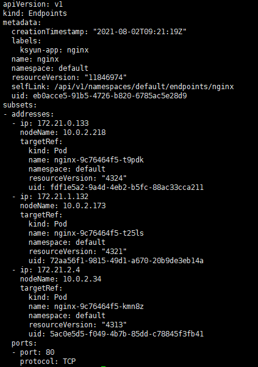
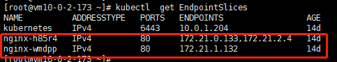
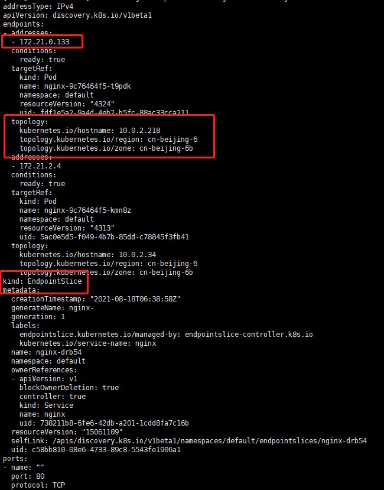
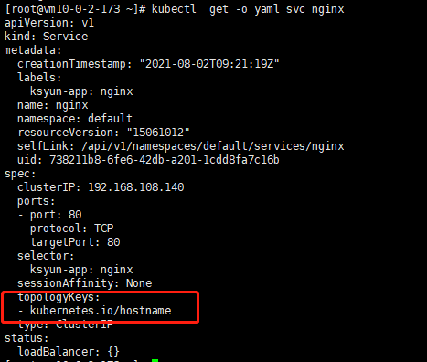
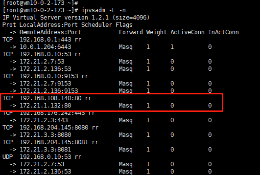
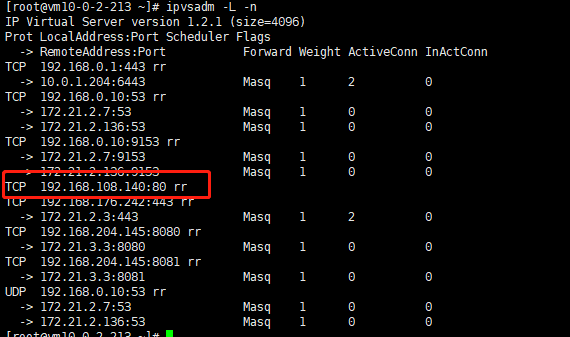

开启拓扑感知服务路由特性需同时启动ServiceTopology=true和EndpointSlice=true的FeatureGate

# EndpointSlices简介

FEATURE STATE: Kubernetes v1.17 [beta]

EndpointSlices提供了一种简单的方法来跟踪Kubernetes集群中的网络Endpoints。 它们为Endpoints提供了更可扩展和可扩展的替代方案。 Endpoints API提供了一种简单而直接的方式来跟踪Kubernetes中的网络Endpoints。 不幸的是，随着Kubernetes集群和服务能够处理更多流量并将其发送到更多后端Pod，该原始API的局限性变得更加明显。 最值得注意的是，这些挑战包括扩展到更多网络Endpoints的挑战。 由于服务的所有网络Endpoints都存储在单个Endpoints资源中，因此这些资源可能会变得很大。 这影响了Kubernetes组件（尤其是主控制平面）的性能，并在Endpoints更改时导致大量网络流量和处理。 EndpointSlices可帮助您减轻这些问题，并为诸如拓扑路由之类的其他功能提供可扩展的平台。
<!-- more -->

## EndpointSlice resources

在Kubernetes中，EndpointSlice包含对一组网络Endpoints的引用。 控制平面会为指定了选择器的任何Kubernetes服务自动创建EndpointSlices。 这些EndpointSlice包含对与服务选择器匹配的所有Pod的引用。 EndpointSlices通过协议，端口号和服务名称的唯一组合将网络Endpoints组合在一起。 EndpointSlice对象的名称必须是有效的DNS子域名。

作为示例，这是示例Kubernetes服务的示例EndpointSlice资源。

```yaml

apiVersion: discovery.k8s.io/v1beta1
kind: EndpointSlice
metadata:
  name: example-abc
  labels:
    kubernetes.io/service-name: example
addressType: IPv4
ports:
  - name: http
    protocol: TCP
    port: 80
endpoints:
  - addresses:
      - "10.1.2.3"
    conditions:
      ready: true
    hostname: 172.16.1.17
    topology:
      kubernetes.io/hostname: 172.16.1.17
      topology.kubernetes.io/zone: cn-beijing-6
```

默认情况下，控制平面创建和管理EndpointSlices的每个Endpoints不超过100个。 您可以使用--max-endpoints-per-slice kube-controller-manager标志对其进行配置，最大为1000。

当涉及如何路由内部流量时，EndpointSlices可以充当kube-proxy的真实来源。 启用后，它们应为具有大量Endpoints的服务提供性能改进。

## Address types

EndpointSlice支持三种地址类型：

>1. IPv4
>2. IPv6
>3. FQDN

## Topology information
EndpointSlice中的每个Endpoints都可以包含相关的拓扑信息。 这用于指示Endpoints在哪里，其中包含有关相应Node，zon和region的信息。 当设置了这种值时，控制平面为EndpointSlices设置以下拓扑标签：

>1. kubernetes.io/hostname - endpoint所在Node的名称
>2. topology.kubernetes.io/zone - endpoints所在的zone
>3. topology.kubernetes.io/region - endpoints所在的region

这些标签的值源自与片中每个Endpoints关联的资源。 Node名标签表示相应Pod上NodeName字段的值。 zone标签和region标签代表相应节点上具有相同名称的标签值。

## Management

通常控制平面（特别是EndpointsSlice控制器）创建和管理EndpointSlice对象。 EndpointSlices还有许多其他用例，例如服务网格实现，可能导致其他实体或控制器管理其他EndpointSlices。

为了确保多个实体可以管理EndpointSlices而不互相干扰，Kubernetes定义了标签endpointslice.kubernetes.io/managed-by， 该标签指示管理EndpointSlice的实体。 EndpointsSlice控制器在其管理的所有EndpointSlice上将此标签的值设置为endpointslice.kubernetes.io/managed-by: endpointslice-controller.k8s.io 其他管理EndpointSlices的实体也应为此标签设置唯一值。

## Ownership

在大多数使用情况下，EndpointSlices由endpoint slice对象跟踪其endpoints的服务拥有。 该所有权由每个EndpointSlice上的所有者引用以及kubernetes.io/service-name标签指示，该标签可对属于Service的所有EndpointSlice进行简单查找。

## EndpointSlice mirroring

在某些情况下，应用程序会创建自定义的Endpoints资源。 为了确保这些应用程序不需要同时写入Endpoints和EndpointSlice资源，集群的控制平面将大多数Endpoints资源镜像到相应的EndpointSlices。

控制平面镜像的Endpoints资源，除非：

>1. Endpoints资源的endpointslice.kubernetes.io/skip-mirror标签设置为true。
>2. Endpoints资源具有control-plane.alpha.kubernetes.io/leader annotation。
>3. 相应的Service资源不存在。
>4. 相应的Service资源具有非空selector。

如果Endpoints资源具有多个subnet或包含具有多个IP栈（IPv4和IPv6）的endpoints，则会发生各个Endpoints资源可能会转换为多个EndpointSlice。 每个subnet最多1000个地址将镜像到EndpointSlices。

## Distribution of EndpointSlices

每个EndpointSlice都有一组端口，适用于资源内的所有endpoints。 如果将命名端口用于服务，则Pod可能会为同一命名端口以不同的目标端口号结尾，从而需要不同的EndpointSlice。 这类似于subnets与Endpoints进行分组的背后逻辑。

控制平面尝试将EndpointSlices尽可能填满，但不会主动重新平衡它们。逻辑非常简单：

>1. 遍历现有的EndpointSlice，删除不再需要的endpoints，并更新已更改的匹配endpoints。
>2. 遍历上面一个步骤中已修改的EndpointSlice，并用所需的任何新endpoints填充它们。
>3. 如果还有新的endpoints要添加，请尝试将它们放入以前未更改的slice中或创建新的EndpointSlice。

重要的是，上面第三个步骤倾向于限制EndpointSlice更新，而不是完全分发EndpointSlices。 例如，如果要添加10个新endpoints，并有2个EndpointSlices，每个EndpointSlices可以容纳5个endpoints，则此方法将创建一个新EndpointSlice，而不是填充2个现有EndpointSlices。 换句话说，单个EndpointSlice创建优于多个EndpointSlice更新。

通过在每个节点上运行kube-proxy并Watch EndpointSlices，对EndpointSlice的每次更改都会变得相对开销很大，因为它将被传输到集群中的每个Node。 所以上述的这种方式旨在限制需要发送到每个节点的更改的数量，即使它可能导致多个EndpointSlices未满。

实际上，这种不理想的分布应该很少见。 EndpointSlice控制器处理的大多数更改都将足够小以适应现有的EndpointSlice，如果不是，则无论如何很快都将有必要使用新的EndpointSlice。 滚动式Deployment更新还提供了EndpointSlices的自然包装，其中所有Pod及其对应的endpoints均被替换

Duplicate endpoints

由于EndpointSlice更改的性质，endpoints可能会同时在多个EndpointSlice中表示。 由于Kubernetes客户端watch/cache可以在不同的时刻对不同EndpointSlice对象进行更改，因此自然会发生这种情况。 使用EndpointSlice的实现必须能够使endpoint出现在多个slice中。 在kube-proxy的EndpointSliceCache实现中可以找到有关如何执行endpoint去重的参考实现。

# Service Topology简介

服务拓扑使服务能够基于群集的节点拓扑来路由流量。 例如，服务可以指定将流量优先路由到与客户端位于同一节点上或位于同一可用性区域中的端点。

默认情况下，发送到ClusterIP或NodePort服务的流量可以路由到该服务的任何后端地址。从Kubernetes 1.7开始，可以将“外部”流量路由到在接收流量的节点上运行的Pod，但是ClusterIP Services不支持此功能，并且更复杂的拓扑（如分区路由）是不可能的。服务拓扑功能通过允许服务创建者基于源节点和目标节点的节点标签定义用于路由流量的策略来解决此问题。

通过使用源和目的地之间的节点标签匹配，操作员可以使用对那个操作员的要求有意义的任何度量来指定彼此“更近”和“更远”的一组节点。 例如，对于公共云中的许多运营商而言，倾向于将服务流量保持在同一区域内，因为区域间流量具有与其相关的成本，而区域内流量则没有。 其他常见需求包括能够将流量路由到由DaemonSet管理的本地Pod，或将流量保持到连接到同一机架顶部交换机的节点，以实现最低延迟。

## 使用Service Topology

如果您的集群启用了服务拓扑，则可以通过在服务规范上指定topologyKeys字段来控制服务流量路由。该字段是节点标签的优先顺序列表，将在访问此服务时用于对端点进行排序。流量将被定向到其第一个标签的值与该标签的始发节点的值匹配的节点。如果在匹配的节点上没有该服务的后端，则将考虑第二个标签，依此类推，直到没有标签剩余为止。

如果找不到匹配项，则流量将被拒绝，就像该服务根本没有后端一样。即，基于具有可用后端的第一个拓扑密钥选择端点。如果指定了此字段，并且所有条目都没有与客户端拓扑匹配的后端，则该服务没有该客户端的后端，因此连接将失败。特殊值“ *”可用于表示“任何拓扑”。如果使用此通用值，则仅作为列表中的最后一个值才有意义。

如果没有指定topologyKeys或为空，则不会应用拓扑约束。

考虑一个带有节点的群集，这些节点用其主机名，区域名称和区域名称标记。然后，您可以按如下所示设置服务的topologyKeys值以定向流量。

>1. 仅适用于同一节点上的端点，如果该节点上不存在端点，则失败：[“kubernetes.io/hostname”]。
>2. 优先使用同一节点上的端点，后退到同一区域中的端点，然后是相同区域，否则失败：[“kubernetes.io/hostname”、”topology.kubernetes.io/zone”、”topology.kubernetes.io/region”]。 例如，在数据局部性很关键的情况下，这可能很有用。
>3. 优先使用同一区域，但是如果该区域内没有可用端点，则回退到任何可用端点上：[“topology.kubernetes.io/zone”，”*”]。

# 验证测试

集群所有组件开启--feature-gates=ServiceTopology=true,EndpointSlice=true

创建和查看ep


查看是否生成对应的EndpointSlices

查看信息


设置svc的服务流量路由规则为：kubernetes.io/hostname



查看kube-proxy 生成的对应规则
有端点存在的node节点

无端点存在的node节点



# 未来演进

Kubernetes 1.19: 默认开启使用EndpointSlices 功能
Kubernetes 1.20: 放弃使用topology Keys
Kubernetes 1.21: GA API, Kube-Proxy on Windows uses EndpointSlices by Default
Kubernetes 1.22: Kube-Proxy GA

***注意：弃用topology Keys 后将使用[Topology Aware Hints](https://kubernetes.io/docs/concepts/services-networking/topology-aware-hints/) 自动感知功能代替***