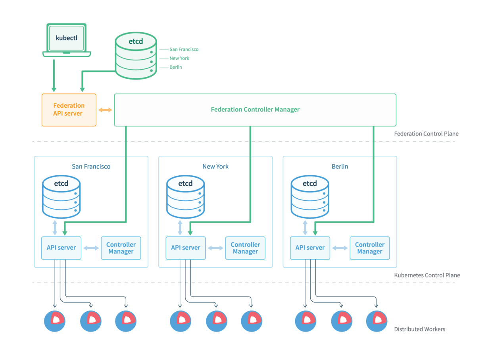
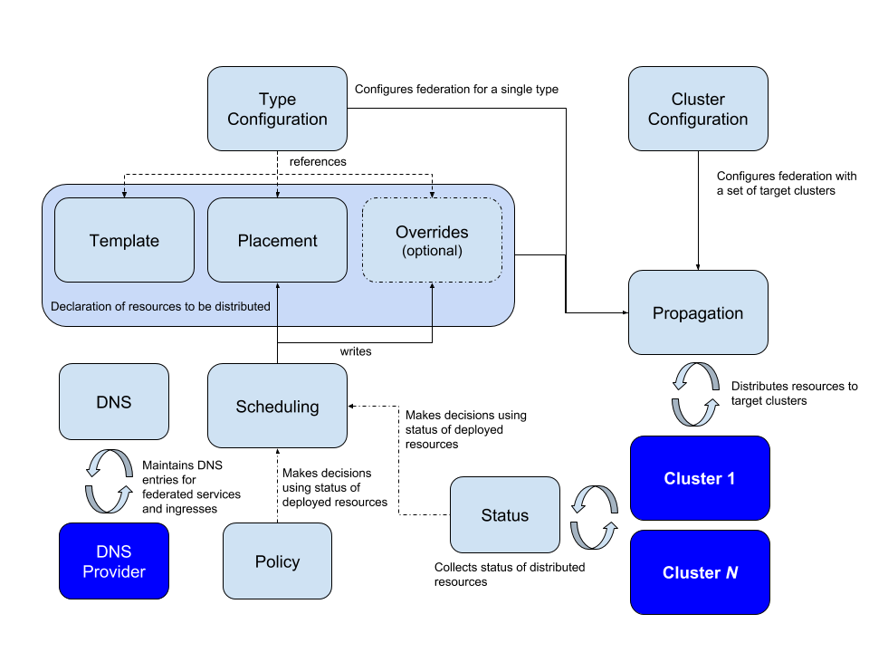

# Federation 概述

Federation(集群联邦)是kubernetes社区中的多云管理项目，可以方便地跨地区跨服务商管理多个Kubernetes集群。其最初在1.3版本中被引入，后从主库迁移到独立repo(v1版本)，由于v1版本存在的若干问题，现已切换到v2版本。v1、v2版本虽然架构有较大差异，但共同目标都是使管理多个集群更为简单，主要实现了以下俩个模型：

跨集群的资源同步与伸缩(Sync and Scale resources across clusters)：提供在多个集群中保持资源同步与伸缩的功能，例如确保一个Deployment可以运行在多个集群中，并根据负载情况在集群间合理伸缩。
跨级群的服务发现(Cross cluster discovery)：提供自动配置DNS服务的功能，实现应用跨集群服务发现的能力，例如在某一集群中可以访问另一集群的应用。

<!-- more -->

## Federation v1

Federation v1的架构跟k8s集群的架构非常类似，整体架构如下：

主要包含四个组件：

>- federation-apiserver：类似kube-apiserver，兼容k8s API，只是对联邦处理的特定资源做了过滤（部分资源联邦不支持，故使用apiserver来过滤）。
>- federation-controller-manager：提供多个集群间资源调度及状态通同步，工作原理类似kube-controller-manager。
>- kubefed：Federation CLI工具，用来将子集群加入到联邦中。
>- etcd：存储federation层面的资源对象，供federation control plane同步状态。

## Federation v2

Federation v2版本在v1的基础上，进一步简练、增强，主要功能仍然是跨地区跨服务商管理多个Kubernetes集群。其通过当下大热的CRD模型定义了独立的API，同时仍通过ControllerManager模型来同步、调度资源，通过kubefed2来将子集群加入联邦。CRD与ControllerManager组成的Control Plane模型（去除了v1中独立APIServer、Etcd），使其可以部署在任意的k8s集群中，同时还可将该集群也join到联邦控制面作为子集群，整体定义模型如下：

Federation v2 采用 CRD 模式运行在 Kubernetes 集群中，扩展了 k8s 的资源管理能力。
首先，它向原有 k8s 集群注册一系列 CRD 资源，这些 CRD 定义了联邦系统所支持的 k8s 资源；然后，它通过开启一个 ControllerManager 来管理这些 CRD 资源，实现跨集群资源调度。
CRD 资源和 ControllerManager 共同构成了 Federation v2 的 Control

### 目前 Federation v2 主要定义了 4 种 CRD 资源：

- Cluster configuration: 主要定义了子集群注册时的配置信息，其中主要引用了Cluster-Registry[3]这个子项目来定义cluster的配置信息。用户只需执行kubefed2 join将安装好的集群加入联邦，federation-controller-manager会自动读取新加入集群的context信息，生成cluster configuration信息，并持久化到etcd中，供后续消费。
- Type configuration: 主要定义了federation可以处理哪些资源对象(在v1版本中靠独立APIServer来过滤)，例如使federation处理deployment，就创建一个deployment type configuration。Type configuration中又包含了三种类型的CRD资源：
    >1. Template：定义了federation要处理的资源对象，含有该对象的全部信息，例如depoyment的template中就直接引用了k8s的deployment。
    >2. Placement：定义要将资源对象运行在哪些子集群中，如不定义该对象，则资源不会运行在任一集群。在v1版本中资源是会默认下发到每一个集群中。
    >3. Override：对于同一资源对象，在不同服务商的集群配置中可能有会有差异。例如deployment对象，其中volume可能不同云厂商实现有所不同，所以需要差异化配置volume字段，Overide就提供了差异化修改template中字段的能力（当前仅支持部分字段，后续会支持全部字段差异化修改)。
- Schedule: 主要定义应用在集群中的调度分布，该类型主要涉及Deployment与Replicaset俩种（该配置在v1中写在对象的annotations中）。用户可以定义对象在每个集群中分布的最多、最少实例数，并且还能在集群中做到应用实例数的均衡分布。值得注意的是，如果调度结果跟用户自定义的override冲突时，该调度算法享有优先权。例如用户override中定义为5个实例，实际调度结果只有3个，那么自定义的override中5个实例将被改为3个。
- MultiClusterDNS: 如字段名，该资源主要在做多集群间的服务发现，其下主要包含ServiceDNSRecord、IngressDNSRecord、DNSEndpoint这几个资源对象。整个工作流程为：
    >1. 用户首先创建Service资源，需要创建Service Template、Placement、Override（可选）三个对象，使Service分布到各子集群。
    >2. 创建ServiceDNSRecord/IngressDNSRecord资源，federation-controller会根据该资源的配置，收集各子集群对应的service信息，最后生成由域名与IP组合而成的DNSEndpoint资源并持久化到etcd中。
    >3. 将federation-controller创建的DNSEndpoint资源中的域名与IP自动配置到DNS服务商的服务器上，可通过external-dns项目自动配置。
- 这样，就可以实现不同集群中应用的服务发现，其实质是将各集群服务的IP与对应域名配置到公网的DNS服务器上，以通过公网域名实现跨集群服务发现。

# 总结

Federation v2中的CRD配置复杂，但是能够根据负载情况，调度并调节各集群的资源分布，同时能够提供跨集群的应用故障转移，以及跨集群的服务发现。实现了方便的跨地区、跨服务商配置并管理多个k8s集群，以及多集群资源的统一管理