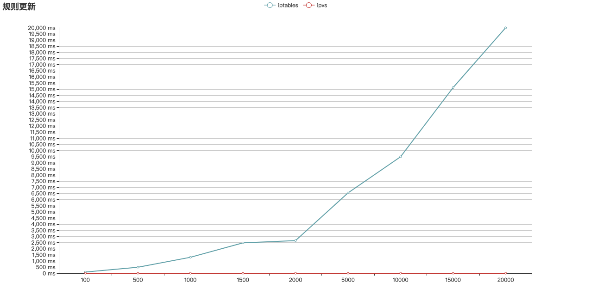
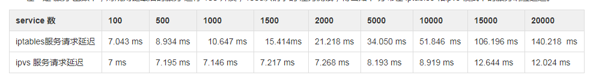
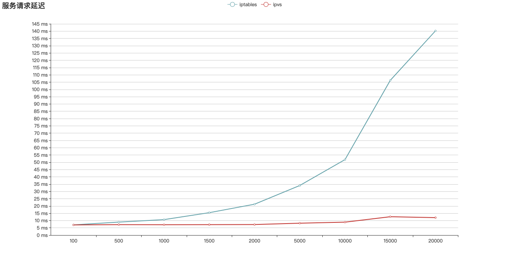
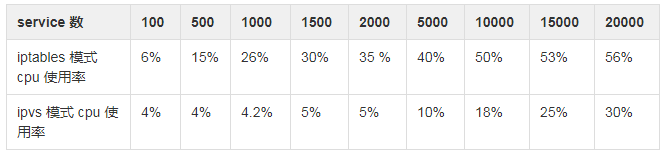
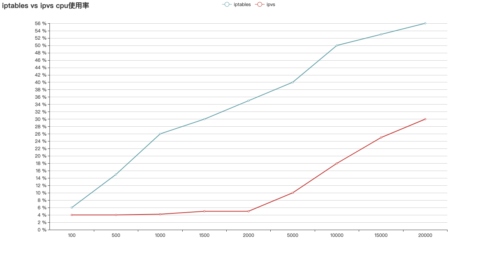

## 对比 iptables 和 ipvs 的性能差异

测试环境规格：

    master：32C64G
    node: 500个, 规格：2C4G

<!-- more -->

## iptables vs  ipvs 规则增加延迟

|service 数|1|100|500|1000|1500|2000|5000|10000|15000|20000|
|---|---|---|---|---|---|---|---|---|---|---|
|rule 数|4|400|2000|4000|6000|8000|10000|40000|60000|80000|
|增加一条 iptables 规则|77 ms|100 ms|491 ms|1302 ms|2476 ms|2662 ms|6547 ms|9491 ms|15125 ms|20000 ms|
|增加一条 ipvs 规则|0.8 ms|0.85 ms|0.85 ms|0.85 ms|0.90 ms|0.90 ms|0.90 ms|0.97 ms|1 ms|1.52 ms|

上图可知：
iptables 模式下，随着 服务 规则的增加，增加一条 iptables 规则的时间快速增大。
ipvs 模式下，随着 服务 规则的增加，增加一条 ipvs 规则 的时间基本维持在 1 ms 左右。

## iptables vs  ipvs  服务请求延迟

在一定 服务 基数下，对规则链最后的服务 进行 100 并发，1000次请求的 压力测试，得出如下 分布在 iptables 和ipvs 模式下的服务响应延迟。

上图可知：
iptables 模式下，随着 服务 规则的增加，服务请求 延迟 增加明显
ipvs 模式下，随着 服务 规则的增加，服务请求 延迟 相对平稳维持在 10 ms左右

## iptables vs  ipvs  cpu 消耗

上图可知：
iptables 模式下对 node 节点的资源消耗明显大于  ipvs 模式

Iptables 存在的问题:

>1. 规则顺序匹配延迟大
>2. 访问 service 时需要遍历每条链知道匹配，时间复杂度 O(N)，当规则数增加时，匹配时间也增加。
>3. 规则更新延迟大
>4. iptables 规则更新不是增量式的，每更新一条规则，都会把全部规则加载刷新一遍。
>5. 规则数大时，会出现 kernel lock
>6. svc 数增加到 5000 时，会频繁出现 Another app is currently holding the xtables lock. Stopped waiting after 5s， 导致规则更新延迟变大，kube-proxy 定期同步时也会因为 超时导致 CrashLoopBackOff。