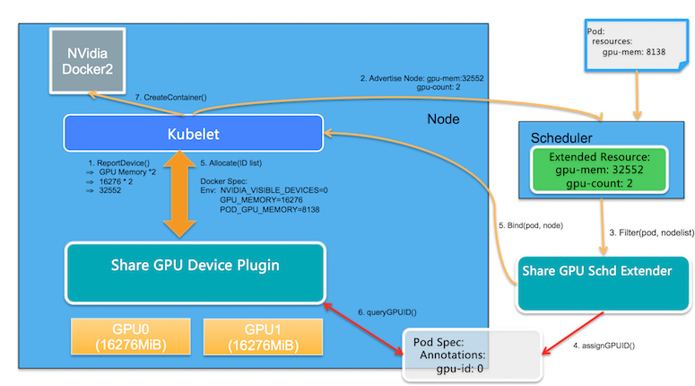

# 背景

在kubernetes中运行GPU程序，通常都是将一个GPU卡分配给一个容器。这可以实现比较好的隔离性，确保使用GPU的应用不会被其他应用影响；对于深度学习模型训练的场景非常适合；

但是如果对于模型开发和模型预测的场景就会比较浪费。所以很多用户的诉求是能够让更多的预测服务共享同一个GPU卡上，进而提高集群中Nvidia GPU的利用率。

而这就需要提供GPU资源的划分，而这里GPU资源划分的维度指的就是GPU显存和Cuda Kernel线程的划分。

目前，阿里云、腾讯云、华为都开始支持针对容器的GPU虚拟化。以下分别对这三家进行介绍

<!-- more -->

## 阿里云（gpushare+cGPU）

阿里云开源了一个gpushare项目，实现多个pod共享同一块gpu卡。下面是它的架构图：

### 两个核心模块：

>1. GPU Share Scheduler Extender: 利用Kubernetes的调度器扩展机制，负责在全局调度器Filter和Bind的时候判断节点上单个GPU卡是否能够提供足够的GPU Mem，并且在Bind的时刻将GPU的分配结果通过annotation记录到Pod Spec以供后续Filter检查分配结果。
>2. GPU Share Device Plugin: 利用Device Plugin机制，在节点上被Kubelet调用负责GPU卡的分配，依赖scheduler Extender分配结果执行。

### 工作流程（gpushare）：
1）GPU Share Device Plugin利用nvml库查询到GPU卡的数量和每张GPU卡的显存， 通过ListAndWatch()将节点的GPU总显存（数量 *显存）作为另外Extended Resource汇报给Kubelet； Kubelet进一步汇报给Kubernetes API Server。
2）Kubernetes默认调度器在进行完所有过滤(filter)行为后会通过http方式调用GPU Share Scheduler Extender的filter方法，找出单卡满足调度条件的节点和卡
3）当调度器找到满足条件的节点，就会委托GPU Share Scheduler Extender的bind方法进行节点和Pod的绑定。
4）当Pod和节点绑定的事件被Kubelet接收到后，Kubelet就会在节点上创建真正的Pod实体，在这个过程中, Kubelet会调用GPU Share Device Plugin的Allocate方法, Allocate方法的参数是Pod申请的gpu-mem。

### 验证结果（gpushare）：

gpushare只是实现了共享，并没有实现gpu资源的隔离。对gpu内存的使用上限需要用户自己把控。我尝试创建了一个pod，申请的gpu内存limit为1G，但实际上却使用了14G

因此阿里云推出了cGPU服务，保证显存和算力的隔离。

### cGPU

阿里云cGPU服务通过自研的内核驱动为容器提供虚拟的GPU设备，在保证性能的前提下隔离显存和算力，为充分利用GPU硬件资源进行训练和推理提供有效保障。您可以通过命令方便地配置容器内的虚拟GPU设备。

使用cGPU服务具有以下优势：
>1. 适配开源标准的Kubernetes和NVIDIA Docker方案。
>2. 无需重编译AI应用，无需替换CUDA库，升级CUDA、cuDNN的版本后无需重新配置。
>3. 支持同时隔离显存和算力。

## 腾讯云（gpu-manager）

GPUManager是腾讯自研的容器层GPU虚拟化方案，除兼容Nvidia 官方插件的GPU资源管理功能外，还增加碎片资源调度、GPU调度拓扑优化、GPU资源Quota等功能，在容器层面实现了GPU资源的化整为零，而在原理上仅使用了wrap library和linux动态库链接技术，就实现了GPU 算力和显存的上限隔离。

在工程设计上，GPUManager方案包括三个部分，cuda封装库vcuda、k8s device plugin 插件gpu-manager-daemonset和k8s调度插件gpu-quota-admission。

>1. vcuda-controller:  vcuda库是一个对nvidia-ml和libcuda库的封装库，通过劫持容器内用户程序的cuda调用限制当前容器内进程对GPU和显存的使用。
>2. gpu-quota-admission：是一个k8s Scheduler extender，实现了Scheduler的predicates接口，kube-scheduler在调度tencent.com/vcuda-core资源请求的Pod时，predicates阶段会调用gpu-quota-admission的predicates接口对节点进行过滤和绑定，同时gpu-quota-admission提供了GPU资源池调度功能，解决不同类型的GPU在namespace下的配额问题。
>3. gpu-manager-daemonset：是标准的k8s device plugin，实现了GPU拓扑感知、设备和驱动映射等功能。

后两者和阿里云的gpushare设计思路基本一致，都是采用了kubernetes的device plugin和扩展调度。

腾讯云和阿里云在gpu虚拟化方面，最大的分歧点在gpu隔离上。阿里云是自研的内核驱动。而腾讯云是采用的“cuda调用劫持”。对内存和算力的分配相关的接口，进行了封装，在调用cuda原生接口之前，会判断新请求的内存+已分配的是否超过了limit，如果超过，则报错。cuda库的调用流程如下（第二行）

***测试：安装失败，gpu-manager服务起不起来***

## 华为云（Valcano）
华为云的gpu虚拟化，在valcano里。

做的没有阿里云和腾讯云完善，不支持硬隔离。也是基于device plugin实现

## 三家对比

|厂商   |nvidia runtime依赖	|内存共享	|内存隔离	|算力隔离	|采用技术	                                            |优点      |缺点|
|------|------------------ |----------|---------|------------|------------------------------------------------------|------|--------|
|阿里云	|依赖	            |支持	    |支持	    |支持	   |cGPU（自研内核驱动）+ device plugin + scheduler extender|优点：无需重编译AI应用，无需替换CUDA库，升级CUDA、cuDNN的版本后无需重新配置；且基本无性能损耗（官方宣称）|缺点：开发难度相对较高|
|腾讯云	|不依赖	|支持	|支持	|支持	|cuda调用封装 + device plugin + scheduler extender|优点：开发难度相对较低|缺点：驱动和加速库的兼容性依赖于厂商存在约5%的性能损耗|
|华为云	|依赖	|支持	|不支持	|不支持	|device plugin|   |   |

# 业界其他方案

## NVIDIA MPS
NVIDIA MPS（NVIDIA Multi-Process Service）是 NVIDIA 公司为了进行 GPU 共享而推出的一套方案，由多个 CUDA 程序共享同一个 GPU context，从而达到多个 CUDA 程序共享 GPU 的目的。

同时，在 Volta GPU 上，用户也可以通过 CUDA_MPS_ACTIVE_THREAD_PERCENTAGE 变量设定每个 CUDA 程序占用的 GPU 算力的比例。然而由于多个 CUDA 程序共享了同一个 GPU context，这样引入的问题就是：当一个 CUDA 程序崩溃或者是触发 GPU 错误的时候，其他所有 CUDA 程序的任务都无法继续执行下去了，而这对于容器服务是灾难性的问题。

## NVIDIA vGPU
NVIDIA vGPU 方案是 GPU 虚拟化的方案，可以对多用户的强 GPU 隔离方案。它主要应用于虚拟化平台中，每个 vGPU 的显存和算力都是固定的，无法灵活配置；另外 vGPU 的使用需要额外从 NVIDIA 公司购买 license

## rCUDA类似方案
业内还有一种常用方案是通过替换 CUDA 库实现 API 层面的转发，然后通过修改显存分配，任务提交等 API 函数来达到多个容器共享 GPU 的目的。这种方案的缺点是需要对静态链接的程序重新编译，同时在 CUDA 库升级的时候也需要进行修改来适配新版本。即腾讯云使用的方案
