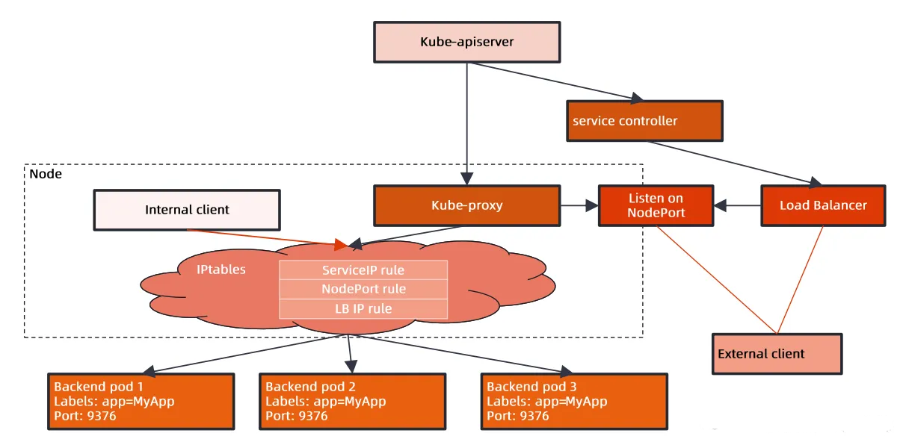
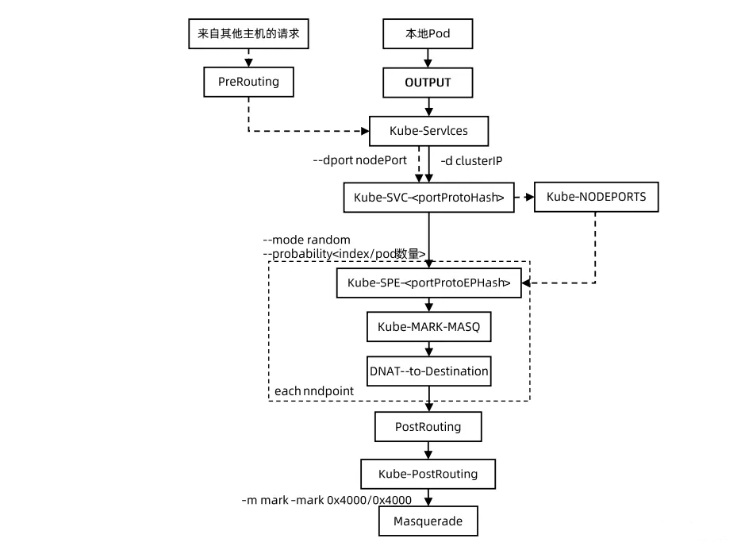
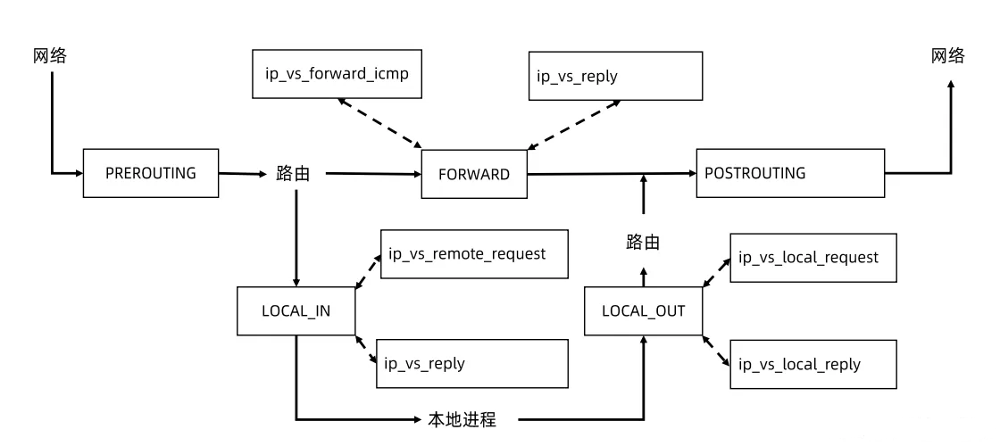

# 简介

Kube-proxy 是 Kubernetes 集群中的一个关键组件，负责实现 Kubernetes 服务发现和负载均衡。它运行在每个节点上，以确保网络流量正确路由到集群中的服务。
以下是 Kube-proxy 的一些主要功能和特点：

服务代理：Kube-proxy会监视 Kubernetes API Server 中的 Service 和 Endpoints 对象，以了解集群中的服务和其后端 Pod。当有新服务创建或更新时，Kube-proxy会自动更新代理规则，以确保服务可用性。

IP 负载均衡：Kube-proxy通过维护 IP 负载均衡规则，将请求分发到服务的后端 Pod。这有助于实现服务的负载均衡，确保请求能够均匀地分发到多个 Pod 上。

<!-- more -->

面向用户的服务发现：Kube-proxy允许用户通过 Kubernetes 的服务抽象来访问应用程序，而不需要了解后端 Pod 的详细信息。用户只需使用服务名称和端口号，而不必担心具体的 Pod IP 地址。

支持多种代理模式：Kube-proxy支持多种代理模式，包括iptables、IPVS、和 Windows 等。这些模式允许根据集群的具体需求选择不同的代理方式。

节点故障处理：Kube-proxy会监视节点上的 Pod 和服务，并在节点故障时自动处理重新路由流量，以确保服务的高可用性。

安全策略支持：Kube-proxy也可以与网络策略 (Network Policies) 集成，允许管理员定义网络访问控制规则，以保护集群中的服务。

总之，Kube-proxy是 Kubernetes 集群中的一个关键组件，它简化了服务发现和负载均衡的管理，使用户能够轻松地访问和管理其应用程序，同时确保高可用性和网络安全。不过需要注意的是，Kubernetes 1.20版本及以后，Kube-proxy引入了一个新的模式，即"Kube-proxy mode"，用于简化其设计和维护。因此，Kube-proxy的具体实现细节可能会随着Kubernetes版本的演进而变化。

# 图解

kube-proxy是工作在每个节点上面的组件，它会去watch apiserver，watch apiserver之后kube-proxy，假设kube-proxy工作在iptables模式下面，它就会去调用iptables的命令，去生成这样一些规则，无非就是说你的目标IP是某个clusterIP，那我就应该去写一些dnat的跳转规则，让后端数据包的目标地址变为后端pod的IP地址，这是kube-proxy希望去实现的一个目标。
经过IP tables之后，你访问cluster ip，你要将数据包转到后端的pod里面去，这是我们要达到的一个目的。

### iptables 模式
这个chain和原生的linux kernel里面内置的hook点是怎么产生绑定关系的呢？可以看到将kube-service这个chain加入到pretouting和output这两个hook点里面，

也就意味着，所有进入到Linux内核的数据包，以及linux系统里面的进程，向外发起请求的这些数据包全部都需要走kube-servcie，那么就意味着任何请求都会经过这些规则去处理。



假设本地有一个pod，要去访问nginx-basic这个服务，这个数据包意味是从本地的pod发出的，所以它先要走本地的kernel的output表，output就会去执行kube-service，走kube-service就会去看如果你的clusterip是符合我刚才service的clusterip的话，它就会经由展示的那些规则一个一个去命中。命中的话就将clusterip换成了目标pod的IP。，这样就完成了一个负载均衡的目标，这一切是在k8s节点的主机网络空间里面去做的。


ipvs是netfilter另外一种工作模式，另外一种plugin，ipvs本身是lvs的一部分，或者说二者是可以等价的，lvs更多的是为负载均衡服务，所以对nat网络包的处理，有更好的支持。

ipvs和iptables不一样，它所支持的hook点不一样，它没有prerouting的支持，它只有local_in的支持，有local_out的支持，只有local int out可以让我们去添加一些规则。

因为iptables模式下面，当你去访问clusterip，在做路由判决之前就将目标地址换掉了，进来的数据包是通过prerouting去做的dnat，这个时候路由判决还没有做，所以那个clusterip可以不绑在任何的路由设备上面，在路由判决的时候那个IP已经变成了pod的真实IP。

针对ipvs来说，从外面发进来的一个包，由Linux kernel来处理，如果访问的是clusterIP，那么在prerouting这里是没有ipvs的hook点的，也就是路由判决的时候，这个ip还是你service对应的clusterip，也就说在路由判决的时候，linux kernel会去判断，你所访问的目标地址，是不是在我本机一个有效地址，如果是无效就将这个包丢掉，针对ipvs模式，有一个额外的操作，要将所有的service cluster ip绑在当前节点的dump设备上面，这样的话才能判断我这个本机上面是有这个IP的，它是一个有效IP，又因为它是本机的，它会走到local_in这个hook点，在这里就可以插入一些ipvs规则的，出去的包也一样在local_out去做。
这是本质的区别，针对ipvs这种模式，你的clusterip是要绑在本机的某个interface上面的。

# 参数

```yaml
apiVersion: v1
kind: ServiceAccount
metadata:
  name: kube-proxy
  namespace: kube-system

---
apiVersion: rbac.authorization.k8s.io/v1
kind: ClusterRoleBinding
metadata:
  name: kubeadm:node-proxier
roleRef:
  apiGroup: rbac.authorization.k8s.io
  kind: ClusterRole
  name: system:node-proxier
subjects:
- kind: ServiceAccount
  name: kube-proxy
  namespace: kube-system

---
apiVersion: v1
data:
  config.conf: |-
    apiVersion: kubeproxy.config.k8s.io/v1alpha1
    bindAddress: 0.0.0.0
    bindAddressHardFail: false
    clientConnection:
      acceptContentTypes: ""
      burst: 0
      contentType: ""
      kubeconfig: /var/lib/kube-proxy/kubeconfig.conf
      qps: 0
    clusterCIDR: 10.144.0.0/16
    configSyncPeriod: 0s
    conntrack:
      maxPerCore: null
      min: null
      tcpCloseWaitTimeout: null
      tcpEstablishedTimeout: null
    detectLocal:
      bridgeInterface: ""
      interfaceNamePrefix: ""
    detectLocalMode: ""
    enableProfiling: false
    healthzBindAddress: ""
    hostnameOverride: ""
    iptables:
      masqueradeAll: false
      masqueradeBit: null
      minSyncPeriod: 0s
      syncPeriod: 0s
    ipvs:
      excludeCIDRs: null
      minSyncPeriod: 0s
      scheduler: ""
      trictARP: false
      syncPeriod: 0s
      tcpFinTimeout: 0s
      tcpTimeout: 0s
      udpTimeout: 0s
    kind: KubeProxyConfiguration
    metricsBindAddress: ""
    mode: "iptables"
    nodePortAddresses: null
    oomScoreAdj: null
    portRange: ""
    showHiddenMetricsForVersion: ""
    udpIdleTimeout: 0s
    winkernel:
      enableDSR: false
      forwardHealthCheckVip: false
      networkName: ""
      rootHnsEndpointName: ""
      sourceVip: ""
  kubeconfig.conf: |-
    apiVersion: v1
    kind: Config
    clusters:
    - cluster:
        certificate-authority: /var/run/secrets/kubernetes.io/serviceaccount/ca.crt
        server: https://192.168.201.10:6443
      name: default
    contexts:
    - context:
        cluster: default
        namespace: default
        user: default
      name: default
    current-context: default
    users:
    - name: default
      user:
        tokenFile: /var/run/secrets/kubernetes.io/serviceaccount/token
kind: ConfigMap
metadata:
  labels:
    app: kube-proxy
  name: kube-proxy
  namespace: kube-system

---
apiVersion: apps/v1
kind: DaemonSet
metadata:
  labels:
    k8s-app: kube-proxy
  name: kube-proxy
  namespace: kube-system
spec:
  selector:
    matchLabels:
      k8s-app: kube-proxy
  template:
    metadata:
      labels:
        k8s-app: kube-proxy
    spec:
      containers:
      - command:
        - /usr/local/bin/kube-proxy
        - --config=/var/lib/kube-proxy/config.conf
        - --hostname-override=$(NODE_NAME)
        - --exclude-cluster-cidr=10.244.0.0/16
        - --v=5
        env:
        - name: NODE_NAME
          valueFrom:
            fieldRef:
              apiVersion: v1
              fieldPath: spec.nodeName
        image: flftuu/kube-proxy-amd64:v1.24.10-dirty
        imagePullPolicy: IfNotPresent
        name: kube-proxy
        resources: {}
        securityContext:
          privileged: true
        terminationMessagePath: /dev/termination-log
        terminationMessagePolicy: File
        volumeMounts:
        - mountPath: /var/lib/kube-proxy
          name: kube-proxy
        - mountPath: /run/xtables.lock
          name: xtables-lock
        - mountPath: /lib/modules
          name: lib-modules
          readOnly: true
      dnsPolicy: ClusterFirst
      hostNetwork: true
      nodeSelector:
        kubernetes.io/os: linux
      priorityClassName: system-node-critical
      restartPolicy: Always
      schedulerName: default-scheduler
      securityContext: {}
      serviceAccount: kube-proxy
      serviceAccountName: kube-proxy
      terminationGracePeriodSeconds: 30
      tolerations:
      - operator: Exists
      volumes:
      - configMap:
          defaultMode: 420
          name: kube-proxy
        name: kube-proxy
      - hostPath:
          path: /run/xtables.lock
          type: FileOrCreate
        name: xtables-lock
      - hostPath:
          path: /lib/modules
          type: ""
        name: lib-modules
  updateStrategy:
    rollingUpdate:
      maxSurge: 0
      maxUnavailable: 1
    type: RollingUpdate
```
# 编译

```shell
git clone https://github.com/kubernetes/kubernetes.git
cd kubernetes
export KUBE_GIT_VERSION=v1.24.10
make clean
make quick-release-images
```

# 镜像

```shell
docker pull flftuu/kube-proxy-amd64:v1.24.10-dirty
```

# 效果

### iptables 模式
```shell
# 查看iptables nat 表的规则

# 存在calico ip：10.96.67.75 信息
[root@fanyi-worker1 ~]# iptables -L -vn -t nat | grep 10.96.67.75 -A 2
    0     0 KUBE-SVC-RH2G6EKXTJDCSNM7  tcp  --  *      *       0.0.0.0/0            10.96.67.75          /* default/nginx-calico cluster IP */ tcp dpt:80
   12   720 KUBE-NODEPORTS  all  --  *      *       0.0.0.0/0            0.0.0.0/0            /* kubernetes service nodeports; NOTE: this must be the last rule in this chain */ ADDRTYPE match dst-type LOCAL

--
    0     0 KUBE-MARK-MASQ  tcp  --  *      *      !10.144.0.0/16        10.96.67.75          /* default/nginx-calico cluster IP */ tcp dpt:80
    0     0 KUBE-SEP-ZMODNQBWAQHJ2KQZ  all  --  *      *       0.0.0.0/0            0.0.0.0/0            /* default/nginx-calico -> 10.144.154.71:80 */

# 不存在ovn ip：10.96.95.98  信息
[root@fanyi-worker1 ~]# iptables -L -vn -t nat | grep 10.96.95.98 -A 2
```

### ipvs 模式

```shell
# 查看ipvs 规则和 kube-ipvs0网卡上的ip信息

# 存在calico ip：10.96.67.75 信息
[root@fanyi-worker1 ~]# ip add | grep  10.96.67.75
    inet 10.96.67.75/32 scope global kube-ipvs0
[root@fanyi-worker1 ~]# ipvsadm -l -n | grep  10.96.67.75 -A 1
TCP  10.96.67.75:80 rr
  -> 10.144.154.71:80             Masq    1      0          0  

# 不存在ovn ip：10.96.95.98  信息
[root@fanyi-worker1 ~]# ip add | grep  10.96.95.98 
[root@fanyi-worker1 ~]# ipvsadm -l -n | grep  10.96.95.98 
```
