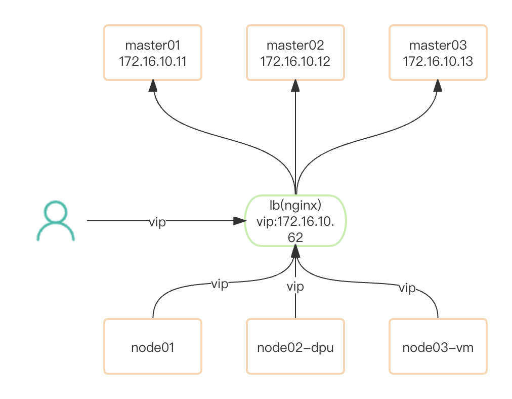

### 网络架构图

master01: 172.16.10.11

master01: 172.16.10.12

master01: 172.16.10.13

外部LB：172.16.10.62
<!-- more -->

### 创建三个vm虚拟机

根据现有网络环境，vm 必须包好两张网卡，eth0(使用nat 网络模式，用于访问公网) eth1(使用桥接模式，和宿主机处于同一网络平面上，用户访问dpu节点)

##### 创建网络

创建桥接模式网络

    # 创建网桥
    brctl addbr br0
    # 加入宿主机网卡到网桥
    brctl addif br0 enp1s0

创建nat 模式网络

    # 使用virsh 创建网络
    cat <EOF >default.xml
    <network connections='3'>
      <name>default</name>
      <uuid>414f2c31-93ba-46a3-9588-84a3b36bc409</uuid>
      <forward mode='nat'>
        <nat>
          <port start='1024' end='65535'/>
        </nat>
      </forward>
      <bridge name='virbr0' stp='on' delay='0'/>
      <mac address='52:54:00:6e:b8:48'/>
      <ip address='192.168.122.1' netmask='255.255.255.0'>
        <dhcp>
          <range start='192.168.122.2' end='192.168.122.254'/>
        </dhcp>
      </ip>
    </network>
    EOF
    
    virsh net-define default.xml
    virsh net-start default
    # 查看网桥信息
    brctl show virbr0

##### 使用网络

vm xml信息

      # 添加nat模式网络，用于外网访问  
     <interface type='network'>
          <mac address='fa:92:01:33:e4:fd'/>
          <source network='default'/>
          <model type='virtio'/>
          <address type='pci' domain='0x0000' bus='0x00' slot='0x03' function='0x0'/>
        </interface>
        # 添加桥接模式网络，用于k8s管理网段，访问dpu节点
        <interface type='bridge'>
          <mac address='fa:92:01:33:e4:fc'/>
          <source bridge='br0'/>
          <model type='virtio'/>
          <address type='pci' domain='0x0000' bus='0x00' slot='0x03' function='0x1'/>
        </interface>

### 安装containerd

卸载旧版本

    sudo apt-get remove docker docker-engine docker.io docker-ce docker-ce-cli containerd runc kubelet kubectl kubeadm  cri-tools 
    sudo rm -rf /var/lib/docker
    sudo rm -rf /var/lib/containerd
    sudo rm -fr /etc/cni/net.d
    sudo rm -fr /opt/cni/bin

准备包环境，更新apt，允许使用https

    sudo apt-get update
    sudo apt-get install \
        ca-certificates \
        curl \
        gnupg \
        lsb-release

添加docker官方GPG key

    sudo mkdir -p /etc/apt/keyrings
    curl -fsSL https://download.docker.com/linux/ubuntu/gpg | sudo gpg --dearmor -o /etc/apt/keyrings/docker.gpg

设置软件仓库源

    echo \
      "deb [arch=$(dpkg --print-architecture) signed-by=/etc/apt/keyrings/docker.gpg] https://download.docker.com/linux/ubuntu \
      $(lsb_release -cs) stable" | sudo tee /etc/apt/sources.list.d/docker.list > /dev/null
    
    # 添加公钥
    sudo gpg --keyserver keyserver.ubuntu.com --recv B53DC80D13EDEF05
    sudo gpg --export --armor B53DC80D13EDEF05 | sudo apt-key add -

安装containerd

    # 安装containerd
    sudo apt-get update
    sudo apt-get install -y containerd.io
    
    # 如果是安装docker则执行：
    #sudo apt-get install docker-ce docker-ce-cli containerd.io
    
    # 查看运行状态
    systemctl enable containerd
    systemctl status containerd

### 配置containerd

在 Linux 上，containerd 的默认 CRI 套接字是 /run/containerd/containerd.sock

生成默认配置

    containerd config default > /etc/containerd/config.toml

修改CgroupDriver为systemdk8s官方推荐使用systemd类型的CgroupDriver

    # 修改默认配置 /etc/containerd/config.toml
    sandbox_image = "registry.aliyuncs.com/google_containers/pause:3.7" #修改pause地址
    
      [plugins."io.containerd.grpc.v1.cri".containerd.runtimes.runc.options]
        SystemdCgroup = true #修改

重启containerd

    systemctl enable containerd
    systemctl restart containerd

### 安装外部LB服务

    cat >EOF >nginx.conf
    user nginx;
    worker_processes auto;
    error_log /var/log/nginx/error.log;
    pid /run/nginx.pid;
    
    include /usr/share/nginx/modules/*.conf;
    
    events {
        worker_connections 1024;
    }
    
    # 四层负载均衡，为两台Master apiserver组件提供负载均衡
    stream {
    
        log_format  main  '$remote_addr $upstream_addr - [$time_local] $status $upstream_bytes_sent';
    
        access_log  /var/log/nginx/k8s-access.log  main;
    
        upstream k8s-apiserver {
           server 172.16.10.11:6443 max_fails=1 fail_timeout=10s;   # master01 APISERVER IP:PORT
           server 172.16.10.12:6443 max_fails=1 fail_timeout=10s;   # master02 APISERVER IP:PORT
           server 172.16.10.13:6443 max_fails=1 fail_timeout=10s;   # master03 APISERVER IP:PORT
        }
        
        server {
           listen 16443;
           proxy_pass k8s-apiserver;
        }
    }
    
    http {
    }
    EOF
    
    # 启动lb服务
    docker run -d --name k8s-apiserver-lb -p 16443:16443 -v $PWD/nginx.conf:/etc/nginx/nginx.conf nginx:latest

### 安装kubernetes

所有节点执行

    cat >EOF >/etc/apt/sources.list.d/kubernetes.list 
    #deb https://mirrors.aliyun.com/kubernetes/apt/ kubernetes-xenial main
    deb http://mirrors.ustc.edu.cn/kubernetes/apt kubernetes-xenial main
    EOF
    # 添加公钥
    sudo gpg --keyserver keyserver.ubuntu.com --recv B53DC80D13EDEF05
    sudo gpg --export --armor B53DC80D13EDEF05 | sudo apt-key add -
    
    # 安装k8s
    sudo apt-get update
    sudo apt-get install -y kubelet=1.24.10-00 kubeadm=1.24.10-00 kubectl=1.24.10-00 --allow-downgrades
    
    # 锁定版本不升级
    sudo apt-mark hold kubelet kubeadm kubectl

所有节点执行

    # 设置参数
    cat <<EOF > /etc/sysctl.d/k8s.conf
    net.bridge.bridge-nf-call-ip6tables = 1
    net.bridge.bridge-nf-call-iptables = 1
    net.ipv4.ip_forward = 1
    vm.swappiness = 0
    EOF
    
    # 加载模块
    cat << EOF > /etc/modules-load.d/containerd.conf
    overlay
    br_netfilter
    EOF
    
    modprobe overlay
    modprobe br_netfilter
    sysctl -p  /etc/sysctl.d/k8s.conf
    
    # 在所有节点(含Master)都安装ovs
    sudo apt-get install openvswitch-switch

##### master01 节点安装

    sudo kubeadm init --control-plane-endpoint 172.16.10.62:16443  --upload-certs --kubernetes-version=v1.24.10 --apiserver-advertise-address=172.16.10.11 --image-repository registry.aliyuncs.com/google_containers --pod-network-cidr=10.123.0.0/16 --service-cidr=10.86.0.0/16
    
    # 输出如下：
    Your Kubernetes control-plane has initialized successfully!
    
    To start using your cluster, you need to run the following as a regular user:
    
      mkdir -p $HOME/.kube
      sudo cp -i /etc/kubernetes/admin.conf $HOME/.kube/config
      sudo chown $(id -u):$(id -g) $HOME/.kube/config
    
    Alternatively, if you are the root user, you can run:
    
      export KUBECONFIG=/etc/kubernetes/admin.conf
    
    You should now deploy a pod network to the cluster.
    Run "kubectl apply -f [podnetwork].yaml" with one of the options listed at:
      https://kubernetes.io/docs/concepts/cluster-administration/addons/
    
    You can now join any number of the control-plane node running the following command on each as root:
    
      kubeadm join 172.16.10.62:16443 --token m7iv0r.uob1re8vw5xtht52 \
     --discovery-token-ca-cert-hash sha256:07cfc6d8d1092f8ac9baf71bbe9e606d61138dad19a1988947baa14280aad8aa \
     --control-plane --certificate-key 98adc3aac8c6caf80c2cd8da6e516bf43be98c2cf8acdff1a02892c8be88fc74
    
    Please note that the certificate-key gives access to cluster sensitive data, keep it secret!
    As a safeguard, uploaded-certs will be deleted in two hours; If necessary, you can use
    "kubeadm init phase upload-certs --upload-certs" to reload certs afterward.
    
    Then you can join any number of worker nodes by running the following on each as root:
    
    kubeadm join 172.16.10.62:16443 --token m7iv0r.uob1re8vw5xtht52 \
     --discovery-token-ca-cert-hash sha256:07cfc6d8d1092f8ac9baf71bbe9e606d61138dad19a1988947baa14280aad8aa 

##### master02 节点安装

添加--apiserver-advertise-address=172.16.10.12 参数

    kubeadm join 172.16.10.62:16443 --apiserver-advertise-address=172.16.10.12 --token m7iv0r.uob1re8vw5xtht52 \
     --discovery-token-ca-cert-hash sha256:07cfc6d8d1092f8ac9baf71bbe9e606d61138dad19a1988947baa14280aad8aa \
     --control-plane --certificate-key 98adc3aac8c6caf80c2cd8da6e516bf43be98c2cf8acdff1a02892c8be88fc74

##### master03 节点安装

添加--apiserver-advertise-address=172.16.10.13 参数

    kubeadm join 172.16.10.62:16443 --apiserver-advertise-address=172.16.10.13 --token m7iv0r.uob1re8vw5xtht52 \
     --discovery-token-ca-cert-hash sha256:07cfc6d8d1092f8ac9baf71bbe9e606d61138dad19a1988947baa14280aad8aa \
     --control-plane --certificate-key 98adc3aac8c6caf80c2cd8da6e516bf43be98c2cf8acdff1a02892c8be88fc74

##### work 节点安装

修改node ip参数：--node-ip=172.16.10.205

    # 指定node ip地址
    cat >EOF >/etc/default/kubelet 
    KUBELET_EXTRA_ARGS="--node-ip=172.16.10.205"
    EOF
    
    kubeadm join 172.16.10.62:16443 --token m7iv0r.uob1re8vw5xtht52 \
     --discovery-token-ca-cert-hash sha256:07cfc6d8d1092f8ac9baf71bbe9e606d61138dad19a1988947baa14280aad8aa
