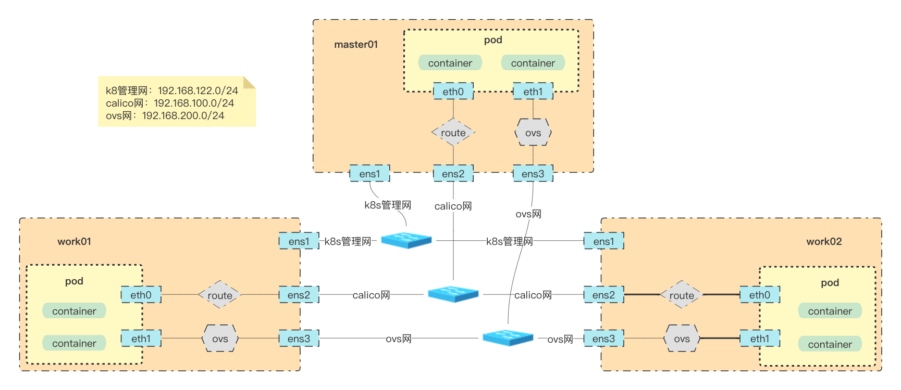

## 背景目的
随着金融，医疗，政企对网络延迟的高要求，云原生提出多网卡，实现高低延迟流量的分离处理。
以提高业务pod的流量处理性能。

方案架构：
>1. Calico作为默认网络，承载管理流量与非低延时业务流量；
>2. OVN-Kubernetes作为第二网络，承载低延时业务流量；

<!-- more -->

## 组网架构


***节点ip规划***
master01：
ens1: 192.168.122.10
ens2: 192.168.100.10
ens3: 192.168.200.10

work01:
ens1: 192.168.122.101
ens2: 192.168.100.101
ens3: 192.168.200.101

work02:
ens1: 192.168.122.102
ens2: 192.168.100.102
ens3: 192.168.200.102

## 环境搭建

### calico 搭建

***calico 简介***
calico作为 Kubernetes 最长使用的一种网络插件，Calico 具有很强的扩展性，较优的资源利用和较少的依赖，相较于 Flannel 插件采用 Overlay 的网络，Calico 可以通过三层路由的方式采用性能更佳的 Underlay 网络，Calico 网络插件的转发效率是所有方案中最高的。

这里介绍calico Underlay 网络的bgp 的模式：
在使用 Calico 网络插件的实际生产环境当中，为了提高网络的性能和灵活性，需要将 Kubernetes 的工作节点和物理网络中的 leaf 交换机建立 bgp 邻居关系，同步 bgp 路由信息，可以将 pod 网络的路由发布到物理网络中。Calico 给出了三种类型的 BGP 互联方案，分别是 Full-mesh、Route reflectors 和 Top of Rack (ToR)。
>1. Full-mesh
全互联模式，启用了 BGP 之后，Calico 的默认行为是在每个节点彼此对等的情况下创建完整的内部 BGP（iBGP）连接，这使 Calico 可以在任何 L2 网络（无论是公有云还是私有云）上运行，或者说（如果配了 IPIP ）可以在任何不禁止 IPIP 流量的网络上作为 overlay 运行。对于 vxlan overlay，Calico 不使用 BGP。
Full-mesh 模式对于 100 个以内的工作节点或更少节点的中小规模部署非常有用，但是在较大的规模上，Full-mesh 模式效率会降低，较大规模情况下，Calico 官方建议使用 Route reflectors。
>2. Route reflectors
如果想构建内部 BGP（iBGP）大规模集群，可以使用 BGP 路由反射器来减少每个节点上使用 BGP 对等体的数量。在此模型中，某些节点充当路由反射器，并配置为在它们之间建立完整的网格。然后，将其他节点配置为与这些路由反射器的子集（通常为冗余，通常为 2 个）进行对等，从而与全网格相比减少了 BGP 对等连接的总数。
>3. Top of Rack（ToR）
在本地部署中，可以将 Calico 配置为直接与物理网络基础结构对等。通常，这需要涉及到禁用 Calico 的默认 Full-mesh 行为，将所有 Calico 节点与 L3 ToR 路由器对等。

这里测试环境使用calico bgp 模式中的 Route reflectors（rr）方式

***calico 创建***

```sh
wget -c https://raw.githubusercontent.com/projectcalico/calico/v3.24.5/manifests/calico.yaml

# vim calico.yaml
# 修改对应参数
CALICO_IPV4POOL_IPIP = "Never" # 支持ipip模式，启用bgp
IP_AUTODETECTION_METHOD = "ens2" # 指定calico使用的网卡
CALICO_IPV4POOL_CIDR = "10.244.0.0/16" # 指定cluster cidr网段
CALICO_IPV4POOL_BLOCK_SIZE = "24" # 指定node subnet的子网掩码，默认25

# 在calico-kube-controllers 部分增加
 envFrom:
          - configMapRef:
              # Allow KUBERNETES_SERVICE_HOST and KUBERNETES_SERVICE_PORT to be overridden for eBPF mode.
              name: kubernetes-services-endpoint
              optional: true

# 创建kubernetes-services-endpoint confimap，当集群中没有kube-proxy的时候
cat > kubernetes-services-endpoint.yaml <<EOF
apiVersion: v1
data:
  KUBERNETES_SERVICE_HOST: 192.168.122.10
  KUBERNETES_SERVICE_PORT: "6443"
kind: ConfigMap
metadata:
  name: kubernetes-services-endpoint
  namespace: kube-system
EOF

# 创建
kubectl apply -f kubernetes-services-endpoint.yaml
kubectl apply -f calico.yaml
# 安装calicoctl 客户端
kubectl apply -f https://raw.githubusercontent.com/projectcalico/calico/v3.24.5/manifests/calicoctl.yaml
```

***calico rr 模式***
更改calico 的bgp 模式为rr

选择master01 作为rr节点
```sh
# 增加label 标签
kubectl label node master01 router-reflector=true

# 修改calico node 信息
calicoctl get node master01 -o yaml > master01.yaml
# 修改master01.yaml 的bgp 中的 asNumber，routeReflectorClusterID 信息, 如下
# 应用更改
calicoctl apply -f  master01.yaml
```
修改master01.yaml 信息
```yaml
apiVersion: projectcalico.org/v3
kind: Node
metadata:
  annotations:
    projectcalico.org/kube-labels: '{"beta.kubernetes.io/arch":"amd64","beta.kubernetes.io/os":"linux","kubernetes.io/arch":"amd64","kubernetes.io/hostname":"master01","kubernetes.io/os":"linux","node-role.kubernetes.io/control-plane":"","node-role.kubernetes.io/master":"","node.kubernetes.io/exclude-from-external-load-balancers":"","route-reflector":"true"}'
  creationTimestamp: "2022-12-22T10:27:22Z"
  labels:
    beta.kubernetes.io/arch: amd64
    beta.kubernetes.io/os: linux
    kubernetes.io/arch: amd64
    kubernetes.io/hostname: master01
    kubernetes.io/os: linux
    node-role.kubernetes.io/control-plane: ""
    node-role.kubernetes.io/master: ""
    node.kubernetes.io/exclude-from-external-load-balancers: ""
    route-reflector: "true"
  name: master01
  resourceVersion: "3402273"
  uid: 60f03e30-b16f-44d7-92c4-97fcbc1c98a5
spec:
  addresses:
  - address: 192.168.100.10/24
    type: CalicoNodeIP
  - address: 192.168.122.10
    type: InternalIP
  bgp:
    asNumber: 63400 # 增加as 信息，65535以下都行
    ipv4Address: 192.168.100.10/24
    routeReflectorClusterID: 192.168.100.10 # 增加id信息，一般是该节点ip信息
  orchRefs:
  - nodeName: master01
    orchestrator: k8s
status:
  podCIDRs:
  - 10.244.0.0/24
```

更改bpg config 信息
```sh
# 创建bgpconfig 信息
cat > bgpconfig.yaml << EOF
apiVersion: projectcalico.org/v3
kind: BGPConfiguration
metadata:
 name: default
spec:
 logSeverityScreen: Info
 nodeToNodeMeshEnabled: false # 关闭 bgp full-mesh 模式
 asNumber: 63400 # 同master01 节点一样设置 as号
EOF

# 创建peer 规则信息
cat > peer.yaml << EOF
apiVersion: projectcalico.org/v3
kind: BGPPeer
metadata:
  name: peer-to-rrs
spec:
  nodeSelector: all() # 选择所有node节点启用bgp
  peerSelector: route-reflector == 'true' # 选择route-reflector=true的标签master01节点作为rr节点，下发路由信息
EOF

calicoctl apply -f bgpconfig.yaml
calicoctl apply -f peer.yaml

```

查看calico bgp信息
```sh
# 在master01节点上查看
calicoctl node status 

Calico process is running.

IPv4 BGP status
+-----------------+---------------+-------+------------+-------------+
|  PEER ADDRESS   |   PEER TYPE   | STATE |   SINCE    |    INFO     |
+-----------------+---------------+-------+------------+-------------+
| 192.168.100.101 | node specific | up    | 2023-01-16 | Established |
| 192.168.100.102 | node specific | up    | 2023-01-16 | Established |
+-----------------+---------------+-------+------------+-------------+

IPv6 BGP status
No IPv6 peers found.

# 在work01 节点上查看
calicoctl node status 
Calico process is running.

IPv4 BGP status
+----------------+---------------+-------+------------+-------------+
|  PEER ADDRESS  |   PEER TYPE   | STATE |   SINCE    |    INFO     |
+----------------+---------------+-------+------------+-------------+
| 192.168.100.10 | node specific | up    | 2023-01-16 | Established |
+----------------+---------------+-------+------------+-------------+

IPv6 BGP status
No IPv6 peers found.

# 在work节点上看，只有一条和rr节点的peer, full-mesh 模式则和所有work节点都用peer
```

### multus-cni 创建
```sh
# 安装multus-cni

wget -c https://raw.githubusercontent.com/k8snetworkplumbingwg/multus-cni/v3.9.3/deployments/multus-daemonset.yml

# 修改multus-daemonset.yml 中的
# kube-multus 部分增加
 envFrom:
          - configMapRef:
              # Allow KUBERNETES_SERVICE_HOST and KUBERNETES_SERVICE_PORT to be overridden for eBPF mode.
              name: kubernetes-services-endpoint
              optional: true

kubectl apply -f multus-daemonset.yml
```

### ovn-k8s 创建

***配置ovn-deamonset***
```sh
# 注意无DPU场景gateway-mode="local"，其他参数不要配
$ cd $HOME/ovn/ovn-kubernetes/dist/images
# 如果使用的ip不是默认的管理口ip,需要额外指定以下参数（k8s组网时的apiserver ip必须一致）
./daemonset.sh --image=yusur/ovn-daemonset-f:fullmode --net-cidr=10.144.0.0/16 --svc-cidr=10.96.0.0/16 --gateway-mode="local" --gateway-options="--gateway-interface=ens3 --gateway-nexthop=192.168.200.1" --k8s-apiserver=https://192.168.200.10:6443 --multicast-enabled --disable-snat-multiple-gws --disable-pkt-mtu-check=true

#依次拉起ovn-kubernetes的pod
# Configmap
$ kubectl create -f ../yaml/ovn-setup.yaml
# OVN Database
$ kubectl create -f ../yaml/ovnkube-db.yaml
# ovnkube Master pod
$ kubectl create -f ../yaml/ovnkube-master.yaml
# ovnkube node for nodes without DPU 
$ kubectl create -f ../yaml/ovnkube-node.yaml
```

***查看ovn和ovs 信息***
```sh
ovs-vsctl  show 
6e79b5ed-12e9-438a-b5ce-dd37f8aa20bc
    Bridge brens3f2
        fail_mode: standalone
        Port patch-brens3f2_master01-to-br-int
            Interface patch-brens3f2_master01-to-br-int
                type: patch
                options: {peer=patch-br-int-to-brens3f2_master01}
        Port ens3f2
            Interface ens3f2
        Port brens3f2
            Interface brens3f2
                type: internal
    Bridge br-int
        fail_mode: secure
        datapath_type: system
        Port ovn-f70ac1-0
            Interface ovn-f70ac1-0
                type: vxlan
                options: {csum="true", key=flow, remote_ip="192.168.122.101"}
        Port ovn-k8s-mp0
            Interface ovn-k8s-mp0
                type: internal
        Port br-int
            Interface br-int
                type: internal
        Port patch-br-int-to-brens3f2_master01
            Interface patch-br-int-to-brens3f2_master01
                type: patch
                options: {peer=patch-brens3f2_master01-to-br-int}
        Port ovn-5ae586-0
            Interface ovn-5ae586-0
                type: vxlan
                options: {csum="true", key=flow, remote_ip="192.168.122.102"}
    ovs_version: "2.17.3"
```

## 使用方法

### 配置第二network
```sh
cat >yuser-ovn.yaml <<EOF
apiVersion: "k8s.cni.cncf.io/v1"
kind: NetworkAttachmentDefinition
metadata:
  name: yusur-ovn #网络名称
  namespace: default
spec:
  config: '{
    "cniVersion": "0.4.0",
    "name": "ovn-kubernetes",
    "type": "ovn-k8s-cni-overlay",
    "ipam": {},
    "dns": {},
    "logFile": "/var/log/ovn-kubernetes/ovn-k8s-cni-overlay.log",
    "logLevel": "5",
    "logfile-maxsize": 100,
    "logfile-maxbackups": 5,
    "logfile-maxage": 5
    }'
EOF

kubectl apply -f yuser-ovn.yaml
```

### 使用第二network
```sh
cat >busybox3.yaml <<EOF
apiVersion: v1
kind: Pod
metadata:
  name: busybox3
  namespace: default
  annotations:
    k8s.v1.cni.cncf.io/networks: '[{
      "name": "yusur-ovn", #指定网络名称
      "interface": "eth1", #必须指定eth0 以外的名称，不然和calico网卡冲突
      "default-route": ["10.144.0.1"] #必须指定默认路由信息，不然无法创建，默认路由和calico冲突无法启动pod
    }]'
spec:
  containers:
  - image: busybox:1.28
    command: ['/bin/sh', '-c', 'sleep 36000']
    imagePullPolicy: IfNotPresent
    name: busybox
  restartPolicy: Always
  nodeSelector:
    kubernetes.io/hostname: work01
EOF

kubectl apply -f busybox3.yaml
```

### 查看多网卡信息
```sh
# 查看网卡信息
kubectl  exec -it busybox3 -- ip addr 
1: lo: <LOOPBACK,UP,LOWER_UP> mtu 65536 qdisc noqueue qlen 1000
    link/loopback 00:00:00:00:00:00 brd 00:00:00:00:00:00
    inet 127.0.0.1/8 scope host lo
       valid_lft forever preferred_lft forever
3: eth0@if8011: <BROADCAST,MULTICAST,UP,LOWER_UP,M-DOWN> mtu 1500 qdisc noqueue 
    link/ether c6:06:25:b7:76:48 brd ff:ff:ff:ff:ff:ff
    inet 10.244.83.250/32 scope global eth0
       valid_lft forever preferred_lft forever
5: eth1@if8012: <BROADCAST,MULTICAST,UP,LOWER_UP,M-DOWN> mtu 1400 qdisc noqueue 
    link/ether 0a:58:0a:90:00:1f brd ff:ff:ff:ff:ff:ff
    inet 10.144.0.31/24 brd 10.144.0.255 scope global eth1
       valid_lft forever preferred_lft forever

# 查看路由信息
kubectl  exec -it busybox3 -- ip route
default via 10.144.0.1 dev eth1 
10.96.0.0/16 via 10.144.0.1 dev eth1 
10.144.0.0/24 dev eth1 scope link  src 10.144.0.31 
10.144.0.0/16 via 10.144.0.1 dev eth1 
169.254.1.1 dev eth0 scope link 
```