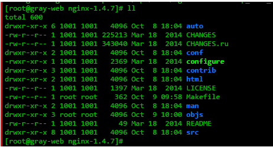

<amp-auto-ads type="adsense" data-ad-client="ca-pub-5216394795966395"></amp-auto-ads>

## 手动编译安装nginx，添加nginx-auth-ldap模块

下载nginx源码包并解压。可在http://nginx.org/en/download.html下载.tar.gz的源码包，如（nginx-1.4.7.tar.gz）
<!-- more -->

下载后通过tar -xvzf 进行解压，解压后的nginx目录结构如下：



为nginx设置安装目录，并添加nginx-auth-ldap nginx模块

     1）安装openldap-devel：yum -y install openldap-devel
            2）下载nginx-auth-ldap模块：
                cd /usr/local/src
                git clone https://github.com/kvspb/nginx-auth-ldap.git

        编译时候加入 --add-module=/usr/local/src/nginx-auth-ldap
            3）安装nginx并启用ldap：

       切换到解压后的nginx目录中执行命令：./configure --prefix=/opt/nginx --add-module=/usr/local/src/nginx-auth-ldap

        参数说明：

　　--prefix 用于指定nginx编译后的安装目录

　　--add-module 为添加的第三方模块，此次添加了ldap的nginx模块

       执行安装命令：make install

## 配置nginx 文件

>- 在nginx主配置文件（nginx.conf）的http标签中添加如下代码
group_attribute People 这个是验证的时候，访问哪个组

```sh
       http {
               ldap_server openldap {
                 url ldap://172.16.6.13:389/DC=ptmind,DC=com?cn?sub?(objectClass=person); 
                 binddn "cn=ldap,dc=ptmind,dc=com";
                 binddn_passwd "xxxxx";
                 group_attribute People;
                 group_attribute_is_dn on;
                 require valid_user;
             }
      }
```

>- 启动验证server

```sh
server {
           listen 8000;
           server_name localhost;
           location / {
             root html;
             index index.html index.htm;
             auth_ldap "Forbidden";
             auth_ldap_servers openldap;
          }
     }
```
