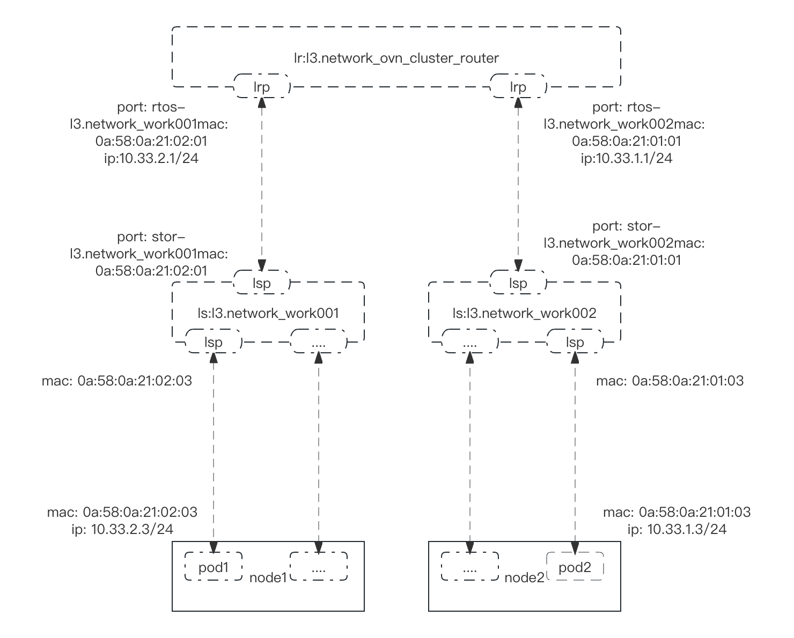
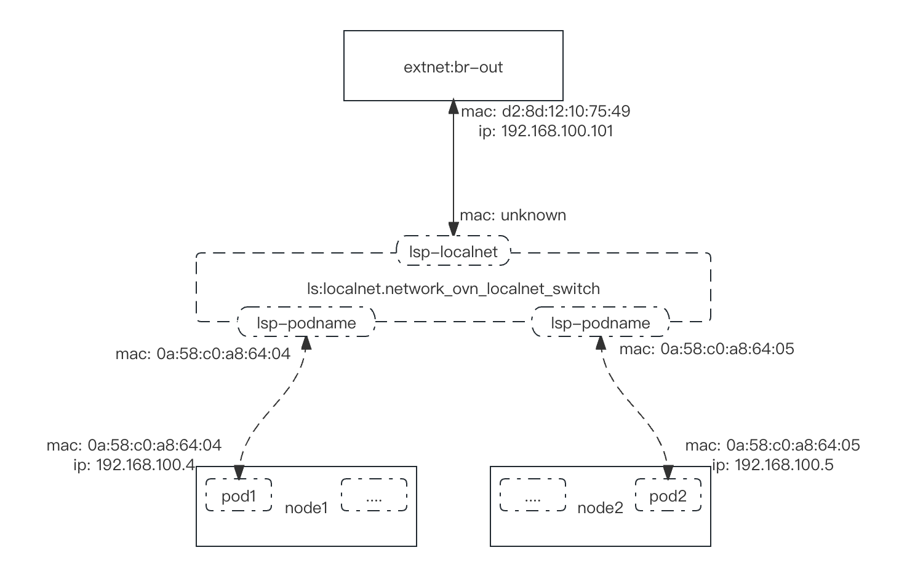

# ovn-k8s的multi-homing功能介绍

# multi-homing功能简介

具有多个网络接口的 K8s Pod被称为 multi-homed。  [Network Plumbing Working Group](https://github.com/k8snetworkplumbingwg/multi-net-spec) 提出了一个标准，描述如何指定附加网络接口的配置。

有几个插件（Multus、Genie）实现了此标准。

在特定 Kubernetes 节点上调度 pod 后，kubelet 将调用委托插件来准备 pod 的联网。然后，此元插件将调用负责设置 pod 的默认集群网络的 CNI，然后迭代 pod 上的其他附件列表，调用相应的委托 CNI 实现将 pod 附加到该特定网络的逻辑。

<!-- more -->

# 环境搭建

### ovn-k8s 开启multi-homing

     OVN_IMAGE=harbor.yusur.tech/yusur_ovn/ovn-daemonset-f:second-cni-latest
     
    ./daemonset.sh \
    --image=$OVN_IMAGE \
    --net-cidr=10.124.0.0/16 \
    --svc-cidr=10.86.0.0/16 \
    --gateway-mode="local" \
    --gateway-options="--gateway-interface=ens3f2 --gateway-nexthop=192.168.200.1" \
    --k8s-apiserver=https://192.168.122.10:6443 \
    --multicast-enabled=false \
    --disable-snat-multiple-gws=true \
    --disable-pkt-mtu-check=true \
    --multi-network-enable=true \ # 开启multi-homing 功能
    --master-loglevel=5 --node-loglevel=5 #设置日志级别5
    
    # 安装yaml
    kubectl apply -f ../yaml/ovn-setup.yaml
    kubectl apply -f ../yaml/k8s.ovn.org_adminpolicybasedexternalroutes.yaml
    kubectl apply -f ../yaml/ovnkube-db.yaml
    kubectl apply -f ../yaml/ovnkube-master.yaml
    kubectl apply -f ../yaml/ovnkube-node.yaml

### 安装multus-cni 组件

    # Note:
    #   This deployment file is designed for 'quickstart' of multus, easy installation to test it,
    #   hence this deployment yaml does not care about following things intentionally.
    #     - various configuration options
    #     - minor deployment scenario
    #     - upgrade/update/uninstall scenario
    #   Multus team understand users deployment scenarios are diverse, hence we do not cover
    #   comprehensive deployment scenario. We expect that it is covered by each platform deployment.
    ---
    apiVersion: apiextensions.k8s.io/v1
    kind: CustomResourceDefinition
    metadata:
      name: network-attachment-definitions.k8s.cni.cncf.io
    spec:
      group: k8s.cni.cncf.io
      scope: Namespaced
      names:
        plural: network-attachment-definitions
        singular: network-attachment-definition
        kind: NetworkAttachmentDefinition
        shortNames:
        - net-attach-def
      versions:
        - name: v1
          served: true
          storage: true
          schema:
            openAPIV3Schema:
              description: 'NetworkAttachmentDefinition is a CRD schema specified by the Network Plumbing
                Working Group to express the intent for attaching pods to one or more logical or physical
                networks. More information available at: https://github.com/k8snetworkplumbingwg/multi-net-spec'
              type: object
              properties:
                apiVersion:
                  description: 'APIVersion defines the versioned schema of this represen
                    tation of an object. Servers should convert recognized schemas to the
                    latest internal value, and may reject unrecognized values. More info:
                    https://git.k8s.io/community/contributors/devel/sig-architecture/api-conventions.md#resources'
                  type: string
                kind:
                  description: 'Kind is a string value representing the REST resource this
                    object represents. Servers may infer this from the endpoint the client
                    submits requests to. Cannot be updated. In CamelCase. More info: https://git.k8s.io/community/contributors/devel/sig-architecture/api-conventions.md#types-kinds'
                  type: string
                metadata:
                  type: object
                spec:
                  description: 'NetworkAttachmentDefinition spec defines the desired state of a network attachment'
                  type: object
                  properties:
                    config:
                      description: 'NetworkAttachmentDefinition config is a JSON-formatted CNI configuration'
                      type: string
    ---
    kind: ClusterRole
    apiVersion: rbac.authorization.k8s.io/v1
    metadata:
      name: multus
    rules:
      - apiGroups: ["k8s.cni.cncf.io"]
        resources:
          - '*'
        verbs:
          - '*'
      - apiGroups:
          - ""
        resources:
          - pods
          - pods/status
        verbs:
          - get
          - update
      - apiGroups:
          - ""
          - events.k8s.io
        resources:
          - events
        verbs:
          - create
          - patch
          - update
    ---
    kind: ClusterRoleBinding
    apiVersion: rbac.authorization.k8s.io/v1
    metadata:
      name: multus
    roleRef:
      apiGroup: rbac.authorization.k8s.io
      kind: ClusterRole
      name: multus
    subjects:
    - kind: ServiceAccount
      name: multus
      namespace: kube-system
    ---
    apiVersion: v1
    kind: ServiceAccount
    metadata:
      name: multus
      namespace: kube-system
    ---
    kind: ConfigMap
    apiVersion: v1
    metadata:
      name: multus-cni-config
      namespace: kube-system
      labels:
        tier: node
        app: multus
    data:
      # NOTE: If you'd prefer to manually apply a configuration file, you may create one here.
      # In the case you'd like to customize the Multus installation, you should change the arguments to the Multus pod
      # change the "args" line below from
      # - "--multus-conf-file=auto"
      # to:
      # "--multus-conf-file=/tmp/multus-conf/70-multus.conf"
      # Additionally -- you should ensure that the name "70-multus.conf" is the alphabetically first name in the
      # /etc/cni/net.d/ directory on each node, otherwise, it will not be used by the Kubelet.
      cni-conf.json: |
        {
          "name": "multus-cni-network",
          "type": "multus",
          "capabilities": {
            "portMappings": true
          },
          "delegates": [
            {
              "cniVersion": "0.3.1",
              "name": "default-cni-network",
              "plugins": [
                {
                  "type": "flannel",
                  "name": "flannel.1",
                    "delegate": {
                      "isDefaultGateway": true,
                      "hairpinMode": true
                    }
                  },
                  {
                    "type": "portmap",
                    "capabilities": {
                      "portMappings": true
                    }
                  }
              ]
            }
          ],
          "kubeconfig": "/etc/cni/net.d/multus.d/multus.kubeconfig"
        }
    ---
    apiVersion: apps/v1
    kind: DaemonSet
    metadata:
      name: kube-multus-ds
      namespace: kube-system
      labels:
        tier: node
        app: multus
        name: multus
    spec:
      selector:
        matchLabels:
          name: multus
      updateStrategy:
        type: RollingUpdate
      template:
        metadata:
          labels:
            tier: node
            app: multus
            name: multus
        spec:
          hostNetwork: true
          tolerations:
          - operator: Exists
            effect: NoSchedule
          - operator: Exists
            effect: NoExecute
          serviceAccountName: multus
          containers:
          - name: kube-multus
            image: ghcr.io/k8snetworkplumbingwg/multus-cni:snapshot
            command: ["/thin_entrypoint"]
            args:
            - "--multus-conf-file=auto"
            - "--multus-autoconfig-dir=/host/etc/cni/net.d"
            - "--cni-conf-dir=/host/etc/cni/net.d"
            resources:
              requests:
                cpu: "100m"
                memory: "50Mi"
              limits:
                cpu: "100m"
                memory: "50Mi"
            securityContext:
              privileged: true
            volumeMounts:
            - name: cni
              mountPath: /host/etc/cni/net.d
            - name: cnibin
              mountPath: /host/opt/cni/bin
            - name: multus-cfg
              mountPath: /tmp/multus-conf
          initContainers:
            - name: install-multus-binary
              image: ghcr.io/k8snetworkplumbingwg/multus-cni:snapshot
              command: ["/install_multus"]
              args:
                - "--type"
                - "thin"
              resources:
                requests:
                  cpu: "10m"
                  memory: "15Mi"
              securityContext:
                privileged: true
              volumeMounts:
                - name: cnibin
                  mountPath: /host/opt/cni/bin
                  mountPropagation: Bidirectional
          terminationGracePeriodSeconds: 10
          volumes:
            - name: cni
              hostPath:
                path: /etc/cni/net.d
            - name: cnibin
              hostPath:
                path: /opt/cni/bin
            - name: multus-cfg
              configMap:
                name: multus-cni-config
                items:
                - key: cni-conf.json
                  path: 70-multus.conf

### 安装multi-networkpolicy 组件

简介：multi-network policy通过iptables 或者 tc 实现了对net-attach-def的网络策略功能，并为net-attach-def网络提供网络安全保护。

参考：[https://github.com/k8snetworkplumbingwg/multi-networkpolicy](https://github.com/k8snetworkplumbingwg/multi-networkpolicy)

    ---
    apiVersion: apiextensions.k8s.io/v1
    kind: CustomResourceDefinition
    metadata:
      name: multi-networkpolicies.k8s.cni.cncf.io
    spec:
      group: k8s.cni.cncf.io
      scope: Namespaced
      names:
        plural: multi-networkpolicies
        singular: multi-networkpolicy
        kind: MultiNetworkPolicy
        shortNames:
        - multi-policy
      versions:
        - name: v1beta1
          served: true
          storage: true
          schema:
            openAPIV3Schema:
              description: "MultiNetworkPolicy is a CRD schema to provide NetworkPolicy
                mechanism for net-attach-def which is specified by the Network Plumbing
                Working Group. MultiNetworkPolicy is identical to Kubernetes NetworkPolicy,
                See: https://kubernetes.io/docs/concepts/services-networking/network-policies/ ."
              properties:
                spec:
                  description: 'Specification of the desired behavior for this MultiNetworkPolicy.'
                  properties:
                    egress:
                      description: "List of egress rules to be applied to the selected pods.
                        Outgoing traffic is allowed if there are no NetworkPolicies selecting
                        the pod (and cluster policy otherwise allows the traffic), OR if the
                        traffic matches at least one egress rule across all of the NetworkPolicy
                        objects whose podSelector matches the pod. If this field is empty
                        then this NetworkPolicy limits all outgoing traffic (and serves solely
                        to ensure that the pods it selects are isolated by default). This
                        field is beta-level in 1.8"
                      items:
                        description: "NetworkPolicyEgressRule describes a particular set of
                          traffic that is allowed out of pods matched by a NetworkPolicySpec's
                          podSelector. The traffic must match both ports and to. This type
                          is beta-level in 1.8"
                        properties:
                          ports:
                            description: "List of destination ports for outgoing traffic. Each
                              item in this list is combined using a logical OR. If this field
                              is empty or missing, this rule matches all ports (traffic not
                              restricted by port). If this field is present and contains at
                              least one item, then this rule allows traffic only if the traffic
                              matches at least one port in the list."
                            items:
                              description: "NetworkPolicyPort describes a port to allow traffic on"
                              properties:
                                port:
                                  anyOf:
                                    - type: integer
                                    - type: string
                                  description: "The port on the given protocol. This can either
                                    be a numerical or named port on a pod. If this field is
                                    not provided, this matches all port names and numbers."
                                  x-kubernetes-int-or-string: true
                                protocol:
                                  description: "The protocol (TCP, UDP, or SCTP) which traffic
                                    must match. If not specified, this field defaults to TCP."
                                  type: string
                              type: object
                            type: array
                          to:
                            description: "List of destinations for outgoing traffic of pods
                              selected for this rule. Items in this list are combined using
                              a logical OR operation. If this field is empty or missing, this
                              rule matches all destinations (traffic not restricted by destination).
                              If this field is present and contains at least one item, this
                              rule allows traffic only if the traffic matches at least one
                              item in the to list."
                            items:
                              description: "NetworkPolicyPeer describes a peer to allow traffic
                            from. Only certain combinations of fields are allowed"
                              properties:
                                ipBlock:
                                  description: "IPBlock defines policy on a particular IPBlock.
                                    If this field is set then neither of the other fields
                                    can be."
                                  properties:
                                    cidr:
                                      description: "CIDR is a string representing the IP Block
                                        Valid examples are '192.168.1.1/24'"
                                      type: string
                                    except:
                                      description: "Except is a slice of CIDRs that should
                                        not be included within an IP Block Valid examples
                                        are '192.168.1.1/24' Except values will be rejected
                                        if they are outside the CIDR range"
                                      items:
                                        type: string
                                      type: array
                                  required:
                                  - cidr
                                  type: object
                                namespaceSelector:
                                  description: "Selects Namespaces using cluster-scoped labels.
                                    This field follows standard label selector semantics;
                                    if present but empty, it selects all namespaces. \n If
                                    PodSelector is also set, then the NetworkPolicyPeer as
                                    a whole selects the Pods matching PodSelector in the Namespaces
                                    selected by NamespaceSelector. Otherwise it selects all
                                    Pods in the Namespaces selected by NamespaceSelector."
                                  properties:
                                    matchExpressions:
                                      description: "matchExpressions is a list of label selector
                                        requirements. The requirements are ANDed."
                                      items:
                                        description: "A label selector requirement is a selector
                                          that contains values, a key, and an operator that
                                          relates the key and values."
                                        properties:
                                          key:
                                            description: "key is the label key that the selector
                                              applies to."
                                            type: string
                                          operator:
                                            description: "operator represents a key's relationship
                                              to a set of values. Valid operators are In,
                                              NotIn, Exists and DoesNotExist."
                                            type: string
                                          values:
                                            description: "values is an array of string values.
                                              If the operator is In or NotIn, the values array
                                              must be non-empty. If the operator is Exists
                                              or DoesNotExist, the values array must be empty.
                                              This array is replaced during a strategic merge
                                              patch."
                                            items:
                                              type: string
                                            type: array
                                        required:
                                        - key
                                        - operator
                                        type: object
                                      type: array
                                    matchLabels:
                                      additionalProperties:
                                        type: string
                                      description: "matchLabels is a map of {key,value} pairs.
                                        A single {key,value} in the matchLabels map is equivalent
                                        to an element of matchExpressions, whose key field
                                        is 'key', the operator is 'In', and the values array
                                        contains only 'value'. The requirements are ANDed."
                                      type: object
                                  type: object
                                podSelector:
                                  description: "This is a label selector which selects Pods.
                                    This field follows standard label selector semantics;
                                    if present but empty, it selects all pods. \n If NamespaceSelector
                                    is also set, then the NetworkPolicyPeer as a whole selects
                                    the Pods matching PodSelector in the Namespaces selected
                                    by NamespaceSelector. Otherwise it selects the Pods matching
                                    PodSelector in the policy's own Namespace."
                                  properties:
                                    matchExpressions:
                                      description: "matchExpressions is a list of label selector
                                        requirements. The requirements are ANDed."
                                      items:
                                        description: "A label selector requirement is a selector
                                          that contains values, a key, and an operator that
                                          relates the key and values."
                                        properties:
                                          key:
                                            description: key is the label key that the selector
                                              applies to.
                                            type: string
                                          operator:
                                            description: "operator represents a key's relationship
                                              to a set of values. Valid operators are In,
                                              NotIn, Exists and DoesNotExist."
                                            type: string
                                          values:
                                            description: "values is an array of string values.
                                              If the operator is In or NotIn, the values array
                                              must be non-empty. If the operator is Exists
                                              or DoesNotExist, the values array must be empty.
                                              This array is replaced during a strategic merge
                                              patch."
                                            items:
                                              type: string
                                            type: array
                                        required:
                                        - key
                                        - operator
                                        type: object
                                      type: array
                                    matchLabels:
                                      additionalProperties:
                                        type: string
                                      description: "matchLabels is a map of {key,value} pairs.
                                        A single {key,value} in the matchLabels map is equivalent
                                        to an element of matchExpressions, whose key field
                                        is 'key', the operator is 'In', and the values array
                                        contains only 'value'. The requirements are ANDed."
                                      type: object
                                  type: object
                              type: object
                            type: array
                        type: object
                      type: array
                    ingress:
                      description: "List of ingress rules to be applied to the selected pods.
                        Traffic is allowed to a pod if there are no NetworkPolicies selecting
                        the pod (and cluster policy otherwise allows the traffic), OR if the
                        traffic source is the pod's local node, OR if the traffic matches
                        at least one ingress rule across all of the NetworkPolicy objects
                        whose podSelector matches the pod. If this field is empty then this
                        NetworkPolicy does not allow any traffic (and serves solely to ensure
                        that the pods it selects are isolated by default)"
                      items:
                        description: "NetworkPolicyIngressRule describes a particular set of
                          traffic that is allowed to the pods matched by a NetworkPolicySpec's
                          podSelector. The traffic must match both ports and from."
                        properties:
                          from:
                            description: "List of sources which should be able to access the
                              pods selected for this rule. Items in this list are combined
                              using a logical OR operation. If this field is empty or missing,
                              this rule matches all sources (traffic not restricted by source).
                              If this field is present and contains at least one item, this
                              rule allows traffic only if the traffic matches at least one
                              item in the from list."
                            items:
                              description: NetworkPolicyPeer describes a peer to allow traffic
                                from. Only certain combinations of fields are allowed
                              properties:
                                ipBlock:
                                  description: "IPBlock defines policy on a particular IPBlock.
                                    If this field is set then neither of the other fields
                                    can be."
                                  properties:
                                    cidr:
                                      description: "CIDR is a string representing the IP Block
                                        Valid examples are '192.168.1.1/24'"
                                      type: string
                                    except:
                                      description: "Except is a slice of CIDRs that should
                                        not be included within an IP Block Valid examples
                                        are '192.168.1.1/24' Except values will be rejected
                                        if they are outside the CIDR range"
                                      items:
                                        type: string
                                      type: array
                                  required:
                                  - cidr
                                  type: object
                                namespaceSelector:
                                  description: "Selects Namespaces using cluster-scoped labels.
                                    This field follows standard label selector semantics;
                                    if present but empty, it selects all namespaces. \n If
                                    PodSelector is also set, then the NetworkPolicyPeer as
                                    a whole selects the Pods matching PodSelector in the Namespaces
                                    selected by NamespaceSelector. Otherwise it selects all
                                    Pods in the Namespaces selected by NamespaceSelector."
                                  properties:
                                    matchExpressions:
                                      description: "matchExpressions is a list of label selector
                                        requirements. The requirements are ANDed."
                                      items:
                                        description: "A label selector requirement is a selector
                                          that contains values, a key, and an operator that
                                          relates the key and values."
                                        properties:
                                          key:
                                            description: "key is the label key that the selector
                                              applies to."
                                            type: string
                                          operator:
                                            description: "operator represents a key's relationship
                                              to a set of values. Valid operators are In,
                                              NotIn, Exists and DoesNotExist."
                                            type: string
                                          values:
                                            description: "values is an array of string values.
                                              If the operator is In or NotIn, the values array
                                              must be non-empty. If the operator is Exists
                                              or DoesNotExist, the values array must be empty.
                                              This array is replaced during a strategic merge
                                              patch."
                                            items:
                                              type: string
                                            type: array
                                        required:
                                        - key
                                        - operator
                                        type: object
                                      type: array
                                    matchLabels:
                                      additionalProperties:
                                        type: string
                                      description: "matchLabels is a map of {key,value} pairs.
                                        A single {key,value} in the matchLabels map is equivalent
                                        to an element of matchExpressions, whose key field
                                        is 'key', the operator is 'In', and the values array
                                        contains only 'value'. The requirements are ANDed."
                                      type: object
                                  type: object
                                podSelector:
                                  description: "This is a label selector which selects Pods.
                                    This field follows standard label selector semantics;
                                    if present but empty, it selects all pods. \n If NamespaceSelector
                                    is also set, then the NetworkPolicyPeer as a whole selects
                                    the Pods matching PodSelector in the Namespaces selected
                                    by NamespaceSelector. Otherwise it selects the Pods matching
                                    PodSelector in the policy's own Namespace."
                                  properties:
                                    matchExpressions:
                                      description: "matchExpressions is a list of label selector
                                        requirements. The requirements are ANDed."
                                      items:
                                        description: "A label selector requirement is a selector
                                          that contains values, a key, and an operator that
                                          relates the key and values."
                                        properties:
                                          key:
                                            description: "key is the label key that the selector
                                              applies to."
                                            type: string
                                          operator:
                                            description: "operator represents a key's relationship
                                              to a set of values. Valid operators are In,
                                              NotIn, Exists and DoesNotExist."
                                            type: string
                                          values:
                                            description: "values is an array of string values.
                                              If the operator is In or NotIn, the values array
                                              must be non-empty. If the operator is Exists
                                              or DoesNotExist, the values array must be empty.
                                              This array is replaced during a strategic merge
                                              patch."
                                            items:
                                              type: string
                                            type: array
                                        required:
                                        - key
                                        - operator
                                        type: object
                                      type: array
                                    matchLabels:
                                      additionalProperties:
                                        type: string
                                      description: "matchLabels is a map of {key,value} pairs.
                                        A single {key,value} in the matchLabels map is equivalent
                                        to an element of matchExpressions, whose key field
                                        is 'key', the operator is 'In', and the values array
                                        contains only 'value'. The requirements are ANDed."
                                      type: object
                                  type: object
                              type: object
                            type: array
                          ports:
                            description: "List of ports which should be made accessible on
                              the pods selected for this rule. Each item in this list is combined
                              using a logical OR. If this field is empty or missing, this
                              rule matches all ports (traffic not restricted by port). If
                              this field is present and contains at least one item, then this
                              rule allows traffic only if the traffic matches at least one
                              port in the list."
                            items:
                              description: NetworkPolicyPort describes a port to allow traffic
                                on
                              properties:
                                port:
                                  anyOf:
                                    - type: integer
                                    - type: string
                                  description: "The port on the given protocol. This can either
                                    be a numerical or named port on a pod. If this field is
                                    not provided, this matches all port names and numbers."
                                  x-kubernetes-int-or-string: true
                                protocol:
                                  description: "The protocol (TCP, UDP, or SCTP) which traffic
                                    must match. If not specified, this field defaults to TCP."
                                  type: string
                              type: object
                            type: array
                        type: object
                      type: array
                    podSelector:
                      description: "This is a label selector which selects Pods.
                        This field follows standard label selector semantics;
                        if present but empty, it selects all pods. \n If NamespaceSelector
                        is also set, then the NetworkPolicyPeer as a whole selects
                        the Pods matching PodSelector in the Namespaces selected
                        by NamespaceSelector. Otherwise it selects the Pods matching
                        PodSelector in the policy's own Namespace."
                      properties:
                        matchExpressions:
                          description: "matchExpressions is a list of label selector
                            requirements. The requirements are ANDed."
                          items:
                            description: "A label selector requirement is a selector
                              that contains values, a key, and an operator that
                              relates the key and values."
                            properties:
                              key:
                                description: "key is the label key that the selector applies to."
                                type: string
                              operator:
                                description: "operator represents a key's relationship
                                  to a set of values. Valid operators are In,
                                  NotIn, Exists and DoesNotExist."
                                type: string
                              values:
                                description: "values is an array of string values.
                                  If the operator is In or NotIn, the values array
                                  must be non-empty. If the operator is Exists
                                  or DoesNotExist, the values array must be empty.
                                  This array is replaced during a strategic merge
                                  patch."
                                items:
                                  type: string
                                type: array
                            required:
                            - key
                            - operator
                            type: object
                          type: array
                        matchLabels:
                          additionalProperties:
                            type: string
                            description: "matchLabels is a map of {key,value} pairs.
                              A single {key,value} in the matchLabels map is equivalent
                              to an element of matchExpressions, whose key field
                              is 'key', the operator is 'In', and the values array
                              contains only 'value'. The requirements are ANDed."
                          type: object
                      type: object
                    policyTypes:
                      description: "List of rule types that the NetworkPolicy relates to. Valid
                        options are 'Ingress', 'Egress', or 'Ingress,Egress'. If this field
                        is not specified, it will default based on the existence of Ingress
                        or Egress rules; policies that contain an Egress section are assumed
                        to affect Egress, and all policies (whether or not they contain an
                        Ingress section) are assumed to affect Ingress. If you want to write
                        an egress-only policy, you must explicitly specify policyTypes [ 'Egress'
                        ]. Likewise, if you want to write a policy that specifies that no
                        egress is allowed, you must specify a policyTypes value that include
                        'Egress' (since such a policy would not include an Egress section
                        and would otherwise default to just [ 'Ingress' ]). This field is
                        beta-level in 1.8"
                      items:
                        description: "Policy Type string describes the NetworkPolicy type This
                          type is beta-level in 1.8"
                        type: string
                      type: array
                  required:
                  - podSelector
                  type: object
              type: object
        - name: v1beta2
          served: false
          storage: false
          schema:
            openAPIV3Schema:
              description: "MultiNetworkPolicy is a CRD schema to provide NetworkPolicy
                mechanism for net-attach-def which is specified by the Network Plumbing
                Working Group. MultiNetworkPolicy is identical to Kubernetes NetworkPolicy,
                See: https://kubernetes.io/docs/concepts/services-networking/network-policies/ ."
              properties:
                spec:
                  description: 'Specification of the desired behavior for this MultiNetworkPolicy.'
                  properties:
                    egress:
                      description: "List of egress rules to be applied to the selected pods.
                        Outgoing traffic is allowed if there are no NetworkPolicies selecting
                        the pod (and cluster policy otherwise allows the traffic), OR if the
                        traffic matches at least one egress rule across all of the NetworkPolicy
                        objects whose podSelector matches the pod. If this field is empty
                        then this NetworkPolicy limits all outgoing traffic (and serves solely
                        to ensure that the pods it selects are isolated by default). This
                        field is beta-level in 1.8"
                      items:
                        description: "NetworkPolicyEgressRule describes a particular set of
                          traffic that is allowed out of pods matched by a NetworkPolicySpec's
                          podSelector. The traffic must match both ports and to. This type
                          is beta-level in 1.8"
                        properties:
                          ports:
                            description: "List of destination ports for outgoing traffic. Each
                              item in this list is combined using a logical OR. If this field
                              is empty or missing, this rule matches all ports (traffic not
                              restricted by port). If this field is present and contains at
                              least one item, then this rule allows traffic only if the traffic
                              matches at least one port in the list."
                            items:
                              description: "NetworkPolicyPort describes a port to allow traffic on"
                              properties:
                                port:
                                  anyOf:
                                    - type: integer
                                    - type: string
                                  description: "The port on the given protocol. This can either
                                    be a numerical or named port on a pod. If this field is
                                    not provided, this matches all port names and numbers."
                                  x-kubernetes-int-or-string: true
                                endPort:
                                  type: integer
                                  description: "If set, indicates that the range of ports from
                                    port to endPort, inclusive, should be allowed by the policy.
                                    This field cannot be defined if the port field is not
                                    defined or if the port field is defined as a named (string)
                                    port. The endPort must be equal or greater than port."
                                protocol:
                                  description: "The protocol (TCP, UDP, or SCTP) which traffic
                                    must match. If not specified, this field defaults to TCP."
                                  type: string
                              type: object
                            type: array
                          to:
                            description: "List of destinations for outgoing traffic of pods
                              selected for this rule. Items in this list are combined using
                              a logical OR operation. If this field is empty or missing, this
                              rule matches all destinations (traffic not restricted by destination).
                              If this field is present and contains at least one item, this
                              rule allows traffic only if the traffic matches at least one
                              item in the to list."
                            items:
                              description: "NetworkPolicyPeer describes a peer to allow traffic
                            from. Only certain combinations of fields are allowed"
                              properties:
                                ipBlock:
                                  description: "IPBlock defines policy on a particular IPBlock.
                                    If this field is set then neither of the other fields
                                    can be."
                                  properties:
                                    cidr:
                                      description: "CIDR is a string representing the IP Block
                                        Valid examples are '192.168.1.1/24'"
                                      type: string
                                    except:
                                      description: "Except is a slice of CIDRs that should
                                        not be included within an IP Block Valid examples
                                        are '192.168.1.1/24' Except values will be rejected
                                        if they are outside the CIDR range"
                                      items:
                                        type: string
                                      type: array
                                  required:
                                  - cidr
                                  type: object
                                namespaceSelector:
                                  description: "Selects Namespaces using cluster-scoped labels.
                                    This field follows standard label selector semantics;
                                    if present but empty, it selects all namespaces. \n If
                                    PodSelector is also set, then the NetworkPolicyPeer as
                                    a whole selects the Pods matching PodSelector in the Namespaces
                                    selected by NamespaceSelector. Otherwise it selects all
                                    Pods in the Namespaces selected by NamespaceSelector."
                                  properties:
                                    matchExpressions:
                                      description: "matchExpressions is a list of label selector
                                        requirements. The requirements are ANDed."
                                      items:
                                        description: "A label selector requirement is a selector
                                          that contains values, a key, and an operator that
                                          relates the key and values."
                                        properties:
                                          key:
                                            description: "key is the label key that the selector
                                              applies to."
                                            type: string
                                          operator:
                                            description: "operator represents a key's relationship
                                              to a set of values. Valid operators are In,
                                              NotIn, Exists and DoesNotExist."
                                            type: string
                                          values:
                                            description: "values is an array of string values.
                                              If the operator is In or NotIn, the values array
                                              must be non-empty. If the operator is Exists
                                              or DoesNotExist, the values array must be empty.
                                              This array is replaced during a strategic merge
                                              patch."
                                            items:
                                              type: string
                                            type: array
                                        required:
                                        - key
                                        - operator
                                        type: object
                                      type: array
                                    matchLabels:
                                      additionalProperties:
                                        type: string
                                      description: "matchLabels is a map of {key,value} pairs.
                                        A single {key,value} in the matchLabels map is equivalent
                                        to an element of matchExpressions, whose key field
                                        is 'key', the operator is 'In', and the values array
                                        contains only 'value'. The requirements are ANDed."
                                      type: object
                                  type: object
                                podSelector:
                                  description: "This is a label selector which selects Pods.
                                    This field follows standard label selector semantics;
                                    if present but empty, it selects all pods. \n If NamespaceSelector
                                    is also set, then the NetworkPolicyPeer as a whole selects
                                    the Pods matching PodSelector in the Namespaces selected
                                    by NamespaceSelector. Otherwise it selects the Pods matching
                                    PodSelector in the policy's own Namespace."
                                  properties:
                                    matchExpressions:
                                      description: "matchExpressions is a list of label selector
                                        requirements. The requirements are ANDed."
                                      items:
                                        description: "A label selector requirement is a selector
                                          that contains values, a key, and an operator that
                                          relates the key and values."
                                        properties:
                                          key:
                                            description: key is the label key that the selector
                                              applies to.
                                            type: string
                                          operator:
                                            description: "operator represents a key's relationship
                                              to a set of values. Valid operators are In,
                                              NotIn, Exists and DoesNotExist."
                                            type: string
                                          values:
                                            description: "values is an array of string values.
                                              If the operator is In or NotIn, the values array
                                              must be non-empty. If the operator is Exists
                                              or DoesNotExist, the values array must be empty.
                                              This array is replaced during a strategic merge
                                              patch."
                                            items:
                                              type: string
                                            type: array
                                        required:
                                        - key
                                        - operator
                                        type: object
                                      type: array
                                    matchLabels:
                                      additionalProperties:
                                        type: string
                                      description: "matchLabels is a map of {key,value} pairs.
                                        A single {key,value} in the matchLabels map is equivalent
                                        to an element of matchExpressions, whose key field
                                        is 'key', the operator is 'In', and the values array
                                        contains only 'value'. The requirements are ANDed."
                                      type: object
                                  type: object
                              type: object
                            type: array
                        type: object
                      type: array
                    ingress:
                      description: "List of ingress rules to be applied to the selected pods.
                        Traffic is allowed to a pod if there are no NetworkPolicies selecting
                        the pod (and cluster policy otherwise allows the traffic), OR if the
                        traffic source is the pod's local node, OR if the traffic matches
                        at least one ingress rule across all of the NetworkPolicy objects
                        whose podSelector matches the pod. If this field is empty then this
                        NetworkPolicy does not allow any traffic (and serves solely to ensure
                        that the pods it selects are isolated by default)"
                      items:
                        description: "NetworkPolicyIngressRule describes a particular set of
                          traffic that is allowed to the pods matched by a NetworkPolicySpec's
                          podSelector. The traffic must match both ports and from."
                        properties:
                          from:
                            description: "List of sources which should be able to access the
                              pods selected for this rule. Items in this list are combined
                              using a logical OR operation. If this field is empty or missing,
                              this rule matches all sources (traffic not restricted by source).
                              If this field is present and contains at least one item, this
                              rule allows traffic only if the traffic matches at least one
                              item in the from list."
                            items:
                              description: NetworkPolicyPeer describes a peer to allow traffic
                                from. Only certain combinations of fields are allowed
                              properties:
                                ipBlock:
                                  description: "IPBlock defines policy on a particular IPBlock.
                                    If this field is set then neither of the other fields
                                    can be."
                                  properties:
                                    cidr:
                                      description: "CIDR is a string representing the IP Block
                                        Valid examples are '192.168.1.1/24'"
                                      type: string
                                    except:
                                      description: "Except is a slice of CIDRs that should
                                        not be included within an IP Block Valid examples
                                        are '192.168.1.1/24' Except values will be rejected
                                        if they are outside the CIDR range"
                                      items:
                                        type: string
                                      type: array
                                  required:
                                  - cidr
                                  type: object
                                namespaceSelector:
                                  description: "Selects Namespaces using cluster-scoped labels.
                                    This field follows standard label selector semantics;
                                    if present but empty, it selects all namespaces. \n If
                                    PodSelector is also set, then the NetworkPolicyPeer as
                                    a whole selects the Pods matching PodSelector in the Namespaces
                                    selected by NamespaceSelector. Otherwise it selects all
                                    Pods in the Namespaces selected by NamespaceSelector."
                                  properties:
                                    matchExpressions:
                                      description: "matchExpressions is a list of label selector
                                        requirements. The requirements are ANDed."
                                      items:
                                        description: "A label selector requirement is a selector
                                          that contains values, a key, and an operator that
                                          relates the key and values."
                                        properties:
                                          key:
                                            description: "key is the label key that the selector
                                              applies to."
                                            type: string
                                          operator:
                                            description: "operator represents a key's relationship
                                              to a set of values. Valid operators are In,
                                              NotIn, Exists and DoesNotExist."
                                            type: string
                                          values:
                                            description: "values is an array of string values.
                                              If the operator is In or NotIn, the values array
                                              must be non-empty. If the operator is Exists
                                              or DoesNotExist, the values array must be empty.
                                              This array is replaced during a strategic merge
                                              patch."
                                            items:
                                              type: string
                                            type: array
                                        required:
                                        - key
                                        - operator
                                        type: object
                                      type: array
                                    matchLabels:
                                      additionalProperties:
                                        type: string
                                      description: "matchLabels is a map of {key,value} pairs.
                                        A single {key,value} in the matchLabels map is equivalent
                                        to an element of matchExpressions, whose key field
                                        is 'key', the operator is 'In', and the values array
                                        contains only 'value'. The requirements are ANDed."
                                      type: object
                                  type: object
                                podSelector:
                                  description: "This is a label selector which selects Pods.
                                    This field follows standard label selector semantics;
                                    if present but empty, it selects all pods. \n If NamespaceSelector
                                    is also set, then the NetworkPolicyPeer as a whole selects
                                    the Pods matching PodSelector in the Namespaces selected
                                    by NamespaceSelector. Otherwise it selects the Pods matching
                                    PodSelector in the policy's own Namespace."
                                  properties:
                                    matchExpressions:
                                      description: "matchExpressions is a list of label selector
                                        requirements. The requirements are ANDed."
                                      items:
                                        description: "A label selector requirement is a selector
                                          that contains values, a key, and an operator that
                                          relates the key and values."
                                        properties:
                                          key:
                                            description: "key is the label key that the selector
                                              applies to."
                                            type: string
                                          operator:
                                            description: "operator represents a key's relationship
                                              to a set of values. Valid operators are In,
                                              NotIn, Exists and DoesNotExist."
                                            type: string
                                          values:
                                            description: "values is an array of string values.
                                              If the operator is In or NotIn, the values array
                                              must be non-empty. If the operator is Exists
                                              or DoesNotExist, the values array must be empty.
                                              This array is replaced during a strategic merge
                                              patch."
                                            items:
                                              type: string
                                            type: array
                                        required:
                                        - key
                                        - operator
                                        type: object
                                      type: array
                                    matchLabels:
                                      additionalProperties:
                                        type: string
                                      description: "matchLabels is a map of {key,value} pairs.
                                        A single {key,value} in the matchLabels map is equivalent
                                        to an element of matchExpressions, whose key field
                                        is 'key', the operator is 'In', and the values array
                                        contains only 'value'. The requirements are ANDed."
                                      type: object
                                  type: object
                              type: object
                            type: array
                          ports:
                            description: "List of ports which should be made accessible on
                              the pods selected for this rule. Each item in this list is combined
                              using a logical OR. If this field is empty or missing, this
                              rule matches all ports (traffic not restricted by port). If
                              this field is present and contains at least one item, then this
                              rule allows traffic only if the traffic matches at least one
                              port in the list."
                            items:
                              description: NetworkPolicyPort describes a port to allow traffic
                                on
                              properties:
                                port:
                                  anyOf:
                                    - type: integer
                                    - type: string
                                  description: "The port on the given protocol. This can either
                                    be a numerical or named port on a pod. If this field is
                                    not provided, this matches all port names and numbers."
                                  x-kubernetes-int-or-string: true
                                endPort:
                                  type: integer
                                  description: "If set, indicates that the range of ports from
                                    port to endPort, inclusive, should be allowed by the policy.
                                    This field cannot be defined if the port field is not
                                    defined or if the port field is defined as a named (string)
                                    port. The endPort must be equal or greater than port."
                                protocol:
                                  description: "The protocol (TCP, UDP, or SCTP) which traffic
                                    must match. If not specified, this field defaults to TCP."
                                  type: string
                              type: object
                            type: array
                        type: object
                      type: array
                    podSelector:
                      description: "This is a label selector which selects Pods.
                        This field follows standard label selector semantics;
                        if present but empty, it selects all pods. \n If NamespaceSelector
                        is also set, then the NetworkPolicyPeer as a whole selects
                        the Pods matching PodSelector in the Namespaces selected
                        by NamespaceSelector. Otherwise it selects the Pods matching
                        PodSelector in the policy's own Namespace."
                      properties:
                        matchExpressions:
                          description: "matchExpressions is a list of label selector
                            requirements. The requirements are ANDed."
                          items:
                            description: "A label selector requirement is a selector
                              that contains values, a key, and an operator that
                              relates the key and values."
                            properties:
                              key:
                                description: "key is the label key that the selector applies to."
                                type: string
                              operator:
                                description: "operator represents a key's relationship
                                  to a set of values. Valid operators are In,
                                  NotIn, Exists and DoesNotExist."
                                type: string
                              values:
                                description: "values is an array of string values.
                                  If the operator is In or NotIn, the values array
                                  must be non-empty. If the operator is Exists
                                  or DoesNotExist, the values array must be empty.
                                  This array is replaced during a strategic merge
                                  patch."
                                items:
                                  type: string
                                type: array
                            required:
                            - key
                            - operator
                            type: object
                          type: array
                        matchLabels:
                          additionalProperties:
                            type: string
                            description: "matchLabels is a map of {key,value} pairs.
                              A single {key,value} in the matchLabels map is equivalent
                              to an element of matchExpressions, whose key field
                              is 'key', the operator is 'In', and the values array
                              contains only 'value'. The requirements are ANDed."
                          type: object
                      type: object
                    policyTypes:
                      description: "List of rule types that the NetworkPolicy relates to. Valid
                        options are 'Ingress', 'Egress', or 'Ingress,Egress'. If this field
                        is not specified, it will default based on the existence of Ingress
                        or Egress rules; policies that contain an Egress section are assumed
                        to affect Egress, and all policies (whether or not they contain an
                        Ingress section) are assumed to affect Ingress. If you want to write
                        an egress-only policy, you must explicitly specify policyTypes [ 'Egress'
                        ]. Likewise, if you want to write a policy that specifies that no
                        egress is allowed, you must specify a policyTypes value that include
                        'Egress' (since such a policy would not include an Egress section
                        and would otherwise default to just [ 'Ingress' ]). This field is
                        beta-level in 1.8"
                      items:
                        description: "Policy Type string describes the NetworkPolicy type This
                          type is beta-level in 1.8"
                        type: string
                      type: array
                  required:
                  - podSelector
                  type: object
              type: object
    
    ---
    kind: ClusterRole
    apiVersion: rbac.authorization.k8s.io/v1
    metadata:
      name: multi-networkpolicy
    rules:
      - apiGroups: ["k8s.cni.cncf.io"]
        resources:
          - '*'
        verbs:
          - '*'
      - apiGroups:
          - ""
        resources:
          - pods
          - namespaces
        verbs:
          - list
          - watch
          - get
      # Watch for changes to Kubernetes NetworkPolicies.
      - apiGroups: ["networking.k8s.io"]
        resources:
          - networkpolicies
        verbs:
          - watch
          - list
      - apiGroups:
          - ""
          - events.k8s.io
        resources:
          - events
        verbs:
          - create
          - patch
          - update
    ---
    kind: ClusterRoleBinding
    apiVersion: rbac.authorization.k8s.io/v1
    metadata:
      name: multi-networkpolicy
    roleRef:
      apiGroup: rbac.authorization.k8s.io
      kind: ClusterRole
      name: multi-networkpolicy
    subjects:
    - kind: ServiceAccount
      name: multi-networkpolicy
      namespace: kube-system
    ---
    apiVersion: v1
    kind: ServiceAccount
    metadata:
      name: multi-networkpolicy
      namespace: kube-system
    ---
    kind: ConfigMap
    apiVersion: v1
    metadata:
      name: multi-networkpolicy-custom-v4-rules
      namespace: kube-system
      labels:
        tier: node
        app: multi-networkpolicy
    data:
      custom-v4-rules.txt: |
        # accept redirect
        -p icmp --icmp-type redirect -j ACCEPT
        # accept fragmentation-needed (for MTU discovery)
        -p icmp --icmp-type fragmentation-needed -j ACCEPT
    ---
    kind: ConfigMap
    apiVersion: v1
    metadata:
      name: multi-networkpolicy-custom-v6-rules
      namespace: kube-system
      labels:
        tier: node
        app: multi-networkpolicy
    data:
      custom-v6-rules.txt: |
        # accept NDP
        -p icmpv6 --icmpv6-type neighbor-solicitation -j ACCEPT
        -p icmpv6 --icmpv6-type neighbor-advertisement -j ACCEPT
        # accept RA/RS
        -p icmpv6 --icmpv6-type router-solicitation -j ACCEPT
        -p icmpv6 --icmpv6-type router-advertisement -j ACCEPT
        # accept redirect
        -p icmpv6 --icmpv6-type redirect -j ACCEPT
        # accept packet-too-big (for MTU discovery)
        -p icmpv6 --icmpv6-type packet-too-big -j ACCEPT
    ---
    apiVersion: apps/v1
    kind: DaemonSet
    metadata:
      name: multi-networkpolicy-ds-amd64
      namespace: kube-system
      labels:
        tier: node
        app: multi-networkpolicy
        name: multi-networkpolicy
    spec:
      selector:
        matchLabels:
          name: multi-networkpolicy
      updateStrategy:
        type: RollingUpdate
      template:
        metadata:
          labels:
            tier: node
            app: multi-networkpolicy
            name: multi-networkpolicy
        spec:
          hostNetwork: true
          nodeSelector:
            kubernetes.io/arch: amd64
          tolerations:
          - operator: Exists
            effect: NoSchedule
          serviceAccountName: multi-networkpolicy
          containers:
          - name: multi-networkpolicy
            image: harbor.yusur.tech/yusur_ovn/multi-networkpolicy-iptables:latest
            imagePullPolicy: Always
            command: ["/usr/bin/multi-networkpolicy-iptables"]
            args:
            - "--host-prefix=/host"
            # change this if runtime is different that crio default
            - "--container-runtime-endpoint=/run/containerd/containerd.sock"
            # uncomment this if you want to store iptables rules
            - "--pod-iptables=/var/lib/multi-networkpolicy/iptables"
            # uncomment this if you need to accept link-local address traffic
            #- "--allow-ipv6-src-prefix=fe80::/10"
            #- "--allow-ipv6-dst-prefix=fe80::/10"
            # uncomment this if you need to add custom iptables rules defined above configmap
            #- "--custom-v4-ingress-rule-file=/etc/multi-networkpolicy/rules/custom-v4-rules.txt"
            #- "--custom-v4-egress-rule-file=/etc/multi-networkpolicy/rules/custom-v4-rules.txt"
            #- "--custom-v6-ingress-rule-file=/etc/multi-networkpolicy/rules/custom-v6-rules.txt"
            #- "--custom-v6-egress-rule-file=/etc/multi-networkpolicy/rules/custom-v6-rules.txt"
            # uncomment if you want to accept ICMP/ICMPv6 traffic
            #- "--accept-icmp"
            #- "--accept-icmpv6"
            resources:
              requests:
                cpu: "100m"
                memory: "80Mi"
              limits:
                cpu: "100m"
                memory: "150Mi"
            securityContext:
              privileged: true
              capabilities:
                add: ["SYS_ADMIN", "NET_ADMIN"]
            volumeMounts:
            - name: host
              mountPath: /host
            - name: var-lib-multinetworkpolicy
              mountPath: /var/lib/multi-networkpolicy
            - name: multi-networkpolicy-custom-rules
              mountPath: /etc/multi-networkpolicy/rules
              readOnly: true
          volumes:
            - name: host
              hostPath:
                path: /
            - name: var-lib-multinetworkpolicy
              hostPath:
                path: /var/lib/multi-networkpolicy
            - name: multi-networkpolicy-custom-rules
              projected:
                sources:
                  - configMap:
                      name: multi-networkpolicy-custom-v4-rules
                  - configMap:
                      name: multi-networkpolicy-custom-v6-rules

# 配置辅助网络

ovn-k8s 默认网络架构图

### Routed - layer 3 - topology

#### 逻辑网络拓扑

++_**注意：默认网络与第二网络并不相通**_++

* 此拓扑是集群默认网络拓扑的简化 - 但没有出口。

* 每个节点都有一个逻辑交换机（每个节点都有不同的子网）以及一个互连所有逻辑交换机的路由器。

* 网络仅允许东/西流量。

#### 创建网络

    apiVersion: k8s.cni.cncf.io/v1
    kind: NetworkAttachmentDefinition
    metadata:
      name: l3-network
      namespace: kube-system
    spec:
      config: |2
        {
                "cniVersion": "0.3.1",
                "name": "l3-network",
                "type": "ovn-k8s-cni-overlay",
                "topology": "layer3",
                "subnets": "10.33.0.0/16/24", #subnets 属性指示跨集群和每个节点的子网。上面的示例意味着您的网络有一个 /16 子网，但每个节点都有一个 /24 子网
                "mtu": 1400,
                "netAttachDefName": "kube-system/l3-network"
        }

网络配置参考:

name (string, required): 网络的名称。

type (string, required): “ovn-k8s-cni-overlay”。 必须是这个值

topology (string, required): “layer3”。

subnets (string, optional):  以逗号分隔的子网列表。当提供多个子网时，用户将从每个子网获得一个IP。

mtu (integer, optional): 显式将 MTU 设置为指定值。默认为内核选择的值。

netAttachDefName (string, required): 必须与对象的 <namespace>/<net-attach-def name> 匹配。

#### OVN 信息

    # ovn中会创建一个逻辑路由器和多个逻辑交换机
    
    # 查看逻辑路由器
    [root@master001 ~]# ovn-nbctl lr-list 
    caed4518-4b52-40d8-b79f-2a39628856cd (GR_master001)
    ed509ce6-e784-4082-b6e9-355ffb7d7f76 (GR_work001)
    cac0d9f6-7e5a-4521-a2a4-b4aac6e87067 (GR_work002)
    601cfe5f-975c-43c8-9257-7235125ca147 (l3.network_ovn_cluster_router) # 第二网络创建逻辑路由器
    f624c445-8b54-4722-91af-ae4008bf66ec (ovn_cluster_router)
    
    [root@master001 ~]# ovn-nbctl find Logical_Router name=l3.network_ovn_cluster_router
    _uuid               : 601cfe5f-975c-43c8-9257-7235125ca147
    copp                : 7b79199c-5e38-442d-b552-1865844cf460
    enabled             : []
    external_ids        : {k8s-cluster-router=yes, k8s-ovn-topo-version="5", "k8s.ovn.org/network"=l3-network, "k8s.ovn.org/topology"=layer3}
    load_balancer       : []
    load_balancer_group : []
    name                : l3.network_ovn_cluster_router
    nat                 : []
    options             : {always_learn_from_arp_request="false"}
    policies            : []
    ports               : [4391bd42-60f4-41a6-93b0-8cfa0b3fe964, f235ac3d-b99f-4cee-9854-758c8b51ac5f, f956c1d6-1f09-498a-a5eb-cb5a4115e905]
    static_routes       : []
    
    
    # 查看逻辑交换机，每个节点对应一个
    [root@master001 ~]# ovn-nbctl ls-list
    81b94dd9-a395-474c-9c0b-150e95bdbe38 (ext_master001)
    aa556a3e-1aa3-4aff-b242-b48c58b229b2 (ext_work001)
    4d54339b-c5ff-4479-a4f0-8e12646d9fa8 (ext_work002)
    d8ee50bc-ee80-4576-ac2e-79a065f800bd (join)
    e447923e-6d33-4acd-950f-17b57aa3d687 (l3.network_master001) #第二网络创建逻辑交换机
    0a8b2d9b-431b-4625-b715-044ab3bab41d (l3.network_work001)#第二网络创建逻辑交换机
    47270897-5c07-4115-bca9-90cb61e57d43 (l3.network_work002)#第二网络创建逻辑交换机
    be036c87-2c44-4168-9dea-da52eeb8b695 (master001)
    b8ec646d-d9c7-4e5a-bdbe-ba0815eb6dfd (work001)
    ebec33e6-4cd8-41fb-8e27-73cb6dd0e337 (work002)
    
    [root@master001 ~]# ovn-nbctl find Logical_Switch  name=l3.network_master001
    _uuid               : e447923e-6d33-4acd-950f-17b57aa3d687
    acls                : []
    copp                : []
    dns_records         : []
    external_ids        : {"k8s.ovn.org/network"=l3-network, "k8s.ovn.org/topology"=layer3}
    forwarding_groups   : []
    load_balancer       : []
    load_balancer_group : []
    name                : l3.network_master001
    other_config        : {exclude_ips="10.33.0.2", subnet="10.33.0.0/24"}
    ports               : [30574080-f288-4488-a35b-488258fbd1eb]
    qos_rules           : []

#### 使用网络

    apiVersion: v1
    kind: Service
    metadata:
      name: nginx1-l3
      namespace: default
    spec:
      selector:
        app: nginx1-l3
      ports:
      - protocol: TCP
        port: 80
        targetPort: server
    
    ---
    apiVersion: v1
    kind: Pod
    metadata:
      labels:
        app: nginx1-l3
      annotations:
        k8s.v1.cni.cncf.io/networks: kube-system/l3-network@eth1 #标识使用多网络
      name: nginx1-l3
      namespace: default
    spec:
      containers:
      - image: harbor.yusur.tech/leid/ubuntu:22.04
        imagePullPolicy: IfNotPresent
        name: nginx1-l3
        ports:
        - containerPort: 80
          name: server
        securityContext:
          runAsUser: 0
          privileged: true
      restartPolicy: Always
      nodeSelector:
        kubernetes.io/hostname: work001
    
    
    # 查看ovn 信息
    # 查看work001 节点对应交换机信息
    [root@master001 ~]# ovn-nbctl find Logical_Switch  name=l3.network_work001
    _uuid               : 0a8b2d9b-431b-4625-b715-044ab3bab41d
    acls                : []
    copp                : []
    dns_records         : []
    external_ids        : {"k8s.ovn.org/network"=l3-network, "k8s.ovn.org/topology"=layer3}
    forwarding_groups   : []
    load_balancer       : []
    load_balancer_group : []
    name                : l3.network_work001
    other_config        : {exclude_ips="10.33.2.2", subnet="10.33.2.0/24"}
    ports               : [ab1ecf25-8a92-47e0-b913-c79e33fd5e23, b675abc1-be1a-4248-9f73-b8dff7454957]
    qos_rules           : []
    
    # 查看pod 对应的 port 信息
    [root@master001 ~]# ovn-nbctl find Logical_Switch_Port |grep -A 16 b675abc1-be1a-4248-9f73-b8dff7454957
    _uuid               : b675abc1-be1a-4248-9f73-b8dff7454957
    addresses           : ["0a:58:0a:21:02:03 10.33.2.3"]
    dhcpv4_options      : []
    dhcpv6_options      : []
    dynamic_addresses   : []
    enabled             : []
    external_ids        : {"k8s.ovn.org/nad"="kube-system/l3-network", "k8s.ovn.org/network"=l3-network, "k8s.ovn.org/topology"=layer3, namespace=default, pod="true"}
    ha_chassis_group    : []
    mirror_rules        : []
    name                : kube.system.l3.network_default_nginx1-l3
    options             : {iface-id-ver="a7fad855-9a37-4918-8aaa-b10627cdfe91", requested-chassis=work001}
    parent_name         : []
    port_security       : ["0a:58:0a:21:02:03 10.33.2.3"]
    tag                 : []
    tag_request         : []
    type                : ""
    up                  : true

#### 测试网络

    #查看pod1 ip信息，默认网络ip：10.124.1.7，第二网络ip：10.33.2.3
    root@work001:~# kubectl  get pod nginx1-l3 -o=jsonpath='{.metadata.annotations.k8s\.v1\.cni\.cncf\.io/network-status}'
    [{
        "name": "ovn-kubernetes",
        "interface": "eth0",
        "ips": [
            "10.124.1.7"
        ],
        "mac": "0a:58:0a:7c:01:07",
        "default": true,
        "dns": {}
    },{
        "name": "kube-system/l3-network",
        "interface": "eth1",
        "ips": [
            "10.33.2.3"
        ],
        "mac": "0a:58:0a:21:02:03",
        "dns": {}
    }]
    
    #查看pod2 ip信息，默认网络ip：10.124.2.6，第二网络ip：10.33.1.3
    root@work001:~# kubectl  get pod nginx2-l3 -o=jsonpath='{.metadata.annotations.k8s\.v1\.cni\.cncf\.io/network-status}'
    [{
        "name": "ovn-kubernetes",
        "interface": "eth0",
        "ips": [
            "10.124.2.6"
        ],
        "mac": "0a:58:0a:7c:02:06",
        "default": true,
        "dns": {}
    },{
        "name": "kube-system/l3-network",
        "interface": "eth1",
        "ips": [
            "10.33.1.3"
        ],
        "mac": "0a:58:0a:21:01:03",
        "dns": {}
    }]

###### pod 与 pod

    # pod1 ping pod2，pod2 tcpdump 抓包
    
    # 查看pod1 的网络信息
    root@work001:~# kubectl  exec -it  nginx1-l3      -- route -n 
    Kernel IP routing table
    Destination     Gateway         Genmask         Flags Metric Ref    Use Iface
    0.0.0.0         10.124.1.1      0.0.0.0         UG    0      0        0 eth0
    10.33.0.0       10.33.2.1       255.255.0.0     UG    0      0        0 eth1
    10.33.2.0       0.0.0.0         255.255.255.0   U     0      0        0 eth1
    10.86.0.0       10.124.1.1      255.255.0.0     UG    0      0        0 eth0
    10.124.0.0      10.124.1.1      255.255.0.0     UG    0      0        0 eth0
    10.124.1.0      0.0.0.0         255.255.255.0   U     0      0        0 eth0
    100.64.0.0      10.124.1.1      255.255.0.0     UG    0      0        0 eth0
    
    
    # pod1 ping pod2:10.33.1.3
    root@work001:~# kubectl  exec -it nginx1-l3 -- ping -c 1 10.33.1.3
    PING 10.33.1.3 (10.33.1.3) 56(84) bytes of data.
    64 bytes from 10.33.1.3: icmp_seq=1 ttl=63 time=1.41 ms
    
    --- 10.33.1.3 ping statistics ---
    1 packets transmitted, 1 received, 0% packet loss, time 0ms
    rtt min/avg/max/mdev = 1.405/1.405/1.405/0.000 ms
    
    
    # pod2 抓包
    root@work002:~# kubectl  exec -it nginx2-l3 -- tcpdump -enn -i eth1 icmp
    tcpdump: verbose output suppressed, use -v[v]... for full protocol decode
    listening on eth1, link-type EN10MB (Ethernet), snapshot length 262144 bytes
    09:03:49.189769 0a:58:0a:21:01:01 > 0a:58:0a:21:01:03, ethertype IPv4 (0x0800), length 98: 10.33.2.3 > 10.33.1.3: ICMP echo request, id 29942, seq 1, length 64
    09:03:49.189800 0a:58:0a:21:01:03 > 0a:58:0a:21:01:01, ethertype IPv4 (0x0800), length 98: 10.33.1.3 > 10.33.2.3: ICMP echo reply, id 29942, seq 1, length 64

#### 物理网络拓扑

### Switched - layer 2 - topology

#### 逻辑网络拓扑

++_**注意：默认网络与第二网络并不相通**_++

#### 创建网络

    apiVersion: k8s.cni.cncf.io/v1
    kind: NetworkAttachmentDefinition
    metadata:
      name: l2-network
      namespace: kube-system
    spec:
      config: |2
        {
                "cniVersion": "0.3.1",
                "name": "l2-network",
                "type": "ovn-k8s-cni-overlay",
                "topology":"layer2",
                "subnets": "10.22.0.0/16",
                "mtu": 1400,
                "netAttachDefName": "kube-system/l2-network",
                "excludeSubnets": "10.22.200.0/24"
        }

网络配置参考:

name (string, required): 网络的名称。

type (string, required): “ovn-k8s-cni-overlay”。 必须是这个值

topology (string, required): “layer2”。

subnets (string, optional):  以逗号分隔的子网列表。当提供多个子网时，用户将从每个子网获得一个IP。

mtu (integer, optional): 显式将 MTU 设置为指定值。默认为内核选择的值。

netAttachDefName (string, required): 必须与对象的 <namespace>/<net-attach-def name> 匹配。

excludeSubnets (string, optional): 以逗号分隔的 CIDR/IP 列表。这些 IP 将从可分配的 IP 池中删除，并且永远不会移交给 Pod。

**注意：**

* 当省略subnets属性时，实现网络的逻辑交换机将仅提供第2层通信，用户必须为Pod配置IP。端口安全只能防止 MAC 欺骗。

* switched - layer2 - 辅助网络仅允许东/西流量。

* 当对多个区域启用互连功能时，不支持此拓扑。

#### OVN 信息

    # 新建一个逻辑交换机
    [root@master001 ~]# ovn-nbctl  ls-list 
    81b94dd9-a395-474c-9c0b-150e95bdbe38 (ext_master001)
    aa556a3e-1aa3-4aff-b242-b48c58b229b2 (ext_work001)
    4d54339b-c5ff-4479-a4f0-8e12646d9fa8 (ext_work002)
    d8ee50bc-ee80-4576-ac2e-79a065f800bd (join)
    43f53a4a-2952-4ad1-bd84-ece4ef70dc38 (l2.network_ovn_layer2_switch) # 第二网络新建逻辑交换机
    be036c87-2c44-4168-9dea-da52eeb8b695 (master001)
    b8ec646d-d9c7-4e5a-bdbe-ba0815eb6dfd (work001)
    ebec33e6-4cd8-41fb-8e27-73cb6dd0e337 (work002)
    
    # 查看交换机信息
    [root@master001 ~]# ovn-nbctl  find Logical_Switch name=l2.network_ovn_layer2_switch
    _uuid               : 43f53a4a-2952-4ad1-bd84-ece4ef70dc38
    acls                : []
    copp                : []
    dns_records         : []
    external_ids        : {k8s-ovn-topo-version="5", "k8s.ovn.org/network"=l2-network, "k8s.ovn.org/topology"=layer2}
    forwarding_groups   : []
    load_balancer       : []
    load_balancer_group : []
    name                : l2.network_ovn_layer2_switch
    other_config        : {subnet="10.22.0.0/16"}
    ports               : [43484d88-1b3e-4634-8cf6-b267d58642f0, d288ffdc-bc30-485b-a8fd-bb062d5e76f3]
    qos_rules           : []

#### 使用网络

    apiVersion: v1
    kind: Service
    metadata:
      name: nginx1-l2
      namespace: default
    spec:
      selector:
        app: nginx1-l2
      ports:
      - protocol: TCP
        port: 80
        targetPort: server
    
    ---
    apiVersion: v1
    kind: Pod
    metadata:
      labels:
        app: nginx1-l2
      annotations:
        k8s.v1.cni.cncf.io/networks: kube-system/l2-network@eth1 #指定第二网络
      name: nginx1-l2
      namespace: default
    spec:
      containers:
      - image: harbor.yusur.tech/leid/ubuntu:22.04
        imagePullPolicy: IfNotPresent
        name: nginx1-l2
        ports:
        - containerPort: 80
          name: server
        securityContext:
          runAsUser: 0
          privileged: true
      restartPolicy: Always
      nodeSelector:
        kubernetes.io/hostname: work001
    
    
    # 查看逻辑交换机 port信息
    # pod1 的port 信息
    [root@master001 ~]# ovn-nbctl find Logical_Switch_Port | grep -A 16 43484d88-1b3e-4634-8cf6-b267d58642f0 # pod1 port信息
    _uuid               : 43484d88-1b3e-4634-8cf6-b267d58642f0
    addresses           : ["0a:58:0a:16:00:01 10.22.0.1"]
    dhcpv4_options      : []
    dhcpv6_options      : []
    dynamic_addresses   : []
    enabled             : []
    external_ids        : {"k8s.ovn.org/nad"="kube-system/l2-network", "k8s.ovn.org/network"=l2-network, "k8s.ovn.org/topology"=layer2, namespace=default, pod="true"}
    ha_chassis_group    : []
    mirror_rules        : []
    name                : kube.system.l2.network_default_nginx1-l2
    options             : {iface-id-ver="f4bb6a91-019b-4612-b6aa-88fc663dd515", requested-chassis=work001}
    parent_name         : []
    port_security       : ["0a:58:0a:16:00:01 10.22.0.1"]
    tag                 : []
    tag_request         : []
    type                : ""
    up                  : true
    
    # pod2 的port 信息
    [root@master001 ~]# ovn-nbctl find Logical_Switch_Port | grep -A 16 d288ffdc-bc30-485b-a8fd-bb062d5e76f3
    _uuid               : d288ffdc-bc30-485b-a8fd-bb062d5e76f3
    addresses           : ["0a:58:0a:16:00:02 10.22.0.2"]
    dhcpv4_options      : []
    dhcpv6_options      : []
    dynamic_addresses   : []
    enabled             : []
    external_ids        : {"k8s.ovn.org/nad"="kube-system/l2-network", "k8s.ovn.org/network"=l2-network, "k8s.ovn.org/topology"=layer2, namespace=default, pod="true"}
    ha_chassis_group    : []
    mirror_rules        : []
    name                : kube.system.l2.network_default_nginx2-l2
    options             : {iface-id-ver="56ffc5ab-b5eb-456e-b5cc-b77252c29ae3", requested-chassis=work002}
    parent_name         : []
    port_security       : ["0a:58:0a:16:00:02 10.22.0.2"]
    tag                 : []
    tag_request         : []
    type                : ""
    up                  : true

#### 测试网络

    #查看pod1 ip信息，默认网络ip：10.124.1.8，第二网络ip：10.22.0.1
    root@work001:~# kubectl  get pod nginx1-l2 -o=jsonpath='{.metadata.annotations.k8s\.v1\.cni\.cncf\.io/network-status}'
    [{
        "name": "ovn-kubernetes",
        "interface": "eth0",
        "ips": [
            "10.124.1.8"
        ],
        "mac": "0a:58:0a:7c:01:08",
        "default": true,
        "dns": {}
    },{
        "name": "kube-system/l2-network",
        "interface": "eth1",
        "ips": [
            "10.22.0.1"
        ],
        "mac": "0a:58:0a:16:00:01",
        "dns": {}
    }]
    
    #查看pod2 ip信息，默认网络ip：10.124.2.7，第二网络ip：10.22.0.2
    root@work001:~# kubectl  get pod nginx2-l2 -o=jsonpath='{.metadata.annotations.k8s\.v1\.cni\.cncf\.io/network-status}'
    [{
        "name": "ovn-kubernetes",
        "interface": "eth0",
        "ips": [
            "10.124.2.7"
        ],
        "mac": "0a:58:0a:7c:02:07",
        "default": true,
        "dns": {}
    },{
        "name": "kube-system/l2-network",
        "interface": "eth1",
        "ips": [
            "10.22.0.2"
        ],
        "mac": "0a:58:0a:16:00:02",
        "dns": {}
    }]

###### pod 与 pod

    # pod1 ping pod2，pod2 tcpdump 抓包
    
    # 查看pod1 的网络信息
    root@work001:~# kubectl  exec -it  nginx1-l2 -- route -n 
    Kernel IP routing table
    Destination     Gateway         Genmask         Flags Metric Ref    Use Iface
    0.0.0.0         10.124.1.1      0.0.0.0         UG    0      0        0 eth0
    10.22.0.0       0.0.0.0         255.255.0.0     U     0      0        0 eth1
    10.86.0.0       10.124.1.1      255.255.0.0     UG    0      0        0 eth0
    10.124.0.0      10.124.1.1      255.255.0.0     UG    0      0        0 eth0
    10.124.1.0      0.0.0.0         255.255.255.0   U     0      0        0 eth0
    100.64.0.0      10.124.1.1      255.255.0.0     UG    0      0        0 eth0
    
    # pod1 ping pod2:10.22.0.2
    root@work001:~# kubectl  exec -it  nginx1-l2 -- ping -c1 10.22.0.2
    PING 10.22.0.2 (10.22.0.2) 56(84) bytes of data.
    64 bytes from 10.22.0.2: icmp_seq=1 ttl=64 time=1.02 ms
    
    --- 10.22.0.2 ping statistics ---
    1 packets transmitted, 1 received, 0% packet loss, time 0ms
    rtt min/avg/max/mdev = 1.024/1.024/1.024/0.000 ms
    
    # pod2 抓包
    root@work002:~# kubectl  exec -it nginx2-l3 -- tcpdump -enn -i eth1 icmp
    tcpdump: verbose output suppressed, use -v[v]... for full protocol decode
    listening on eth1, link-type EN10MB (Ethernet), snapshot length 262144 bytes
    10:02:05.653790 0a:58:0a:16:00:01 > 0a:58:0a:16:00:02, ethertype IPv4 (0x0800), length 98: 10.22.0.1 > 10.22.0.2: ICMP echo request, id 7475, seq 1, length 64
    10:02:05.653967 0a:58:0a:16:00:02 > 0a:58:0a:16:00:01, ethertype IPv4 (0x0800), length 98: 10.22.0.2 > 10.22.0.1: ICMP echo reply, id 7475, seq 1, length 64

#### 物理网络拓扑

### Switched - localnet - topology

#### 逻辑网络拓扑

**注意：默认网络与第二网络并不相通**

#### 创建网络

    apiVersion: k8s.cni.cncf.io/v1
    kind: NetworkAttachmentDefinition
    metadata:
      name: localnet-network
      namespace: kube-system
    spec:
      config: |2
        {
                "cniVersion": "0.3.1",
                "name": "localnet-network",
                "type": "ovn-k8s-cni-overlay",
                "topology":"localnet",
                "subnets": "192.168.100.0/24", #设置与物理网络同网段
                "mtu": 1500,
                "netAttachDefName": "kube-system/localnet-network",
                "excludeSubnets": "192.168.100.1/32,192.168.100.10/32,192.168.100.101/32,192.168.100.102/32" #排除物理网段上已经使用的ip
        }

**注意：**_为了连接到物理网络，需要在 node 针对该本地网络正确配置 ovn-bridge-mappings。_

网络配置参考:

name (string, required): 网络的名称。

type (string, required): “ovn-k8s-cni-overlay”。 必须是这个值

topology (string, required): “localnet”。

subnets (string, optional):  以逗号分隔的子网列表。当提供多个子网时，用户将从每个子网获得一个IP。

mtu (integer, optional): 显式将 MTU 设置为指定值。默认为内核选择的值。

netAttachDefName (string, required): 必须与对象的 <namespace>/<net-attach-def name> 匹配。

excludeSubnets (string, optional): 以逗号分隔的 CIDR/IP 列表。这些 IP 将从可分配的 IP 池中删除，并且永远不会移交给 Pod。

vlanID (integer, optional):分配 VLAN 标记。默认为无。

**注意：**

* 当省略subnets属性时，实现网络的逻辑交换机将仅提供第2层通信，用户必须为Pod配置IP。端口安全只能防止 MAC 欺骗。

* 当对多个区域启用互连功能时，不支持此拓扑。

#### OVN 信息

逻辑交换机localnet.network\_ovn\_localnet\_switch

    [root@master001 ~]# ovn-nbctl ls-list 
    81b94dd9-a395-474c-9c0b-150e95bdbe38 (ext_master001)
    aa556a3e-1aa3-4aff-b242-b48c58b229b2 (ext_work001)
    4d54339b-c5ff-4479-a4f0-8e12646d9fa8 (ext_work002)
    d8ee50bc-ee80-4576-ac2e-79a065f800bd (join)
    54c4887d-8c53-480f-a2bd-917357211726 (localnet.network_ovn_localnet_switch) #新增逻辑交换机
    be036c87-2c44-4168-9dea-da52eeb8b695 (master001)
    b8ec646d-d9c7-4e5a-bdbe-ba0815eb6dfd (work001)
    ebec33e6-4cd8-41fb-8e27-73cb6dd0e337 (work002)
    
    # 查看ls信息
    [root@master001 ~]# ovn-nbctl find Logical_Switch name=localnet.network_ovn_localnet_switch
    _uuid               : 54c4887d-8c53-480f-a2bd-917357211726
    acls                : []
    copp                : []
    dns_records         : []
    external_ids        : {k8s-ovn-topo-version="5", "k8s.ovn.org/network"=localnet-network, "k8s.ovn.org/topology"=localnet}
    forwarding_groups   : []
    load_balancer       : []
    load_balancer_group : []
    name                : localnet.network_ovn_localnet_switch
    other_config        : {subnet="192.168.100.0/24"}
    ports               : [c1b80942-bae4-433d-a228-7b0638fe6150]
    qos_rules           : []
    
    #查看lsp信息
    [root@master001 ~]# ovn-nbctl find Logical_Switch_Port | grep -A 16 c1b80942-bae4-433d-a228-7b0638fe6150
    _uuid               : c1b80942-bae4-433d-a228-7b0638fe6150
    addresses           : [unknown]
    dhcpv4_options      : []
    dhcpv6_options      : []
    dynamic_addresses   : []
    enabled             : []
    external_ids        : {}
    ha_chassis_group    : []
    mirror_rules        : []
    name                : localnet.network_ovn_localnet_port
    options             : {network_name=localnet.network_br-localnet}
    parent_name         : []
    port_security       : []
    tag                 : []
    tag_request         : []
    type                : localnet
    up                  : false

#### 配置外网

设置与物理网络连接需要在每个 node 节点上设置ovn-bridge-mappings 逻辑和物理交换机映射关系

介绍：ovn-bridge-mappings参数是Open Virtual Network（OVN）中的一个配置选项，它用于定义逻辑交换机与物理交换机之间的映射关系。

在OVN中，逻辑交换机（Logical Switch）是虚拟网络中的一个组件，它负责虚拟机之间的通信。而物理交换机（Physical Switch）是实际的网络设备，负责物理网络的连接。

ovn-bridge-mappings参数的作用是将逻辑交换机与物理交换机之间的端口进行映射。它定义了逻辑交换机和物理交换机之间的对应关系，使得虚拟机可以通过逻辑交换机与物理交换机进行通信。

在每个节点上执行如下操作：

    ovs-vsctl set open_vswitch .  external_ids:ovn-bridge-mappings="physnet:brens3f2,localnet.network_br-localnet:br-out"
    
    # 添加br
    ovs-vsctl add-br br-out 
    
    # 添加port，选用ens3f1物理网络通信
    ovs-vsctl add-port br-out ens3f1
    
    # 配置br-out ip信息
    ifconfig ens3f1 0.0.0.0
    ifconfig br-out 192.168.100.101/24 up
    
    # 查看配置结果
    root@work001:~# ovs-vsctl  show 
    6345984f-07df-4b81-924c-7c4d55e1f5ef
        Bridge brens3f2 #默认网络的配置
            fail_mode: standalone
            Port brens3f2
                Interface brens3f2
                    type: internal
            Port patch-brens3f2_work001-to-br-int
                Interface patch-brens3f2_work001-to-br-int
                    type: patch
                    options: {peer=patch-br-int-to-brens3f2_work001}
            Port ens3f2
                Interface ens3f2
        Bridge br-out #第二网络配置
            Port ens3f1
                Interface ens3f1
            Port br-out
                Interface br-out
                    type: internal
            Port patch-localnet.network_ovn_localnet_port-to-br-int
                Interface patch-localnet.network_ovn_localnet_port-to-br-int
                    type: patch
                    options: {peer=patch-br-int-to-localnet.network_ovn_localnet_port}
        Bridge br-int
            fail_mode: secure
            datapath_type: system
            Port br-int
                Interface br-int
                    type: internal
            Port ovn-5bd00c-0
                Interface ovn-5bd00c-0
                    type: geneve
                    options: {csum="true", key=flow, remote_ip="192.168.122.102"}
            Port patch-br-int-to-brens3f2_work001
                Interface patch-br-int-to-brens3f2_work001
                    type: patch
                    options: {peer=patch-brens3f2_work001-to-br-int}
            Port ovn-k8s-mp0
                Interface ovn-k8s-mp0
                    type: internal
            Port patch-br-int-to-localnet.network_ovn_localnet_port
                Interface patch-br-int-to-localnet.network_ovn_localnet_port
                    type: patch
                    options: {peer=patch-localnet.network_ovn_localnet_port-to-br-int}
            Port ovn-6bad89-0
                Interface ovn-6bad89-0
                    type: geneve
                    options: {csum="true", key=flow, remote_ip="192.168.122.10"}
        ovs_version: "2.17.5"

#### 使用网络

    apiVersion: v1
    kind: Service
    metadata:
      name: nginx1-lo
      namespace: default
    spec:
      selector:
        app: nginx1-lo
      ports:
      - protocol: TCP
        port: 80
        targetPort: server
    
    ---
    apiVersion: v1
    kind: Pod
    metadata:
      labels:
        app: nginx1-lo
      annotations:
        k8s.v1.cni.cncf.io/networks: kube-system/localnet-network@eth1 #标注使用localnet网络
      name: nginx1-lo
      namespace: default
    spec:
      containers:
      - image: harbor.yusur.tech/leid/ubuntu:22.04
        imagePullPolicy: IfNotPresent
        name: nginx1-lo
        ports:
        - containerPort: 80
          name: server
        securityContext:
          runAsUser: 0
          privileged: true
      restartPolicy: Always
      nodeSelector:
        kubernetes.io/hostname: work001
    
    # 查看ovn 逻辑交换机端口lsp信息
    [root@master001 ~]# ovn-nbctl find Logical_Switch_Port | grep -A 16 3dacea72-9ad8-4c5a-8912-ffe30d369f43
    _uuid               : 3dacea72-9ad8-4c5a-8912-ffe30d369f43
    addresses           : ["0a:58:c0:a8:64:04 192.168.100.4"]
    dhcpv4_options      : []
    dhcpv6_options      : []
    dynamic_addresses   : []
    enabled             : []
    external_ids        : {"k8s.ovn.org/nad"="kube-system/localnet-network", "k8s.ovn.org/network"=localnet-network, "k8s.ovn.org/topology"=localnet, namespace=default, pod="true"}
    ha_chassis_group    : []
    mirror_rules        : []
    name                : kube.system.localnet.network_default_nginx1-lo
    options             : {iface-id-ver="1c22a591-3c56-4663-b9b2-983effab96b1", requested-chassis=work001}
    parent_name         : []
    port_security       : ["0a:58:c0:a8:64:04 192.168.100.4"]
    tag                 : []
    tag_request         : []
    type                : ""
    up                  : true
    
    [root@master001 ~]# ovn-nbctl find Logical_Switch_Port | grep -A 16 f47cf104-a178-4a2c-a6af-a8d2845ef336
    _uuid               : f47cf104-a178-4a2c-a6af-a8d2845ef336
    addresses           : ["0a:58:c0:a8:64:05 192.168.100.5"]
    dhcpv4_options      : []
    dhcpv6_options      : []
    dynamic_addresses   : []
    enabled             : []
    external_ids        : {"k8s.ovn.org/nad"="kube-system/localnet-network", "k8s.ovn.org/network"=localnet-network, "k8s.ovn.org/topology"=localnet, namespace=default, pod="true"}
    ha_chassis_group    : []
    mirror_rules        : []
    name                : kube.system.localnet.network_default_nginx2-lo
    options             : {iface-id-ver="daecc092-6d3e-4b22-a5aa-59eb6b430029", requested-chassis=work002}
    parent_name         : []
    port_security       : ["0a:58:c0:a8:64:05 192.168.100.5"]
    tag                 : []
    tag_request         : []
    type                : ""
    up                  : true

#### 测试网络

    #查看pod1 ip信息，默认网络ip：10.124.1.6，第二网络ip：192.168.100.4
    root@master001:~/multi-homing# kubectl  get pod nginx1-lo -o=jsonpath='{.metadata.annotations.k8s\.v1\.cni\.cncf\.io/network-status}'
    [{
        "name": "ovn-kubernetes",
        "interface": "eth0",
        "ips": [
            "10.124.1.6"
        ],
        "mac": "0a:58:0a:7c:01:06",
        "default": true,
        "dns": {}
    },{
        "name": "kube-system/localnet-network",
        "interface": "eth1",
        "ips": [
            "192.168.100.4"
        ],
        "mac": "0a:58:c0:a8:64:04",
        "dns": {}
    }]
    
    #查看pod2 ip信息，默认网络ip：10.124.2.5，第二网络ip：192.168.100.5
    root@master001:~/multi-homing# kubectl  get pod nginx2-lo -o=jsonpath='{.metadata.annotations.k8s\.v1\.cni\.cncf\.io/network-status}'
    [{
        "name": "ovn-kubernetes",
        "interface": "eth0",
        "ips": [
            "10.124.2.5"
        ],
        "mac": "0a:58:0a:7c:02:05",
        "default": true,
        "dns": {}
    },{
        "name": "kube-system/localnet-network",
        "interface": "eth1",
        "ips": [
            "192.168.100.5"
        ],
        "mac": "0a:58:c0:a8:64:05",
        "dns": {}
    }]

###### pod 与 pod

    # pod1 ping pod2，pod2 tcpdump 抓包
    
    # pod1 网络信息
    root@work001:~# kubectl  exec -it nginx1-lo -- route -n 
    Kernel IP routing table
    Destination     Gateway         Genmask         Flags Metric Ref    Use Iface
    0.0.0.0         10.124.1.1      0.0.0.0         UG    0      0        0 eth0
    10.86.0.0       10.124.1.1      255.255.0.0     UG    0      0        0 eth0
    10.124.0.0      10.124.1.1      255.255.0.0     UG    0      0        0 eth0
    10.124.1.0      0.0.0.0         255.255.255.0   U     0      0        0 eth0
    100.64.0.0      10.124.1.1      255.255.0.0     UG    0      0        0 eth0
    192.168.100.0   0.0.0.0         255.255.255.0   U     0      0        0 eth1
    
    root@work001:~# kubectl  exec -it nginx1-lo -- ifconfig
    eth0: flags=4163<UP,BROADCAST,RUNNING,MULTICAST>  mtu 1400
            inet 10.124.1.6  netmask 255.255.255.0  broadcast 10.124.1.255
            inet6 fe80::858:aff:fe7c:106  prefixlen 64  scopeid 0x20<link>
            ether 0a:58:0a:7c:01:06  txqueuelen 0  (Ethernet)
            RX packets 6  bytes 516 (516.0 B)
            RX errors 0  dropped 0  overruns 0  frame 0
            TX packets 14  bytes 1076 (1.0 KB)
            TX errors 0  dropped 0 overruns 0  carrier 0  collisions 0
    
    eth1: flags=4163<UP,BROADCAST,RUNNING,MULTICAST>  mtu 1500
            inet 192.168.100.4  netmask 255.255.255.0  broadcast 192.168.100.255
            inet6 fe80::858:c0ff:fea8:6404  prefixlen 64  scopeid 0x20<link>
            ether 0a:58:c0:a8:64:04  txqueuelen 0  (Ethernet)
            RX packets 12  bytes 796 (796.0 B)
            RX errors 0  dropped 0  overruns 0  frame 0
            TX packets 14  bytes 1076 (1.0 KB)
            TX errors 0  dropped 0 overruns 0  carrier 0  collisions 0
    
    lo: flags=73<UP,LOOPBACK,RUNNING>  mtu 65536
            inet 127.0.0.1  netmask 255.0.0.0
            inet6 ::1  prefixlen 128  scopeid 0x10<host>
            loop  txqueuelen 1000  (Local Loopback)
            RX packets 0  bytes 0 (0.0 B)
            RX errors 0  dropped 0  overruns 0  frame 0
            TX packets 0  bytes 0 (0.0 B)
            TX errors 0  dropped 0 overruns 0  carrier 0  collisions 0
    
    # pod1 ping pod2:192.168.100.5
    root@work001:~# kubectl  exec -it nginx1-lo -- ping -c1 192.168.100.5
    PING 192.168.100.5 (192.168.100.5) 56(84) bytes of data.
    64 bytes from 192.168.100.5: icmp_seq=1 ttl=64 time=0.883 ms
    
    --- 192.168.100.5 ping statistics ---
    1 packets transmitted, 1 received, 0% packet loss, time 0ms
    rtt min/avg/max/mdev = 0.883/0.883/0.883/0.000 ms
    
    # pod2 抓包
    root@work002:~# kubectl  exec -it nginx2-lo -- tcpdump -enn -i eth1 icmp
    02:29:36.582503 0a:58:c0:a8:64:04 > 0a:58:c0:a8:64:05, ethertype IPv4 (0x0800), length 98: 192.168.100.4 > 192.168.100.5: ICMP echo request, id 25198, seq 1, length 64
    02:29:36.582541 0a:58:c0:a8:64:05 > 0a:58:c0:a8:64:04, ethertype IPv4 (0x0800), length 98: 192.168.100.5 > 192.168.100.4: ICMP echo reply, id 25198, seq 1, length 64

###### pod 与 node

    # ping node2： work002 节点
    
    # 查看work002 节点ip信息
    root@work002:~# ip addr  | grep 'ens3\|br-out'
    2: ens3f0: <BROADCAST,MULTICAST,UP,LOWER_UP> mtu 1500 qdisc fq_codel state UP group default qlen 1000
        inet 192.168.122.102/24 brd 192.168.122.255 scope global ens3f0
    3: ens3f1: <BROADCAST,MULTICAST,UP,LOWER_UP> mtu 1500 qdisc fq_codel master ovs-system state UP group default qlen 1000
    4: ens3f2: <BROADCAST,MULTICAST,UP,LOWER_UP> mtu 1500 qdisc fq_codel master ovs-system state UP group default qlen 1000
        inet 192.168.200.102/24 brd 192.168.200.255 scope global ens3f2
    9: brens3f2: <BROADCAST,MULTICAST,UP,LOWER_UP> mtu 1500 qdisc noqueue state UNKNOWN group default qlen 1000
        inet 192.168.200.102/24 brd 192.168.200.255 scope global brens3f2
        inet 169.254.169.2/29 brd 169.254.169.7 scope global brens3f2
    37: br-out: <BROADCAST,MULTICAST,UP,LOWER_UP> mtu 1500 qdisc noqueue state UNKNOWN group default qlen 1000
        inet 192.168.100.102/24 brd 192.168.100.255 scope global br-out
    
    # ping 192.168.100.102
    root@work001:~# kubectl  exec -it nginx1-lo -- ping -c1 192.168.100.102
    PING 192.168.100.102 (192.168.100.102) 56(84) bytes of data.
    64 bytes from 192.168.100.102: icmp_seq=1 ttl=64 time=1.11 ms
    
    --- 192.168.100.102 ping statistics ---
    1 packets transmitted, 1 received, 0% packet loss, time 0ms
    rtt min/avg/max/mdev = 1.106/1.106/1.106/0.000 ms
    
    
    # ping 192.168.200.102
    root@work001:~# kubectl  exec -it nginx1-lo -- ping -c1 192.168.200.102
    PING 192.168.200.102 (192.168.200.102) 56(84) bytes of data.
    64 bytes from 192.168.200.102: icmp_seq=1 ttl=63 time=1.66 ms
    
    --- 192.168.200.102 ping statistics ---
    1 packets transmitted, 1 received, 0% packet loss, time 0ms
    rtt min/avg/max/mdev = 1.660/1.660/1.660/0.000 ms
    
    # ping 192.168.122.102
    root@work001:~# kubectl  exec -it nginx1-lo -- ping -c1 192.168.122.102
    PING 192.168.122.102 (192.168.122.102) 56(84) bytes of data.
    64 bytes from 192.168.122.102: icmp_seq=1 ttl=63 time=0.601 ms
    
    --- 192.168.122.102 ping statistics ---
    1 packets transmitted, 1 received, 0% packet loss, time 0ms
    rtt min/avg/max/mdev = 0.601/0.601/0.601/0.000 ms

###### pod 与 web

    # pod1 添加路由信息 114.114.114.114
    
    root@work001:~# kubectl  exec -it nginx1-lo -- route add -host 114.114.114.114/32 gw 192.168.100.1 dev eth1 
    root@work001:~# kubectl  exec -it nginx1-lo -- route -n 
    Kernel IP routing table
    Destination     Gateway         Genmask         Flags Metric Ref    Use Iface
    0.0.0.0         10.124.1.1      0.0.0.0         UG    0      0        0 eth0
    10.86.0.0       10.124.1.1      255.255.0.0     UG    0      0        0 eth0
    10.124.0.0      10.124.1.1      255.255.0.0     UG    0      0        0 eth0
    10.124.1.0      0.0.0.0         255.255.255.0   U     0      0        0 eth0
    100.64.0.0      10.124.1.1      255.255.0.0     UG    0      0        0 eth0
    114.114.114.114 192.168.100.1   255.255.255.255 UGH   0      0        0 eth1
    192.168.100.0   0.0.0.0         255.255.255.0   U     0      0        0 eth1
    
    
    # ping 114.114.114.114 , 第一次ping，存在丢包现象。以后正常
    
    root@work001:~# kubectl  exec -it nginx1-lo -- ping -c1 114.114.114.114 
    PING 114.114.114.114 (114.114.114.114) 56(84) bytes of data.
    64 bytes from 114.114.114.114: icmp_seq=1 ttl=94 time=15.1 ms
    
    --- 114.114.114.114 ping statistics ---
    1 packets transmitted, 1 received, 0% packet loss, time 0ms
    rtt min/avg/max/mdev = 15.081/15.081/15.081/0.000 ms

#### 物理网络拓扑

# 参考文献

ovn localnet 介绍：[https://l8liliang.github.io/2021/06/11/ovn-ls.html#bridged-logical-switch-vs-overlay-logical-switch](https://l8liliang.github.io/2021/06/11/ovn-ls.html#bridged-logical-switch-vs-overlay-logical-switch)

ovn localnet 配置：[https://www.jianshu.com/p/204db500cdaa](https://www.jianshu.com/p/204db500cdaa)