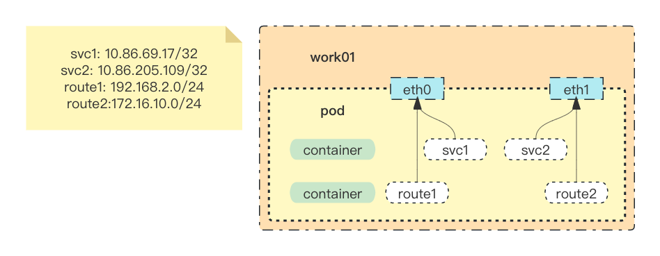
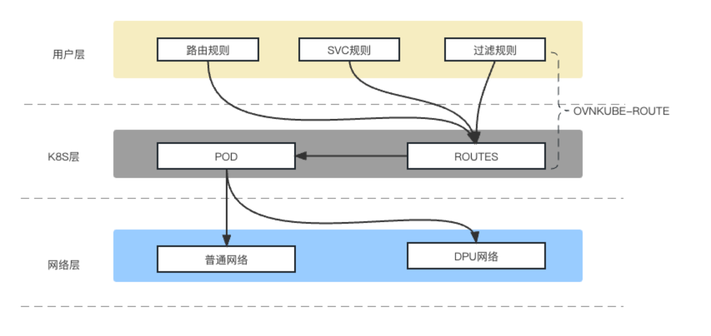

# ovnkube-route开发文档(内核态路由)

## 背景目的

在流量分离双CNI的场景下，实现实时路由下发，控制SVC服务从指定CNI网络出去；

双CNI方案架构：

1.  Calico作为默认网络，承载管理流量与非低延时业务流量；
    
2.  OVN-Kubernetes作为第二网络，承载低延时业务流量；
    

## 最终路由

路由最终效果展示：eth0: 为calico 网络，eth1: 为OVN网络

    Kernel IP routing table
    Destination     Gateway         Genmask         Flags Metric Ref    Use Iface
    0.0.0.0         169.254.1.1     0.0.0.0         UG    0      0        0 eth0
    10.86.69.17     0.0.0.0         255.255.255.255 UH    0      0        0 eth0
    10.86.205.109   0.0.0.0         255.255.255.255 UH    0      0        0 eth1
    10.124.0.0      10.124.2.1      255.255.0.0     UG    0      0        0 eth1
    10.124.2.0      0.0.0.0         255.255.255.0   U     0      0        0 eth1
    169.254.1.1     0.0.0.0         255.255.255.255 UH    0      0        0 eth0
    172.16.10.0     0.0.0.0         255.255.255.0   U     0      0        0 eth1
    192.168.2.0     0.0.0.0         255.255.255.0   U     0      0        0 eth0

路由解释：

1.  默认路由0.0.0.0 走calico网络eth0
    
2.  SVC网段10.86.0.0/16走calico 网络，不用配置，走默认路由即可实现
    
3.  单一SVC：10.86.69.17/32走calico网络eth0
    
4.  单一SVC：10.86.205.109/32走OVN网络eth1
    
5.  OVN段10.124.0.0/16， 10.124.2.0/24走OVN网络eth1
    
6.  自定义网段172.16.10.0/24 走OVN网络eth1
    
7.  自定义网段192.168.2.0/24 走calico网络eth0
    

## 研发需求

#### 路由配置需求：

*   ~~默认路由为calico网络（ovn-k8s组件来实现）~~
    
*   ~~svc整段出calico网络（ovn-k8s组件来实现）~~
    
*   单一SVC可实时配置走不同网络calico or ovn
    
*   自定义网段可实时配置走不同网络calico or ovn
    
*   支持修改默认路由
    

#### 配置文件需求：

*   支持json，yaml格式：eg: cr-config.yaml, cr-config.json
    
*   支持SVC名称写法：eg: {"svc": "<namespace>/<svc name>", "dev": "网卡名"} ,   {"svc": "default/nginx1", "dev": "eth0"} 
    
*   支持网段写法：eg: {"route":"172.16.0.0/16 ", "dev": "eth1"}
    

#### 路由下发需求：

*   k8s集群中所有pod都下发自定义路由（目前需求）
    
*   pod中无指定网卡，则对应路由不下发（目前需求，无双cni的pod中会出现）
    
*   宿主网络pod 不下发路由（目前需求，hostnetwork 类型pod）
    
*   指定特定pod下发自定义路由
    
*   指定特定namespace中所有pod 下发自定义路由
    
*   指定deploy， ds，sts 对应的所有pod 下发自定义路由
    
*   排除特定pod下发自定义路由
    
*   排除特定namespace中所有pod 下发自定义路由
    

## 技术方案

开发工具：**Kubebuilder@3.4.1，****code-generator@0.24.0**

**相关教程：**

[https://xieys.club/code-generator-crd/](https://xieys.club/code-generator-crd/)

[https://jimmysong.io/kubernetes-handbook/develop/kubebuilder-example.html](https://jimmysong.io/kubernetes-handbook/develop/kubebuilder-example.html)

使用K8S中的crd 实现 路由配置规则定义和管理

使用Kubebuilder 来构建crd资源的 API、Controller

#### api定义

group: k8s.ovn.org

kind: route

version:v1

    ---
    apiVersion: apiextensions.k8s.io/v1
    kind: CustomResourceDefinition
    metadata:
      annotations:
        controller-gen.kubebuilder.io/version: v0.8.0
      creationTimestamp: null
      name: routes.k8s.ovn.org
    spec:
      group: k8s.ovn.org
      names:
        kind: Route
        listKind: RouteList
        plural: routes
        singular: route
      scope: Cluster
      versions:
      - additionalPrinterColumns:
        - jsonPath: .status.status
          name: Route Status
          type: string
        name: v1
        schema:
          openAPIV3Schema:
            description: Route is the Schema for the routes API
            properties:
              apiVersion:
                description: 'APIVersion defines the versioned schema of this representation
                  of an object. Servers should convert recognized schemas to the latest
                  internal value, and may reject unrecognized values. More info: https://git.k8s.io/community/contributors/devel/sig-architecture/api-conventions.md#resources'
                type: string
              kind:
                description: 'Kind is a string value representing the REST resource this
                  object represents. Servers may infer this from the endpoint the client
                  submits requests to. Cannot be updated. In CamelCase. More info: https://git.k8s.io/community/contributors/devel/sig-architecture/api-conventions.md#types-kinds'
                type: string
              metadata:
                type: object
              spec:
                description: RouteSpec defines the desired state of Route
                properties:
                  feature_gate:
                    additionalProperties:
                      type: string
                    type: object
                  route:
                    items:
                      description: RouteRule defines custom route info
                      properties:
                        dev:
                          description: 网卡名称
                          type: string
                        dst:
                          description: 自定义网络段
                          type: string
                        via:
                          description: 网关地址
                          type: string
                      required:
                      - dev
                      - dst
                      type: object
                    type: array
                  svc:
                    items:
                      description: SvcRule defines svc info
                      properties:
                        dev:
                          type: string
                        name:
                          type: string
                        namespace:
                          type: string
                        via:
                          type: string
                      required:
                      - dev
                      - name
                      - namespace
                      - via
                      type: object
                    type: array
                required:
                - route
                - svc
                type: object
              status:
                description: RouteStatus defines the observed state of Route
                properties:
                  status:
                    description: 'INSERT ADDITIONAL STATUS FIELD - define observed state
                      of cluster Important: Run "make" to regenerate code after modifying
                      this file'
                    type: string
                type: object
            type: object
        served: true
        storage: true
        subresources:
          status: {}
    status:
      acceptedNames:
        kind: ""
        plural: ""
      conditions: []
      storedVersions: []

demo

    apiVersion: k8s.ovn.org/v1
    kind: Route
    metadata:
      name: demo
    spec:
      route:
        - dst: "172.16.10.0/24"
          dev: "eth1"
        - dst: "172.16.11.0/24"
          dev: "eth0"
      svc:
        - namespace: "default"
          name: "nginx"
          dev: "eth1"
        - namespace: "kube-system"
          name: "nginx1"
          dev: "eth0"
        - namespace: "kube-system"
          name: "nginx2"
          dev: "eth0"
    

自定义字段信息：

    /*
    Copyright 2023.
    
    Licensed under the Apache License, Version 2.0 (the "License");
    you may not use this file except in compliance with the License.
    You may obtain a copy of the License at
    
        http://www.apache.org/licenses/LICENSE-2.0
    
    Unless required by applicable law or agreed to in writing, software
    distributed under the License is distributed on an "AS IS" BASIS,
    WITHOUT WARRANTIES OR CONDITIONS OF ANY KIND, either express or implied.
    See the License for the specific language governing permissions and
    limitations under the License.
    */
    
    package v1
    
    import (
    	metav1 "k8s.io/apimachinery/pkg/apis/meta/v1"
    )
    
    // EDIT THIS FILE!  THIS IS SCAFFOLDING FOR YOU TO OWN!
    // NOTE: json tags are required.  Any new fields you add must have json tags for the fields to be serialized.
    
    // RouteSpec defines the desired state of Route
    type RouteSpec struct {
    	// INSERT ADDITIONAL SPEC FIELDS - desired state of cluster
    	// Important: Run "make" to regenerate code after modifying this file
    
    	Route []RouteRule `json:"route"`
    	Svc   []SvcRule   `json:"svc"`
    	// +optional
    	FeatureGate map[string]string `json:"feature_gate"` // 可拓展参数，保证crd的扩展性
    }
    
    // RouteRule defines custom route info
    type RouteRule struct {
    	// 自定义网络段
    	Dst string `json:"dst"`
    	// 网卡名称
    	Dev string `json:"dev"`
    	// 网关地址
    	// +optional
    	Via string `json:"via"`
    }
    
    // SvcRule defines svc info
    type SvcRule struct {
    	Namespace string `json:"namespace"`
    	Name      string `json:"name"`
    	Dev       string `json:"dev"`
    	// +optional
    	Via string `json:"via"`
    }
    
    // RouteStatus defines the observed state of Route
    type RouteStatus struct {
    	// INSERT ADDITIONAL STATUS FIELD - define observed state of cluster
    	// Important: Run "make" to regenerate code after modifying this file
    	Status string `json:"status,omitempty"`
    }
    
    //+genclient
    //+k8s:deepcopy-gen:interfaces=k8s.io/apimachinery/pkg/runtime.Object
    //+kubebuilder:object:root=true
    //+kubebuilder:resource:shortName=route
    //+kubebuilder:resource:scope=Cluster
    //+kubebuilder:subresource:status
    //+kubebuilder:printcolumn:name="Route Status",type=string,JSONPath=".status.status"
    
    // Route is the Schema for the routes API
    type Route struct {
    	metav1.TypeMeta   `json:",inline"`
    	metav1.ObjectMeta `json:"metadata,omitempty"`
    
    	Spec   RouteSpec   `json:"spec,omitempty"`
    	Status RouteStatus `json:"status,omitempty"`
    }
    
    //+kubebuilder:object:root=true
    // +k8s:deepcopy-gen:interfaces=k8s.io/apimachinery/pkg/runtime.Object
    
    // RouteList contains a list of Route
    type RouteList struct {
    	metav1.TypeMeta `json:",inline"`
    	metav1.ListMeta `json:"metadata,omitempty"`
    	Items           []Route `json:"items"`
    }
    
    func init() {
    	SchemeBuilder.Register(&Route{}, &RouteList{})
    }

#### Controller 定义

    /*
    Copyright 2023.
    
    Licensed under the Apache License, Version 2.0 (the "License");
    you may not use this file except in compliance with the License.
    You may obtain a copy of the License at
    
        http://www.apache.org/licenses/LICENSE-2.0
    
    Unless required by applicable law or agreed to in writing, software
    distributed under the License is distributed on an "AS IS" BASIS,
    WITHOUT WARRANTIES OR CONDITIONS OF ANY KIND, either express or implied.
    See the License for the specific language governing permissions and
    limitations under the License.
    */
    
    package controllers
    
    import (
    	"context"
    
    	"k8s.io/apimachinery/pkg/runtime"
    	ctrl "sigs.k8s.io/controller-runtime"
    	"sigs.k8s.io/controller-runtime/pkg/client"
    	"sigs.k8s.io/controller-runtime/pkg/log"
    )
    
    // RouteReconciler reconciles a Route object
    type RouteReconciler struct {
    	client.Client
    	Scheme *runtime.Scheme
    }
    
    //+kubebuilder:rbac:groups=k8s.ovn.org,resources=routes,verbs=get;list;watch;create;update;patch;delete
    //+kubebuilder:rbac:groups=k8s.ovn.org,resources=routes/status,verbs=get;update;patch
    //+kubebuilder:rbac:groups=k8s.ovn.org,resources=routes/finalizers,verbs=update
    
    // Reconcile is part of the main kubernetes reconciliation loop which aims to
    // move the current state of the cluster closer to the desired state.
    // TODO(user): Modify the Reconcile function to compare the state specified by
    // the Route object against the actual cluster state, and then
    // perform operations to make the cluster state reflect the state specified by
    // the user.
    //
    // For more details, check Reconcile and its Result here:
    // - https://pkg.go.dev/sigs.k8s.io/controller-runtime@v0.11.2/pkg/reconcile
    func (r *RouteReconciler) Reconcile(ctx context.Context, req ctrl.Request) (ctrl.Result, error) {
    	_ = log.FromContext(ctx)
    
    	// TODO(user): your logic here
    
    	return ctrl.Result{}, nil
    }
    
    // SetupWithManager sets up the controller with the Manager.
    func (r *RouteReconciler) SetupWithManager(mgr ctrl.Manager) error {
    	return ctrl.NewControllerManagedBy(mgr).
    		// Uncomment the following line adding a pointer to an instance of the controlled resource as an argument
    		// For().
    		Complete(r)
    }
    

## 技术问题

###### POD的网络NS怎么获取到？

方案1: 在pod启动时候cni创建网络时，把pod对应的ns 写入 pod的annotations eg: POD\_NS: /var/run/netns/cni-219052a8-dc07-14ad-2249-d380a989e501

方案2: 读取/var/lib/cni/results 目录下的\*-lo 结尾的文件信息, 读取pod uid 和 ns 地址

解释：-lo 结尾文件是kubelet 使用 loopback cni组件给pod 添加lo网卡(回环网卡)，每个非hostnetwork的pod都会添加的网卡

    root@yusur-62:/var/lib/cni/results# cat /var/lib/cni/results/cni-loopback-501bfc5a143cef8f0ed14c68112bbb321eae430e2ff3ec40357e226608c1a5cd-lo|jq
    {
      "kind": "cniCacheV1",
      "containerId": "501bfc5a143cef8f0ed14c68112bbb321eae430e2ff3ec40357e226608c1a5cd",
      "config": "ewoiY25pVmVyc2lvbiI6ICIwLjMuMSIsCiJuYW1lIjogImNuaS1sb29wYmFjayIsCiJwbHVnaW5zIjogW3sKICAidHlwZSI6ICJsb29wYmFjayIKfV0KfQ==",
      "ifName": "lo",
      "networkName": "cni-loopback",
      "cniArgs": [
        [
          "K8S_POD_NAMESPACE",
          "kube-system"
        ],
        [
          "K8S_POD_NAME",
          "calico-kube-controllers-7f7bf765bb-whl8g"
        ],
        [
          "K8S_POD_INFRA_CONTAINER_ID",
          "501bfc5a143cef8f0ed14c68112bbb321eae430e2ff3ec40357e226608c1a5cd"
        ],
        [
          "K8S_POD_UID", #pod 的uid
          "174eecc3-58fa-42d1-8501-7f9004a28b76"
        ],
        [
          "IgnoreUnknown",
          "1"
        ]
      ],
      "capabilityArgs": {
        "dns": {
          "Servers": [
            "10.86.0.10"
          ],
          "Searches": [
            "kube-system.svc.cluster.local",
            "svc.cluster.local",
            "cluster.local"
          ],
          "Options": [
            "ndots:5"
          ]
        },
        "io.kubernetes.cri.pod-annotations": {
          "k8s.ovn.org/pod-networks": "{\"default\":{\"ip_addresses\":[\"10.124.0.3/24\"],\"mac_address\":\"0a:58:0a:7c:00:03\",\"gateway_ips\":[\"10.124.0.1\"],\"ip_address\":\"10.124.0.3/24\",\"gateway_ip\":\"10.124.0.1\"}}",
          "kubernetes.io/config.seen": "2023-03-02T16:41:18.088181536+08:00",
          "kubernetes.io/config.source": "api"
        }
      },
      "result": {
        "cniVersion": "0.3.1",
        "dns": {},
        "interfaces": [
          {
            "mac": "00:00:00:00:00:00",
            "name": "lo",
            "sandbox": "/var/run/netns/cni-219052a8-dc07-14ad-2249-d380a989e501" 
            # pod的网络ns地址
          }
        ],
        "ips": [
          {
            "address": "127.0.0.1/8",
            "interface": 0,
            "version": ""
          },
          {
            "address": "::1/128",
            "interface": 0,
            "version": ""
          }
        ]
      }
    }

有效字段：

    [
          "K8S_POD_UID", #pod 的uid
          "174eecc3-58fa-42d1-8501-7f9004a28b76"
        ],
    
    "interfaces": [
          {
            "mac": "00:00:00:00:00:00",
            "name": "lo",
            "sandbox": "/var/run/netns/cni-219052a8-dc07-14ad-2249-d380a989e501" 
            # pod的网络ns地址
          }
        ],

## 代码地址

[http://192.168.2.114/PRD/DSPG/CAPT/ovnkube-route.git](http://192.168.2.114/PRD/DSPG/CAPT/ovnkube-route.git)

## 服务部署

    # 部署方法
    kubectl apply -f deploy/
    
    # 查看效果
    root@yusur-62:~# kubectl  get pod -n ovn-kubernetes | grep route 
    ovnkube-route-77887c678b-9gs6f    1/1     Running   0             16h
    
    # 需要修改crd的manager.yaml 为ds类型

## 系统架构

整个OVNKUBE-ROUTE逻辑层分为两个层面，功能层分为五大模块。

用户层是用户可以根据自身业务需求自定义低延迟业务走DPU网络，非低延迟业务可以走普通网络，提供一种基于用户自身业务层的网络性能优化能力。

功能层api模块首先定义crd资源来实现 路由配置规则定义和管理，controller模块来监听处理k8s集群中crd定义的路由规则资源cr的状态变化如添加，删除等，netlink模块则同步cr资源中路由规则到pod中生成对应的路由规则，而filter模块则是来过滤用户指定k8s哪种资源对象的pod能同步对应路由规则，达到细致化处理不同业务pod的网络使用规划。

API模块：利用K8S的crd功能实现扩展定义k8s的资源类型。

Controller 模块：是监听crd定义资源cr对象的变化控制模块，模块包含如下几个功能。

Netlink 模块：根据cr对象中路由规则和svc规则的变更，对指定POD进行路由规则变更，支持修改默认路由，删除路由，添加路由，类似linux系统命令，ip route 命令操作路由规则。

删除路由类似命令，ip route del 172.16.10.0/24

添加路由类似命令，ip route add 172.16.20.0/24 via 172.16.20.1

Filter 模块：根据cr对象中的过滤规则，进行对指定对象包括pods，deployments，daemonsets，namespaces，jobs，cronjobs等资源进行筛选过滤。

## 拓展工具

#### 进入pod对应的网络ns中

###### 方法1， 利用ip命令

    #!/usr/bin/env bash
    # 进入pod：a , namespace：default 的网络空间，ns a default  退出 exit
    
    mountEnter(){
            POD=$1
            NAMESPACE=$2
            PODID=$(crictl pods --namespace $NAMESPACE --name $POD --no-trunc |awk '{print $1}' |grep -v POD)
            CID=$(crictl ps --no-trunc| grep $PODID | awk 'NR == 1 {print $1}')
            PID=$(crictl inspect $CID | grep pid |awk 'NR == 1 {print $2}'|sed 's/,//g')
            NSMOUNT=$(cat /var/lib/cni/results/cni-loopback-$PODID-lo | jq |grep sandbox |awk '{print $2}'|sed 's/"//g')
            NS=$(echo $NSMOUNT | awk -F/ '{print $5}')
            ip netns exec $NS bash
    }
    
    POD=$1
    NAMESPACE=$2
    mountEnter $1 $2

###### 方法2， 利用nsenter命令

    #!/usr/bin/env bash
    # 进入pod：a , namespace：default 的网络空间，ns a default  退出 exit
    
    pidEnter() {
            POD=$1
            NAMESPACE=$2
            PODID=$(crictl pods --namespace $NAMESPACE --name $POD --no-trunc |awk '{print $1}' |grep -v POD)
            CID=$(crictl ps --no-trunc| grep $PODID | awk 'NR == 1 {print $1}')
            PID=$(crictl inspect $CID | grep pid |awk 'NR == 1 {print $2}'|sed 's/,//g')
            NSMOUNT=$(cat /var/lib/cni/results/cni-loopback-$PODID-lo | jq |grep sandbox |awk '{print $2}'|sed 's/"//g')
            NS=$(echo $NSMOUNT | awk -F/ '{print $5}')
            nsenter -n -t  $PID bash
    }
    
    POD=$1
    NAMESPACE=$2
    
    pidEnter $1 $2

###### 进入ns查看效果

    root@yusur-62:/tmp# ./execns.sh coredns-74586cf9b6-tdbmb kube-system
    root@yusur-62:/tmp# route -n
    Kernel IP routing table
    Destination     Gateway         Genmask         Flags Metric Ref    Use Iface
    0.0.0.0         10.124.1.1      0.0.0.0         UG    0      0        0 eth0
    10.124.0.0      10.124.1.1      255.255.0.0     UG    0      0        0 eth0
    10.124.1.0      0.0.0.0         255.255.255.0   U     0      0        0 eth0
    100.64.0.0      10.124.1.1      255.255.0.0     UG    0      0        0 eth0
