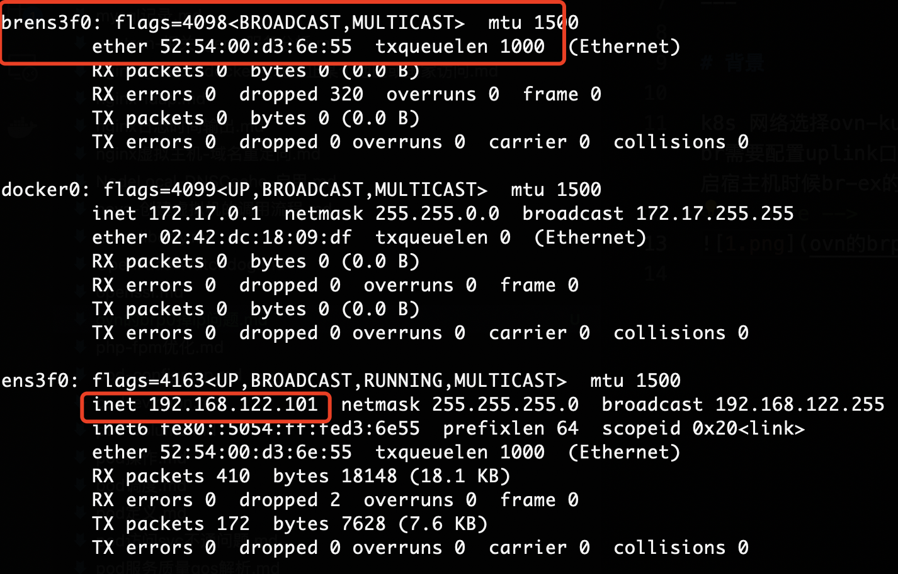
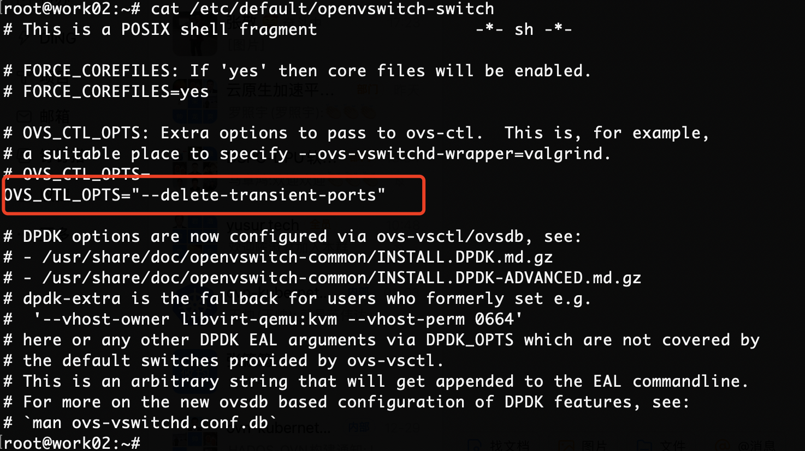

## 问题背景

k8s 网络选择ovn-kubernetes 的时候br-ex br需要配置uplink口(eth0网口)的ip信息，当重启宿主机时候br-ex的ip信息不能自动配置ip
<!-- more -->


## ovn-kubernetes(ovnkube-node)分析

init node 启动代码 start 方法
```go
func bridgeForInterface(intfName, nodeName, physicalNetworkName string, gwIPs []*net.IPNet) (*bridgeConfiguration, error) {
	res := bridgeConfiguration{}
	gwIntf := intfName // ens3f0 网卡名称
	bridgeCreated := false

    
	if bridgeName, _, err := util.RunOVSVsctl("port-to-br", intfName); err == nil {
    // 情况1: 网桥存在brens3f0
    // 判断 ens3f0 是否存在对应的br中(brens3f0)
    // ovs-vsctl port-to-br ens3f0
		// This is an OVS bridge's internal port
		uplinkName, err := util.GetNicName(bridgeName)
		if err != nil {
			return nil, errors.Wrapf(err, "Failed to find nic name for bridge %s", bridgeName)
		}
		res.bridgeName = bridgeName
		res.uplinkName = uplinkName
	} else if _, _, err := util.RunOVSVsctl("br-exists", intfName); err != nil {
        // 情况2: brens3f0 网桥不存在，ensf0不是网桥
        // 判断是否存在 ensf0 网桥
        // ovs-vsctl br-exists ens3f0
		// This is not a OVS bridge. We need to create a OVS bridge
		// and add cluster.GatewayIntf as a port of that bridge.
		bridgeName, err := util.NicToBridge(intfName)
		if err != nil {
			return nil, errors.Wrapf(err, "NicToBridge failed for %s", intfName)
		}
		res.bridgeName = bridgeName
		res.uplinkName = intfName
		gwIntf = bridgeName
		bridgeCreated = true
	} else {
		// gateway interface is an OVS bridge
		uplinkName, err := getIntfName(intfName)
		if err != nil {
			return nil, errors.Wrapf(err, "Failed to find intfName for %s", intfName)
		}
		res.bridgeName = intfName
		res.uplinkName = uplinkName
	}
```
相关ovs命令
```sh
# 情况1:
root@master01:~# ovs-vsctl port-to-br ens3f0
brens3f0

# 情况2:
root@master01:~# ovs-vsctl br-exists ens3f0
```

情况1: 网桥存在brens3f0 分析 uplinkName, err := util.GetNicName(bridgeName)

```go
// GetNicName returns the physical NIC name, given an OVS bridge name
// configured by NicToBridge()
func GetNicName(brName string) (string, error) {
	// Check for system type port (required to be set if using NetworkManager)
	var stdout, stderr string
	portsToInterfaces, err := getBridgePortsInterfaces(brName)
    // 执行ovs命令: 获取brens3f0 网桥所有port
    // ovs-vsctl list-ports brens3f0
	if err != nil {
		return "", err
	}

	// 执行ovs 命令：获取 Interface type 信息
	// ovs-vsctl get Interface ens3f0 Type
	systemPorts := make([]string, 0)
	for port, ifaces := range portsToInterfaces {
		for _, iface := range ifaces {
			stdout, stderr, err = RunOVSVsctl("get", "Interface", strings.TrimSpace(iface), "Type")
			if err != nil {
				return "", fmt.Errorf("failed to get Interface %q Type on bridge %q:, stderr: %q, error: %v",
					iface, brName, stderr, err)

			}
			// If system Type we know this is the OVS port is the NIC
			if stdout == "system" {
				systemPorts = append(systemPorts, port)
			}
		}
	}
	if len(systemPorts) == 1 {
		return systemPorts[0], nil
	} else if len(systemPorts) > 1 {
		klog.Infof("Found more than one system Type ports on the OVS bridge %s, so skipping "+
			"this method of determining the uplink port", brName)
	}

	// 执行ovs命令：获取uplink 口信息
	// ovs-vsctl br-get-external-id brens3f0 bridge-uplink
	// Check for bridge-uplink to indicate the NIC
	stdout, stderr, err = RunOVSVsctl(
		"br-get-external-id", brName, "bridge-uplink")
	if err != nil {
		return "", fmt.Errorf("failed to get the bridge-uplink for the bridge %q:, stderr: %q, error: %v",
			brName, stderr, err)
	}
	if stdout == "" && strings.HasPrefix(brName, "br") {
		// This would happen if the bridge was created before the bridge-uplink
		// changes got integrated. Assuming naming format of "br<nic name>".
		return brName[len("br"):], nil
	}
	return stdout, nil
}
```
相关ovs命令
```sh
root@master01:~# ovs-vsctl list-ports brens3f0
ens3f0
patch-brens3f0_master01-to-br-int

root@master01:~# ovs-vsctl get Interface ens3f0 Type
""

root@master01:~# ovs-vsctl br-get-external-id brens3f0 bridge-uplink
ens3f0

```

情况2: brens3f0 网桥不存在，ensf0不是网桥 bridgeName, err := util.NicToBridge(intfName)
```go
// NicToBridge creates a OVS bridge for the 'iface' and also moves the IP
// address and routes of 'iface' to OVS bridge.
func NicToBridge(iface string) (string, error) {
	ifaceLink, err := netLinkOps.LinkByName(iface)
	if err != nil {
		return "", err
	}

    // 创建新网桥， 名称：br+iface（brens3f0)
	bridge := GetBridgeName(iface)
	stdout, stderr, err := RunOVSVsctl(
		"--", "--may-exist", "add-br", bridge,
		"--", "br-set-external-id", bridge, "bridge-id", bridge,
		"--", "br-set-external-id", bridge, "bridge-uplink", iface,
		"--", "set", "bridge", bridge, "fail-mode=standalone",
		fmt.Sprintf("other_config:hwaddr=%s", ifaceLink.Attrs().HardwareAddr),
		"--", "--may-exist", "add-port", bridge, iface,
		"--", "set", "port", iface, "other-config:transient=true")
	if err != nil {
		klog.Errorf("Failed to create OVS bridge, stdout: %q, stderr: %q, error: %v", stdout, stderr, err)
		return "", err
	}
	klog.Infof("Successfully created OVS bridge %q", bridge)
// /usr/bin/ovs-vsctl --timeout=15 -- --may-exist add-br brens3f0 -- br-set-external-id brens3f0 bridge-id brens3f0 -- br-set-external-id brens3f0 bridge-uplink ens3f0 -- set bridge brens3f0 fail-mode=standalone other_config:hwaddr=52:54:00:02:e6:b9 -- --may-exist add-port brens3f0 ens3f0 -- set port ens3f0 other-config:transient=true

// 设置ovs的默认启动参数
	setupDefaultFile()

	// Get ip addresses and routes before any real operations.
	family := syscall.AF_UNSPEC
	addrs, err := netLinkOps.AddrList(ifaceLink, family)
	if err != nil {
		return "", err
	}
	routes, err := netLinkOps.RouteList(ifaceLink, family)
	if err != nil {
		return "", err
	}

	bridgeLink, err := netLinkOps.LinkByName(bridge)
	if err != nil {
		return "", err
	}

    // 设置ens3f0 的 ip 给 brens3f0 网桥
    // addr "192.168.122.10/24 brens3f0" to newLink "brens3f0"
	// set ip addresses to bridge. DONOT remove iface ip from the external interface
	if err = setIPAddrBridgeIPAddr(bridgeLink, addrs); err != nil {
		return "", err
	}

    // 设置brens3f0 对应的路由信息
    // route "{Ifindex: 15 Dst: 192.168.122.0/24 Src: 192.168.122.10 Gw: <nil> Flags: [] Table: 254}"
	// save routes to bridge.
	if err = saveRoute(ifaceLink, bridgeLink, routes); err != nil {
		return "", err
	}

	return bridge, nil
}
```

相关ovs命令
```sh
root@work01:~# ovs-vsctl --timeout=15 -- --may-exist add-br brens3f0 -- br-set-external-id brens3f0 bridge-id brens3f0 -- br-set-external-id brens3f0 bridge-uplink ens3f0 -- set bridge brens3f0 fail-mode=standalone other_config:hwaddr=52:54:00:02:e6:b9 -- --may-exist add-port brens3f0 ens3f0 -- set port ens3f0 other-config:transient=true

# 设置brens3f0 ip
# addr "192.168.122.10/24 brens3f0" to newLink "brens3f0"

# 设置路由
# route "{Ifindex: 15 Dst: 192.168.122.0/24 Src: 192.168.122.10 Gw: <nil> Flags: [] Table: 254}"
```

默认启动项添加分析
```go
func setupDefaultFile() {
	platform, err := runningPlatform()
	if err != nil {
		klog.Errorf("Failed to set OVS package default file (%v)", err)
		return
	}

	var defaultFile, text string
	if platform == ubuntu {
		defaultFile = ubuntuDefaultFile
        // ubuntu 系统的 /etc/default/openvswitch-switch 文件中
        // 添加 OVS_CTL_OPTS="$OVS_CTL_OPTS --delete-transient-ports"
        // 启动参数
		text = "OVS_CTL_OPTS=\"$OVS_CTL_OPTS --delete-transient-ports\""
	} else if platform == rhel {
		defaultFile = rhelDefaultFile
        // rhel 系统的/etc/default/openvswitch 文件中
        // 添加 OPTIONS=--delete-transient-ports
        // 启动参数
		text = "OPTIONS=--delete-transient-ports"
	} else {
		return
	}

	fileContents, err := ioutil.ReadFile(defaultFile)
	if err != nil {
		klog.Warningf("Failed to parse file %s (%v)",
			defaultFile, err)
		return
	}

	ss := strings.Split(string(fileContents), "\n")
	for _, line := range ss {
		if strings.Contains(line, "--delete-transient-ports") {
			// Nothing to do
			return
		}
	}

	// The defaultFile does not contain '--delete-transient-ports' set.
	// We should set it.
	f, err := os.OpenFile(defaultFile, os.O_APPEND|os.O_WRONLY, 0o644)
	if err != nil {
		klog.Errorf("Failed to open %s to write (%v)", defaultFile, err)
		return
	}
	defer f.Close()

	if _, err = f.WriteString(text); err != nil {
		klog.Errorf("Failed to write to %s (%v)",
			defaultFile, err)
		return
	}
}
```
***注意：ubuntu 系统添加参数不对 OVS_CTL_OPTS="$OVS_CTL_OPTS --delete-transient-ports" ==》 改为OVS_CTL_OPTS="--delete-transient-ports"***

## ovs 分析

ovs 的 --delete-transient-ports 参数介绍
```sh
If the --delete-transient-ports option was used, deletes  all  ports
          that have other_config:transient set to true.
```

ovs 启动脚步 --delete-transient-ports 参数用法介绍
```sh
# 查看ovs的启动脚步，cat /usr/share/openvswitch/scripts/ovs-ctl 
case $command in
    start)
        start_ovsdb || exit 1 # 启动 ovsdb-server 
        start_forwarding || exit 1 # 启动 ovs-vswitchd
        add_managers
        ;;
    stop)
        stop_forwarding
        stop_ovsdb
        ;;

# 启动ovsdb
do_start_ovsdb () {
        start_daemon "$OVSDB_SERVER_PRIORITY" "$OVSDB_SERVER_WRAPPER" "$@" \
            || return 1

        # Initialize database settings.
        ovs_vsctl -- init -- set Open_vSwitch . db-version="$schemaver" \
            || return 1
        set_system_ids || return 1
        if test X"$DELETE_BRIDGES" = Xyes; then
            for bridge in `ovs_vsctl list-br`; do
                ovs_vsctl del-br $bridge
            done
        fi
        if test X"$DELETE_TRANSIENT_PORTS" = Xyes; then
            del_transient_ports
        fi  
}
# 删除port
del_transient_ports () {
    for port in `ovs-vsctl --bare -- --columns=name find port other_config:transient=true`; do
        ovs_vsctl -- del-port "$port"
    done
}
#启动完ovsdb-server 后
#根据 $DELETE_BRIDGES(--delete-bridges) 参数删除所有br
#根据 $DELETE_TRANSIENT_PORTS(--delete-transient-ports) 删除other_config:transient=true 的port
```

## 解决方法
***总结：ovs设置--delete-transient-ports 启动参数可以解决 br ip丢失问题***

ubuntu系统修改/etc/default/openvswitch-switch 


ovs和ovnkube-node执行逻辑梳理
>1. 根据ovnkube-node 代码分析只有出现 ens3f0 网卡不在对应的brens3f0中时候(也是情况2)的条件下，添加ens3f0 port 到brens3f0中，并给brens3f0 网桥设置ip和route 信息
>2. setupDefaultFile 方法配置的 ovs启动参数 --delete-transient-ports 得知ovs启动会清理other-config:transient=true的port
>3. 在添加 ens3f0 到 brens3f0 网桥时候会给 ens3f0 port 标记other-config:transient=true 信息
>4. 当节点重启后
>5. ovs服务在启动完ovsdb-server 后 会根据--delete-transient-ports 参数删除other-config:transient=true 的port（ens3f0）从brens3f0 桥中
>6. ovnkube-node 容器启动时候，会校验 ens3f0 port是否在brens3f0 桥中
>7. ens3f0 port 已经被删除，所有校验失败，执行情况2 添加ens3f0 port 到brens3f0中，并给brens3f0 网桥设置ip和route 信息