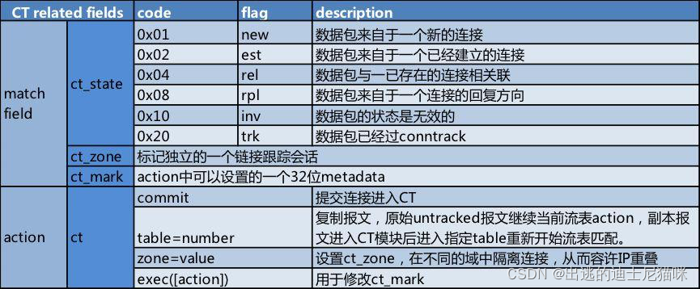

### OSI模型第二层【数据链路层】

_dl_ _即是_ _data link_ _的缩写。_

#### dl\_type=ethertype

匹配以太网协议类型以太类型，以10到65535之间的整数（包括0和65535）指定，以十进制或以0x前缀的十六进制数表示，示例如下。

*   dl\_type=0x0800 匹配IPv4数据包，等同于dl\_type=ip 。
    
*   dl\_type=0x086dd 匹配IPv6数据包，等同于dl\_type=ipv6 。
    
*   dl\_type=0x0806 匹配ARP数据包，等同于dl\_type=arp 。
    
*   dl\_type=0x8035 匹配RARP数据包，等同于 dl\_type=rarp。
    
<!-- more -->

#### dl\_vlan=vlan

数据包的 VLAN Tag 值，范围是 0-4095，0xffff 代表不包含 VLAN Tag 的数据包

#### dl\_vlan\_pcp=priority

VLAN 优先级，取值区间为[0-7]。数字越大，表示优先级越高。

#### dl\_src=xx:xx:xx:xx:xx:xx

#### dl\_dst=xx:xx:xx:xx:xx:xx

源或目的的 MAC地址

*   地址01:00:00:00:00:00/01:00:00:00:00:00 代表广播
    
*   地址00:00:00:00:00:00/01:00:00:00:00:00 代表单播
    
*   地址fe:ff:ff:ff:ff:ff 匹配除多播位以外的所有位，基本上不会用到。
    
*   地址ff:ff:ff:ff:ff:ff 完全匹配（等同于省略子网掩码）。
    
*   地址00:00:00:00:00:00 匹配全部位（等同于 dl\_dst=\*）。
    

zone: 表示ct的区域

    config.Default.ConntrackZone //64000
    HostMasqCTZone     = config.Default.ConntrackZone + 1 //64001 host区域
    OVNMasqCTZone      = HostMasqCTZone + 1               //64002 ovn区域
    HostNodePortCTZone = config.Default.ConntrackZone + 3 //64003 nodeport区域



### ovn-k8s 的 brens3f2(brp0) 网桥中的流表分析

```sh
#查看信息

root@work02:~# ovs-vsctl  show 

89531dd2-795e-4072-bd31-803e740041e7

    Bridge br-int

        fail\_mode: secure

        datapath\_type: system

        Port patch-br-int-to-brens3f2\_work02

            Interface patch-br-int-to-brens3f2\_work02

                type: patch

                options: {peer=patch-brens3f2\_work02-to-br-int}

        Port ovn-bfec55-0

            Interface ovn-bfec55-0

                type: vxlan

                options: {csum="true", key=flow, remote\_ip="192.168.122.10"}

        Port ovn-eca30b-0

            Interface ovn-eca30b-0

                type: vxlan

                options: {csum="true", key=flow, remote\_ip="192.168.122.101"}

        Port "7ac47439675847a"

            Interface "7ac47439675847a"

        Port br-int

            Interface br-int

                type: internal

        Port ovn-k8s-mp0

            Interface ovn-k8s-mp0

                type: internal

    Bridge brens3f2

        fail\_mode: standalone

        Port ens3f2

            Interface ens3f2

        Port patch-brens3f2\_work02-to-br-int

            Interface patch-brens3f2\_work02-to-br-int

                type: patch

                options: {peer=patch-br-int-to-brens3f2\_work02}

        Port brens3f2

            Interface brens3f2

                type: internal

    ovs\_version: "2.17.3"

#查看flows流表

root@work02:~# ovs-ofctl  dump-flows brens3f2

 cookie=0xdeff105, duration=447743.773s, table=0, n\_packets=0, n\_bytes=0, priority=500,ip,in\_port="patch-brens3f2\_",nw\_src=192.168.200.102,nw\_dst=169.254.169.2 actions=ct(commit,table=4,zone=64001,nat(dst=192.168.200.102))

#table=0 0表第一个表格

#priority 级别500，数字越大级别越大

#ip 匹配协议

#in\_port 流入口port patch-brens3f2\_

#nw\_src 匹配源IPv4 地址，可以使 IP 地址或者域名 192.168.200.102

#nw\_dst 匹配目标IPv4 地址，可以使 IP 地址或者域名 169.254.169.2

#ct开始commit跟踪一个链接，复制数据跳转到表4，设置64001区

#actions "ct"动作将数据报文发送给链接跟踪模块。

支持的参数如下：

commit: 请求链接跟踪模块开始跟踪一个链接。

table=number: 将数据报流水线复制为两份。原始的数据报作为未被跟踪的数据报在当前的动作流水线中继续处理。被复制的数据报被发送到链接跟踪模块，这些数据报会重新回到Openflow流水线中触发后续的处理，但是这些数据报中的ct\_state和其他的ct字段被置位。

zone=value OR zone=src\[start..end\]: 16位的上下文id，其被用于将链接隔离到不同的域，将叠加的网络映射到不同的区域中。zone的默认值为0。设置ct\_zone，在不同的域中隔离链接，从而容许IP重复

nat: 为被跟踪的链接指明地址和端口nat。(作dnat 169.254.169.2 -> 192.168.200.102）

 cookie=0xdeff105, duration=447743.773s, table=0, n\_packets=0, n\_bytes=0, priority=500,ip,in\_port="patch-brens3f2\_",nw\_src=192.168.200.102,nw\_dst=192.168.100.102 actions=ct(commit,table=4,zone=64001)

#ip 匹配协议

#in\_port 流入口port patch-brens3f2\_

#nw\_src 匹配源IPv4 地址，可以使 IP 地址或者域名 192.168.200.102

#nw\_dst 匹配目标IPv4 地址，可以使 IP 地址或者域名 192.168.100.102

#ct开始commit跟踪一个链接，复制数据跳转到表4，设置64001区

 cookie=0xdeff105, duration=447743.773s, table=0, n\_packets=0, n\_bytes=0, priority=500,ip,in\_port="patch-brens3f2\_",nw\_src=192.168.200.102,nw\_dst=192.168.122.102 actions=ct(commit,table=4,zone=64001)

#ip 匹配协议

#in\_port 流入口port patch-brens3f2\_

#nw\_src 匹配源IPv4 地址，可以使 IP 地址或者域名 192.168.200.102

#nw\_dst 匹配目标IPv4 地址，可以使 IP 地址或者域名 192.168.122.102

#ct开始commit跟踪一个链接，复制数据跳转到表4，设置64001区

 cookie=0xdeff105, duration=447743.773s, table=0, n\_packets=0, n\_bytes=0, priority=500,ip,in\_port=LOCAL,nw\_dst=169.254.169.1 actions=ct(table=5,zone=64002,nat)

#ip 匹配协议

#in\_port 流入口port 本地网桥接口brens3f2

#nw\_dst 匹配目标IPv4 地址，可以使 IP 地址或者域名 169.254.169.1 

#ct开始commit跟踪一个链接，复制数据跳转到表5，设置64002区，做nat

 cookie=0xdeff105, duration=447743.773s, table=0, n\_packets=5, n\_bytes=490, priority=500,ip,in\_port=LOCAL,nw\_dst=10.86.0.0/16 actions=ct(commit,table=2,zone=64001,nat(src=169.254.169.2))

#ip 匹配协议

#in\_port 流入口port 本地网桥接口brens3f2

#nw\_dst 匹配目标IPv4 地址，可以使 IP 地址或者域名 10.86.0.0/16  

#ct开始commit跟踪一个链接，复制数据跳转到表2，设置64001区，做nat设置snat为169.254.169.2

 cookie=0xdeff105, duration=447743.773s, table=0, n\_packets=0, n\_bytes=0, priority=500,ip,in\_port="patch-brens3f2\_",nw\_src=10.86.0.0/16,nw\_dst=169.254.169.2 actions=ct(table=3,zone=64001,nat)

#ip 匹配协议

#in\_port 流入口port patch-brens3f2\_

#nw\_src 匹配源IPv4 地址，可以使 IP 地址或者域名 10.86.0.0/16 

#nw\_dst 匹配目标IPv4 地址，可以使 IP 地址或者域名 169.254.169.2

#ct开始commit跟踪一个链接，复制数据跳转到表3，设置64001区，做nat

 cookie=0xdeff105, duration=447743.773s, table=0, n\_packets=0, n\_bytes=0, priority=205,udp,in\_port=ens3f2,dl\_dst=52:54:00:a3:9e:42,tp\_dst=6081 actions=LOCAL

#udp 匹配协议

#in\_port 流入口port ens3f2

#dl\_dst 匹配目标mac，52:54:00:a3:9e:42 （ens3f2，brens3f2 网卡mac地址）

#tp\_dst 匹配目标port，6081 （使用udp 封装数据，端口6081）

#actions 动作为local（一般是转发给本地网桥）

 cookie=0xdeff105, duration=447743.773s, table=0, n\_packets=0, n\_bytes=0, priority=200,udp,in\_port=ens3f2,tp\_dst=6081 actions=NORMAL

#udp 匹配协议

#in\_port 流入口port ens3f2

#tp\_dst 匹配目标port，6081 （使用udp 封装数据，端口6081）

#actions 动作为normal， 动作为normal（转为L2/L3处理流程）

 cookie=0xdeff105, duration=447743.773s, table=0, n\_packets=0, n\_bytes=0, priority=200,udp,in\_port=LOCAL,tp\_dst=6081 actions=output:ens3f2

#udp 匹配协议

#in\_port 流入口port 本地网桥接口brens3f2

#tp\_dst 匹配目标port，6081 （使用udp 封装数据，端口6081）

#actions 输出端口ens3f2， output:port: 输出数据包到指定的端口。port 是指端口的 OpenFlow 端口编号

 cookie=0xdeff105, duration=447743.773s, table=0, n\_packets=4, n\_bytes=392, priority=100,ip,in\_port="patch-brens3f2\_" actions=ct(commit,zone=64000,exec(load:0x1->NXM\_NX\_CT\_MARK\[\])),output:ens3f2

#ip 匹配协议

#in\_port 流入口port patch-brens3f2\_

#nw\_src 匹配源IPv4 地址，可以使 IP 地址或者域名 10.86.0.0/16 

#nw\_dst 匹配目标IPv4 地址，可以使 IP 地址或者域名 169.254.169.2

#ct开始commit跟踪一个链接，设置64000区，输出端口ens3f2网口

 cookie=0xdeff105, duration=447743.773s, table=0, n\_packets=0, n\_bytes=0, priority=100,ip,in\_port=LOCAL actions=ct(commit,zone=64000,exec(load:0x2->NXM\_NX\_CT\_MARK\[\])),output:ens3f2

#ip 匹配协议

#in\_port 流入口port 本地网桥接口brens3f2

#actions ct开始commit跟踪一个链接，设置64000区，输出端口ens3f2网口

#exec 设置ct执行参数load:0x2->NXM\_NX\_CT\_MARK\[\] 设置ct\_mark为0x2

 cookie=0xdeff105, duration=447743.773s, table=0, n\_packets=0, n\_bytes=0, priority=50,ip,in\_port=ens3f2 actions=ct(table=1,zone=64000)

#ip 匹配协议

#in\_port 流入口port ens3f2

#ct开始commit跟踪一个链接，复制数据跳转到表1，设置64000区

 cookie=0xdeff105, duration=447743.773s, table=0, n\_packets=3, n\_bytes=126, priority=10,in\_port=ens3f2,dl\_dst=52:54:00:a3:9e:42 actions=output:"patch-brens3f2\_",LOCAL

#in\_port 流入口port ens3f2

#dl\_dst 匹配目标mac，52:54:00:a3:9e:42 （ens3f2，brens3f2 网卡mac地址）

#ct开始commit跟踪一个链接，复制数据跳转到表1，设置64000区

#actions local 转发给本地网桥， 输出端口为 patch-brens3f2\_

 cookie=0x0, duration=447744.377s, table=0, n\_packets=224667, n\_bytes=11696694, priority=0 actions=NORMAL

#actions=NORMAL 使数据包经过设备的常规L2 / L3处理，正常处理

 cookie=0xdeff105, duration=447743.773s, table=1, n\_packets=0, n\_bytes=0, priority=100,ct\_state=+est+trk,ct\_mark=0x1,ip actions=output:"patch-brens3f2\_"

#table 表1 规则

#ip 匹配协议

#ct\_state 匹配链路状态 ct\_state=+est+trk 匹配已经建立连接,数据包过Conntrack

#ct\_mark 设置0x1 32位的元数据被提交给数据报所对应的链接。其值为ct动作exec的参数。

#actions 输出端口为 patch-brens3f2\_

 cookie=0xdeff105, duration=447743.773s, table=1, n\_packets=0, n\_bytes=0, priority=100,ct\_state=+est+trk,ct\_mark=0x2,ip actions=LOCAL

#table 表1 规则

#ip 匹配协议

#ct\_state 匹配链路状态 ct\_state=+est+trk 匹配已经建立连接,数据包过Conntrack

#ct\_mark 设置0x2 32位的元数据被提交给数据报所对应的链接。其值为ct动作exec的参数。

#actions local转发到本地网桥

 cookie=0xdeff105, duration=447743.773s, table=1, n\_packets=0, n\_bytes=0, priority=100,ct\_state=+rel+trk,ct\_mark=0x1,ip actions=output:"patch-brens3f2\_"

#table 表1 规则

#ip 匹配协议

#ct\_state 匹配链路状态 ct\_state=+rel+trk 匹配已经存在连接相关联,数据包过Conntrack

#ct\_mark 设置0x1 32位的元数据被提交给数据报所对应的链接。其值为ct动作exec的参数。

#actions 输出端口为 patch-brens3f2\_

 cookie=0xdeff105, duration=447743.773s, table=1, n\_packets=0, n\_bytes=0, priority=100,ct\_state=+rel+trk,ct\_mark=0x2,ip actions=LOCAL

#table 表1 规则

#ip 匹配协议

#ct\_state 匹配链路状态 ct\_state=+rel+trk 匹配已经存在连接相关联,数据包过Conntrack

#ct\_mark 设置0x2 32位的元数据被提交给数据报所对应的链接。其值为ct动作exec的参数。

#actions local转发到本地网桥

 cookie=0xdeff105, duration=447743.773s, table=1, n\_packets=0, n\_bytes=0, priority=13,udp,in\_port=ens3f2,tp\_dst=3784 actions=output:"patch-brens3f2\_",LOCAL

#table 表1 规则

#udp 匹配协议

#in\_port 流入口port 本地网桥接口ens3f2

#tp\_dst 匹配目标port，3784 （BFD，端口3784）

#actions 输出端口为 patch-brens3f2\_，local转发到本地网桥

 cookie=0xdeff105, duration=447743.773s, table=1, n\_packets=0, n\_bytes=0, priority=10,dl\_dst=52:54:00:a3:9e:42 actions=LOCAL

#table 表1 规则

#dl\_dst 匹配目标mac：52:54:00:a3:9e:42 （ens3f2，brens3f2 网卡mac地址）

#actions local转发到本地网桥

 cookie=0xdeff105, duration=447743.773s, table=1, n\_packets=0, n\_bytes=0, priority=0 actions=NORMAL

#table 表1 规则

#actions=NORMAL 使数据包经过设备的常规L2 / L3处理，正常处理

 cookie=0xdeff105, duration=11.200s, table=2, n\_packets=5, n\_bytes=490, actions=mod\_dl\_dst:52:54:00:a3:9e:42,output:"patch-brens3f2\_"

#table 表2 规则

#actions 输出端口为 patch-brens3f2\_，mod\_dl\_dst修改目标mac地址为52:54:00:a3:9e:42

 cookie=0xdeff105, duration=11.200s, table=3, n\_packets=0, n\_bytes=0, actions=move:NXM\_OF\_ETH\_DST\[\]->NXM\_OF\_ETH\_SRC\[\],mod\_dl\_dst:52:54:00:a3:9e:42,LOCAL

#table 表3 规则

#actions 将已命名的位从字段dst复制到字段src mod\_dl\_dst修改目标mac地址为52:54:00:a3:9e:42，local转发到本地网桥

 cookie=0xdeff105, duration=447743.772s, table=4, n\_packets=0, n\_bytes=0, ip actions=ct(commit,table=3,zone=64002,nat(src=169.254.169.1))

#table 表4规则

#ip 匹配协议

#actions ct开始commit跟踪一个链接，设置64002区，做nat设置snat为169.254.169.1

 cookie=0xdeff105, duration=447743.772s, table=5, n\_packets=0, n\_bytes=0, ip actions=ct(commit,table=2,zone=64001,nat)

#table 表5规则

#ip 匹配协议

#actions ct开始commit跟踪一个链接，复制数据跳转到表2，设置64001区，做nat
```

### ovn-k8s 的 br-int 网桥中的流表分析

#### resubmit:port

#### resubmit([port],[table])

重新搜索此OpenFlow流表（或由表指定其编号的表），用in_port字段替换为端口（如果指定了port），并执行找到的操作（如果有），以及此流条目中的任何其他操作。

#### vlan_tci=tci[/mask]

匹配修改后的VLAN TCI tci。如果省略mask，则tci是要匹配的确切VLAN TCI；如果指定了mask，则mask中的1位表示tci中的对应位必须完全匹配，而0位通配符表示该位。 tci和mask均为16位值，默认情况下为十进制。使用0x前缀以十六进制指定它们。

对于没有802.1Q标头的数据包，vlan\_tci与之匹配的值为0。否则，它是802.1Q标头中的TCI值，其中CFI位（值为0x1000）被强制为1。

*   vlan\_tci=0仅匹配没有802.1Q标头的数据包。
    
*   vlan\_tci=0xf123匹配VLAN 0x123中标记为优先级7的数据包。
    
*   vlan\_tci=0x1123/0x1fff匹配标记有VLAN 0x123（和任何优先级）的数据包。
    
*   vlan\_tci=0x5000/0xf000匹配标记为优先级2的数据包（在任何VLAN中）。
    
*   vlan\_tci=0/0xfff匹配没有802.1Q标头或带有VLAN 0（和任何优先级）标记的数据包。
    
*   vlan\_tci=0x5000/0xe000匹配没有802.1Q标头或带有优先级2标记的数据包（在任何VLAN中）。
    
*   vlan\_tci=0/0xefff匹配没有802.1Q标头或带有VLAN 0和优先级0标记的数据包。
    

使用dl\_vlan和dl\_vlan\_pcp也可以实现某些匹配可能性。

#### tun_id=tunnel-id[/mask]

#### tunnel_id=tunnel-id[/mask]

匹配隧道标识符tunnel-id。只有通过带有密钥的隧道到达的数据包（例如具有RFC 2890密钥扩展名和非零密钥值的GRE）才会具有非零的隧道ID。如果省略mask，则tunnel-id是要匹配的确切隧道ID；如果指定了mask，则mask中的1位表示tunnel-id中的相应位必须完全匹配，而0位通配符则将该位匹配。

#### arp\_spa=ip[/netmask\]

#### arp\_tpa=ip[/netmask\]

当dl\_type指定ARP或RARP时，arp\_spa和arp\_tpa分别与源和目标IPv4地址匹配。可以将地址指定为IP地址或主机名（例如192.168.1.1或www.example.com）。可选的网络掩码允许将匹配限制为IPv4地址前缀。网络掩码可以指定为点分四边形（例如192.168.1.0/255.255.255.0）或CIDR块（例如192.168.1.0/24）。

#### arp\_sha=xx:xx:xx:xx:xx:xx

#### arp\_tha=xx:xx:xx:xx:xx:xx

当dl\_type指定ARP或RARP时，arp\_sha和arp\_tha分别匹配源和目标硬件地址。地址指定为以冒号分隔的6对十六进制数字（例如00:0A:E4:25:6B:B0）。

#### arp\_sha=xx:xx:xx:xx:xx:xx/xx:xx:xx:xx:xx:xx

#### arp\_tha=xx:xx:xx:xx:xx:xx/xx:xx:xx:xx:xx:xx

当dl\_type指定ARP或RARP时，arp\_sha和arp\_tha分别匹配源和目标硬件地址。地址指定为以冒号分隔的6对十六进制数字（例如00:0A:E4:25:6B:B0），并在斜杠后加上通配符掩码。

#### arp\_op=opcode

当dl\_type指定ARP或RARP时，arp\_op与ARP操作码匹配。只能指定1到255之间的ARP操作码进行匹配。

#### icmp\_type=type

#### icmp\_code=code

当dl\_type和nw\_proto指定ICMP或ICMPv6时，type匹配ICMP类型，而代码匹配ICMP代码。每个参数都指定为介于0和255之间（含两端）的十进制数。

当dl\_type和nw\_proto采用其他值时，这些设置的值将被忽略（请参见上面的流语法）。

#### metadata=value[/mask\]

在元数据字段中完全匹配值或使用可选掩码匹配值。 value和mask是64位整数，默认情况下为十进制（使用0x前缀指定十六进制）。允许使用任意掩码值：掩码中的1位表示值中的对应位必须完全匹配，而该位则使用0位通配符。在Open vSwitch 1.8中添加了对元数据的匹配。

```sh
#查看flows流表表5规则

root@master01:~# ovs-ofctl dump-flows br-int 

 cookie=0x83df61eb, duration=516666.911s, table=0, n\_packets=0, n\_bytes=0, priority=180,vlan\_tci=0x0000/0x1000 actions=conjunction(100,2/2)

 cookie=0x83df61eb, duration=516666.911s, table=0, n\_packets=0, n\_bytes=0, priority=180,conj\_id=100,in\_port="patch-br-int-to",vlan\_tci=0x0000/0x1000 actions=load:0xd->NXM\_NX\_REG11\[\],load:0xe->NXM\_NX\_REG12\[\],load:0x7->OXM\_OF\_METADATA\[\],load:0x2->NXM\_NX\_REG14\[\],mod\_dl\_src:52:54:00:02:e6:d9,resubmit(,8)

 cookie=0x0, duration=516665.727s, table=0, n\_packets=0, n\_bytes=0, priority=105,tun\_id=0x800000/0x800000,in\_port="ovn-69fc44-0" actions=load:0x1->NXM\_NX\_REG15\[15\],move:NXM\_NX\_TUN\_ID\[12..22\]->NXM\_NX\_REG15\[0..10\],move:NXM\_NX\_TUN\_ID\[0..11\]->OXM\_OF\_METADATA\[0..11\],resubmit(,38)

 cookie=0x0, duration=516665.627s, table=0, n\_packets=0, n\_bytes=0, priority=105,tun\_id=0x800000/0x800000,in\_port="ovn-eca30b-0" actions=load:0x1->NXM\_NX\_REG15\[15\],move:NXM\_NX\_TUN\_ID\[12..22\]->NXM\_NX\_REG15\[0..10\],move:NXM\_NX\_TUN\_ID\[0..11\]->OXM\_OF\_METADATA\[0..11\],resubmit(,38)

 cookie=0x848b5a20, duration=516666.934s, table=0, n\_packets=610894, n\_bytes=54665832, priority=100,in\_port="ovn-k8s-mp0" actions=load:0xb->NXM\_NX\_REG13\[\],load:0x8->NXM\_NX\_REG11\[\],load:0x2->NXM\_NX\_REG12\[\],load:0x5->OXM\_OF\_METADATA\[\],load:0x2->NXM\_NX\_REG14\[\],resubmit(,8)

 cookie=0x0, duration=516665.727s, table=0, n\_packets=8, n\_bytes=2262, priority=100,in\_port="ovn-69fc44-0" actions=move:NXM\_NX\_TUN\_ID\[12..23\]->NXM\_NX\_REG15\[0..11\],move:NXM\_NX\_TUN\_ID\[0..11\]->OXM\_OF\_METADATA\[0..11\],resubmit(,38)

 cookie=0x0, duration=516665.627s, table=0, n\_packets=8, n\_bytes=2262, priority=100,in\_port="ovn-eca30b-0" actions=move:NXM\_NX\_TUN\_ID\[12..23\]->NXM\_NX\_REG15\[0..11\],move:NXM\_NX\_TUN\_ID\[0..11\]->OXM\_OF\_METADATA\[0..11\],resubmit(,38)

 cookie=0xfc497f61, duration=516657.435s, table=0, n\_packets=508557, n\_bytes=49520457, priority=100,in\_port="2328014c696cfb7" actions=load:0x6->NXM\_NX\_REG13\[\],load:0x8->NXM\_NX\_REG11\[\],load:0x2->NXM\_NX\_REG12\[\],load:0x5->OXM\_OF\_METADATA\[\],load:0x3->NXM\_NX\_REG14\[\],resubmit(,8)

 cookie=0xc0ac4f38, duration=516666.911s, table=0, n\_packets=1010, n\_bytes=154146, priority=100,in\_port="patch-br-int-to",vlan\_tci=0x0000/0x1000 actions=load:0xd->NXM\_NX\_REG11\[\],load:0xe->NXM\_NX\_REG12\[\],load:0x7->OXM\_OF\_METADATA\[\],load:0x2->NXM\_NX\_REG14\[\],resubmit(,8)

 cookie=0xc0ac4f38, duration=516666.911s, table=0, n\_packets=0, n\_bytes=0, priority=100,in\_port="patch-br-int-to",dl\_vlan=0 actions=strip\_vlan,load:0xd->NXM\_NX\_REG11\[\],load:0xe->NXM\_NX\_REG12\[\],load:0x7->OXM\_OF\_METADATA\[\],load:0x2->NXM\_NX\_REG14\[\],resubmit(,8)

 cookie=0xf8fad2d7, duration=516666.962s, table=8, n\_packets=0, n\_bytes=0, priority=100,metadata=0x5,dl\_src=01:00:00:00:00:00/01:00:00:00:00:00 actions=drop

 cookie=0xf8fad2d7, duration=516666.958s, table=8, n\_packets=0, n\_bytes=0, priority=100,metadata=0x3,dl\_src=01:00:00:00:00:00/01:00:00:00:00:00 actions=drop

 cookie=0xf8fad2d7, duration=516666.958s, table=8, n\_packets=0, n\_bytes=0, priority=100,metadata=0x2,dl\_src=01:00:00:00:00:00/01:00:00:00:00:00 actions=drop

 cookie=0x5407afde, duration=516666.936s, table=8, n\_packets=0, n\_bytes=0, priority=100,metadata=0x1,dl\_src=01:00:00:00:00:00/01:00:00:00:00:00 actions=drop

 cookie=0x5407afde, duration=516666.934s, table=8, n\_packets=0, n\_bytes=0, priority=100,metadata=0x6,dl\_src=01:00:00:00:00:00/01:00:00:00:00:00 actions=drop

 cookie=0xf8fad2d7, duration=516666.921s, table=8, n\_packets=0, n\_bytes=0, priority=100,metadata=0x7,dl\_src=01:00:00:00:00:00/01:00:00:00:00:00 actions=drop

 cookie=0xfc4f3354, duration=516666.962s, table=8, n\_packets=0, n\_bytes=0, priority=100,metadata=0x5,vlan\_tci=0x1000/0x1000 actions=drop

 cookie=0xfc4f3354, duration=516666.958s, table=8, n\_packets=0, n\_bytes=0, priority=100,metadata=0x3,vlan\_tci=0x1000/0x1000 actions=drop

 cookie=0xfc4f3354, duration=516666.958s, table=8, n\_packets=0, n\_bytes=0, priority=100,metadata=0x2,vlan\_tci=0x1000/0x1000 actions=drop

 cookie=0x5407afde, duration=516666.936s, table=8, n\_packets=0, n\_bytes=0, priority=100,metadata=0x1,vlan\_tci=0x1000/0x1000 actions=drop

 cookie=0x5407afde, duration=516666.934s, table=8, n\_packets=0, n\_bytes=0, priority=100,metadata=0x6,vlan\_tci=0x1000/0x1000 actions=drop

 cookie=0xfc4f3354, duration=516666.922s, table=8, n\_packets=0, n\_bytes=0, priority=100,metadata=0x7,vlan\_tci=0x1000/0x1000 actions=drop

 cookie=0xde30b18e, duration=516666.963s, table=8, n\_packets=1165387, n\_bytes=108374792, priority=50,metadata=0x5 actions=load:0->NXM\_NX\_REG10\[12\],resubmit(,73),move:NXM\_NX\_REG10\[12\]->NXM\_NX\_XXREG0\[111\],resubmit(,9)

 cookie=0xde30b18e, duration=516666.958s, table=8, n\_packets=0, n\_bytes=0, priority=50,metadata=0x3 actions=load:0->NXM\_NX\_REG10\[12\],resubmit(,73),move:NXM\_NX\_REG10\[12\]->NXM\_NX\_XXREG0\[111\],resubmit(,9)

 cookie=0xde30b18e, duration=516666.958s, table=8, n\_packets=25, n\_bytes=1958, priority=50,metadata=0x2 actions=load:0->NXM\_NX\_REG10\[12\],resubmit(,73),move:NXM\_NX\_REG10\[12\]->NXM\_NX\_XXREG0\[111\],resubmit(,9)

 cookie=0xde30b18e, duration=516666.921s, table=8, n\_packets=1106, n\_bytes=247672, priority=50,metadata=0x7 actions=load:0->NXM\_NX\_REG10\[12\],resubmit(,73),move:NXM\_NX\_REG10\[12\]->NXM\_NX\_XXREG0\[111\],resubmit(,9)

 cookie=0x8a5acdf, duration=516666.958s, table=8, n\_packets=154, n\_bytes=10856, priority=50,reg14=0x3,metadata=0x1,dl\_dst=01:00:00:00:00:00/01:00:00:00:00:00 actions=load:0xa580a7b0201->NXM\_NX\_XXREG0\[64..111\],resubmit(,9)

 cookie=0xcf506b95, duration=516666.957s, table=8, n\_packets=0, n\_bytes=0, priority=50,reg14=0x4,metadata=0x1,dl\_dst=01:00:00:00:00:00/01:00:00:00:00:00 actions=load:0xa580a7b0001->NXM\_NX\_XXREG0\[64..111\],resubmit(,9)

 cookie=0xd43aa856, duration=516666.957s, table=8, n\_packets=0, n\_bytes=0, priority=50,reg14=0x1,metadata=0x1,dl\_dst=01:00:00:00:00:00/01:00:00:00:00:00 actions=load:0xa5864400001->NXM\_NX\_XXREG0\[64..111\],resubmit(,9)

 cookie=0xd924daf6, duration=516666.957s, table=8, n\_packets=0, n\_bytes=0, priority=50,reg14=0x2,metadata=0x1,dl\_dst=01:00:00:00:00:00/01:00:00:00:00:00 actions=load:0xa580a7b0101->NXM\_NX\_XXREG0\[64..111\],resubmit(,9)

 cookie=0x11d5aec5, duration=516666.934s, table=8, n\_packets=903, n\_bytes=63114, priority=50,reg14=0x2,metadata=0x6,dl\_dst=01:00:00:00:00:00/01:00:00:00:00:00 actions=load:0x52540002e6d9->NXM\_NX\_XXREG0\[64..111\],resubmit(,9)

 cookie=0x1623f0b1, duration=516666.934s, table=8, n\_packets=0, n\_bytes=0, priority=50,reg14=0x1,metadata=0x6,dl\_dst=01:00:00:00:00:00/01:00:00:00:00:00 actions=load:0xa5864400002->NXM\_NX\_XXREG0\[64..111\],resubmit(,9)

 cookie=0xf81b969, duration=516666.958s, table=8, n\_packets=45811, n\_bytes=4175155, priority=50,reg14=0x3,metadata=0x1,dl\_dst=0a:58:0a:7b:02:01 actions=load:0xa580a7b0201->NXM\_NX\_XXREG0\[64..111\],resubmit(,9)

 cookie=0x7487b972, duration=516666.958s, table=8, n\_packets=24, n\_bytes=1916, priority=50,reg14=0x1,metadata=0x1,dl\_dst=0a:58:64:40:00:01 actions=load:0xa5864400001->NXM\_NX\_XXREG0\[64..111\],resubmit(,9)

 cookie=0x5f0d286b, duration=516666.934s, table=8, n\_packets=103, n\_bytes=90864, priority=50,reg14=0x2,metadata=0x6,dl\_dst=52:54:00:02:e6:d9 actions=load:0x52540002e6d9->NXM\_NX\_XXREG0\[64..111\],resubmit(,9)

 cookie=0x92d53e03, duration=516666.934s, table=8, n\_packets=17, n\_bytes=4566, priority=50,reg14=0x1,metadata=0x6,dl\_dst=0a:58:64:40:00:02 actions=load:0xa5864400002->NXM\_NX\_XXREG0\[64..111\],resubmit(,9)

 cookie=0x368fab82, duration=516666.958s, table=9, n\_packets=0, n\_bytes=0, priority=110,arp,reg14=0x1,metadata=0x1,arp\_spa=100.64.0.0/16,arp\_tpa=100.64.0.1,arp\_op=1 actions=push:NXM\_NX\_REG0\[\],push:NXM\_OF\_ETH\_SRC\[\],push:NXM\_NX\_ARP\_SHA\[\],push:NXM\_OF\_ARP\_SPA\[\],pop:NXM\_NX\_REG0\[\],pop:NXM\_OF\_ETH\_SRC\[\],load:0->NXM\_NX\_REG10\[6\],resubmit(,67),move:NXM\_NX\_REG10\[6\]->OXM\_OF\_PKT\_REG4\[2\],pop:NXM\_OF\_ETH\_SRC\[\],pop:NXM\_NX\_REG0\[\],load:0x1->OXM\_OF\_PKT\_REG4\[3\],resubmit(,10)

 cookie=0xc7957151, duration=516666.934s, table=9, n\_packets=0, n\_bytes=0, priority=110,arp,reg14=0x1,metadata=0x6,arp\_spa=100.64.0.0/16,arp\_tpa=100.64.0.2,arp\_op=1 actions=push:NXM\_NX\_REG0\[\],push:NXM\_OF\_ETH\_SRC\[\],push:NXM\_NX\_ARP\_SHA\[\],push:NXM\_OF\_ARP\_SPA\[\],pop:NXM\_NX\_REG0\[\],pop:NXM\_OF\_ETH\_SRC\[\],load:0->NXM\_NX\_REG10\[6\],resubmit(,67),move:NXM\_NX\_REG10\[6\]->OXM\_OF\_PKT\_REG4\[2\],pop:NXM\_OF\_ETH\_SRC\[\],pop:NXM\_NX\_REG0\[\],load:0x1->OXM\_OF\_PKT\_REG4\[3\],resubmit(,10)

 cookie=0x86887091, duration=516666.958s, table=9, n\_packets=0, n\_bytes=0, priority=110,arp,reg14=0x3,metadata=0x1,arp\_spa=10.123.2.0/24,arp\_tpa=10.123.2.1,arp\_op=1 actions=push:NXM\_NX\_REG0\[\],push:NXM\_OF\_ETH\_SRC\[\],push:NXM\_NX\_ARP\_SHA\[\],push:NXM\_OF\_ARP\_SPA\[\],pop:NXM\_NX\_REG0\[\],pop:NXM\_OF\_ETH\_SRC\[\],load:0->NXM\_NX\_REG10\[6\],resubmit(,67),move:NXM\_NX\_REG10\[6\]->OXM\_OF\_PKT\_REG4\[2\],pop:NXM\_OF\_ETH\_SRC\[\],pop:NXM\_NX\_REG0\[\],load:0x1->OXM\_OF\_PKT\_REG4\[3\],resubmit(,10)

 cookie=0xafa2f36f, duration=516666.934s, table=9, n\_packets=0, n\_bytes=0, priority=110,arp,reg14=0x2,metadata=0x6,arp\_spa=192.168.200.0/24,arp\_tpa=192.168.200.10,arp\_op=1 actions=push:NXM\_NX\_REG0\[\],push:NXM\_OF\_ETH\_SRC\[\],push:NXM\_NX\_ARP\_SHA\[\],push:NXM\_OF\_ARP\_SPA\[\],pop:NXM\_NX\_REG0\[\],pop:NXM\_OF\_ETH\_SRC\[\],load:0->NXM\_NX\_REG10\[6\],resubmit(,67),move:NXM\_NX\_REG10\[6\]->OXM\_OF\_PKT\_REG4\[2\],pop:NXM\_OF\_ETH\_SRC\[\],pop:NXM\_NX\_REG0\[\],load:0x1->OXM\_OF\_PKT\_REG4\[3\],resubmit(,10)

 cookie=0x1efeb934, duration=516666.958s, table=9, n\_packets=0, n\_bytes=0, priority=100,arp,reg14=0x1,metadata=0x1,arp\_spa=100.64.0.0/16,arp\_op=1 actions=push:NXM\_NX\_REG0\[\],push:NXM\_OF\_ETH\_SRC\[\],push:NXM\_NX\_ARP\_SHA\[\],push:NXM\_OF\_ARP\_SPA\[\],pop:NXM\_NX\_REG0\[\],pop:NXM\_OF\_ETH\_SRC\[\],load:0->NXM\_NX\_REG10\[6\],resubmit(,67),move:NXM\_NX\_REG10\[6\]->OXM\_OF\_PKT\_REG4\[2\],pop:NXM\_OF\_ETH\_SRC\[\],pop:NXM\_NX\_REG0\[\],push:NXM\_NX\_REG15\[\],push:NXM\_NX\_REG0\[\],push:NXM\_OF\_ARP\_SPA\[\],push:NXM\_NX\_REG14\[\],pop:NXM\_NX\_REG15\[\],pop:NXM\_NX\_REG0\[\],push:NXM\_OF\_ETH\_DST\[\],load:0->NXM\_NX\_REG10\[6\],resubmit(,66),move:NXM\_NX\_REG10\[6\]->OXM\_OF\_PKT\_REG4\[3\],pop:NXM\_OF\_ETH\_DST\[\],pop:NXM\_NX\_REG0\[\],pop:NXM\_NX\_REG15\[\],resubmit(,10)

 cookie=0xe9108eb0, duration=516666.934s, table=9, n\_packets=0, n\_bytes=0, priority=100,arp,reg14=0x1,metadata=0x6,arp\_spa=100.64.0.0/16,arp\_op=1 actions=push:NXM\_NX\_REG0\[\],push:NXM\_OF\_ETH\_SRC\[\],push:NXM\_NX\_ARP\_SHA\[\],push:NXM\_OF\_ARP\_SPA\[\],pop:NXM\_NX\_REG0\[\],pop:NXM\_OF\_ETH\_SRC\[\],load:0->NXM\_NX\_REG10\[6\],resubmit(,67),move:NXM\_NX\_REG10\[6\]->OXM\_OF\_PKT\_REG4\[2\],pop:NXM\_OF\_ETH\_SRC\[\],pop:NXM\_NX\_REG0\[\],push:NXM\_NX\_REG15\[\],push:NXM\_NX\_REG0\[\],push:NXM\_OF\_ARP\_SPA\[\],push:NXM\_NX\_REG14\[\],pop:NXM\_NX\_REG15\[\],pop:NXM\_NX\_REG0\[\],push:NXM\_OF\_ETH\_DST\[\],load:0->NXM\_NX\_REG10\[6\],resubmit(,66),move:NXM\_NX\_REG10\[6\]->OXM\_OF\_PKT\_REG4\[3\],pop:NXM\_OF\_ETH\_DST\[\],pop:NXM\_NX\_REG0\[\],pop:NXM\_NX\_REG15\[\],resubmit(,10)

 cookie=0x7c15b6d1, duration=516666.958s, table=9, n\_packets=0, n\_bytes=0, priority=100,arp,reg14=0x3,metadata=0x1,arp\_spa=10.123.2.0/24,arp\_op=1 actions=push:NXM\_NX\_REG0\[\],push:NXM\_OF\_ETH\_SRC\[\],push:NXM\_NX\_ARP\_SHA\[\],push:NXM\_OF\_ARP\_SPA\[\],pop:NXM\_NX\_REG0\[\],pop:NXM\_OF\_ETH\_SRC\[\],load:0->NXM\_NX\_REG10\[6\],resubmit(,67),move:NXM\_NX\_REG10\[6\]->OXM\_OF\_PKT\_REG4\[2\],pop:NXM\_OF\_ETH\_SRC\[\],pop:NXM\_NX\_REG0\[\],push:NXM\_NX\_REG15\[\],push:NXM\_NX\_REG0\[\],push:NXM\_OF\_ARP\_SPA\[\],push:NXM\_NX\_REG14\[\],pop:NXM\_NX\_REG15\[\],pop:NXM\_NX\_REG0\[\],push:NXM\_OF\_ETH\_DST\[\],load:0->NXM\_NX\_REG10\[6\],resubmit(,66),move:NXM\_NX\_REG10\[6\]->OXM\_OF\_PKT\_REG4\[3\],pop:NXM\_OF\_ETH\_DST\[\],pop:NXM\_NX\_REG0\[\],pop:NXM\_NX\_REG15\[\],resubmit(,10)

 cookie=0x8768de4d, duration=516666.935s, table=9, n\_packets=13, n\_bytes=546, priority=100,arp,reg14=0x2,metadata=0x6,arp\_spa=192.168.200.0/24,arp\_op=1 actions=push:NXM\_NX\_REG0\[\],push:NXM\_OF\_ETH\_SRC\[\],push:NXM\_NX\_ARP\_SHA\[\],push:NXM\_OF\_ARP\_SPA\[\],pop:NXM\_NX\_REG0\[\],pop:NXM\_OF\_ETH\_SRC\[\],load:0->NXM\_NX\_REG10\[6\],resubmit(,67),move:NXM\_NX\_REG10\[6\]->OXM\_OF\_PKT\_REG4\[2\],pop:NXM\_OF\_ETH\_SRC\[\],pop:NXM\_NX\_REG0\[\],push:NXM\_NX\_REG15\[\],push:NXM\_NX\_REG0\[\],push:NXM\_OF\_ARP\_SPA\[\],push:NXM\_NX\_REG14\[\],pop:NXM\_NX\_REG15\[\],pop:NXM\_NX\_REG0\[\],push:NXM\_OF\_ETH\_DST\[\],load:0->NXM\_NX\_REG10\[6\],resubmit(,66),move:NXM\_NX\_REG10\[6\]->OXM\_OF\_PKT\_REG4\[3\],pop:NXM\_OF\_ETH\_DST\[\],pop:NXM\_NX\_REG0\[\],pop:NXM\_NX\_REG15\[\],resubmit(,10)

 cookie=0xa6ce12e2, duration=516666.937s, table=9, n\_packets=0, n\_bytes=0, priority=100,icmp6,metadata=0x1,nw\_ttl=255,icmp\_type=136,icmp\_code=0 actions=push:NXM\_NX\_XXREG0\[\],push:NXM\_OF\_ETH\_SRC\[\],push:NXM\_NX\_ND\_TLL\[\],push:NXM\_NX\_ND\_TARGET\[\],pop:NXM\_NX\_XXREG0\[\],pop:NXM\_OF\_ETH\_SRC\[\],load:0->NXM\_NX\_REG10\[6\],resubmit(,67),move:NXM\_NX\_REG10\[6\]->OXM\_OF\_PKT\_REG4\[2\],pop:NXM\_OF\_ETH\_SRC\[\],pop:NXM\_NX\_XXREG0\[\],load:0x1->OXM\_OF\_PKT\_REG4\[3\],resubmit(,10)

 cookie=0xaae0d4bf, duration=516666.936s, table=9, n\_packets=1, n\_bytes=86, priority=100,icmp6,metadata=0x1,nw\_ttl=255,icmp\_type=135,icmp\_code=0 actions=push:NXM\_NX\_XXREG0\[\],push:NXM\_OF\_ETH\_SRC\[\],push:NXM\_NX\_ND\_SLL\[\],push:NXM\_NX\_IPV6\_SRC\[\],pop:NXM\_NX\_XXREG0\[\],pop:NXM\_OF\_ETH\_SRC\[\],load:0->NXM\_NX\_REG10\[6\],resubmit(,67),move:NXM\_NX\_REG10\[6\]->OXM\_OF\_PKT\_REG4\[2\],pop:NXM\_OF\_ETH\_SRC\[\],pop:NXM\_NX\_XXREG0\[\],push:NXM\_NX\_REG15\[\],push:NXM\_NX\_XXREG0\[\],push:NXM\_NX\_IPV6\_SRC\[\],push:NXM\_NX\_REG14\[\],pop:NXM\_NX\_REG15\[\],pop:NXM\_NX\_XXREG0\[\],push:NXM\_OF\_ETH\_DST\[\],load:0->NXM\_NX\_REG10\[6\],resubmit(,66),move:NXM\_NX\_REG10\[6\]->OXM\_OF\_PKT\_REG4\[3\],pop:NXM\_OF\_ETH\_DST\[\],pop:NXM\_NX\_XXREG0\[\],pop:NXM\_NX\_REG15\[\],resubmit(,10)

 cookie=0xa6ce12e2, duration=516666.934s, table=9, n\_packets=0, n\_bytes=0, priority=100,icmp6,metadata=0x6,nw\_ttl=255,icmp\_type=136,icmp\_code=0 actions=push:NXM\_NX\_XXREG0\[\],push:NXM\_OF\_ETH\_SRC\[\],push:NXM\_NX\_ND\_TLL\[\],push:NXM\_NX\_ND\_TARGET\[\],pop:NXM\_NX\_XXREG0\[\],pop:NXM\_OF\_ETH\_SRC\[\],load:0->NXM\_NX\_REG10\[6\],resubmit(,67),move:NXM\_NX\_REG10\[6\]->OXM\_OF\_PKT\_REG4\[2\],pop:NXM\_OF\_ETH\_SRC\[\],pop:NXM\_NX\_XXREG0\[\],load:0x1->OXM\_OF\_PKT\_REG4\[3\],resubmit(,10)

 cookie=0xaae0d4bf, duration=516666.934s, table=9, n\_packets=3, n\_bytes=258, priority=100,icmp6,metadata=0x6,nw\_ttl=255,icmp\_type=135,icmp\_code=0 actions=push:NXM\_NX\_XXREG0\[\],push:NXM\_OF\_ETH\_SRC\[\],push:NXM\_NX\_ND\_SLL\[\],push:NXM\_NX\_IPV6\_SRC\[\],pop:NXM\_NX\_XXREG0\[\],pop:NXM\_OF\_ETH\_SRC\[\],load:0->NXM\_NX\_REG10\[6\],resubmit(,67),move:NXM\_NX\_REG10\[6\]->OXM\_OF\_PKT\_REG4\[2\],pop:NXM\_OF\_ETH\_SRC\[\],pop:NXM\_NX\_XXREG0\[\],push:NXM\_NX\_REG15\[\],push:NXM\_NX\_XXREG0\[\],push:NXM\_NX\_IPV6\_SRC\[\],push:NXM\_NX\_REG14\[\],pop:NXM\_NX\_REG15\[\],pop:NXM\_NX\_XXREG0\[\],push:NXM\_OF\_ETH\_DST\[\],load:0->NXM\_NX\_REG10\[6\],resubmit(,66),move:NXM\_NX\_REG10\[6\]->OXM\_OF\_PKT\_REG4\[3\],pop:NXM\_OF\_ETH\_DST\[\],pop:NXM\_NX\_XXREG0\[\],pop:NXM\_NX\_REG15\[\],resubmit(,10)

 cookie=0x3b6bece6, duration=516666.937s, table=9, n\_packets=0, n\_bytes=0, priority=100,arp,metadata=0x1,arp\_op=2 actions=push:NXM\_NX\_REG0\[\],push:NXM\_OF\_ETH\_SRC\[\],push:NXM\_NX\_ARP\_SHA\[\],push:NXM\_OF\_ARP\_SPA\[\],pop:NXM\_NX\_REG0\[\],pop:NXM\_OF\_ETH\_SRC\[\],load:0->NXM\_NX\_REG10\[6\],resubmit(,67),move:NXM\_NX\_REG10\[6\]->OXM\_OF\_PKT\_REG4\[2\],pop:NXM\_OF\_ETH\_SRC\[\],pop:NXM\_NX\_REG0\[\],load:0x1->OXM\_OF\_PKT\_REG4\[3\],resubmit(,10)

 cookie=0x3b6bece6, duration=516666.935s, table=9, n\_packets=5, n\_bytes=210, priority=100,arp,metadata=0x6,arp\_op=2 actions=push:NXM\_NX\_REG0\[\],push:NXM\_OF\_ETH\_SRC\[\],push:NXM\_NX\_ARP\_SHA\[\],push:NXM\_OF\_ARP\_SPA\[\],pop:NXM\_NX\_REG0\[\],pop:NXM\_OF\_ETH\_SRC\[\],load:0->NXM\_NX\_REG10\[6\],resubmit(,67),move:NXM\_NX\_REG10\[6\]->OXM\_OF\_PKT\_REG4\[2\],pop:NXM\_OF\_ETH\_SRC\[\],pop:NXM\_NX\_REG0\[\],load:0x1->OXM\_OF\_PKT\_REG4\[3\],resubmit(,10)

 cookie=0x9cdebcad, duration=516666.963s, table=9, n\_packets=163, n\_bytes=11582, priority=50,reg0=0x8000/0x8000,metadata=0x5 actions=drop

 cookie=0x9cdebcad, duration=516666.958s, table=9, n\_packets=0, n\_bytes=0, priority=50,reg0=0x8000/0x8000,metadata=0x3 actions=drop

 cookie=0x9cdebcad, duration=516666.958s, table=9, n\_packets=0, n\_bytes=0, priority=50,reg0=0x8000/0x8000,metadata=0x2 actions=drop

 cookie=0x9cdebcad, duration=516666.922s, table=9, n\_packets=0, n\_bytes=0, priority=50,reg0=0x8000/0x8000,metadata=0x7 actions=drop

 cookie=0xd38caa84, duration=516666.963s, table=9, n\_packets=1165224, n\_bytes=108363210, priority=0,metadata=0x5 actions=resubmit(,10)

 cookie=0xd38caa84, duration=516666.958s, table=9, n\_packets=0, n\_bytes=0, priority=0,metadata=0x3 actions=resubmit(,10)

 cookie=0xd38caa84, duration=516666.958s, table=9, n\_packets=25, n\_bytes=1958, priority=0,metadata=0x2 actions=resubmit(,10)

 cookie=0x73be89d8, duration=516666.936s, table=9, n\_packets=45988, n\_bytes=4187841, priority=0,metadata=0x1 actions=load:0x1->OXM\_OF\_PKT\_REG4\[2\],resubmit(,10)

 cookie=0x73be89d8, duration=516666.935s, table=9, n\_packets=1002, n\_bytes=157530, priority=0,metadata=0x6 actions=load:0x1->OXM\_OF\_PKT\_REG4\[2\],resubmit(,10)

 cookie=0xd38caa84, duration=516666.921s, table=9, n\_packets=1106, n\_bytes=247672, priority=0,metadata=0x7 actions=resubmit(,10)

 cookie=0x6e798d0a, duration=516666.937s, table=10, n\_packets=45989, n\_bytes=4187927, priority=100,reg9=0/0x8,metadata=0x1 actions=resubmit(,11)

 cookie=0x6e798d0a, duration=516666.934s, table=10, n\_packets=1018, n\_bytes=158334, priority=100,reg9=0/0x8,metadata=0x6 actions=resubmit(,11)

 cookie=0x6e798d0a, duration=516666.936s, table=10, n\_packets=0, n\_bytes=0, priority=100,reg9=0x4/0x4,metadata=0x1 actions=resubmit(,11)

 cookie=0x6e798d0a, duration=516666.934s, table=10, n\_packets=3, n\_bytes=126, priority=100,reg9=0x4/0x4,metadata=0x6 actions=resubmit(,11)

 cookie=0x4ba7fcc, duration=516666.937s, table=10, n\_packets=0, n\_bytes=0, priority=95,icmp6,metadata=0x1,nw\_ttl=255,icmp\_type=136,icmp\_code=0,nd\_tll=00:00:00:00:00:00 actions=push:NXM\_NX\_XXREG0\[\],push:NXM\_NX\_ND\_TARGET\[\],pop:NXM\_NX\_XXREG0\[\],controller(userdata=00.00.00.04.00.00.00.00),pop:NXM\_NX\_XXREG0\[\],resubmit(,11)

 cookie=0x4ba7fcc, duration=516666.934s, table=10, n\_packets=0, n\_bytes=0, priority=95,icmp6,metadata=0x6,nw\_ttl=255,icmp\_type=136,icmp\_code=0,nd\_tll=00:00:00:00:00:00 actions=push:NXM\_NX\_XXREG0\[\],push:NXM\_NX\_ND\_TARGET\[\],pop:NXM\_NX\_XXREG0\[\],controller(userdata=00.00.00.04.00.00.00.00),pop:NXM\_NX\_XXREG0\[\],resubmit(,11)

 cookie=0x846685c1, duration=516666.937s, table=10, n\_packets=0, n\_bytes=0, priority=95,icmp6,metadata=0x1,ipv6\_src=::,nw\_ttl=255,icmp\_type=135,icmp\_code=0 actions=resubmit(,11)

 cookie=0x846685c1, duration=516666.934s, table=10, n\_packets=0, n\_bytes=0, priority=95,icmp6,metadata=0x6,ipv6\_src=::,nw\_ttl=255,icmp\_type=135,icmp\_code=0 actions=resubmit(,11)

 cookie=0x846685c1, duration=516666.937s, table=10, n\_packets=0, n\_bytes=0, priority=95,icmp6,metadata=0x1,nw\_ttl=255,icmp\_type=135,icmp\_code=0,nd\_sll=00:00:00:00:00:00 actions=resubmit(,11)

 cookie=0x846685c1, duration=516666.934s, table=10, n\_packets=0, n\_bytes=0, priority=95,icmp6,metadata=0x6,nw\_ttl=255,icmp\_type=135,icmp\_code=0,nd\_sll=00:00:00:00:00:00 actions=resubmit(,11)

 cookie=0xad274bdf, duration=516666.937s, table=10, n\_packets=0, n\_bytes=0, priority=90,icmp6,metadata=0x1,nw\_ttl=255,icmp\_type=135,icmp\_code=0 actions=push:NXM\_NX\_XXREG0\[\],push:NXM\_OF\_ETH\_SRC\[\],push:NXM\_NX\_ND\_SLL\[\],push:NXM\_NX\_IPV6\_SRC\[\],pop:NXM\_NX\_XXREG0\[\],pop:NXM\_OF\_ETH\_SRC\[\],controller(userdata=00.00.00.04.00.00.00.00),pop:NXM\_OF\_ETH\_SRC\[\],pop:NXM\_NX\_XXREG0\[\],resubmit(,11)

 cookie=0x379a83f8, duration=516666.936s, table=10, n\_packets=0, n\_bytes=0, priority=90,icmp6,metadata=0x1,nw\_ttl=255,icmp\_type=136,icmp\_code=0 actions=push:NXM\_NX\_XXREG0\[\],push:NXM\_OF\_ETH\_SRC\[\],push:NXM\_NX\_ND\_TLL\[\],push:NXM\_NX\_ND\_TARGET\[\],pop:NXM\_NX\_XXREG0\[\],pop:NXM\_OF\_ETH\_SRC\[\],controller(userdata=00.00.00.04.00.00.00.00),pop:NXM\_OF\_ETH\_SRC\[\],pop:NXM\_NX\_XXREG0\[\],resubmit(,11)

 cookie=0xad274bdf, duration=516666.934s, table=10, n\_packets=0, n\_bytes=0, priority=90,icmp6,metadata=0x6,nw\_ttl=255,icmp\_type=135,icmp\_code=0 actions=push:NXM\_NX\_XXREG0\[\],push:NXM\_OF\_ETH\_SRC\[\],push:NXM\_NX\_ND\_SLL\[\],push:NXM\_NX\_IPV6\_SRC\[\],pop:NXM\_NX\_XXREG0\[\],pop:NXM\_OF\_ETH\_SRC\[\],controller(userdata=00.00.00.04.00.00.00.00),pop:NXM\_OF\_ETH\_SRC\[\],pop:NXM\_NX\_XXREG0\[\],resubmit(,11)

 cookie=0x379a83f8, duration=516666.934s, table=10, n\_packets=0, n\_bytes=0, priority=90,icmp6,metadata=0x6,nw\_ttl=255,icmp\_type=136,icmp\_code=0 actions=push:NXM\_NX\_XXREG0\[\],push:NXM\_OF\_ETH\_SRC\[\],push:NXM\_NX\_ND\_TLL\[\],push:NXM\_NX\_ND\_TARGET\[\],pop:NXM\_NX\_XXREG0\[\],pop:NXM\_OF\_ETH\_SRC\[\],controller(userdata=00.00.00.04.00.00.00.00),pop:NXM\_OF\_ETH\_SRC\[\],pop:NXM\_NX\_XXREG0\[\],resubmit(,11)

 cookie=0x5bfa8029, duration=516666.958s, table=10, n\_packets=0, n\_bytes=0, priority=90,arp,metadata=0x1 actions=push:NXM\_NX\_REG0\[\],push:NXM\_OF\_ETH\_SRC\[\],push:NXM\_NX\_ARP\_SHA\[\],push:NXM\_OF\_ARP\_SPA\[\],pop:NXM\_NX\_REG0\[\],pop:NXM\_OF\_ETH\_SRC\[\],controller(userdata=00.00.00.01.00.00.00.00),pop:NXM\_OF\_ETH\_SRC\[\],pop:NXM\_NX\_REG0\[\],resubmit(,11)

 cookie=0x71585b2b, duration=516665.566s, table=10, n\_packets=2, n\_bytes=84, priority=90,arp,metadata=0x6 actions=push:NXM\_NX\_REG0\[\],push:NXM\_OF\_ETH\_SRC\[\],push:NXM\_NX\_ARP\_SHA\[\],push:NXM\_OF\_ARP\_SPA\[\],pop:NXM\_NX\_REG0\[\],pop:NXM\_OF\_ETH\_SRC\[\],controller(userdata=00.00.00.01.00.00.00.00,meter\_id=1),pop:NXM\_OF\_ETH\_SRC\[\],pop:NXM\_NX\_REG0\[\],resubmit(,11)

 cookie=0xe60ad1b7, duration=516666.963s, table=10, n\_packets=1165224, n\_bytes=108363210, priority=0,metadata=0x5 actions=resubmit(,11)

 cookie=0xe60ad1b7, duration=516666.958s, table=10, n\_packets=0, n\_bytes=0, priority=0,metadata=0x3 actions=resubmit(,11)

 cookie=0xe60ad1b7, duration=516666.958s, table=10, n\_packets=25, n\_bytes=1958, priority=0,metadata=0x2 actions=resubmit(,11)

 cookie=0xe60ad1b7, duration=516666.921s, table=10, n\_packets=1106, n\_bytes=247672, priority=0,metadata=0x7 actions=resubmit(,11)

 cookie=0x1746b1da, duration=516666.958s, table=11, n\_packets=0, n\_bytes=0, priority=90,icmp6,metadata=0x1,ipv6\_dst=fe80::858:aff:fe7b:1,icmp\_type=128,icmp\_code=0 actions=push:NXM\_NX\_IPV6\_SRC\[\],push:NXM\_NX\_IPV6\_DST\[\],pop:NXM\_NX\_IPV6\_SRC\[\],pop:NXM\_NX\_IPV6\_DST\[\],load:0xff->NXM\_NX\_IP\_TTL\[\],load:0x81->NXM\_NX\_ICMPV6\_TYPE\[\],load:0x1->NXM\_NX\_REG10\[0\],resubmit(,12)

 cookie=0x17dcf7eb, duration=516666.958s, table=11, n\_packets=0, n\_bytes=0, priority=100,udp6,metadata=0x1,ipv6\_dst=fe80::858:aff:fe7b:201,tp\_src=547,tp\_dst=546 actions=load:0->NXM\_NX\_XXREG0\[96..127\],controller(userdata=00.00.00.13.00.00.00.00)

 cookie=0x386fba4b, duration=516666.958s, table=11, n\_packets=0, n\_bytes=0, priority=90,icmp6,metadata=0x1,ipv6\_dst=fe80::858:64ff:fe40:1,icmp\_type=128,icmp\_code=0 actions=push:NXM\_NX\_IPV6\_SRC\[\],push:NXM\_NX\_IPV6\_DST\[\],pop:NXM\_NX\_IPV6\_SRC\[\],pop:NXM\_NX\_IPV6\_DST\[\],load:0xff->NXM\_NX\_IP\_TTL\[\],load:0x81->NXM\_NX\_ICMPV6\_TYPE\[\],load:0x1->NXM\_NX\_REG10\[0\],resubmit(,12)

 cookie=0x6c6a3d29, duration=516666.958s, table=11, n\_packets=0, n\_bytes=0, priority=100,udp6,metadata=0x1,ipv6\_dst=fe80::858:aff:fe7b:1,tp\_src=547,tp\_dst=546 actions=load:0->NXM\_NX\_XXREG0\[96..127\],controller(userdata=00.00.00.13.00.00.00.00)

 cookie=0xa12389ee, duration=516666.958s, table=11, n\_packets=0, n\_bytes=0, priority=100,udp6,metadata=0x1,ipv6\_dst=fe80::858:64ff:fe40:1,tp\_src=547,tp\_dst=546 actions=load:0->NXM\_NX\_XXREG0\[96..127\],controller(userdata=00.00.00.13.00.00.00.00)

 cookie=0xbcbe0a06, duration=516666.958s, table=11, n\_packets=0, n\_bytes=0, priority=100,udp6,metadata=0x1,ipv6\_dst=fe80::858:aff:fe7b:101,tp\_src=547,tp\_dst=546 actions=load:0->NXM\_NX\_XXREG0\[96..127\],controller(userdata=00.00.00.13.00.00.00.00)

 cookie=0xbf31c7a8, duration=516666.958s, table=11, n\_packets=0, n\_bytes=0, priority=90,icmp6,metadata=0x1,ipv6\_dst=fe80::858:aff:fe7b:201,icmp\_type=128,icmp\_code=0 actions=push:NXM\_NX\_IPV6\_SRC\[\],push:NXM\_NX\_IPV6\_DST\[\],pop:NXM\_NX\_IPV6\_SRC\[\],pop:NXM\_NX\_IPV6\_DST\[\],load:0xff->NXM\_NX\_IP\_TTL\[\],load:0x81->NXM\_NX\_ICMPV6\_TYPE\[\],load:0x1->NXM\_NX\_REG10\[0\],resubmit(,12)

 cookie=0xc6f66e13, duration=516666.958s, table=11, n\_packets=0, n\_bytes=0, priority=90,icmp6,metadata=0x1,ipv6\_dst=fe80::858:aff:fe7b:101,icmp\_type=128,icmp\_code=0 actions=push:NXM\_NX\_IPV6\_SRC\[\],push:NXM\_NX\_IPV6\_DST\[\],pop:NXM\_NX\_IPV6\_SRC\[\],pop:NXM\_NX\_IPV6\_DST\[\],load:0xff->NXM\_NX\_IP\_TTL\[\],load:0x81->NXM\_NX\_ICMPV6\_TYPE\[\],load:0x1->NXM\_NX\_REG10\[0\],resubmit(,12)

 cookie=0xbbaf0359, duration=516666.936s, table=11, n\_packets=0, n\_bytes=0, priority=90,icmp6,metadata=0x6,ipv6\_dst=fe80::5054:ff:fe02:e6d9,icmp\_type=128,icmp\_code=0 actions=push:NXM\_NX\_IPV6\_SRC\[\],push:NXM\_NX\_IPV6\_DST\[\],pop:NXM\_NX\_IPV6\_SRC\[\],pop:NXM\_NX\_IPV6\_DST\[\],load:0xff->NXM\_NX\_IP\_TTL\[\],load:0x81->NXM\_NX\_ICMPV6\_TYPE\[\],load:0x1->NXM\_NX\_REG10\[0\],resubmit(,12)

 cookie=0x7fb32308, duration=516666.934s, table=11, n\_packets=0, n\_bytes=0, priority=100,udp6,metadata=0x6,ipv6\_dst=fe80::5054:ff:fe02:e6d9,tp\_src=547,tp\_dst=546 actions=load:0->NXM\_NX\_XXREG0\[96..127\],controller(userdata=00.00.00.13.00.00.00.00)

 cookie=0xb3a86294, duration=516666.934s, table=11, n\_packets=0, n\_bytes=0, priority=100,udp6,metadata=0x6,ipv6\_dst=fe80::858:64ff:fe40:2,tp\_src=547,tp\_dst=546 actions=load:0->NXM\_NX\_XXREG0\[96..127\],controller(userdata=00.00.00.13.00.00.00.00)

 cookie=0x9174a3a9, duration=516666.934s, table=11, n\_packets=0, n\_bytes=0, priority=90,icmp6,metadata=0x6,ipv6\_dst=fe80::858:64ff:fe40:2,icmp\_type=128,icmp\_code=0 actions=push:NXM\_NX\_IPV6\_SRC\[\],push:NXM\_NX\_IPV6\_DST\[\],pop:NXM\_NX\_IPV6\_SRC\[\],pop:NXM\_NX\_IPV6\_DST\[\],load:0xff->NXM\_NX\_IP\_TTL\[\],load:0x81->NXM\_NX\_ICMPV6\_TYPE\[\],load:0x1->NXM\_NX\_REG10\[0\],resubmit(,12)

 cookie=0x3340c4e7, duration=516666.958s, table=11, n\_packets=0, n\_bytes=0, priority=100,ip,reg9=0/0x1,metadata=0x1,nw\_src=10.123.2.255 actions=drop

 cookie=0x3340c4e7, duration=516666.958s, table=11, n\_packets=0, n\_bytes=0, priority=100,ip,reg9=0/0x1,metadata=0x1,nw\_src=10.123.2.1 actions=drop

 cookie=0x45283fdb, duration=516666.958s, table=11, n\_packets=0, n\_bytes=0, priority=100,ip,reg9=0/0x1,metadata=0x1,nw\_src=10.123.0.255 actions=drop

 cookie=0x45283fdb, duration=516666.958s, table=11, n\_packets=0, n\_bytes=0, priority=100,ip,reg9=0/0x1,metadata=0x1,nw\_src=10.123.0.1 actions=drop

 cookie=0xa249ed33, duration=516666.958s, table=11, n\_packets=0, n\_bytes=0, priority=100,ip,reg9=0/0x1,metadata=0x1,nw\_src=10.123.1.1 actions=drop

 cookie=0xa249ed33, duration=516666.958s, table=11, n\_packets=0, n\_bytes=0, priority=100,ip,reg9=0/0x1,metadata=0x1,nw\_src=10.123.1.255 actions=drop

 cookie=0xd1ce4946, duration=516666.957s, table=11, n\_packets=0, n\_bytes=0, priority=100,ip,reg9=0/0x1,metadata=0x1,nw\_src=100.64.255.255 actions=drop

 cookie=0xd1ce4946, duration=516666.957s, table=11, n\_packets=0, n\_bytes=0, priority=100,ip,reg9=0/0x1,metadata=0x1,nw\_src=100.64.0.1 actions=drop

 cookie=0xfe379e99, duration=516666.934s, table=11, n\_packets=0, n\_bytes=0, priority=100,ip,reg9=0/0x1,metadata=0x6,nw\_src=192.168.200.255 actions=drop

 cookie=0xfe379e99, duration=516666.934s, table=11, n\_packets=0, n\_bytes=0, priority=100,ip,reg9=0/0x1,metadata=0x6,nw\_src=192.168.200.10 actions=drop

 cookie=0xb417758a, duration=516666.934s, table=11, n\_packets=0, n\_bytes=0, priority=100,ip,reg9=0/0x1,metadata=0x6,nw\_src=100.64.0.2 actions=drop

 cookie=0xb417758a, duration=516666.934s, table=11, n\_packets=0, n\_bytes=0, priority=100,ip,reg9=0/0x1,metadata=0x6,nw\_src=100.64.255.255 actions=drop

 cookie=0xa9fbe22e, duration=516666.958s, table=11, n\_packets=0, n\_bytes=0, priority=100,ip,reg14=0x3,metadata=0x1,nw\_ttl=0,nw\_frag=not\_later actions=controller(userdata=00.00.00.0a.00.00.00.00.ff.ff.00.18.00.00.23.20.00.1b.00.00.00.00.04.06.00.30.00.00.00.00.00.00.ff.ff.00.18.00.00.23.20.00.1b.00.00.00.00.02.06.00.30.00.00.00.00.00.00.ff.ff.00.18.00.00.23.20.00.1c.00.00.00.00.04.06.00.30.00.00.00.00.00.00.ff.ff.00.18.00.00.23.20.00.1c.00.00.00.00.02.06.00.30.00.00.00.00.00.00.00.19.00.10.80.00.26.01.0b.00.00.00.00.00.00.00.00.19.00.10.80.00.28.01.00.00.00.00.00.00.00.00.ff.ff.00.18.00.00.23.20.00.1b.00.00.00.00.0e.04.00.20.00.00.00.00.00.00.ff.ff.00.18.00.00.23.20.00.1b.00.00.00.00.10.04.00.20.00.00.00.00.00.00.ff.ff.00.18.00.00.23.20.00.1c.00.00.00.00.0e.04.00.20.00.00.00.00.00.00.ff.ff.00.18.00.00.23.20.00.1c.00.00.00.00.10.04.00.20.00.00.00.00.00.00.00.19.00.10.00.01.3a.01.fe.00.00.00.00.00.00.00.00.19.00.10.00.01.1e.04.00.00.00.03.00.00.00.00.00.19.00.10.00.01.15.08.00.00.00.01.00.00.00.01.ff.ff.00.10.00.00.23.20.00.0e.ff.f8.25.00.00.00)

 cookie=0xa9fbe22e, duration=516666.958s, table=11, n\_packets=0, n\_bytes=0, priority=100,ip,reg14=0x3,metadata=0x1,nw\_ttl=1,nw\_frag=not\_later actions=controller(userdata=00.00.00.0a.00.00.00.00.ff.ff.00.18.00.00.23.20.00.1b.00.00.00.00.04.06.00.30.00.00.00.00.00.00.ff.ff.00.18.00.00.23.20.00.1b.00.00.00.00.02.06.00.30.00.00.00.00.00.00.ff.ff.00.18.00.00.23.20.00.1c.00.00.00.00.04.06.00.30.00.00.00.00.00.00.ff.ff.00.18.00.00.23.20.00.1c.00.00.00.00.02.06.00.30.00.00.00.00.00.00.00.19.00.10.80.00.26.01.0b.00.00.00.00.00.00.00.00.19.00.10.80.00.28.01.00.00.00.00.00.00.00.00.ff.ff.00.18.00.00.23.20.00.1b.00.00.00.00.0e.04.00.20.00.00.00.00.00.00.ff.ff.00.18.00.00.23.20.00.1b.00.00.00.00.10.04.00.20.00.00.00.00.00.00.ff.ff.00.18.00.00.23.20.00.1c.00.00.00.00.0e.04.00.20.00.00.00.00.00.00.ff.ff.00.18.00.00.23.20.00.1c.00.00.00.00.10.04.00.20.00.00.00.00.00.00.00.19.00.10.00.01.3a.01.fe.00.00.00.00.00.00.00.00.19.00.10.00.01.1e.04.00.00.00.03.00.00.00.00.00.19.00.10.00.01.15.08.00.00.00.01.00.00.00.01.ff.ff.00.10.00.00.23.20.00.0e.ff.f8.25.00.00.00)

 cookie=0xdd49e473, duration=516666.957s, table=11, n\_packets=0, n\_bytes=0, priority=100,ip,reg14=0x1,metadata=0x1,nw\_ttl=0,nw\_frag=not\_later actions=controller(userdata=00.00.00.0a.00.00.00.00.ff.ff.00.18.00.00.23.20.00.1b.00.00.00.00.04.06.00.30.00.00.00.00.00.00.ff.ff.00.18.00.00.23.20.00.1b.00.00.00.00.02.06.00.30.00.00.00.00.00.00.ff.ff.00.18.00.00.23.20.00.1c.00.00.00.00.04.06.00.30.00.00.00.00.00.00.ff.ff.00.18.00.00.23.20.00.1c.00.00.00.00.02.06.00.30.00.00.00.00.00.00.00.19.00.10.80.00.26.01.0b.00.00.00.00.00.00.00.00.19.00.10.80.00.28.01.00.00.00.00.00.00.00.00.00.1c.00.18.00.20.00.00.00.00.00.00.80.00.16.04.80.00.18.04.00.00.00.00.00.19.00.10.80.00.16.04.64.40.00.01.00.00.00.00.00.19.00.10.00.01.3a.01.fe.00.00.00.00.00.00.00.00.19.00.10.00.01.1e.04.00.00.00.01.00.00.00.00.00.19.00.10.00.01.15.08.00.00.00.01.00.00.00.01.ff.ff.00.10.00.00.23.20.00.0e.ff.f8.25.00.00.00)

 cookie=0xdd49e473, duration=516666.957s, table=11, n\_packets=0, n\_bytes=0, priority=100,ip,reg14=0x1,metadata=0x1,nw\_ttl=1,nw\_frag=not\_later actions=controller(userdata=00.00.00.0a.00.00.00.00.ff.ff.00.18.00.00.23.20.00.1b.00.00.00.00.04.06.00.30.00.00.00.00.00.00.ff.ff.00.18.00.00.23.20.00.1b.00.00.00.00.02.06.00.30.00.00.00.00.00.00.ff.ff.00.18.00.00.23.20.00.1c.00.00.00.00.04.06.00.30.00.00.00.00.00.00.ff.ff.00.18.00.00.23.20.00.1c.00.00.00.00.02.06.00.30.00.00.00.00.00.00.00.19.00.10.80.00.26.01.0b.00.00.00.00.00.00.00.00.19.00.10.80.00.28.01.00.00.00.00.00.00.00.00.00.1c.00.18.00.20.00.00.00.00.00.00.80.00.16.04.80.00.18.04.00.00.00.00.00.19.00.10.80.00.16.04.64.40.00.01.00.00.00.00.00.19.00.10.00.01.3a.01.fe.00.00.00.00.00.00.00.00.19.00.10.00.01.1e.04.00.00.00.01.00.00.00.00.00.19.00.10.00.01.15.08.00.00.00.01.00.00.00.01.ff.ff.00.10.00.00.23.20.00.0e.ff.f8.25.00.00.00)

 cookie=0x2738c168, duration=516666.934s, table=11, n\_packets=0, n\_bytes=0, priority=100,ip,reg14=0x2,metadata=0x6,nw\_ttl=0,nw\_frag=not\_later actions=controller(userdata=00.00.00.0a.00.00.00.00.ff.ff.00.18.00.00.23.20.00.1b.00.00.00.00.04.06.00.30.00.00.00.00.00.00.ff.ff.00.18.00.00.23.20.00.1b.00.00.00.00.02.06.00.30.00.00.00.00.00.00.ff.ff.00.18.00.00.23.20.00.1c.00.00.00.00.04.06.00.30.00.00.00.00.00.00.ff.ff.00.18.00.00.23.20.00.1c.00.00.00.00.02.06.00.30.00.00.00.00.00.00.00.19.00.10.80.00.26.01.0b.00.00.00.00.00.00.00.00.19.00.10.80.00.28.01.00.00.00.00.00.00.00.00.00.1c.00.18.00.20.00.00.00.00.00.00.80.00.16.04.80.00.18.04.00.00.00.00.00.19.00.10.80.00.16.04.c0.a8.c8.0a.00.00.00.00.00.19.00.10.00.01.3a.01.fe.00.00.00.00.00.00.00.00.19.00.10.00.01.1e.04.00.00.00.02.00.00.00.00.00.19.00.10.00.01.15.08.00.00.00.01.00.00.00.01.ff.ff.00.10.00.00.23.20.00.0e.ff.f8.25.00.00.00,meter\_id=2)

 cookie=0x6784bd20, duration=516666.934s, table=11, n\_packets=0, n\_bytes=0, priority=100,ip,reg14=0x1,metadata=0x6,nw\_ttl=1,nw\_frag=not\_later actions=controller(userdata=00.00.00.0a.00.00.00.00.ff.ff.00.18.00.00.23.20.00.1b.00.00.00.00.04.06.00.30.00.00.00.00.00.00.ff.ff.00.18.00.00.23.20.00.1b.00.00.00.00.02.06.00.30.00.00.00.00.00.00.ff.ff.00.18.00.00.23.20.00.1c.00.00.00.00.04.06.00.30.00.00.00.00.00.00.ff.ff.00.18.00.00.23.20.00.1c.00.00.00.00.02.06.00.30.00.00.00.00.00.00.00.19.00.10.80.00.26.01.0b.00.00.00.00.00.00.00.00.19.00.10.80.00.28.01.00.00.00.00.00.00.00.00.00.1c.00.18.00.20.00.00.00.00.00.00.80.00.16.04.80.00.18.04.00.00.00.00.00.19.00.10.80.00.16.04.64.40.00.02.00.00.00.00.00.19.00.10.00.01.3a.01.fe.00.00.00.00.00.00.00.00.19.00.10.00.01.1e.04.00.00.00.01.00.00.00.00.00.19.00.10.00.01.15.08.00.00.00.01.00.00.00.01.ff.ff.00.10.00.00.23.20.00.0e.ff.f8.25.00.00.00,meter\_id=2)

 cookie=0x2738c168, duration=516666.934s, table=11, n\_packets=0, n\_bytes=0, priority=100,ip,reg14=0x2,metadata=0x6,nw\_ttl=1,nw\_frag=not\_later actions=controller(userdata=00.00.00.0a.00.00.00.00.ff.ff.00.18.00.00.23.20.00.1b.00.00.00.00.04.06.00.30.00.00.00.00.00.00.ff.ff.00.18.00.00.23.20.00.1b.00.00.00.00.02.06.00.30.00.00.00.00.00.00.ff.ff.00.18.00.00.23.20.00.1c.00.00.00.00.04.06.00.30.00.00.00.00.00.00.ff.ff.00.18.00.00.23.20.00.1c.00.00.00.00.02.06.00.30.00.00.00.00.00.00.00.19.00.10.80.00.26.01.0b.00.00.00.00.00.00.00.00.19.00.10.80.00.28.01.00.00.00.00.00.00.00.00.00.1c.00.18.00.20.00.00.00.00.00.00.80.00.16.04.80.00.18.04.00.00.00.00.00.19.00.10.80.00.16.04.c0.a8.c8.0a.00.00.00.00.00.19.00.10.00.01.3a.01.fe.00.00.00.00.00.00.00.00.19.00.10.00.01.1e.04.00.00.00.02.00.00.00.00.00.19.00.10.00.01.15.08.00.00.00.01.00.00.00.01.ff.ff.00.10.00.00.23.20.00.0e.ff.f8.25.00.00.00,meter\_id=2)

 cookie=0x6784bd20, duration=516666.934s, table=11, n\_packets=0, n\_bytes=0, priority=100,ip,reg14=0x1,metadata=0x6,nw\_ttl=0,nw\_frag=not\_later actions=controller(userdata=00.00.00.0a.00.00.00.00.ff.ff.00.18.00.00.23.20.00.1b.00.00.00.00.04.06.00.30.00.00.00.00.00.00.ff.ff.00.18.00.00.23.20.00.1b.00.00.00.00.02.06.00.30.00.00.00.00.00.00.ff.ff.00.18.00.00.23.20.00.1c.00.00.00.00.04.06.00.30.00.00.00.00.00.00.ff.ff.00.18.00.00.23.20.00.1c.00.00.00.00.02.06.00.30.00.00.00.00.00.00.00.19.00.10.80.00.26.01.0b.00.00.00.00.00.00.00.00.19.00.10.80.00.28.01.00.00.00.00.00.00.00.00.00.1c.00.18.00.20.00.00.00.00.00.00.80.00.16.04.80.00.18.04.00.00.00.00.00.19.00.10.80.00.16.04.64.40.00.02.00.00.00.00.00.19.00.10.00.01.3a.01.fe.00.00.00.00.00.00.00.00.19.00.10.00.01.1e.04.00.00.00.01.00.00.00.00.00.19.00.10.00.01.15.08.00.00.00.01.00.00.00.01.ff.ff.00.10.00.00.23.20.00.0e.ff.f8.25.00.00.00,meter\_id=2)

 cookie=0xfc5f6acf, duration=516665.577s, table=11, n\_packets=0, n\_bytes=0, priority=100,ip,reg14=0x4,metadata=0x1,nw\_ttl=0,nw\_frag=not\_later actions=controller(userdata=00.00.00.0a.00.00.00.00.ff.ff.00.18.00.00.23.20.00.1b.00.00.00.00.04.06.00.30.00.00.00.00.00.00.ff.ff.00.18.00.00.23.20.00.1b.00.00.00.00.02.06.00.30.00.00.00.00.00.00.ff.ff.00.18.00.00.23.20.00.1c.00.00.00.00.04.06.00.30.00.00.00.00.00.00.ff.ff.00.18.00.00.23.20.00.1c.00.00.00.00.02.06.00.30.00.00.00.00.00.00.00.19.00.10.80.00.26.01.0b.00.00.00.00.00.00.00.00.19.00.10.80.00.28.01.00.00.00.00.00.00.00.00.ff.ff.00.18.00.00.23.20.00.1b.00.00.00.00.0e.04.00.20.00.00.00.00.00.00.ff.ff.00.18.00.00.23.20.00.1b.00.00.00.00.10.04.00.20.00.00.00.00.00.00.ff.ff.00.18.00.00.23.20.00.1c.00.00.00.00.0e.04.00.20.00.00.00.00.00.00.ff.ff.00.18.00.00.23.20.00.1c.00.00.00.00.10.04.00.20.00.00.00.00.00.00.00.19.00.10.00.01.3a.01.fe.00.00.00.00.00.00.00.00.19.00.10.00.01.1e.04.00.00.00.04.00.00.00.00.00.19.00.10.00.01.15.08.00.00.00.01.00.00.00.01.ff.ff.00.10.00.00.23.20.00.0e.ff.f8.25.00.00.00)

 cookie=0xfc5f6acf, duration=516665.577s, table=11, n\_packets=0, n\_bytes=0, priority=100,ip,reg14=0x4,metadata=0x1,nw\_ttl=1,nw\_frag=not\_later actions=controller(userdata=00.00.00.0a.00.00.00.00.ff.ff.00.18.00.00.23.20.00.1b.00.00.00.00.04.06.00.30.00.00.00.00.00.00.ff.ff.00.18.00.00.23.20.00.1b.00.00.00.00.02.06.00.30.00.00.00.00.00.00.ff.ff.00.18.00.00.23.20.00.1c.00.00.00.00.04.06.00.30.00.00.00.00.00.00.ff.ff.00.18.00.00.23.20.00.1c.00.00.00.00.02.06.00.30.00.00.00.00.00.00.00.19.00.10.80.00.26.01.0b.00.00.00.00.00.00.00.00.19.00.10.80.00.28.01.00.00.00.00.00.00.00.00.ff.ff.00.18.00.00.23.20.00.1b.00.00.00.00.0e.04.00.20.00.00.00.00.00.00.ff.ff.00.18.00.00.23.20.00.1b.00.00.00.00.10.04.00.20.00.00.00.00.00.00.ff.ff.00.18.00.00.23.20.00.1c.00.00.00.00.0e.04.00.20.00.00.00.00.00.00.ff.ff.00.18.00.00.23.20.00.1c.00.00.00.00.10.04.00.20.00.00.00.00.00.00.00.19.00.10.00.01.3a.01.fe.00.00.00.00.00.00.00.00.19.00.10.00.01.1e.04.00.00.00.04.00.00.00.00.00.19.00.10.00.01.15.08.00.00.00.01.00.00.00.01.ff.ff.00.10.00.00.23.20.00.0e.ff.f8.25.00.00.00)

 cookie=0x3fbbf5bc, duration=516665.466s, table=11, n\_packets=0, n\_bytes=0, priority=100,ip,reg14=0x2,metadata=0x1,nw\_ttl=0,nw\_frag=not\_later actions=controller(userdata=00.00.00.0a.00.00.00.00.ff.ff.00.18.00.00.23.20.00.1b.00.00.00.00.04.06.00.30.00.00.00.00.00.00.ff.ff.00.18.00.00.23.20.00.1b.00.00.00.00.02.06.00.30.00.00.00.00.00.00.ff.ff.00.18.00.00.23.20.00.1c.00.00.00.00.04.06.00.30.00.00.00.00.00.00.ff.ff.00.18.00.00.23.20.00.1c.00.00.00.00.02.06.00.30.00.00.00.00.00.00.00.19.00.10.80.00.26.01.0b.00.00.00.00.00.00.00.00.19.00.10.80.00.28.01.00.00.00.00.00.00.00.00.ff.ff.00.18.00.00.23.20.00.1b.00.00.00.00.0e.04.00.20.00.00.00.00.00.00.ff.ff.00.18.00.00.23.20.00.1b.00.00.00.00.10.04.00.20.00.00.00.00.00.00.ff.ff.00.18.00.00.23.20.00.1c.00.00.00.00.0e.04.00.20.00.00.00.00.00.00.ff.ff.00.18.00.00.23.20.00.1c.00.00.00.00.10.04.00.20.00.00.00.00.00.00.00.19.00.10.00.01.3a.01.fe.00.00.00.00.00.00.00.00.19.00.10.00.01.1e.04.00.00.00.02.00.00.00.00.00.19.00.10.00.01.15.08.00.00.00.01.00.00.00.01.ff.ff.00.10.00.00.23.20.00.0e.ff.f8.25.00.00.00)

 cookie=0x3fbbf5bc, duration=516665.466s, table=11, n\_packets=0, n\_bytes=0, priority=100,ip,reg14=0x2,metadata=0x1,nw\_ttl=1,nw\_frag=not\_later actions=controller(userdata=00.00.00.0a.00.00.00.00.ff.ff.00.18.00.00.23.20.00.1b.00.00.00.00.04.06.00.30.00.00.00.00.00.00.ff.ff.00.18.00.00.23.20.00.1b.00.00.00.00.02.06.00.30.00.00.00.00.00.00.ff.ff.00.18.00.00.23.20.00.1c.00.00.00.00.04.06.00.30.00.00.00.00.00.00.ff.ff.00.18.00.00.23.20.00.1c.00.00.00.00.02.06.00.30.00.00.00.00.00.00.00.19.00.10.80.00.26.01.0b.00.00.00.00.00.00.00.00.19.00.10.80.00.28.01.00.00.00.00.00.00.00.00.ff.ff.00.18.00.00.23.20.00.1b.00.00.00.00.0e.04.00.20.00.00.00.00.00.00.ff.ff.00.18.00.00.23.20.00.1b.00.00.00.00.10.04.00.20.00.00.00.00.00.00.ff.ff.00.18.00.00.23.20.00.1c.00.00.00.00.0e.04.00.20.00.00.00.00.00.00.ff.ff.00.18.00.00.23.20.00.1c.00.00.00.00.10.04.00.20.00.00.00.00.00.00.00.19.00.10.00.01.3a.01.fe.00.00.00.00.00.00.00.00.19.00.10.00.01.1e.04.00.00.00.02.00.00.00.00.00.19.00.10.00.01.15.08.00.00.00.01.00.00.00.01.ff.ff.00.10.00.00.23.20.00.0e.ff.f8.25.00.00.00)

 cookie=0x7b917e41, duration=516666.937s, table=11, n\_packets=0, n\_bytes=0, priority=100,ip,metadata=0x1,nw\_dst=127.0.0.0/8 actions=drop

 cookie=0x7b917e41, duration=516666.936s, table=11, n\_packets=0, n\_bytes=0, priority=100,ip,metadata=0x1,nw\_dst=0.0.0.0/8 actions=drop

 cookie=0x7b917e41, duration=516666.934s, table=11, n\_packets=0, n\_bytes=0, priority=100,ip,metadata=0x6,nw\_dst=127.0.0.0/8 actions=drop

 cookie=0x7b917e41, duration=516666.934s, table=11, n\_packets=0, n\_bytes=0, priority=100,ip,metadata=0x6,nw\_dst=0.0.0.0/8 actions=drop

 cookie=0x7b917e41, duration=516666.937s, table=11, n\_packets=0, n\_bytes=0, priority=100,ip,metadata=0x1,nw\_src=255.255.255.255 actions=drop

 cookie=0x7b917e41, duration=516666.934s, table=11, n\_packets=0, n\_bytes=0, priority=100,ip,metadata=0x6,nw\_src=255.255.255.255 actions=drop

 cookie=0x7b917e41, duration=516666.937s, table=11, n\_packets=0, n\_bytes=0, priority=100,ip,metadata=0x1,nw\_src=127.0.0.0/8 actions=drop

 cookie=0x7b917e41, duration=516666.936s, table=11, n\_packets=0, n\_bytes=0, priority=100,ip,metadata=0x1,nw\_src=0.0.0.0/8 actions=drop

 cookie=0x7b917e41, duration=516666.934s, table=11, n\_packets=0, n\_bytes=0, priority=100,ip,metadata=0x6,nw\_src=127.0.0.0/8 actions=drop

 cookie=0x7b917e41, duration=516666.934s, table=11, n\_packets=0, n\_bytes=0, priority=100,ip,metadata=0x6,nw\_src=0.0.0.0/8 actions=drop

 cookie=0x7b917e41, duration=516666.937s, table=11, n\_packets=0, n\_bytes=0, priority=100,ip,metadata=0x1,nw\_src=224.0.0.0/4 actions=drop

 cookie=0x7b917e41, duration=516666.934s, table=11, n\_packets=0, n\_bytes=0, priority=100,ip,metadata=0x6,nw\_src=224.0.0.0/4 actions=drop

 cookie=0x2fe5e262, duration=516666.958s, table=11, n\_packets=0, n\_bytes=0, priority=90,icmp6,reg14=0x3,metadata=0x1,ipv6\_dst=ff02::1:ff7b:201,nw\_ttl=255,icmp\_type=135,icmp\_code=0,nd\_target=fe80::858:aff:fe7b:201 actions=controller(userdata=00.00.00.0c.00.00.00.00.00.1c.00.18.00.30.00.40.00.00.00.00.00.01.de.10.80.00.08.06.00.00.00.00.00.1c.00.18.00.80.00.00.00.00.00.00.80.00.3e.10.80.00.34.10.00.00.00.00.00.1c.00.18.00.30.00.40.00.00.00.00.00.01.de.10.80.00.42.06.00.00.00.00.00.1c.00.18.00.20.00.00.00.00.00.00.00.01.1c.04.00.01.1e.04.00.00.00.00.00.19.00.10.00.01.15.08.00.00.00.01.00.00.00.01.ff.ff.00.10.00.00.23.20.00.0e.ff.f8.25.00.00.00)

 cookie=0x2fe5e262, duration=516666.958s, table=11, n\_packets=0, n\_bytes=0, priority=90,icmp6,reg14=0x3,metadata=0x1,ipv6\_dst=fe80::858:aff:fe7b:201,nw\_ttl=255,icmp\_type=135,icmp\_code=0,nd\_target=fe80::858:aff:fe7b:201 actions=controller(userdata=00.00.00.0c.00.00.00.00.00.1c.00.18.00.30.00.40.00.00.00.00.00.01.de.10.80.00.08.06.00.00.00.00.00.1c.00.18.00.80.00.00.00.00.00.00.80.00.3e.10.80.00.34.10.00.00.00.00.00.1c.00.18.00.30.00.40.00.00.00.00.00.01.de.10.80.00.42.06.00.00.00.00.00.1c.00.18.00.20.00.00.00.00.00.00.00.01.1c.04.00.01.1e.04.00.00.00.00.00.19.00.10.00.01.15.08.00.00.00.01.00.00.00.01.ff.ff.00.10.00.00.23.20.00.0e.ff.f8.25.00.00.00)

 cookie=0x4028b1da, duration=516666.958s, table=11, n\_packets=0, n\_bytes=0, priority=90,icmp6,reg14=0x1,metadata=0x1,ipv6\_dst=fe80::858:64ff:fe40:1,nw\_ttl=255,icmp\_type=135,icmp\_code=0,nd\_target=fe80::858:64ff:fe40:1 actions=controller(userdata=00.00.00.0c.00.00.00.00.00.1c.00.18.00.30.00.40.00.00.00.00.00.01.de.10.80.00.08.06.00.00.00.00.00.1c.00.18.00.80.00.00.00.00.00.00.80.00.3e.10.80.00.34.10.00.00.00.00.00.1c.00.18.00.30.00.40.00.00.00.00.00.01.de.10.80.00.42.06.00.00.00.00.00.1c.00.18.00.20.00.00.00.00.00.00.00.01.1c.04.00.01.1e.04.00.00.00.00.00.19.00.10.00.01.15.08.00.00.00.01.00.00.00.01.ff.ff.00.10.00.00.23.20.00.0e.ff.f8.25.00.00.00)

 cookie=0x4028b1da, duration=516666.958s, table=11, n\_packets=0, n\_bytes=0, priority=90,icmp6,reg14=0x1,metadata=0x1,ipv6\_dst=ff02::1:ff40:1,nw\_ttl=255,icmp\_type=135,icmp\_code=0,nd\_target=fe80::858:64ff:fe40:1 actions=controller(userdata=00.00.00.0c.00.00.00.00.00.1c.00.18.00.30.00.40.00.00.00.00.00.01.de.10.80.00.08.06.00.00.00.00.00.1c.00.18.00.80.00.00.00.00.00.00.80.00.3e.10.80.00.34.10.00.00.00.00.00.1c.00.18.00.30.00.40.00.00.00.00.00.01.de.10.80.00.42.06.00.00.00.00.00.1c.00.18.00.20.00.00.00.00.00.00.00.01.1c.04.00.01.1e.04.00.00.00.00.00.19.00.10.00.01.15.08.00.00.00.01.00.00.00.01.ff.ff.00.10.00.00.23.20.00.0e.ff.f8.25.00.00.00)

 cookie=0x6392dc4c, duration=516666.934s, table=11, n\_packets=0, n\_bytes=0, priority=90,icmp6,reg14=0x1,metadata=0x6,ipv6\_dst=ff02::1:ff40:2,nw\_ttl=255,icmp\_type=135,icmp\_code=0,nd\_target=fe80::858:64ff:fe40:2 actions=controller(userdata=00.00.00.0c.00.00.00.00.00.1c.00.18.00.30.00.40.00.00.00.00.00.01.de.10.80.00.08.06.00.00.00.00.00.1c.00.18.00.80.00.00.00.00.00.00.80.00.3e.10.80.00.34.10.00.00.00.00.00.1c.00.18.00.30.00.40.00.00.00.00.00.01.de.10.80.00.42.06.00.00.00.00.00.1c.00.18.00.20.00.00.00.00.00.00.00.01.1c.04.00.01.1e.04.00.00.00.00.00.19.00.10.00.01.15.08.00.00.00.01.00.00.00.01.ff.ff.00.10.00.00.23.20.00.0e.ff.f8.25.00.00.00)

 cookie=0x6392dc4c, duration=516666.934s, table=11, n\_packets=0, n\_bytes=0, priority=90,icmp6,reg14=0x1,metadata=0x6,ipv6\_dst=fe80::858:64ff:fe40:2,nw\_ttl=255,icmp\_type=135,icmp\_code=0,nd\_target=fe80::858:64ff:fe40:2 actions=controller(userdata=00.00.00.0c.00.00.00.00.00.1c.00.18.00.30.00.40.00.00.00.00.00.01.de.10.80.00.08.06.00.00.00.00.00.1c.00.18.00.80.00.00.00.00.00.00.80.00.3e.10.80.00.34.10.00.00.00.00.00.1c.00.18.00.30.00.40.00.00.00.00.00.01.de.10.80.00.42.06.00.00.00.00.00.1c.00.18.00.20.00.00.00.00.00.00.00.01.1c.04.00.01.1e.04.00.00.00.00.00.19.00.10.00.01.15.08.00.00.00.01.00.00.00.01.ff.ff.00.10.00.00.23.20.00.0e.ff.f8.25.00.00.00)

 cookie=0x7768a46f, duration=516666.934s, table=11, n\_packets=1, n\_bytes=86, priority=90,icmp6,reg14=0x2,metadata=0x6,ipv6\_dst=ff02::1:ff02:e6d9,nw\_ttl=255,icmp\_type=135,icmp\_code=0,nd\_target=fe80::5054:ff:fe02:e6d9 actions=controller(userdata=00.00.00.0c.00.00.00.00.00.1c.00.18.00.30.00.40.00.00.00.00.00.01.de.10.80.00.08.06.00.00.00.00.00.1c.00.18.00.80.00.00.00.00.00.00.80.00.3e.10.80.00.34.10.00.00.00.00.00.1c.00.18.00.30.00.40.00.00.00.00.00.01.de.10.80.00.42.06.00.00.00.00.00.1c.00.18.00.20.00.00.00.00.00.00.00.01.1c.04.00.01.1e.04.00.00.00.00.00.19.00.10.00.01.15.08.00.00.00.01.00.00.00.01.ff.ff.00.10.00.00.23.20.00.0e.ff.f8.25.00.00.00)

 cookie=0x7768a46f, duration=516666.934s, table=11, n\_packets=0, n\_bytes=0, priority=90,icmp6,reg14=0x2,metadata=0x6,ipv6\_dst=fe80::5054:ff:fe02:e6d9,nw\_ttl=255,icmp\_type=135,icmp\_code=0,nd\_target=fe80::5054:ff:fe02:e6d9 actions=controller(userdata=00.00.00.0c.00.00.00.00.00.1c.00.18.00.30.00.40.00.00.00.00.00.01.de.10.80.00.08.06.00.00.00.00.00.1c.00.18.00.80.00.00.00.00.00.00.80.00.3e.10.80.00.34.10.00.00.00.00.00.1c.00.18.00.30.00.40.00.00.00.00.00.01.de.10.80.00.42.06.00.00.00.00.00.1c.00.18.00.20.00.00.00.00.00.00.00.01.1c.04.00.01.1e.04.00.00.00.00.00.19.00.10.00.01.15.08.00.00.00.01.00.00.00.01.ff.ff.00.10.00.00.23.20.00.0e.ff.f8.25.00.00.00)

 cookie=0x296c55e3, duration=516666.958s, table=11, n\_packets=0, n\_bytes=0, priority=90,icmp,metadata=0x1,nw\_dst=10.123.2.1,icmp\_type=8,icmp\_code=0 actions=push:NXM\_OF\_IP\_SRC\[\],push:NXM\_OF\_IP\_DST\[\],pop:NXM\_OF\_IP\_SRC\[\],pop:NXM\_OF\_IP\_DST\[\],load:0xff->NXM\_NX\_IP\_TTL\[\],load:0->NXM\_OF\_ICMP\_TYPE\[\],load:0x1->NXM\_NX\_REG10\[0\],resubmit(,12)

 cookie=0x422de9b6, duration=516666.958s, table=11, n\_packets=0, n\_bytes=0, priority=90,icmp,metadata=0x1,nw\_dst=10.123.0.1,icmp\_type=8,icmp\_code=0 actions=push:NXM\_OF\_IP\_SRC\[\],push:NXM\_OF\_IP\_DST\[\],pop:NXM\_OF\_IP\_SRC\[\],pop:NXM\_OF\_IP\_DST\[\],load:0xff->NXM\_NX\_IP\_TTL\[\],load:0->NXM\_OF\_ICMP\_TYPE\[\],load:0x1->NXM\_NX\_REG10\[0\],resubmit(,12)

 cookie=0xd7b7b5b9, duration=516666.957s, table=11, n\_packets=0, n\_bytes=0, priority=90,icmp,metadata=0x1,nw\_dst=100.64.0.1,icmp\_type=8,icmp\_code=0 actions=push:NXM\_OF\_IP\_SRC\[\],push:NXM\_OF\_IP\_DST\[\],pop:NXM\_OF\_IP\_SRC\[\],pop:NXM\_OF\_IP\_DST\[\],load:0xff->NXM\_NX\_IP\_TTL\[\],load:0->NXM\_OF\_ICMP\_TYPE\[\],load:0x1->NXM\_NX\_REG10\[0\],resubmit(,12)

 cookie=0xeb4e689d, duration=516666.957s, table=11, n\_packets=0, n\_bytes=0, priority=90,icmp,metadata=0x1,nw\_dst=10.123.1.1,icmp\_type=8,icmp\_code=0 actions=push:NXM\_OF\_IP\_SRC\[\],push:NXM\_OF\_IP\_DST\[\],pop:NXM\_OF\_IP\_SRC\[\],pop:NXM\_OF\_IP\_DST\[\],load:0xff->NXM\_NX\_IP\_TTL\[\],load:0->NXM\_OF\_ICMP\_TYPE\[\],load:0x1->NXM\_NX\_REG10\[0\],resubmit(,12)

 cookie=0x1ec7ac36, duration=516666.934s, table=11, n\_packets=0, n\_bytes=0, priority=90,icmp,metadata=0x6,nw\_dst=100.64.0.2,icmp\_type=8,icmp\_code=0 actions=push:NXM\_OF\_IP\_SRC\[\],push:NXM\_OF\_IP\_DST\[\],pop:NXM\_OF\_IP\_SRC\[\],pop:NXM\_OF\_IP\_DST\[\],load:0xff->NXM\_NX\_IP\_TTL\[\],load:0->NXM\_OF\_ICMP\_TYPE\[\],load:0x1->NXM\_NX\_REG10\[0\],resubmit(,12)

 cookie=0xaed328e, duration=516666.934s, table=11, n\_packets=0, n\_bytes=0, priority=90,icmp,metadata=0x6,nw\_dst=192.168.200.10,icmp\_type=8,icmp\_code=0 actions=push:NXM\_OF\_IP\_SRC\[\],push:NXM\_OF\_IP\_DST\[\],pop:NXM\_OF\_IP\_SRC\[\],pop:NXM\_OF\_IP\_DST\[\],load:0xff->NXM\_NX\_IP\_TTL\[\],load:0->NXM\_OF\_ICMP\_TYPE\[\],load:0x1->NXM\_NX\_REG10\[0\],resubmit(,12)

 cookie=0x59a8f1f5, duration=516666.958s, table=11, n\_packets=0, n\_bytes=0, priority=90,arp,reg14=0x1,metadata=0x1,arp\_spa=100.64.0.0/16,arp\_tpa=100.64.0.1,arp\_op=1 actions=move:NXM\_OF\_ETH\_SRC\[\]->NXM\_OF\_ETH\_DST\[\],move:NXM\_NX\_XXREG0\[64..111\]->NXM\_OF\_ETH\_SRC\[\],load:0x2->NXM\_OF\_ARP\_OP\[\],move:NXM\_NX\_ARP\_SHA\[\]->NXM\_NX\_ARP\_THA\[\],move:NXM\_NX\_XXREG0\[64..111\]->NXM\_NX\_ARP\_SHA\[\],push:NXM\_OF\_ARP\_SPA\[\],push:NXM\_OF\_ARP\_TPA\[\],pop:NXM\_OF\_ARP\_SPA\[\],pop:NXM\_OF\_ARP\_TPA\[\],move:NXM\_NX\_REG14\[\]->NXM\_NX\_REG15\[\],load:0x1->NXM\_NX\_REG10\[0\],resubmit(,37)

 cookie=0xae4f7442, duration=516666.934s, table=11, n\_packets=0, n\_bytes=0, priority=90,arp,reg14=0x1,metadata=0x6,arp\_spa=100.64.0.0/16,arp\_tpa=100.64.0.2,arp\_op=1 actions=move:NXM\_OF\_ETH\_SRC\[\]->NXM\_OF\_ETH\_DST\[\],move:NXM\_NX\_XXREG0\[64..111\]->NXM\_OF\_ETH\_SRC\[\],load:0x2->NXM\_OF\_ARP\_OP\[\],move:NXM\_NX\_ARP\_SHA\[\]->NXM\_NX\_ARP\_THA\[\],move:NXM\_NX\_XXREG0\[64..111\]->NXM\_NX\_ARP\_SHA\[\],push:NXM\_OF\_ARP\_SPA\[\],push:NXM\_OF\_ARP\_TPA\[\],pop:NXM\_OF\_ARP\_SPA\[\],pop:NXM\_OF\_ARP\_TPA\[\],move:NXM\_NX\_REG14\[\]->NXM\_NX\_REG15\[\],load:0x1->NXM\_NX\_REG10\[0\],resubmit(,37)

 cookie=0x5b0b7845, duration=516666.958s, table=11, n\_packets=0, n\_bytes=0, priority=90,arp,reg14=0x4,metadata=0x1,arp\_spa=10.123.0.0/24,arp\_tpa=10.123.0.1,arp\_op=1 actions=move:NXM\_OF\_ETH\_SRC\[\]->NXM\_OF\_ETH\_DST\[\],move:NXM\_NX\_XXREG0\[64..111\]->NXM\_OF\_ETH\_SRC\[\],load:0x2->NXM\_OF\_ARP\_OP\[\],move:NXM\_NX\_ARP\_SHA\[\]->NXM\_NX\_ARP\_THA\[\],move:NXM\_NX\_XXREG0\[64..111\]->NXM\_NX\_ARP\_SHA\[\],push:NXM\_OF\_ARP\_SPA\[\],push:NXM\_OF\_ARP\_TPA\[\],pop:NXM\_OF\_ARP\_SPA\[\],pop:NXM\_OF\_ARP\_TPA\[\],move:NXM\_NX\_REG14\[\]->NXM\_NX\_REG15\[\],load:0x1->NXM\_NX\_REG10\[0\],resubmit(,37)

 cookie=0xb674096d, duration=516666.958s, table=11, n\_packets=0, n\_bytes=0, priority=90,arp,reg14=0x3,metadata=0x1,arp\_spa=10.123.2.0/24,arp\_tpa=10.123.2.1,arp\_op=1 actions=move:NXM\_OF\_ETH\_SRC\[\]->NXM\_OF\_ETH\_DST\[\],move:NXM\_NX\_XXREG0\[64..111\]->NXM\_OF\_ETH\_SRC\[\],load:0x2->NXM\_OF\_ARP\_OP\[\],move:NXM\_NX\_ARP\_SHA\[\]->NXM\_NX\_ARP\_THA\[\],move:NXM\_NX\_XXREG0\[64..111\]->NXM\_NX\_ARP\_SHA\[\],push:NXM\_OF\_ARP\_SPA\[\],push:NXM\_OF\_ARP\_TPA\[\],pop:NXM\_OF\_ARP\_SPA\[\],pop:NXM\_OF\_ARP\_TPA\[\],move:NXM\_NX\_REG14\[\]->NXM\_NX\_REG15\[\],load:0x1->NXM\_NX\_REG10\[0\],resubmit(,37)

 cookie=0xe13598c3, duration=516666.957s, table=11, n\_packets=0, n\_bytes=0, priority=90,arp,reg14=0x2,metadata=0x1,arp\_spa=10.123.1.0/24,arp\_tpa=10.123.1.1,arp\_op=1 actions=move:NXM\_OF\_ETH\_SRC\[\]->NXM\_OF\_ETH\_DST\[\],move:NXM\_NX\_XXREG0\[64..111\]->NXM\_OF\_ETH\_SRC\[\],load:0x2->NXM\_OF\_ARP\_OP\[\],move:NXM\_NX\_ARP\_SHA\[\]->NXM\_NX\_ARP\_THA\[\],move:NXM\_NX\_XXREG0\[64..111\]->NXM\_NX\_ARP\_SHA\[\],push:NXM\_OF\_ARP\_SPA\[\],push:NXM\_OF\_ARP\_TPA\[\],pop:NXM\_OF\_ARP\_SPA\[\],pop:NXM\_OF\_ARP\_TPA\[\],move:NXM\_NX\_REG14\[\]->NXM\_NX\_REG15\[\],load:0x1->NXM\_NX\_REG10\[0\],resubmit(,37)

 cookie=0xff6f2a2c, duration=516666.935s, table=11, n\_packets=0, n\_bytes=0, priority=90,arp,reg14=0x2,metadata=0x6,arp\_spa=192.168.200.0/24,arp\_tpa=192.168.200.10,arp\_op=1 actions=move:NXM\_OF\_ETH\_SRC\[\]->NXM\_OF\_ETH\_DST\[\],move:NXM\_NX\_XXREG0\[64..111\]->NXM\_OF\_ETH\_SRC\[\],load:0x2->NXM\_OF\_ARP\_OP\[\],move:NXM\_NX\_ARP\_SHA\[\]->NXM\_NX\_ARP\_THA\[\],move:NXM\_NX\_XXREG0\[64..111\]->NXM\_NX\_ARP\_SHA\[\],push:NXM\_OF\_ARP\_SPA\[\],push:NXM\_OF\_ARP\_TPA\[\],pop:NXM\_OF\_ARP\_SPA\[\],pop:NXM\_OF\_ARP\_TPA\[\],move:NXM\_NX\_REG14\[\]->NXM\_NX\_REG15\[\],load:0x1->NXM\_NX\_REG10\[0\],resubmit(,37)

 cookie=0xffd196fc, duration=516666.922s, table=11, n\_packets=0, n\_bytes=0, priority=90,arp,metadata=0x6,arp\_tpa=192.168.200.10,arp\_op=1 actions=move:NXM\_OF\_ETH\_SRC\[\]->NXM\_OF\_ETH\_DST\[\],move:NXM\_NX\_XXREG0\[64..111\]->NXM\_OF\_ETH\_SRC\[\],load:0x2->NXM\_OF\_ARP\_OP\[\],move:NXM\_NX\_ARP\_SHA\[\]->NXM\_NX\_ARP\_THA\[\],move:NXM\_NX\_XXREG0\[64..111\]->NXM\_NX\_ARP\_SHA\[\],push:NXM\_OF\_ARP\_SPA\[\],push:NXM\_OF\_ARP\_TPA\[\],pop:NXM\_OF\_ARP\_SPA\[\],pop:NXM\_OF\_ARP\_TPA\[\],move:NXM\_NX\_REG14\[\]->NXM\_NX\_REG15\[\],load:0x1->NXM\_NX\_REG10\[0\],resubmit(,37)

 cookie=0x1b4e5aee, duration=516666.936s, table=11, n\_packets=150, n\_bytes=10500, priority=84,icmp6,metadata=0x1,nw\_ttl=255,icmp\_type=133,icmp\_code=0 actions=resubmit(,12)

 cookie=0xa1ba5fee, duration=516666.936s, table=11, n\_packets=1, n\_bytes=86, priority=85,icmp6,metadata=0x1,nw\_ttl=255,icmp\_type=135,icmp\_code=0 actions=drop

 cookie=0x1b4e5aee, duration=516666.936s, table=11, n\_packets=0, n\_bytes=0, priority=84,icmp6,metadata=0x1,nw\_ttl=255,icmp\_type=134,icmp\_code=0 actions=resubmit(,12)

 cookie=0xa1ba5fee, duration=516666.936s, table=11, n\_packets=0, n\_bytes=0, priority=85,icmp6,metadata=0x1,nw\_ttl=255,icmp\_type=136,icmp\_code=0 actions=drop

 cookie=0xa1ba5fee, duration=516666.934s, table=11, n\_packets=0, n\_bytes=0, priority=85,icmp6,metadata=0x6,nw\_ttl=255,icmp\_type=136,icmp\_code=0 actions=drop

 cookie=0x1b4e5aee, duration=516666.934s, table=11, n\_packets=0, n\_bytes=0, priority=84,icmp6,metadata=0x6,nw\_ttl=255,icmp\_type=134,icmp\_code=0 actions=resubmit(,12)

 cookie=0xa1ba5fee, duration=516666.934s, table=11, n\_packets=2, n\_bytes=172, priority=85,icmp6,metadata=0x6,nw\_ttl=255,icmp\_type=135,icmp\_code=0 actions=drop

 cookie=0x1b4e5aee, duration=516666.934s, table=11, n\_packets=876, n\_bytes=61320, priority=84,icmp6,metadata=0x6,nw\_ttl=255,icmp\_type=133,icmp\_code=0 actions=resubmit(,12)

 cookie=0xa1ba5fee, duration=516666.936s, table=11, n\_packets=0, n\_bytes=0, priority=85,arp,metadata=0x1 actions=drop

 cookie=0xa1ba5fee, duration=516666.934s, table=11, n\_packets=18, n\_bytes=756, priority=85,arp,metadata=0x6 actions=drop

 cookie=0x5fe2f54b, duration=516666.937s, table=11, n\_packets=0, n\_bytes=0, priority=83,ipv6,metadata=0x1,ipv6\_dst=ff00::/fff0:ffff:ffff:ffff:ffff:ffff:ffff:ffff actions=drop

 cookie=0x5fe2f54b, duration=516666.934s, table=11, n\_packets=0, n\_bytes=0, priority=83,ipv6,metadata=0x6,ipv6\_dst=ff00::/fff0:ffff:ffff:ffff:ffff:ffff:ffff:ffff actions=drop

 cookie=0xe3e7736c, duration=516666.937s, table=11, n\_packets=3, n\_bytes=270, priority=82,ipv6,metadata=0x1,dl\_dst=33:33:00:00:00:00/ff:ff:00:00:00:00,ipv6\_dst=ff00::/8 actions=drop

 cookie=0xe3e7736c, duration=516666.934s, table=11, n\_packets=11, n\_bytes=990, priority=82,ipv6,metadata=0x6,dl\_dst=33:33:00:00:00:00/ff:ff:00:00:00:00,ipv6\_dst=ff00::/8 actions=drop

 cookie=0xe3e7736c, duration=516666.937s, table=11, n\_packets=0, n\_bytes=0, priority=82,ip,metadata=0x1,dl\_dst=01:00:00:00:00:00/01:00:00:00:00:00,nw\_dst=224.0.0.0/4 actions=drop

 cookie=0xe3e7736c, duration=516666.934s, table=11, n\_packets=0, n\_bytes=0, priority=82,ip,metadata=0x6,dl\_dst=01:00:00:00:00:00/01:00:00:00:00:00,nw\_dst=224.0.0.0/4 actions=drop

 cookie=0x182d067d, duration=516666.958s, table=11, n\_packets=0, n\_bytes=0, priority=60,ip,metadata=0x1,nw\_dst=10.123.1.1 actions=drop

 cookie=0x790ed19e, duration=516666.958s, table=11, n\_packets=0, n\_bytes=0, priority=60,ip,metadata=0x1,nw\_dst=10.123.0.1 actions=drop

 cookie=0x9ffe07bf, duration=516666.958s, table=11, n\_packets=0, n\_bytes=0, priority=60,ip,metadata=0x1,nw\_dst=100.64.0.1 actions=drop

 cookie=0xa879320f, duration=516666.958s, table=11, n\_packets=0, n\_bytes=0, priority=60,ip,metadata=0x1,nw\_dst=10.123.2.1 actions=drop

 cookie=0x1e11ad52, duration=516666.958s, table=11, n\_packets=0, n\_bytes=0, priority=60,ipv6,metadata=0x1,ipv6\_dst=fe80::858:64ff:fe40:1 actions=drop

 cookie=0x37f94c21, duration=516666.958s, table=11, n\_packets=0, n\_bytes=0, priority=60,ipv6,metadata=0x1,ipv6\_dst=fe80::858:aff:fe7b:1 actions=drop

 cookie=0x6c9e8809, duration=516666.958s, table=11, n\_packets=0, n\_bytes=0, priority=60,ipv6,metadata=0x1,ipv6\_dst=fe80::858:aff:fe7b:101 actions=drop

 cookie=0x8e569719, duration=516666.958s, table=11, n\_packets=0, n\_bytes=0, priority=60,ipv6,metadata=0x1,ipv6\_dst=fe80::858:aff:fe7b:201 actions=drop

 cookie=0x361e3982, duration=516666.936s, table=11, n\_packets=0, n\_bytes=0, priority=50,metadata=0x1,dl\_dst=ff:ff:ff:ff:ff:ff actions=drop

 cookie=0x361e3982, duration=516666.934s, table=11, n\_packets=0, n\_bytes=0, priority=50,metadata=0x6,dl\_dst=ff:ff:ff:ff:ff:ff actions=drop

 cookie=0xaa8a3366, duration=516666.937s, table=11, n\_packets=0, n\_bytes=0, priority=30,ip,metadata=0x1,nw\_ttl=0 actions=drop

 cookie=0xaa8a3366, duration=516666.937s, table=11, n\_packets=0, n\_bytes=0, priority=30,ip,metadata=0x1,nw\_ttl=1 actions=drop

 cookie=0xaa8a3366, duration=516666.934s, table=11, n\_packets=0, n\_bytes=0, priority=30,ip,metadata=0x6,nw\_ttl=0 actions=drop

 cookie=0xaa8a3366, duration=516666.934s, table=11, n\_packets=0, n\_bytes=0, priority=30,ip,metadata=0x6,nw\_ttl=1 actions=drop

 cookie=0x507ab33, duration=516666.966s, table=11, n\_packets=1165224, n\_bytes=108363210, priority=0,metadata=0x5 actions=resubmit(,12)

 cookie=0x507ab33, duration=516666.960s, table=11, n\_packets=0, n\_bytes=0, priority=0,metadata=0x3 actions=resubmit(,12)

 cookie=0x507ab33, duration=516666.958s, table=11, n\_packets=25, n\_bytes=1958, priority=0,metadata=0x2 actions=resubmit(,12)

 cookie=0x640f30c1, duration=516666.936s, table=11, n\_packets=45835, n\_bytes=4177071, priority=0,metadata=0x1 actions=resubmit(,12)

 cookie=0x640f30c1, duration=516666.934s, table=11, n\_packets=115, n\_bytes=95220, priority=0,metadata=0x6 actions=resubmit(,12)

 cookie=0x507ab33, duration=516666.921s, table=11, n\_packets=1106, n\_bytes=247672, priority=0,metadata=0x7 actions=resubmit(,12)

 cookie=0x1ac96094, duration=516666.966s, table=12, n\_packets=0, n\_bytes=0, priority=110,metadata=0x5,dl\_dst=0e:b9:fd:4b:22:ab actions=resubmit(,13)

 cookie=0x1ac96094, duration=516666.960s, table=12, n\_packets=0, n\_bytes=0, priority=110,metadata=0x3,dl\_dst=0e:b9:fd:4b:22:ab actions=resubmit(,13)

 cookie=0x1ac96094, duration=516666.958s, table=12, n\_packets=0, n\_bytes=0, priority=110,metadata=0x2,dl\_dst=0e:b9:fd:4b:22:ab actions=resubmit(,13)

 cookie=0x1ac96094, duration=516666.921s, table=12, n\_packets=0, n\_bytes=0, priority=110,metadata=0x7,dl\_dst=0e:b9:fd:4b:22:ab actions=resubmit(,13)

 cookie=0xf6aed15d, duration=516666.934s, table=12, n\_packets=16, n\_bytes=4524, priority=110,ip,reg14=0x1,metadata=0x6,nw\_dst=100.64.0.2 actions=ct(table=13,zone=NXM\_NX\_REG12\[0..15\],nat)

 cookie=0xb1035b75, duration=516666.921s, table=12, n\_packets=37, n\_bytes=82269, priority=110,ip,reg14=0x2,metadata=0x6,nw\_dst=192.168.200.10 actions=ct(table=13,zone=NXM\_NX\_REG12\[0..15\],nat)

 cookie=0x6e4c0e85, duration=516665.574s, table=12, n\_packets=0, n\_bytes=0, priority=110,icmp6,metadata=0x5,nw\_ttl=255,icmp\_type=136,icmp\_code=0 actions=resubmit(,13)

 cookie=0x6e4c0e85, duration=516665.574s, table=12, n\_packets=0, n\_bytes=0, priority=110,icmp6,metadata=0x5,nw\_ttl=255,icmp\_type=135,icmp\_code=0 actions=resubmit(,13)

 cookie=0x6e4c0e85, duration=516665.574s, table=12, n\_packets=150, n\_bytes=10500, priority=110,icmp6,metadata=0x5,nw\_ttl=255,icmp\_type=133,icmp\_code=0 actions=resubmit(,13)

 cookie=0x6e4c0e85, duration=516665.574s, table=12, n\_packets=0, n\_bytes=0, priority=110,icmp6,metadata=0x5,nw\_ttl=255,icmp\_type=134,icmp\_code=0 actions=resubmit(,13)

 cookie=0x6e4c0e85, duration=516665.462s, table=12, n\_packets=0, n\_bytes=0, priority=110,icmp6,metadata=0x3,nw\_ttl=255,icmp\_type=136,icmp\_code=0 actions=resubmit(,13)

 cookie=0x6e4c0e85, duration=516665.462s, table=12, n\_packets=0, n\_bytes=0, priority=110,icmp6,metadata=0x3,nw\_ttl=255,icmp\_type=135,icmp\_code=0 actions=resubmit(,13)

 cookie=0x6e4c0e85, duration=516665.462s, table=12, n\_packets=0, n\_bytes=0, priority=110,icmp6,metadata=0x3,nw\_ttl=255,icmp\_type=133,icmp\_code=0 actions=resubmit(,13)

 cookie=0x6e4c0e85, duration=516665.462s, table=12, n\_packets=0, n\_bytes=0, priority=110,icmp6,metadata=0x3,nw\_ttl=255,icmp\_type=134,icmp\_code=0 actions=resubmit(,13)

 cookie=0x6e4c0e85, duration=516665.574s, table=12, n\_packets=0, n\_bytes=0, priority=110,udp,metadata=0x5,tp\_src=546,tp\_dst=547 actions=resubmit(,13)

 cookie=0x6e4c0e85, duration=516665.574s, table=12, n\_packets=0, n\_bytes=0, priority=110,udp6,metadata=0x5,tp\_src=546,tp\_dst=547 actions=resubmit(,13)

 cookie=0x6e4c0e85, duration=516665.462s, table=12, n\_packets=0, n\_bytes=0, priority=110,udp,metadata=0x3,tp\_src=546,tp\_dst=547 actions=resubmit(,13)

 cookie=0x6e4c0e85, duration=516665.462s, table=12, n\_packets=0, n\_bytes=0, priority=110,udp6,metadata=0x3,tp\_src=546,tp\_dst=547 actions=resubmit(,13)

 cookie=0x6e4c0e85, duration=516665.574s, table=12, n\_packets=2, n\_bytes=180, priority=110,icmp6,metadata=0x5,ipv6\_dst=ff02::16,icmp\_type=143 actions=resubmit(,13)

 cookie=0x6e4c0e85, duration=516665.462s, table=12, n\_packets=0, n\_bytes=0, priority=110,icmp6,metadata=0x3,ipv6\_dst=ff02::16,icmp\_type=143 actions=resubmit(,13)

 cookie=0x6e4c0e85, duration=516665.574s, table=12, n\_packets=0, n\_bytes=0, priority=110,icmp6,metadata=0x5,ipv6\_src=fe80::/10,icmp\_type=132 actions=resubmit(,13)

 cookie=0x6e4c0e85, duration=516665.574s, table=12, n\_packets=0, n\_bytes=0, priority=110,icmp6,metadata=0x5,ipv6\_src=fe80::/10,icmp\_type=130 actions=resubmit(,13)

 cookie=0x6e4c0e85, duration=516665.574s, table=12, n\_packets=0, n\_bytes=0, priority=110,icmp6,metadata=0x5,ipv6\_src=fe80::/10,icmp\_type=131 actions=resubmit(,13)

 cookie=0x6e4c0e85, duration=516665.462s, table=12, n\_packets=0, n\_bytes=0, priority=110,icmp6,metadata=0x3,ipv6\_src=fe80::/10,icmp\_type=132 actions=resubmit(,13)

 cookie=0x6e4c0e85, duration=516665.462s, table=12, n\_packets=0, n\_bytes=0, priority=110,icmp6,metadata=0x3,ipv6\_src=fe80::/10,icmp\_type=130 actions=resubmit(,13)

 cookie=0x6e4c0e85, duration=516665.462s, table=12, n\_packets=0, n\_bytes=0, priority=110,icmp6,metadata=0x3,ipv6\_src=fe80::/10,icmp\_type=131 actions=resubmit(,13)

 cookie=0x39c31663, duration=516665.574s, table=12, n\_packets=6, n\_bytes=252, priority=110,metadata=0x5,dl\_dst=01:00:00:00:00:00/01:00:00:00:00:00 actions=resubmit(,13)

 cookie=0x39c31663, duration=516665.462s, table=12, n\_packets=0, n\_bytes=0, priority=110,metadata=0x3,dl\_dst=01:00:00:00:00:00/01:00:00:00:00:00 actions=resubmit(,13)

 cookie=0x57ba3cf3, duration=516666.934s, table=12, n\_packets=45811, n\_bytes=4175155, priority=110,ip,reg14=0x1,metadata=0x5 actions=resubmit(,13)

 cookie=0x57ba3cf3, duration=516666.934s, table=12, n\_packets=0, n\_bytes=0, priority=110,ipv6,reg14=0x1,metadata=0x5 actions=resubmit(,13)

 cookie=0xdd816013, duration=516665.462s, table=12, n\_packets=0, n\_bytes=0, priority=110,ipv6,reg14=0x1,metadata=0x3 actions=resubmit(,13)

 cookie=0xdd816013, duration=516665.462s, table=12, n\_packets=0, n\_bytes=0, priority=110,ip,reg14=0x1,metadata=0x3 actions=resubmit(,13)

 cookie=0x87d9b4d1, duration=516665.574s, table=12, n\_packets=0, n\_bytes=0, priority=100,ipv6,metadata=0x5 actions=load:0x1->NXM\_NX\_XXREG0\[96\],resubmit(,13)

 cookie=0x87d9b4d1, duration=516665.574s, table=12, n\_packets=1111899, n\_bytes=103868079, priority=100,ip,metadata=0x5 actions=load:0x1->NXM\_NX\_XXREG0\[96\],resubmit(,13)

 cookie=0x87d9b4d1, duration=516665.462s, table=12, n\_packets=0, n\_bytes=0, priority=100,ipv6,metadata=0x3 actions=load:0x1->NXM\_NX\_XXREG0\[96\],resubmit(,13)

 cookie=0x87d9b4d1, duration=516665.462s, table=12, n\_packets=0, n\_bytes=0, priority=100,ip,metadata=0x3 actions=load:0x1->NXM\_NX\_XXREG0\[96\],resubmit(,13)

 cookie=0xa954bc7, duration=516666.922s, table=12, n\_packets=0, n\_bytes=0, priority=90,ip,metadata=0x6,nw\_dst=192.168.200.10 actions=ct(table=13,zone=NXM\_NX\_REG12\[0..15\],nat)

 cookie=0xd801b085, duration=516666.963s, table=12, n\_packets=7354, n\_bytes=308868, priority=0,metadata=0x5 actions=resubmit(,13)

 cookie=0xd801b085, duration=516666.958s, table=12, n\_packets=0, n\_bytes=0, priority=0,metadata=0x3 actions=resubmit(,13)

 cookie=0xd801b085, duration=516666.958s, table=12, n\_packets=25, n\_bytes=1958, priority=0,metadata=0x2 actions=resubmit(,13)

 cookie=0xe1646756, duration=516666.936s, table=12, n\_packets=45985, n\_bytes=4187571, priority=0,metadata=0x1 actions=resubmit(,13)

 cookie=0xe1646756, duration=516666.934s, table=12, n\_packets=938, n\_bytes=69747, priority=0,metadata=0x6 actions=resubmit(,13)

 cookie=0xd801b085, duration=516666.921s, table=12, n\_packets=1106, n\_bytes=247672, priority=0,metadata=0x7 actions=resubmit(,13)

 cookie=0xb623a0d0, duration=516666.976s, table=13, n\_packets=0, n\_bytes=0, priority=110,ipv6,reg14=0x1,metadata=0x5 actions=resubmit(,14)

 cookie=0xb623a0d0, duration=516666.976s, table=13, n\_packets=45811, n\_bytes=4175155, priority=110,ip,reg14=0x1,metadata=0x5 actions=resubmit(,14)

 cookie=0xc15b6232, duration=516666.962s, table=13, n\_packets=0, n\_bytes=0, priority=110,ipv6,reg14=0x1,metadata=0x3 actions=resubmit(,14)

 cookie=0xc15b6232, duration=516666.962s, table=13, n\_packets=0, n\_bytes=0, priority=110,ip,reg14=0x1,metadata=0x3 actions=resubmit(,14)

 cookie=0xef56706, duration=516666.958s, table=13, n\_packets=0, n\_bytes=0, priority=110,ipv6,reg14=0x1,metadata=0x2 actions=resubmit(,14)

 cookie=0xef56706, duration=516666.958s, table=13, n\_packets=0, n\_bytes=0, priority=110,ip,reg14=0x1,metadata=0x2 actions=resubmit(,14)

 cookie=0x99fef9ae, duration=516666.934s, table=13, n\_packets=24, n\_bytes=1916, priority=110,ip,reg14=0x2,metadata=0x2 actions=resubmit(,14)

 cookie=0x99fef9ae, duration=516666.934s, table=13, n\_packets=0, n\_bytes=0, priority=110,ipv6,reg14=0x2,metadata=0x2 actions=resubmit(,14)

 cookie=0xe403549c, duration=516666.923s, table=13, n\_packets=99, n\_bytes=90696, priority=110,ip,reg14=0x2,metadata=0x7 actions=resubmit(,14)

 cookie=0x685cb292, duration=516666.921s, table=13, n\_packets=1, n\_bytes=86, priority=110,ipv6,reg14=0x1,metadata=0x7 actions=resubmit(,14)

 cookie=0x685cb292, duration=516666.921s, table=13, n\_packets=90, n\_bytes=93230, priority=110,ip,reg14=0x1,metadata=0x7 actions=resubmit(,14)

 cookie=0xe403549c, duration=516666.921s, table=13, n\_packets=890, n\_bytes=62568, priority=110,ipv6,reg14=0x2,metadata=0x7 actions=resubmit(,14)

 cookie=0x4dbe2254, duration=516666.964s, table=13, n\_packets=160, n\_bytes=11108, priority=110,metadata=0x5,dl\_dst=01:00:00:00:00:00/01:00:00:00:00:00 actions=resubmit(,14)

 cookie=0x4dbe2254, duration=516666.960s, table=13, n\_packets=0, n\_bytes=0, priority=110,metadata=0x3,dl\_dst=01:00:00:00:00:00/01:00:00:00:00:00 actions=resubmit(,14)

 cookie=0x4dbe2254, duration=516666.958s, table=13, n\_packets=1, n\_bytes=42, priority=110,metadata=0x2,dl\_dst=01:00:00:00:00:00/01:00:00:00:00:00 actions=resubmit(,14)

 cookie=0x4dbe2254, duration=516666.922s, table=13, n\_packets=19, n\_bytes=798, priority=110,metadata=0x7,dl\_dst=01:00:00:00:00:00/01:00:00:00:00:00 actions=resubmit(,14)

 cookie=0x6a3d537c, duration=516666.964s, table=13, n\_packets=0, n\_bytes=0, priority=110,icmp6,metadata=0x5,ipv6\_src=fe80::/10,icmp\_type=132 actions=resubmit(,14)

 cookie=0x6a3d537c, duration=516666.964s, table=13, n\_packets=0, n\_bytes=0, priority=110,icmp6,metadata=0x5,ipv6\_src=fe80::/10,icmp\_type=130 actions=resubmit(,14)

 cookie=0x6a3d537c, duration=516666.963s, table=13, n\_packets=0, n\_bytes=0, priority=110,icmp6,metadata=0x5,ipv6\_src=fe80::/10,icmp\_type=131 actions=resubmit(,14)

 cookie=0x6a3d537c, duration=516666.959s, table=13, n\_packets=0, n\_bytes=0, priority=110,icmp6,metadata=0x3,ipv6\_src=fe80::/10,icmp\_type=132 actions=resubmit(,14)

 cookie=0x6a3d537c, duration=516666.959s, table=13, n\_packets=0, n\_bytes=0, priority=110,icmp6,metadata=0x3,ipv6\_src=fe80::/10,icmp\_type=130 actions=resubmit(,14)

 cookie=0x6a3d537c, duration=516666.959s, table=13, n\_packets=0, n\_bytes=0, priority=110,icmp6,metadata=0x3,ipv6\_src=fe80::/10,icmp\_type=131 actions=resubmit(,14)

 cookie=0x6a3d537c, duration=516666.958s, table=13, n\_packets=0, n\_bytes=0, priority=110,icmp6,metadata=0x2,ipv6\_src=fe80::/10,icmp\_type=132 actions=resubmit(,14)

 cookie=0x6a3d537c, duration=516666.958s, table=13, n\_packets=0, n\_bytes=0, priority=110,icmp6,metadata=0x2,ipv6\_src=fe80::/10,icmp\_type=130 actions=resubmit(,14)

 cookie=0x6a3d537c, duration=516666.958s, table=13, n\_packets=0, n\_bytes=0, priority=110,icmp6,metadata=0x2,ipv6\_src=fe80::/10,icmp\_type=131 actions=resubmit(,14)

 cookie=0x6a3d537c, duration=516666.923s, table=13, n\_packets=0, n\_bytes=0, priority=110,icmp6,metadata=0x7,ipv6\_src=fe80::/10,icmp\_type=131 actions=resubmit(,14)

 cookie=0x6a3d537c, duration=516666.923s, table=13, n\_packets=0, n\_bytes=0, priority=110,icmp6,metadata=0x7,ipv6\_src=fe80::/10,icmp\_type=132 actions=resubmit(,14)

 cookie=0x6a3d537c, duration=516666.920s, table=13, n\_packets=0, n\_bytes=0, priority=110,icmp6,metadata=0x7,ipv6\_src=fe80::/10,icmp\_type=130 actions=resubmit(,14)

 cookie=0x6a3d537c, duration=516666.963s, table=13, n\_packets=0, n\_bytes=0, priority=110,icmp6,metadata=0x5,nw\_ttl=255,icmp\_type=136,icmp\_code=0 actions=resubmit(,14)

 cookie=0x6a3d537c, duration=516666.963s, table=13, n\_packets=0, n\_bytes=0, priority=110,icmp6,metadata=0x5,nw\_ttl=255,icmp\_type=135,icmp\_code=0 actions=resubmit(,14)

 cookie=0x6a3d537c, duration=516666.963s, table=13, n\_packets=0, n\_bytes=0, priority=110,icmp6,metadata=0x5,nw\_ttl=255,icmp\_type=133,icmp\_code=0 actions=resubmit(,14)

 cookie=0x6a3d537c, duration=516666.963s, table=13, n\_packets=0, n\_bytes=0, priority=110,icmp6,metadata=0x5,nw\_ttl=255,icmp\_type=134,icmp\_code=0 actions=resubmit(,14)

 cookie=0x6a3d537c, duration=516666.959s, table=13, n\_packets=0, n\_bytes=0, priority=110,icmp6,metadata=0x3,nw\_ttl=255,icmp\_type=136,icmp\_code=0 actions=resubmit(,14)

 cookie=0x6a3d537c, duration=516666.959s, table=13, n\_packets=0, n\_bytes=0, priority=110,icmp6,metadata=0x3,nw\_ttl=255,icmp\_type=135,icmp\_code=0 actions=resubmit(,14)

 cookie=0x6a3d537c, duration=516666.959s, table=13, n\_packets=0, n\_bytes=0, priority=110,icmp6,metadata=0x3,nw\_ttl=255,icmp\_type=133,icmp\_code=0 actions=resubmit(,14)

 cookie=0x6a3d537c, duration=516666.959s, table=13, n\_packets=0, n\_bytes=0, priority=110,icmp6,metadata=0x3,nw\_ttl=255,icmp\_type=134,icmp\_code=0 actions=resubmit(,14)

 cookie=0x6a3d537c, duration=516666.958s, table=13, n\_packets=0, n\_bytes=0, priority=110,icmp6,metadata=0x2,nw\_ttl=255,icmp\_type=136,icmp\_code=0 actions=resubmit(,14)

 cookie=0x6a3d537c, duration=516666.958s, table=13, n\_packets=0, n\_bytes=0, priority=110,icmp6,metadata=0x2,nw\_ttl=255,icmp\_type=135,icmp\_code=0 actions=resubmit(,14)

 cookie=0x6a3d537c, duration=516666.958s, table=13, n\_packets=0, n\_bytes=0, priority=110,icmp6,metadata=0x2,nw\_ttl=255,icmp\_type=133,icmp\_code=0 actions=resubmit(,14)

 cookie=0x6a3d537c, duration=516666.958s, table=13, n\_packets=0, n\_bytes=0, priority=110,icmp6,metadata=0x2,nw\_ttl=255,icmp\_type=134,icmp\_code=0 actions=resubmit(,14)

 cookie=0x6a3d537c, duration=516666.923s, table=13, n\_packets=0, n\_bytes=0, priority=110,icmp6,metadata=0x7,nw\_ttl=255,icmp\_type=133,icmp\_code=0 actions=resubmit(,14)

 cookie=0x6a3d537c, duration=516666.922s, table=13, n\_packets=0, n\_bytes=0, priority=110,icmp6,metadata=0x7,nw\_ttl=255,icmp\_type=136,icmp\_code=0 actions=resubmit(,14)

 cookie=0x6a3d537c, duration=516666.921s, table=13, n\_packets=0, n\_bytes=0, priority=110,icmp6,metadata=0x7,nw\_ttl=255,icmp\_type=135,icmp\_code=0 actions=resubmit(,14)

 cookie=0x6a3d537c, duration=516666.921s, table=13, n\_packets=0, n\_bytes=0, priority=110,icmp6,metadata=0x7,nw\_ttl=255,icmp\_type=134,icmp\_code=0 actions=resubmit(,14)

 cookie=0x6a3d537c, duration=516666.963s, table=13, n\_packets=0, n\_bytes=0, priority=110,icmp6,metadata=0x5,ipv6\_dst=ff02::16,icmp\_type=143 actions=resubmit(,14)

 cookie=0x6a3d537c, duration=516666.959s, table=13, n\_packets=0, n\_bytes=0, priority=110,icmp6,metadata=0x3,ipv6\_dst=ff02::16,icmp\_type=143 actions=resubmit(,14)

 cookie=0x6a3d537c, duration=516666.958s, table=13, n\_packets=0, n\_bytes=0, priority=110,icmp6,metadata=0x2,ipv6\_dst=ff02::16,icmp\_type=143 actions=resubmit(,14)

 cookie=0x6a3d537c, duration=516666.921s, table=13, n\_packets=0, n\_bytes=0, priority=110,icmp6,metadata=0x7,ipv6\_dst=ff02::16,icmp\_type=143 actions=resubmit(,14)

 cookie=0x8147f01b, duration=516666.963s, table=13, n\_packets=0, n\_bytes=0, priority=110,metadata=0x5,dl\_dst=0e:b9:fd:4b:22:ab actions=resubmit(,14)

 cookie=0x8147f01b, duration=516666.958s, table=13, n\_packets=0, n\_bytes=0, priority=110,metadata=0x3,dl\_dst=0e:b9:fd:4b:22:ab actions=resubmit(,14)

 cookie=0x8147f01b, duration=516666.958s, table=13, n\_packets=0, n\_bytes=0, priority=110,metadata=0x2,dl\_dst=0e:b9:fd:4b:22:ab actions=resubmit(,14)

 cookie=0x8147f01b, duration=516666.922s, table=13, n\_packets=0, n\_bytes=0, priority=110,metadata=0x7,dl\_dst=0e:b9:fd:4b:22:ab actions=resubmit(,14)

 cookie=0x1d33d816, duration=516665.566s, table=13, n\_packets=0, n\_bytes=0, priority=110,tcp,metadata=0x6,nw\_dst=10.86.0.10 actions=load:0xa56000a->NXM\_NX\_XXREG0\[96..127\],move:NXM\_OF\_TCP\_DST\[\]->OXM\_OF\_PKT\_REG4\[16..31\],ct(table=14,zone=NXM\_NX\_REG11\[0..15\],nat)

 cookie=0x5eb7ff63, duration=516665.566s, table=13, n\_packets=0, n\_bytes=0, priority=110,udp,metadata=0x6,nw\_dst=10.86.0.10 actions=load:0xa56000a->NXM\_NX\_XXREG0\[96..127\],move:NXM\_OF\_UDP\_DST\[\]->OXM\_OF\_PKT\_REG4\[16..31\],ct(table=14,zone=NXM\_NX\_REG11\[0..15\],nat)

 cookie=0xbf22b605, duration=516665.565s, table=13, n\_packets=37, n\_bytes=6437, priority=110,tcp,metadata=0x6,nw\_dst=10.86.0.1 actions=load:0xa560001->NXM\_NX\_XXREG0\[96..127\],move:NXM\_OF\_TCP\_DST\[\]->OXM\_OF\_PKT\_REG4\[16..31\],ct(table=14,zone=NXM\_NX\_REG11\[0..15\],nat)

 cookie=0x37f87885, duration=516462.831s, table=13, n\_packets=13, n\_bytes=1032, priority=110,tcp,metadata=0x6,nw\_dst=10.86.4.249 actions=load:0xa5604f9->NXM\_NX\_XXREG0\[96..127\],move:NXM\_OF\_TCP\_DST\[\]->OXM\_OF\_PKT\_REG4\[16..31\],ct(table=14,zone=NXM\_NX\_REG11\[0..15\],nat)

 cookie=0x39c93e3b, duration=516442.476s, table=13, n\_packets=12, n\_bytes=958, priority=110,tcp,metadata=0x6,nw\_dst=10.86.248.2 actions=load:0xa56f802->NXM\_NX\_XXREG0\[96..127\],move:NXM\_OF\_TCP\_DST\[\]->OXM\_OF\_PKT\_REG4\[16..31\],ct(table=14,zone=NXM\_NX\_REG11\[0..15\],nat)

 cookie=0xe0f2f2d4, duration=516666.971s, table=13, n\_packets=0, n\_bytes=0, priority=100,ipv6,metadata=0x5 actions=load:0x1->NXM\_NX\_XXREG0\[98\],resubmit(,14)

 cookie=0xe0f2f2d4, duration=516666.967s, table=13, n\_packets=1111899, n\_bytes=103868079, priority=100,ip,metadata=0x5 actions=load:0x1->NXM\_NX\_XXREG0\[98\],resubmit(,14)

 cookie=0xe0f2f2d4, duration=516666.961s, table=13, n\_packets=0, n\_bytes=0, priority=100,ipv6,metadata=0x3 actions=load:0x1->NXM\_NX\_XXREG0\[98\],resubmit(,14)

 cookie=0xe0f2f2d4, duration=516666.961s, table=13, n\_packets=0, n\_bytes=0, priority=100,ip,metadata=0x3 actions=load:0x1->NXM\_NX\_XXREG0\[98\],resubmit(,14)

 cookie=0xaca15964, duration=516666.963s, table=13, n\_packets=7354, n\_bytes=308868, priority=0,metadata=0x5 actions=resubmit(,14)

 cookie=0xaca15964, duration=516666.958s, table=13, n\_packets=0, n\_bytes=0, priority=0,metadata=0x3 actions=resubmit(,14)

 cookie=0xaca15964, duration=516666.958s, table=13, n\_packets=0, n\_bytes=0, priority=0,metadata=0x2 actions=resubmit(,14)

 cookie=0x533fb5a3, duration=516666.936s, table=13, n\_packets=45985, n\_bytes=4187571, priority=0,metadata=0x1 actions=resubmit(,14)

 cookie=0x533fb5a3, duration=516666.934s, table=13, n\_packets=929, n\_bytes=148113, priority=0,metadata=0x6 actions=resubmit(,14)

 cookie=0xaca15964, duration=516666.921s, table=13, n\_packets=7, n\_bytes=294, priority=0,metadata=0x7 actions=resubmit(,14)

 cookie=0x22723c7, duration=516666.966s, table=14, n\_packets=0, n\_bytes=0, priority=120,udp6,reg0=0x4/0x4,metadata=0x5 actions=move:NXM\_NX\_IPV6\_DST\[\]->NXM\_NX\_XXREG1\[\],move:NXM\_OF\_UDP\_DST\[\]->NXM\_NX\_XXREG0\[32..47\],ct(table=15,zone=NXM\_NX\_REG13\[0..15\],nat)

 cookie=0x183ff6d9, duration=516666.966s, table=14, n\_packets=4, n\_bytes=418, priority=120,udp,reg0=0x4/0x4,metadata=0x5 actions=move:NXM\_OF\_IP\_DST\[\]->NXM\_NX\_XXREG0\[64..95\],move:NXM\_OF\_UDP\_DST\[\]->NXM\_NX\_XXREG0\[32..47\],ct(table=15,zone=NXM\_NX\_REG13\[0..15\],nat)

 cookie=0x3279b13e, duration=516666.966s, table=14, n\_packets=1111895, n\_bytes=103867661, priority=120,tcp,reg0=0x4/0x4,metadata=0x5 actions=move:NXM\_OF\_IP\_DST\[\]->NXM\_NX\_XXREG0\[64..95\],move:NXM\_OF\_TCP\_DST\[\]->NXM\_NX\_XXREG0\[32..47\],ct(table=15,zone=NXM\_NX\_REG13\[0..15\],nat)

 cookie=0x5f32406b, duration=516666.964s, table=14, n\_packets=0, n\_bytes=0, priority=120,sctp6,reg0=0x4/0x4,metadata=0x5 actions=move:NXM\_NX\_IPV6\_DST\[\]->NXM\_NX\_XXREG1\[\],move:OXM\_OF\_SCTP\_DST\[\]->NXM\_NX\_XXREG0\[32..47\],ct(table=15,zone=NXM\_NX\_REG13\[0..15\],nat)

 cookie=0x5f998175, duration=516666.964s, table=14, n\_packets=0, n\_bytes=0, priority=120,tcp6,reg0=0x4/0x4,metadata=0x5 actions=move:NXM\_NX\_IPV6\_DST\[\]->NXM\_NX\_XXREG1\[\],move:NXM\_OF\_TCP\_DST\[\]->NXM\_NX\_XXREG0\[32..47\],ct(table=15,zone=NXM\_NX\_REG13\[0..15\],nat)

 cookie=0xf265bcde, duration=516666.962s, table=14, n\_packets=0, n\_bytes=0, priority=120,sctp,reg0=0x4/0x4,metadata=0x5 actions=move:NXM\_OF\_IP\_DST\[\]->NXM\_NX\_XXREG0\[64..95\],move:OXM\_OF\_SCTP\_DST\[\]->NXM\_NX\_XXREG0\[32..47\],ct(table=15,zone=NXM\_NX\_REG13\[0..15\],nat)

 cookie=0x22723c7, duration=516666.960s, table=14, n\_packets=0, n\_bytes=0, priority=120,udp6,reg0=0x4/0x4,metadata=0x3 actions=move:NXM\_NX\_IPV6\_DST\[\]->NXM\_NX\_XXREG1\[\],move:NXM\_OF\_UDP\_DST\[\]->NXM\_NX\_XXREG0\[32..47\],ct(table=15,zone=NXM\_NX\_REG13\[0..15\],nat)

 cookie=0x183ff6d9, duration=516666.960s, table=14, n\_packets=0, n\_bytes=0, priority=120,udp,reg0=0x4/0x4,metadata=0x3 actions=move:NXM\_OF\_IP\_DST\[\]->NXM\_NX\_XXREG0\[64..95\],move:NXM\_OF\_UDP\_DST\[\]->NXM\_NX\_XXREG0\[32..47\],ct(table=15,zone=NXM\_NX\_REG13\[0..15\],nat)

 cookie=0x3279b13e, duration=516666.960s, table=14, n\_packets=0, n\_bytes=0, priority=120,tcp,reg0=0x4/0x4,metadata=0x3 actions=move:NXM\_OF\_IP\_DST\[\]->NXM\_NX\_XXREG0\[64..95\],move:NXM\_OF\_TCP\_DST\[\]->NXM\_NX\_XXREG0\[32..47\],ct(table=15,zone=NXM\_NX\_REG13\[0..15\],nat)

 cookie=0x5f32406b, duration=516666.960s, table=14, n\_packets=0, n\_bytes=0, priority=120,sctp6,reg0=0x4/0x4,metadata=0x3 actions=move:NXM\_NX\_IPV6\_DST\[\]->NXM\_NX\_XXREG1\[\],move:OXM\_OF\_SCTP\_DST\[\]->NXM\_NX\_XXREG0\[32..47\],ct(table=15,zone=NXM\_NX\_REG13\[0..15\],nat)

 cookie=0x5f998175, duration=516666.960s, table=14, n\_packets=0, n\_bytes=0, priority=120,tcp6,reg0=0x4/0x4,metadata=0x3 actions=move:NXM\_NX\_IPV6\_DST\[\]->NXM\_NX\_XXREG1\[\],move:NXM\_OF\_TCP\_DST\[\]->NXM\_NX\_XXREG0\[32..47\],ct(table=15,zone=NXM\_NX\_REG13\[0..15\],nat)

 cookie=0xf265bcde, duration=516666.958s, table=14, n\_packets=0, n\_bytes=0, priority=120,sctp,reg0=0x4/0x4,metadata=0x3 actions=move:NXM\_OF\_IP\_DST\[\]->NXM\_NX\_XXREG0\[64..95\],move:OXM\_OF\_SCTP\_DST\[\]->NXM\_NX\_XXREG0\[32..47\],ct(table=15,zone=NXM\_NX\_REG13\[0..15\],nat)

 cookie=0x22723c7, duration=516666.958s, table=14, n\_packets=0, n\_bytes=0, priority=120,udp6,reg0=0x4/0x4,metadata=0x2 actions=move:NXM\_NX\_IPV6\_DST\[\]->NXM\_NX\_XXREG1\[\],move:NXM\_OF\_UDP\_DST\[\]->NXM\_NX\_XXREG0\[32..47\],ct(table=15,zone=NXM\_NX\_REG13\[0..15\],nat)

 cookie=0x183ff6d9, duration=516666.958s, table=14, n\_packets=0, n\_bytes=0, priority=120,udp,reg0=0x4/0x4,metadata=0x2 actions=move:NXM\_OF\_IP\_DST\[\]->NXM\_NX\_XXREG0\[64..95\],move:NXM\_OF\_UDP\_DST\[\]->NXM\_NX\_XXREG0\[32..47\],ct(table=15,zone=NXM\_NX\_REG13\[0..15\],nat)

 cookie=0x3279b13e, duration=516666.958s, table=14, n\_packets=0, n\_bytes=0, priority=120,tcp,reg0=0x4/0x4,metadata=0x2 actions=move:NXM\_OF\_IP\_DST\[\]->NXM\_NX\_XXREG0\[64..95\],move:NXM\_OF\_TCP\_DST\[\]->NXM\_NX\_XXREG0\[32..47\],ct(table=15,zone=NXM\_NX\_REG13\[0..15\],nat)

 cookie=0x5f32406b, duration=516666.958s, table=14, n\_packets=0, n\_bytes=0, priority=120,sctp6,reg0=0x4/0x4,metadata=0x2 actions=move:NXM\_NX\_IPV6\_DST\[\]->NXM\_NX\_XXREG1\[\],move:OXM\_OF\_SCTP\_DST\[\]->NXM\_NX\_XXREG0\[32..47\],ct(table=15,zone=NXM\_NX\_REG13\[0..15\],nat)

 cookie=0x5f998175, duration=516666.958s, table=14, n\_packets=0, n\_bytes=0, priority=120,tcp6,reg0=0x4/0x4,metadata=0x2 actions=move:NXM\_NX\_IPV6\_DST\[\]->NXM\_NX\_XXREG1\[\],move:NXM\_OF\_TCP\_DST\[\]->NXM\_NX\_XXREG0\[32..47\],ct(table=15,zone=NXM\_NX\_REG13\[0..15\],nat)

 cookie=0xf265bcde, duration=516666.958s, table=14, n\_packets=0, n\_bytes=0, priority=120,sctp,reg0=0x4/0x4,metadata=0x2 actions=move:NXM\_OF\_IP\_DST\[\]->NXM\_NX\_XXREG0\[64..95\],move:OXM\_OF\_SCTP\_DST\[\]->NXM\_NX\_XXREG0\[32..47\],ct(table=15,zone=NXM\_NX\_REG13\[0..15\],nat)

 cookie=0x183ff6d9, duration=516666.923s, table=14, n\_packets=0, n\_bytes=0, priority=120,udp,reg0=0x4/0x4,metadata=0x7 actions=move:NXM\_OF\_IP\_DST\[\]->NXM\_NX\_XXREG0\[64..95\],move:NXM\_OF\_UDP\_DST\[\]->NXM\_NX\_XXREG0\[32..47\],ct(table=15,zone=NXM\_NX\_REG13\[0..15\],nat)

 cookie=0x3279b13e, duration=516666.922s, table=14, n\_packets=0, n\_bytes=0, priority=120,tcp,reg0=0x4/0x4,metadata=0x7 actions=move:NXM\_OF\_IP\_DST\[\]->NXM\_NX\_XXREG0\[64..95\],move:NXM\_OF\_TCP\_DST\[\]->NXM\_NX\_XXREG0\[32..47\],ct(table=15,zone=NXM\_NX\_REG13\[0..15\],nat)

 cookie=0x5f32406b, duration=516666.922s, table=14, n\_packets=0, n\_bytes=0, priority=120,sctp6,reg0=0x4/0x4,metadata=0x7 actions=move:NXM\_NX\_IPV6\_DST\[\]->NXM\_NX\_XXREG1\[\],move:OXM\_OF\_SCTP\_DST\[\]->NXM\_NX\_XXREG0\[32..47\],ct(table=15,zone=NXM\_NX\_REG13\[0..15\],nat)

 cookie=0x22723c7, duration=516666.921s, table=14, n\_packets=0, n\_bytes=0, priority=120,udp6,reg0=0x4/0x4,metadata=0x7 actions=move:NXM\_NX\_IPV6\_DST\[\]->NXM\_NX\_XXREG1\[\],move:NXM\_OF\_UDP\_DST\[\]->NXM\_NX\_XXREG0\[32..47\],ct(table=15,zone=NXM\_NX\_REG13\[0..15\],nat)

 cookie=0x5f998175, duration=516666.921s, table=14, n\_packets=0, n\_bytes=0, priority=120,tcp6,reg0=0x4/0x4,metadata=0x7 actions=move:NXM\_NX\_IPV6\_DST\[\]->NXM\_NX\_XXREG1\[\],move:NXM\_OF\_TCP\_DST\[\]->NXM\_NX\_XXREG0\[32..47\],ct(table=15,zone=NXM\_NX\_REG13\[0..15\],nat)

 cookie=0xf265bcde, duration=516666.920s, table=14, n\_packets=0, n\_bytes=0, priority=120,sctp,reg0=0x4/0x4,metadata=0x7 actions=move:NXM\_OF\_IP\_DST\[\]->NXM\_NX\_XXREG0\[64..95\],move:OXM\_OF\_SCTP\_DST\[\]->NXM\_NX\_XXREG0\[32..47\],ct(table=15,zone=NXM\_NX\_REG13\[0..15\],nat)

 cookie=0x1e30da0c, duration=516665.566s, table=14, n\_packets=0, n\_bytes=0, priority=120,ct\_state=+est+trk,ct\_mark=0x2/0x2,udp,reg0=0xa56000a,reg9=0x350000/0xffff0000,metadata=0x6 actions=load:0x1->NXM\_NX\_REG10\[3\],resubmit(,15)

 cookie=0x9f441c57, duration=516665.566s, table=14, n\_packets=0, n\_bytes=0, priority=120,ct\_state=+est+trk,ct\_mark=0x2/0x2,tcp,reg0=0xa56000a,reg9=0x350000/0xffff0000,metadata=0x6 actions=load:0x1->NXM\_NX\_REG10\[3\],resubmit(,15)

 cookie=0xd06324a0, duration=516665.566s, table=14, n\_packets=0, n\_bytes=0, priority=120,ct\_state=+est+trk,ct\_mark=0x2/0x2,tcp,reg0=0xa56000a,reg9=0x23c10000/0xffff0000,metadata=0x6 actions=load:0x1->NXM\_NX\_REG10\[3\],resubmit(,15)

 cookie=0xc6585f4c, duration=516665.565s, table=14, n\_packets=36, n\_bytes=6363, priority=120,ct\_state=+est+trk,ct\_mark=0x2/0x2,tcp,reg0=0xa560001,reg9=0x1bb0000/0xffff0000,metadata=0x6 actions=load:0x1->NXM\_NX\_REG10\[3\],resubmit(,15)

 cookie=0x34e59135, duration=516462.831s, table=14, n\_packets=10, n\_bytes=810, priority=120,ct\_state=+est+trk,ct\_mark=0x2/0x2,tcp,reg0=0xa5604f9,reg9=0x500000/0xffff0000,metadata=0x6 actions=load:0x1->NXM\_NX\_REG10\[3\],resubmit(,15)

 cookie=0x503fcdc1, duration=516442.476s, table=14, n\_packets=10, n\_bytes=810, priority=120,ct\_state=+est+trk,ct\_mark=0x2/0x2,tcp,reg0=0xa56f802,reg9=0x500000/0xffff0000,metadata=0x6 actions=load:0x1->NXM\_NX\_REG10\[3\],resubmit(,15)

 cookie=0x66d4f295, duration=516665.565s, table=14, n\_packets=1, n\_bytes=74, priority=120,ct\_state=+new+trk,tcp,reg0=0xa560001,reg9=0x1bb0000/0xffff0000,metadata=0x6 actions=load:0x1->NXM\_NX\_REG10\[3\],group:2

 cookie=0x5e0554aa, duration=516544.354s, table=14, n\_packets=0, n\_bytes=0, priority=120,ct\_state=+new+trk,tcp,reg0=0xa56000a,reg9=0x23c10000/0xffff0000,metadata=0x6 actions=load:0x1->NXM\_NX\_REG10\[3\],group:3

 cookie=0x33f1f455, duration=516544.354s, table=14, n\_packets=0, n\_bytes=0, priority=120,ct\_state=+new+trk,udp,reg0=0xa56000a,reg9=0x350000/0xffff0000,metadata=0x6 actions=load:0x1->NXM\_NX\_REG10\[3\],group:4

 cookie=0xf126b1ee, duration=516544.354s, table=14, n\_packets=0, n\_bytes=0, priority=120,ct\_state=+new+trk,tcp,reg0=0xa56000a,reg9=0x350000/0xffff0000,metadata=0x6 actions=load:0x1->NXM\_NX\_REG10\[3\],group:4

 cookie=0x47d264aa, duration=516460.636s, table=14, n\_packets=3, n\_bytes=222, priority=120,ct\_state=+new+trk,tcp,reg0=0xa5604f9,reg9=0x500000/0xffff0000,metadata=0x6 actions=load:0x1->NXM\_NX\_REG10\[3\],group:7

 cookie=0x189e6a55, duration=516439.270s, table=14, n\_packets=2, n\_bytes=148, priority=120,ct\_state=+new+trk,tcp,reg0=0xa56f802,reg9=0x500000/0xffff0000,metadata=0x6 actions=load:0x1->NXM\_NX\_REG10\[3\],group:9

 cookie=0xb37ae1ca, duration=516666.963s, table=14, n\_packets=0, n\_bytes=0, priority=110,ipv6,reg0=0x4/0x4,metadata=0x5 actions=ct(table=15,zone=NXM\_NX\_REG13\[0..15\],nat)

 cookie=0xb37ae1ca, duration=516666.963s, table=14, n\_packets=0, n\_bytes=0, priority=110,ip,reg0=0x4/0x4,metadata=0x5 actions=ct(table=15,zone=NXM\_NX\_REG13\[0..15\],nat)

 cookie=0xb37ae1ca, duration=516666.958s, table=14, n\_packets=0, n\_bytes=0, priority=110,ipv6,reg0=0x4/0x4,metadata=0x3 actions=ct(table=15,zone=NXM\_NX\_REG13\[0..15\],nat)

 cookie=0xb37ae1ca, duration=516666.958s, table=14, n\_packets=0, n\_bytes=0, priority=110,ip,reg0=0x4/0x4,metadata=0x3 actions=ct(table=15,zone=NXM\_NX\_REG13\[0..15\],nat)

 cookie=0xb37ae1ca, duration=516666.958s, table=14, n\_packets=0, n\_bytes=0, priority=110,ipv6,reg0=0x4/0x4,metadata=0x2 actions=ct(table=15,zone=NXM\_NX\_REG13\[0..15\],nat)

 cookie=0xb37ae1ca, duration=516666.958s, table=14, n\_packets=0, n\_bytes=0, priority=110,ip,reg0=0x4/0x4,metadata=0x2 actions=ct(table=15,zone=NXM\_NX\_REG13\[0..15\],nat)

 cookie=0xb37ae1ca, duration=516666.922s, table=14, n\_packets=0, n\_bytes=0, priority=110,ip,reg0=0x4/0x4,metadata=0x7 actions=ct(table=15,zone=NXM\_NX\_REG13\[0..15\],nat)

 cookie=0xb37ae1ca, duration=516666.921s, table=14, n\_packets=0, n\_bytes=0, priority=110,ipv6,reg0=0x4/0x4,metadata=0x7 actions=ct(table=15,zone=NXM\_NX\_REG13\[0..15\],nat)

 cookie=0x7ec2f89, duration=516666.966s, table=14, n\_packets=0, n\_bytes=0, priority=100,ipv6,reg0=0x1/0x1,metadata=0x5 actions=ct(table=15,zone=NXM\_NX\_REG13\[0..15\])

 cookie=0x7ec2f89, duration=516666.966s, table=14, n\_packets=0, n\_bytes=0, priority=100,ip,reg0=0x1/0x1,metadata=0x5 actions=ct(table=15,zone=NXM\_NX\_REG13\[0..15\])

 cookie=0x7ec2f89, duration=516666.960s, table=14, n\_packets=0, n\_bytes=0, priority=100,ipv6,reg0=0x1/0x1,metadata=0x3 actions=ct(table=15,zone=NXM\_NX\_REG13\[0..15\])

 cookie=0x7ec2f89, duration=516666.960s, table=14, n\_packets=0, n\_bytes=0, priority=100,ip,reg0=0x1/0x1,metadata=0x3 actions=ct(table=15,zone=NXM\_NX\_REG13\[0..15\])

 cookie=0x7ec2f89, duration=516666.958s, table=14, n\_packets=0, n\_bytes=0, priority=100,ipv6,reg0=0x1/0x1,metadata=0x2 actions=ct(table=15,zone=NXM\_NX\_REG13\[0..15\])

 cookie=0x7ec2f89, duration=516666.958s, table=14, n\_packets=0, n\_bytes=0, priority=100,ip,reg0=0x1/0x1,metadata=0x2 actions=ct(table=15,zone=NXM\_NX\_REG13\[0..15\])

 cookie=0x7ec2f89, duration=516666.923s, table=14, n\_packets=0, n\_bytes=0, priority=100,ipv6,reg0=0x1/0x1,metadata=0x7 actions=ct(table=15,zone=NXM\_NX\_REG13\[0..15\])

 cookie=0x7ec2f89, duration=516666.922s, table=14, n\_packets=0, n\_bytes=0, priority=100,ip,reg0=0x1/0x1,metadata=0x7 actions=ct(table=15,zone=NXM\_NX\_REG13\[0..15\])

 cookie=0x6a1241e0, duration=516666.964s, table=14, n\_packets=53325, n\_bytes=4495131, priority=0,metadata=0x5 actions=resubmit(,15)

 cookie=0x6a1241e0, duration=516666.960s, table=14, n\_packets=0, n\_bytes=0, priority=0,metadata=0x3 actions=resubmit(,15)

 cookie=0x6a1241e0, duration=516666.958s, table=14, n\_packets=25, n\_bytes=1958, priority=0,metadata=0x2 actions=resubmit(,15)

 cookie=0xbaedf69e, duration=516666.936s, table=14, n\_packets=45985, n\_bytes=4187571, priority=0,metadata=0x1 actions=resubmit(,15)

 cookie=0xbaedf69e, duration=516666.934s, table=14, n\_packets=929, n\_bytes=148113, priority=0,metadata=0x6 actions=resubmit(,15)

 cookie=0x6a1241e0, duration=516666.922s, table=14, n\_packets=1106, n\_bytes=247672, priority=0,metadata=0x7 actions=resubmit(,15)

 cookie=0x3b343c50, duration=516666.976s, table=15, n\_packets=0, n\_bytes=0, priority=0,metadata=0x5 actions=resubmit(,16)

 cookie=0x3b343c50, duration=516666.962s, table=15, n\_packets=0, n\_bytes=0, priority=0,metadata=0x3 actions=resubmit(,16)

 cookie=0x19b9f669, duration=516666.937s, table=15, n\_packets=45985, n\_bytes=4187571, priority=0,metadata=0x1 actions=resubmit(,16)

 cookie=0x19b9f669, duration=516666.934s, table=15, n\_packets=991, n\_bytes=156540, priority=0,metadata=0x6 actions=resubmit(,16)

 cookie=0x54c57bab, duration=516666.923s, table=15, n\_packets=25, n\_bytes=1958, priority=65535,metadata=0x2 actions=resubmit(,16)

 cookie=0x54c57bab, duration=516666.921s, table=15, n\_packets=1106, n\_bytes=247672, priority=65535,metadata=0x7 actions=resubmit(,16)

 cookie=0xfdbc1581, duration=516666.966s, table=15, n\_packets=103348, n\_bytes=7647824, priority=7,ct\_state=+new-est+trk,metadata=0x5 actions=load:0x1->NXM\_NX\_XXREG0\[103\],load:0x1->NXM\_NX\_XXREG0\[105\],resubmit(,16)

 cookie=0xfdbc1581, duration=516666.960s, table=15, n\_packets=0, n\_bytes=0, priority=7,ct\_state=+new-est+trk,metadata=0x3 actions=load:0x1->NXM\_NX\_XXREG0\[103\],load:0x1->NXM\_NX\_XXREG0\[105\],resubmit(,16)

 cookie=0x3aa1f6c9, duration=516666.976s, table=15, n\_packets=0, n\_bytes=0, priority=6,ct\_state=-new+est-rpl+trk,ct\_mark=0x1/0x1,metadata=0x5 actions=load:0x1->NXM\_NX\_XXREG0\[103\],load:0x1->NXM\_NX\_XXREG0\[105\],resubmit(,16)

 cookie=0x6efa6709, duration=516666.976s, table=15, n\_packets=522192, n\_bytes=46725669, priority=4,ct\_state=-new+est-rpl+trk,ct\_mark=0/0x1,metadata=0x5 actions=load:0x1->NXM\_NX\_XXREG0\[104\],load:0x1->NXM\_NX\_XXREG0\[106\],resubmit(,16)

 cookie=0x3aa1f6c9, duration=516666.962s, table=15, n\_packets=0, n\_bytes=0, priority=6,ct\_state=-new+est-rpl+trk,ct\_mark=0x1/0x1,metadata=0x3 actions=load:0x1->NXM\_NX\_XXREG0\[103\],load:0x1->NXM\_NX\_XXREG0\[105\],resubmit(,16)

 cookie=0x6efa6709, duration=516666.962s, table=15, n\_packets=0, n\_bytes=0, priority=4,ct\_state=-new+est-rpl+trk,ct\_mark=0/0x1,metadata=0x3 actions=load:0x1->NXM\_NX\_XXREG0\[104\],load:0x1->NXM\_NX\_XXREG0\[106\],resubmit(,16)

 cookie=0xf786c373, duration=516666.967s, table=15, n\_packets=53325, n\_bytes=4495131, priority=5,ct\_state=-trk,metadata=0x5 actions=load:0x1->NXM\_NX\_XXREG0\[104\],load:0x1->NXM\_NX\_XXREG0\[105\],resubmit(,16)

 cookie=0xf786c373, duration=516666.961s, table=15, n\_packets=0, n\_bytes=0, priority=5,ct\_state=-trk,metadata=0x3 actions=load:0x1->NXM\_NX\_XXREG0\[104\],load:0x1->NXM\_NX\_XXREG0\[105\],resubmit(,16)

 cookie=0x4bef1838, duration=516666.976s, table=15, n\_packets=0, n\_bytes=0, priority=3,ct\_state=-est+trk,metadata=0x5 actions=load:0x1->NXM\_NX\_XXREG0\[105\],resubmit(,16)

 cookie=0x4bef1838, duration=516666.962s, table=15, n\_packets=0, n\_bytes=0, priority=3,ct\_state=-est+trk,metadata=0x3 actions=load:0x1->NXM\_NX\_XXREG0\[105\],resubmit(,16)

 cookie=0x83d9d1d5, duration=516666.976s, table=15, n\_packets=0, n\_bytes=0, priority=2,ct\_state=+est+trk,ct\_mark=0x1/0x1,metadata=0x5 actions=load:0x1->NXM\_NX\_XXREG0\[105\],resubmit(,16)

 cookie=0xe2597b88, duration=516666.967s, table=15, n\_packets=486359, n\_bytes=49494586, priority=1,ct\_state=+est+trk,ct\_mark=0/0x1,metadata=0x5 actions=load:0x1->NXM\_NX\_XXREG0\[106\],resubmit(,16)

 cookie=0x83d9d1d5, duration=516666.961s, table=15, n\_packets=0, n\_bytes=0, priority=2,ct\_state=+est+trk,ct\_mark=0x1/0x1,metadata=0x3 actions=load:0x1->NXM\_NX\_XXREG0\[105\],resubmit(,16)

 cookie=0xe2597b88, duration=516666.961s, table=15, n\_packets=0, n\_bytes=0, priority=1,ct\_state=+est+trk,ct\_mark=0/0x1,metadata=0x3 actions=load:0x1->NXM\_NX\_XXREG0\[106\],resubmit(,16)

 cookie=0xc5e81291, duration=516666.976s, table=16, n\_packets=575363, n\_bytes=51209944, priority=0,metadata=0x5 actions=resubmit(,17)

 cookie=0xc5e81291, duration=516666.961s, table=16, n\_packets=0, n\_bytes=0, priority=0,metadata=0x3 actions=resubmit(,17)

 cookie=0x76ee754, duration=516666.936s, table=16, n\_packets=45985, n\_bytes=4187571, priority=0,metadata=0x1 actions=resubmit(,17)

 cookie=0x76ee754, duration=516666.934s, table=16, n\_packets=991, n\_bytes=156540, priority=0,metadata=0x6 actions=resubmit(,17)

 cookie=0x4612643c, duration=516666.923s, table=16, n\_packets=25, n\_bytes=1958, priority=65535,metadata=0x2 actions=resubmit(,17)

 cookie=0x4612643c, duration=516666.923s, table=16, n\_packets=1106, n\_bytes=247672, priority=65535,metadata=0x7 actions=resubmit(,17)

 cookie=0x6484062b, duration=516666.976s, table=16, n\_packets=0, n\_bytes=0, priority=65532,ct\_state=+est+rpl+trk,ct\_mark=0x1/0x1,metadata=0x5 actions=drop

 cookie=0x6484062b, duration=516666.962s, table=16, n\_packets=0, n\_bytes=0, priority=65532,ct\_state=+est+rpl+trk,ct\_mark=0x1/0x1,metadata=0x3 actions=drop

 cookie=0x6484062b, duration=516666.976s, table=16, n\_packets=0, n\_bytes=0, priority=65532,ct\_state=+inv+trk,metadata=0x5 actions=drop

 cookie=0x6484062b, duration=516666.962s, table=16, n\_packets=0, n\_bytes=0, priority=65532,ct\_state=+inv+trk,metadata=0x3 actions=drop

 cookie=0x6f334a3f, duration=516666.976s, table=16, n\_packets=0, n\_bytes=0, priority=65532,icmp6,metadata=0x5,ipv6\_src=fe80::/10,icmp\_type=132 actions=resubmit(,17)

 cookie=0x6f334a3f, duration=516666.976s, table=16, n\_packets=0, n\_bytes=0, priority=65532,icmp6,metadata=0x5,ipv6\_src=fe80::/10,icmp\_type=130 actions=resubmit(,17)

 cookie=0x6f334a3f, duration=516666.976s, table=16, n\_packets=0, n\_bytes=0, priority=65532,icmp6,metadata=0x5,ipv6\_src=fe80::/10,icmp\_type=131 actions=resubmit(,17)

 cookie=0x6f334a3f, duration=516666.961s, table=16, n\_packets=0, n\_bytes=0, priority=65532,icmp6,metadata=0x3,ipv6\_src=fe80::/10,icmp\_type=132 actions=resubmit(,17)

 cookie=0x6f334a3f, duration=516666.961s, table=16, n\_packets=0, n\_bytes=0, priority=65532,icmp6,metadata=0x3,ipv6\_src=fe80::/10,icmp\_type=130 actions=resubmit(,17)

 cookie=0x6f334a3f, duration=516666.961s, table=16, n\_packets=0, n\_bytes=0, priority=65532,icmp6,metadata=0x3,ipv6\_src=fe80::/10,icmp\_type=131 actions=resubmit(,17)

 cookie=0x6f334a3f, duration=516666.976s, table=16, n\_packets=0, n\_bytes=0, priority=65532,icmp6,metadata=0x5,nw\_ttl=255,icmp\_type=136,icmp\_code=0 actions=resubmit(,17)

 cookie=0x6f334a3f, duration=516666.976s, table=16, n\_packets=1, n\_bytes=86, priority=65532,icmp6,metadata=0x5,nw\_ttl=255,icmp\_type=135,icmp\_code=0 actions=resubmit(,17)

 cookie=0x6f334a3f, duration=516666.976s, table=16, n\_packets=0, n\_bytes=0, priority=65532,icmp6,metadata=0x5,nw\_ttl=255,icmp\_type=134,icmp\_code=0 actions=resubmit(,17)

 cookie=0x6f334a3f, duration=516666.976s, table=16, n\_packets=150, n\_bytes=10500, priority=65532,icmp6,metadata=0x5,nw\_ttl=255,icmp\_type=133,icmp\_code=0 actions=resubmit(,17)

 cookie=0x6f334a3f, duration=516666.961s, table=16, n\_packets=0, n\_bytes=0, priority=65532,icmp6,metadata=0x3,nw\_ttl=255,icmp\_type=136,icmp\_code=0 actions=resubmit(,17)

 cookie=0x6f334a3f, duration=516666.961s, table=16, n\_packets=0, n\_bytes=0, priority=65532,icmp6,metadata=0x3,nw\_ttl=255,icmp\_type=135,icmp\_code=0 actions=resubmit(,17)

 cookie=0x6f334a3f, duration=516666.961s, table=16, n\_packets=0, n\_bytes=0, priority=65532,icmp6,metadata=0x3,nw\_ttl=255,icmp\_type=134,icmp\_code=0 actions=resubmit(,17)

 cookie=0x6f334a3f, duration=516666.961s, table=16, n\_packets=0, n\_bytes=0, priority=65532,icmp6,metadata=0x3,nw\_ttl=255,icmp\_type=133,icmp\_code=0 actions=resubmit(,17)

 cookie=0x6f334a3f, duration=516666.976s, table=16, n\_packets=3, n\_bytes=270, priority=65532,icmp6,metadata=0x5,ipv6\_dst=ff02::16,icmp\_type=143 actions=resubmit(,17)

 cookie=0x6f334a3f, duration=516666.961s, table=16, n\_packets=0, n\_bytes=0, priority=65532,icmp6,metadata=0x3,ipv6\_dst=ff02::16,icmp\_type=143 actions=resubmit(,17)

 cookie=0xc85e246f, duration=516666.976s, table=16, n\_packets=0, n\_bytes=0, priority=65532,ct\_state=-new-est+rel-inv+trk,ct\_mark=0/0x1,metadata=0x5 actions=resubmit(,17)

 cookie=0xc85e246f, duration=516666.961s, table=16, n\_packets=0, n\_bytes=0, priority=65532,ct\_state=-new-est+rel-inv+trk,ct\_mark=0/0x1,metadata=0x3 actions=resubmit(,17)

 cookie=0xe06a2785, duration=516666.976s, table=16, n\_packets=486359, n\_bytes=49494586, priority=65532,ct\_state=-new+est-rel+rpl-inv+trk,ct\_mark=0/0x1,metadata=0x5 actions=load:0->NXM\_NX\_XXREG0\[105\],load:0->NXM\_NX\_XXREG0\[106\],resubmit(,17)

 cookie=0xe06a2785, duration=516666.961s, table=16, n\_packets=0, n\_bytes=0, priority=65532,ct\_state=-new+est-rel+rpl-inv+trk,ct\_mark=0/0x1,metadata=0x3 actions=load:0->NXM\_NX\_XXREG0\[105\],load:0->NXM\_NX\_XXREG0\[106\],resubmit(,17)

 cookie=0x604dd2b4, duration=516666.976s, table=16, n\_packets=0, n\_bytes=0, priority=34000,metadata=0x5,dl\_dst=0e:b9:fd:4b:22:ab actions=resubmit(,17)

 cookie=0x604dd2b4, duration=516666.962s, table=16, n\_packets=0, n\_bytes=0, priority=34000,metadata=0x3,dl\_dst=0e:b9:fd:4b:22:ab actions=resubmit(,17)

 cookie=0xc0164900, duration=516666.976s, table=16, n\_packets=103348, n\_bytes=7647824, priority=1,ct\_state=-est+trk,ip,metadata=0x5 actions=load:0x1->NXM\_NX\_XXREG0\[97\],resubmit(,17)

 cookie=0xc0164900, duration=516666.976s, table=16, n\_packets=0, n\_bytes=0, priority=1,ct\_state=-est+trk,ipv6,metadata=0x5 actions=load:0x1->NXM\_NX\_XXREG0\[97\],resubmit(,17)

 cookie=0xc0164900, duration=516666.961s, table=16, n\_packets=0, n\_bytes=0, priority=1,ct\_state=-est+trk,ip,metadata=0x3 actions=load:0x1->NXM\_NX\_XXREG0\[97\],resubmit(,17)

 cookie=0xc0164900, duration=516666.961s, table=16, n\_packets=0, n\_bytes=0, priority=1,ct\_state=-est+trk,ipv6,metadata=0x3 actions=load:0x1->NXM\_NX\_XXREG0\[97\],resubmit(,17)

 cookie=0xe25596f6, duration=516666.967s, table=16, n\_packets=0, n\_bytes=0, priority=1,ct\_state=+est+trk,ct\_mark=0x1/0x1,ip,metadata=0x5 actions=load:0x1->NXM\_NX\_XXREG0\[97\],resubmit(,17)

 cookie=0xe25596f6, duration=516666.967s, table=16, n\_packets=0, n\_bytes=0, priority=1,ct\_state=+est+trk,ct\_mark=0x1/0x1,ipv6,metadata=0x5 actions=load:0x1->NXM\_NX\_XXREG0\[97\],resubmit(,17)

 cookie=0xe25596f6, duration=516666.961s, table=16, n\_packets=0, n\_bytes=0, priority=1,ct\_state=+est+trk,ct\_mark=0x1/0x1,ip,metadata=0x3 actions=load:0x1->NXM\_NX\_XXREG0\[97\],resubmit(,17)

 cookie=0xe25596f6, duration=516666.961s, table=16, n\_packets=0, n\_bytes=0, priority=1,ct\_state=+est+trk,ct\_mark=0x1/0x1,ipv6,metadata=0x3 actions=load:0x1->NXM\_NX\_XXREG0\[97\],resubmit(,17)

 cookie=0xa9d4d04a, duration=516666.963s, table=17, n\_packets=1165224, n\_bytes=108363210, priority=0,metadata=0x5 actions=resubmit(,18)

 cookie=0xa9d4d04a, duration=516666.958s, table=17, n\_packets=0, n\_bytes=0, priority=0,metadata=0x3 actions=resubmit(,18)

 cookie=0xa9d4d04a, duration=516666.958s, table=17, n\_packets=25, n\_bytes=1958, priority=0,metadata=0x2 actions=resubmit(,18)

 cookie=0x695aab8c, duration=516666.936s, table=17, n\_packets=45985, n\_bytes=4187571, priority=0,metadata=0x1 actions=resubmit(,18)

 cookie=0x695aab8c, duration=516666.934s, table=17, n\_packets=991, n\_bytes=156540, priority=0,metadata=0x6 actions=resubmit(,18)

 cookie=0xa9d4d04a, duration=516666.921s, table=17, n\_packets=1106, n\_bytes=247672, priority=0,metadata=0x7 actions=resubmit(,18)

 cookie=0x585dbd39, duration=516666.964s, table=18, n\_packets=1165224, n\_bytes=108363210, priority=0,metadata=0x5 actions=resubmit(,19)

 cookie=0x585dbd39, duration=516666.960s, table=18, n\_packets=0, n\_bytes=0, priority=0,metadata=0x3 actions=resubmit(,19)

 cookie=0x585dbd39, duration=516666.958s, table=18, n\_packets=25, n\_bytes=1958, priority=0,metadata=0x2 actions=resubmit(,19)

 cookie=0x9b7e889d, duration=516666.937s, table=18, n\_packets=45985, n\_bytes=4187571, priority=0,metadata=0x1 actions=load:0->NXM\_NX\_XXREG1\[0..31\],resubmit(,19)

 cookie=0x9b7e889d, duration=516666.934s, table=18, n\_packets=991, n\_bytes=156540, priority=0,metadata=0x6 actions=load:0->NXM\_NX\_XXREG1\[0..31\],resubmit(,19)

 cookie=0x585dbd39, duration=516666.922s, table=18, n\_packets=1106, n\_bytes=247672, priority=0,metadata=0x7 actions=resubmit(,19)

 cookie=0x7295aeb1, duration=516666.936s, table=19, n\_packets=0, n\_bytes=0, priority=10550,icmp6,metadata=0x1,nw\_ttl=255,icmp\_type=134,icmp\_code=0 actions=drop

 cookie=0x7295aeb1, duration=516666.936s, table=19, n\_packets=150, n\_bytes=10500, priority=10550,icmp6,metadata=0x1,nw\_ttl=255,icmp\_type=133,icmp\_code=0 actions=drop

 cookie=0x7295aeb1, duration=516666.934s, table=19, n\_packets=876, n\_bytes=61320, priority=10550,icmp6,metadata=0x6,nw\_ttl=255,icmp\_type=133,icmp\_code=0 actions=drop

 cookie=0x7295aeb1, duration=516666.934s, table=19, n\_packets=0, n\_bytes=0, priority=10550,icmp6,metadata=0x6,nw\_ttl=255,icmp\_type=134,icmp\_code=0 actions=drop

 cookie=0x2b86235, duration=516666.958s, table=19, n\_packets=0, n\_bytes=0, priority=194,ipv6,reg14=0x4,metadata=0x1,ipv6\_dst=fe80::/64 actions=dec\_ttl(),load:0->OXM\_OF\_PKT\_REG4\[32..47\],move:NXM\_NX\_IPV6\_DST\[\]->NXM\_NX\_XXREG0\[\],load:0x8580afffe7b0001->NXM\_NX\_XXREG1\[0..63\],load:0xfe80000000000000->NXM\_NX\_XXREG1\[64..127\],mod\_dl\_src:0a:58:0a:7b:00:01,load:0x4->NXM\_NX\_REG15\[\],load:0x1->NXM\_NX\_REG10\[0\],resubmit(,20)

 cookie=0x24ab03b9, duration=516666.958s, table=19, n\_packets=0, n\_bytes=0, priority=194,ipv6,reg14=0x1,metadata=0x1,ipv6\_dst=fe80::/64 actions=dec\_ttl(),load:0->OXM\_OF\_PKT\_REG4\[32..47\],move:NXM\_NX\_IPV6\_DST\[\]->NXM\_NX\_XXREG0\[\],load:0x85864fffe400001->NXM\_NX\_XXREG1\[0..63\],load:0xfe80000000000000->NXM\_NX\_XXREG1\[64..127\],mod\_dl\_src:0a:58:64:40:00:01,load:0x1->NXM\_NX\_REG15\[\],load:0x1->NXM\_NX\_REG10\[0\],resubmit(,20)

 cookie=0x483c9ce1, duration=516666.958s, table=19, n\_packets=0, n\_bytes=0, priority=194,ipv6,reg14=0x3,metadata=0x1,ipv6\_dst=fe80::/64 actions=dec\_ttl(),load:0->OXM\_OF\_PKT\_REG4\[32..47\],move:NXM\_NX\_IPV6\_DST\[\]->NXM\_NX\_XXREG0\[\],load:0x8580afffe7b0201->NXM\_NX\_XXREG1\[0..63\],load:0xfe80000000000000->NXM\_NX\_XXREG1\[64..127\],mod\_dl\_src:0a:58:0a:7b:02:01,load:0x3->NXM\_NX\_REG15\[\],load:0x1->NXM\_NX\_REG10\[0\],resubmit(,20)

 cookie=0xfc002555, duration=516666.957s, table=19, n\_packets=0, n\_bytes=0, priority=194,ipv6,reg14=0x2,metadata=0x1,ipv6\_dst=fe80::/64 actions=dec\_ttl(),load:0->OXM\_OF\_PKT\_REG4\[32..47\],move:NXM\_NX\_IPV6\_DST\[\]->NXM\_NX\_XXREG0\[\],load:0x8580afffe7b0101->NXM\_NX\_XXREG1\[0..63\],load:0xfe80000000000000->NXM\_NX\_XXREG1\[64..127\],mod\_dl\_src:0a:58:0a:7b:01:01,load:0x2->NXM\_NX\_REG15\[\],load:0x1->NXM\_NX\_REG10\[0\],resubmit(,20)

 cookie=0xedeb88db, duration=516666.934s, table=19, n\_packets=0, n\_bytes=0, priority=194,ipv6,reg14=0x2,metadata=0x6,ipv6\_dst=fe80::/64 actions=dec\_ttl(),load:0->OXM\_OF\_PKT\_REG4\[32..47\],move:NXM\_NX\_IPV6\_DST\[\]->NXM\_NX\_XXREG0\[\],load:0x505400fffe02e6d9->NXM\_NX\_XXREG1\[0..63\],load:0xfe80000000000000->NXM\_NX\_XXREG1\[64..127\],mod\_dl\_src:52:54:00:02:e6:d9,load:0x2->NXM\_NX\_REG15\[\],load:0x1->NXM\_NX\_REG10\[0\],resubmit(,20)

 cookie=0x18129767, duration=516666.934s, table=19, n\_packets=0, n\_bytes=0, priority=194,ipv6,reg14=0x1,metadata=0x6,ipv6\_dst=fe80::/64 actions=dec\_ttl(),load:0->OXM\_OF\_PKT\_REG4\[32..47\],move:NXM\_NX\_IPV6\_DST\[\]->NXM\_NX\_XXREG0\[\],load:0x85864fffe400002->NXM\_NX\_XXREG1\[0..63\],load:0xfe80000000000000->NXM\_NX\_XXREG1\[64..127\],mod\_dl\_src:0a:58:64:40:00:02,load:0x1->NXM\_NX\_REG15\[\],load:0x1->NXM\_NX\_REG10\[0\],resubmit(,20)

 cookie=0xc7270564, duration=516666.976s, table=19, n\_packets=2, n\_bytes=148, priority=120,ct\_state=+new+trk,tcp,metadata=0x5,nw\_dst=10.86.0.1,tp\_dst=443 actions=load:0->NXM\_NX\_XXREG0\[97\],load:0xa560001->NXM\_NX\_XXREG0\[64..95\],load:0x1bb->NXM\_NX\_XXREG0\[32..47\],group:1

 cookie=0xc7270564, duration=516666.961s, table=19, n\_packets=0, n\_bytes=0, priority=120,ct\_state=+new+trk,tcp,metadata=0x3,nw\_dst=10.86.0.1,tp\_dst=443 actions=load:0->NXM\_NX\_XXREG0\[97\],load:0xa560001->NXM\_NX\_XXREG0\[64..95\],load:0x1bb->NXM\_NX\_XXREG0\[32..47\],group:1

 cookie=0x48ac2e36, duration=516544.354s, table=19, n\_packets=0, n\_bytes=0, priority=120,ct\_state=+new+trk,udp,metadata=0x3,nw\_dst=10.86.0.10,tp\_dst=53 actions=load:0->NXM\_NX\_XXREG0\[97\],load:0xa56000a->NXM\_NX\_XXREG0\[64..95\],load:0x35->NXM\_NX\_XXREG0\[32..47\],group:5

 cookie=0x48ac2e36, duration=516544.354s, table=19, n\_packets=0, n\_bytes=0, priority=120,ct\_state=+new+trk,udp,metadata=0x5,nw\_dst=10.86.0.10,tp\_dst=53 actions=load:0->NXM\_NX\_XXREG0\[97\],load:0xa56000a->NXM\_NX\_XXREG0\[64..95\],load:0x35->NXM\_NX\_XXREG0\[32..47\],group:5

 cookie=0x55fbcde6, duration=516544.354s, table=19, n\_packets=0, n\_bytes=0, priority=120,ct\_state=+new+trk,tcp,metadata=0x3,nw\_dst=10.86.0.10,tp\_dst=9153 actions=load:0->NXM\_NX\_XXREG0\[97\],load:0xa56000a->NXM\_NX\_XXREG0\[64..95\],load:0x23c1->NXM\_NX\_XXREG0\[32..47\],group:6

 cookie=0x55fbcde6, duration=516544.354s, table=19, n\_packets=0, n\_bytes=0, priority=120,ct\_state=+new+trk,tcp,metadata=0x5,nw\_dst=10.86.0.10,tp\_dst=9153 actions=load:0->NXM\_NX\_XXREG0\[97\],load:0xa56000a->NXM\_NX\_XXREG0\[64..95\],load:0x23c1->NXM\_NX\_XXREG0\[32..47\],group:6

 cookie=0x1a3ecb57, duration=516544.354s, table=19, n\_packets=0, n\_bytes=0, priority=120,ct\_state=+new+trk,tcp,metadata=0x3,nw\_dst=10.86.0.10,tp\_dst=53 actions=load:0->NXM\_NX\_XXREG0\[97\],load:0xa56000a->NXM\_NX\_XXREG0\[64..95\],load:0x35->NXM\_NX\_XXREG0\[32..47\],group:5

 cookie=0x1a3ecb57, duration=516544.354s, table=19, n\_packets=0, n\_bytes=0, priority=120,ct\_state=+new+trk,tcp,metadata=0x5,nw\_dst=10.86.0.10,tp\_dst=53 actions=load:0->NXM\_NX\_XXREG0\[97\],load:0xa56000a->NXM\_NX\_XXREG0\[64..95\],load:0x35->NXM\_NX\_XXREG0\[32..47\],group:5

 cookie=0x818d5bdf, duration=516460.635s, table=19, n\_packets=0, n\_bytes=0, priority=120,ct\_state=+new+trk,tcp,metadata=0x3,nw\_dst=10.86.4.249,tp\_dst=80 actions=load:0->NXM\_NX\_XXREG0\[97\],load:0xa5604f9->NXM\_NX\_XXREG0\[64..95\],load:0x50->NXM\_NX\_XXREG0\[32..47\],group:8

 cookie=0x818d5bdf, duration=516460.635s, table=19, n\_packets=0, n\_bytes=0, priority=120,ct\_state=+new+trk,tcp,metadata=0x5,nw\_dst=10.86.4.249,tp\_dst=80 actions=load:0->NXM\_NX\_XXREG0\[97\],load:0xa5604f9->NXM\_NX\_XXREG0\[64..95\],load:0x50->NXM\_NX\_XXREG0\[32..47\],group:8

 cookie=0xa30a93c6, duration=516439.270s, table=19, n\_packets=0, n\_bytes=0, priority=120,ct\_state=+new+trk,tcp,metadata=0x3,nw\_dst=10.86.248.2,tp\_dst=80 actions=load:0->NXM\_NX\_XXREG0\[97\],load:0xa56f802->NXM\_NX\_XXREG0\[64..95\],load:0x50->NXM\_NX\_XXREG0\[32..47\],group:10

 cookie=0xa30a93c6, duration=516439.270s, table=19, n\_packets=0, n\_bytes=0, priority=120,ct\_state=+new+trk,tcp,metadata=0x5,nw\_dst=10.86.248.2,tp\_dst=80 actions=load:0->NXM\_NX\_XXREG0\[97\],load:0xa56f802->NXM\_NX\_XXREG0\[64..95\],load:0x50->NXM\_NX\_XXREG0\[32..47\],group:10

 cookie=0xdfb124bf, duration=516666.920s, table=19, n\_packets=0, n\_bytes=0, priority=97,ip,reg7=0,metadata=0x1,nw\_dst=100.64.0.2 actions=dec\_ttl(),load:0->OXM\_OF\_PKT\_REG4\[32..47\],load:0x64400002->NXM\_NX\_XXREG0\[96..127\],load:0x64400001->NXM\_NX\_XXREG0\[64..95\],mod\_dl\_src:0a:58:64:40:00:01,load:0x1->NXM\_NX\_REG15\[\],load:0x1->NXM\_NX\_REG10\[0\],resubmit(,20)

 cookie=0x11c6092e, duration=516665.561s, table=19, n\_packets=0, n\_bytes=0, priority=97,ip,reg7=0,metadata=0x1,nw\_dst=100.64.0.4 actions=dec\_ttl(),load:0->OXM\_OF\_PKT\_REG4\[32..47\],load:0x64400004->NXM\_NX\_XXREG0\[96..127\],load:0x64400001->NXM\_NX\_XXREG0\[64..95\],mod\_dl\_src:0a:58:64:40:00:01,load:0x1->NXM\_NX\_REG15\[\],load:0x1->NXM\_NX\_REG10\[0\],resubmit(,20)

 cookie=0x3b5f11cc, duration=516665.446s, table=19, n\_packets=0, n\_bytes=0, priority=97,ip,reg7=0,metadata=0x1,nw\_dst=100.64.0.3 actions=dec\_ttl(),load:0->OXM\_OF\_PKT\_REG4\[32..47\],load:0x64400003->NXM\_NX\_XXREG0\[96..127\],load:0x64400001->NXM\_NX\_XXREG0\[64..95\],mod\_dl\_src:0a:58:64:40:00:01,load:0x1->NXM\_NX\_REG15\[\],load:0x1->NXM\_NX\_REG10\[0\],resubmit(,20)

 cookie=0x1b66bca4, duration=516666.958s, table=19, n\_packets=12, n\_bytes=958, priority=74,ip,metadata=0x1,nw\_dst=10.123.1.0/24 actions=dec\_ttl(),load:0->OXM\_OF\_PKT\_REG4\[32..47\],move:NXM\_OF\_IP\_DST\[\]->NXM\_NX\_XXREG0\[96..127\],load:0xa7b0101->NXM\_NX\_XXREG0\[64..95\],mod\_dl\_src:0a:58:0a:7b:01:01,load:0x2->NXM\_NX\_REG15\[\],load:0x1->NXM\_NX\_REG10\[0\],resubmit(,20)

 cookie=0x6c82a3e3, duration=516666.958s, table=19, n\_packets=0, n\_bytes=0, priority=74,ip,metadata=0x1,nw\_dst=10.123.2.0/24 actions=dec\_ttl(),load:0->OXM\_OF\_PKT\_REG4\[32..47\],move:NXM\_OF\_IP\_DST\[\]->NXM\_NX\_XXREG0\[96..127\],load:0xa7b0201->NXM\_NX\_XXREG0\[64..95\],mod\_dl\_src:0a:58:0a:7b:02:01,load:0x3->NXM\_NX\_REG15\[\],load:0x1->NXM\_NX\_REG10\[0\],resubmit(,20)

 cookie=0xd3450ace, duration=516666.957s, table=19, n\_packets=12, n\_bytes=958, priority=74,ip,metadata=0x1,nw\_dst=10.123.0.0/24 actions=dec\_ttl(),load:0->OXM\_OF\_PKT\_REG4\[32..47\],move:NXM\_OF\_IP\_DST\[\]->NXM\_NX\_XXREG0\[96..127\],load:0xa7b0001->NXM\_NX\_XXREG0\[64..95\],mod\_dl\_src:0a:58:0a:7b:00:01,load:0x4->NXM\_NX\_REG15\[\],load:0x1->NXM\_NX\_REG10\[0\],resubmit(,20)

 cookie=0x31453574, duration=516666.934s, table=19, n\_packets=0, n\_bytes=0, priority=74,ip,metadata=0x6,nw\_dst=192.168.200.0/24 actions=dec\_ttl(),load:0->OXM\_OF\_PKT\_REG4\[32..47\],move:NXM\_OF\_IP\_DST\[\]->NXM\_NX\_XXREG0\[96..127\],load:0xc0a8c80a->NXM\_NX\_XXREG0\[64..95\],mod\_dl\_src:52:54:00:02:e6:d9,load:0x2->NXM\_NX\_REG15\[\],load:0x1->NXM\_NX\_REG10\[0\],resubmit(,20)

 cookie=0xf9fcbb62, duration=516666.934s, table=19, n\_packets=45811, n\_bytes=4175155, priority=72,ip,metadata=0x1,nw\_src=10.123.2.0/24 actions=dec\_ttl(),load:0->OXM\_OF\_PKT\_REG4\[32..47\],load:0xa7b0202->NXM\_NX\_XXREG0\[96..127\],load:0xa7b0201->NXM\_NX\_XXREG0\[64..95\],mod\_dl\_src:0a:58:0a:7b:02:01,load:0x3->NXM\_NX\_REG15\[\],load:0x1->NXM\_NX\_REG10\[0\],resubmit(,20)

 cookie=0x7e92bf26, duration=516665.574s, table=19, n\_packets=0, n\_bytes=0, priority=72,ip,metadata=0x1,nw\_src=10.123.0.0/24 actions=dec\_ttl(),load:0->OXM\_OF\_PKT\_REG4\[32..47\],load:0xa7b0002->NXM\_NX\_XXREG0\[96..127\],load:0xa7b0001->NXM\_NX\_XXREG0\[64..95\],mod\_dl\_src:0a:58:0a:7b:00:01,load:0x4->NXM\_NX\_REG15\[\],load:0x1->NXM\_NX\_REG10\[0\],resubmit(,20)

 cookie=0x1f629e13, duration=516665.462s, table=19, n\_packets=0, n\_bytes=0, priority=72,ip,metadata=0x1,nw\_src=10.123.1.0/24 actions=dec\_ttl(),load:0->OXM\_OF\_PKT\_REG4\[32..47\],load:0xa7b0102->NXM\_NX\_XXREG0\[96..127\],load:0xa7b0101->NXM\_NX\_XXREG0\[64..95\],mod\_dl\_src:0a:58:0a:7b:01:01,load:0x2->NXM\_NX\_REG15\[\],load:0x1->NXM\_NX\_REG10\[0\],resubmit(,20)

 cookie=0x1ddd2a7f, duration=516666.958s, table=19, n\_packets=0, n\_bytes=0, priority=50,ip,metadata=0x1,nw\_dst=100.64.0.0/16 actions=dec\_ttl(),load:0->OXM\_OF\_PKT\_REG4\[32..47\],move:NXM\_OF\_IP\_DST\[\]->NXM\_NX\_XXREG0\[96..127\],load:0x64400001->NXM\_NX\_XXREG0\[64..95\],mod\_dl\_src:0a:58:64:40:00:01,load:0x1->NXM\_NX\_REG15\[\],load:0x1->NXM\_NX\_REG10\[0\],resubmit(,20)

 cookie=0x3de2d88b, duration=516666.934s, table=19, n\_packets=0, n\_bytes=0, priority=50,ip,metadata=0x6,nw\_dst=100.64.0.0/16 actions=dec\_ttl(),load:0->OXM\_OF\_PKT\_REG4\[32..47\],move:NXM\_OF\_IP\_DST\[\]->NXM\_NX\_XXREG0\[96..127\],load:0x64400002->NXM\_NX\_XXREG0\[64..95\],mod\_dl\_src:0a:58:64:40:00:02,load:0x1->NXM\_NX\_REG15\[\],load:0x1->NXM\_NX\_REG10\[0\],resubmit(,20)

 cookie=0x55834562, duration=516666.934s, table=19, n\_packets=25, n\_bytes=1990, priority=49,ip,reg7=0,metadata=0x6,nw\_dst=10.123.0.0/16 actions=dec\_ttl(),load:0->OXM\_OF\_PKT\_REG4\[32..47\],load:0x64400001->NXM\_NX\_XXREG0\[96..127\],load:0x64400002->NXM\_NX\_XXREG0\[64..95\],mod\_dl\_src:0a:58:64:40:00:02,load:0x1->NXM\_NX\_REG15\[\],load:0x1->NXM\_NX\_REG10\[0\],resubmit(,20)

 cookie=0x31b0b019, duration=516666.922s, table=19, n\_packets=90, n\_bytes=93230, priority=1,ip,reg7=0,metadata=0x6 actions=dec\_ttl(),load:0->OXM\_OF\_PKT\_REG4\[32..47\],load:0xc0a8c801->NXM\_NX\_XXREG0\[96..127\],load:0xc0a8c80a->NXM\_NX\_XXREG0\[64..95\],mod\_dl\_src:52:54:00:02:e6:d9,load:0x2->NXM\_NX\_REG15\[\],load:0x1->NXM\_NX\_REG10\[0\],resubmit(,20)

 cookie=0x7b252dc5, duration=516666.963s, table=19, n\_packets=1165222, n\_bytes=108363062, priority=0,metadata=0x5 actions=resubmit(,20)

 cookie=0x7b252dc5, duration=516666.959s, table=19, n\_packets=0, n\_bytes=0, priority=0,metadata=0x3 actions=resubmit(,20)

 cookie=0x7b252dc5, duration=516666.958s, table=19, n\_packets=25, n\_bytes=1958, priority=0,metadata=0x2 actions=resubmit(,20)

 cookie=0x7b252dc5, duration=516666.921s, table=19, n\_packets=1106, n\_bytes=247672, priority=0,metadata=0x7 actions=resubmit(,20)

 cookie=0x934d1f6d, duration=516666.937s, table=20, n\_packets=45835, n\_bytes=4177071, priority=150,reg8=0/0xffff,metadata=0x1 actions=resubmit(,21)

 cookie=0x934d1f6d, duration=516666.935s, table=20, n\_packets=115, n\_bytes=95220, priority=150,reg8=0/0xffff,metadata=0x6 actions=resubmit(,21)

 cookie=0x8f178db0, duration=516666.963s, table=20, n\_packets=1165224, n\_bytes=108363210, priority=0,metadata=0x5 actions=resubmit(,21)

 cookie=0x8f178db0, duration=516666.958s, table=20, n\_packets=0, n\_bytes=0, priority=0,metadata=0x3 actions=resubmit(,21)

 cookie=0x8f178db0, duration=516666.958s, table=20, n\_packets=25, n\_bytes=1958, priority=0,metadata=0x2 actions=resubmit(,21)

 cookie=0x8f178db0, duration=516666.921s, table=20, n\_packets=1106, n\_bytes=247672, priority=0,metadata=0x7 actions=resubmit(,21)

 cookie=0x2588989b, duration=516666.923s, table=21, n\_packets=0, n\_bytes=0, priority=1004,ip,reg14=0x3,metadata=0x1,nw\_dst=192.168.200.10 actions=load:0xa7b0202->NXM\_NX\_XXREG0\[96..127\],load:0xa7b0201->NXM\_NX\_XXREG0\[64..95\],mod\_dl\_src:0a:58:0a:7b:02:01,load:0x3->NXM\_NX\_REG15\[\],load:0x1->NXM\_NX\_REG10\[0\],load:0->OXM\_OF\_PKT\_REG4\[32..47\],resubmit(,22)

 cookie=0x20fdc614, duration=516665.560s, table=21, n\_packets=0, n\_bytes=0, priority=1004,ip,reg14=0x4,metadata=0x1,nw\_dst=192.168.200.102 actions=load:0xa7b0002->NXM\_NX\_XXREG0\[96..127\],load:0xa7b0001->NXM\_NX\_XXREG0\[64..95\],mod\_dl\_src:0a:58:0a:7b:00:01,load:0x4->NXM\_NX\_REG15\[\],load:0x1->NXM\_NX\_REG10\[0\],load:0->OXM\_OF\_PKT\_REG4\[32..47\],resubmit(,22)

 cookie=0x60955d8a, duration=516665.443s, table=21, n\_packets=0, n\_bytes=0, priority=1004,ip,reg14=0x2,metadata=0x1,nw\_dst=192.168.200.101 actions=load:0xa7b0102->NXM\_NX\_XXREG0\[96..127\],load:0xa7b0101->NXM\_NX\_XXREG0\[64..95\],mod\_dl\_src:0a:58:0a:7b:01:01,load:0x2->NXM\_NX\_REG15\[\],load:0x1->NXM\_NX\_REG10\[0\],load:0->OXM\_OF\_PKT\_REG4\[32..47\],resubmit(,22)

 cookie=0x23b961d0, duration=516666.966s, table=21, n\_packets=103346, n\_bytes=7647676, priority=100,ip,reg0=0x2/0x2002,metadata=0x5 actions=ct(commit,zone=NXM\_NX\_REG13\[0..15\],nat(src),exec(load:0->NXM\_NX\_CT\_MARK\[0\])),resubmit(,22)

 cookie=0x23b961d0, duration=516666.966s, table=21, n\_packets=0, n\_bytes=0, priority=100,ipv6,reg0=0x2/0x2002,metadata=0x5 actions=ct(commit,zone=NXM\_NX\_REG13\[0..15\],nat(src),exec(load:0->NXM\_NX\_CT\_MARK\[0\])),resubmit(,22)

 cookie=0x8f6a10f4, duration=516666.963s, table=21, n\_packets=0, n\_bytes=0, priority=100,ip,reg0=0x2002/0x2002,metadata=0x5 actions=ct(commit,zone=NXM\_NX\_REG13\[0..15\],nat(src),exec(load:0->NXM\_NX\_CT\_MARK\[0\],move:NXM\_NX\_XXREG0\[0..31\]->NXM\_NX\_CT\_LABEL\[96..127\])),resubmit(,22)

 cookie=0x8f6a10f4, duration=516666.963s, table=21, n\_packets=0, n\_bytes=0, priority=100,ipv6,reg0=0x2002/0x2002,metadata=0x5 actions=ct(commit,zone=NXM\_NX\_REG13\[0..15\],nat(src),exec(load:0->NXM\_NX\_CT\_MARK\[0\],move:NXM\_NX\_XXREG0\[0..31\]->NXM\_NX\_CT\_LABEL\[96..127\])),resubmit(,22)

 cookie=0x23b961d0, duration=516666.960s, table=21, n\_packets=0, n\_bytes=0, priority=100,ip,reg0=0x2/0x2002,metadata=0x3 actions=ct(commit,zone=NXM\_NX\_REG13\[0..15\],nat(src),exec(load:0->NXM\_NX\_CT\_MARK\[0\])),resubmit(,22)

 cookie=0x23b961d0, duration=516666.960s, table=21, n\_packets=0, n\_bytes=0, priority=100,ipv6,reg0=0x2/0x2002,metadata=0x3 actions=ct(commit,zone=NXM\_NX\_REG13\[0..15\],nat(src),exec(load:0->NXM\_NX\_CT\_MARK\[0\])),resubmit(,22)

 cookie=0x8f6a10f4, duration=516666.958s, table=21, n\_packets=0, n\_bytes=0, priority=100,ip,reg0=0x2002/0x2002,metadata=0x3 actions=ct(commit,zone=NXM\_NX\_REG13\[0..15\],nat(src),exec(load:0->NXM\_NX\_CT\_MARK\[0\],move:NXM\_NX\_XXREG0\[0..31\]->NXM\_NX\_CT\_LABEL\[96..127\])),resubmit(,22)

 cookie=0x8f6a10f4, duration=516666.958s, table=21, n\_packets=0, n\_bytes=0, priority=100,ipv6,reg0=0x2002/0x2002,metadata=0x3 actions=ct(commit,zone=NXM\_NX\_REG13\[0..15\],nat(src),exec(load:0->NXM\_NX\_CT\_MARK\[0\],move:NXM\_NX\_XXREG0\[0..31\]->NXM\_NX\_CT\_LABEL\[96..127\])),resubmit(,22)

 cookie=0x23b961d0, duration=516666.958s, table=21, n\_packets=0, n\_bytes=0, priority=100,ip,reg0=0x2/0x2002,metadata=0x2 actions=ct(commit,zone=NXM\_NX\_REG13\[0..15\],nat(src),exec(load:0->NXM\_NX\_CT\_MARK\[0\])),resubmit(,22)

 cookie=0x23b961d0, duration=516666.958s, table=21, n\_packets=0, n\_bytes=0, priority=100,ipv6,reg0=0x2/0x2002,metadata=0x2 actions=ct(commit,zone=NXM\_NX\_REG13\[0..15\],nat(src),exec(load:0->NXM\_NX\_CT\_MARK\[0\])),resubmit(,22)

 cookie=0x8f6a10f4, duration=516666.958s, table=21, n\_packets=0, n\_bytes=0, priority=100,ip,reg0=0x2002/0x2002,metadata=0x2 actions=ct(commit,zone=NXM\_NX\_REG13\[0..15\],nat(src),exec(load:0->NXM\_NX\_CT\_MARK\[0\],move:NXM\_NX\_XXREG0\[0..31\]->NXM\_NX\_CT\_LABEL\[96..127\])),resubmit(,22)

 cookie=0x8f6a10f4, duration=516666.958s, table=21, n\_packets=0, n\_bytes=0, priority=100,ipv6,reg0=0x2002/0x2002,metadata=0x2 actions=ct(commit,zone=NXM\_NX\_REG13\[0..15\],nat(src),exec(load:0->NXM\_NX\_CT\_MARK\[0\],move:NXM\_NX\_XXREG0\[0..31\]->NXM\_NX\_CT\_LABEL\[96..127\])),resubmit(,22)

 cookie=0x23b961d0, duration=516666.922s, table=21, n\_packets=0, n\_bytes=0, priority=100,ipv6,reg0=0x2/0x2002,metadata=0x7 actions=ct(commit,zone=NXM\_NX\_REG13\[0..15\],nat(src),exec(load:0->NXM\_NX\_CT\_MARK\[0\])),resubmit(,22)

 cookie=0x8f6a10f4, duration=516666.922s, table=21, n\_packets=0, n\_bytes=0, priority=100,ip,reg0=0x2002/0x2002,metadata=0x7 actions=ct(commit,zone=NXM\_NX\_REG13\[0..15\],nat(src),exec(load:0->NXM\_NX\_CT\_MARK\[0\],move:NXM\_NX\_XXREG0\[0..31\]->NXM\_NX\_CT\_LABEL\[96..127\])),resubmit(,22)

 cookie=0x8f6a10f4, duration=516666.922s, table=21, n\_packets=0, n\_bytes=0, priority=100,ipv6,reg0=0x2002/0x2002,metadata=0x7 actions=ct(commit,zone=NXM\_NX\_REG13\[0..15\],nat(src),exec(load:0->NXM\_NX\_CT\_MARK\[0\],move:NXM\_NX\_XXREG0\[0..31\]->NXM\_NX\_CT\_LABEL\[96..127\])),resubmit(,22)

 cookie=0x23b961d0, duration=516666.920s, table=21, n\_packets=0, n\_bytes=0, priority=100,ip,reg0=0x2/0x2002,metadata=0x7 actions=ct(commit,zone=NXM\_NX\_REG13\[0..15\],nat(src),exec(load:0->NXM\_NX\_CT\_MARK\[0\])),resubmit(,22)

 cookie=0x1afb9dcf, duration=516666.966s, table=21, n\_packets=1061878, n\_bytes=100715534, priority=0,metadata=0x5 actions=resubmit(,22)

 cookie=0x1afb9dcf, duration=516666.960s, table=21, n\_packets=0, n\_bytes=0, priority=0,metadata=0x3 actions=resubmit(,22)

 cookie=0x1afb9dcf, duration=516666.958s, table=21, n\_packets=25, n\_bytes=1958, priority=0,metadata=0x2 actions=resubmit(,22)

 cookie=0xd711a1db, duration=516666.936s, table=21, n\_packets=45835, n\_bytes=4177071, priority=0,metadata=0x1 actions=load:0->OXM\_OF\_PKT\_REG4\[32..47\],resubmit(,22)

 cookie=0xd711a1db, duration=516666.934s, table=21, n\_packets=115, n\_bytes=95220, priority=0,metadata=0x6 actions=load:0->OXM\_OF\_PKT\_REG4\[32..47\],resubmit(,22)

 cookie=0x1afb9dcf, duration=516666.923s, table=21, n\_packets=1106, n\_bytes=247672, priority=0,metadata=0x7 actions=resubmit(,22)

 cookie=0xbccadd95, duration=516666.937s, table=22, n\_packets=45835, n\_bytes=4177071, priority=150,reg8=0/0xffff,metadata=0x1 actions=resubmit(,23)

 cookie=0xbccadd95, duration=516666.934s, table=22, n\_packets=115, n\_bytes=95220, priority=150,reg8=0/0xffff,metadata=0x6 actions=resubmit(,23)

 cookie=0xe12326e7, duration=516666.967s, table=22, n\_packets=1008553, n\_bytes=96220403, priority=100,ct\_state=+trk,ip,metadata=0x5 actions=load:0->NXM\_NX\_REG10\[7\],resubmit(,68),move:NXM\_NX\_REG10\[7\]->NXM\_NX\_XXREG0\[102\],load:0->NXM\_NX\_REG10\[7\],resubmit(,69),move:NXM\_NX\_REG10\[7\]->NXM\_NX\_XXREG0\[108\],resubmit(,23)

 cookie=0xe12326e7, duration=516666.967s, table=22, n\_packets=0, n\_bytes=0, priority=100,ct\_state=+trk,ipv6,metadata=0x5 actions=load:0->NXM\_NX\_REG10\[7\],resubmit(,68),move:NXM\_NX\_REG10\[7\]->NXM\_NX\_XXREG0\[102\],load:0->NXM\_NX\_REG10\[7\],resubmit(,69),move:NXM\_NX\_REG10\[7\]->NXM\_NX\_XXREG0\[108\],resubmit(,23)

 cookie=0xe12326e7, duration=516666.961s, table=22, n\_packets=0, n\_bytes=0, priority=100,ct\_state=+trk,ip,metadata=0x3 actions=load:0->NXM\_NX\_REG10\[7\],resubmit(,68),move:NXM\_NX\_REG10\[7\]->NXM\_NX\_XXREG0\[102\],load:0->NXM\_NX\_REG10\[7\],resubmit(,69),move:NXM\_NX\_REG10\[7\]->NXM\_NX\_XXREG0\[108\],resubmit(,23)

 cookie=0xe12326e7, duration=516666.961s, table=22, n\_packets=0, n\_bytes=0, priority=100,ct\_state=+trk,ipv6,metadata=0x3 actions=load:0->NXM\_NX\_REG10\[7\],resubmit(,68),move:NXM\_NX\_REG10\[7\]->NXM\_NX\_XXREG0\[102\],load:0->NXM\_NX\_REG10\[7\],resubmit(,69),move:NXM\_NX\_REG10\[7\]->NXM\_NX\_XXREG0\[108\],resubmit(,23)

 cookie=0x463d0bef, duration=516666.965s, table=22, n\_packets=156671, n\_bytes=12142807, priority=0,metadata=0x5 actions=resubmit(,23)

 cookie=0x463d0bef, duration=516666.960s, table=22, n\_packets=0, n\_bytes=0, priority=0,metadata=0x3 actions=resubmit(,23)

 cookie=0x463d0bef, duration=516666.958s, table=22, n\_packets=25, n\_bytes=1958, priority=0,metadata=0x2 actions=resubmit(,23)

 cookie=0x463d0bef, duration=516666.921s, table=22, n\_packets=1106, n\_bytes=247672, priority=0,metadata=0x7 actions=resubmit(,23)

 cookie=0xfc0a4889, duration=516666.936s, table=23, n\_packets=0, n\_bytes=0, priority=500,ipv6,metadata=0x1,dl\_dst=33:33:00:00:00:00/ff:ff:00:00:00:00,ipv6\_dst=ff00::/8 actions=resubmit(,24)

 cookie=0xfc0a4889, duration=516666.934s, table=23, n\_packets=0, n\_bytes=0, priority=500,ipv6,metadata=0x6,dl\_dst=33:33:00:00:00:00/ff:ff:00:00:00:00,ipv6\_dst=ff00::/8 actions=resubmit(,24)

 cookie=0xfc0a4889, duration=516666.936s, table=23, n\_packets=0, n\_bytes=0, priority=500,ip,metadata=0x1,dl\_dst=01:00:00:00:00:00/01:00:00:00:00:00,nw\_dst=224.0.0.0/4 actions=resubmit(,24)

 cookie=0xfc0a4889, duration=516666.934s, table=23, n\_packets=0, n\_bytes=0, priority=500,ip,metadata=0x6,dl\_dst=01:00:00:00:00:00/01:00:00:00:00:00,nw\_dst=224.0.0.0/4 actions=resubmit(,24)

 cookie=0x7c0e46c4, duration=516666.976s, table=23, n\_packets=0, n\_bytes=0, priority=100,ct\_state=+new+trk,ipv6,reg0=0x40/0x40,metadata=0x5 actions=resubmit(,70),resubmit(,24)

 cookie=0x7c0e46c4, duration=516666.976s, table=23, n\_packets=0, n\_bytes=0, priority=100,ct\_state=+new+trk,ip,reg0=0x40/0x40,metadata=0x5 actions=resubmit(,70),resubmit(,24)

 cookie=0x7c0e46c4, duration=516666.961s, table=23, n\_packets=0, n\_bytes=0, priority=100,ct\_state=+new+trk,ipv6,reg0=0x40/0x40,metadata=0x3 actions=resubmit(,70),resubmit(,24)

 cookie=0x7c0e46c4, duration=516666.961s, table=23, n\_packets=0, n\_bytes=0, priority=100,ct\_state=+new+trk,ip,reg0=0x40/0x40,metadata=0x3 actions=resubmit(,70),resubmit(,24)

 cookie=0xdf063dbe, duration=516666.976s, table=23, n\_packets=0, n\_bytes=0, priority=100,ct\_state=+est+trk,ip,reg0=0x40/0x40,metadata=0x5 actions=ct(table=24,zone=NXM\_NX\_REG12\[0..15\],nat)

 cookie=0xdf063dbe, duration=516666.976s, table=23, n\_packets=0, n\_bytes=0, priority=100,ct\_state=+est+trk,ipv6,reg0=0x40/0x40,metadata=0x5 actions=ct(table=24,zone=NXM\_NX\_REG12\[0..15\],nat)

 cookie=0xdf063dbe, duration=516666.961s, table=23, n\_packets=0, n\_bytes=0, priority=100,ct\_state=+est+trk,ip,reg0=0x40/0x40,metadata=0x3 actions=ct(table=24,zone=NXM\_NX\_REG12\[0..15\],nat)

 cookie=0xdf063dbe, duration=516666.961s, table=23, n\_packets=0, n\_bytes=0, priority=100,ct\_state=+est+trk,ipv6,reg0=0x40/0x40,metadata=0x3 actions=ct(table=24,zone=NXM\_NX\_REG12\[0..15\],nat)

 cookie=0xb90e8789, duration=516666.934s, table=23, n\_packets=45811, n\_bytes=4175155, priority=100,reg0=0xa7b0202,reg15=0x3,metadata=0x1 actions=mod\_dl\_dst:9e:c7:54:ba:d3:31,resubmit(,24)

 cookie=0x4f5c7161, duration=516666.934s, table=23, n\_packets=0, n\_bytes=0, priority=100,reg0=0x64400002,reg15=0x1,metadata=0x1 actions=mod\_dl\_dst:0a:58:64:40:00:02,resubmit(,24)

 cookie=0x8d49f6a, duration=516665.574s, table=23, n\_packets=0, n\_bytes=0, priority=100,reg0=0xa7b0002,reg15=0x4,metadata=0x1 actions=mod\_dl\_dst:9e:c7:54:ba:d3:31,resubmit(,24)

 cookie=0xe53cdf2, duration=516665.566s, table=23, n\_packets=0, n\_bytes=0, priority=100,reg0=0x64400004,reg15=0x1,metadata=0x1 actions=mod\_dl\_dst:0a:58:64:40:00:04,resubmit(,24)

 cookie=0xe25820f8, duration=516665.462s, table=23, n\_packets=0, n\_bytes=0, priority=100,reg0=0xa7b0102,reg15=0x2,metadata=0x1 actions=mod\_dl\_dst:9e:c7:54:ba:d3:31,resubmit(,24)

 cookie=0xcd7e0a30, duration=516665.454s, table=23, n\_packets=0, n\_bytes=0, priority=100,reg0=0x64400003,reg15=0x1,metadata=0x1 actions=mod\_dl\_dst:0a:58:64:40:00:03,resubmit(,24)

 cookie=0x839f9b65, duration=516657.902s, table=23, n\_packets=0, n\_bytes=0, priority=100,reg0=0xa7b0203,reg15=0x3,metadata=0x1 actions=mod\_dl\_dst:0a:58:0a:7b:02:03,resubmit(,24)

 cookie=0xd47c0dd5, duration=516462.796s, table=23, n\_packets=12, n\_bytes=958, priority=100,reg0=0xa7b0003,reg15=0x4,metadata=0x1 actions=mod\_dl\_dst:0a:58:0a:7b:00:03,resubmit(,24)

 cookie=0x3aec0cf4, duration=516442.445s, table=23, n\_packets=12, n\_bytes=958, priority=100,reg0=0xa7b0103,reg15=0x2,metadata=0x1 actions=mod\_dl\_dst:0a:58:0a:7b:01:03,resubmit(,24)

 cookie=0xae9b54a, duration=516666.934s, table=23, n\_packets=0, n\_bytes=0, priority=100,reg0=0xfe800000,reg1=0,reg2=0x85864ff,reg3=0xfe400002,reg15=0x1,metadata=0x1 actions=mod\_dl\_dst:0a:58:64:40:00:02,resubmit(,24)

 cookie=0x61850bed, duration=516665.566s, table=23, n\_packets=0, n\_bytes=0, priority=100,reg0=0xfe800000,reg1=0,reg2=0x85864ff,reg3=0xfe400004,reg15=0x1,metadata=0x1 actions=mod\_dl\_dst:0a:58:64:40:00:04,resubmit(,24)

 cookie=0x253c4975, duration=516665.454s, table=23, n\_packets=0, n\_bytes=0, priority=100,reg0=0xfe800000,reg1=0,reg2=0x85864ff,reg3=0xfe400003,reg15=0x1,metadata=0x1 actions=mod\_dl\_dst:0a:58:64:40:00:03,resubmit(,24)

 cookie=0x28aa7273, duration=516666.976s, table=23, n\_packets=0, n\_bytes=0, priority=90,ipv6,reg0=0x1000/0x1000,metadata=0x5 actions=ct(table=24,zone=NXM\_NX\_REG12\[0..15\],nat)

 cookie=0x28aa7273, duration=516666.976s, table=23, n\_packets=0, n\_bytes=0, priority=90,ip,reg0=0x1000/0x1000,metadata=0x5 actions=ct(table=24,zone=NXM\_NX\_REG12\[0..15\],nat)

 cookie=0x28aa7273, duration=516666.962s, table=23, n\_packets=0, n\_bytes=0, priority=90,ipv6,reg0=0x1000/0x1000,metadata=0x3 actions=ct(table=24,zone=NXM\_NX\_REG12\[0..15\],nat)

 cookie=0x28aa7273, duration=516666.962s, table=23, n\_packets=0, n\_bytes=0, priority=90,ip,reg0=0x1000/0x1000,metadata=0x3 actions=ct(table=24,zone=NXM\_NX\_REG12\[0..15\],nat)

 cookie=0x4dc4de4f, duration=516666.921s, table=23, n\_packets=0, n\_bytes=0, priority=1,ip,metadata=0x6,nw\_dst=192.168.200.10 actions=drop

 cookie=0x63b8230, duration=516666.966s, table=23, n\_packets=1165224, n\_bytes=108363210, priority=0,metadata=0x5 actions=resubmit(,24)

 cookie=0x63b8230, duration=516666.960s, table=23, n\_packets=0, n\_bytes=0, priority=0,metadata=0x3 actions=resubmit(,24)

 cookie=0x63b8230, duration=516666.958s, table=23, n\_packets=25, n\_bytes=1958, priority=0,metadata=0x2 actions=resubmit(,24)

 cookie=0x63b8230, duration=516666.921s, table=23, n\_packets=1106, n\_bytes=247672, priority=0,metadata=0x7 actions=resubmit(,24)

 cookie=0x8906c324, duration=516666.936s, table=23, n\_packets=0, n\_bytes=0, priority=0,ip,metadata=0x1 actions=push:NXM\_NX\_REG0\[\],push:NXM\_NX\_XXREG0\[96..127\],pop:NXM\_NX\_REG0\[\],mod\_dl\_dst:00:00:00:00:00:00,resubmit(,66),pop:NXM\_NX\_REG0\[\],resubmit(,24)

 cookie=0xd670e5bc, duration=516666.936s, table=23, n\_packets=0, n\_bytes=0, priority=0,ipv6,metadata=0x1 actions=mod\_dl\_dst:00:00:00:00:00:00,resubmit(,66),resubmit(,24)

 cookie=0xd670e5bc, duration=516666.935s, table=23, n\_packets=0, n\_bytes=0, priority=0,ipv6,metadata=0x6 actions=mod\_dl\_dst:00:00:00:00:00:00,resubmit(,66),resubmit(,24)

 cookie=0x8906c324, duration=516666.934s, table=23, n\_packets=115, n\_bytes=95220, priority=0,ip,metadata=0x6 actions=push:NXM\_NX\_REG0\[\],push:NXM\_NX\_XXREG0\[96..127\],pop:NXM\_NX\_REG0\[\],mod\_dl\_dst:00:00:00:00:00:00,resubmit(,66),pop:NXM\_NX\_REG0\[\],resubmit(,24)

 cookie=0x2bf22be, duration=516666.976s, table=24, n\_packets=0, n\_bytes=0, priority=2000,reg0=0x4000/0x4000,metadata=0x5 actions=resubmit(,25)

 cookie=0x7040ba45, duration=516666.963s, table=24, n\_packets=0, n\_bytes=0, priority=1000,reg0=0x4000/0x4000,metadata=0x5 actions=resubmit(,31)

 cookie=0x7040ba45, duration=516666.959s, table=24, n\_packets=0, n\_bytes=0, priority=1000,reg0=0x4000/0x4000,metadata=0x3 actions=resubmit(,31)

 cookie=0x7040ba45, duration=516666.958s, table=24, n\_packets=0, n\_bytes=0, priority=1000,reg0=0x4000/0x4000,metadata=0x2 actions=resubmit(,31)

 cookie=0x7040ba45, duration=516666.923s, table=24, n\_packets=0, n\_bytes=0, priority=1000,reg0=0x4000/0x4000,metadata=0x7 actions=resubmit(,31)

 cookie=0x3736ec5e, duration=516666.976s, table=24, n\_packets=0, n\_bytes=0, priority=1,reg0=0x40/0x40,metadata=0x5 actions=push:NXM\_OF\_ETH\_SRC\[\],push:NXM\_OF\_ETH\_DST\[\],pop:NXM\_OF\_ETH\_SRC\[\],pop:NXM\_OF\_ETH\_DST\[\],move:NXM\_NX\_REG14\[\]->NXM\_NX\_REG15\[\],load:0x1->NXM\_NX\_REG10\[0\],resubmit(,37)

 cookie=0x3736ec5e, duration=516666.962s, table=24, n\_packets=0, n\_bytes=0, priority=1,reg0=0x40/0x40,metadata=0x3 actions=push:NXM\_OF\_ETH\_SRC\[\],push:NXM\_OF\_ETH\_DST\[\],pop:NXM\_OF\_ETH\_SRC\[\],pop:NXM\_OF\_ETH\_DST\[\],move:NXM\_NX\_REG14\[\]->NXM\_NX\_REG15\[\],load:0x1->NXM\_NX\_REG10\[0\],resubmit(,37)

 cookie=0x3736ec5e, duration=516666.976s, table=24, n\_packets=0, n\_bytes=0, priority=1,reg0=0x1000/0x1000,metadata=0x5 actions=push:NXM\_OF\_ETH\_SRC\[\],push:NXM\_OF\_ETH\_DST\[\],pop:NXM\_OF\_ETH\_SRC\[\],pop:NXM\_OF\_ETH\_DST\[\],move:NXM\_NX\_REG14\[\]->NXM\_NX\_REG15\[\],load:0x1->NXM\_NX\_REG10\[0\],resubmit(,37)

 cookie=0x3736ec5e, duration=516666.962s, table=24, n\_packets=0, n\_bytes=0, priority=1,reg0=0x1000/0x1000,metadata=0x3 actions=push:NXM\_OF\_ETH\_SRC\[\],push:NXM\_OF\_ETH\_DST\[\],pop:NXM\_OF\_ETH\_SRC\[\],pop:NXM\_OF\_ETH\_DST\[\],move:NXM\_NX\_REG14\[\]->NXM\_NX\_REG15\[\],load:0x1->NXM\_NX\_REG10\[0\],resubmit(,37)

 cookie=0x8d0038b8, duration=516666.963s, table=24, n\_packets=1165224, n\_bytes=108363210, priority=0,metadata=0x5 actions=resubmit(,25)

 cookie=0x8d0038b8, duration=516666.958s, table=24, n\_packets=0, n\_bytes=0, priority=0,metadata=0x3 actions=resubmit(,25)

 cookie=0x8d0038b8, duration=516666.958s, table=24, n\_packets=25, n\_bytes=1958, priority=0,metadata=0x2 actions=resubmit(,25)

 cookie=0x696ac297, duration=516666.937s, table=24, n\_packets=45835, n\_bytes=4177071, priority=0,metadata=0x1 actions=resubmit(,25)

 cookie=0x696ac297, duration=516666.934s, table=24, n\_packets=115, n\_bytes=95220, priority=0,metadata=0x6 actions=resubmit(,25)

 cookie=0x8d0038b8, duration=516666.921s, table=24, n\_packets=1106, n\_bytes=247672, priority=0,metadata=0x7 actions=resubmit(,25)

 cookie=0x8f8081a3, duration=516666.976s, table=25, n\_packets=0, n\_bytes=0, priority=100,arp,reg14=0x1,metadata=0x5,arp\_tpa=10.123.2.1,arp\_op=1 actions=resubmit(,26)

 cookie=0x8d75859c, duration=516666.962s, table=25, n\_packets=0, n\_bytes=0, priority=100,arp,reg14=0x1,metadata=0x3,arp\_tpa=10.123.1.1,arp\_op=1 actions=resubmit(,26)

 cookie=0xeb76d805, duration=516666.958s, table=25, n\_packets=0, n\_bytes=0, priority=100,arp,reg14=0x1,metadata=0x2,arp\_tpa=100.64.0.1,arp\_op=1 actions=resubmit(,26)

 cookie=0xa5dda7a9, duration=516666.934s, table=25, n\_packets=0, n\_bytes=0, priority=100,arp,reg14=0x2,metadata=0x5,arp\_tpa=10.123.2.2,arp\_op=1 actions=resubmit(,26)

 cookie=0x6fb73ed8, duration=516666.934s, table=25, n\_packets=0, n\_bytes=0, priority=100,arp,reg14=0x2,metadata=0x2,arp\_tpa=100.64.0.2,arp\_op=1 actions=resubmit(,26)

 cookie=0x6b01b833, duration=516657.435s, table=25, n\_packets=0, n\_bytes=0, priority=100,arp,reg14=0x3,metadata=0x5,arp\_tpa=10.123.2.3,arp\_op=1 actions=resubmit(,26)

 cookie=0x9bbe435e, duration=516666.976s, table=25, n\_packets=0, n\_bytes=0, priority=100,icmp6,reg14=0x1,metadata=0x5,ipv6\_dst=ff02::1:ff7b:201,nw\_ttl=255,icmp\_type=135,icmp\_code=0,nd\_target=fe80::858:aff:fe7b:201 actions=resubmit(,26)

 cookie=0x9bbe435e, duration=516666.976s, table=25, n\_packets=0, n\_bytes=0, priority=100,icmp6,reg14=0x1,metadata=0x5,ipv6\_dst=fe80::858:aff:fe7b:201,nw\_ttl=255,icmp\_type=135,icmp\_code=0,nd\_target=fe80::858:aff:fe7b:201 actions=resubmit(,26)

 cookie=0xf7e0409e, duration=516666.962s, table=25, n\_packets=0, n\_bytes=0, priority=100,icmp6,reg14=0x1,metadata=0x3,ipv6\_dst=fe80::858:aff:fe7b:101,nw\_ttl=255,icmp\_type=135,icmp\_code=0,nd\_target=fe80::858:aff:fe7b:101 actions=resubmit(,26)

 cookie=0xf7e0409e, duration=516666.962s, table=25, n\_packets=0, n\_bytes=0, priority=100,icmp6,reg14=0x1,metadata=0x3,ipv6\_dst=ff02::1:ff7b:101,nw\_ttl=255,icmp\_type=135,icmp\_code=0,nd\_target=fe80::858:aff:fe7b:101 actions=resubmit(,26)

 cookie=0xc64778d9, duration=516666.958s, table=25, n\_packets=0, n\_bytes=0, priority=100,icmp6,reg14=0x1,metadata=0x2,ipv6\_dst=fe80::858:64ff:fe40:1,nw\_ttl=255,icmp\_type=135,icmp\_code=0,nd\_target=fe80::858:64ff:fe40:1 actions=resubmit(,26)

 cookie=0xc64778d9, duration=516666.958s, table=25, n\_packets=0, n\_bytes=0, priority=100,icmp6,reg14=0x1,metadata=0x2,ipv6\_dst=ff02::1:ff40:1,nw\_ttl=255,icmp\_type=135,icmp\_code=0,nd\_target=fe80::858:64ff:fe40:1 actions=resubmit(,26)

 cookie=0x11cb83b5, duration=516666.934s, table=25, n\_packets=0, n\_bytes=0, priority=100,icmp6,reg14=0x2,metadata=0x2,ipv6\_dst=fe80::858:64ff:fe40:2,nw\_ttl=255,icmp\_type=135,icmp\_code=0,nd\_target=fe80::858:64ff:fe40:2 actions=resubmit(,26)

 cookie=0x11cb83b5, duration=516666.934s, table=25, n\_packets=0, n\_bytes=0, priority=100,icmp6,reg14=0x2,metadata=0x2,ipv6\_dst=ff02::1:ff40:2,nw\_ttl=255,icmp\_type=135,icmp\_code=0,nd\_target=fe80::858:64ff:fe40:2 actions=resubmit(,26)

 cookie=0x16997871, duration=516666.922s, table=25, n\_packets=1010, n\_bytes=154146, priority=100,reg14=0x2,metadata=0x7 actions=resubmit(,26)

 cookie=0x225c444d, duration=516666.976s, table=25, n\_packets=7356, n\_bytes=308952, priority=50,arp,metadata=0x5,arp\_tpa=10.123.2.1,arp\_op=1 actions=move:NXM\_OF\_ETH\_SRC\[\]->NXM\_OF\_ETH\_DST\[\],mod\_dl\_src:0a:58:0a:7b:02:01,load:0x2->NXM\_OF\_ARP\_OP\[\],move:NXM\_NX\_ARP\_SHA\[\]->NXM\_NX\_ARP\_THA\[\],load:0xa580a7b0201->NXM\_NX\_ARP\_SHA\[\],move:NXM\_OF\_ARP\_SPA\[\]->NXM\_OF\_ARP\_TPA\[\],load:0xa7b0201->NXM\_OF\_ARP\_SPA\[\],move:NXM\_NX\_REG14\[\]->NXM\_NX\_REG15\[\],load:0x1->NXM\_NX\_REG10\[0\],resubmit(,37)

 cookie=0xdee7c26e, duration=516666.962s, table=25, n\_packets=0, n\_bytes=0, priority=50,arp,metadata=0x3,arp\_tpa=10.123.1.1,arp\_op=1 actions=move:NXM\_OF\_ETH\_SRC\[\]->NXM\_OF\_ETH\_DST\[\],mod\_dl\_src:0a:58:0a:7b:01:01,load:0x2->NXM\_OF\_ARP\_OP\[\],move:NXM\_NX\_ARP\_SHA\[\]->NXM\_NX\_ARP\_THA\[\],load:0xa580a7b0101->NXM\_NX\_ARP\_SHA\[\],move:NXM\_OF\_ARP\_SPA\[\]->NXM\_OF\_ARP\_TPA\[\],load:0xa7b0101->NXM\_OF\_ARP\_SPA\[\],move:NXM\_NX\_REG14\[\]->NXM\_NX\_REG15\[\],load:0x1->NXM\_NX\_REG10\[0\],resubmit(,37)

 cookie=0x4105320f, duration=516666.958s, table=25, n\_packets=1, n\_bytes=42, priority=50,arp,metadata=0x2,arp\_tpa=100.64.0.1,arp\_op=1 actions=move:NXM\_OF\_ETH\_SRC\[\]->NXM\_OF\_ETH\_DST\[\],mod\_dl\_src:0a:58:64:40:00:01,load:0x2->NXM\_OF\_ARP\_OP\[\],move:NXM\_NX\_ARP\_SHA\[\]->NXM\_NX\_ARP\_THA\[\],load:0xa5864400001->NXM\_NX\_ARP\_SHA\[\],move:NXM\_OF\_ARP\_SPA\[\]->NXM\_OF\_ARP\_TPA\[\],load:0x64400001->NXM\_OF\_ARP\_SPA\[\],move:NXM\_NX\_REG14\[\]->NXM\_NX\_REG15\[\],load:0x1->NXM\_NX\_REG10\[0\],resubmit(,37)

 cookie=0x72d8dfbc, duration=516666.934s, table=25, n\_packets=0, n\_bytes=0, priority=50,arp,metadata=0x2,arp\_tpa=100.64.0.2,arp\_op=1 actions=move:NXM\_OF\_ETH\_SRC\[\]->NXM\_OF\_ETH\_DST\[\],mod\_dl\_src:0a:58:64:40:00:02,load:0x2->NXM\_OF\_ARP\_OP\[\],move:NXM\_NX\_ARP\_SHA\[\]->NXM\_NX\_ARP\_THA\[\],load:0xa5864400002->NXM\_NX\_ARP\_SHA\[\],move:NXM\_OF\_ARP\_SPA\[\]->NXM\_OF\_ARP\_TPA\[\],load:0x64400002->NXM\_OF\_ARP\_SPA\[\],move:NXM\_NX\_REG14\[\]->NXM\_NX\_REG15\[\],load:0x1->NXM\_NX\_REG10\[0\],resubmit(,37)

 cookie=0x4e26fa07, duration=516666.934s, table=25, n\_packets=2, n\_bytes=84, priority=50,arp,metadata=0x5,arp\_tpa=10.123.2.2,arp\_op=1 actions=move:NXM\_OF\_ETH\_SRC\[\]->NXM\_OF\_ETH\_DST\[\],mod\_dl\_src:9e:c7:54:ba:d3:31,load:0x2->NXM\_OF\_ARP\_OP\[\],move:NXM\_NX\_ARP\_SHA\[\]->NXM\_NX\_ARP\_THA\[\],load:0x9ec754bad331->NXM\_NX\_ARP\_SHA\[\],move:NXM\_OF\_ARP\_SPA\[\]->NXM\_OF\_ARP\_TPA\[\],load:0xa7b0202->NXM\_OF\_ARP\_SPA\[\],move:NXM\_NX\_REG14\[\]->NXM\_NX\_REG15\[\],load:0x1->NXM\_NX\_REG10\[0\],resubmit(,37)

 cookie=0xb5c88f87, duration=516665.566s, table=25, n\_packets=0, n\_bytes=0, priority=50,arp,metadata=0x2,arp\_tpa=100.64.0.4,arp\_op=1 actions=move:NXM\_OF\_ETH\_SRC\[\]->NXM\_OF\_ETH\_DST\[\],mod\_dl\_src:0a:58:64:40:00:04,load:0x2->NXM\_OF\_ARP\_OP\[\],move:NXM\_NX\_ARP\_SHA\[\]->NXM\_NX\_ARP\_THA\[\],load:0xa5864400004->NXM\_NX\_ARP\_SHA\[\],move:NXM\_OF\_ARP\_SPA\[\]->NXM\_OF\_ARP\_TPA\[\],load:0x64400004->NXM\_OF\_ARP\_SPA\[\],move:NXM\_NX\_REG14\[\]->NXM\_NX\_REG15\[\],load:0x1->NXM\_NX\_REG10\[0\],resubmit(,37)

 cookie=0xed2efb50, duration=516665.462s, table=25, n\_packets=0, n\_bytes=0, priority=50,arp,metadata=0x3,arp\_tpa=10.123.1.2,arp\_op=1 actions=move:NXM\_OF\_ETH\_SRC\[\]->NXM\_OF\_ETH\_DST\[\],mod\_dl\_src:9e:c7:54:ba:d3:31,load:0x2->NXM\_OF\_ARP\_OP\[\],move:NXM\_NX\_ARP\_SHA\[\]->NXM\_NX\_ARP\_THA\[\],load:0x9ec754bad331->NXM\_NX\_ARP\_SHA\[\],move:NXM\_OF\_ARP\_SPA\[\]->NXM\_OF\_ARP\_TPA\[\],load:0xa7b0102->NXM\_OF\_ARP\_SPA\[\],move:NXM\_NX\_REG14\[\]->NXM\_NX\_REG15\[\],load:0x1->NXM\_NX\_REG10\[0\],resubmit(,37)

 cookie=0xf900a8a1, duration=516665.454s, table=25, n\_packets=0, n\_bytes=0, priority=50,arp,metadata=0x2,arp\_tpa=100.64.0.3,arp\_op=1 actions=move:NXM\_OF\_ETH\_SRC\[\]->NXM\_OF\_ETH\_DST\[\],mod\_dl\_src:0a:58:64:40:00:03,load:0x2->NXM\_OF\_ARP\_OP\[\],move:NXM\_NX\_ARP\_SHA\[\]->NXM\_NX\_ARP\_THA\[\],load:0xa5864400003->NXM\_NX\_ARP\_SHA\[\],move:NXM\_OF\_ARP\_SPA\[\]->NXM\_OF\_ARP\_TPA\[\],load:0x64400003->NXM\_OF\_ARP\_SPA\[\],move:NXM\_NX\_REG14\[\]->NXM\_NX\_REG15\[\],load:0x1->NXM\_NX\_REG10\[0\],resubmit(,37)

 cookie=0xf04eb9d7, duration=516657.902s, table=25, n\_packets=1, n\_bytes=42, priority=50,arp,metadata=0x5,arp\_tpa=10.123.2.3,arp\_op=1 actions=move:NXM\_OF\_ETH\_SRC\[\]->NXM\_OF\_ETH\_DST\[\],mod\_dl\_src:0a:58:0a:7b:02:03,load:0x2->NXM\_OF\_ARP\_OP\[\],move:NXM\_NX\_ARP\_SHA\[\]->NXM\_NX\_ARP\_THA\[\],load:0xa580a7b0203->NXM\_NX\_ARP\_SHA\[\],move:NXM\_OF\_ARP\_SPA\[\]->NXM\_OF\_ARP\_TPA\[\],load:0xa7b0203->NXM\_OF\_ARP\_SPA\[\],move:NXM\_NX\_REG14\[\]->NXM\_NX\_REG15\[\],load:0x1->NXM\_NX\_REG10\[0\],resubmit(,37)

 cookie=0xd956f4e3, duration=516442.445s, table=25, n\_packets=0, n\_bytes=0, priority=50,arp,metadata=0x3,arp\_tpa=10.123.1.3,arp\_op=1 actions=move:NXM\_OF\_ETH\_SRC\[\]->NXM\_OF\_ETH\_DST\[\],mod\_dl\_src:0a:58:0a:7b:01:03,load:0x2->NXM\_OF\_ARP\_OP\[\],move:NXM\_NX\_ARP\_SHA\[\]->NXM\_NX\_ARP\_THA\[\],load:0xa580a7b0103->NXM\_NX\_ARP\_SHA\[\],move:NXM\_OF\_ARP\_SPA\[\]->NXM\_OF\_ARP\_TPA\[\],load:0xa7b0103->NXM\_OF\_ARP\_SPA\[\],move:NXM\_NX\_REG14\[\]->NXM\_NX\_REG15\[\],load:0x1->NXM\_NX\_REG10\[0\],resubmit(,37)

 cookie=0xe8a04bf2, duration=516666.976s, table=25, n\_packets=0, n\_bytes=0, priority=50,icmp6,metadata=0x5,ipv6\_dst=ff02::1:ff7b:201,nw\_ttl=255,icmp\_type=135,icmp\_code=0,nd\_target=fe80::858:aff:fe7b:201 actions=controller(userdata=00.00.00.0c.00.00.00.00.00.19.00.10.80.00.08.06.0a.58.0a.7b.02.01.00.00.00.19.00.18.80.00.34.10.fe.80.00.00.00.00.00.00.08.58.0a.ff.fe.7b.02.01.00.19.00.18.80.00.3e.10.fe.80.00.00.00.00.00.00.08.58.0a.ff.fe.7b.02.01.00.19.00.10.80.00.42.06.0a.58.0a.7b.02.01.00.00.00.1c.00.18.00.20.00.00.00.00.00.00.00.01.1c.04.00.01.1e.04.00.00.00.00.00.19.00.10.00.01.15.08.00.00.00.01.00.00.00.01.ff.ff.00.10.00.00.23.20.00.0e.ff.f8.25.00.00.00)

 cookie=0xe8a04bf2, duration=516666.976s, table=25, n\_packets=0, n\_bytes=0, priority=50,icmp6,metadata=0x5,ipv6\_dst=fe80::858:aff:fe7b:201,nw\_ttl=255,icmp\_type=135,icmp\_code=0,nd\_target=fe80::858:aff:fe7b:201 actions=controller(userdata=00.00.00.0c.00.00.00.00.00.19.00.10.80.00.08.06.0a.58.0a.7b.02.01.00.00.00.19.00.18.80.00.34.10.fe.80.00.00.00.00.00.00.08.58.0a.ff.fe.7b.02.01.00.19.00.18.80.00.3e.10.fe.80.00.00.00.00.00.00.08.58.0a.ff.fe.7b.02.01.00.19.00.10.80.00.42.06.0a.58.0a.7b.02.01.00.00.00.1c.00.18.00.20.00.00.00.00.00.00.00.01.1c.04.00.01.1e.04.00.00.00.00.00.19.00.10.00.01.15.08.00.00.00.01.00.00.00.01.ff.ff.00.10.00.00.23.20.00.0e.ff.f8.25.00.00.00)

 cookie=0x31be3c26, duration=516666.962s, table=25, n\_packets=0, n\_bytes=0, priority=50,icmp6,metadata=0x3,ipv6\_dst=fe80::858:aff:fe7b:101,nw\_ttl=255,icmp\_type=135,icmp\_code=0,nd\_target=fe80::858:aff:fe7b:101 actions=controller(userdata=00.00.00.0c.00.00.00.00.00.19.00.10.80.00.08.06.0a.58.0a.7b.01.01.00.00.00.19.00.18.80.00.34.10.fe.80.00.00.00.00.00.00.08.58.0a.ff.fe.7b.01.01.00.19.00.18.80.00.3e.10.fe.80.00.00.00.00.00.00.08.58.0a.ff.fe.7b.01.01.00.19.00.10.80.00.42.06.0a.58.0a.7b.01.01.00.00.00.1c.00.18.00.20.00.00.00.00.00.00.00.01.1c.04.00.01.1e.04.00.00.00.00.00.19.00.10.00.01.15.08.00.00.00.01.00.00.00.01.ff.ff.00.10.00.00.23.20.00.0e.ff.f8.25.00.00.00)

 cookie=0x31be3c26, duration=516666.962s, table=25, n\_packets=0, n\_bytes=0, priority=50,icmp6,metadata=0x3,ipv6\_dst=ff02::1:ff7b:101,nw\_ttl=255,icmp\_type=135,icmp\_code=0,nd\_target=fe80::858:aff:fe7b:101 actions=controller(userdata=00.00.00.0c.00.00.00.00.00.19.00.10.80.00.08.06.0a.58.0a.7b.01.01.00.00.00.19.00.18.80.00.34.10.fe.80.00.00.00.00.00.00.08.58.0a.ff.fe.7b.01.01.00.19.00.18.80.00.3e.10.fe.80.00.00.00.00.00.00.08.58.0a.ff.fe.7b.01.01.00.19.00.10.80.00.42.06.0a.58.0a.7b.01.01.00.00.00.1c.00.18.00.20.00.00.00.00.00.00.00.01.1c.04.00.01.1e.04.00.00.00.00.00.19.00.10.00.01.15.08.00.00.00.01.00.00.00.01.ff.ff.00.10.00.00.23.20.00.0e.ff.f8.25.00.00.00)

 cookie=0x81833c42, duration=516666.958s, table=25, n\_packets=0, n\_bytes=0, priority=50,icmp6,metadata=0x2,ipv6\_dst=fe80::858:64ff:fe40:1,nw\_ttl=255,icmp\_type=135,icmp\_code=0,nd\_target=fe80::858:64ff:fe40:1 actions=controller(userdata=00.00.00.0c.00.00.00.00.00.19.00.10.80.00.08.06.0a.58.64.40.00.01.00.00.00.19.00.18.80.00.34.10.fe.80.00.00.00.00.00.00.08.58.64.ff.fe.40.00.01.00.19.00.18.80.00.3e.10.fe.80.00.00.00.00.00.00.08.58.64.ff.fe.40.00.01.00.19.00.10.80.00.42.06.0a.58.64.40.00.01.00.00.00.1c.00.18.00.20.00.00.00.00.00.00.00.01.1c.04.00.01.1e.04.00.00.00.00.00.19.00.10.00.01.15.08.00.00.00.01.00.00.00.01.ff.ff.00.10.00.00.23.20.00.0e.ff.f8.25.00.00.00)

 cookie=0x81833c42, duration=516666.958s, table=25, n\_packets=0, n\_bytes=0, priority=50,icmp6,metadata=0x2,ipv6\_dst=ff02::1:ff40:1,nw\_ttl=255,icmp\_type=135,icmp\_code=0,nd\_target=fe80::858:64ff:fe40:1 actions=controller(userdata=00.00.00.0c.00.00.00.00.00.19.00.10.80.00.08.06.0a.58.64.40.00.01.00.00.00.19.00.18.80.00.34.10.fe.80.00.00.00.00.00.00.08.58.64.ff.fe.40.00.01.00.19.00.18.80.00.3e.10.fe.80.00.00.00.00.00.00.08.58.64.ff.fe.40.00.01.00.19.00.10.80.00.42.06.0a.58.64.40.00.01.00.00.00.1c.00.18.00.20.00.00.00.00.00.00.00.01.1c.04.00.01.1e.04.00.00.00.00.00.19.00.10.00.01.15.08.00.00.00.01.00.00.00.01.ff.ff.00.10.00.00.23.20.00.0e.ff.f8.25.00.00.00)

 cookie=0x839358c0, duration=516666.934s, table=25, n\_packets=0, n\_bytes=0, priority=50,icmp6,metadata=0x2,ipv6\_dst=fe80::858:64ff:fe40:2,nw\_ttl=255,icmp\_type=135,icmp\_code=0,nd\_target=fe80::858:64ff:fe40:2 actions=controller(userdata=00.00.00.0c.00.00.00.00.00.19.00.10.80.00.08.06.0a.58.64.40.00.02.00.00.00.19.00.18.80.00.34.10.fe.80.00.00.00.00.00.00.08.58.64.ff.fe.40.00.02.00.19.00.18.80.00.3e.10.fe.80.00.00.00.00.00.00.08.58.64.ff.fe.40.00.02.00.19.00.10.80.00.42.06.0a.58.64.40.00.02.00.00.00.1c.00.18.00.20.00.00.00.00.00.00.00.01.1c.04.00.01.1e.04.00.00.00.00.00.19.00.10.00.01.15.08.00.00.00.01.00.00.00.01.ff.ff.00.10.00.00.23.20.00.0e.ff.f8.25.00.00.00)

 cookie=0x839358c0, duration=516666.934s, table=25, n\_packets=0, n\_bytes=0, priority=50,icmp6,metadata=0x2,ipv6\_dst=ff02::1:ff40:2,nw\_ttl=255,icmp\_type=135,icmp\_code=0,nd\_target=fe80::858:64ff:fe40:2 actions=controller(userdata=00.00.00.0c.00.00.00.00.00.19.00.10.80.00.08.06.0a.58.64.40.00.02.00.00.00.19.00.18.80.00.34.10.fe.80.00.00.00.00.00.00.08.58.64.ff.fe.40.00.02.00.19.00.18.80.00.3e.10.fe.80.00.00.00.00.00.00.08.58.64.ff.fe.40.00.02.00.19.00.10.80.00.42.06.0a.58.64.40.00.02.00.00.00.1c.00.18.00.20.00.00.00.00.00.00.00.01.1c.04.00.01.1e.04.00.00.00.00.00.19.00.10.00.01.15.08.00.00.00.01.00.00.00.01.ff.ff.00.10.00.00.23.20.00.0e.ff.f8.25.00.00.00)

 cookie=0x9944d51, duration=516665.566s, table=25, n\_packets=0, n\_bytes=0, priority=50,icmp6,metadata=0x2,ipv6\_dst=fe80::858:64ff:fe40:4,nw\_ttl=255,icmp\_type=135,icmp\_code=0,nd\_target=fe80::858:64ff:fe40:4 actions=controller(userdata=00.00.00.0c.00.00.00.00.00.19.00.10.80.00.08.06.0a.58.64.40.00.04.00.00.00.19.00.18.80.00.34.10.fe.80.00.00.00.00.00.00.08.58.64.ff.fe.40.00.04.00.19.00.18.80.00.3e.10.fe.80.00.00.00.00.00.00.08.58.64.ff.fe.40.00.04.00.19.00.10.80.00.42.06.0a.58.64.40.00.04.00.00.00.1c.00.18.00.20.00.00.00.00.00.00.00.01.1c.04.00.01.1e.04.00.00.00.00.00.19.00.10.00.01.15.08.00.00.00.01.00.00.00.01.ff.ff.00.10.00.00.23.20.00.0e.ff.f8.25.00.00.00)

 cookie=0x9944d51, duration=516665.566s, table=25, n\_packets=0, n\_bytes=0, priority=50,icmp6,metadata=0x2,ipv6\_dst=ff02::1:ff40:4,nw\_ttl=255,icmp\_type=135,icmp\_code=0,nd\_target=fe80::858:64ff:fe40:4 actions=controller(userdata=00.00.00.0c.00.00.00.00.00.19.00.10.80.00.08.06.0a.58.64.40.00.04.00.00.00.19.00.18.80.00.34.10.fe.80.00.00.00.00.00.00.08.58.64.ff.fe.40.00.04.00.19.00.18.80.00.3e.10.fe.80.00.00.00.00.00.00.08.58.64.ff.fe.40.00.04.00.19.00.10.80.00.42.06.0a.58.64.40.00.04.00.00.00.1c.00.18.00.20.00.00.00.00.00.00.00.01.1c.04.00.01.1e.04.00.00.00.00.00.19.00.10.00.01.15.08.00.00.00.01.00.00.00.01.ff.ff.00.10.00.00.23.20.00.0e.ff.f8.25.00.00.00)

 cookie=0xbc353c40, duration=516665.454s, table=25, n\_packets=0, n\_bytes=0, priority=50,icmp6,metadata=0x2,ipv6\_dst=ff02::1:ff40:3,nw\_ttl=255,icmp\_type=135,icmp\_code=0,nd\_target=fe80::858:64ff:fe40:3 actions=controller(userdata=00.00.00.0c.00.00.00.00.00.19.00.10.80.00.08.06.0a.58.64.40.00.03.00.00.00.19.00.18.80.00.34.10.fe.80.00.00.00.00.00.00.08.58.64.ff.fe.40.00.03.00.19.00.18.80.00.3e.10.fe.80.00.00.00.00.00.00.08.58.64.ff.fe.40.00.03.00.19.00.10.80.00.42.06.0a.58.64.40.00.03.00.00.00.1c.00.18.00.20.00.00.00.00.00.00.00.01.1c.04.00.01.1e.04.00.00.00.00.00.19.00.10.00.01.15.08.00.00.00.01.00.00.00.01.ff.ff.00.10.00.00.23.20.00.0e.ff.f8.25.00.00.00)

 cookie=0xbc353c40, duration=516665.454s, table=25, n\_packets=0, n\_bytes=0, priority=50,icmp6,metadata=0x2,ipv6\_dst=fe80::858:64ff:fe40:3,nw\_ttl=255,icmp\_type=135,icmp\_code=0,nd\_target=fe80::858:64ff:fe40:3 actions=controller(userdata=00.00.00.0c.00.00.00.00.00.19.00.10.80.00.08.06.0a.58.64.40.00.03.00.00.00.19.00.18.80.00.34.10.fe.80.00.00.00.00.00.00.08.58.64.ff.fe.40.00.03.00.19.00.18.80.00.3e.10.fe.80.00.00.00.00.00.00.08.58.64.ff.fe.40.00.03.00.19.00.10.80.00.42.06.0a.58.64.40.00.03.00.00.00.1c.00.18.00.20.00.00.00.00.00.00.00.01.1c.04.00.01.1e.04.00.00.00.00.00.19.00.10.00.01.15.08.00.00.00.01.00.00.00.01.ff.ff.00.10.00.00.23.20.00.0e.ff.f8.25.00.00.00)

 cookie=0x2facb28, duration=516666.966s, table=25, n\_packets=1157864, n\_bytes=108054090, priority=0,metadata=0x5 actions=resubmit(,26)

 cookie=0x2facb28, duration=516666.960s, table=25, n\_packets=0, n\_bytes=0, priority=0,metadata=0x3 actions=resubmit(,26)

 cookie=0x2facb28, duration=516666.958s, table=25, n\_packets=24, n\_bytes=1916, priority=0,metadata=0x2 actions=resubmit(,26)

 cookie=0xbfde3d87, duration=516666.937s, table=25, n\_packets=45835, n\_bytes=4177071, priority=0,metadata=0x1 actions=resubmit(,26)

 cookie=0xbfde3d87, duration=516666.934s, table=25, n\_packets=115, n\_bytes=95220, priority=0,metadata=0x6 actions=resubmit(,26)

 cookie=0x2facb28, duration=516666.922s, table=25, n\_packets=96, n\_bytes=93526, priority=0,metadata=0x7 actions=resubmit(,26)

 cookie=0x76b32985, duration=516666.958s, table=26, n\_packets=45811, n\_bytes=4175155, priority=50,reg15=0x3,metadata=0x1 actions=load:0x5->NXM\_NX\_REG15\[\],resubmit(,27)

 cookie=0xf9e0863f, duration=516665.577s, table=26, n\_packets=12, n\_bytes=958, priority=50,reg15=0x4,metadata=0x1 actions=load:0x6->NXM\_NX\_REG15\[\],resubmit(,27)

 cookie=0x9b4df28f, duration=516665.466s, table=26, n\_packets=12, n\_bytes=958, priority=50,reg15=0x2,metadata=0x1 actions=load:0x7->NXM\_NX\_REG15\[\],resubmit(,27)

 cookie=0xf0b01d, duration=516666.966s, table=26, n\_packets=1157864, n\_bytes=108054090, priority=0,metadata=0x5 actions=resubmit(,27)

 cookie=0xf0b01d, duration=516666.960s, table=26, n\_packets=0, n\_bytes=0, priority=0,metadata=0x3 actions=resubmit(,27)

 cookie=0xf0b01d, duration=516666.958s, table=26, n\_packets=24, n\_bytes=1916, priority=0,metadata=0x2 actions=resubmit(,27)

 cookie=0xa3b2d964, duration=516666.936s, table=26, n\_packets=0, n\_bytes=0, priority=0,metadata=0x1 actions=resubmit(,27)

 cookie=0xa3b2d964, duration=516666.934s, table=26, n\_packets=115, n\_bytes=95220, priority=0,metadata=0x6 actions=resubmit(,27)

 cookie=0xf0b01d, duration=516666.921s, table=26, n\_packets=1106, n\_bytes=247672, priority=0,metadata=0x7 actions=resubmit(,27)

 cookie=0x5c24158e, duration=516666.958s, table=27, n\_packets=0, n\_bytes=0, priority=100,ip,metadata=0x1,dl\_dst=00:00:00:00:00:00 actions=controller(userdata=00.00.00.00.00.00.00.00.00.19.00.10.80.00.06.06.ff.ff.ff.ff.ff.ff.00.00.00.1c.00.18.00.20.00.40.00.00.00.00.00.01.de.10.80.00.2c.04.00.00.00.00.00.1c.00.18.00.20.00.60.00.00.00.00.00.01.de.10.80.00.2e.04.00.00.00.00.00.19.00.10.80.00.2a.02.00.01.00.00.00.00.00.00.ff.ff.00.10.00.00.23.20.00.0e.ff.f8.25.00.00.00)

 cookie=0xad9f1461, duration=516666.937s, table=27, n\_packets=0, n\_bytes=0, priority=100,ipv6,metadata=0x1,dl\_dst=00:00:00:00:00:00 actions=controller(userdata=00.00.00.09.00.00.00.00.00.1c.00.18.00.80.00.00.00.00.00.00.00.01.de.10.80.00.3e.10.00.00.00.00.ff.ff.00.10.00.00.23.20.00.0e.ff.f8.25.00.00.00)

 cookie=0xad9f1461, duration=516666.935s, table=27, n\_packets=0, n\_bytes=0, priority=100,ipv6,metadata=0x6,dl\_dst=00:00:00:00:00:00 actions=controller(userdata=00.00.00.09.00.00.00.00.00.1c.00.18.00.80.00.00.00.00.00.00.00.01.de.10.80.00.3e.10.00.00.00.00.ff.ff.00.10.00.00.23.20.00.0e.ff.f8.25.00.00.00)

 cookie=0x8c04f822, duration=516665.566s, table=27, n\_packets=1, n\_bytes=74, priority=100,ip,metadata=0x6,dl\_dst=00:00:00:00:00:00 actions=controller(userdata=00.00.00.00.00.00.00.00.00.19.00.10.80.00.06.06.ff.ff.ff.ff.ff.ff.00.00.00.1c.00.18.00.20.00.40.00.00.00.00.00.01.de.10.80.00.2c.04.00.00.00.00.00.1c.00.18.00.20.00.60.00.00.00.00.00.01.de.10.80.00.2e.04.00.00.00.00.00.19.00.10.80.00.2a.02.00.01.00.00.00.00.00.00.ff.ff.00.10.00.00.23.20.00.0e.ff.f8.25.00.00.00,meter\_id=4)

 cookie=0xd83dcdd2, duration=516666.963s, table=27, n\_packets=1157864, n\_bytes=108054090, priority=0,metadata=0x5 actions=resubmit(,28)

 cookie=0xd83dcdd2, duration=516666.958s, table=27, n\_packets=0, n\_bytes=0, priority=0,metadata=0x3 actions=resubmit(,28)

 cookie=0xd83dcdd2, duration=516666.958s, table=27, n\_packets=24, n\_bytes=1916, priority=0,metadata=0x2 actions=resubmit(,28)

 cookie=0x16bddd6f, duration=516666.936s, table=27, n\_packets=45835, n\_bytes=4177071, priority=0,metadata=0x1 actions=resubmit(,37)

 cookie=0x16bddd6f, duration=516666.934s, table=27, n\_packets=114, n\_bytes=95146, priority=0,metadata=0x6 actions=resubmit(,37)

 cookie=0xd83dcdd2, duration=516666.921s, table=27, n\_packets=1106, n\_bytes=247672, priority=0,metadata=0x7 actions=resubmit(,28)

 cookie=0xfb533577, duration=516666.962s, table=28, n\_packets=1157864, n\_bytes=108054090, priority=0,metadata=0x5 actions=resubmit(,29)

 cookie=0xfb533577, duration=516666.958s, table=28, n\_packets=0, n\_bytes=0, priority=0,metadata=0x3 actions=resubmit(,29)

 cookie=0xfb533577, duration=516666.958s, table=28, n\_packets=24, n\_bytes=1916, priority=0,metadata=0x2 actions=resubmit(,29)

 cookie=0xfb533577, duration=516666.921s, table=28, n\_packets=1106, n\_bytes=247672, priority=0,metadata=0x7 actions=resubmit(,29)

 cookie=0x5dac9310, duration=516666.964s, table=29, n\_packets=1157864, n\_bytes=108054090, priority=0,metadata=0x5 actions=resubmit(,30)

 cookie=0x5dac9310, duration=516666.960s, table=29, n\_packets=0, n\_bytes=0, priority=0,metadata=0x3 actions=resubmit(,30)

 cookie=0x5dac9310, duration=516666.958s, table=29, n\_packets=24, n\_bytes=1916, priority=0,metadata=0x2 actions=resubmit(,30)

 cookie=0x5dac9310, duration=516666.921s, table=29, n\_packets=1106, n\_bytes=247672, priority=0,metadata=0x7 actions=resubmit(,30)

 cookie=0xa807918e, duration=516666.963s, table=30, n\_packets=1157864, n\_bytes=108054090, priority=0,metadata=0x5 actions=resubmit(,31)

 cookie=0xa807918e, duration=516666.958s, table=30, n\_packets=0, n\_bytes=0, priority=0,metadata=0x3 actions=resubmit(,31)

 cookie=0xa807918e, duration=516666.958s, table=30, n\_packets=24, n\_bytes=1916, priority=0,metadata=0x2 actions=resubmit(,31)

 cookie=0xa807918e, duration=516666.922s, table=30, n\_packets=1106, n\_bytes=247672, priority=0,metadata=0x7 actions=resubmit(,31)

 cookie=0x1784dfb7, duration=516666.976s, table=31, n\_packets=45811, n\_bytes=4175155, priority=50,metadata=0x5,dl\_dst=0a:58:0a:7b:02:01 actions=load:0x1->NXM\_NX\_REG15\[\],resubmit(,37)

 cookie=0xfd9decbe, duration=516666.962s, table=31, n\_packets=0, n\_bytes=0, priority=110,metadata=0x5,dl\_dst=0e:b9:fd:4b:22:ab actions=controller(userdata=00.00.00.12.00.00.00.00)

 cookie=0xbce155ad, duration=516666.962s, table=31, n\_packets=0, n\_bytes=0, priority=50,metadata=0x3,dl\_dst=0a:58:0a:7b:01:01 actions=load:0x1->NXM\_NX\_REG15\[\],resubmit(,37)

 cookie=0xfd9decbe, duration=516666.958s, table=31, n\_packets=0, n\_bytes=0, priority=110,metadata=0x3,dl\_dst=0e:b9:fd:4b:22:ab actions=controller(userdata=00.00.00.12.00.00.00.00)

 cookie=0x4a73d39b, duration=516666.958s, table=31, n\_packets=24, n\_bytes=1916, priority=50,metadata=0x2,dl\_dst=0a:58:64:40:00:01 actions=load:0x1->NXM\_NX\_REG15\[\],resubmit(,37)

 cookie=0xfd9decbe, duration=516666.958s, table=31, n\_packets=0, n\_bytes=0, priority=110,metadata=0x2,dl\_dst=0e:b9:fd:4b:22:ab actions=controller(userdata=00.00.00.12.00.00.00.00)

 cookie=0xc15b7f3c, duration=516666.934s, table=31, n\_packets=501161, n\_bytes=49213187, priority=50,metadata=0x5,dl\_dst=9e:c7:54:ba:d3:31 actions=load:0x2->NXM\_NX\_REG15\[\],resubmit(,37)

 cookie=0x5de5533b, duration=516666.934s, table=31, n\_packets=0, n\_bytes=0, priority=50,metadata=0x2,dl\_dst=0a:58:64:40:00:02 actions=load:0x2->NXM\_NX\_REG15\[\],resubmit(,37)

 cookie=0xfd9decbe, duration=516666.923s, table=31, n\_packets=0, n\_bytes=0, priority=110,metadata=0x7,dl\_dst=0e:b9:fd:4b:22:ab actions=controller(userdata=00.00.00.12.00.00.00.00)

 cookie=0x9fa3e94b, duration=516666.921s, table=31, n\_packets=104, n\_bytes=90950, priority=50,metadata=0x7,dl\_dst=52:54:00:02:e6:d9 actions=load:0x1->NXM\_NX\_REG15\[\],resubmit(,37)

 cookie=0x85908eea, duration=516665.566s, table=31, n\_packets=0, n\_bytes=0, priority=50,metadata=0x2,dl\_dst=0a:58:64:40:00:04 actions=load:0x3->NXM\_NX\_REG15\[\],resubmit(,37)

 cookie=0xed2efdef, duration=516665.462s, table=31, n\_packets=0, n\_bytes=0, priority=50,metadata=0x3,dl\_dst=9e:c7:54:ba:d3:31 actions=load:0x2->NXM\_NX\_REG15\[\],resubmit(,37)

 cookie=0x8a886450, duration=516665.454s, table=31, n\_packets=0, n\_bytes=0, priority=50,metadata=0x2,dl\_dst=0a:58:64:40:00:03 actions=load:0x4->NXM\_NX\_REG15\[\],resubmit(,37)

 cookie=0x2f98ec18, duration=516657.902s, table=31, n\_packets=610605, n\_bytes=54630584, priority=50,metadata=0x5,dl\_dst=0a:58:0a:7b:02:03 actions=load:0x3->NXM\_NX\_REG15\[\],resubmit(,37)

 cookie=0x359f76b2, duration=516442.445s, table=31, n\_packets=0, n\_bytes=0, priority=50,metadata=0x3,dl\_dst=0a:58:0a:7b:01:03 actions=load:0x3->NXM\_NX\_REG15\[\],resubmit(,37)

 cookie=0x3ecfc9b8, duration=516666.958s, table=31, n\_packets=0, n\_bytes=0, priority=80,arp,reg10=0/0x2,metadata=0x2,arp\_tpa=100.64.0.1,arp\_op=1 actions=load:0x1->NXM\_NX\_REG15\[\],resubmit(,37)

 cookie=0x2614c142, duration=516666.936s, table=31, n\_packets=0, n\_bytes=0, priority=80,arp,reg10=0/0x2,metadata=0x5,arp\_tpa=10.123.2.1,arp\_op=1 actions=clone(load:0x1->NXM\_NX\_REG15\[\],resubmit(,37)),load:0x8005->NXM\_NX\_REG15\[\],resubmit(,37)

 cookie=0xb00a0539, duration=516666.934s, table=31, n\_packets=0, n\_bytes=0, priority=80,arp,reg10=0/0x2,metadata=0x2,arp\_tpa=100.64.0.2,arp\_op=1 actions=load:0x2->NXM\_NX\_REG15\[\],resubmit(,37)

 cookie=0x85268a8b, duration=516666.923s, table=31, n\_packets=5, n\_bytes=210, priority=80,arp,reg10=0/0x2,metadata=0x7,arp\_tpa=192.168.200.10,arp\_op=1 actions=clone(load:0x1->NXM\_NX\_REG15\[\],resubmit(,37)),load:0x8005->NXM\_NX\_REG15\[\],resubmit(,37)

 cookie=0xeded1aec, duration=516665.566s, table=31, n\_packets=0, n\_bytes=0, priority=80,arp,reg10=0/0x2,metadata=0x2,arp\_tpa=100.64.0.4,arp\_op=1 actions=load:0x3->NXM\_NX\_REG15\[\],resubmit(,37)

 cookie=0x6a73ee4, duration=516665.462s, table=31, n\_packets=0, n\_bytes=0, priority=80,arp,reg10=0/0x2,metadata=0x3,arp\_tpa=10.123.1.1,arp\_op=1 actions=clone(load:0x1->NXM\_NX\_REG15\[\],resubmit(,37)),load:0x8005->NXM\_NX\_REG15\[\],resubmit(,37)

 cookie=0x4b01f586, duration=516665.454s, table=31, n\_packets=0, n\_bytes=0, priority=80,arp,reg10=0/0x2,metadata=0x2,arp\_tpa=100.64.0.3,arp\_op=1 actions=load:0x4->NXM\_NX\_REG15\[\],resubmit(,37)

 cookie=0xcaba128e, duration=516666.958s, table=31, n\_packets=0, n\_bytes=0, priority=80,icmp6,reg10=0/0x2,metadata=0x2,nw\_ttl=255,icmp\_type=135,icmp\_code=0,nd\_target=fe80::858:64ff:fe40:1 actions=load:0x1->NXM\_NX\_REG15\[\],resubmit(,37)

 cookie=0x755a41d9, duration=516666.936s, table=31, n\_packets=0, n\_bytes=0, priority=80,icmp6,reg10=0/0x2,metadata=0x5,nw\_ttl=255,icmp\_type=135,icmp\_code=0,nd\_target=fe80::858:aff:fe7b:201 actions=clone(load:0x1->NXM\_NX\_REG15\[\],resubmit(,37)),load:0x8005->NXM\_NX\_REG15\[\],resubmit(,37)

 cookie=0xaa707874, duration=516666.935s, table=31, n\_packets=0, n\_bytes=0, priority=80,icmp6,reg10=0/0x2,metadata=0x2,nw\_ttl=255,icmp\_type=135,icmp\_code=0,nd\_target=fe80::858:64ff:fe40:2 actions=load:0x2->NXM\_NX\_REG15\[\],resubmit(,37)

 cookie=0x36ef4607, duration=516666.921s, table=31, n\_packets=1, n\_bytes=86, priority=80,icmp6,reg10=0/0x2,metadata=0x7,nw\_ttl=255,icmp\_type=135,icmp\_code=0,nd\_target=fe80::5054:ff:fe02:e6d9 actions=clone(load:0x1->NXM\_NX\_REG15\[\],resubmit(,37)),load:0x8005->NXM\_NX\_REG15\[\],resubmit(,37)

 cookie=0xe217894b, duration=516665.566s, table=31, n\_packets=0, n\_bytes=0, priority=80,icmp6,reg10=0/0x2,metadata=0x2,nw\_ttl=255,icmp\_type=135,icmp\_code=0,nd\_target=fe80::858:64ff:fe40:4 actions=load:0x3->NXM\_NX\_REG15\[\],resubmit(,37)

 cookie=0x30b08ca, duration=516665.462s, table=31, n\_packets=0, n\_bytes=0, priority=80,icmp6,reg10=0/0x2,metadata=0x3,nw\_ttl=255,icmp\_type=135,icmp\_code=0,nd\_target=fe80::858:aff:fe7b:101 actions=clone(load:0x1->NXM\_NX\_REG15\[\],resubmit(,37)),load:0x8005->NXM\_NX\_REG15\[\],resubmit(,37)

 cookie=0xdf8b5a4, duration=516665.454s, table=31, n\_packets=0, n\_bytes=0, priority=80,icmp6,reg10=0/0x2,metadata=0x2,nw\_ttl=255,icmp\_type=135,icmp\_code=0,nd\_target=fe80::858:64ff:fe40:3 actions=load:0x4->NXM\_NX\_REG15\[\],resubmit(,37)

 cookie=0x1c974c15, duration=516666.934s, table=31, n\_packets=0, n\_bytes=0, priority=75,icmp6,metadata=0x5,dl\_src=0a:58:0a:7b:02:01,nw\_ttl=255,icmp\_type=135,icmp\_code=0 actions=load:0x8005->NXM\_NX\_REG15\[\],resubmit(,37)

 cookie=0x2cef37a2, duration=516666.922s, table=31, n\_packets=0, n\_bytes=0, priority=75,icmp6,metadata=0x7,dl\_src=52:54:00:02:e6:d9,nw\_ttl=255,icmp\_type=135,icmp\_code=0 actions=load:0x8005->NXM\_NX\_REG15\[\],resubmit(,37)

 cookie=0xa426a7fd, duration=516665.462s, table=31, n\_packets=0, n\_bytes=0, priority=75,icmp6,metadata=0x3,dl\_src=0a:58:0a:7b:01:01,nw\_ttl=255,icmp\_type=135,icmp\_code=0 actions=load:0x8005->NXM\_NX\_REG15\[\],resubmit(,37)

 cookie=0x1c974c15, duration=516666.934s, table=31, n\_packets=0, n\_bytes=0, priority=75,arp,metadata=0x5,dl\_src=0a:58:0a:7b:02:01,arp\_op=1 actions=load:0x8005->NXM\_NX\_REG15\[\],resubmit(,37)

 cookie=0x2cef37a2, duration=516666.922s, table=31, n\_packets=4, n\_bytes=168, priority=75,arp,metadata=0x7,dl\_src=52:54:00:02:e6:d9,arp\_op=1 actions=load:0x8005->NXM\_NX\_REG15\[\],resubmit(,37)

 cookie=0xa426a7fd, duration=516665.462s, table=31, n\_packets=0, n\_bytes=0, priority=75,arp,metadata=0x3,dl\_src=0a:58:0a:7b:01:01,arp\_op=1 actions=load:0x8005->NXM\_NX\_REG15\[\],resubmit(,37)

 cookie=0x2fa47ba0, duration=516666.966s, table=31, n\_packets=154, n\_bytes=10856, priority=70,metadata=0x5,dl\_dst=01:00:00:00:00:00/01:00:00:00:00:00 actions=load:0x8000->NXM\_NX\_REG15\[\],resubmit(,37)

 cookie=0x2fa47ba0, duration=516666.960s, table=31, n\_packets=0, n\_bytes=0, priority=70,metadata=0x3,dl\_dst=01:00:00:00:00:00/01:00:00:00:00:00 actions=load:0x8000->NXM\_NX\_REG15\[\],resubmit(,37)

 cookie=0x2fa47ba0, duration=516666.958s, table=31, n\_packets=0, n\_bytes=0, priority=70,metadata=0x2,dl\_dst=01:00:00:00:00:00/01:00:00:00:00:00 actions=load:0x8000->NXM\_NX\_REG15\[\],resubmit(,37)

 cookie=0x2fa47ba0, duration=516666.921s, table=31, n\_packets=902, n\_bytes=63028, priority=70,metadata=0x7,dl\_dst=01:00:00:00:00:00/01:00:00:00:00:00 actions=load:0x8000->NXM\_NX\_REG15\[\],resubmit(,37)

 cookie=0x8c65889b, duration=516666.963s, table=31, n\_packets=0, n\_bytes=0, priority=0,metadata=0x5 actions=load:0->NXM\_NX\_REG15\[\],resubmit(,71),resubmit(,32)

 cookie=0x8c65889b, duration=516666.958s, table=31, n\_packets=0, n\_bytes=0, priority=0,metadata=0x3 actions=load:0->NXM\_NX\_REG15\[\],resubmit(,71),resubmit(,32)

 cookie=0x8c65889b, duration=516666.958s, table=31, n\_packets=0, n\_bytes=0, priority=0,metadata=0x2 actions=load:0->NXM\_NX\_REG15\[\],resubmit(,71),resubmit(,32)

 cookie=0x8c65889b, duration=516666.923s, table=31, n\_packets=90, n\_bytes=93230, priority=0,metadata=0x7 actions=load:0->NXM\_NX\_REG15\[\],resubmit(,71),resubmit(,32)

 cookie=0xfa4ece33, duration=516666.962s, table=32, n\_packets=0, n\_bytes=0, priority=50,reg15=0,metadata=0x5 actions=drop

 cookie=0xfa4ece33, duration=516666.958s, table=32, n\_packets=0, n\_bytes=0, priority=50,reg15=0,metadata=0x3 actions=drop

 cookie=0xfa4ece33, duration=516666.958s, table=32, n\_packets=0, n\_bytes=0, priority=50,reg15=0,metadata=0x2 actions=drop

 cookie=0x50a5435a, duration=516665.565s, table=32, n\_packets=90, n\_bytes=93230, priority=50,reg15=0,metadata=0x7 actions=load:0x8001->NXM\_NX\_REG15\[\],resubmit(,37)

 cookie=0x582cc55, duration=516666.966s, table=32, n\_packets=0, n\_bytes=0, priority=0,metadata=0x5 actions=resubmit(,37)

 cookie=0x582cc55, duration=516666.960s, table=32, n\_packets=0, n\_bytes=0, priority=0,metadata=0x3 actions=resubmit(,37)

 cookie=0x582cc55, duration=516666.958s, table=32, n\_packets=0, n\_bytes=0, priority=0,metadata=0x2 actions=resubmit(,37)

 cookie=0x582cc55, duration=516666.921s, table=32, n\_packets=0, n\_bytes=0, priority=0,metadata=0x7 actions=resubmit(,37)

 cookie=0x0, duration=516667.214s, table=37, n\_packets=0, n\_bytes=0, priority=150,reg10=0x2/0x3 actions=resubmit(,38)

 cookie=0x0, duration=516667.214s, table=37, n\_packets=0, n\_bytes=0, priority=150,reg10=0x10/0x10 actions=resubmit(,38)

 cookie=0xff0e0093, duration=516666.955s, table=37, n\_packets=154, n\_bytes=10856, priority=100,reg15=0x8000,metadata=0x5 actions=load:0x1->NXM\_NX\_REG15\[\],resubmit(,39),load:0x8000->NXM\_NX\_REG15\[\],resubmit(,38)

 cookie=0x8be6c76f, duration=516665.566s, table=37, n\_packets=12, n\_bytes=958, priority=100,reg15=0x6,metadata=0x1 actions=load:0x6001->NXM\_NX\_TUN\_ID\[0..23\],output:"ovn-69fc44-0",resubmit(,38)

 cookie=0x655e8a1a, duration=516665.550s, table=37, n\_packets=0, n\_bytes=0, priority=100,reg15=0x3,metadata=0x2 actions=load:0x3002->NXM\_NX\_TUN\_ID\[0..23\],output:"ovn-69fc44-0",resubmit(,38)

 cookie=0x4b5ce155, duration=516665.454s, table=37, n\_packets=12, n\_bytes=958, priority=100,reg15=0x7,metadata=0x1 actions=load:0x7001->NXM\_NX\_TUN\_ID\[0..23\],output:"ovn-eca30b-0",resubmit(,38)

 cookie=0xe680a366, duration=516665.433s, table=37, n\_packets=0, n\_bytes=0, priority=100,reg15=0x2,metadata=0x3 actions=load:0x2003->NXM\_NX\_TUN\_ID\[0..23\],output:"ovn-eca30b-0",resubmit(,38)

 cookie=0x5992340c, duration=516665.433s, table=37, n\_packets=0, n\_bytes=0, priority=100,reg15=0x4,metadata=0x2 actions=load:0x4002->NXM\_NX\_TUN\_ID\[0..23\],output:"ovn-eca30b-0",resubmit(,38)

 cookie=0x65cae9cd, duration=516665.433s, table=37, n\_packets=0, n\_bytes=0, priority=100,reg15=0x8000,metadata=0x3 actions=load:0x1->NXM\_NX\_REG15\[\],resubmit(,39),load:0x8000->NXM\_NX\_REG15\[\],load:0x800003->NXM\_NX\_TUN\_ID\[0..23\],output:"ovn-eca30b-0"

 cookie=0x237912b4, duration=516665.433s, table=37, n\_packets=0, n\_bytes=0, priority=100,reg15=0x8005,metadata=0x3 actions=load:0x805003->NXM\_NX\_TUN\_ID\[0..23\],output:"ovn-eca30b-0"

 cookie=0x574a92c2, duration=516665.433s, table=37, n\_packets=0, n\_bytes=0, priority=100,reg15=0x8000,metadata=0x2 actions=load:0x1->NXM\_NX\_REG15\[\],resubmit(,39),load:0x8000->NXM\_NX\_REG15\[\],load:0x800002->NXM\_NX\_TUN\_ID\[0..23\],output:"ovn-eca30b-0",output:"ovn-69fc44-0",resubmit(,38)

 cookie=0x470fdff2, duration=516441.970s, table=37, n\_packets=0, n\_bytes=0, priority=100,reg15=0x3,metadata=0x3 actions=load:0x3003->NXM\_NX\_TUN\_ID\[0..23\],output:"ovn-eca30b-0",resubmit(,38)

 cookie=0x0, duration=516667.214s, table=37, n\_packets=1212135, n\_bytes=112872783, priority=0 actions=resubmit(,38)

 cookie=0x156bb221, duration=516666.957s, table=38, n\_packets=0, n\_bytes=0, priority=100,reg15=0x1,metadata=0x1 actions=load:0x4->NXM\_NX\_REG11\[\],load:0x9->NXM\_NX\_REG12\[\],resubmit(,39)

 cookie=0xdbac9e8c, duration=516666.957s, table=38, n\_packets=0, n\_bytes=0, priority=100,reg15=0x2,metadata=0x1 actions=load:0x4->NXM\_NX\_REG11\[\],load:0x9->NXM\_NX\_REG12\[\],resubmit(,39)

 cookie=0x796c3583, duration=516666.955s, table=38, n\_packets=0, n\_bytes=0, priority=100,reg15=0x4,metadata=0x1 actions=load:0x4->NXM\_NX\_REG11\[\],load:0x9->NXM\_NX\_REG12\[\],resubmit(,39)

 cookie=0xeb13f530, duration=516666.955s, table=38, n\_packets=0, n\_bytes=0, priority=100,reg15=0x1,metadata=0x3 actions=load:0x1->NXM\_NX\_REG11\[\],load:0x3->NXM\_NX\_REG12\[\],resubmit(,39)

 cookie=0x22cc0c78, duration=516666.955s, table=38, n\_packets=45811, n\_bytes=4175155, priority=100,reg15=0x5,metadata=0x1 actions=load:0x3->NXM\_NX\_REG15\[\],load:0x4->NXM\_NX\_REG11\[\],load:0x9->NXM\_NX\_REG12\[\],resubmit(,39)

 cookie=0xfa0378d7, duration=516666.955s, table=38, n\_packets=24, n\_bytes=1916, priority=100,reg15=0x1,metadata=0x2 actions=load:0xa->NXM\_NX\_REG11\[\],load:0x5->NXM\_NX\_REG12\[\],resubmit(,39)

 cookie=0x68b5734b, duration=516666.955s, table=38, n\_packets=45811, n\_bytes=4175155, priority=100,reg15=0x1,metadata=0x5 actions=load:0x8->NXM\_NX\_REG11\[\],load:0x2->NXM\_NX\_REG12\[\],resubmit(,39)

 cookie=0xb59d3fb0, duration=516666.955s, table=38, n\_packets=0, n\_bytes=0, priority=100,reg15=0x3,metadata=0x1 actions=load:0x4->NXM\_NX\_REG11\[\],load:0x9->NXM\_NX\_REG12\[\],resubmit(,39)

 cookie=0x574a92c2, duration=516666.934s, table=38, n\_packets=0, n\_bytes=0, priority=100,reg15=0x8000,metadata=0x2 actions=load:0x2->NXM\_NX\_REG15\[\],resubmit(,39),load:0x8000->NXM\_NX\_REG15\[\]

 cookie=0x6d3b0d82, duration=516666.934s, table=38, n\_packets=26, n\_bytes=2032, priority=100,reg15=0x1,metadata=0x6 actions=load:0xc->NXM\_NX\_REG11\[\],resubmit(,39)

 cookie=0xa36892e9, duration=516666.934s, table=38, n\_packets=17, n\_bytes=4566, priority=100,reg15=0x2,metadata=0x2 actions=load:0xa->NXM\_NX\_REG11\[\],load:0x5->NXM\_NX\_REG12\[\],resubmit(,39)

 cookie=0x848b5a20, duration=516666.934s, table=38, n\_packets=501163, n\_bytes=49213271, priority=100,reg15=0x2,metadata=0x5 actions=load:0xb->NXM\_NX\_REG13\[\],load:0x8->NXM\_NX\_REG11\[\],load:0x2->NXM\_NX\_REG12\[\],resubmit(,39)

 cookie=0xf7794a0b, duration=516666.920s, table=38, n\_packets=110, n\_bytes=91246, priority=100,reg15=0x1,metadata=0x7 actions=load:0xd->NXM\_NX\_REG11\[\],load:0xe->NXM\_NX\_REG12\[\],resubmit(,39)

 cookie=0x83df61eb, duration=516666.920s, table=38, n\_packets=91, n\_bytes=93316, priority=100,reg15=0x2,metadata=0x6 actions=load:0xc->NXM\_NX\_REG11\[\],resubmit(,39)

 cookie=0xa771085, duration=516666.920s, table=38, n\_packets=902, n\_bytes=63028, priority=100,reg15=0x8000,metadata=0x7 actions=load:0x2->NXM\_NX\_REG15\[\],resubmit(,39),load:0x1->NXM\_NX\_REG15\[\],resubmit(,39),load:0x8000->NXM\_NX\_REG15\[\]

 cookie=0xc4b6cbe0, duration=516666.911s, table=38, n\_packets=90, n\_bytes=93230, priority=100,reg15=0x8001,metadata=0x7 actions=load:0x2->NXM\_NX\_REG15\[\],resubmit(,39),load:0x8001->NXM\_NX\_REG15\[\]

 cookie=0xc0ac4f38, duration=516666.911s, table=38, n\_packets=0, n\_bytes=0, priority=100,reg15=0x2,metadata=0x7 actions=load:0xd->NXM\_NX\_REG11\[\],load:0xe->NXM\_NX\_REG12\[\],resubmit(,39)

 cookie=0x47f6a653, duration=516666.911s, table=38, n\_packets=10, n\_bytes=464, priority=100,reg15=0x8005,metadata=0x7 actions=load:0x2->NXM\_NX\_REG15\[\],resubmit(,39),load:0x8005->NXM\_NX\_REG15\[\]

 cookie=0xfc497f61, duration=516657.435s, table=38, n\_packets=617960, n\_bytes=54939494, priority=100,reg15=0x3,metadata=0x5 actions=load:0x6->NXM\_NX\_REG13\[\],load:0x8->NXM\_NX\_REG11\[\],load:0x2->NXM\_NX\_REG12\[\],resubmit(,39)

 cookie=0xff0e0093, duration=516539.196s, table=38, n\_packets=145, n\_bytes=10150, priority=100,reg15=0x8000,metadata=0x5 actions=load:0xb->NXM\_NX\_REG13\[\],load:0x2->NXM\_NX\_REG15\[\],resubmit(,39),load:0x6->NXM\_NX\_REG13\[\],load:0x3->NXM\_NX\_REG15\[\],resubmit(,39),load:0x8000->NXM\_NX\_REG15\[\]

 cookie=0x4aca2dd3, duration=516539.196s, table=38, n\_packets=0, n\_bytes=0, priority=100,reg15=0x8005,metadata=0x5 actions=load:0xb->NXM\_NX\_REG13\[\],load:0x2->NXM\_NX\_REG15\[\],resubmit(,39),load:0x6->NXM\_NX\_REG13\[\],load:0x3->NXM\_NX\_REG15\[\],resubmit(,39),load:0x8005->NXM\_NX\_REG15\[\]

 cookie=0xc0ac4f38, duration=516666.911s, table=39, n\_packets=0, n\_bytes=0, priority=160,reg10=0x400/0x400,reg15=0x2,metadata=0x7 actions=drop

 cookie=0xc0ac4f38, duration=516666.911s, table=39, n\_packets=0, n\_bytes=0, priority=160,reg10=0x10/0x10,reg15=0x2,metadata=0x7 actions=drop

 cookie=0x796c3583, duration=516666.957s, table=39, n\_packets=0, n\_bytes=0, priority=100,reg10=0/0x1,reg14=0x4,reg15=0x4,metadata=0x1 actions=drop

 cookie=0x156bb221, duration=516666.957s, table=39, n\_packets=0, n\_bytes=0, priority=100,reg10=0/0x1,reg14=0x1,reg15=0x1,metadata=0x1 actions=drop

 cookie=0xfa0378d7, duration=516666.957s, table=39, n\_packets=0, n\_bytes=0, priority=100,reg10=0/0x1,reg14=0x1,reg15=0x1,metadata=0x2 actions=drop

 cookie=0x68b5734b, duration=516666.955s, table=39, n\_packets=0, n\_bytes=0, priority=100,reg10=0/0x1,reg14=0x1,reg15=0x1,metadata=0x5 actions=drop

 cookie=0xdbac9e8c, duration=516666.955s, table=39, n\_packets=0, n\_bytes=0, priority=100,reg10=0/0x1,reg14=0x2,reg15=0x2,metadata=0x1 actions=drop

 cookie=0xeb13f530, duration=516666.955s, table=39, n\_packets=0, n\_bytes=0, priority=100,reg10=0/0x1,reg14=0x1,reg15=0x1,metadata=0x3 actions=drop

 cookie=0xb59d3fb0, duration=516666.955s, table=39, n\_packets=0, n\_bytes=0, priority=100,reg10=0/0x1,reg14=0x3,reg15=0x3,metadata=0x1 actions=drop

 cookie=0x848b5a20, duration=516666.934s, table=39, n\_packets=154, n\_bytes=10856, priority=100,reg10=0/0x1,reg14=0x2,reg15=0x2,metadata=0x5 actions=drop

 cookie=0xa36892e9, duration=516666.934s, table=39, n\_packets=0, n\_bytes=0, priority=100,reg10=0/0x1,reg14=0x2,reg15=0x2,metadata=0x2 actions=drop

 cookie=0x6d3b0d82, duration=516666.934s, table=39, n\_packets=0, n\_bytes=0, priority=100,reg10=0/0x1,reg14=0x1,reg15=0x1,metadata=0x6 actions=drop

 cookie=0xf7794a0b, duration=516666.920s, table=39, n\_packets=6, n\_bytes=296, priority=100,reg10=0/0x1,reg14=0x1,reg15=0x1,metadata=0x7 actions=drop

 cookie=0x83df61eb, duration=516666.920s, table=39, n\_packets=0, n\_bytes=0, priority=100,reg10=0/0x1,reg14=0x2,reg15=0x2,metadata=0x6 actions=drop

 cookie=0xc0ac4f38, duration=516666.911s, table=39, n\_packets=907, n\_bytes=63282, priority=100,reg10=0/0x1,reg14=0x2,reg15=0x2,metadata=0x7 actions=drop

 cookie=0xfc497f61, duration=516657.435s, table=39, n\_packets=0, n\_bytes=0, priority=100,reg10=0/0x1,reg14=0x3,reg15=0x3,metadata=0x5 actions=drop

 cookie=0x0, duration=516667.214s, table=39, n\_packets=1212445, n\_bytes=112898183, priority=0 actions=load:0->NXM\_NX\_REG0\[\],load:0->NXM\_NX\_REG1\[\],load:0->NXM\_NX\_REG2\[\],load:0->NXM\_NX\_REG3\[\],load:0->NXM\_NX\_REG4\[\],load:0->NXM\_NX\_REG5\[\],load:0->NXM\_NX\_REG6\[\],load:0->NXM\_NX\_REG7\[\],load:0->NXM\_NX\_REG8\[\],load:0->NXM\_NX\_REG9\[\],resubmit(,40)

 cookie=0x22592598, duration=516666.976s, table=40, n\_packets=45811, n\_bytes=4175155, priority=110,ip,reg15=0x1,metadata=0x5 actions=resubmit(,41)

 cookie=0x22592598, duration=516666.976s, table=40, n\_packets=154, n\_bytes=10856, priority=110,ipv6,reg15=0x1,metadata=0x5 actions=resubmit(,41)

 cookie=0x28dfa24f, duration=516666.962s, table=40, n\_packets=0, n\_bytes=0, priority=110,ip,reg15=0x1,metadata=0x3 actions=resubmit(,41)

 cookie=0x28dfa24f, duration=516666.962s, table=40, n\_packets=0, n\_bytes=0, priority=110,ipv6,reg15=0x1,metadata=0x3 actions=resubmit(,41)

 cookie=0x214058df, duration=516666.958s, table=40, n\_packets=24, n\_bytes=1916, priority=110,ip,reg15=0x1,metadata=0x2 actions=resubmit(,41)

 cookie=0x214058df, duration=516666.958s, table=40, n\_packets=0, n\_bytes=0, priority=110,ipv6,reg15=0x1,metadata=0x2 actions=resubmit(,41)

 cookie=0x257b2456, duration=516666.934s, table=40, n\_packets=16, n\_bytes=4524, priority=110,ip,reg15=0x2,metadata=0x2 actions=resubmit(,41)

 cookie=0x257b2456, duration=516666.934s, table=40, n\_packets=0, n\_bytes=0, priority=110,ipv6,reg15=0x2,metadata=0x2 actions=resubmit(,41)

 cookie=0xa436525, duration=516666.923s, table=40, n\_packets=0, n\_bytes=0, priority=110,ipv6,reg15=0x2,metadata=0x7 actions=resubmit(,41)

 cookie=0x8f9597a0, duration=516666.922s, table=40, n\_packets=99, n\_bytes=90696, priority=110,ip,reg15=0x1,metadata=0x7 actions=resubmit(,41)

 cookie=0x8f9597a0, duration=516666.922s, table=40, n\_packets=890, n\_bytes=62568, priority=110,ipv6,reg15=0x1,metadata=0x7 actions=resubmit(,41)

 cookie=0xa436525, duration=516666.921s, table=40, n\_packets=90, n\_bytes=93230, priority=110,ip,reg15=0x2,metadata=0x7 actions=resubmit(,41)

 cookie=0x7c953716, duration=516666.963s, table=40, n\_packets=0, n\_bytes=0, priority=110,icmp6,metadata=0x5,ipv6\_src=fe80::/10,icmp\_type=132 actions=resubmit(,41)

 cookie=0x7c953716, duration=516666.963s, table=40, n\_packets=0, n\_bytes=0, priority=110,icmp6,metadata=0x5,ipv6\_src=fe80::/10,icmp\_type=130 actions=resubmit(,41)

 cookie=0x7c953716, duration=516666.963s, table=40, n\_packets=0, n\_bytes=0, priority=110,icmp6,metadata=0x5,ipv6\_src=fe80::/10,icmp\_type=131 actions=resubmit(,41)

 cookie=0x7c953716, duration=516666.958s, table=40, n\_packets=0, n\_bytes=0, priority=110,icmp6,metadata=0x3,ipv6\_src=fe80::/10,icmp\_type=132 actions=resubmit(,41)

 cookie=0x7c953716, duration=516666.958s, table=40, n\_packets=0, n\_bytes=0, priority=110,icmp6,metadata=0x3,ipv6\_src=fe80::/10,icmp\_type=130 actions=resubmit(,41)

 cookie=0x7c953716, duration=516666.958s, table=40, n\_packets=0, n\_bytes=0, priority=110,icmp6,metadata=0x3,ipv6\_src=fe80::/10,icmp\_type=131 actions=resubmit(,41)

 cookie=0x7c953716, duration=516666.958s, table=40, n\_packets=0, n\_bytes=0, priority=110,icmp6,metadata=0x2,ipv6\_src=fe80::/10,icmp\_type=132 actions=resubmit(,41)

 cookie=0x7c953716, duration=516666.958s, table=40, n\_packets=0, n\_bytes=0, priority=110,icmp6,metadata=0x2,ipv6\_src=fe80::/10,icmp\_type=130 actions=resubmit(,41)

 cookie=0x7c953716, duration=516666.958s, table=40, n\_packets=0, n\_bytes=0, priority=110,icmp6,metadata=0x2,ipv6\_src=fe80::/10,icmp\_type=131 actions=resubmit(,41)

 cookie=0x7c953716, duration=516666.923s, table=40, n\_packets=0, n\_bytes=0, priority=110,icmp6,metadata=0x7,ipv6\_src=fe80::/10,icmp\_type=131 actions=resubmit(,41)

 cookie=0x7c953716, duration=516666.921s, table=40, n\_packets=0, n\_bytes=0, priority=110,icmp6,metadata=0x7,ipv6\_src=fe80::/10,icmp\_type=132 actions=resubmit(,41)

 cookie=0x7c953716, duration=516666.921s, table=40, n\_packets=0, n\_bytes=0, priority=110,icmp6,metadata=0x7,ipv6\_src=fe80::/10,icmp\_type=130 actions=resubmit(,41)

 cookie=0x7c953716, duration=516666.963s, table=40, n\_packets=0, n\_bytes=0, priority=110,icmp6,metadata=0x5,nw\_ttl=255,icmp\_type=136,icmp\_code=0 actions=resubmit(,41)

 cookie=0x7c953716, duration=516666.963s, table=40, n\_packets=0, n\_bytes=0, priority=110,icmp6,metadata=0x5,nw\_ttl=255,icmp\_type=135,icmp\_code=0 actions=resubmit(,41)

 cookie=0x7c953716, duration=516666.963s, table=40, n\_packets=151, n\_bytes=10570, priority=110,icmp6,metadata=0x5,nw\_ttl=255,icmp\_type=133,icmp\_code=0 actions=resubmit(,41)

 cookie=0x7c953716, duration=516666.963s, table=40, n\_packets=0, n\_bytes=0, priority=110,icmp6,metadata=0x5,nw\_ttl=255,icmp\_type=134,icmp\_code=0 actions=resubmit(,41)

 cookie=0x7c953716, duration=516666.958s, table=40, n\_packets=0, n\_bytes=0, priority=110,icmp6,metadata=0x3,nw\_ttl=255,icmp\_type=136,icmp\_code=0 actions=resubmit(,41)

 cookie=0x7c953716, duration=516666.958s, table=40, n\_packets=0, n\_bytes=0, priority=110,icmp6,metadata=0x3,nw\_ttl=255,icmp\_type=135,icmp\_code=0 actions=resubmit(,41)

 cookie=0x7c953716, duration=516666.958s, table=40, n\_packets=0, n\_bytes=0, priority=110,icmp6,metadata=0x3,nw\_ttl=255,icmp\_type=133,icmp\_code=0 actions=resubmit(,41)

 cookie=0x7c953716, duration=516666.958s, table=40, n\_packets=0, n\_bytes=0, priority=110,icmp6,metadata=0x3,nw\_ttl=255,icmp\_type=134,icmp\_code=0 actions=resubmit(,41)

 cookie=0x7c953716, duration=516666.958s, table=40, n\_packets=0, n\_bytes=0, priority=110,icmp6,metadata=0x2,nw\_ttl=255,icmp\_type=136,icmp\_code=0 actions=resubmit(,41)

 cookie=0x7c953716, duration=516666.958s, table=40, n\_packets=0, n\_bytes=0, priority=110,icmp6,metadata=0x2,nw\_ttl=255,icmp\_type=135,icmp\_code=0 actions=resubmit(,41)

 cookie=0x7c953716, duration=516666.958s, table=40, n\_packets=0, n\_bytes=0, priority=110,icmp6,metadata=0x2,nw\_ttl=255,icmp\_type=133,icmp\_code=0 actions=resubmit(,41)

 cookie=0x7c953716, duration=516666.958s, table=40, n\_packets=0, n\_bytes=0, priority=110,icmp6,metadata=0x2,nw\_ttl=255,icmp\_type=134,icmp\_code=0 actions=resubmit(,41)

 cookie=0x7c953716, duration=516666.923s, table=40, n\_packets=0, n\_bytes=0, priority=110,icmp6,metadata=0x7,nw\_ttl=255,icmp\_type=134,icmp\_code=0 actions=resubmit(,41)

 cookie=0x7c953716, duration=516666.923s, table=40, n\_packets=0, n\_bytes=0, priority=110,icmp6,metadata=0x7,nw\_ttl=255,icmp\_type=133,icmp\_code=0 actions=resubmit(,41)

 cookie=0x7c953716, duration=516666.921s, table=40, n\_packets=0, n\_bytes=0, priority=110,icmp6,metadata=0x7,nw\_ttl=255,icmp\_type=135,icmp\_code=0 actions=resubmit(,41)

 cookie=0x7c953716, duration=516666.921s, table=40, n\_packets=0, n\_bytes=0, priority=110,icmp6,metadata=0x7,nw\_ttl=255,icmp\_type=136,icmp\_code=0 actions=resubmit(,41)

 cookie=0x7c953716, duration=516666.963s, table=40, n\_packets=0, n\_bytes=0, priority=110,icmp6,metadata=0x5,ipv6\_dst=ff02::16,icmp\_type=143 actions=resubmit(,41)

 cookie=0x7c953716, duration=516666.958s, table=40, n\_packets=0, n\_bytes=0, priority=110,icmp6,metadata=0x3,ipv6\_dst=ff02::16,icmp\_type=143 actions=resubmit(,41)

 cookie=0x7c953716, duration=516666.958s, table=40, n\_packets=0, n\_bytes=0, priority=110,icmp6,metadata=0x2,ipv6\_dst=ff02::16,icmp\_type=143 actions=resubmit(,41)

 cookie=0x7c953716, duration=516666.922s, table=40, n\_packets=0, n\_bytes=0, priority=110,icmp6,metadata=0x7,ipv6\_dst=ff02::16,icmp\_type=143 actions=resubmit(,41)

 cookie=0xd7ef2420, duration=516666.963s, table=40, n\_packets=0, n\_bytes=0, priority=110,metadata=0x5,dl\_src=0e:b9:fd:4b:22:ab actions=resubmit(,41)

 cookie=0xd7ef2420, duration=516666.958s, table=40, n\_packets=0, n\_bytes=0, priority=110,metadata=0x3,dl\_src=0e:b9:fd:4b:22:ab actions=resubmit(,41)

 cookie=0xd7ef2420, duration=516666.958s, table=40, n\_packets=0, n\_bytes=0, priority=110,metadata=0x2,dl\_src=0e:b9:fd:4b:22:ab actions=resubmit(,41)

 cookie=0xd7ef2420, duration=516666.921s, table=40, n\_packets=0, n\_bytes=0, priority=110,metadata=0x7,dl\_src=0e:b9:fd:4b:22:ab actions=resubmit(,41)

 cookie=0xfdfc9ea6, duration=516666.962s, table=40, n\_packets=0, n\_bytes=0, priority=110,metadata=0x5,dl\_dst=01:00:00:00:00:00/01:00:00:00:00:00 actions=resubmit(,41)

 cookie=0xfdfc9ea6, duration=516666.958s, table=40, n\_packets=0, n\_bytes=0, priority=110,metadata=0x3,dl\_dst=01:00:00:00:00:00/01:00:00:00:00:00 actions=resubmit(,41)

 cookie=0xfdfc9ea6, duration=516666.958s, table=40, n\_packets=0, n\_bytes=0, priority=110,metadata=0x2,dl\_dst=01:00:00:00:00:00/01:00:00:00:00:00 actions=resubmit(,41)

 cookie=0xfdfc9ea6, duration=516666.922s, table=40, n\_packets=18, n\_bytes=756, priority=110,metadata=0x7,dl\_dst=01:00:00:00:00:00/01:00:00:00:00:00 actions=resubmit(,41)

 cookie=0x4687fa4d, duration=516666.976s, table=40, n\_packets=0, n\_bytes=0, priority=100,ipv6,metadata=0x5 actions=load:0x1->NXM\_NX\_XXREG0\[98\],resubmit(,41)

 cookie=0x4687fa4d, duration=516666.976s, table=40, n\_packets=1111899, n\_bytes=103868079, priority=100,ip,metadata=0x5 actions=load:0x1->NXM\_NX\_XXREG0\[98\],resubmit(,41)

 cookie=0x4687fa4d, duration=516666.962s, table=40, n\_packets=0, n\_bytes=0, priority=100,ipv6,metadata=0x3 actions=load:0x1->NXM\_NX\_XXREG0\[98\],resubmit(,41)

 cookie=0x4687fa4d, duration=516666.962s, table=40, n\_packets=0, n\_bytes=0, priority=100,ip,metadata=0x3 actions=load:0x1->NXM\_NX\_XXREG0\[98\],resubmit(,41)

 cookie=0x90e1392d, duration=516666.963s, table=40, n\_packets=7360, n\_bytes=309120, priority=0,metadata=0x5 actions=resubmit(,41)

 cookie=0x90e1392d, duration=516666.958s, table=40, n\_packets=0, n\_bytes=0, priority=0,metadata=0x3 actions=resubmit(,41)

 cookie=0x90e1392d, duration=516666.958s, table=40, n\_packets=1, n\_bytes=42, priority=0,metadata=0x2 actions=resubmit(,41)

 cookie=0x6ade42a4, duration=516666.936s, table=40, n\_packets=45811, n\_bytes=4175155, priority=0,metadata=0x1 actions=load:0->OXM\_OF\_PKT\_REG4\[4\],resubmit(,41)

 cookie=0x6ade42a4, duration=516666.934s, table=40, n\_packets=117, n\_bytes=95348, priority=0,metadata=0x6 actions=load:0->OXM\_OF\_PKT\_REG4\[4\],resubmit(,41)

 cookie=0x90e1392d, duration=516666.923s, table=40, n\_packets=4, n\_bytes=168, priority=0,metadata=0x7 actions=resubmit(,41)

 cookie=0xcaa81023, duration=516666.963s, table=41, n\_packets=0, n\_bytes=0, priority=110,metadata=0x5,dl\_src=0e:b9:fd:4b:22:ab actions=resubmit(,42)

 cookie=0xcaa81023, duration=516666.958s, table=41, n\_packets=0, n\_bytes=0, priority=110,metadata=0x3,dl\_src=0e:b9:fd:4b:22:ab actions=resubmit(,42)

 cookie=0xcaa81023, duration=516666.958s, table=41, n\_packets=0, n\_bytes=0, priority=110,metadata=0x2,dl\_src=0e:b9:fd:4b:22:ab actions=resubmit(,42)

 cookie=0xcaa81023, duration=516666.922s, table=41, n\_packets=0, n\_bytes=0, priority=110,metadata=0x7,dl\_src=0e:b9:fd:4b:22:ab actions=resubmit(,42)

 cookie=0x9c65cc7a, duration=516665.574s, table=41, n\_packets=0, n\_bytes=0, priority=110,udp,metadata=0x5,tp\_src=546,tp\_dst=547 actions=resubmit(,42)

 cookie=0x9c65cc7a, duration=516665.574s, table=41, n\_packets=0, n\_bytes=0, priority=110,udp6,metadata=0x5,tp\_src=546,tp\_dst=547 actions=resubmit(,42)

 cookie=0x9c65cc7a, duration=516665.462s, table=41, n\_packets=0, n\_bytes=0, priority=110,udp,metadata=0x3,tp\_src=546,tp\_dst=547 actions=resubmit(,42)

 cookie=0x9c65cc7a, duration=516665.462s, table=41, n\_packets=0, n\_bytes=0, priority=110,udp6,metadata=0x3,tp\_src=546,tp\_dst=547 actions=resubmit(,42)

 cookie=0x12de1ca2, duration=516665.574s, table=41, n\_packets=303, n\_bytes=21250, priority=110,metadata=0x5,dl\_dst=01:00:00:00:00:00/01:00:00:00:00:00 actions=resubmit(,42)

 cookie=0x12de1ca2, duration=516665.462s, table=41, n\_packets=0, n\_bytes=0, priority=110,metadata=0x3,dl\_dst=01:00:00:00:00:00/01:00:00:00:00:00 actions=resubmit(,42)

 cookie=0x9c65cc7a, duration=516665.574s, table=41, n\_packets=0, n\_bytes=0, priority=110,icmp6,metadata=0x5,nw\_ttl=255,icmp\_type=136,icmp\_code=0 actions=resubmit(,42)

 cookie=0x9c65cc7a, duration=516665.574s, table=41, n\_packets=0, n\_bytes=0, priority=110,icmp6,metadata=0x5,nw\_ttl=255,icmp\_type=135,icmp\_code=0 actions=resubmit(,42)

 cookie=0x9c65cc7a, duration=516665.574s, table=41, n\_packets=0, n\_bytes=0, priority=110,icmp6,metadata=0x5,nw\_ttl=255,icmp\_type=133,icmp\_code=0 actions=resubmit(,42)

 cookie=0x9c65cc7a, duration=516665.574s, table=41, n\_packets=0, n\_bytes=0, priority=110,icmp6,metadata=0x5,nw\_ttl=255,icmp\_type=134,icmp\_code=0 actions=resubmit(,42)

 cookie=0x9c65cc7a, duration=516665.462s, table=41, n\_packets=0, n\_bytes=0, priority=110,icmp6,metadata=0x3,nw\_ttl=255,icmp\_type=136,icmp\_code=0 actions=resubmit(,42)

 cookie=0x9c65cc7a, duration=516665.462s, table=41, n\_packets=0, n\_bytes=0, priority=110,icmp6,metadata=0x3,nw\_ttl=255,icmp\_type=135,icmp\_code=0 actions=resubmit(,42)

 cookie=0x9c65cc7a, duration=516665.462s, table=41, n\_packets=0, n\_bytes=0, priority=110,icmp6,metadata=0x3,nw\_ttl=255,icmp\_type=133,icmp\_code=0 actions=resubmit(,42)

 cookie=0x9c65cc7a, duration=516665.462s, table=41, n\_packets=0, n\_bytes=0, priority=110,icmp6,metadata=0x3,nw\_ttl=255,icmp\_type=134,icmp\_code=0 actions=resubmit(,42)

 cookie=0xd8ab4f97, duration=516666.934s, table=41, n\_packets=0, n\_bytes=0, priority=110,ipv6,reg15=0x1,metadata=0x5 actions=resubmit(,42)

 cookie=0xd8ab4f97, duration=516666.934s, table=41, n\_packets=45811, n\_bytes=4175155, priority=110,ip,reg15=0x1,metadata=0x5 actions=resubmit(,42)

 cookie=0xb50f88da, duration=516665.462s, table=41, n\_packets=0, n\_bytes=0, priority=110,ip,reg15=0x1,metadata=0x3 actions=resubmit(,42)

 cookie=0xb50f88da, duration=516665.462s, table=41, n\_packets=0, n\_bytes=0, priority=110,ipv6,reg15=0x1,metadata=0x3 actions=resubmit(,42)

 cookie=0x9c65cc7a, duration=516665.574s, table=41, n\_packets=0, n\_bytes=0, priority=110,icmp6,metadata=0x5,ipv6\_src=fe80::/10,icmp\_type=132 actions=resubmit(,42)

 cookie=0x9c65cc7a, duration=516665.574s, table=41, n\_packets=0, n\_bytes=0, priority=110,icmp6,metadata=0x5,ipv6\_src=fe80::/10,icmp\_type=130 actions=resubmit(,42)

 cookie=0x9c65cc7a, duration=516665.574s, table=41, n\_packets=0, n\_bytes=0, priority=110,icmp6,metadata=0x5,ipv6\_src=fe80::/10,icmp\_type=131 actions=resubmit(,42)

 cookie=0x9c65cc7a, duration=516665.462s, table=41, n\_packets=0, n\_bytes=0, priority=110,icmp6,metadata=0x3,ipv6\_src=fe80::/10,icmp\_type=132 actions=resubmit(,42)

 cookie=0x9c65cc7a, duration=516665.462s, table=41, n\_packets=0, n\_bytes=0, priority=110,icmp6,metadata=0x3,ipv6\_src=fe80::/10,icmp\_type=130 actions=resubmit(,42)

 cookie=0x9c65cc7a, duration=516665.462s, table=41, n\_packets=0, n\_bytes=0, priority=110,icmp6,metadata=0x3,ipv6\_src=fe80::/10,icmp\_type=131 actions=resubmit(,42)

 cookie=0x9c65cc7a, duration=516665.574s, table=41, n\_packets=0, n\_bytes=0, priority=110,icmp6,metadata=0x5,ipv6\_dst=ff02::16,icmp\_type=143 actions=resubmit(,42)

 cookie=0x9c65cc7a, duration=516665.462s, table=41, n\_packets=0, n\_bytes=0, priority=110,icmp6,metadata=0x3,ipv6\_dst=ff02::16,icmp\_type=143 actions=resubmit(,42)

 cookie=0x41367521, duration=516665.574s, table=41, n\_packets=0, n\_bytes=0, priority=100,ipv6,metadata=0x5 actions=load:0x1->NXM\_NX\_XXREG0\[96\],resubmit(,42)

 cookie=0x41367521, duration=516665.574s, table=41, n\_packets=1111899, n\_bytes=103868079, priority=100,ip,metadata=0x5 actions=load:0x1->NXM\_NX\_XXREG0\[96\],resubmit(,42)

 cookie=0x182a87b3, duration=516665.566s, table=41, n\_packets=0, n\_bytes=0, priority=50,ipv6,metadata=0x6 actions=load:0x1->NXM\_NX\_REG10\[0\],ct(table=42,zone=NXM\_NX\_REG11\[0..15\],nat)

 cookie=0x182a87b3, duration=516665.566s, table=41, n\_packets=115, n\_bytes=95220, priority=50,ip,metadata=0x6 actions=load:0x1->NXM\_NX\_REG10\[0\],ct(table=42,zone=NXM\_NX\_REG11\[0..15\],nat)

 cookie=0x41367521, duration=516665.462s, table=41, n\_packets=0, n\_bytes=0, priority=100,ipv6,metadata=0x3 actions=load:0x1->NXM\_NX\_XXREG0\[96\],resubmit(,42)

 cookie=0x41367521, duration=516665.462s, table=41, n\_packets=0, n\_bytes=0, priority=100,ip,metadata=0x3 actions=load:0x1->NXM\_NX\_XXREG0\[96\],resubmit(,42)

 cookie=0x9377a7e3, duration=516666.963s, table=41, n\_packets=7360, n\_bytes=309120, priority=0,metadata=0x5 actions=resubmit(,42)

 cookie=0x9377a7e3, duration=516666.958s, table=41, n\_packets=0, n\_bytes=0, priority=0,metadata=0x3 actions=resubmit(,42)

 cookie=0x9377a7e3, duration=516666.958s, table=41, n\_packets=41, n\_bytes=6482, priority=0,metadata=0x2 actions=resubmit(,42)

 cookie=0x69b1f871, duration=516666.937s, table=41, n\_packets=45811, n\_bytes=4175155, priority=0,metadata=0x1 actions=resubmit(,42)

 cookie=0x69b1f871, duration=516666.934s, table=41, n\_packets=1, n\_bytes=42, priority=0,metadata=0x6 actions=resubmit(,42)

 cookie=0x9377a7e3, duration=516666.922s, table=41, n\_packets=1101, n\_bytes=247418, priority=0,metadata=0x7 actions=resubmit(,42)

 cookie=0x2d47d424, duration=516666.966s, table=42, n\_packets=0, n\_bytes=0, priority=110,ipv6,reg0=0x4/0x4,metadata=0x5 actions=ct(table=43,zone=NXM\_NX\_REG13\[0..15\],nat)

 cookie=0x2d47d424, duration=516666.966s, table=42, n\_packets=1111899, n\_bytes=103868079, priority=110,ip,reg0=0x4/0x4,metadata=0x5 actions=ct(table=43,zone=NXM\_NX\_REG13\[0..15\],nat)

 cookie=0x2d47d424, duration=516666.960s, table=42, n\_packets=0, n\_bytes=0, priority=110,ipv6,reg0=0x4/0x4,metadata=0x3 actions=ct(table=43,zone=NXM\_NX\_REG13\[0..15\],nat)

 cookie=0x2d47d424, duration=516666.960s, table=42, n\_packets=0, n\_bytes=0, priority=110,ip,reg0=0x4/0x4,metadata=0x3 actions=ct(table=43,zone=NXM\_NX\_REG13\[0..15\],nat)

 cookie=0x2d47d424, duration=516666.958s, table=42, n\_packets=0, n\_bytes=0, priority=110,ipv6,reg0=0x4/0x4,metadata=0x2 actions=ct(table=43,zone=NXM\_NX\_REG13\[0..15\],nat)

 cookie=0x2d47d424, duration=516666.958s, table=42, n\_packets=0, n\_bytes=0, priority=110,ip,reg0=0x4/0x4,metadata=0x2 actions=ct(table=43,zone=NXM\_NX\_REG13\[0..15\],nat)

 cookie=0x2d47d424, duration=516666.922s, table=42, n\_packets=0, n\_bytes=0, priority=110,ipv6,reg0=0x4/0x4,metadata=0x7 actions=ct(table=43,zone=NXM\_NX\_REG13\[0..15\],nat)

 cookie=0x2d47d424, duration=516666.921s, table=42, n\_packets=0, n\_bytes=0, priority=110,ip,reg0=0x4/0x4,metadata=0x7 actions=ct(table=43,zone=NXM\_NX\_REG13\[0..15\],nat)

 cookie=0x3593c112, duration=516666.966s, table=42, n\_packets=0, n\_bytes=0, priority=100,ipv6,reg0=0x1/0x1,metadata=0x5 actions=ct(table=43,zone=NXM\_NX\_REG13\[0..15\])

 cookie=0x3593c112, duration=516666.966s, table=42, n\_packets=0, n\_bytes=0, priority=100,ip,reg0=0x1/0x1,metadata=0x5 actions=ct(table=43,zone=NXM\_NX\_REG13\[0..15\])

 cookie=0x3593c112, duration=516666.960s, table=42, n\_packets=0, n\_bytes=0, priority=100,ipv6,reg0=0x1/0x1,metadata=0x3 actions=ct(table=43,zone=NXM\_NX\_REG13\[0..15\])

 cookie=0x3593c112, duration=516666.960s, table=42, n\_packets=0, n\_bytes=0, priority=100,ip,reg0=0x1/0x1,metadata=0x3 actions=ct(table=43,zone=NXM\_NX\_REG13\[0..15\])

 cookie=0x3593c112, duration=516666.958s, table=42, n\_packets=0, n\_bytes=0, priority=100,ipv6,reg0=0x1/0x1,metadata=0x2 actions=ct(table=43,zone=NXM\_NX\_REG13\[0..15\])

 cookie=0x3593c112, duration=516666.958s, table=42, n\_packets=0, n\_bytes=0, priority=100,ip,reg0=0x1/0x1,metadata=0x2 actions=ct(table=43,zone=NXM\_NX\_REG13\[0..15\])

 cookie=0x3593c112, duration=516666.923s, table=42, n\_packets=0, n\_bytes=0, priority=100,ipv6,reg0=0x1/0x1,metadata=0x7 actions=ct(table=43,zone=NXM\_NX\_REG13\[0..15\])

 cookie=0x3593c112, duration=516666.921s, table=42, n\_packets=0, n\_bytes=0, priority=100,ip,reg0=0x1/0x1,metadata=0x7 actions=ct(table=43,zone=NXM\_NX\_REG13\[0..15\])

 cookie=0x1af813d1, duration=516665.566s, table=42, n\_packets=0, n\_bytes=0, priority=50,ct\_state=+new+trk,ipv6,metadata=0x6 actions=ct(commit,zone=NXM\_NX\_REG11\[0..15\],nat(src)),resubmit(,43)

 cookie=0x1af813d1, duration=516665.566s, table=42, n\_packets=5, n\_bytes=370, priority=50,ct\_state=+new+trk,ip,metadata=0x6 actions=ct(commit,zone=NXM\_NX\_REG11\[0..15\],nat(src)),resubmit(,43)

 cookie=0x1b45d3c1, duration=516666.966s, table=42, n\_packets=53476, n\_bytes=4505701, priority=0,metadata=0x5 actions=resubmit(,43)

 cookie=0x1b45d3c1, duration=516666.960s, table=42, n\_packets=0, n\_bytes=0, priority=0,metadata=0x3 actions=resubmit(,43)

 cookie=0x1b45d3c1, duration=516666.958s, table=42, n\_packets=41, n\_bytes=6482, priority=0,metadata=0x2 actions=resubmit(,43)

 cookie=0x51502c8c, duration=516666.937s, table=42, n\_packets=45811, n\_bytes=4175155, priority=0,metadata=0x1 actions=resubmit(,43)

 cookie=0x51502c8c, duration=516666.934s, table=42, n\_packets=111, n\_bytes=94904, priority=0,metadata=0x6 actions=resubmit(,43)

 cookie=0x1b45d3c1, duration=516666.921s, table=42, n\_packets=1101, n\_bytes=247418, priority=0,metadata=0x7 actions=resubmit(,43)

 cookie=0x64d06070, duration=516666.976s, table=43, n\_packets=0, n\_bytes=0, priority=0,metadata=0x5 actions=resubmit(,44)

 cookie=0x64d06070, duration=516666.962s, table=43, n\_packets=0, n\_bytes=0, priority=0,metadata=0x3 actions=resubmit(,44)

 cookie=0xc69b5d42, duration=516666.936s, table=43, n\_packets=45811, n\_bytes=4175155, priority=0,metadata=0x1 actions=resubmit(,44)

 cookie=0xc69b5d42, duration=516666.934s, table=43, n\_packets=55, n\_bytes=86921, priority=0,metadata=0x6 actions=resubmit(,44)

 cookie=0x4ae3cec8, duration=516666.923s, table=43, n\_packets=41, n\_bytes=6482, priority=65535,metadata=0x2 actions=resubmit(,44)

 cookie=0x4ae3cec8, duration=516666.922s, table=43, n\_packets=1101, n\_bytes=247418, priority=65535,metadata=0x7 actions=resubmit(,44)

 cookie=0x89e228d5, duration=516666.936s, table=43, n\_packets=0, n\_bytes=0, priority=120,icmp6,metadata=0x1,nw\_ttl=255,icmp\_type=135,icmp\_code=0 actions=resubmit(,44)

 cookie=0x89e228d5, duration=516666.934s, table=43, n\_packets=0, n\_bytes=0, priority=120,icmp6,metadata=0x6,nw\_ttl=255,icmp\_type=135,icmp\_code=0 actions=resubmit(,44)

 cookie=0x1cae8cb1, duration=516666.934s, table=43, n\_packets=24, n\_bytes=1916, priority=110,ip,reg10=0x8/0x8,reg15=0x1,metadata=0x6 actions=ct(commit,table=44,zone=NXM\_NX\_REG12\[0..15\],nat(src=100.64.0.2))

 cookie=0x669f7f95, duration=516666.922s, table=43, n\_packets=37, n\_bytes=6437, priority=110,ip,reg10=0x8/0x8,reg15=0x2,metadata=0x6 actions=ct(commit,table=44,zone=NXM\_NX\_REG12\[0..15\],nat(src=192.168.200.10))

 cookie=0x663cd1c9, duration=516666.923s, table=43, n\_packets=0, n\_bytes=0, priority=17,ct\_state=-trk,ip,metadata=0x6,nw\_src=10.123.0.0/16 actions=ct(commit,table=44,zone=NXM\_NX\_REG12\[0..15\],nat(src=192.168.200.10))

 cookie=0x663cd1c9, duration=516666.922s, table=43, n\_packets=0, n\_bytes=0, priority=17,ct\_state=-rpl+trk,ip,metadata=0x6,nw\_src=10.123.0.0/16 actions=ct(commit,table=44,zone=NXM\_NX\_REG12\[0..15\],nat(src=192.168.200.10))

 cookie=0xcbf809a6, duration=516666.976s, table=43, n\_packets=103350, n\_bytes=7647972, priority=7,ct\_state=+new-est+trk,metadata=0x5 actions=load:0x1->NXM\_NX\_XXREG0\[103\],load:0x1->NXM\_NX\_XXREG0\[105\],resubmit(,44)

 cookie=0xcbf809a6, duration=516666.961s, table=43, n\_packets=0, n\_bytes=0, priority=7,ct\_state=+new-est+trk,metadata=0x3 actions=load:0x1->NXM\_NX\_XXREG0\[103\],load:0x1->NXM\_NX\_XXREG0\[105\],resubmit(,44)

 cookie=0x5e5921c9, duration=516666.976s, table=43, n\_packets=0, n\_bytes=0, priority=6,ct\_state=-new+est-rpl+trk,ct\_mark=0x1/0x1,metadata=0x5 actions=load:0x1->NXM\_NX\_XXREG0\[103\],load:0x1->NXM\_NX\_XXREG0\[105\],resubmit(,44)

 cookie=0xd5f32575, duration=516666.976s, table=43, n\_packets=567999, n\_bytes=50900456, priority=4,ct\_state=-new+est-rpl+trk,ct\_mark=0/0x1,metadata=0x5 actions=load:0x1->NXM\_NX\_XXREG0\[104\],load:0x1->NXM\_NX\_XXREG0\[106\],resubmit(,44)

 cookie=0x5e5921c9, duration=516666.962s, table=43, n\_packets=0, n\_bytes=0, priority=6,ct\_state=-new+est-rpl+trk,ct\_mark=0x1/0x1,metadata=0x3 actions=load:0x1->NXM\_NX\_XXREG0\[103\],load:0x1->NXM\_NX\_XXREG0\[105\],resubmit(,44)

 cookie=0xd5f32575, duration=516666.961s, table=43, n\_packets=0, n\_bytes=0, priority=4,ct\_state=-new+est-rpl+trk,ct\_mark=0/0x1,metadata=0x3 actions=load:0x1->NXM\_NX\_XXREG0\[104\],load:0x1->NXM\_NX\_XXREG0\[106\],resubmit(,44)

 cookie=0xa940193, duration=516666.976s, table=43, n\_packets=7667, n\_bytes=330766, priority=5,ct\_state=-trk,metadata=0x5 actions=load:0x1->NXM\_NX\_XXREG0\[104\],load:0x1->NXM\_NX\_XXREG0\[105\],resubmit(,44)

 cookie=0xa940193, duration=516666.962s, table=43, n\_packets=0, n\_bytes=0, priority=5,ct\_state=-trk,metadata=0x3 actions=load:0x1->NXM\_NX\_XXREG0\[104\],load:0x1->NXM\_NX\_XXREG0\[105\],resubmit(,44)

 cookie=0x9fdccb11, duration=516666.976s, table=43, n\_packets=0, n\_bytes=0, priority=3,ct\_state=-est+trk,metadata=0x5 actions=load:0x1->NXM\_NX\_XXREG0\[105\],resubmit(,44)

 cookie=0x9fdccb11, duration=516666.961s, table=43, n\_packets=0, n\_bytes=0, priority=3,ct\_state=-est+trk,metadata=0x3 actions=load:0x1->NXM\_NX\_XXREG0\[105\],resubmit(,44)

 cookie=0x55242f86, duration=516666.976s, table=43, n\_packets=0, n\_bytes=0, priority=2,ct\_state=+est+trk,ct\_mark=0x1/0x1,metadata=0x5 actions=load:0x1->NXM\_NX\_XXREG0\[105\],resubmit(,44)

 cookie=0x9128de9f, duration=516666.976s, table=43, n\_packets=486359, n\_bytes=49494586, priority=1,ct\_state=+est+trk,ct\_mark=0/0x1,metadata=0x5 actions=load:0x1->NXM\_NX\_XXREG0\[106\],resubmit(,44)

 cookie=0x55242f86, duration=516666.962s, table=43, n\_packets=0, n\_bytes=0, priority=2,ct\_state=+est+trk,ct\_mark=0x1/0x1,metadata=0x3 actions=load:0x1->NXM\_NX\_XXREG0\[105\],resubmit(,44)

 cookie=0x9128de9f, duration=516666.961s, table=43, n\_packets=0, n\_bytes=0, priority=1,ct\_state=+est+trk,ct\_mark=0/0x1,metadata=0x3 actions=load:0x1->NXM\_NX\_XXREG0\[106\],resubmit(,44)

 cookie=0x15b75145, duration=516666.976s, table=44, n\_packets=98976, n\_bytes=8658914, priority=0,metadata=0x5 actions=resubmit(,45)

 cookie=0x15b75145, duration=516666.962s, table=44, n\_packets=0, n\_bytes=0, priority=0,metadata=0x3 actions=resubmit(,45)

 cookie=0x1c692fb0, duration=516666.937s, table=44, n\_packets=45811, n\_bytes=4175155, priority=0,metadata=0x1 actions=resubmit(,45)

 cookie=0x1c692fb0, duration=516666.934s, table=44, n\_packets=116, n\_bytes=95274, priority=0,metadata=0x6 actions=resubmit(,45)

 cookie=0x30f48146, duration=516666.923s, table=44, n\_packets=41, n\_bytes=6482, priority=65535,metadata=0x2 actions=resubmit(,45)

 cookie=0x30f48146, duration=516666.922s, table=44, n\_packets=1101, n\_bytes=247418, priority=65535,metadata=0x7 actions=resubmit(,45)

 cookie=0x97848851, duration=516666.976s, table=44, n\_packets=0, n\_bytes=0, priority=65532,ct\_state=+est+rpl+trk,ct\_mark=0x1/0x1,metadata=0x5 actions=drop

 cookie=0x97848851, duration=516666.961s, table=44, n\_packets=0, n\_bytes=0, priority=65532,ct\_state=+est+rpl+trk,ct\_mark=0x1/0x1,metadata=0x3 actions=drop

 cookie=0x97848851, duration=516666.976s, table=44, n\_packets=0, n\_bytes=0, priority=65532,ct\_state=+inv+trk,metadata=0x5 actions=drop

 cookie=0x97848851, duration=516666.961s, table=44, n\_packets=0, n\_bytes=0, priority=65532,ct\_state=+inv+trk,metadata=0x3 actions=drop

 cookie=0xd36fbcd4, duration=516666.976s, table=44, n\_packets=0, n\_bytes=0, priority=65532,ct\_state=-new-est+rel-inv+trk,ct\_mark=0/0x1,metadata=0x5 actions=resubmit(,45)

 cookie=0xd36fbcd4, duration=516666.961s, table=44, n\_packets=0, n\_bytes=0, priority=65532,ct\_state=-new-est+rel-inv+trk,ct\_mark=0/0x1,metadata=0x3 actions=resubmit(,45)

 cookie=0xeab120f2, duration=516666.967s, table=44, n\_packets=486359, n\_bytes=49494586, priority=65532,ct\_state=-new+est-rel+rpl-inv+trk,ct\_mark=0/0x1,metadata=0x5 actions=resubmit(,45)

 cookie=0xeab120f2, duration=516666.961s, table=44, n\_packets=0, n\_bytes=0, priority=65532,ct\_state=-new+est-rel+rpl-inv+trk,ct\_mark=0/0x1,metadata=0x3 actions=resubmit(,45)

 cookie=0xfb78b303, duration=516666.967s, table=44, n\_packets=0, n\_bytes=0, priority=65532,icmp6,metadata=0x5,ipv6\_src=fe80::/10,icmp\_type=132 actions=resubmit(,45)

 cookie=0xfb78b303, duration=516666.967s, table=44, n\_packets=0, n\_bytes=0, priority=65532,icmp6,metadata=0x5,ipv6\_src=fe80::/10,icmp\_type=130 actions=resubmit(,45)

 cookie=0xfb78b303, duration=516666.967s, table=44, n\_packets=0, n\_bytes=0, priority=65532,icmp6,metadata=0x5,ipv6\_src=fe80::/10,icmp\_type=131 actions=resubmit(,45)

 cookie=0xfb78b303, duration=516666.961s, table=44, n\_packets=0, n\_bytes=0, priority=65532,icmp6,metadata=0x3,ipv6\_src=fe80::/10,icmp\_type=132 actions=resubmit(,45)

 cookie=0xfb78b303, duration=516666.961s, table=44, n\_packets=0, n\_bytes=0, priority=65532,icmp6,metadata=0x3,ipv6\_src=fe80::/10,icmp\_type=130 actions=resubmit(,45)

 cookie=0xfb78b303, duration=516666.960s, table=44, n\_packets=0, n\_bytes=0, priority=65532,icmp6,metadata=0x3,ipv6\_src=fe80::/10,icmp\_type=131 actions=resubmit(,45)

 cookie=0xfb78b303, duration=516666.967s, table=44, n\_packets=0, n\_bytes=0, priority=65532,icmp6,metadata=0x5,nw\_ttl=255,icmp\_type=136,icmp\_code=0 actions=resubmit(,45)

 cookie=0xfb78b303, duration=516666.967s, table=44, n\_packets=1, n\_bytes=86, priority=65532,icmp6,metadata=0x5,nw\_ttl=255,icmp\_type=135,icmp\_code=0 actions=resubmit(,45)

 cookie=0xfb78b303, duration=516666.966s, table=44, n\_packets=0, n\_bytes=0, priority=65532,icmp6,metadata=0x5,nw\_ttl=255,icmp\_type=134,icmp\_code=0 actions=resubmit(,45)

 cookie=0xfb78b303, duration=516666.966s, table=44, n\_packets=301, n\_bytes=21070, priority=65532,icmp6,metadata=0x5,nw\_ttl=255,icmp\_type=133,icmp\_code=0 actions=resubmit(,45)

 cookie=0xfb78b303, duration=516666.960s, table=44, n\_packets=0, n\_bytes=0, priority=65532,icmp6,metadata=0x3,nw\_ttl=255,icmp\_type=136,icmp\_code=0 actions=resubmit(,45)

 cookie=0xfb78b303, duration=516666.960s, table=44, n\_packets=0, n\_bytes=0, priority=65532,icmp6,metadata=0x3,nw\_ttl=255,icmp\_type=135,icmp\_code=0 actions=resubmit(,45)

 cookie=0xfb78b303, duration=516666.960s, table=44, n\_packets=0, n\_bytes=0, priority=65532,icmp6,metadata=0x3,nw\_ttl=255,icmp\_type=134,icmp\_code=0 actions=resubmit(,45)

 cookie=0xfb78b303, duration=516666.960s, table=44, n\_packets=0, n\_bytes=0, priority=65532,icmp6,metadata=0x3,nw\_ttl=255,icmp\_type=133,icmp\_code=0 actions=resubmit(,45)

 cookie=0xfb78b303, duration=516666.966s, table=44, n\_packets=3, n\_bytes=270, priority=65532,icmp6,metadata=0x5,ipv6\_dst=ff02::16,icmp\_type=143 actions=resubmit(,45)

 cookie=0xfb78b303, duration=516666.960s, table=44, n\_packets=0, n\_bytes=0, priority=65532,icmp6,metadata=0x3,ipv6\_dst=ff02::16,icmp\_type=143 actions=resubmit(,45)

 cookie=0xb043b08, duration=516666.976s, table=44, n\_packets=0, n\_bytes=0, priority=34000,metadata=0x5,dl\_src=0e:b9:fd:4b:22:ab actions=resubmit(,45)

 cookie=0xb043b08, duration=516666.962s, table=44, n\_packets=0, n\_bytes=0, priority=34000,metadata=0x3,dl\_src=0e:b9:fd:4b:22:ab actions=resubmit(,45)

 cookie=0x9fe0d8e2, duration=516666.935s, table=44, n\_packets=476385, n\_bytes=42550882, priority=2001,ip,reg0=0x100/0x100,metadata=0x5,nw\_src=10.123.2.2 actions=resubmit(,45)

 cookie=0xf929a988, duration=516665.462s, table=44, n\_packets=0, n\_bytes=0, priority=2001,ip,reg0=0x100/0x100,metadata=0x3,nw\_src=10.123.1.2 actions=resubmit(,45)

 cookie=0x4ba42f13, duration=516666.934s, table=44, n\_packets=103344, n\_bytes=7647456, priority=2001,ip,reg0=0x80/0x80,metadata=0x5,nw\_src=10.123.2.2 actions=load:0x1->NXM\_NX\_XXREG0\[97\],resubmit(,45)

 cookie=0xb363ac7e, duration=516665.462s, table=44, n\_packets=0, n\_bytes=0, priority=2001,ip,reg0=0x80/0x80,metadata=0x3,nw\_src=10.123.1.2 actions=load:0x1->NXM\_NX\_XXREG0\[97\],resubmit(,45)

 cookie=0x663c29cf, duration=516666.976s, table=44, n\_packets=6, n\_bytes=516, priority=1,ct\_state=-est+trk,ip,metadata=0x5 actions=load:0x1->NXM\_NX\_XXREG0\[97\],resubmit(,45)

 cookie=0x663c29cf, duration=516666.976s, table=44, n\_packets=0, n\_bytes=0, priority=1,ct\_state=-est+trk,ipv6,metadata=0x5 actions=load:0x1->NXM\_NX\_XXREG0\[97\],resubmit(,45)

 cookie=0x663c29cf, duration=516666.962s, table=44, n\_packets=0, n\_bytes=0, priority=1,ct\_state=-est+trk,ip,metadata=0x3 actions=load:0x1->NXM\_NX\_XXREG0\[97\],resubmit(,45)

 cookie=0x663c29cf, duration=516666.962s, table=44, n\_packets=0, n\_bytes=0, priority=1,ct\_state=-est+trk,ipv6,metadata=0x3 actions=load:0x1->NXM\_NX\_XXREG0\[97\],resubmit(,45)

 cookie=0xa0529773, duration=516666.976s, table=44, n\_packets=0, n\_bytes=0, priority=1,ct\_state=+est+trk,ct\_mark=0x1/0x1,ip,metadata=0x5 actions=load:0x1->NXM\_NX\_XXREG0\[97\],resubmit(,45)

 cookie=0xa0529773, duration=516666.976s, table=44, n\_packets=0, n\_bytes=0, priority=1,ct\_state=+est+trk,ct\_mark=0x1/0x1,ipv6,metadata=0x5 actions=load:0x1->NXM\_NX\_XXREG0\[97\],resubmit(,45)

 cookie=0xa0529773, duration=516666.961s, table=44, n\_packets=0, n\_bytes=0, priority=1,ct\_state=+est+trk,ct\_mark=0x1/0x1,ip,metadata=0x3 actions=load:0x1->NXM\_NX\_XXREG0\[97\],resubmit(,45)

 cookie=0xa0529773, duration=516666.961s, table=44, n\_packets=0, n\_bytes=0, priority=1,ct\_state=+est+trk,ct\_mark=0x1/0x1,ipv6,metadata=0x3 actions=load:0x1->NXM\_NX\_XXREG0\[97\],resubmit(,45)

 cookie=0x6ed01fd2, duration=516666.963s, table=45, n\_packets=1165375, n\_bytes=108373780, priority=0,metadata=0x5 actions=resubmit(,46)

 cookie=0x6ed01fd2, duration=516666.959s, table=45, n\_packets=0, n\_bytes=0, priority=0,metadata=0x3 actions=resubmit(,46)

 cookie=0x6ed01fd2, duration=516666.958s, table=45, n\_packets=41, n\_bytes=6482, priority=0,metadata=0x2 actions=resubmit(,46)

 cookie=0x4559d9fd, duration=516666.937s, table=45, n\_packets=45811, n\_bytes=4175155, priority=0,metadata=0x1 actions=resubmit(,46)

 cookie=0x4559d9fd, duration=516666.934s, table=45, n\_packets=116, n\_bytes=95274, priority=0,metadata=0x6 actions=resubmit(,46)

 cookie=0x6ed01fd2, duration=516666.921s, table=45, n\_packets=1101, n\_bytes=247418, priority=0,metadata=0x7 actions=resubmit(,46)

 cookie=0x28b0b9, duration=516666.958s, table=46, n\_packets=0, n\_bytes=0, priority=100,reg15=0x2,metadata=0x1 actions=resubmit(,64)

 cookie=0x6852b7d2, duration=516666.958s, table=46, n\_packets=45811, n\_bytes=4175155, priority=100,reg15=0x3,metadata=0x1 actions=resubmit(,64)

 cookie=0x7473d146, duration=516666.958s, table=46, n\_packets=0, n\_bytes=0, priority=100,reg15=0x4,metadata=0x1 actions=resubmit(,64)

 cookie=0xb2c429dc, duration=516666.958s, table=46, n\_packets=0, n\_bytes=0, priority=100,reg15=0x1,metadata=0x1 actions=resubmit(,64)

 cookie=0x1777ee9d, duration=516666.934s, table=46, n\_packets=25, n\_bytes=1958, priority=100,reg15=0x1,metadata=0x6 actions=resubmit(,64)

 cookie=0x936d43b8, duration=516666.934s, table=46, n\_packets=91, n\_bytes=93316, priority=100,reg15=0x2,metadata=0x6 actions=resubmit(,64)

 cookie=0x335f36f7, duration=516666.966s, table=46, n\_packets=1165375, n\_bytes=108373780, priority=0,metadata=0x5 actions=resubmit(,47)

 cookie=0x335f36f7, duration=516666.960s, table=46, n\_packets=0, n\_bytes=0, priority=0,metadata=0x3 actions=resubmit(,47)

 cookie=0x335f36f7, duration=516666.958s, table=46, n\_packets=41, n\_bytes=6482, priority=0,metadata=0x2 actions=resubmit(,47)

 cookie=0x335f36f7, duration=516666.922s, table=46, n\_packets=1101, n\_bytes=247418, priority=0,metadata=0x7 actions=resubmit(,47)

 cookie=0x3304e1c8, duration=516666.966s, table=47, n\_packets=103350, n\_bytes=7647972, priority=100,ip,reg0=0x2/0x2002,metadata=0x5 actions=ct(commit,zone=NXM\_NX\_REG13\[0..15\],nat(src),exec(load:0->NXM\_NX\_CT\_MARK\[0\])),resubmit(,48)

 cookie=0x3304e1c8, duration=516666.966s, table=47, n\_packets=0, n\_bytes=0, priority=100,ipv6,reg0=0x2/0x2002,metadata=0x5 actions=ct(commit,zone=NXM\_NX\_REG13\[0..15\],nat(src),exec(load:0->NXM\_NX\_CT\_MARK\[0\])),resubmit(,48)

 cookie=0x4b82fc79, duration=516666.965s, table=47, n\_packets=0, n\_bytes=0, priority=100,ip,reg0=0x2002/0x2002,metadata=0x5 actions=ct(commit,zone=NXM\_NX\_REG13\[0..15\],nat(src),exec(load:0->NXM\_NX\_CT\_MARK\[0\],move:NXM\_NX\_XXREG0\[0..31\]->NXM\_NX\_CT\_LABEL\[96..127\])),resubmit(,48)

 cookie=0x4b82fc79, duration=516666.965s, table=47, n\_packets=0, n\_bytes=0, priority=100,ipv6,reg0=0x2002/0x2002,metadata=0x5 actions=ct(commit,zone=NXM\_NX\_REG13\[0..15\],nat(src),exec(load:0->NXM\_NX\_CT\_MARK\[0\],move:NXM\_NX\_XXREG0\[0..31\]->NXM\_NX\_CT\_LABEL\[96..127\])),resubmit(,48)

 cookie=0x3304e1c8, duration=516666.960s, table=47, n\_packets=0, n\_bytes=0, priority=100,ip,reg0=0x2/0x2002,metadata=0x3 actions=ct(commit,zone=NXM\_NX\_REG13\[0..15\],nat(src),exec(load:0->NXM\_NX\_CT\_MARK\[0\])),resubmit(,48)

 cookie=0x3304e1c8, duration=516666.960s, table=47, n\_packets=0, n\_bytes=0, priority=100,ipv6,reg0=0x2/0x2002,metadata=0x3 actions=ct(commit,zone=NXM\_NX\_REG13\[0..15\],nat(src),exec(load:0->NXM\_NX\_CT\_MARK\[0\])),resubmit(,48)

 cookie=0x4b82fc79, duration=516666.960s, table=47, n\_packets=0, n\_bytes=0, priority=100,ip,reg0=0x2002/0x2002,metadata=0x3 actions=ct(commit,zone=NXM\_NX\_REG13\[0..15\],nat(src),exec(load:0->NXM\_NX\_CT\_MARK\[0\],move:NXM\_NX\_XXREG0\[0..31\]->NXM\_NX\_CT\_LABEL\[96..127\])),resubmit(,48)

 cookie=0x4b82fc79, duration=516666.960s, table=47, n\_packets=0, n\_bytes=0, priority=100,ipv6,reg0=0x2002/0x2002,metadata=0x3 actions=ct(commit,zone=NXM\_NX\_REG13\[0..15\],nat(src),exec(load:0->NXM\_NX\_CT\_MARK\[0\],move:NXM\_NX\_XXREG0\[0..31\]->NXM\_NX\_CT\_LABEL\[96..127\])),resubmit(,48)

 cookie=0x3304e1c8, duration=516666.958s, table=47, n\_packets=0, n\_bytes=0, priority=100,ip,reg0=0x2/0x2002,metadata=0x2 actions=ct(commit,zone=NXM\_NX\_REG13\[0..15\],nat(src),exec(load:0->NXM\_NX\_CT\_MARK\[0\])),resubmit(,48)

 cookie=0x3304e1c8, duration=516666.958s, table=47, n\_packets=0, n\_bytes=0, priority=100,ipv6,reg0=0x2/0x2002,metadata=0x2 actions=ct(commit,zone=NXM\_NX\_REG13\[0..15\],nat(src),exec(load:0->NXM\_NX\_CT\_MARK\[0\])),resubmit(,48)

 cookie=0x4b82fc79, duration=516666.958s, table=47, n\_packets=0, n\_bytes=0, priority=100,ip,reg0=0x2002/0x2002,metadata=0x2 actions=ct(commit,zone=NXM\_NX\_REG13\[0..15\],nat(src),exec(load:0->NXM\_NX\_CT\_MARK\[0\],move:NXM\_NX\_XXREG0\[0..31\]->NXM\_NX\_CT\_LABEL\[96..127\])),resubmit(,48)

 cookie=0x4b82fc79, duration=516666.958s, table=47, n\_packets=0, n\_bytes=0, priority=100,ipv6,reg0=0x2002/0x2002,metadata=0x2 actions=ct(commit,zone=NXM\_NX\_REG13\[0..15\],nat(src),exec(load:0->NXM\_NX\_CT\_MARK\[0\],move:NXM\_NX\_XXREG0\[0..31\]->NXM\_NX\_CT\_LABEL\[96..127\])),resubmit(,48)

 cookie=0x4b82fc79, duration=516666.922s, table=47, n\_packets=0, n\_bytes=0, priority=100,ip,reg0=0x2002/0x2002,metadata=0x7 actions=ct(commit,zone=NXM\_NX\_REG13\[0..15\],nat(src),exec(load:0->NXM\_NX\_CT\_MARK\[0\],move:NXM\_NX\_XXREG0\[0..31\]->NXM\_NX\_CT\_LABEL\[96..127\])),resubmit(,48)

 cookie=0x3304e1c8, duration=516666.922s, table=47, n\_packets=0, n\_bytes=0, priority=100,ipv6,reg0=0x2/0x2002,metadata=0x7 actions=ct(commit,zone=NXM\_NX\_REG13\[0..15\],nat(src),exec(load:0->NXM\_NX\_CT\_MARK\[0\])),resubmit(,48)

 cookie=0x4b82fc79, duration=516666.921s, table=47, n\_packets=0, n\_bytes=0, priority=100,ipv6,reg0=0x2002/0x2002,metadata=0x7 actions=ct(commit,zone=NXM\_NX\_REG13\[0..15\],nat(src),exec(load:0->NXM\_NX\_CT\_MARK\[0\],move:NXM\_NX\_XXREG0\[0..31\]->NXM\_NX\_CT\_LABEL\[96..127\])),resubmit(,48)

 cookie=0x3304e1c8, duration=516666.920s, table=47, n\_packets=0, n\_bytes=0, priority=100,ip,reg0=0x2/0x2002,metadata=0x7 actions=ct(commit,zone=NXM\_NX\_REG13\[0..15\],nat(src),exec(load:0->NXM\_NX\_CT\_MARK\[0\])),resubmit(,48)

 cookie=0x4bdd3b6a, duration=516666.964s, table=47, n\_packets=1062025, n\_bytes=100725808, priority=0,metadata=0x5 actions=resubmit(,48)

 cookie=0x4bdd3b6a, duration=516666.960s, table=47, n\_packets=0, n\_bytes=0, priority=0,metadata=0x3 actions=resubmit(,48)

 cookie=0x4bdd3b6a, duration=516666.958s, table=47, n\_packets=41, n\_bytes=6482, priority=0,metadata=0x2 actions=resubmit(,48)

 cookie=0x4bdd3b6a, duration=516666.923s, table=47, n\_packets=1101, n\_bytes=247418, priority=0,metadata=0x7 actions=resubmit(,48)

 cookie=0xc52e3b81, duration=516666.963s, table=48, n\_packets=305, n\_bytes=21426, priority=100,metadata=0x5,dl\_dst=01:00:00:00:00:00/01:00:00:00:00:00 actions=load:0->NXM\_NX\_XXREG0\[111\],resubmit(,49)

 cookie=0xc52e3b81, duration=516666.958s, table=48, n\_packets=0, n\_bytes=0, priority=100,metadata=0x3,dl\_dst=01:00:00:00:00:00/01:00:00:00:00:00 actions=load:0->NXM\_NX\_XXREG0\[111\],resubmit(,49)

 cookie=0xc52e3b81, duration=516666.958s, table=48, n\_packets=0, n\_bytes=0, priority=100,metadata=0x2,dl\_dst=01:00:00:00:00:00/01:00:00:00:00:00 actions=load:0->NXM\_NX\_XXREG0\[111\],resubmit(,49)

 cookie=0xc52e3b81, duration=516666.920s, table=48, n\_packets=908, n\_bytes=63324, priority=100,metadata=0x7,dl\_dst=01:00:00:00:00:00/01:00:00:00:00:00 actions=load:0->NXM\_NX\_XXREG0\[111\],resubmit(,49)

 cookie=0x4d2f1139, duration=516666.964s, table=48, n\_packets=1165070, n\_bytes=108352354, priority=0,metadata=0x5 actions=load:0->NXM\_NX\_REG10\[12\],resubmit(,75),move:NXM\_NX\_REG10\[12\]->NXM\_NX\_XXREG0\[111\],resubmit(,49)

 cookie=0x4d2f1139, duration=516666.960s, table=48, n\_packets=0, n\_bytes=0, priority=0,metadata=0x3 actions=load:0->NXM\_NX\_REG10\[12\],resubmit(,75),move:NXM\_NX\_REG10\[12\]->NXM\_NX\_XXREG0\[111\],resubmit(,49)

 cookie=0x4d2f1139, duration=516666.958s, table=48, n\_packets=41, n\_bytes=6482, priority=0,metadata=0x2 actions=load:0->NXM\_NX\_REG10\[12\],resubmit(,75),move:NXM\_NX\_REG10\[12\]->NXM\_NX\_XXREG0\[111\],resubmit(,49)

 cookie=0x4d2f1139, duration=516666.922s, table=48, n\_packets=193, n\_bytes=184094, priority=0,metadata=0x7 actions=load:0->NXM\_NX\_REG10\[12\],resubmit(,75),move:NXM\_NX\_REG10\[12\]->NXM\_NX\_XXREG0\[111\],resubmit(,49)

 cookie=0x9e28cf2a, duration=516666.963s, table=49, n\_packets=0, n\_bytes=0, priority=50,reg0=0x8000/0x8000,metadata=0x5 actions=drop

 cookie=0x9e28cf2a, duration=516666.958s, table=49, n\_packets=0, n\_bytes=0, priority=50,reg0=0x8000/0x8000,metadata=0x3 actions=drop

 cookie=0x9e28cf2a, duration=516666.958s, table=49, n\_packets=0, n\_bytes=0, priority=50,reg0=0x8000/0x8000,metadata=0x2 actions=drop

 cookie=0x9e28cf2a, duration=516666.922s, table=49, n\_packets=0, n\_bytes=0, priority=50,reg0=0x8000/0x8000,metadata=0x7 actions=drop

 cookie=0x7a8d9e8, duration=516666.966s, table=49, n\_packets=1165375, n\_bytes=108373780, priority=0,metadata=0x5 actions=resubmit(,64)

 cookie=0x7a8d9e8, duration=516666.960s, table=49, n\_packets=0, n\_bytes=0, priority=0,metadata=0x3 actions=resubmit(,64)

 cookie=0x7a8d9e8, duration=516666.958s, table=49, n\_packets=41, n\_bytes=6482, priority=0,metadata=0x2 actions=resubmit(,64)

 cookie=0x7a8d9e8, duration=516666.922s, table=49, n\_packets=1101, n\_bytes=247418, priority=0,metadata=0x7 actions=resubmit(,64)

 cookie=0x796c3583, duration=516666.955s, table=64, n\_packets=0, n\_bytes=0, priority=100,reg10=0x1/0x1,reg15=0x4,metadata=0x1 actions=push:NXM\_OF\_IN\_PORT\[\],load:0xffff->NXM\_OF\_IN\_PORT\[\],resubmit(,65),pop:NXM\_OF\_IN\_PORT\[\]

 cookie=0x156bb221, duration=516666.955s, table=64, n\_packets=0, n\_bytes=0, priority=100,reg10=0x1/0x1,reg15=0x1,metadata=0x1 actions=push:NXM\_OF\_IN\_PORT\[\],load:0xffff->NXM\_OF\_IN\_PORT\[\],resubmit(,65),pop:NXM\_OF\_IN\_PORT\[\]

 cookie=0xb59d3fb0, duration=516666.955s, table=64, n\_packets=45811, n\_bytes=4175155, priority=100,reg10=0x1/0x1,reg15=0x3,metadata=0x1 actions=push:NXM\_OF\_IN\_PORT\[\],load:0xffff->NXM\_OF\_IN\_PORT\[\],resubmit(,65),pop:NXM\_OF\_IN\_PORT\[\]

 cookie=0xeb13f530, duration=516666.955s, table=64, n\_packets=0, n\_bytes=0, priority=100,reg10=0x1/0x1,reg15=0x1,metadata=0x3 actions=push:NXM\_OF\_IN\_PORT\[\],load:0xffff->NXM\_OF\_IN\_PORT\[\],resubmit(,65),pop:NXM\_OF\_IN\_PORT\[\]

 cookie=0xfa0378d7, duration=516666.955s, table=64, n\_packets=0, n\_bytes=0, priority=100,reg10=0x1/0x1,reg15=0x1,metadata=0x2 actions=push:NXM\_OF\_IN\_PORT\[\],load:0xffff->NXM\_OF\_IN\_PORT\[\],resubmit(,65),pop:NXM\_OF\_IN\_PORT\[\]

 cookie=0x68b5734b, duration=516666.955s, table=64, n\_packets=0, n\_bytes=0, priority=100,reg10=0x1/0x1,reg15=0x1,metadata=0x5 actions=push:NXM\_OF\_IN\_PORT\[\],load:0xffff->NXM\_OF\_IN\_PORT\[\],resubmit(,65),pop:NXM\_OF\_IN\_PORT\[\]

 cookie=0xdbac9e8c, duration=516666.955s, table=64, n\_packets=0, n\_bytes=0, priority=100,reg10=0x1/0x1,reg15=0x2,metadata=0x1 actions=push:NXM\_OF\_IN\_PORT\[\],load:0xffff->NXM\_OF\_IN\_PORT\[\],resubmit(,65),pop:NXM\_OF\_IN\_PORT\[\]

 cookie=0x6d3b0d82, duration=516666.934s, table=64, n\_packets=25, n\_bytes=1958, priority=100,reg10=0x1/0x1,reg15=0x1,metadata=0x6 actions=push:NXM\_OF\_IN\_PORT\[\],load:0xffff->NXM\_OF\_IN\_PORT\[\],resubmit(,65),pop:NXM\_OF\_IN\_PORT\[\]

 cookie=0x848b5a20, duration=516666.934s, table=64, n\_packets=2, n\_bytes=84, priority=100,reg10=0x1/0x1,reg15=0x2,metadata=0x5 actions=push:NXM\_OF\_IN\_PORT\[\],load:0xffff->NXM\_OF\_IN\_PORT\[\],resubmit(,65),pop:NXM\_OF\_IN\_PORT\[\]

 cookie=0xa36892e9, duration=516666.934s, table=64, n\_packets=1, n\_bytes=42, priority=100,reg10=0x1/0x1,reg15=0x2,metadata=0x2 actions=push:NXM\_OF\_IN\_PORT\[\],load:0xffff->NXM\_OF\_IN\_PORT\[\],resubmit(,65),pop:NXM\_OF\_IN\_PORT\[\]

 cookie=0xf7794a0b, duration=516666.920s, table=64, n\_packets=0, n\_bytes=0, priority=100,reg10=0x1/0x1,reg15=0x1,metadata=0x7 actions=push:NXM\_OF\_IN\_PORT\[\],load:0xffff->NXM\_OF\_IN\_PORT\[\],resubmit(,65),pop:NXM\_OF\_IN\_PORT\[\]

 cookie=0x83df61eb, duration=516666.920s, table=64, n\_packets=91, n\_bytes=93316, priority=100,reg10=0x1/0x1,reg15=0x2,metadata=0x6 actions=push:NXM\_OF\_IN\_PORT\[\],load:0xffff->NXM\_OF\_IN\_PORT\[\],resubmit(,65),pop:NXM\_OF\_IN\_PORT\[\]

 cookie=0xc0ac4f38, duration=516666.911s, table=64, n\_packets=0, n\_bytes=0, priority=100,reg10=0x1/0x1,reg15=0x2,metadata=0x7 actions=push:NXM\_OF\_IN\_PORT\[\],load:0xffff->NXM\_OF\_IN\_PORT\[\],resubmit(,65),pop:NXM\_OF\_IN\_PORT\[\]

 cookie=0xfc497f61, duration=516657.435s, table=64, n\_packets=7355, n\_bytes=308910, priority=100,reg10=0x1/0x1,reg15=0x3,metadata=0x5 actions=push:NXM\_OF\_IN\_PORT\[\],load:0xffff->NXM\_OF\_IN\_PORT\[\],resubmit(,65),pop:NXM\_OF\_IN\_PORT\[\]

 cookie=0x0, duration=516667.214s, table=64, n\_packets=1159156, n\_bytes=108318518, priority=0 actions=resubmit(,65)

 cookie=0x156bb221, duration=516666.957s, table=65, n\_packets=0, n\_bytes=0, priority=100,reg15=0x1,metadata=0x1 actions=clone(ct\_clear,load:0->NXM\_NX\_REG11\[\],load:0->NXM\_NX\_REG12\[\],load:0->NXM\_NX\_REG13\[\],load:0xa->NXM\_NX\_REG11\[\],load:0x5->NXM\_NX\_REG12\[\],load:0x2->OXM\_OF\_METADATA\[\],load:0x1->NXM\_NX\_REG14\[\],load:0->NXM\_NX\_REG10\[\],load:0->NXM\_NX\_REG15\[\],load:0->NXM\_NX\_REG0\[\],load:0->NXM\_NX\_REG1\[\],load:0->NXM\_NX\_REG2\[\],load:0->NXM\_NX\_REG3\[\],load:0->NXM\_NX\_REG4\[\],load:0->NXM\_NX\_REG5\[\],load:0->NXM\_NX\_REG6\[\],load:0->NXM\_NX\_REG7\[\],load:0->NXM\_NX\_REG8\[\],load:0->NXM\_NX\_REG9\[\],resubmit(,8))

 cookie=0xdbac9e8c, duration=516666.957s, table=65, n\_packets=0, n\_bytes=0, priority=100,reg15=0x2,metadata=0x1 actions=clone(ct\_clear,load:0->NXM\_NX\_REG11\[\],load:0->NXM\_NX\_REG12\[\],load:0->NXM\_NX\_REG13\[\],load:0x1->NXM\_NX\_REG11\[\],load:0x3->NXM\_NX\_REG12\[\],load:0x3->OXM\_OF\_METADATA\[\],load:0x1->NXM\_NX\_REG14\[\],load:0->NXM\_NX\_REG10\[\],load:0->NXM\_NX\_REG15\[\],load:0->NXM\_NX\_REG0\[\],load:0->NXM\_NX\_REG1\[\],load:0->NXM\_NX\_REG2\[\],load:0->NXM\_NX\_REG3\[\],load:0->NXM\_NX\_REG4\[\],load:0->NXM\_NX\_REG5\[\],load:0->NXM\_NX\_REG6\[\],load:0->NXM\_NX\_REG7\[\],load:0->NXM\_NX\_REG8\[\],load:0->NXM\_NX\_REG9\[\],resubmit(,8))

 cookie=0xfa0378d7, duration=516666.955s, table=65, n\_packets=24, n\_bytes=1916, priority=100,reg15=0x1,metadata=0x2 actions=clone(ct\_clear,load:0->NXM\_NX\_REG11\[\],load:0->NXM\_NX\_REG12\[\],load:0->NXM\_NX\_REG13\[\],load:0x4->NXM\_NX\_REG11\[\],load:0x9->NXM\_NX\_REG12\[\],load:0x1->OXM\_OF\_METADATA\[\],load:0x1->NXM\_NX\_REG14\[\],load:0->NXM\_NX\_REG10\[\],load:0->NXM\_NX\_REG15\[\],load:0->NXM\_NX\_REG0\[\],load:0->NXM\_NX\_REG1\[\],load:0->NXM\_NX\_REG2\[\],load:0->NXM\_NX\_REG3\[\],load:0->NXM\_NX\_REG4\[\],load:0->NXM\_NX\_REG5\[\],load:0->NXM\_NX\_REG6\[\],load:0->NXM\_NX\_REG7\[\],load:0->NXM\_NX\_REG8\[\],load:0->NXM\_NX\_REG9\[\],resubmit(,8))

 cookie=0xb59d3fb0, duration=516666.955s, table=65, n\_packets=45811, n\_bytes=4175155, priority=100,reg15=0x3,metadata=0x1 actions=clone(ct\_clear,load:0->NXM\_NX\_REG11\[\],load:0->NXM\_NX\_REG12\[\],load:0->NXM\_NX\_REG13\[\],load:0x8->NXM\_NX\_REG11\[\],load:0x2->NXM\_NX\_REG12\[\],load:0x5->OXM\_OF\_METADATA\[\],load:0x1->NXM\_NX\_REG14\[\],load:0->NXM\_NX\_REG10\[\],load:0->NXM\_NX\_REG15\[\],load:0->NXM\_NX\_REG0\[\],load:0->NXM\_NX\_REG1\[\],load:0->NXM\_NX\_REG2\[\],load:0->NXM\_NX\_REG3\[\],load:0->NXM\_NX\_REG4\[\],load:0->NXM\_NX\_REG5\[\],load:0->NXM\_NX\_REG6\[\],load:0->NXM\_NX\_REG7\[\],load:0->NXM\_NX\_REG8\[\],load:0->NXM\_NX\_REG9\[\],resubmit(,8))

 cookie=0xeb13f530, duration=516666.955s, table=65, n\_packets=0, n\_bytes=0, priority=100,reg15=0x1,metadata=0x3 actions=clone(ct\_clear,load:0->NXM\_NX\_REG11\[\],load:0->NXM\_NX\_REG12\[\],load:0->NXM\_NX\_REG13\[\],load:0x4->NXM\_NX\_REG11\[\],load:0x9->NXM\_NX\_REG12\[\],load:0x1->OXM\_OF\_METADATA\[\],load:0x2->NXM\_NX\_REG14\[\],load:0->NXM\_NX\_REG10\[\],load:0->NXM\_NX\_REG15\[\],load:0->NXM\_NX\_REG0\[\],load:0->NXM\_NX\_REG1\[\],load:0->NXM\_NX\_REG2\[\],load:0->NXM\_NX\_REG3\[\],load:0->NXM\_NX\_REG4\[\],load:0->NXM\_NX\_REG5\[\],load:0->NXM\_NX\_REG6\[\],load:0->NXM\_NX\_REG7\[\],load:0->NXM\_NX\_REG8\[\],load:0->NXM\_NX\_REG9\[\],resubmit(,8))

 cookie=0x68b5734b, duration=516666.955s, table=65, n\_packets=45965, n\_bytes=4186011, priority=100,reg15=0x1,metadata=0x5 actions=clone(ct\_clear,load:0->NXM\_NX\_REG11\[\],load:0->NXM\_NX\_REG12\[\],load:0->NXM\_NX\_REG13\[\],load:0x4->NXM\_NX\_REG11\[\],load:0x9->NXM\_NX\_REG12\[\],load:0x1->OXM\_OF\_METADATA\[\],load:0x3->NXM\_NX\_REG14\[\],load:0->NXM\_NX\_REG10\[\],load:0->NXM\_NX\_REG15\[\],load:0->NXM\_NX\_REG0\[\],load:0->NXM\_NX\_REG1\[\],load:0->NXM\_NX\_REG2\[\],load:0->NXM\_NX\_REG3\[\],load:0->NXM\_NX\_REG4\[\],load:0->NXM\_NX\_REG5\[\],load:0->NXM\_NX\_REG6\[\],load:0->NXM\_NX\_REG7\[\],load:0->NXM\_NX\_REG8\[\],load:0->NXM\_NX\_REG9\[\],resubmit(,8))

 cookie=0xa36892e9, duration=516666.934s, table=65, n\_packets=17, n\_bytes=4566, priority=100,reg15=0x2,metadata=0x2 actions=clone(ct\_clear,load:0->NXM\_NX\_REG11\[\],load:0->NXM\_NX\_REG12\[\],load:0->NXM\_NX\_REG13\[\],load:0xc->NXM\_NX\_REG11\[\],load:0x6->OXM\_OF\_METADATA\[\],load:0x1->NXM\_NX\_REG14\[\],load:0->NXM\_NX\_REG10\[\],load:0->NXM\_NX\_REG15\[\],load:0->NXM\_NX\_REG0\[\],load:0->NXM\_NX\_REG1\[\],load:0->NXM\_NX\_REG2\[\],load:0->NXM\_NX\_REG3\[\],load:0->NXM\_NX\_REG4\[\],load:0->NXM\_NX\_REG5\[\],load:0->NXM\_NX\_REG6\[\],load:0->NXM\_NX\_REG7\[\],load:0->NXM\_NX\_REG8\[\],load:0->NXM\_NX\_REG9\[\],resubmit(,8))

 cookie=0x848b5a20, duration=516666.934s, table=65, n\_packets=501163, n\_bytes=49213271, priority=100,reg15=0x2,metadata=0x5 actions=output:"ovn-k8s-mp0"

 cookie=0x6d3b0d82, duration=516666.934s, table=65, n\_packets=25, n\_bytes=1958, priority=100,reg15=0x1,metadata=0x6 actions=clone(ct\_clear,load:0->NXM\_NX\_REG11\[\],load:0->NXM\_NX\_REG12\[\],load:0->NXM\_NX\_REG13\[\],load:0xa->NXM\_NX\_REG11\[\],load:0x5->NXM\_NX\_REG12\[\],load:0x2->OXM\_OF\_METADATA\[\],load:0x2->NXM\_NX\_REG14\[\],load:0->NXM\_NX\_REG10\[\],load:0->NXM\_NX\_REG15\[\],load:0->NXM\_NX\_REG0\[\],load:0->NXM\_NX\_REG1\[\],load:0->NXM\_NX\_REG2\[\],load:0->NXM\_NX\_REG3\[\],load:0->NXM\_NX\_REG4\[\],load:0->NXM\_NX\_REG5\[\],load:0->NXM\_NX\_REG6\[\],load:0->NXM\_NX\_REG7\[\],load:0->NXM\_NX\_REG8\[\],load:0->NXM\_NX\_REG9\[\],resubmit(,8))

 cookie=0x83df61eb, duration=516666.920s, table=65, n\_packets=91, n\_bytes=93316, priority=100,reg15=0x2,metadata=0x6 actions=clone(ct\_clear,load:0->NXM\_NX\_REG11\[\],load:0->NXM\_NX\_REG12\[\],load:0->NXM\_NX\_REG13\[\],load:0xd->NXM\_NX\_REG11\[\],load:0xe->NXM\_NX\_REG12\[\],load:0x7->OXM\_OF\_METADATA\[\],load:0x1->NXM\_NX\_REG14\[\],load:0->NXM\_NX\_REG10\[\],load:0->NXM\_NX\_REG15\[\],load:0->NXM\_NX\_REG0\[\],load:0->NXM\_NX\_REG1\[\],load:0->NXM\_NX\_REG2\[\],load:0->NXM\_NX\_REG3\[\],load:0->NXM\_NX\_REG4\[\],load:0->NXM\_NX\_REG5\[\],load:0->NXM\_NX\_REG6\[\],load:0->NXM\_NX\_REG7\[\],load:0->NXM\_NX\_REG8\[\],load:0->NXM\_NX\_REG9\[\],resubmit(,8))

 cookie=0xf7794a0b, duration=516666.920s, table=65, n\_packets=1006, n\_bytes=153978, priority=100,reg15=0x1,metadata=0x7 actions=clone(ct\_clear,load:0->NXM\_NX\_REG11\[\],load:0->NXM\_NX\_REG12\[\],load:0->NXM\_NX\_REG13\[\],load:0xc->NXM\_NX\_REG11\[\],load:0x6->OXM\_OF\_METADATA\[\],load:0x2->NXM\_NX\_REG14\[\],load:0->NXM\_NX\_REG10\[\],load:0->NXM\_NX\_REG15\[\],load:0->NXM\_NX\_REG0\[\],load:0->NXM\_NX\_REG1\[\],load:0->NXM\_NX\_REG2\[\],load:0->NXM\_NX\_REG3\[\],load:0->NXM\_NX\_REG4\[\],load:0->NXM\_NX\_REG5\[\],load:0->NXM\_NX\_REG6\[\],load:0->NXM\_NX\_REG7\[\],load:0->NXM\_NX\_REG8\[\],load:0->NXM\_NX\_REG9\[\],resubmit(,8))

 cookie=0xc0ac4f38, duration=516666.911s, table=65, n\_packets=95, n\_bytes=93440, priority=100,reg15=0x2,metadata=0x7 actions=output:"patch-br-int-to"

 cookie=0x796c3583, duration=516666.955s, table=65, n\_packets=0, n\_bytes=0, priority=100,reg15=0x4,metadata=0x1 actions=clone(ct\_clear,load:0->NXM\_NX\_REG11\[\],load:0->NXM\_NX\_REG12\[\],load:0->NXM\_NX\_REG13\[\],load:0x4->OXM\_OF\_METADATA\[\],load:0x1->NXM\_NX\_REG14\[\],load:0->NXM\_NX\_REG10\[\],load:0->NXM\_NX\_REG15\[\],load:0->NXM\_NX\_REG0\[\],load:0->NXM\_NX\_REG1\[\],load:0->NXM\_NX\_REG2\[\],load:0->NXM\_NX\_REG3\[\],load:0->NXM\_NX\_REG4\[\],load:0->NXM\_NX\_REG5\[\],load:0->NXM\_NX\_REG6\[\],load:0->NXM\_NX\_REG7\[\],load:0->NXM\_NX\_REG8\[\],load:0->NXM\_NX\_REG9\[\],resubmit(,8))

 cookie=0xfc497f61, duration=516657.435s, table=65, n\_packets=618108, n\_bytes=54949854, priority=100,reg15=0x3,metadata=0x5 actions=output:"2328014c696cfb7"

 cookie=0x3c0edb62, duration=507402.208s, table=66, n\_packets=90, n\_bytes=93230, priority=100,reg0=0xc0a8c801,reg15=0x2,metadata=0x6 actions=mod\_dl\_dst:52:54:00:d0:14:23,load:0x1->NXM\_NX\_REG10\[6\]

 cookie=0xe25fac7c, duration=507402.207s, table=66, n\_packets=24, n\_bytes=1916, priority=100,reg0=0x64400001,reg15=0x1,metadata=0x6 actions=mod\_dl\_dst:0a:58:64:40:00:01,load:0x1->NXM\_NX\_REG10\[6\]

 cookie=0x3c0edb62, duration=507402.208s, table=67, n\_packets=3, n\_bytes=126, priority=100,arp,reg0=0xc0a8c801,reg14=0x2,metadata=0x6,dl\_src=52:54:00:d0:14:23 actions=load:0x1->NXM\_NX\_REG10\[6\]

 cookie=0xe25fac7c, duration=507402.207s, table=67, n\_packets=0, n\_bytes=0, priority=100,arp,reg0=0x64400001,reg14=0x1,metadata=0x6,dl\_src=0a:58:64:40:00:01 actions=load:0x1->NXM\_NX\_REG10\[6\]

 cookie=0xd7be12d7, duration=516666.923s, table=68, n\_packets=0, n\_bytes=0, priority=100,ct\_mark=0x2/0x2,tcp,reg1=0xa560001,reg2=0x1bb/0xffff,nw\_src=192.168.122.10,nw\_dst=192.168.122.10,tp\_dst=6443 actions=load:0x1->NXM\_NX\_REG10\[7\],learn(table=69,delete\_learned,cookie=0xd7be12d7,OXM\_OF\_METADATA\[\],eth\_type=0x800,NXM\_OF\_IP\_SRC\[\],ip\_dst=10.86.0.1,nw\_proto=6,NXM\_OF\_TCP\_SRC\[\]=NXM\_OF\_TCP\_DST\[\],load:0x1->NXM\_NX\_REG10\[7\])

 cookie=0x6f0291d, duration=516654.471s, table=68, n\_packets=0, n\_bytes=0, priority=100,ct\_mark=0x2/0x2,tcp,reg1=0xa56000a,reg2=0x35/0xffff,nw\_src=10.123.2.3,nw\_dst=10.123.2.3,tp\_dst=53 actions=load:0x1->NXM\_NX\_REG10\[7\],learn(table=69,delete\_learned,cookie=0x6f0291d,OXM\_OF\_METADATA\[\],eth\_type=0x800,NXM\_OF\_IP\_SRC\[\],ip\_dst=10.86.0.10,nw\_proto=6,NXM\_OF\_TCP\_SRC\[\]=NXM\_OF\_TCP\_DST\[\],load:0x1->NXM\_NX\_REG10\[7\])

 cookie=0x6f0291d, duration=516654.471s, table=68, n\_packets=0, n\_bytes=0, priority=100,ct\_mark=0x2/0x2,tcp,reg1=0xa56000a,reg2=0x23c1/0xffff,nw\_src=10.123.2.3,nw\_dst=10.123.2.3,tp\_dst=9153 actions=load:0x1->NXM\_NX\_REG10\[7\],learn(table=69,delete\_learned,cookie=0x6f0291d,OXM\_OF\_METADATA\[\],eth\_type=0x800,NXM\_OF\_IP\_SRC\[\],ip\_dst=10.86.0.10,nw\_proto=6,NXM\_OF\_TCP\_SRC\[\]=NXM\_OF\_TCP\_DST\[\],load:0x1->NXM\_NX\_REG10\[7\])

 cookie=0x8b37e95, duration=516654.471s, table=68, n\_packets=0, n\_bytes=0, priority=100,ct\_mark=0x2/0x2,udp,reg1=0xa56000a,reg2=0x35/0xffff,nw\_src=10.123.2.3,nw\_dst=10.123.2.3,tp\_dst=53 actions=load:0x1->NXM\_NX\_REG10\[7\],learn(table=69,delete\_learned,cookie=0x8b37e95,OXM\_OF\_METADATA\[\],eth\_type=0x800,NXM\_OF\_IP\_SRC\[\],ip\_dst=10.86.0.10,nw\_proto=17,NXM\_OF\_UDP\_SRC\[\]=NXM\_OF\_UDP\_DST\[\],load:0x1->NXM\_NX\_REG10\[7\])

 cookie=0xb135b18a, duration=516460.635s, table=68, n\_packets=0, n\_bytes=0, priority=100,ct\_mark=0x2/0x2,tcp,reg1=0xa5604f9,reg2=0x50/0xffff,nw\_src=10.123.0.3,nw\_dst=10.123.0.3,tp\_dst=80 actions=load:0x1->NXM\_NX\_REG10\[7\],learn(table=69,delete\_learned,cookie=0xb135b18a,OXM\_OF\_METADATA\[\],eth\_type=0x800,NXM\_OF\_IP\_SRC\[\],ip\_dst=10.86.4.249,nw\_proto=6,NXM\_OF\_TCP\_SRC\[\]=NXM\_OF\_TCP\_DST\[\],load:0x1->NXM\_NX\_REG10\[7\])

 cookie=0x3315155a, duration=516439.270s, table=68, n\_packets=0, n\_bytes=0, priority=100,ct\_mark=0x2/0x2,tcp,reg1=0xa56f802,reg2=0x50/0xffff,nw\_src=10.123.1.3,nw\_dst=10.123.1.3,tp\_dst=80 actions=load:0x1->NXM\_NX\_REG10\[7\],learn(table=69,delete\_learned,cookie=0x3315155a,OXM\_OF\_METADATA\[\],eth\_type=0x800,NXM\_OF\_IP\_SRC\[\],ip\_dst=10.86.248.2,nw\_proto=6,NXM\_OF\_TCP\_SRC\[\]=NXM\_OF\_TCP\_DST\[\],load:0x1->NXM\_NX\_REG10\[7\])

 cookie=0x8b37e95, duration=516666.977s, table=70, n\_packets=0, n\_bytes=0, priority=100,udp,reg1=0xa56000a,reg2=0x35/0xffff actions=ct(commit,zone=NXM\_NX\_REG12\[0..15\],nat(src=10.86.0.10))

 cookie=0x6f0291d, duration=516666.977s, table=70, n\_packets=0, n\_bytes=0, priority=100,tcp,reg1=0xa56000a,reg2=0x35/0xffff actions=ct(commit,zone=NXM\_NX\_REG12\[0..15\],nat(src=10.86.0.10))

 cookie=0x6f0291d, duration=516666.977s, table=70, n\_packets=0, n\_bytes=0, priority=100,tcp,reg1=0xa56000a,reg2=0x23c1/0xffff actions=ct(commit,zone=NXM\_NX\_REG12\[0..15\],nat(src=10.86.0.10))

 cookie=0xd7be12d7, duration=516666.923s, table=70, n\_packets=0, n\_bytes=0, priority=100,tcp,reg1=0xa560001,reg2=0x1bb/0xffff actions=ct(commit,zone=NXM\_NX\_REG12\[0..15\],nat(src=10.86.0.1))

 cookie=0xb135b18a, duration=516462.831s, table=70, n\_packets=0, n\_bytes=0, priority=100,tcp,reg1=0xa5604f9,reg2=0x50/0xffff actions=ct(commit,zone=NXM\_NX\_REG12\[0..15\],nat(src=10.86.4.249))

 cookie=0x3315155a, duration=516442.476s, table=70, n\_packets=0, n\_bytes=0, priority=100,tcp,reg1=0xa56f802,reg2=0x50/0xffff actions=ct(commit,zone=NXM\_NX\_REG12\[0..15\],nat(src=10.86.248.2))

 cookie=0xfc497f61, duration=516657.435s, table=73, n\_packets=7355, n\_bytes=308910, priority=95,arp,reg14=0x3,metadata=0x5 actions=resubmit(,74)

 cookie=0xfc497f61, duration=516657.435s, table=73, n\_packets=501048, n\_bytes=49200691, priority=90,ip,reg14=0x3,metadata=0x5,dl\_src=0a:58:0a:7b:02:03,nw\_src=10.123.2.3 actions=load:0->NXM\_NX\_REG10\[12\]

 cookie=0xfc497f61, duration=516657.435s, table=73, n\_packets=0, n\_bytes=0, priority=90,udp,reg14=0x3,metadata=0x5,dl\_src=0a:58:0a:7b:02:03,nw\_src=0.0.0.0,nw\_dst=255.255.255.255,tp\_src=68,tp\_dst=67 actions=load:0->NXM\_NX\_REG10\[12\]

 cookie=0xfc497f61, duration=516657.435s, table=73, n\_packets=154, n\_bytes=10856, priority=80,reg14=0x3,metadata=0x5 actions=load:0x1->NXM\_NX\_REG10\[12\]

 cookie=0xfc497f61, duration=516657.435s, table=74, n\_packets=7355, n\_bytes=308910, priority=90,arp,reg14=0x3,metadata=0x5,dl\_src=0a:58:0a:7b:02:03,arp\_spa=10.123.2.3,arp\_sha=0a:58:0a:7b:02:03 actions=load:0->NXM\_NX\_REG10\[12\]

 cookie=0xfc497f61, duration=516657.435s, table=74, n\_packets=0, n\_bytes=0, priority=90,icmp6,reg14=0x3,metadata=0x5,nw\_ttl=225,icmp\_type=135,icmp\_code=0,nd\_sll=00:00:00:00:00:00 actions=load:0->NXM\_NX\_REG10\[12\]

 cookie=0xfc497f61, duration=516657.435s, table=74, n\_packets=0, n\_bytes=0, priority=90,icmp6,reg14=0x3,metadata=0x5,nw\_ttl=225,icmp\_type=135,icmp\_code=0,nd\_sll=0a:58:0a:7b:02:03 actions=load:0->NXM\_NX\_REG10\[12\]

 cookie=0xfc497f61, duration=516657.435s, table=74, n\_packets=0, n\_bytes=0, priority=90,icmp6,reg14=0x3,metadata=0x5,nw\_ttl=225,icmp\_type=136,icmp\_code=0,nd\_tll=00:00:00:00:00:00 actions=load:0->NXM\_NX\_REG10\[12\]

 cookie=0xfc497f61, duration=516657.435s, table=74, n\_packets=0, n\_bytes=0, priority=90,icmp6,reg14=0x3,metadata=0x5,nw\_ttl=225,icmp\_type=136,icmp\_code=0,nd\_tll=0a:58:0a:7b:02:03 actions=load:0->NXM\_NX\_REG10\[12\]

 cookie=0xfc497f61, duration=516657.435s, table=74, n\_packets=0, n\_bytes=0, priority=80,arp,reg14=0x3,metadata=0x5 actions=load:0x1->NXM\_NX\_REG10\[12\]

 cookie=0xfc497f61, duration=516657.435s, table=74, n\_packets=0, n\_bytes=0, priority=80,icmp6,reg14=0x3,metadata=0x5,nw\_ttl=255,icmp\_type=136 actions=load:0x1->NXM\_NX\_REG10\[12\]

 cookie=0xfc497f61, duration=516657.435s, table=74, n\_packets=0, n\_bytes=0, priority=80,icmp6,reg14=0x3,metadata=0x5,nw\_ttl=255,icmp\_type=135 actions=load:0->NXM\_NX\_REG10\[12\]

 cookie=0xfc497f61, duration=516657.435s, table=75, n\_packets=610605, n\_bytes=54630584, priority=95,ip,reg15=0x3,metadata=0x5,dl\_dst=0a:58:0a:7b:02:03,nw\_dst=10.123.2.3 actions=load:0->NXM\_NX\_REG10\[12\]

 cookie=0xfc497f61, duration=516657.435s, table=75, n\_packets=0, n\_bytes=0, priority=95,ip,reg15=0x3,metadata=0x5,dl\_dst=0a:58:0a:7b:02:03,nw\_dst=255.255.255.255 actions=load:0->NXM\_NX\_REG10\[12\]

 cookie=0xfc497f61, duration=516657.435s, table=75, n\_packets=0, n\_bytes=0, priority=95,ip,reg15=0x3,metadata=0x5,dl\_dst=0a:58:0a:7b:02:03,nw\_dst=224.0.0.0/4 actions=load:0->NXM\_NX\_REG10\[12\]

 cookie=0xfc497f61, duration=516657.435s, table=75, n\_packets=0, n\_bytes=0, priority=90,ip,reg15=0x3,metadata=0x5,dl\_dst=0a:58:0a:7b:02:03 actions=load:0x1->NXM\_NX\_REG10\[12\]

 cookie=0xfc497f61, duration=516657.435s, table=75, n\_packets=0, n\_bytes=0, priority=90,ipv6,reg15=0x3,metadata=0x5,dl\_dst=0a:58:0a:7b:02:03 actions=load:0x1->NXM\_NX\_REG10\[12\]

 cookie=0xfc497f61, duration=516657.435s, table=75, n\_packets=7355, n\_bytes=308910, priority=85,reg15=0x3,metadata=0x5,dl\_dst=0a:58:0a:7b:02:03 actions=load:0->NXM\_NX\_REG10\[12\]

 cookie=0xfc497f61, duration=516657.435s, table=75, n\_packets=0, n\_bytes=0, priority=80,reg15=0x3,metadata=0x5 actions=load:0x1->NXM\_NX\_REG10\[12\]
```