# 概述

用简单的话来定义tcpdump，就是：dump the traffic on a network，根据使用者的定义对网络上的数据包进行截获的包分析工具。

tcpdump可以将网络中传送的数据包的“头”完全截获下来提供分析。它支持针对网络层、协议、主机、网络或端口的过滤，并提供and、or、not等逻辑语句来帮助你去掉无用的信息。

tcpdump基于底层libpcap库开发，运行需要root权限。

<!-- more -->

## 安装

```sh
# ubuntu
sudo apt-get install tcpdump

# centos
yum install -y tcpdump
```

版本查看

```
tcpdump version 4.9.2
libpcap version 1.5.3
OpenSSL 1.0.2k-fips  26 Jan 2017
Usage: tcpdump [-aAbdDefhHIJKlLnNOpqStuUvxX#] [ -B size ] [ -c count ]
		[ -C file_size ] [ -E algo:secret ] [ -F file ] [ -G seconds ]
		[ -i interface ] [ -j tstamptype ] [ -M secret ] [ --number ]
		[ -Q|-P in|out|inout ]
		[ -r file ] [ -s snaplen ] [ --time-stamp-precision precision ]
		[ --immediate-mode ] [ -T type ] [ --version ] [ -V file ]
		[ -w file ] [ -W filecount ] [ -y datalinktype ] [ -z postrotate-command ]
		[ -Z user ] [ expression ]

```
tcpdump version 4.9.2。

libpcap version 1.5.3    表示libpcap的版本。

## tcpdump参数

```sh

常用参数选项说明：

参数	含义
-a	将网络地址和广播地址转变成名字
-c	在收到指定的包的数目后，tcpdump就会停止；
-d	将匹配信息包的代码以人们能够理解的汇编格式给出；以可阅读的格式输出。
-dd	将匹配信息包的代码以c语言程序段的格式给出；
-ddd	将匹配信息包的代码以十进制的形式给出；
-e	在输出行打印出数据链路层的头部信息；
-f	将外部的Internet地址以数字的形式打印出来；
-l	使标准输出变为缓冲行形式；
-n	直接显示IP地址，不显示名称；
-nn	端口名称显示为数字形式，不显示名称；
-t	在输出的每一行不打印时间戳；
-v	输出一个稍微详细的信息，例如在ip包中可以包括ttl和服务类型的信息；
-vv	输出详细的报文信息；
-F	从指定的文件中读取表达式,忽略其它的表达式；
-i	指定监听的网络接口；
-r	从指定的文件中读取包(这些包一般通过-w选项产生)；
-w	直接将包写入文件中，并不分析和打印出来；
-T	将监听到的包直接解释为指定的类型的报文，常见的类型有rpc （远程过程调用）和snmp（简单 网络管理协议；）

```

## 举例

命令:

### 截获主机收到和发出的所有数据包。
```sh
tcpdump
```

说明：

tcpdump截取包默认显示数据包的头部。

普通情况下，直接启动tcpdump将监视第一个网络接口上所有流过的数据包。

基础格式：时间 数据包类型 源IP 端口/协议 > 目标IP 端口/协议 协议详细信息
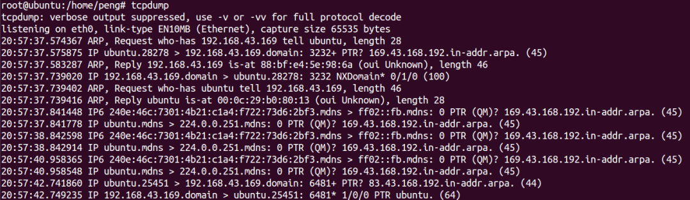

按下Ctrl+C会终止tcpdump命令。且会在结尾处生成统计信息。

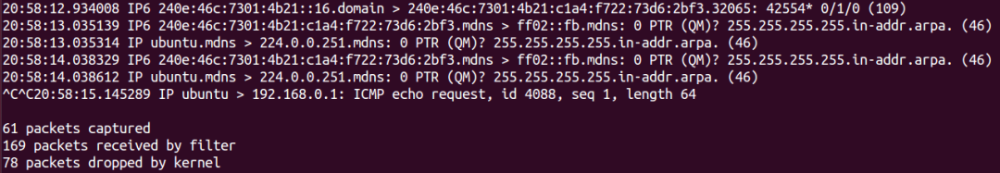

### 指定抓包数量 -c

指定抓取2个数据包。

命令：
```sh
tcpdump -c 2
```

说明：

最后会自动生成统计信息。
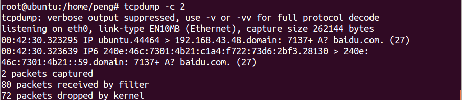

【注意，已经切换到管理员了，虚拟机中要产生数据包，可以另外开一个窗口ping baidu.com后面不再提示】

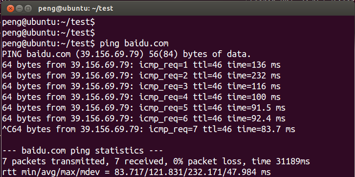

### 将抓包信息写入文件 -w

使用-w选项指定记录文件。

命令：
```sh
tcpdump -c 10 -w tcpdump_test.log
```

说明：

保存的文件不是文本格式，不能直接查看。tcpdump保存的文件的格式是几乎所有主流的抓包工具软件都可以读取。所以可以使用更易读的图形界面工具来查看记录文件。
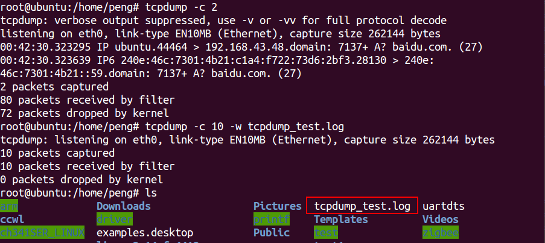

### 读取记录文件 -r

使用-r选项读取文件。

命令：
```sh
tcpdump -r tcpdump_test.log
```
读取记录文件
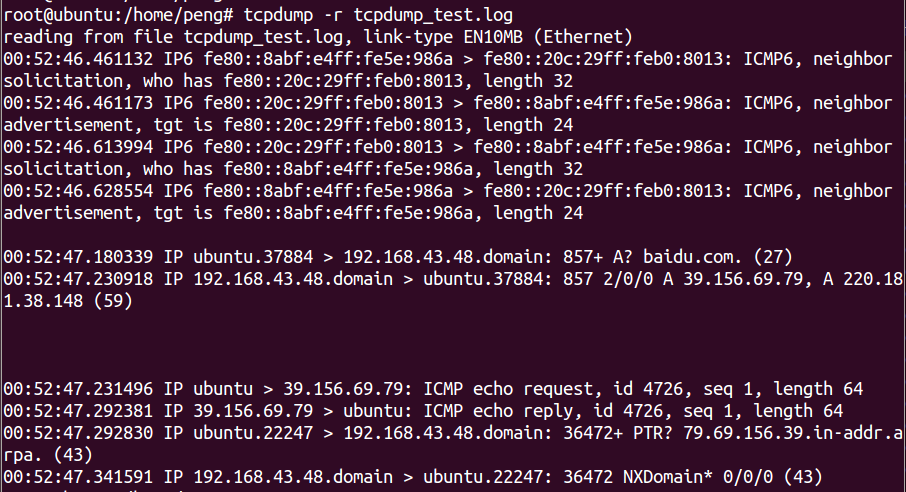

### 打印出所有可工作的接口 -D
命令：
```sh
tcpdump -D
```

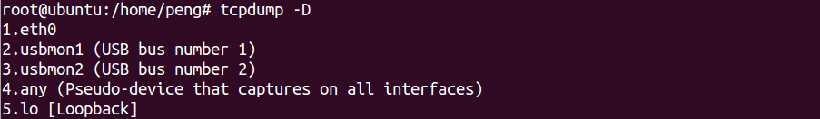

其中网卡为eth0。

### 指定监控的网卡 -i
命令：
```sh
tcpdump -i eth0
```
如果不指定网卡，默认tcpdump只会监视第一个网络接口，一般是eth0。

### 显示更详细的数据包信息 -v  -vv
选项-v，-vv可以显示更详细的抓包信息。

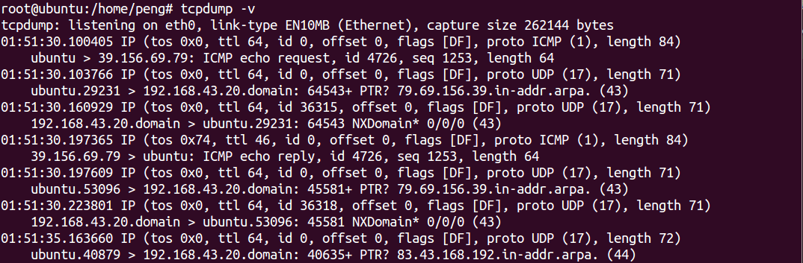

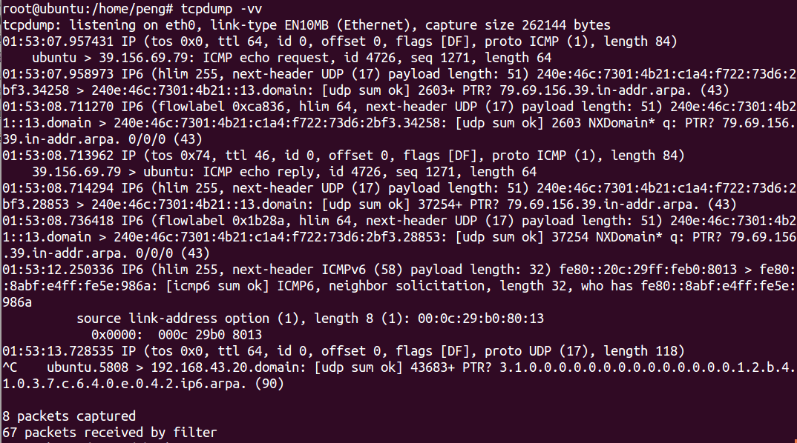

### 不使用域名反解 -n

使用-n后，tcpdump会直接显示IP地址，不会显示域名（与netstat命令相似）。

### 增加抓包时间戳 -tttt选项

tcpdump的所有输出打印行中都会默认包含时间戳信息；时间戳信息的显示格式如下

```sh
hh:mm:ss.frac (nt: 小时:分钟:秒.)
```

此时间戳的精度与内核时间精度一致,　反映的是内核第一次看到对应数据包的时间；

而数据包从物理线路传递到内核的时间, 以及内核花费在此包上的中断处理时间都没有算进来；

使用-tttt选项，抓包结果中将包含抓包日期：

命令：
```sh
tcpdump -tttt
```
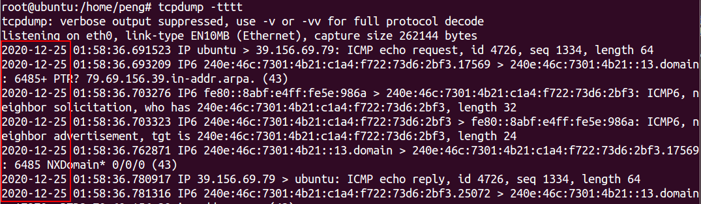

## 条件过滤

### 过滤：指定需要抓取的协议
tcpdump可以只抓某种协议的包，支持指定以下协议：「ip,ip6,arp,tcp,udp,wlan」等。

命令：

```sh
tcpdump udp

tcpdump icmp

tcpdump tcp

tcpdump arp
```

### 过滤：指定协议的端口号

使用port参数，用于指定端口号。

命令：tcpdump tcp port 80

使用portrange参数，用于指定端口范围。

命令：tcpdump tcp portrange 1-1024

### 过滤：指定源与目标

src 表示源。

dst 表示目标。

命令：

tcpdump src port 8080

tcpdump dst port 80

### 过滤：指定特定主机的消息包

使用host指定需要监听的主机。

命令：
```sh
tcpdump host 192.168.1.113
```

注意：若使用了host参数使用了计算机名或域名。例tcpdump host shi-pc ，则无法再使用-n选项。

### 过滤：指定数据包大小

使用greater（大于）与less（小于）可以指定数据包大小的范围。

「例：只抓取大于1000字节的数据包。」

命令：
```sh
tcpdump greater 1000
```

「例：只抓取小于10字节的数据包。」

命令：
```sh
tcpdump less 10
```
## 逻辑表达式

使用基本逻辑组合拼装出更精细的过滤条件。

### 逻辑与
逻辑与关系，使用and。

命令：

```sh
tcpdump tcp and host 192.168.1.112

tcpdump tcp and src 192.168.1.112 and port 8080
```

### 逻辑或

逻辑或关系，使用or。

命令：
```sh
tcpdump host 192.168.1.112 or 192.168.1.113
```

### 逻辑非

逻辑非关系，使用not，也可以使用 ! 。

若使用 ! 必须与其后面的字符隔开一个空格。

例：当通过ssh协议远程使用tcpdump时，为了避免ssh的数据包的输出，所以一般需要禁止ssh数据包的输出。

命令：
```sh
tcpdump not tcp port 22

tcpdump ! tcp port 22
```
### 括号
括号需要使用在引号内，或转意使用。否则会报错。

例：抓取非22端口，且主机为192.168.1.112 和 192.168.1.113的TCP数据包。

命令：
```sh
tcpdump not tcp port 22 and host 192.168.1.112or192.168.1.113

tcpdump "not tcp port 22 and host (192.168.1.112 or 192.168.1.113)"

tcpdump not tcp port 22 and host "(192.168.1.112 or 192.168.1.113)"
```
### 其他实例

##### 打印所有进入或离开sundown的数据包.
```sh
tcpdump host sundown
```
##### 截获主机210.27.48.1 和主机210.27.48.2 或210.27.48.3的通信
```sh
tcpdump host 210.27.48.1 and \ (210.27.48.2 or 210.27.48.3 \)  
```
##### 如果想要获取主机210.27.48.1除了和主机210.27.48.2之外所有主机通信的ip包，使用命令：
```sh
tcpdump ip host 210.27.48.1 and ! 210.27.48.2
```
##### 监视所有送到主机hostname的数据包
```sh
tcpdump -i eth0 dst host hostname
```
##### 获取主机210.27.48.1接收或发出的telnet包
23为telnet的端口
```sh
tcpdump tcp port 23 and host 210.27.48.1
```
##### 监视本机的udp 123 端口
123 为ntp的服务端口
```sh
tcpdump udp port 123
```

##### 使用tcpdump抓取HTTP包
```sh
tcpdump  -XvvennSs 0 -i eth0 tcp[20:2]=0x4745 or tcp[20:2]=0x4854
```
0x4745 为"GET"前两个字母"GE",
0x4854 为"HTTP"前两个字母"HT"。

tcpdump 对截获的数据并没有进行彻底解码，数据包内的大部分内容是使用十六进制的形式直接打印输出的。

显然这不利于分析网络故障，通常的解决办法是先使用带**-w参数的tcpdump 截获数据并保存到文件中**，然后再使用其他程序(如Wireshark)进行解码分析。当然也应该定义过滤规则，以避免捕获的数据包填满整个硬盘。

## 查看数据包完整内容
tcpdump默认不显示数据包的详细内容。

### 方法一：
使用-A参数能以ASCII码显示数据包。

例：只抓取1个数据包，并显示其内容。

命令：
```sh
tcpdump -c 1 -A
```
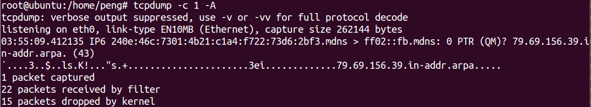

### 方法二：
使用-X参数能16进制数与ASCII码共同显示数据包。

例：只抓取1个数据包，并显示其内容。

命令：
```sh
tcpdump -c 1 -X
```
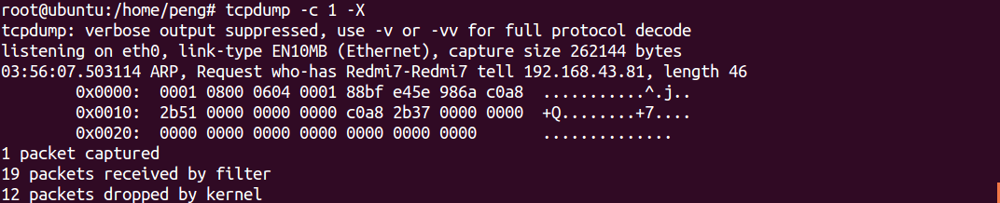

## tcpdump 与wireshark
Wireshark(以前是ethereal)是Windows下非常简单易用的抓包工具，现在也有Linux版本。

通过Tcpdump抓取的数据包分析比较麻烦，要想很方便的分析数据包， 我们可以用Tcpdump + Wireshark 的完美组合实现：在 Linux 里抓包，然后在Windows 里分析包。

保存数据包为wireshark能识别的文件：
```sh
tcpdump tcp -i eth1 -t -s 0 -c 100 and dst port ! 22 and src net 192.168.1.0/24 -w ./target.cap
```

|参数|含义|
|---|---|
|tcp	|ip icmp arp rarp 和 tcp、udp、icmp这些选项等都要放到第一个参数的位置，用来过滤数据报的类型|
|-i eth1 | 只抓经过接口eth1的包|
|-t	 |不显示时间戳|
|-s 0	|抓取数据包时默认抓取长度为68字节。加上-S 0 后可以抓到完整的数据包|
|-c 100	|只抓取100个数据包|
|dst port ! 22 |	不抓取目标端口是22的数据包|
|src net 192.168.1.0/24	|数据包的源网络地址为192.168.1.0/24|
|-w ./target.cap |	保存成cap文件，方便用ethereal(即wireshark)分析|


了解ebpf
BPF介绍
BPF（Berkeley Packet Filter ），中文翻译为伯克利包过滤器，是类 Unix 系统上数据链路层的一种原始接口，提供原始链路层封包的收发。

如何在 Unix 内核实现网络数据包过滤，这种新的技术比当时最先进的数据包过滤技术快 20 倍。BPF 在数据包过滤上引入了两大革新：

一个新的虚拟机 (VM) 设计，可以有效地工作在基于寄存器结构的 CPU 之上；

应用程序使用缓存只复制与过滤数据包相关的数据，不会复制数据包的所有信息。这样可以最大程度地减少BPF 处理的数据；

tcpdump 的底层采用 BPF 作为底层包过滤技术，我们可以在命令后面增加 ”-d“ 来查看 tcpdump 过滤条件的底层汇编指令。


$ tcpdump -d 'ip and tcp port 8080'
(000) ldh      [12]
(001) jeq      #0x800           jt 2	jf 12
(002) ldb      [23]
(003) jeq      #0x6             jt 4	jf 12
(004) ldh      [20]
(005) jset     #0x1fff          jt 12	jf 6
(006) ldxb     4*([14]&0xf)
(007) ldh      [x + 14]
(008) jeq      #0x1f90          jt 11	jf 9
(009) ldh      [x + 16]
(010) jeq      #0x1f90          jt 11	jf 12
(011) ret      #262144
(012) ret      #0
参考资料：https://cloudnative.to/blog/bpf-intro/

eBPF 介绍
2014 年初，Alexei Starovoitov 实现了 eBPF（extended Berkeley Packet Filter）。经过重新设计，eBPF 演进为一个通用执行引擎，可基于此开发性能分析工具、软件定义网络等诸多场景。eBPF 最早出现在 3.18 内核中，此后原来的 BPF 就被称为经典 BPF，缩写 cBPF（classic BPF），cBPF 现在已经基本废弃。现在，Linux 内核只运行 eBPF，内核会将加载的 cBPF 字节码透明地转换成 eBPF 再执行。

eBPF 新的设计针对现代硬件进行了优化，所以 eBPF 生成的指令集比旧的 BPF 解释器生成的机器码执行得更快。扩展版本也增加了虚拟机中的寄存器数量，将原有的 2 个 32 位寄存器增加到 10 个 64 位寄存器。由于寄存器数量和宽度的增加，开发人员可以使用函数参数自由交换更多的信息，编写更复杂的程序。总之，这些改进使 eBPF 版本的速度比原来的 BPF 提高了 4 倍。


当前，eBPF 不再局限于网络栈，已经成为内核顶级的子系统。eBPF 程序架构强调安全性和稳定性，看上去更像内核模块，但与内核模块不同，eBPF 程序不需要重新编译内核，并且可以确保 eBPF 程序运行完成，而不会造成系统的崩溃。


简述概括， eBPF 是一套通用执行引擎，提供了可基于系统或程序事件高效安全执行特定代码的通用能力，通用能力的使用者不再局限于内核开发者；

eBPF 可由执行字节码指令、存储对象和 Helper 帮助函数组成，字节码指令在内核执行前必须通过 BPF 验证器 Verfier 的验证，同时在启用 BPF JIT 模式的内核中，会直接将字节码指令转成内核可执行的本地指令运行。

ebpf：可以加载用户态bpf程序到内核态执行

参考资料：https://cloudnative.to/blog/bpf-intro/

学习课程： https://time.geekbang.org/column/article/480094 用公司极客时间账号买的 ebpf 课程 《eBPF 核心技术与实战》，有兴趣可以看看，账号密码：账号：18222966170密码：360cloud


eBPF 网络方向应用
eBPF 和 tc 关系
tc简介：流量控制Traffic Control简称TC 表示网络设备接收和发送数据包的排队机制。比如，数据包的接收速率、发送速率、多个数据包的发送顺序等。

Linux实现了流量控制子系统，它包括两部分：

内核部分的traffic control框架
用户态的规则配置工具：iproute2软件包中的tc程序
它们有些类似于内核态的netfilter框架和用户态的iptables程序。

参考资料：http://just4coding.com/2022/08/05/tc/

图解参考：cilium 网络流量转发图解

kube-proxy流量图解：


ebpf 技术应用于tc ：BPF 还可以用于内核数据路径的 tc (traffic control，流量控制)层

tc BPF 程序运行在网络栈通用层中的 hook 点：

tc 加载bpf 程序到ingress hook 点， 处理入口流量包

tc 加载bpf 程序到egress hook 点， 处理出口流量包

ebpf 流量图解：


eBPF 和 xdp 关系
参考资料：https://domc.me/2021/10/17/cilium_0_to_0_1/

流量图解：


XDP 为Linux内核提供了高性能、可编程的网络数据路径， 需要网卡驱动支持


了解 cilium


当前问题


建议优化
去掉kube-proxy 组件，使用cilium 做k8s svc 转发处理，减少包处理路径，提升k8s网络性能。

去掉cilium-bird 组件，使用cilium bpg 功能，实现work节点多网段的路由宣告能力，减少集群组件维护成本。

去掉


