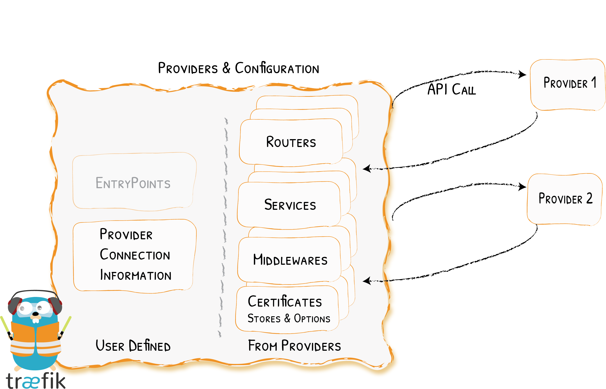

# traefik简介

traefik 与 nginx 一样，是一款反向代理工具，或者叫Edge路由器。

>1. 自动的服务发现与负载均衡
>2. 兼容主要的集群技术，如Kubernetes、Docker等
>3. 无须维护和同步单独的配置文件，更多时间用在系统开发和部署上，而不是编写配置和维护配置
>4. 所有配置自动实时生效，无须重启

<!-- more -->


# 核心概念

## 反向代理
Treafik 是个Edge路由器，意味着它是您平台的大门，它根据不同规则的配置路由到不同的服务。


## 服务自动发现

传统的反向代理是通过配置文件中具体配置路由到不同的服务上面（如nginx），而 traefik 是从服务本身获取。部署服务时需要附件信息，这些信息告诉 treafik服务可用处理的请求特征。部署服务时，treafik 会立即检测到该服务并实施更新路由规则，当删除服务时，路由将相应失效。


# 快速开始
通过docker-compose来安装traefik，通过一个示例来了解traefik

## 安装docker-compose
```sh
下载二进制文件
sudo curl -L "https://github.com/docker/compose/releases/download/1.28.4/docker-compose-$(uname -s)-$(uname -m)" -o /usr/local/bin/docker-compose
赋予文件执行权
sudo chmod +x /usr/local/bin/docker-compose
测试是否安装成功
docker-compose --version
```

## 编写docker-compose.yml
```sh
version: '3'
services:
  reverse-proxy:
    # 使用官方镜像
    image: traefik:v2.4
    # 启用Web UI并监听docker
    command: --api.insecure=true --providers.docker
    ports:
      # The HTTP port
      - "80:80"
      # WEB UI (enabled by --api.insecure=true)
      - "8080:8080"
    volumes:
      # Traefik可以监听Docker事件
      - /var/run/docker.sock:/var/run/docker.sock
```

## 使用命令启动traefik
```sh
docker-compose up -d reverse-proxy
```

## 测试traefik

```json
{
    "routers": {
        "api@internal": {
            "entryPoints": ["traefik"],
            "service": "api@internal",
            "rule": "PathPrefix(`/api`)",
            "priority": 2147483646,
            "status": "enabled",
            "using": ["traefik"]
        },
        "dashboard@internal": {
            "entryPoints": ["traefik"],
            "middlewares": ["dashboard_redirect@internal", "dashboard_stripprefix@internal"],
            "service": "dashboard@internal",
            "rule": "PathPrefix(`/`)",
            "priority": 2147483645,
            "status": "enabled",
            "using": ["traefik"]
        },
        "reverse-proxy-root@docker": {
            "entryPoints": ["http"],
            "service": "reverse-proxy-root",
            "rule": "Host(`reverse-proxy-root`)",
            "status": "enabled",
            "using": ["http"]
        }
    },
    "middlewares": {
        "dashboard_redirect@internal": {
            "redirectRegex": {
                "regex": "^(http:\\/\\/(\\[[\\w:.]+\\]|[\\w\\._-]+)(:\\d+)?)\\/$",
                "replacement": "${1}/dashboard/",
                "permanent": true
            },
            "status": "enabled",
            "usedBy": ["dashboard@internal"]
        },
        "dashboard_stripprefix@internal": {
            "stripPrefix": {
                "prefixes": ["/dashboard/", "/dashboard"]
            },
            "status": "enabled",
            "usedBy": ["dashboard@internal"]
        }
    },
    "services": {
        "api@internal": {
            "status": "enabled",
            "usedBy": ["api@internal"]
        },
        "dashboard@internal": {
            "status": "enabled",
            "usedBy": ["dashboard@internal"]
        },
        "noop@internal": {
            "status": "enabled"
        },
        "reverse-proxy-root@docker": {
            "loadBalancer": {
                "servers": [{
                    "url": "http://172.17.0.2:80"
                }],
                "passHostHeader": true
            },
            "status": "enabled",
            "usedBy": ["reverse-proxy-root@docker"],
            "serverStatus": {
                "http://172.17.0.2:80": "UP"
            }
        }
    }
}

```
## 检测服务并创建路由
编辑docker-compose.yml 文件，并在文件末尾添加以下内容
```yaml
# ...
  whoami:
    # A container that exposes an API to show its IP address
    image: traefik/whoami
    labels:
      - "traefik.http.routers.whoami.rule=Host(`whoami.docker.localhost`)"
```

启动whomi服务

```sh
docker-compose up -d whoami
```

再次访问 curl http://localhost:8080/api/rawdata ,发现traefik已经自动检测到新服务并更新了配置

```json
{
    "routers": {
        "api@internal": {
            "entryPoints": ["traefik"],
            "service": "api@internal",
            "rule": "PathPrefix(`/api`)",
            "priority": 2147483646,
            "status": "enabled",
            "using": ["traefik"]
        },
        "dashboard@internal": {
            "entryPoints": ["traefik"],
            "middlewares": ["dashboard_redirect@internal", "dashboard_stripprefix@internal"],
            "service": "dashboard@internal",
            "rule": "PathPrefix(`/`)",
            "priority": 2147483645,
            "status": "enabled",
            "using": ["traefik"]
        },
        "reverse-proxy-root@docker": {
            "entryPoints": ["http"],
            "service": "reverse-proxy-root",
            "rule": "Host(`reverse-proxy-root`)",
            "status": "enabled",
            "using": ["http"]
        },
        "whoami@docker": {
            "entryPoints": ["http"],
            "service": "whoami-root",
            "rule": "Host(`whoami.docker.localhost`)",
            "status": "enabled",
            "using": ["http"]
        }
    },
    "middlewares": {
        "dashboard_redirect@internal": {
            "redirectRegex": {
                "regex": "^(http:\\/\\/(\\[[\\w:.]+\\]|[\\w\\._-]+)(:\\d+)?)\\/$",
                "replacement": "${1}/dashboard/",
                "permanent": true
            },
            "status": "enabled",
            "usedBy": ["dashboard@internal"]
        },
        "dashboard_stripprefix@internal": {
            "stripPrefix": {
                "prefixes": ["/dashboard/", "/dashboard"]
            },
            "status": "enabled",
            "usedBy": ["dashboard@internal"]
        }
    },
    "services": {
        "api@internal": {
            "status": "enabled",
            "usedBy": ["api@internal"]
        },
        "dashboard@internal": {
            "status": "enabled",
            "usedBy": ["dashboard@internal"]
        },
        "noop@internal": {
            "status": "enabled"
        },
        "reverse-proxy-root@docker": {
            "loadBalancer": {
                "servers": [{
                    "url": "http://172.17.0.2:80"
                }],
                "passHostHeader": true
            },
            "status": "enabled",
            "usedBy": ["reverse-proxy-root@docker"],
            "serverStatus": {
                "http://172.17.0.2:80": "UP"
            }
        },
        "whoami-root@docker": {
            "loadBalancer": {
                "servers": [{
                    "url": "http://172.17.0.3:80"
                }],
                "passHostHeader": true
            },
            "status": "enabled",
            "usedBy": ["whoami@docker"],
            "serverStatus": {
                "http://172.17.0.3:80": "UP"
            }
        }
    }
}
```

当traefik检测到新服务时，它会创建相应的路由

```sh
curl -H Host:whoami.docker.localhost http://127.0.0.1
```

```sh
[root@vm10-0-0-150 ~]# curl -H Host:whoami.docker.localhost http://127.0.0.1
Hostname: 9b6ea900ae2b
IP: 127.0.0.1
IP: 172.17.0.3
RemoteAddr: 172.17.0.2:39286
GET / HTTP/1.1
Host: whoami.docker.localhost
User-Agent: curl/7.29.0
Accept: */*
Accept-Encoding: gzip
X-Forwarded-For: 172.17.0.1
X-Forwarded-Host: whoami.docker.localhost
X-Forwarded-Port: 80
X-Forwarded-Proto: http
X-Forwarded-Server: 7bf80852469d
X-Real-Ip: 172.17.0.1
```
## 负载均衡实例

启动更多服务
```sh
docker-compose up -d --scale whoami=2
```

通过命令查看traefik在服务的两个实例之间负载均衡，输出将交替显示以下内容之一：

```sh
[root@vm10-0-0-150 ~]# curl -H Host:whoami.docker.localhost http://127.0.0.1
Hostname: 9b6ea900ae2b
IP: 127.0.0.1
IP: 172.17.0.3
RemoteAddr: 172.17.0.2:39532
GET / HTTP/1.1
Host: whoami.docker.localhost
User-Agent: curl/7.29.0
Accept: */*
Accept-Encoding: gzip
X-Forwarded-For: 172.17.0.1
X-Forwarded-Host: whoami.docker.localhost
X-Forwarded-Port: 80
X-Forwarded-Proto: http
X-Forwarded-Server: 7bf80852469d
X-Real-Ip: 172.17.0.1
 
[root@vm10-0-0-150 ~]# curl -H Host:whoami.docker.localhost http://127.0.0.1
Hostname: a25bd81ca3ea
IP: 127.0.0.1
IP: 172.17.0.4
RemoteAddr: 172.17.0.2:38944
GET / HTTP/1.1
Host: whoami.docker.localhost
User-Agent: curl/7.29.0
Accept: */*
Accept-Encoding: gzip
X-Forwarded-For: 172.17.0.1
X-Forwarded-Host: whoami.docker.localhost
X-Forwarded-Port: 80
X-Forwarded-Proto: http
X-Forwarded-Server: 7bf80852469d
X-Real-Ip: 172.17.0.1
```

# 配置介绍

```

```
启动时，traefik会在以下位置查找名为 traefik.toml（traefik.yml或traefik.yaml）的文件：

/etc/traefik/

$XDG_CONFIG_HOME/

$HOME/.config/

（工作目录）

可以使用configFile参数来覆盖

traefik --configFile=foo/bar/myconfigfile.toml
配置发现




traefik 中的配置发现是通过提供者实现的，traefik调用提供者的api,获取有关路由的配置信息，并且当traefik检测到更改时，就会动态的更新路由。traefik根据不同的提供者，有以下四种类别：

>1. 基于标签：每个部署的容器都有一组附加的标签
>2. 基于键值：每个部署的容器都会使用相关信息更新键值存储
>3. 基于注释：带有注释的单独对象定义容器的特征
>4. 基于文件：使用文件定义配置

***常用提供者配置***
配置文件（常用于二进制安装）

```sh
#TOMAL
[http.middlewares]
  [http.middlewares.add-foo-prefix.addPrefix]
    prefix = "/foo"
#YAML
http:
  middlewares:
    add-foo-prefix:
      addPrefix:
        prefix: "/foo"
```

Docker
```sh
your-container:
  image: your-docker-image
  labels:
    # Attach add-foo-prefix@file middleware (declared in file)
    - "traefik.http.routers.my-container.middlewares=add-foo-prefix@file"
```
IngressRoute
```sh
apiVersion: traefik.containo.us/v1alpha1
kind: IngressRoute
metadata:
  name: ingressroutestripprefix
spec:
  entryPoints:
    - web
  routes:
    - match: Host(`example.com`)
      kind: Rule
      services:
        - name: whoami
          port: 80
      middlewares:
        - name: add-foo-prefix@file
        # namespace: bar
        # A namespace specification such as above is ignored
        # when the cross-provider syntax is used.
```

Ingress
```sh
apiVersion: traefik.containo.us/v1alpha1
kind: Middleware
metadata:
  name: stripprefix
  namespace: appspace
spec:
  stripPrefix:
    prefixes:
      - /stripit
 
---
apiVersion: networking.k8s.io/v1
kind: Ingress
metadata:
  name: ingress
  namespace: appspace
  annotations:
    # referencing a middleware from Kubernetes CRD provider:
    # <middleware-namespace>-<middleware-name>@kubernetescrd
    "traefik.ingress.kubernetes.io/router.middlewares": appspace-stripprefix@kubernetescrd
spec:
  # ... regular ingress definition
```

更多提供者配置可以参考官方文档：https://doc.traefik.io/traefik/providers/overview/

