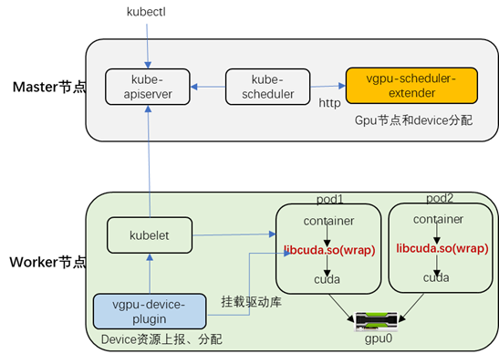

## 前言

近几年，随着云计算、机器学习、人工智能、高性能计算、区块链等的兴起，GPU以其在浮点运算与并行运算性能方面的出色表现有了海量的市场需求。GPU早已经不再只是显示卡，而是成为了CPU 之外更大的计算模块。如今，GPU对企业的发展越来越重要。但是，相较于CPU，GPU价格昂贵。所以，如何提高GPU的使用率，对于客户来讲就非常重要。而GPU虚拟化正是能够帮助客户合理分配和使用GPU资源的关键技术。

从用户角度，GPU虚拟化分为虚拟机层面的虚拟化和容器层面的虚拟化。本方案中只针对后者展开讲述。目前，在实现方面主要有两个思路，一个是内核驱动，将GPU纳入cgroup管理，比如阿里云的cGPU方案；二是采用类rCuda方案，将GPU驱动封装劫持，从而限制用户进程对资源的使用。考虑到第二种方案的轻量性，本文的vGPU方案即采用了它。

<!-- more -->

## vGPU架构设计

本文vGPU方案主要分为三个组件：

1） vgpu-device-plugin：即基于kubernetes的Device Plugin方案实现，定义gpu资源的上报和分配。

2） vgpu-scheduler-extender：即基于kubernetes的Extended Resource方案实现。增加一个predicate接口，负责过滤gpu节点和device设备。

3） vgpu-kcuda-controller：负责对nvidia driver库进行封装。通过劫持容器内程序对cuda的调用来限制当前容器内进程对GPU和显存的使用。

 vGPU兼容nvidia-device-plugin。此外，vGPU支持共享和独占两种模式。当工作负载请求的core值在0~100时采用共享模式，优先选择可用资源最少且满足容器请求的gpu节点和设备。当工作负载请求的core值为1的倍数时，则为独占模式。

本文vGPU整体架构如下图所示：



此外，vGPU提供对gpu使用情况的监控信息，并支持对接promethus。

在vgpu-device-plugin中启动metricserver，提供http接口，用于返回gpu相关的监控数据。

四种监控指标：显存request（总量）/用量】和【算力(utilization)（总量）/用量】；

数据维度支持：容器名、命名空间、pod名、节点ip、gpu卡号


## 方案优缺点

***方案优点：***
>- 同时支持共享和独占模式，提高GPU资源利用率；
>- 支持同一张卡上容器间GPU和显存的使用隔离
>- 对用户程序无侵入，用户无感

***方案缺点：***
>- 驱动和加速库的兼容性依赖于厂商
>- 存在一定的性能损耗（大约5%）

## 安装部署

### gpu节点打标签

给所有GPU节点打nvidia-device-enable=enable 标签
```bash
# kubectl label node *.*.*.* nvidia-device-enable=enable
```

### 部署 device-plugin

```bash
# kubectl create -f vgpu-device-plugin.yaml
```

### 部署scheduler-extender

```bash
# kubectl create -f vgpu-scheduler-extender.yaml
```

### 在每个master节点上添加以下文件

```bash
# cat /etc/kubernetes/scheduler-policy-config.json
{
   "apiVersion" : "v1",
   "extenders" : [
      {
         "apiVersion" : "v1beta1",
         "enableHttps" : false,
         "filterVerb" : "predicates",
         "managedResources" : [
            {
               "ignoredByScheduler" : false,
               "name" : "docker.com/vcuda-core"
            }
         ],
         "nodeCacheCapable" : false,
         "urlPrefix" : "http://vgpu-scheduler-extender.kube-system.svc.cluster.local:3456/scheduler"
      }
   ],
   "kind" : "Policy"
}
```

### 修改kube-scheduler选项

```bash
在每个 kube-scheduler 开启policy-config选项，增加如下启动参数：
--policy-config-file=/etc/kubernetes/scheduler-policy-config.json
--use-legacy-policy-config=true
hostNetwork: true  //在该行下面添加
dnsPolicy: ClusterFirstWithHostNet
```
### 示例

修改工作负载（deploy或者daemonset等）的resources限制（只修改limits即可）。如下面例子所示：

```yaml
        resources:
          limits:
            cpu: "2"
            memory: 2Gi
            docker.com/vcuda-core: "20"
            docker.com/vcuda-memory: "10"
```

 其中，
  “docker.com/vcuda-core:”代表gpu使用率，以“20”为例，则代表该容器对单块gpu算力使用率的上限是20%（大约这个范围，不是很精确）；
  "docker.com/vcuda-memory:”  代表gpu内存使用量，以“10”为例，则代表该容器对gpu内存使用量的上限是  10*256M=2560M

