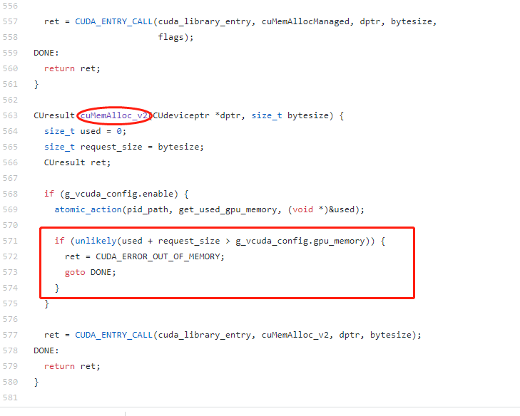
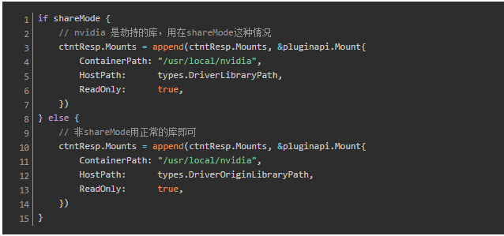
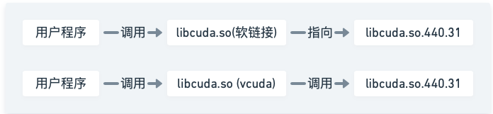
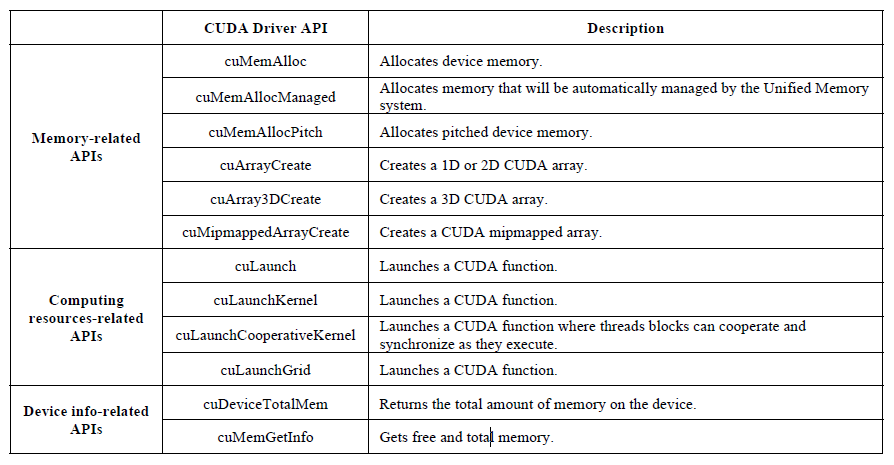
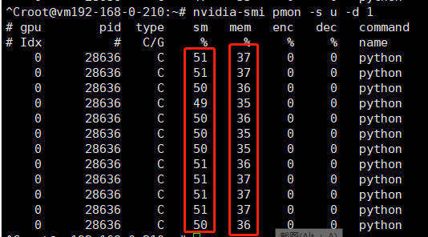

主要两个思路：

>1. 将GPU纳入cgroup管理，目前尚未有成熟的提案，短期内难以实现（阿里云估计是基于cgroup实现的）；
>2. 基于GPU驱动封装实现，用户根据需要对驱动的某些关键接口（如显存分配、cuda thread创建等）进行封装劫持，在劫持过程中限制用户进程对计算资源的使用。

此类方案缺点是兼容性依赖于厂商驱动，但是整体方案较为轻量化，性能损耗极小（腾讯云的gpu-manager采用了该方案，据了解浪潮也是采用的这个方案）。
下面，基于对gpu-manager的源码和论文进行研究，讲述“劫持”方案的实现原理。

<!-- more -->

## 基本原理

代码实现逻辑比较简单：仅使用了wrap library和linux动态库链接技术，就实现了GPU 算力和显存的上限隔离。

负责实现该功能的是一个叫vcuda-controller的开源项目：https://github.com/tkestack/vcuda-controller

核心代码位于：vcuda-controller/src/hijack_call.c，在该c文件中，将nvidida驱动库中部分函数进行了劫持（所有劫持的函数见下一部分）。

以下图中的一个函数为例，cuMemAlloc_v2是驱动库中负责内存分配的一个函数，劫持工作如下：

>1. 判断g_vcuda_config.enable是否为true，即gpu是否处于共享模式；
>2. 如果处于共享模式，则根据当前容器的进程号，获取当前容器已经使用的gpu内存；
>3. g_vcuda_config中保存了当前容器在创建时被分配的gpu内容上限，然后判断本次申请的内存+已使用的内存是否超过了分配的gpu内存上限；

如果是，则返回“out of memory”，否则调用原始nvidia驱动库中的cuMemAlloc_v2函数，进行内存的分配

该项目编译完成后，会生成libcuda-controller.so动态库。替换过程如下：

>1. 根据/etc/gpu-manager/volume.conf文件，将宿主机上的nvidia相关的二进制文件和.so文件拷贝到 /etc/gpu-manager/vdriver/nvidia/和 /etc/gpu-manager/vdriver/origin目录下，其中前者存放劫持动态库，后者存放原生的驱动库
>2. 将/etc/gpu-manager/vdriver/nvidia/lib64/libcuda.so和/etc/gpu-manager/vdriver/nvidia/lib64/libcuda.so.1替换为libcuda-controller.so
>3. 启动容器时，为容器挂载挂载cuda相关的库，包括拦截库。shareMode 下，会挂载的 host 目录是 /etc/gpu-manager/vdriver/nvidia，这里面是被劫持的库。否则挂载 /etc/gpu-manager/vdriver/origin，里面是原始的 CUDA 库。

经过以上替换和挂载过程后，容器对cuda库的调用过程就变成了下图所示：

## 全部劫持函数

目前支持的全部劫持函数，如下表所示

## 测试结果

pod的core使用limit是50，即50%的gpu 算力使用率，memory的limit是10，即10*256=2560M（total为7611M）

通过nvidia-smi监控gpu的使用情况，基本符合隔离的要求
