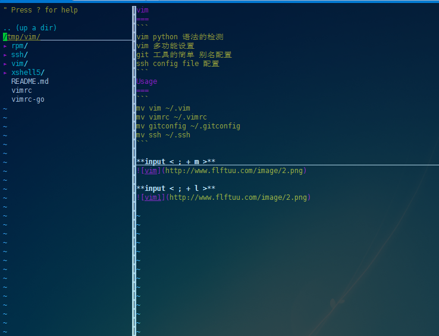
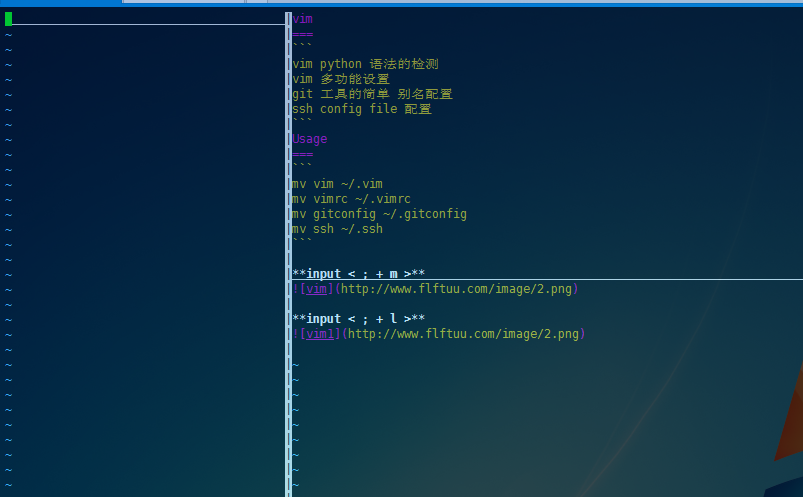

### vim

```sh
vim python 语法的检测
vim 多功能设置
git 工具的简单 别名配置
ssh config file 配置
```

<!-- more -->

### Usage

```sh
mv vim ~/.vim
mv vimrc ~/.vimrc
mv gitconfig ~/.gitconfig
mv ssh ~/.ssh
```

**input < ; + m >**


**input < ; + l >**


```yaml
build_encrypt_image:
  image: reg.real-ai.cn/realcenter/ubuntu:18.04-encrypt-v2
  stage: build-online
  tags:
    - online
  rules:
    - if: $CI_COMMIT_TAG && $CI_COMMIT_REF_SLUG =~ /-rc[0-9]$/
  script:
    - export GO111MODULE=on
    - export GOPROXY=https://goproxy.cn,direct
    - export GOROOT="/usr/local/go"
    - export GOPATH=/root/gopath
    - export GOBIN=${GOROOT}/bin
    - export PATH=$PATH:$GOBIN
    - go version
    - go env
    - go build -linkshared -o realcenter cmd/realcenter/main.go
    - minio-client  upload --addr 172.18.1.38 --file-path realcenter
    - go build -linkshared -o realcenter-k8s cmd/realcenter-k8s/main.go
    - minio-client  upload --addr 172.18.1.38 --file-path realcenter-k8s
    - go build -linkshared -o realcenter-ssh cmd/realcenter-ssh/main.go
    - minio-client  upload --addr 172.18.1.38 --file-path realcenter-ssh
    - go build -linkshared -o realcenter-workspace-controller cmd/realcenter-workspace-controller/main.go
    - minio-client  upload --addr 172.18.1.38 --file-path realcenter-workspace-controller
```