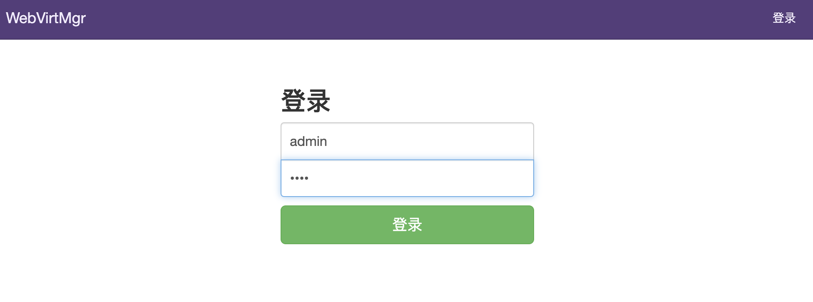
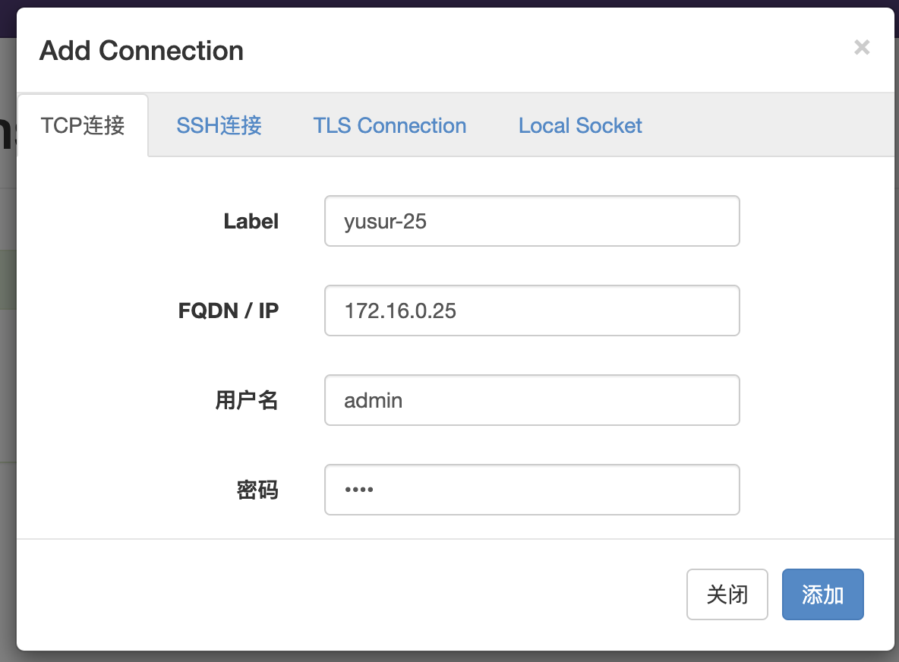
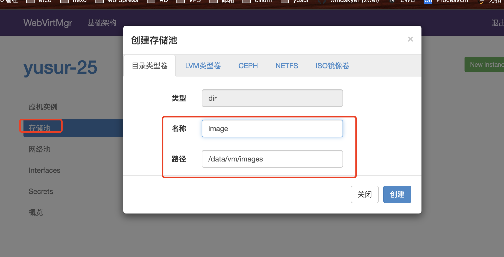
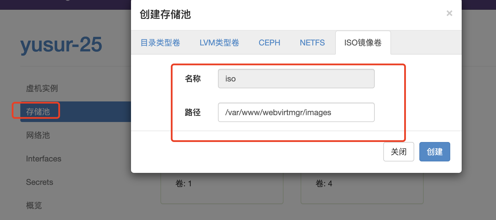
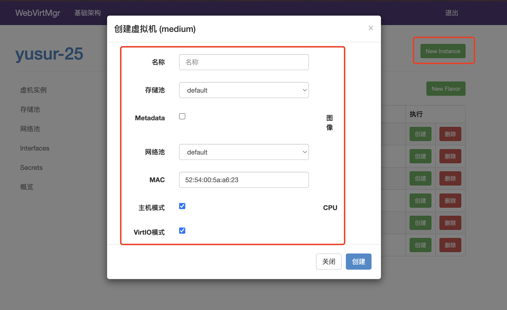

# webvirtmgr 简介
WebVirtMgr是一个基于libvirt的Web界面，用于管理虚拟机。
它允许您创建和配置新域，并调整域的资源分配。VNC查看器为来宾域提供完整的图形控制台。
KVM是目前唯一支持的虚拟机管理程序。
<!-- more -->

## 准备工作

```sh
# 拉取镜像
docker pull flftuu/webvirtmgr

# 设置环境
mkdir -p /data/vm
groupadd -g 1010 webvirtmgr
useradd -u 1010 -g webvirtmgr -s /sbin/nologin -d /data/vm webvirtmgr
chown -R webvirtmgr:webvirtmgr /data/vm

# 安装认证包
 yum install cyrus-sasl* -y

# 关闭防火墙
systemctl stop firewalld
systemctl disable firewalld
```

## 启动
```sh
docker run -d \
--name webvirtmgr \
--privileged=true \
--restart=always \
-p 8080:8080 \
-p 6080:6080 \
-v /var/run/libvirt/libvirt-sock:/var/run/libvirt/libvirt-sock \
-v /data/vm:/data/vm \
flftuu/webvirtmgr
```

## Libvirtd服务
修改/etc/sysconfig/libvirtd文件，去掉下面一行的注释，使Libvirt服务处于监听状态：
```sh
LIBVIRTD_ARGS="--timeout 120 --listen --config /etc/libvirt/libvirtd.conf"
```
配置Libvirt服务，允许通过tcp方式通讯，修改vim /etc/libvirt/libvirtd.conf:
```sh
#允许tcp监听
listen_tcp = 1
#配置tcp通过sasl认证
auth_tcp = sasl
#取消CA认证功能
listen_tls = 0
```
启动服务：
systemctl restart libvirtd

## sasl 认证配置配
修改/etc/sasl2/libvirt.conf 配置
```sh
mech_list: digest-md5
sasldb_path: /etc/libvirt/passwd.db
```

配置账号密码：
```sh
# saslpasswd2 -a libvirt 你的账号
Password: 你的密码
Again (for verification): 再次确认你的密码
```

查看账号：
```sh
# sasldblistusers2 -f /etc/libvirt/passwd.db
admin@dell: userPassword
```

验证设置:
```sh
virsh -c qemu+tcp://172.17.0.1/system nodeinfo
Please enter your authentication name: admin
Please enter your password: 
CPU 型号：        x86_64
CPU：               12
CPU 频率：        2500 MHz
CPU socket：        1
每个 socket 的内核数： 6
每个内核的线程数： 2
NUMA 单元：       1
内存大小：      15988564 KiB
```

## webvirtmgr 启动登录

启动webvirtmgr web登录页面 http://172.16.0.25:8090
登录初始用户名/密码：admin/1234


## 添加连接
选择tcp链接


## 修改启动webvirtmgr登录密码
```sh
root@initial:/data/vm# docker exec -it webvirtmgr bash
root@18fa11b229e1:/# ping 192.168.1.34 -c 2
root@18fa11b229e1:/# cd /webvirtmgr/
root@18fa11b229e1:/webvirtmgr# python manage.py changepassword admin
Changing password for user 'admin'
Password: 
Password (again): 
Password changed successfully for user 'admin'
```

## 新建虚拟机

新建image(qcow2, img)镜像存放的目录dir



新建iso 存放目录dir


新建vm


# 问题

### eg1.libvirtd[580770]: --listen parameter not permitted with systemd activation sockets, see 'man libvirtd' for further guidance
原因是：默认使用了systemd模式，要恢复到传统模式，所有的systemd必须被屏蔽
解决方案：
```sh
systemctl mask libvirtd.socket libvirtd-ro.socket \
   libvirtd-admin.socket libvirtd-tls.socket libvirtd-tcp.socket
```
然后使用以下命令重启即可：
```sh
service libvirtd restart
```
