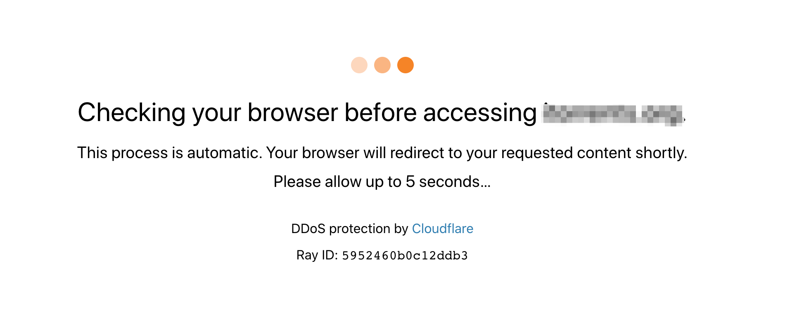
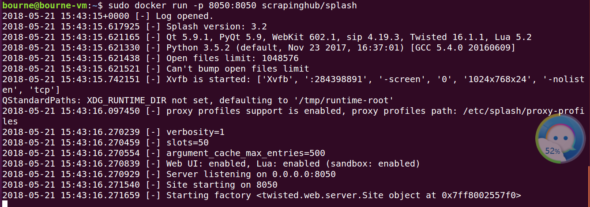
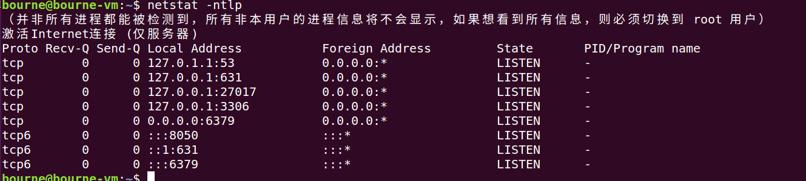
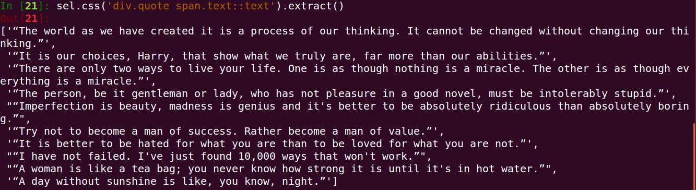
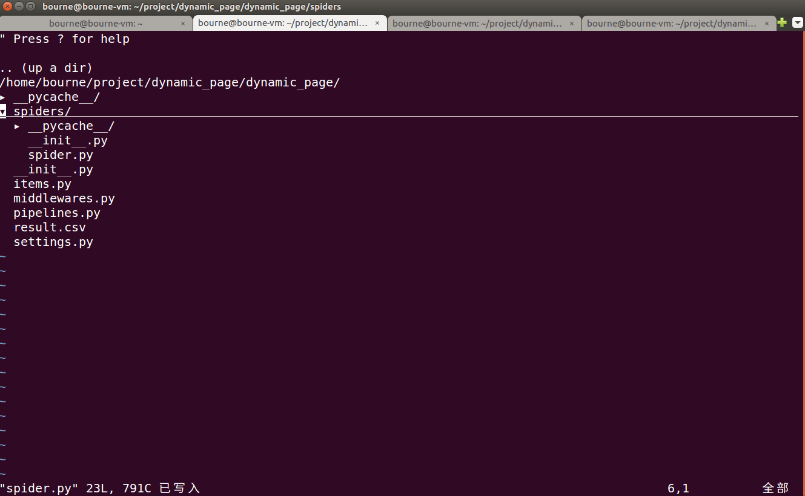
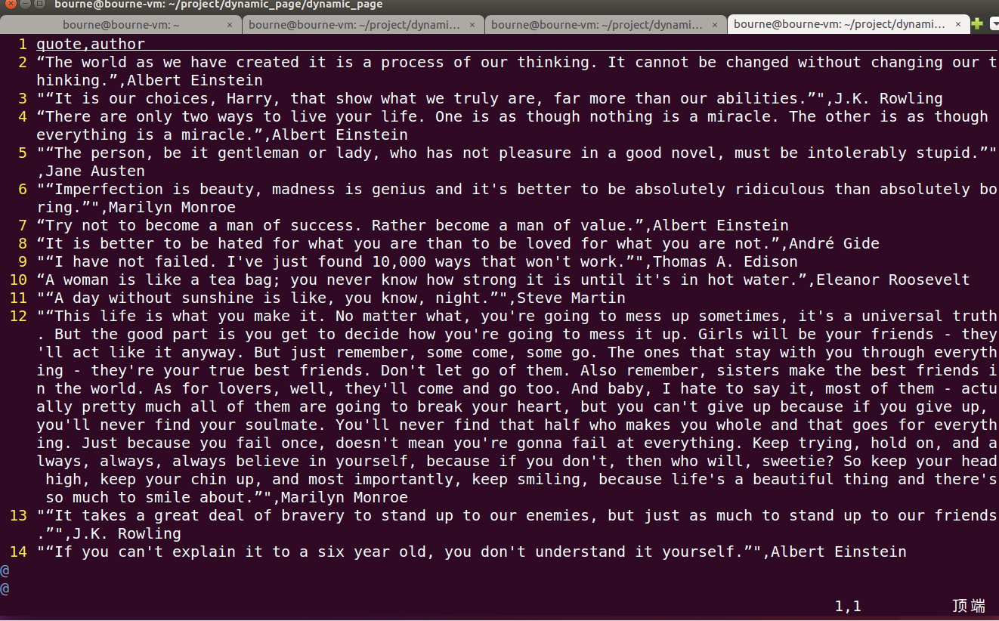

被 Cloudflare 保护的站点，在初次访问时，会等待 5 秒钟的验证，检测你是不是通过浏览器正常访问的，如下图：

爬虫如何绕过 Cloudflare 的 DDos 保护验证

本文主要说明如果通过技术手段绕过这个验证，我试了两种办法，都管用。

<!-- more -->

# 使用 python cloudscraper 库

使用起来也非常简单，看官方使用文档就好了，示例：
```python
import cloudscraper
scraper = cloudscraper.create_scraper()
res = scraper.get("http://xxx")
print(res.content)
```
这个库它是用原生的 python 代码来解析和计算 cloudflare 的验证逻辑的，也可以设置采用 nodejs 等外部库来计算验证，具体可看官方文档。

不过这个库有个缺陷就是，如果 Cloudflare 变更了算法，哪怕只改动了一点，这个库就会失效，只能等作者更新代码来支持，比较被动。

# 使用 Splash 来抓取页面

Splash 是一个命令行浏览器，https://splash.readthedocs.io/ ，比起上面我们通过程序来计算，还不如直接让一个真实的浏览器来访问受到保护的网页。

Cloudflare 验证通过后，会生成两个 cookie 值，后面的请求只要一直带上这些 cookie，就不用再次验证。所以我的办法是如果需要验证，就用 splash 访问，访问完后，保存返回的 cookie 与 header 等必要信息，下次带上直接正常访问就行了。

## 安装Splash

启动终端：
```sh
sudo apt-get install docker docker.io #（安装docker镜像）

sudo docker pull scrapyhub/splash #（用docker安装Splash）
```
安装过程比较缓慢，小伙伴们安心等待即可

启动Splash:
```sh
sudo docker run -p 8050:8050 scrapinghub/splash #（这里我们在本机8050端口开启了Splash服务）
```

得到上面输出，表明该引擎已启动


我们使用命令查看，可以看见8050端口已经开启服务了


# Splash简要使用说明

Splash为我们提供了多种端点的服务，[具体参见](http://splash.readthedocs.io/en/stable/api.html#render-html)

## render.html端点

下面我们以render.html端点来体验下：（这里我们使用requests库）

首先：我们在本机8050端口开启splash 服务：
```sh
sudo docker run -p 8050:8050 scrapinghub/splash
```

接着：激活虚拟环境source course-python3.5-env/bin/activate----启动ipython:
```python
import requests

from scrapy.selector import Selector

splash_url = 'http://localhost:8050/render.html'

args = {'url':'http://quotes.toscrape.com/js','timeout':10,'image':0}

response = requests.get(splash_url,params = args)
    
sel = Selector(response)

sel.css('div.quote span.text::text').extract()
```
得到如下输出：



## execute端点
execute端点简介：它被用来提供如下服务：当用户想在页面中执行自己定义的Js代码，如：用js代码模拟浏览器进行页面操作（滑动滚动条啊，点击啊等等）

这里：我们将execute看成是一个可以模拟用户行为的浏览器，而用户的行为我们通过lua脚本进行定义：
```sh
比如：

打开url页面

等待加载和渲染

执行js代码

获取http响应头部

获取cookies
```

实验：ipython

```ipython
ln [1]: import requests

In [2]: import json

#编写lua脚本，：访问属性
In [3]: lua = '''
   ...: function main(splash)
   ...:     splash:go('http:example.com') #打开页面
   ...:     splash:wait(0.5) #等待加载
   ...:     local title = splash:evaljs('document.title') #执行js代码
   ...:     return {title = title} #{中的内容类型python中的键值对}
   ...: end
   ...: '''

In [4]: splash_url = 'http://localhost:8050/execute' #定义端点地址

In [5]: headers = {'content-type':'application/json'}

In [6]: data = json.dumps({'lua_source':lua}) #做成json对象

In [7]: response = requests.post(splash_url,headers = headers,data=data) #使用post请求

In [8]: response.content
Out[8]: b'{"title": "Example Domain"}'

In [9]: response.json()
Out[9]: {'title': 'Example Domain'}
```

Splash对象常用属性和方法总结：[参考官网](http://splash.readthedocs.io/en/stable/scripting-overview.html)

```sh
splash:args属性----传入用户参数的表，通过该属性可以访问用户传入的参数，如splash.args.url、splash.args.wait

spalsh.images_enabled属性---用于开启/禁止图片加载，默认值为True

splash:go方法---请求url页面

splash:wait方法---等待渲染的秒数

splash:evaljs方法---在当前页面下，执行一段js代码，并返回最后一句表达式的值

splash:runjs方法---在当前页面下，执行一段js代码

splash:url方法---获取当前页面的url

splash:html方法---获取当前页面的HTML文档

splash:get_cookies---获取cookies信息
```

# 在Scrapy 中使用Splash

1、安装：scrapy-splash
```sh
pip install scrapy-splash
```
2、在scrapy_splash中定义了一个SplashRequest类，用户只需使用scrapy_splash.SplashRequst来替代scrapy.Request发送请求
```sh
该构造器常用参数如下：

url---待爬取的url地址

headers---请求头

cookies---cookies信息

args---传递给splash的参数，如wait\timeout\images\js_source等

cache_args--针对参数重复调用或数据量大大情况，让Splash缓存该参数

endpoint---Splash服务端点

splash_url---Splash服务器地址，默认为None
```

实验：https://github.com/scrapy-plugins/scrapy-splash(这里有很多使用例子供大家学习)

step1: 新建项目和爬虫
（先用终端开启splash服务：sudo docker run -p 8050:8050 scrapinghub/splash，这里我创建了一个project目录--进入目录scrapy startproject dynamic_page ---cd dynamic_page ---scrapy genspider spider quotes.toscrape.com/js/）

创建好的项目树形目录如下：


step2：改写settIngs.py文件这里小伙伴们可参考github（https://github.com/scrapy-plugins/scrapy-splash）---上面有详细的说明

在最后添加如下内容:
```python
2 #Splash服务器地址
 93 SPLASH_URL = 'http://localhost:8050'                                                                      
 94 
 95 #开启两个下载中间件，并调整HttpCompressionMiddlewares的次序                                               
 96 DOWNLOADER_MIDDLEWARES = {
 97     'scrapy_splash.SplashCookiesMiddleware': 723,
 98     'scrapy_splash.SplashMiddleware':725,
 99     'scrapy.downloadermiddlewares.httpcompression.HttpCompressionMiddleware':810,                         
100 }
101 
102 #设置去重过滤器
103 DUPEFILTER_CLASS = 'scrapy_splash.SplashAwareDupeFilter'
104 
105 #用来支持cache_args（可选）
106 SPIDER_MIDDLEWARES = {
107     'scrapy_splash.SplashDeduplicateArgsMiddleware':100,
108 }
109 
110 DUPEFILTER_CLASS ='scrapy_splash.SplashAwareDupeFilter'
111 
112 HTTPCACHE_STORAGE ='scrapy_splash.SplashAwareFSCacheStorage'                                              
113
```

step3:修改spider.py文件

```python
1 # -*- coding: utf-8 -*-
  2 import scrapy
  3 from scrapy_splash import SplashRequest #重新定义了请求
  4 
  5 class SpiderSpider(scrapy.Spider):
  6     name = 'spider'
  7     allowed_domains = ['quotes.toscrape.com']                                                             
  8     start_urls = ['http://quotes.toscrape.com/js/']
  9 
 10     def start_requests(self): #重新定义起始爬取点
 11         for url in self.start_urls:
 12             yield SplashRequest(url,args = {'timeout':8,'images':0})
 13 
 14     def parse(self, response): #页面解析函数，这里我们使用了CSS选择器
 15         authors = response.css('div.quote small.author::text').extract() #选中名人并返回一个列表
 16         quotes = response.css('div.quote span.text::text').extract() #选中名言并返回一个列表
 17         yield from (dict(zip(['author','quote'],item)) for item in zip(authors,quotes)) #使用zip()函数--小伙伴们自行百度菜鸟教程即可 18构造了一个元祖再进行遍历，再次使用zip结合dict构造器做成了列表，由于yield ，所以我们使用生成器解析返回
 19 
 20         next_url = response.css('ul.pager li.next a::attr(href)').extract_first()
 21         if next_url:
 22             complete_url = response.urljoin(next_url)#构造了翻页的绝对url地址
 23             yield SplashRequest(complete_url,args = {'timeout':8,'images':0})
~
```
step4:运行爬虫，得到如下输出（scrapy crawl spider -o result.csv）---将其写入csv文件，这里普及下小知识点：csv文件简单理解就是如excet类型的文件格式，只不过excel拿表格分割，而csv文件以逗号分割而已

